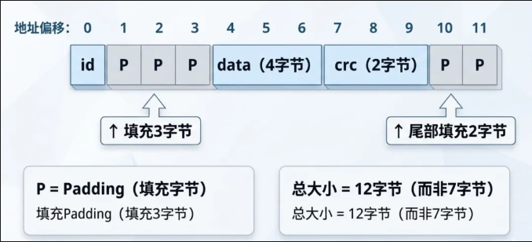

## 软件架构讲解


### MCU驱动程序库
理解`APB`、`AHB`总线架构及其对外设访问的影响，cpu通过总线访问外设寄存器,也就是驱动程序库的底层实现，相当于寄存器的封装，然后把外设的开关打开/关闭，数据的读写等操作封装成函数接口，方便上层应用调用
> 相当于做菜，MCU只是一堆原材料和工具，驱动程序库就是菜谱，告诉你怎么做菜

### Corr层：MCU驱动程序库的封装
Corr层是对MCU驱动程序库的进一步封装，提供更高层次的接口，简化应用开发。它可以包括对多个外设的组合操作、状态管理等功能，使得应用程序可以更方便地使用硬件资源。
> 相当于厨师，厨师根据菜谱（驱动程序库）做出美味的菜肴（Corr层接口），让顾客（应用程序）享用

### BSP层：板级支持包
BSP层是针对特定硬件平台的支持包，包含了对硬件资源的初始化和配置代码。它确保操作系统或应用程序能够正确地运行在特定的硬件平台上。
- 这一层不包含硬件的初始化代码，例如写mpu6050的驱动代码，而是只关心如何初始化这个外设，还有访问mpu6050的接口函数

### OS层：操作系统抽象层
对bsp层的进一步封装，提供操作系统相关的功能，如任务管理、内存管理、时间管理等。它使得应用程序可以独立于底层硬件和操作系统，实现更好的可移植性。
- freeRTOS会影响终中断响应时间，MCU的高优先级中断不会被freeRTOS的调度管理，所以需要BSP层和OS层的结合，不然会对其他中断响应时间有影响
- 可以提供线程安全的接口


### 从字节开始到软件架构

#### 结构体

在C语言当中进行结构体定义，一定是很熟悉的一件事，包括在传统c语言当中写链表，还有才嵌入式当中写queue还有各种外设的最底层的都可以看见结构体

**从基本的问题开始** 结构体是在内存里面是怎么分布的

``` cpp
typdef struct {
    uint8_t id;
    uint32_t data;
    uint16_t crc;
} packet_t;
```
对于这个代码来说对于刚入门的新手工程师，一定是直接计算1+4+2 = 7 字节，但是对于C语言设计者来说，一定是计算结构体的对齐方式，也就是结构体的内存分布，在32位系统中，结构体的对齐方式是4字节对齐，也就是结构体的内存分布是这样的



这样的设计逻辑是为了让32位总线的cpu访问结构体的效率更高，因为32位总线一次可以访问4个字节，这样就可以一次性读取4个字节，而不是每次读取一个字节，这样可以提高读取效率。如果地址没有对齐，可能就需要多花一次总线访问，也就是读取4个字节，而不是读取1个字节。


##### 强制取消对齐

``` cpp
typedef struct __attribute__((packed)) {
    uint8_t id;
    uint32_t data;
    uint16_t crc;
} packet_t;
```

如果结构体需要严格的对齐，可以使用`__attribute__((packed))`来取消对齐，这样结构体的内存分布就变成了这样