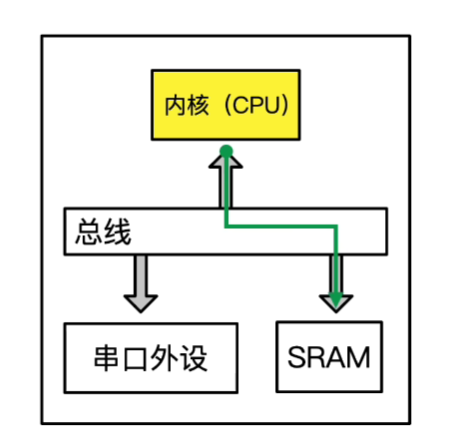
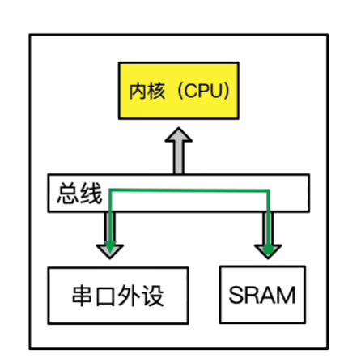
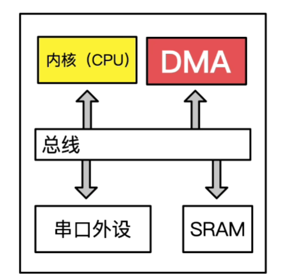
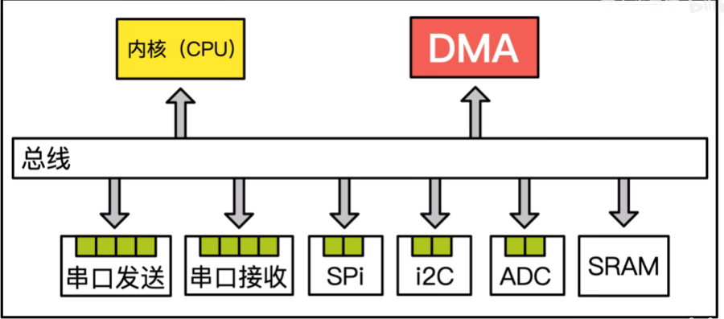
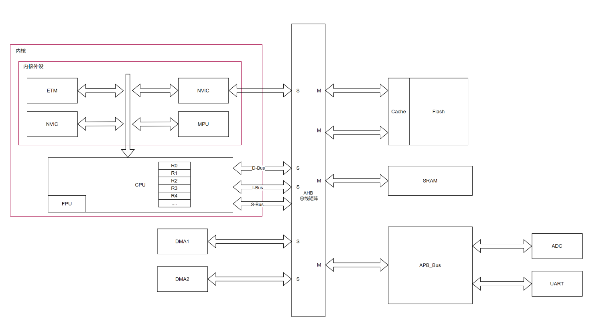
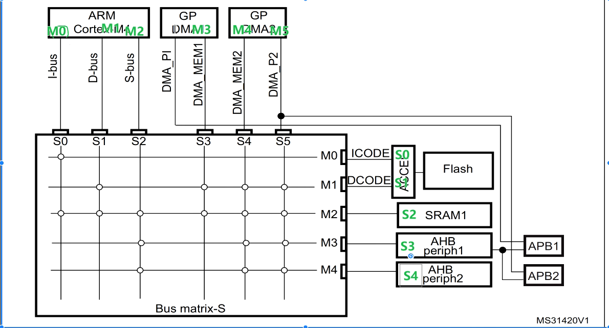
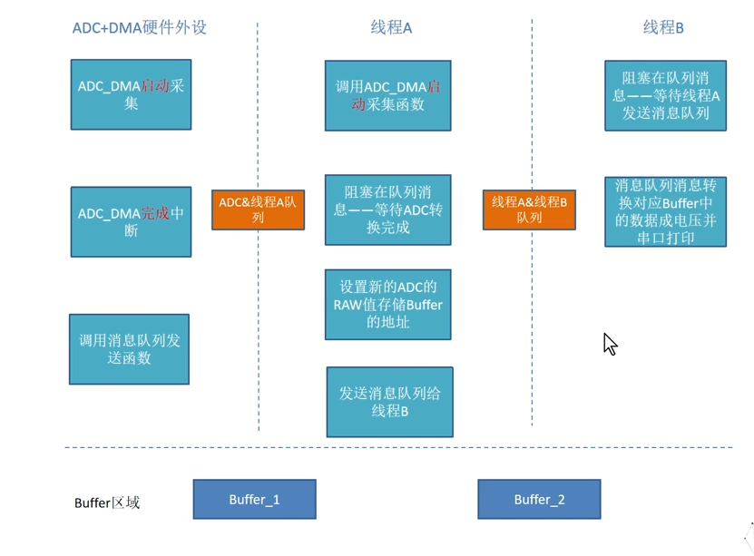
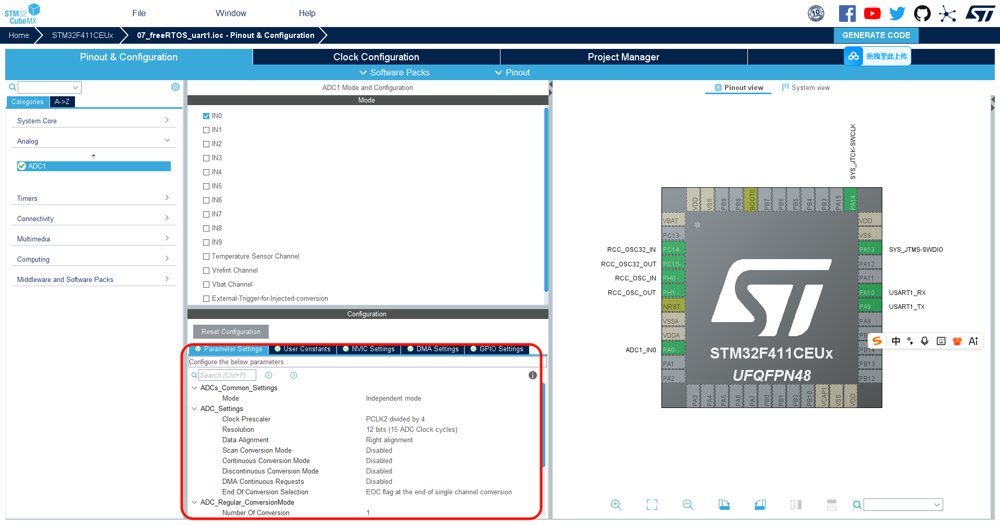
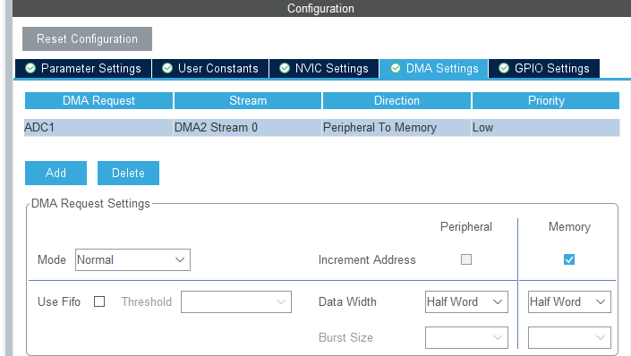
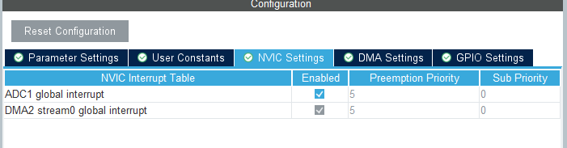

## 理解DMA
DMA（Direct Memory Access，直接内存访问）是一种允许外设直接与系统内存进行数据传输的技术，而无需通过CPU的干预。这种机制极大地提高了数据传输的效率，释放了CPU资源，使其能够处理其他任务。
_工作原理_:
> 在单片机当中,所有的数据都存储在一个叫SRAM的寄存器当中,它是单片机的内存,存储变量的速度极快,当然这几个的操作都需要内核
> cortex-m内核有一个总线矩阵,所有的外设和SRAM都是通过总线矩阵进行数据传输的,当CPU需要和SRAM进行数据传输的时候,它会占用总线矩阵的使用权,进行数据传输



如果发送1字节的数据,可能需要1ms,但是发送10w个数据就需要10s,这导致了cpu的宝贵资源都被浪费在数据传输上,这时候就需要DMA来进行数据传输

_DMA控制器_:直接内存访问,他的作用就是直接访问数据,并且不需要cpu的干预,他可以直接访问SRAM和外设进行数据传输,这样就大大的提高了数据传输的效率,并且释放了cpu的资源;

``` cpp
for(int i=0;i<100000;i++)
{
    data_buf[i]=i; //如果通过cpu进行数据传输,那么cpu就需要进行100000次的读写操作,这样就会浪费大量的cpu资源
}
DMA_PeriAddr
DMA_SramAddr
DMA_Direction
DMA_BufferSize
DMA_Sram+
DMA_Peri+
DMA_Mode
```

只有配置DMA是需要内核参数与的,配置好DMA之后,就可以让DMA进行数据传输了,这样cpu就不需要进行数据传输了,大大的提高了数据传输的效率


## 深入理解DMA原理

cortex内核,内核一般有3根总线,I-bus,D-bus和s-bus



当然,有一个很明显的例子,APB_BUS上的外设,他们的传输速度是跟不上cpu内核的,所以在APB_BUS和AHB_BUS上有个传输桥(APB_AHB_BRIDGE),这个桥的作用就是让APB_BUS上的外设和AHB_BUS上的外设进行数据传输,当然这个桥的传输速度也是跟不上cpu内核的,所以就需要DMA来进行数据传输了

_S口_: 连接S口的一定是一个master 主机
_M口_: 连接M口的一定是一个slave 从机

---
例如ADC 上的DR寄存器有数据产生了,需要放到SRAM上,需要经过APB_AHB_BRIDGE,然后放到cpu上的R0寄存器上,最后在经过S-BUS和AHB到SRAM上,这个过程当中需要cpu大量的读写操作,对于cpu来说这样的操作十分的浪费资源和时间

_LDR->LOAD REGISTER_:加载寄存器,把数据从内存加载到寄存器当中
_STR->STORE REGISTER_:存储寄存器,把数据从寄存器存储到内存当中
>这里执行2条指令,每条指令需要4个时钟周期,总共需要8个时钟周期.

ALU->ARITHMETIC LOGIC UNIT_:算术逻辑单元,负责执行算术和逻辑运算的电路单元
> 它是cpu的核心部分,负责执行各种算术和逻辑操作,如加法,减法,与,但是在数据传输当中,它并不参与数据的传输,所以在数据传输当中,ALU并不工作,这样就浪费了cpu的资源

只有master也就是cpu才有控制AHB总线的权限,那么ALU和FPU都全被浪费了,所以芯片设计工程师就想到了DMA.为了节约成本不在创造一个cpu,而是创造一个DMA控制器,让DMA控制器来进行数据传输,这样就节约了成本,并且提高了数据传输的效率

从架构图上来看,_DMA_ 也是一个master,这样就可以直接的控制AHB总线,直接和SRAM进行数据传输了.那么就可以同时的控制ADC和UART等APB总线上的数据了
当DMA搬运完成了之后会产生一个中断异常,通知cpu数据传输完成了,这样cpu就可以进行下一步的操作了(进行ALU和FPU的运算)

> 例如 0x123 ->0.123V
> 利用ALU或者FPU进行运算

当然利用这种特性,就可以进行很多的操作
例如:ADC采集数据,通过DMA传输到SRAM当中,然后cpu进行运算,最后通过DMA传输到UART当中发送出去
直接控制CR寄存器控制GPIO产生特定的波形
DMA还可以有助于系统实现低功耗,当DMA搬运了一定量的数据,然后再次唤醒cpu进行处理,这样就可以节约大量的功耗

## AHB 总线矩阵
在stm32当中,有很多的总线.包括I-bus,s-bus和D-bus.AHB总线是这3大总线上的座位转运数据的总线.当有数据来临的时候,总线矩阵会根据优先级来进行数据的转运,当cpu需要进行数据传输的时候,总线矩阵会优先让cpu进行数据传输,当DMA需要进行数据传输的时候,总线矩阵会优先让DMA进行数据传输,当外设需要进行数据传输的时候,总线矩阵会优先让外设进行数据传输,这样就保证了数据的高效传输.

I-bus可以通过AH总线达到ICODE上.S-bus也可以通过AHB总线到达到DCODE.memoery access只能访问到flash和data.但是DMA2可以访问很多的外设.
> 例如当前有ADC的中断产生了,然后直接诶的用DMA搬运到SARM然后再由S-bus搬运到应该存储到的寄存器当中去,这是通过AHB总线通过APB上的periph进行数据的传输,总线的贷款压力直接诶的减少,防止总线上仲裁erro.可以占用DMA的架构的优势,实现防止占用DMA的总线

&&Question 1:这里说的不占AHB总线是什么意思
>在这里的所有的数据的传输和流转都需要通过AHB总线,然后通过AHB总线进行转运到sram当中.所以这里的AHB总线一定是会被使用的,只是说的使用dma的方式进行处理,仅仅是对于不用使用cpus上的AHB总线进行仲裁而是直接的进行数据转运.防止总线带宽busy.数据错乱等error问题.

## 利用DMA和USART来搬运数据
> 理解DMA在并行运行的时候运行那一些操作?
> 了解搬运的时间和运行情况
> 直观的感受DMA在搬运的时候在做什么

 

``` cpp
uint8_t uart_rx_buf[10];
HAL_UART_Receive_DMA(&huart1,uart_rx_buf,10); //当有数据产生了,就会直接的搬运到uart_rx_buf当中去,这样就不需要cpu进行数据的搬运了

void HAL_UART_RxCpltCallback(UART_HandleTypeDef *huart)
{
    if(huart->Instance==USART1)
    {
        //当数据搬运完成了之后,就会进入到这个回调函数当中去,这样就可以进行下一步的操作了
    }
}

void PendSV_Handler(void)
{
    //当有数据搬运完成了之后,就会进入到这个回调函数当中去,这样就可以进行下一步的操作了
}
// 中断自动执行的默认函数,直接执行之后进行调用callback函数

void USART1_IRQHandler(void)
{
    //当有数据搬运完成了之后,就会进入到这个回调函数当中去,这样就可以进行下一步的操作了
}
```

> 50x ---> 执行6次汇编
进入到中断,需要先找到中断向量表.如果接收到5个字节就执行temp的回调callback函数,然后翻转执行的函数.
使用DMA可以大大的减少进入中断处理的次数.从而减少进程切换处理的时间,减少time的使用时间.


__&&qustion 2:回调函数在函数调用的时候,是并行计算的么?__
> 1. 首先先理解MCU当中的计算单元不仅仅包含cpu,计算单元是弯针规定门电路设计的逻辑,所以在MCU当中几乎说有的逻辑都是进行运算的,在系统当中有很多的逻辑计算单元,每一个部件都有自己的计算节奏,所以当DMA进行执行的时候是并行的
> 2. 并发在很短的时间内,例如sram和dma和adc通信,直接执行的,这就教并发.在os当中补全的adc和dma与sram的调度的事情在进行的就教并发
> 回到回到函数的的问题,这里就都有可能
> 例如`HAL_ADC_Start_DMA(&hadc1,adc_buf,10);`,这里就表示代码执行完毕了.但是如果有启动的代码例如`i=i+i`cpu就在这里进行加减运算.在执行启动DMA的时候,就实现了并行.当有ADC的数据满了的时候就有`void HAL_ADC_ConvCpltCallback(ADC_HandleTypeDef *hadc)`这个回调函数就会被调用,当有数据搬运完成了之后,就会进入到这个回调函数当中去,这样就可以进行下一步的操作了这一个函数就是回调函数的源码,折柳表示adc的数据表示转化完成,这里就是系统进行并行
> 并发:在task1和task2在短时间内进行了dam搬运的数据的加减的时候再次执行一些其他的操作,例如解包task2的数据,这里的就是并发;

### DMA搬运ADC的数据,实现并行运算,然后通过uart传输到PC上

理解初步的实现和弊端:

> 两个task 不断的进行poling的方式进行轮训buffer的处理,这样是一个理想的状态,但是可能遇到很多问题,1, task2 的打印会花费很多的time,2,task2 可能并没有被操作系统执行,buffer就会被继续填充被卡死到这里,在这里bufer1也许会被同时的读写,此时最好的方式使用互斥信号量,不然可能会被导致buffer错误或者hafzard问题

### 问题

1. 如果有新的数据来临但是task2没有处理完之前的数据怎么办？
>  可能会导致数据丢失,因为新的数据会覆盖掉之前的数据,所以在设计的时候需要考虑到这个问题,可以使用双buffer的方式来进行处理,当一个buffer正在被填充的时候,另一个buffer正在被处理,这样就可以避免数据丢失的问题了

### 代码编写



1. Resolution 代表ADC的分辨率,例如12bit,10bit,8bit等
> 解释:分辨率代表ADC转换的精度,例如12bit的分辨率代表ADC转换的结果是一个12位的二进制数,可以表示0-4095之间的数值,10bit的分辨率代表ADC转换的结果是一个10位的二进制数,可以表示0-1023之间的数值,8bit的分辨率代表ADC转换的结果是一个8位的二进制数,可以表示0-255之间的数值.分辨率越高,ADC转换的结果就越精确,但是也会增加转换的时间和功耗.
2. Data Alignment 代表数据的对齐方式,例如右对齐,左对齐等
3. Scan Conv Mode 代表扫描转换模式,例如单通道,多通道等
4. EOC Selection 代表转换完成的选择,例如单次转换完成,
5. Continuous Conv Mode 代表连续转换模式,例如连续转换,单次转换等
6. Discontinuous Conv Mode 代表不连续转换模式,例如不连续转换,连续转换等
7. DMA Continuous Requests 代表DMA连续请求,例如连续请求,单次请求等





1. 定义两个buffer

用 
``` cpp
/* USER CODE BEGIN PD */
#define ADC_BUFFER_SIZE 1
/*开两个buffer 用做DMA的buffer缓冲区 */
uint32_t * buffer_DMA_1 = NULL;
uint32_t * buffer_DMA_2 = NULL;

/* USER CODE END PD */


void StartDefaultTask(void *argument)
{
  /* USER CODE BEGIN StartDefaultTask */
  /*分配buffer 的大小*/
  buffer_DMA_1 = (uint32_t *)malloc(ADC_BUFFER_SIZE * sizeof(uint32_t));
  buffer_DMA_2 = (uint32_t *)malloc(ADC_BUFFER_SIZE * sizeof(uint32_t));
  if (buffer_DMA_1 == NULL || buffer_DMA_2 == NULL) {
    /* 处理内存分配失败的情况 */
    printf("Failed to allocate memory for DMA buffers\r\n");
    while(1); // 停止程序运行
  }
  else {
    printf("Successfully allocated memory for DMA buffers\r\n");
  }
  /* 初始化buffer的值为0xff,这样就可以很清楚的看到DMA搬运的数据了 */
  memset((void *)buffer_DMA_1,0xff,(unsigned)(sizeof(uint32_t)*ADC_BUFFER_SIZE));
  memset((void *)buffer_DMA_2,0xff,(unsigned)(sizeof(uint32_t)*ADC_BUFFER_SIZE));


  /* Infinite loop */
  for(;;)
  {
    printf("hello world \r\n");
    osDelay(1000);  
  }
  /* USER CODE END StartDefaultTask */
}
```

2. 启动ADC的传输和DMA的传输

ADC1在APB2的在总线上，然后再去AHB上，然后最后去SRAM上，这样只进去1次AHB，这样AHB的带宽就不会被占用太多了

- ADC采样分别放在buffer_DMA_1和buffer_DMA_2当中去,这样就可以实现双buffer的方式来进行处理了

```cpp
/* USER CODE BEGIN Header_StartDefaultTask */
/**
  * @brief  Function implementing the defaultTask thread.
  * @param  argument: Not used
  * @retval None
  */
/* USER CODE END Header_StartDefaultTask */
void StartDefaultTask(void *argument)
{
  /* USER CODE BEGIN StartDefaultTask */
  /*分配buffer 的大小*/
  gp_buffer_DMA_1 = (uint32_t *)malloc(ADC_BUFFER_SIZE * sizeof(uint32_t));
  gp_buffer_DMA_2 = (uint32_t *)malloc(ADC_BUFFER_SIZE * sizeof(uint32_t));
  if (gp_buffer_DMA_1 == NULL || gp_buffer_DMA_2 == NULL) {
    /* 处理内存分配失败的情况 */
    printf("Failed to allocate memory for DMA buffers\r\n");
    while(1); // 停止程序运行
  }
  else {
    printf("Successfully allocated memory for DMA buffers\r\n");
  }

  memset((void *)gp_buffer_DMA_1,0xff,(sizeof(uint32_t)*ADC_BUFFER_SIZE));
  memset((void *)gp_buffer_DMA_2,0xff,(sizeof(uint32_t)*ADC_BUFFER_SIZE));
  printf("Unit_ADC_DMA_Init \r\n");
  /*test_DMA*/
  HAL_StatusTypeDef ret = HAL_OK;
  ret = HAL_ADC_Start_DMA(&hadc1, gp_buffer_DMA_1, ADC_BUFFER_SIZE);
  if (ret != HAL_OK) {
    printf("Failed to start ADC DMA\r\n");
    while(1); // 停止程序运行
  }


  /* Infinite loop */
  // HAL_ADC_MspInit(&hadc1);
  for(;;)
  {
    //printf("hello world \r\n");
    // printf("DMA1_Value: %lu\r\n", gp_buffer_DMA_1[0]);
    osDelay(1000);  
  }
  /* USER CODE END StartDefaultTask */
}

/* Private application code --------------------------------------------------*/
/* USER CODE BEGIN Application */ 
void HAL_ADC_ConvCpltCallback(ADC_HandleTypeDef *hadc)
{
  UNUSED(hadc);
  printf("ADC Conversion Complete Callback\r\n");
  printf("ADC Value: %lu\r\n", gp_buffer_DMA_1[0]);
}

void HAL_ADC_ErrorCallback(ADC_HandleTypeDef *hadc)
{
  UNUSED(hadc);
  printf("ADC Error Callback\r\n");
}
```


3. 发送消息队列给线程

发送消息队列的api
`xQueueSend(queue_handle, &message, portMAX_DELAY);`
接收消息队列的api
`xQueueReceive(queue_handle, &message, portMAX_DELAY);`
创建消息队列的api
`queue_handle = xQueueCreate(queue_length, item_size);`

UintTest Queue send adc value
先做单元测试，测试消息队列的发送和接收功能是否正常，然后再进行后续的操作

``` cpp
    xQueueHandle_t adcQueueHandle;
  /*UnitTest Queue send adc value*/
  {
      adcQueueHandle = xQueueCreate(10, sizeof(uint32_t));
      if(NULL == adcQueueHandle) {
        printf("Failed to create ADC queue\r\n");
        while(1); // 停止程序运行
      }
      else {
        printf("Successfully created ADC queue\r\n");
      }
      /*添加 发送queue和接收*/
      xQueueSend(adcQueueHandle, (void *)gp_buffer_DMA_1, 0);
      uint32_t adcValue;
      if(xQueueReceive(adcQueueHandle, &adcValue, 1000) == pdTRUE) {
        printf("Received ADC value from queue: %lu\r\n", adcValue);
      }
      else {
        printf("Failed to receive ADC value from queue\r\n");
      }
  }

```


``` CPP
/* USER CODE BEGIN Application */ 
void HAL_ADC_ConvCpltCallback(ADC_HandleTypeDef *hadc)
{
  BaseType_t xHigherPriorityTaskWoken = pdFALSE;
  uint32_t adcValue;

  UNUSED(hadc);

  if (adcQueueHandle == NULL) {
    return;
  }

  adcValue = gp_buffer_DMA_1[0];
  gp_buffer_DMA_2[0] = adcValue;

  if (xQueueSendFromISR(adcQueueHandle, &adcValue, &xHigherPriorityTaskWoken) == pdTRUE) {
    /*成功发送消息到队列 */
    portYIELD_FROM_ISR(xHigherPriorityTaskWoken);//如果发送消息后需要切换到更高优先级的任务，则进行上下文切换
  }
}

```


