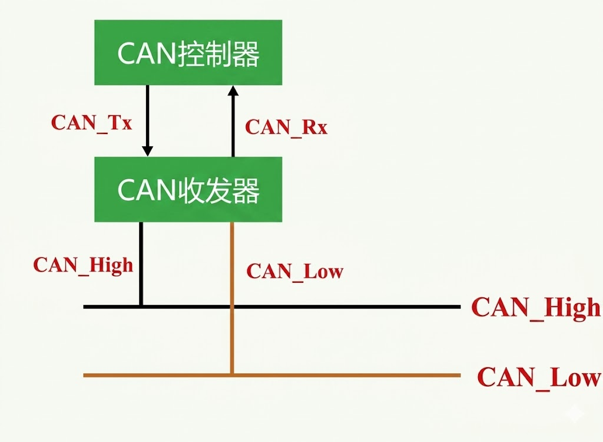
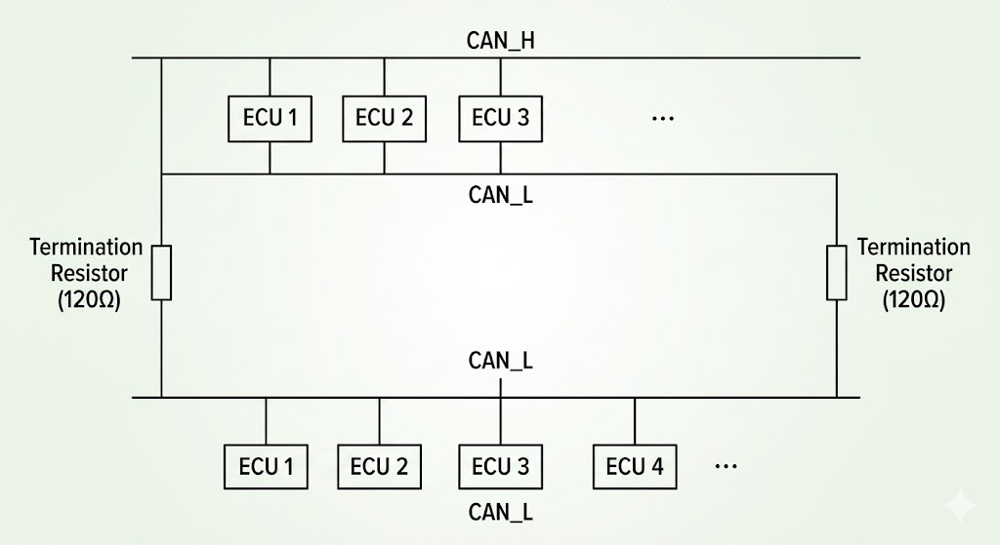

 ### CAN物理连接
 
需要一个CAN收发器来实现CAN总线的物理连接，CAN_higt和CAN_low分别连接到CAN收发器的CAN_H和CAN_L引脚上，CAN收发器将CAN_H和CAN_L上的差分信号转换为单端信号，供微控制器的CAN控制器使用。需要注意的是，CAN总线需要在总线的两端连接终端电阻，以确保信号的稳定性和可靠性。
> 在MCU上有单独的CAN控制器，负责处理CAN协议的帧格式、错误检测和数据传输等功能，而CAN收发器则负责将CAN总线上的差分信号转换为单端信号，供CAN控制器使用。需要注意的是，CAN总线需要在总线的两端连接终端电阻，以确保信号的稳定性和可靠性。

**闭环总线网络**
遵循ISO11898的CAN总线网络必须是一个闭环网络，即总线的两端必须连接终端电阻，以确保信号的稳定性和可靠性。终端电阻通常为120欧姆，连接在总线的两端，以匹配总线的特性阻抗，防止信号反射和干扰，从而提高通信的质量和可靠性。
- 最大传输距离40m
- 通信速度最高1Mbps

**开环总线网络**
开环总线网络是指总线的两端没有连接终端电阻的网络结构。在开环总线网络中，由于缺乏终端电阻，信号在总线上会发生反射和干扰，导致通信质量下降和数据传输错误的增加。因此，开环总线网络不符合ISO11898标准，不适用于CAN总线通信。建议在设计CAN总线网络时，始终使用闭环总线网络结构，以确保通信的稳定性和可靠性。

差分信号
- CAN_High和CAN_Low 是一对差分信号线
- 传统的单端信号传输:一根信号线和一根地线，信号线上的电压相对于地线的电压来表示数据的0和1