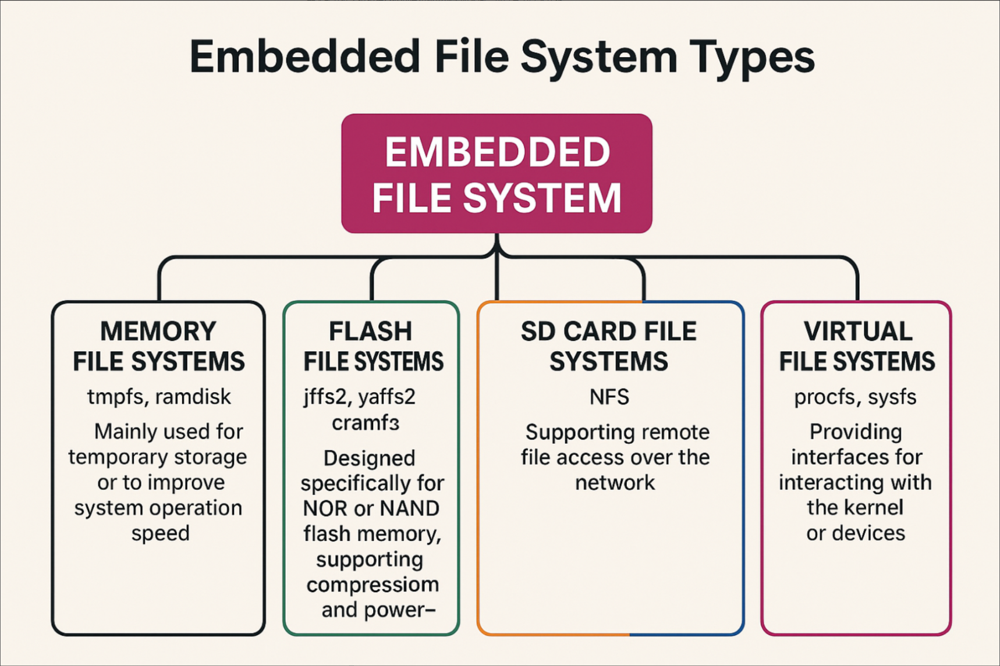
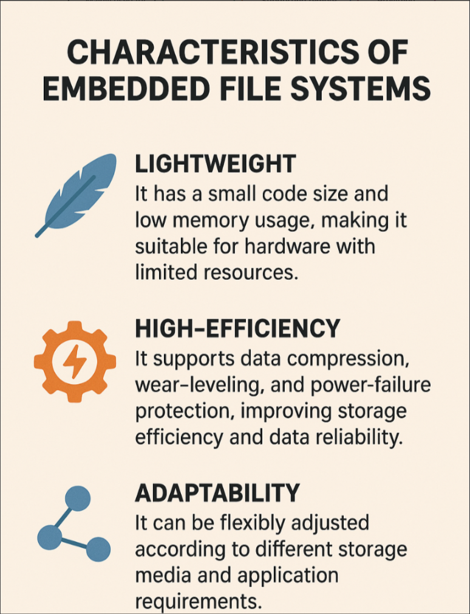
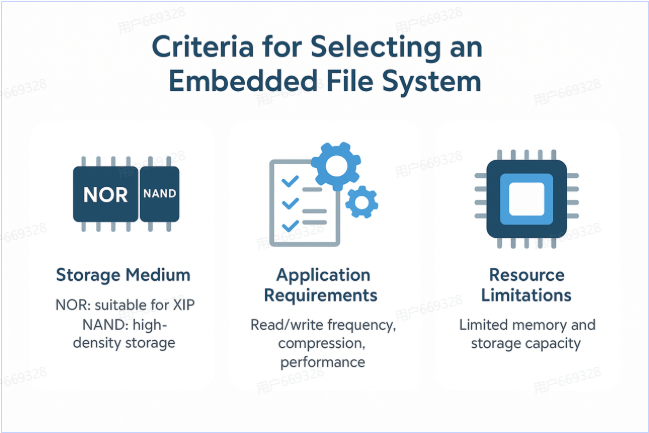
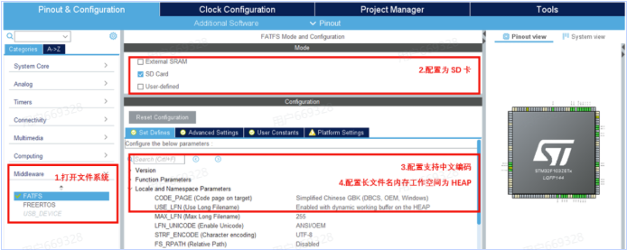

## 文件系统简介
文件系统是操作系统中用于管理和组织存储设备上的数据的一种结构。它提供了一种方式来存储、检索和管理文件和目录，使用户能够方便地访问和操作数据。

### 嵌入式文件系统的类型

嵌入式文件系统根据存储介质和应用需求的不同，可以分为以下几类：
- **内存文件系统**：如rmpfs和ramdisk。主要是用于临时存储数据，速度快但不持久。
- **闪存文件系统**：如FAT、exFAT、NTFS等。适用于SD卡、USB闪存盘等存储设备，具有较好的兼容性和性能。
- **SD卡文件系统**：专门为SD卡设计的文件系统，如FAT32和exFAT，支持大容量存储和快速访问。
- **网络文件系统**：如NFS和SMB/CIFS。用于通过网络访问远程存储设备上的文件，适用于分布式系统和云存储环境。
- **虚拟文件系统**：如procfs和sysfs。用于提供系统信息和状态的虚拟文件系统，通常不存储实际数据。

### 嵌入式文件系统的特点

嵌入式文件系统具有以下特点：
- **轻量级**：设计简洁，资源占用少，适合嵌入式系统的有限资源环境。
- **高效性**：支持数据压缩，磨损平衡和断电保护，以提高性能和可靠性。
- **适应性**：能够适应不同类型的存储介质和应用需求，提供灵活的接口和功能。

#### 选择嵌入式文件系统的标准
- **存储介质类型**：根据使用的存储设备选择合适的文件系统，如SD卡通常使用FAT32或exFAT。
- **应用需求**：根据应用的读写频率、数据量和性能要求选择文件系统，如需要高性能可以选择专门为嵌入式设计的文件系统。
- **资源限制**：考虑系统的内存和处理能力，选择适合的文件系统以避免资源过度消耗。

### STM32CubeMX的FATFS应用

FATFS是一个流行的嵌入式文件系统，广泛应用于STM32微控制器中。它支持FAT12、FAT16和FAT32文件系统，适用于SD卡和USB闪存盘等存储设备。通过STM32CubeMX工具，可以方便地配置和使用FATFS，实现文件的读写操作，满足嵌入式系统对数据管理的需求。

