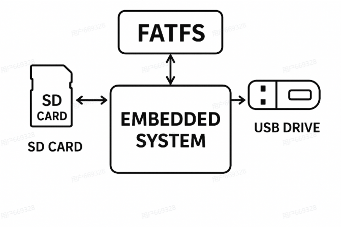
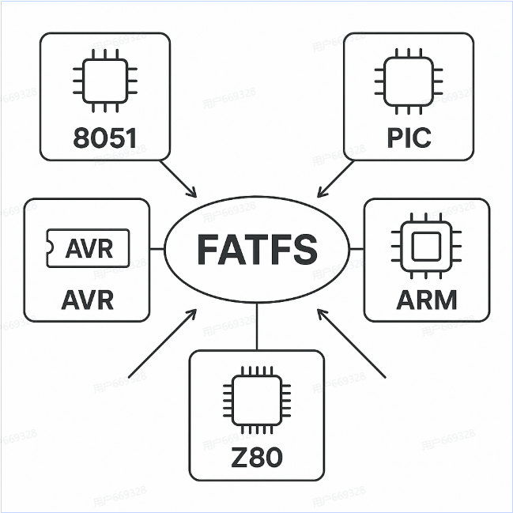
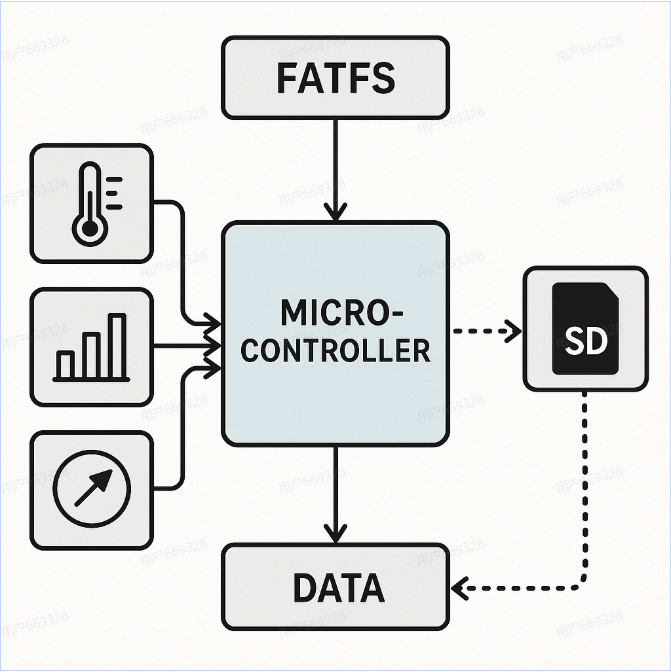
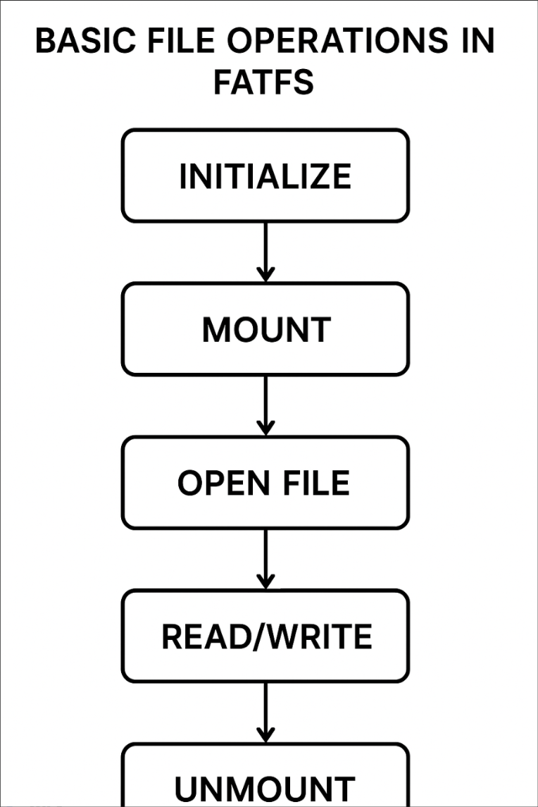

## 学习目标
- 了解FATFS文件系统的基本概念和结构。
- 掌握FATFS的主要特点和优势
- 了解FATFS在嵌入式系统中的应用场景和使用方法。
- 学习FATFS的配置和使用技巧，以便在实际项目中有效地管理文件和数据。
- 通过实践操作，熟悉FATFS的文件读写流程和常见问题的解决方法。

### 什么是FATFS？
FATFS是一种流行的嵌入式文件系统，基于FAT（File Allocation Table）文件系统设计。它支持FAT12、FAT16和FAT32文件系统，适用于SD卡、USB闪存盘等存储设备。FATFS提供了一个简单而高效的接口，使开发者能够方便地进行文件的读写操作，满足嵌入式系统对数据管理的需求。
> 主要是方便和个人电脑交换数据，可以满足用户需求，实现数据的持久化存储，适合于SD卡等存储设备。
 

### FATFS的主要特点和优势

FATFS具有以下主要特点和优势：
- **平台独立性**：FATFS是一个纯C语言实现的文件系统，具有良好的平台独立性，可以在各种嵌入式系统中使用。例如在8051 PIC AVR ARM
- **小内存占用**：FATFS设计简洁，资源占用少，适合嵌入式系统的有限资源环境。例如在STM32中使用FATFS可以节省大量的内存资源。
- **线程安全**：FATFS支持多线程访问，提供了线程安全的接口，确保在多任务环境下数据的一致性和可靠性。例如在RTOS系统中使用FATFS可以保证文件操作的安全性。
- **灵活的接口**：FATFS提供了丰富的API接口，支持文件的创建、删除、读写、重命名等操作，满足不同应用场景的需求。例如在数据记录系统中使用FATFS可以方便地管理和存储数据文件。

### FATFS在嵌入式系统中的应用场景和使用方法
FATFS在嵌入式系统中有广泛的应用场景，主要包括以下几个方面：
- **数据记录**：FATFS可以用于数据记录系统中，方便地管理和存储数据文件。例如在环境监测系统中使用FATFS可以记录传感器数据并保存到SD卡中。
- **IOT设备**：配置文件和日志文件
- **便携式设备**：FATFS适用于便携式设备，如MP3播放器、数码相机等，提供了方便的数据存储和管理功能。例如在数码相机中使用FATFS可以管理照片文件并支持与电脑的文件交换。

### FATFS与其他文件系统的比较
与LittleFS，SPIFFS等其他嵌入式文件系统相比，FATFS具有以下优势：
- **兼容性**：FATFS基于FAT文件系统设计，具有良好的兼容性，可以在各种存储设备上使用。例如在SD卡和USB闪存盘中使用FATFS可以方便地进行数据交换。
- **简单易用**：FATFS提供了丰富的API接口，使用简单，适合初学者和开发者快速上手。例如在STM32CubeMX中配置FATFS可以快速实现文件系统功能。
劣势：
- **缺乏磨损平衡**：FATFS不支持磨损平衡机制，可能会导致存储设备的寿命缩短。例如在频繁写入数据的应用中使用FATFS可能会加速SD卡的磨损。
- **缺乏容错性**：FATFS不具备容错机制，可能会在断电或异常情况下导致数据损坏。例如在电源不稳定的环境中使用FATFS可能会增加数据丢失的风险。

### 在嵌入式系统当中使用FATFS需要进行以下几个步骤：
1. **初始化**：配置存储设备和文件系统
2. **挂载**：将文件系统挂载到系统中，准备进行文件操作使用`f_mount`函数进行挂载。
3. **文件操作**：使用FATFS提供的API接口进行文件的创建、删除、读写等操作。例如使用`f_open`函数打开文件，使用`f_write`函数写入数据。
4. **卸载**：完成文件操作后，使用`f_unmount`函数卸载文件系统，释放资源。
5. 