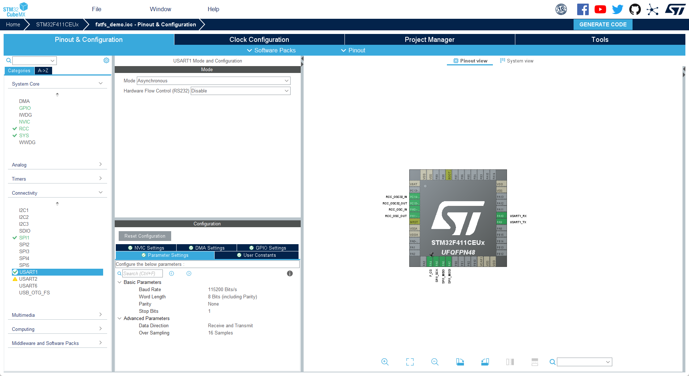
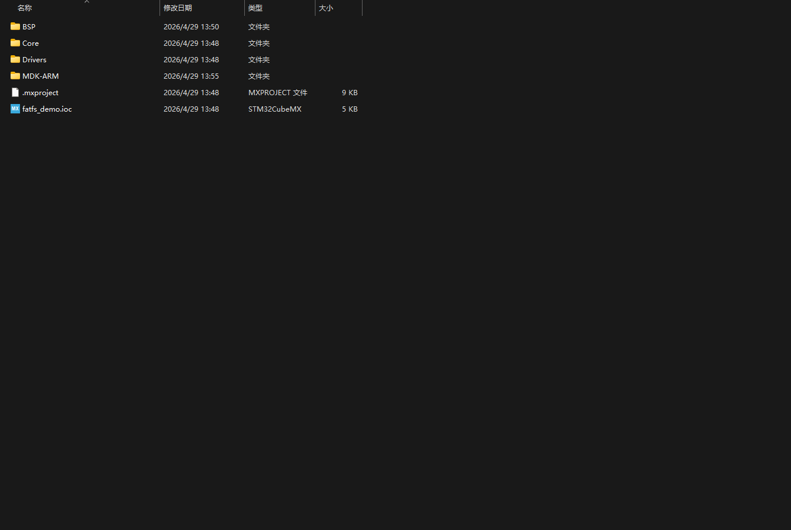

 学习目标
 使用stm32创建一个基于W25Q64的FatFs文件系统，能够进行文件的读写操作。


 # basic 任务
 使用cubemx创建一个SPI的工成

 

 然后创建BSP层，添加W25Q64的驱动代码
 

 在keil当中配置c/c++的inc路径


移植w25q64代码

``` cpp
/* Define to prevent recursive inclusion -------------------------------------*/
#ifndef __W25Q64_H__
#define __W25Q64_H__

#ifdef __cplusplus
extern "C" {
#endif

/* Includes ------------------------------------------------------------------*/
#include "main.h"
#include "stdio.h"
#include "w25q64.h"

#define delay(ms) osDelay(ms)
#define get_tick() HAL_GetTick()

W25Qx_Parameter W25Qx_Para;

/**********************************************************
* @brief  初始化W25QXXXX接口。
* @retval None
**********************************************************/
uint8_t W25Qx_Init(void)
{ 
        uint8_t state;
        /* 重置 W25Qxxx */
        W25Qx_Reset();
        
        state = W25Qx_Get_Parameter(&W25Qx_Para);
        
        return state;
}

/**
  * @brief  此功能重置W25Qx。
  * @retval None
  */
static void        W25Qx_Reset(void)
{
        uint8_t cmd[2] = {RESET_ENABLE_CMD,RESET_MEMORY_CMD};
        
        W25Qx_Enable();
        /* Send the reset command */
        HAL_SPI_Transmit(&hspi1, cmd, 2, W25QXXXX_TIMEOUT_VALUE);        
        W25Qx_Disable();

}

/**
  * @brief  读取W25QXXXX的当前状态。
  * @retval W25QXXXX内存状态
  */
static uint8_t W25Qx_GetStatus(void)
{
        uint8_t cmd[] = {READ_STATUS_REG1_CMD};
        uint8_t status;
        
        W25Qx_Enable();
        
        /* Send the read status command */
        HAL_SPI_Transmit(&hspi1, cmd, 1, W25QXXXX_TIMEOUT_VALUE);        
        /* Reception of the data */
        HAL_SPI_Receive(&hspi1,&status, 1, W25QXXXX_TIMEOUT_VALUE);
        W25Qx_Disable();
        
        /* Check the value of the register */
  if((status & W25QXXXX_FSR_BUSY) != 0)
  {
    return W25Qx_BUSY;
  }
        else
        {
                return W25Qx_OK;
        }                
}

/**
  * @brief  该功能发送一个写使能并等待它生效。
  * @retval None
  */
uint8_t W25Qx_WriteEnable(void)
{
        uint8_t cmd[] = {WRITE_ENABLE_CMD};
        uint32_t tickstart = get_tick();

        /*选择FLASH：片选低 */
        W25Qx_Enable();
        /* 发送读取ID命令 */
        HAL_SPI_Transmit(&hspi1, cmd, 1, W25QXXXX_TIMEOUT_VALUE);        
        /*取消选择FLASH：芯片选择高电平 */
        W25Qx_Disable();
        
        /* 等待Flash写入结束 */
        while(W25Qx_GetStatus() == W25Qx_BUSY)
        {
                /* Check for the Timeout */
    if((get_tick() - tickstart) > W25QXXXX_TIMEOUT_VALUE)
    {        
                        return W25Qx_TIMEOUT;
    }
                HAL_Delay(1);
        }
        
        return W25Qx_OK;
}

/**
  * @brief  阅读制造商/设备ID。
        * @param  返回值地址
/   返回值如下:
/   0XEF13,表示芯片型号为W25Q80   
/   0XEF14,表示芯片型号为W25Q16     
/   0XEF15,表示芯片型号为W25Q32   
/   0XEF16,表示芯片型号为W25Q64  
  * @retval None
  */
void W25Qx_Read_ID(uint16_t *ID)
{
        uint8_t idt[2];
        idt[0]=0x11;
        idt[1]=0x11;
        uint8_t cmd[4] = {READ_ID_CMD,0x00,0x00,0x00};
        
        W25Qx_Enable();
        /* 发送读取ID命令 */
        HAL_SPI_Transmit(&hspi1, cmd, 4, W25QXXXX_TIMEOUT_VALUE);        
        /* 数据接收 */
        HAL_SPI_Receive(&hspi1,idt, 2, W25QXXXX_TIMEOUT_VALUE);

        printf("Flash model parameters: ");
        printf("%X",idt[0]);
        printf("%X\r\n",idt[1]);
        *ID = (idt[0] << 8) + idt[1]; 
        
        W25Qx_Disable();
                
}

#include <math.h>
/**
  * @brief  获取W25QX参数。
  * @param  参数：W25Qx参数
  * @retval 空值
  */
uint8_t W25Qx_Get_Parameter(W25Qx_Parameter *Para)
{
        uint16_t id;
        uint32_t size;
        
        Para->PAGE_SIZE = 256;
        Para->SUBSECTOR_SIZE = 4096;
        Para->SECTOR_SIZE = 0x10000;
        
        W25Qx_Read_ID(&id);
        if(id < W25Q80 || id > W25Q128) return W25Qx_ERROR;
        
        size = (uint32_t) powf(2,(id - 0xEF13)) * 1024 * 1024;
        
        Para->FLASH_ID = id;
        Para->FLASH_SIZE = size;
        Para->SUBSECTOR_COUNT = Para->FLASH_SIZE / Para->SUBSECTOR_SIZE;
        Para->SECTOR_COUNT = Para->FLASH_SIZE / Para->SECTOR_SIZE;
        
        return W25Qx_OK;
}
/**
  * @brief  从QSPI存储器读取大量数据。
  * @param  pData：指向要读取的数据的指针
  * @param  ReadAddr：读取起始地址
  * @param  大小：要读取的数据大小
  * @retval QSPI内存状态
  */
uint8_t W25Qx_Read(uint8_t* pData, uint32_t ReadAddr, uint32_t Size)
{
        uint8_t cmd[4];

        /* Configure the command */
        cmd[0] = READ_CMD;
        cmd[1] = (uint8_t)(ReadAddr >> 16);
        cmd[2] = (uint8_t)(ReadAddr >> 8);
        cmd[3] = (uint8_t)(ReadAddr);
        
        W25Qx_Enable();
        /* 发送读取ID命令 */
        HAL_SPI_Transmit(&hspi1, cmd, 4, W25QXXXX_TIMEOUT_VALUE);        
        /* 数据接收 */
        if (HAL_SPI_Receive(&hspi1, pData,Size,W25QXXXX_TIMEOUT_VALUE) != HAL_OK)
  {
    return W25Qx_ERROR;
  }
        W25Qx_Disable();
        return W25Qx_OK;
}

/**
  * @brief  将大量数据写入QSPI存储器。
  * @param  pData：指向要写入的数据的指针
  * @param  WriteAddr：写入起始地址
  * @param  大小：要写入的数据大小，不超过256byte。
  * @retval QSPI内存状态
  */
uint8_t W25Qx_Write(uint8_t* pData, uint32_t WriteAddr, uint32_t Size)
{
        uint8_t cmd[4];
        uint32_t end_addr, current_size, current_addr;
        uint32_t tickstart = get_tick();
        
        /* Calculation of the size between the write address and the end of the page */
  current_addr = 0;

  while (current_addr <= WriteAddr)
  {
    current_addr += W25QXXXX_PAGE_SIZE;
  }
  current_size = current_addr - WriteAddr;

  /* Check if the size of the data is less than the remaining place in the page */
  if (current_size > Size)
  {
    current_size = Size;
  }

  /* Initialize the adress variables */
  current_addr = WriteAddr;
  end_addr = WriteAddr + Size;
        
  /* Perform the write page by page */
  do
  {
                /* Configure the command */
                cmd[0] = PAGE_PROG_CMD;
                cmd[1] = (uint8_t)(current_addr >> 16);
                cmd[2] = (uint8_t)(current_addr >> 8);
                cmd[3] = (uint8_t)(current_addr);

                /* 启用写操作 */
                W25Qx_WriteEnable();
        
                W25Qx_Enable();
    /* 发送命令 */
    if (HAL_SPI_Transmit(&hspi1,cmd, 4, W25QXXXX_TIMEOUT_VALUE) != HAL_OK)
    {
      return W25Qx_ERROR;
    }
    
    /* 数据传输 */
    if (HAL_SPI_Transmit(&hspi1, pData,current_size, W25QXXXX_TIMEOUT_VALUE) != HAL_OK)
    {
      return W25Qx_ERROR;
    }
                W25Qx_Disable();
            /* 等待Flash写入结束 */
                while(W25Qx_GetStatus() == W25Qx_BUSY)
                {
                        /* 检查超时 */
                        if((get_tick() - tickstart) > W25QXXXX_TIMEOUT_VALUE)
                        {        
                                return W25Qx_TIMEOUT;
                        }
                        //delay(1);
                }
    
    /* 更新地址和大小变量以进行下一页编程 */
    current_addr += current_size;
    pData += current_size;
    current_size = ((current_addr + W25QXXXX_PAGE_SIZE) > end_addr) ? (end_addr - current_addr) : W25QXXXX_PAGE_SIZE;
  } while (current_addr < end_addr);

        
        return W25Qx_OK;
}

/**
  * @brief  擦除QSPI存储器的指定块。
  * @param  BlockAddress：要擦除的块地址
  * @retval QSPI内存状态
  */
uint8_t W25Qx_Erase_Block(uint32_t Address)
{
        uint8_t cmd[4];
        uint32_t tickstart = get_tick();
        cmd[0] = SECTOR_ERASE_CMD;
        cmd[1] = (uint8_t)(Address >> 16);
        cmd[2] = (uint8_t)(Address >> 8);
        cmd[3] = (uint8_t)(Address);
        
        /* Enable write operations */
        W25Qx_WriteEnable();
        
        /*Select the FLASH: Chip Select low */
        W25Qx_Enable();
        /* Send the read ID command */
        HAL_SPI_Transmit(&hspi1, cmd, 4, W25QXXXX_TIMEOUT_VALUE);        
        /*Deselect the FLASH: Chip Select high */
        W25Qx_Disable();
        
        /* Wait the end of Flash writing */
        while(W25Qx_GetStatus() == W25Qx_BUSY)
        {
                /* Check for the Timeout */
    if((get_tick() - tickstart) > W25QXXXX_SECTOR_ERASE_MAX_TIME)
    {        
                        return W25Qx_TIMEOUT;
    }
          //delay(1);
        }
        return W25Qx_OK;
}

/**
  * @brief  擦除整个QSPI存储器。此功能将花费很长时间。
  * @retval QSPI内存状态
  */
uint8_t W25Qx_Erase_Chip(void)
{
        uint8_t cmd[4];
        uint32_t tickstart = get_tick();
        cmd[0] = CHIP_ERASE_CMD;
        
        /* Enable write operations */
        W25Qx_WriteEnable();
        
        /*Select the FLASH: Chip Select low */
        W25Qx_Enable();
        /* Send the read ID command */
        HAL_SPI_Transmit(&hspi1, cmd, 1, W25QXXXX_TIMEOUT_VALUE);        
        /*Deselect the FLASH: Chip Select high */
        W25Qx_Disable();
        
        /* Wait the end of Flash writing */
        while(W25Qx_GetStatus() == W25Qx_BUSY)
        {
                /* Check for the Timeout */
    if((get_tick() - tickstart) > W25QXXXX_BULK_ERASE_MAX_TIME)
    {        
                        return W25Qx_TIMEOUT;
    }
          //delay(1);
        }
        return W25Qx_OK;
}

#ifdef __cplusplus
}
#endif

#endif /* __W25Q64_H__ */

```

 
``` cpp
/* Define to prevent recursive inclusion -------------------------------------*/
#ifndef __W25QXX_H
#define __W25QXX_H

#ifdef __cplusplus
 extern "C" {
#endif 

/* Includes ------------------------------------------------------------------*/
#include "main.h"

#include "spi.h"
//#include "cmsis_os.h"         
/** @addtogroup BSP
  * @{
  */ 

/** @addtogroup Components
  * @{
  */ 
  
/** @addtogroup W25QXXXX
  * @{
  */

/** @defgroup W25QXXXX_Exported_Types
  * @{
  */
   
/**
  * @}
  */ 

/** @defgroup W25QXXXX_Exported_Constants
  * @{
  */
   
/** 
  * @brief  W25QXX Configuration  
  */  
        
/* W25Q32 */
#define W25QXXXX_FLASH_SIZE                  0x0400000 /* 32 MBits => 4MBytes */
#define W25QXXXX_SECTOR_COUNT                0x40      /* 64 sectors of 64KBytes */
#define W25QXXXX_SECTOR_SIZE                 0x10000   /* 64 sectors of 64KBytes */
#define W25QXXXX_SUBSECTOR_COUNT             0x0400    /* 1024 subsectors of 4kBytes */
#define W25QXXXX_SUBSECTOR_SIZE              0x1000    /* 1024 subsectors of 4kBytes */
#define W25QXXXX_PAGE_SIZE                   0x100     /* 16384 pages of 256 bytes */

#define W25Q80  0XEF13
#define W25Q16  0XEF14
#define W25Q32  0XEF15
#define W25Q64  0XEF16
#define W25Q128 0XEF17

#define W25QXXXX_DUMMY_CYCLES_READ           4
#define W25QXXXX_DUMMY_CYCLES_READ_QUAD      10

#define W25QXXXX_BULK_ERASE_MAX_TIME         250000
#define W25QXXXX_SECTOR_ERASE_MAX_TIME       3000
#define W25QXXXX_SUBSECTOR_ERASE_MAX_TIME    800
#define W25QXXXX_TIMEOUT_VALUE 1000

/** 
  * @brief  W25QXX Commands  
  */  
/* 重置操作 */
#define RESET_ENABLE_CMD                     0x66
#define RESET_MEMORY_CMD                     0x99

#define ENTER_QPI_MODE_CMD                   0x38
#define EXIT_QPI_MODE_CMD                    0xFF

/* 识别作业 */
#define READ_ID_CMD                          0x90
#define DUAL_READ_ID_CMD                     0x92
#define QUAD_READ_ID_CMD                     0x94
#define READ_JEDEC_ID_CMD                    0x9F

/* Read Operations */
#define READ_CMD                             0x03
#define FAST_READ_CMD                        0x0B
#define DUAL_OUT_FAST_READ_CMD               0x3B
#define DUAL_INOUT_FAST_READ_CMD             0xBB
#define QUAD_OUT_FAST_READ_CMD               0x6B
#define QUAD_INOUT_FAST_READ_CMD             0xEB

/* Write Operations */
#define WRITE_ENABLE_CMD                     0x06
#define WRITE_DISABLE_CMD                    0x04

/* Register Operations */
#define READ_STATUS_REG1_CMD                  0x05
#define READ_STATUS_REG2_CMD                  0x35
#define READ_STATUS_REG3_CMD                  0x15

#define WRITE_STATUS_REG1_CMD                 0x01
#define WRITE_STATUS_REG2_CMD                 0x31
#define WRITE_STATUS_REG3_CMD                 0x11


/* Program Operations */
#define PAGE_PROG_CMD                        0x02
#define QUAD_INPUT_PAGE_PROG_CMD             0x32


/* Erase Operations */
#define SECTOR_ERASE_CMD                     0x20
#define CHIP_ERASE_CMD                       0xC7

#define PROG_ERASE_RESUME_CMD                0x7A
#define PROG_ERASE_SUSPEND_CMD               0x75


/* Flag Status Register */
#define W25QXXXX_FSR_BUSY                    ((uint8_t)0x01)    /*!< busy */
#define W25QXXXX_FSR_WREN                    ((uint8_t)0x02)    /*!< write enable */
#define W25QXXXX_FSR_QE                      ((uint8_t)0x02)    /*!< quad enable */


#define W25Qx_Enable()                         HAL_GPIO_WritePin(F_CS_GPIO_Port, F_CS_Pin, GPIO_PIN_RESET)
#define W25Qx_Disable()                 HAL_GPIO_WritePin(F_CS_GPIO_Port, F_CS_Pin, GPIO_PIN_SET)

#define W25Qx_OK            ((uint8_t)0x00)
#define W25Qx_ERROR         ((uint8_t)0x01)
#define W25Qx_BUSY          ((uint8_t)0x02)
#define W25Qx_TIMEOUT                                ((uint8_t)0x03)

typedef struct
{
        uint32_t FLASH_ID;
        uint32_t FLASH_SIZE;
        uint32_t SECTOR_COUNT;
        uint32_t SECTOR_SIZE;
        uint32_t SUBSECTOR_COUNT;
        uint32_t SUBSECTOR_SIZE;
        uint32_t PAGE_SIZE;
}W25Qx_Parameter;
extern W25Qx_Parameter W25Qx_Para;

uint8_t W25Qx_Init(void);
static void        W25Qx_Reset(void);
static uint8_t W25Qx_GetStatus(void);
uint8_t W25Qx_WriteEnable(void);
void W25Qx_Read_ID(uint16_t *ID);
uint8_t W25Qx_Read(uint8_t* pData, uint32_t ReadAddr, uint32_t Size);
uint8_t W25Qx_Write(uint8_t* pData, uint32_t WriteAddr, uint32_t Size);
uint8_t W25Qx_Erase_Block(uint32_t Address);
uint8_t W25Qx_Erase_Chip(void);

uint8_t W25Qx_Get_Parameter(W25Qx_Parameter *Para);
/**
  * @}
  */
  
/** @defgroup W25QXXXX_Exported_Functions
  * @{
  */ 
/**
  * @}
  */ 
      
/**
  * @}
  */ 

/**
  * @}
  */ 

/**
  * @}
  */
  
#ifdef __cplusplus
}
#endif

#endif /* __W25Qx_H */


```

移植完成后之后就可以进行编写`Unit test`了，编写一个测试函数，测试w25q64的读写功能
