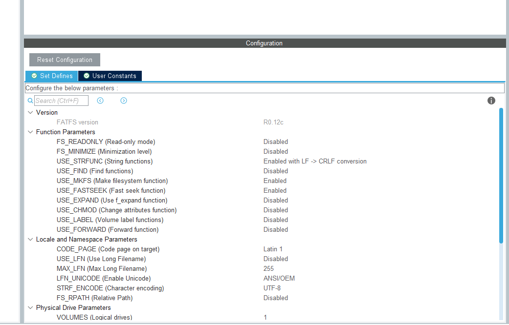
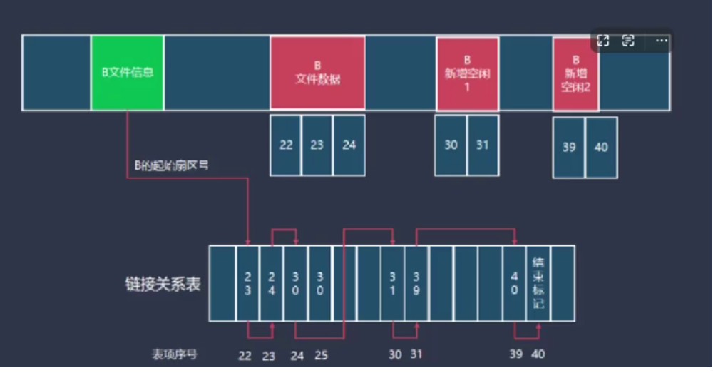
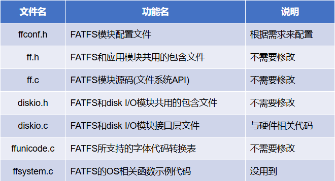
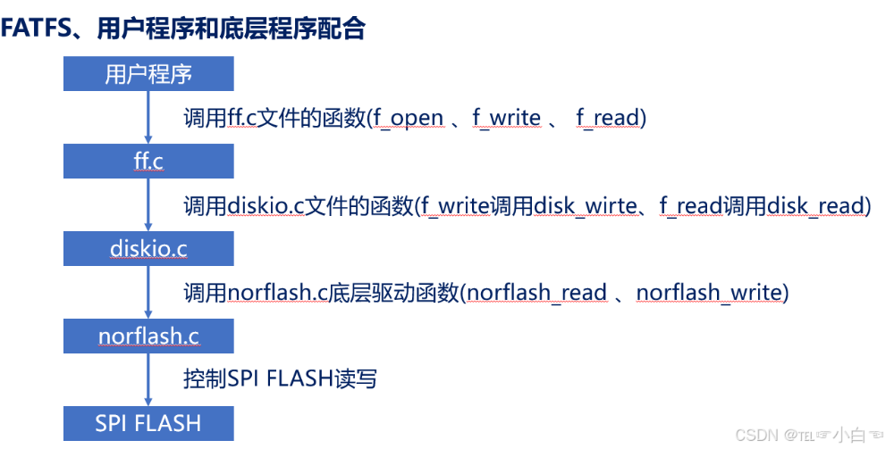

### 功能参数

当前的功能参数是指在使用FatFs文件系统时，可以通过设置不同的参数来调整文件系统的行为和性能。以下是一些常见的功能参数：
- string function
- find 文件系统扫描和搜索用的，精简代码
- mkfs 格式化函数 ，希望在运行的时候在分区进行格式化，在首次挂载的时候进行格式化
- expand 文件拓展函数，用于分配文件空间
- chmod 启动文件属性 read wrtie time 
- lable 卷标函数 
- forward 启用或者禁用的转发函数

### 区域和命名空间
在使用FatFs文件系统时，功能参数通常被组织在特定的区域和命名空间中，以便于管理和调用。这些区域和命名空间可以帮助开发者更好地理解和使用不同的功能参数。例如：
- CODE_PAGE 代码页设置参数，用于指定文件系统使用的字符编码。
- USE_LEF  长文件名支持参数，用于启用或禁用长文件名的支持。

### FAT卷
一个和fat 文件系统被称为一个卷或者逻辑驱动器，例如计算机上的C盘和D盘
一个FAT 卷包含3个或者4个区域，分别是引导扇区、FAT表、根目录区和数据区。

- 引导扇区：包含了卷的引导信息和文件系统的基本参数。
- FAT表：文件分配表，用于记录文件在数据区中的分配情况，文件存储中的簇与簇的连接信息
- 根目录区：存储文件和目录的基本信息，如文件名、属性、时间戳等。
- 数据区：实际存储文件数据的区域，文件内容被分割成一个个簇（cluster）存储在数据区中，FAT表记录了这些簇的分配情况。

### 扇区和簇
- 扇区（Sector）：是磁盘存储的基本单位，通常为512字节。每个扇区可以存储一个文件系统的基本数据结构，如引导扇区、FAT表项、目录项等。
- 一个卷的数据区可以分为多个簇（Cluster），每个簇由一个或多个连续的扇区组成。簇是文件系统管理文件存储的基本单位，文件系统通过FAT表来管理簇的分配和连接关系。每个文件占用一个或多个簇，FAT表记录了这些簇的分配情况和连接关系，以便于文件系统能够正确地读取和写入文件数据。

> 注意：FAT文件系统的性能和效率与簇的大小密切相关，较大的簇可以减少FAT表的大小，但可能会导致磁盘空间的浪费；较小的簇可以提高存储效率，但可能会增加FAT表的大小和管理复杂度。因此，在使用FatFs文件系统时，选择合适的簇大小是非常重要的。

fatfs是小端序的，如果cpu是大端序的，需要进行字节序转换，fatfs提供了相关的函数来处理这种情况，以确保在不同平台上的兼容性和正确性。

### 文件系统的存储

在每个文件在存储的时候，占用数据区里面的一个或者多个簇，在文件分配存储空间时候，文件占用的簇不一定是连续的，文件的数据簇是在文件系统以链表的形式存储在fat表中管理的

FATFS层次结构图
1. 底层接口
2. FATFS核心层
> 实现FAT文件的read和write功能，文件系统的核心功能
3. 应用层接口

FATFS文件系统需要修改两个文件，分别是ffconf.h和diskio.c

