![[Pasted image 20260512180338.png]]
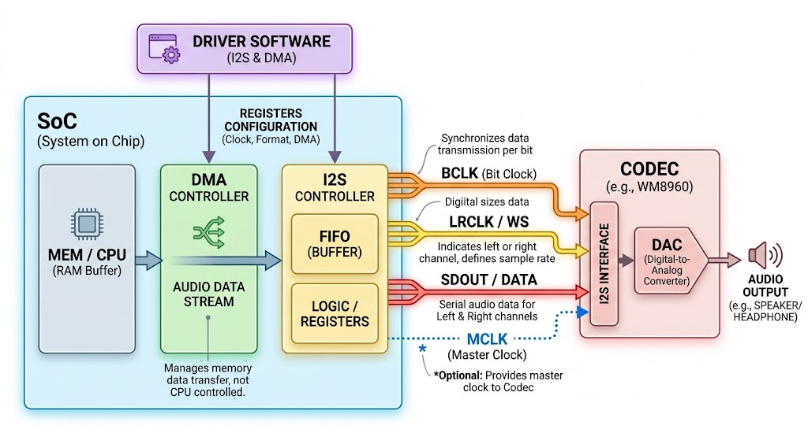

## I2S
I2S的全称是Inter-IC Sound，是一种串行总线协议，用于连接数字音频设备，例如数字麦克风、数字音频放大器等。I2S协议定义了数据传输的格式和时序，使得不同厂商的数字音频设备能够互相兼容。I2S协议使用**三条线进行数据传输：时钟线（SCK）、数据线（SD）和帧同步线（WS）**。时钟线用于提供数据传
输的时钟信号，数据线用于传输音频数据，帧同步线用于指示数据的开始和结束。I2S协议支持多种数据格式，例如16位、24位和32位音频数据，并且可以支持多声道音频传输。I2S协议广泛应用于数字音频设备中，例如智能手机、平板电脑、数字音频播放器等。

## 物理特性
- MCLK ：主时钟信号（MCLK）是I2S协议中的一个重要信号线，用于提供系统的主时钟信号。MCLK信号由主设备生成，并且通常具有较高的频率，例如12.288 MHz或24.576 MHz。MCLK信号用于为I2S系统中的其他时钟信号提供参考，例如串行时钟（SCK）和帧同步信号（WS）。MCLK信号的稳定性对于确保整个I2S系统的正常运行非常重要，因此在设计I2S系统时需要仔细选择时钟源和时钟分频器，以确保MCLK信号的质量和稳定性。
- Sclk：串行时钟信号（SCK）是I2S协议中的一个重要信号线，用于提供数据传输的时钟信号。SCK信号由主设备（通常是音频处理器或微控制器）生成，并且在数据传输过程中保持稳定的频率。SCK信号的频率决定了数据传输的速率，通常以赫兹（Hz）为单位表示。例如，如果SCK的频率为44.1 kHz，那么每秒钟可以传输44100个音频样本。SCK信号的稳定性对于确保数据传输的准确性和可靠性非常重要，因此在设计I2S系统时需要仔细考虑时钟源和时钟分频器的选择。
- WS：帧同步信号（WS）是I2S协议中的一个重要信号线，用于指示数据的开始和结束。WS信号由主设备生成，并且在数据传输过程中保持稳定的频率。WS信号的频率通常与串行时钟（SCK）的频率相关，例如，如果SCK的频率为44.1 kHz，那么WS的频率通常为44.1 kHz或22.05 kHz，具体取决于数据传输的格式和声道数。WS信号的稳定性对于确保数据传输的准确性和可靠性非常重要，因此在设计I2S系统时需要仔细考虑时钟源和时钟分频器的选择，以确保WS信号的质量和稳定性。
- SD：数据线（SD）是I2S协议中的一个重要信号线，用于传输音频数据。SD信号由主设备生成，并且在数据传输过程中保持稳定的时序。SD信号的时序通常与串行时钟（SCK）和帧同步信号（WS）的时序相关，例如，如果SCK的频率为44.1 kHz，那么SD的时序通常为每个SCK周期传输一个音频样本，具体取决于数据传输的格式和声道数。SD信号的稳定性对于确保数据传输的准确性和可靠性非常重要，因此在设计I2S系统时需要仔细考虑时钟源和时钟分频器的选择，以确保SD信号的质量和稳定性。
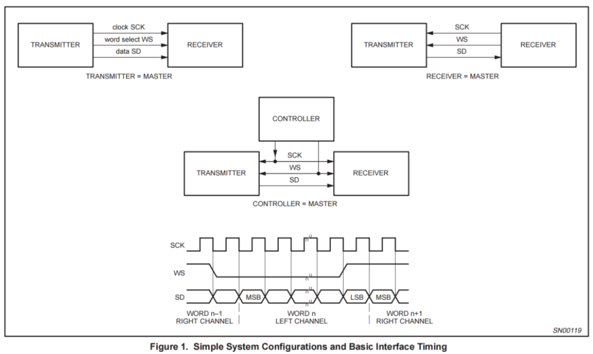
### IS的数据格式
随着计算的发展，在统一的I2S的硬件接口下，出现了很多种不同的I2S数据格式，可以分为： I2S Philips标准，左对齐(MSB)标准和右对齐(LSB)标准。
发送端盒接收端必须使用相同的数据格式，否则就会出现数据错位的问题，例如发送端使用的是I2S Philips标准，而接收端使用的是左对齐(MSB)标准，那么接收端就会把发送端的第一个音频样本的最高位当做帧同步信号（WS）的开始，导致数据错位的问题。因此，在设计I2S系统时需要仔细选择数据格式，并且确保发送端和接收端使用相同的数据格式，以确保数据传输的准确性和可靠性。
#### I2S Philips标准
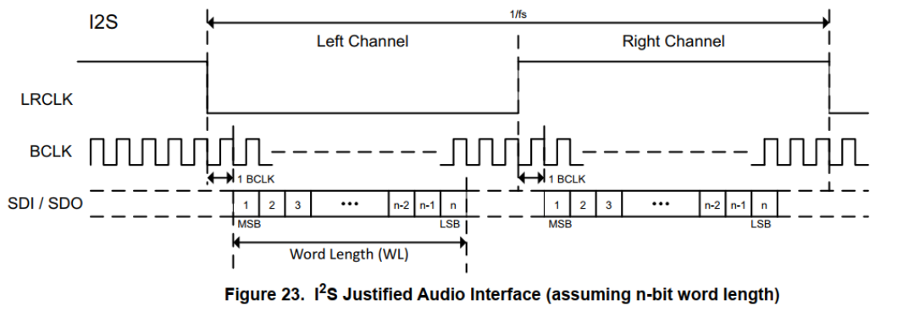
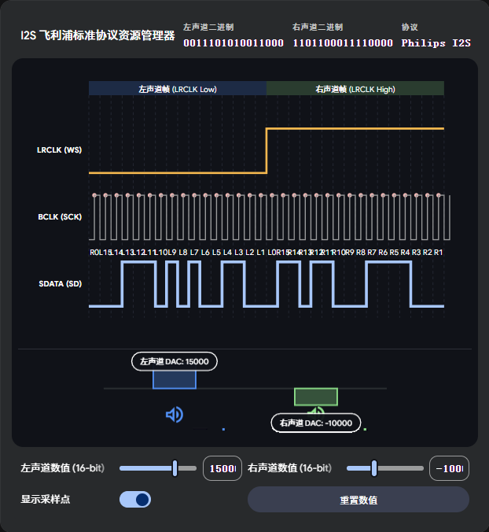

#### 左对齐(MSB)标准
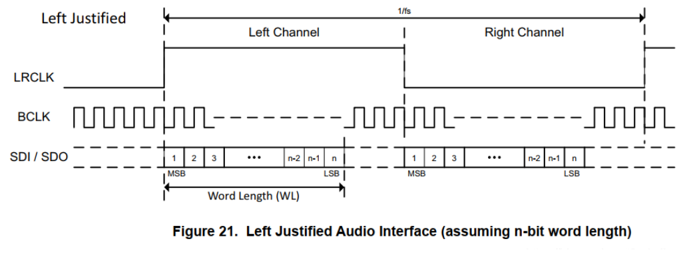

该标准比较少用，在LRCLk发送偏转的是红红同事传输数据，LRCLK==等于1 的时候是左声道数据，LRCLK等于==0 的时候是右声道数据，数据的最高位在第一个时钟周期传输，最低位在最后一个时钟周期传输。

#### 右对齐(LSB)标准
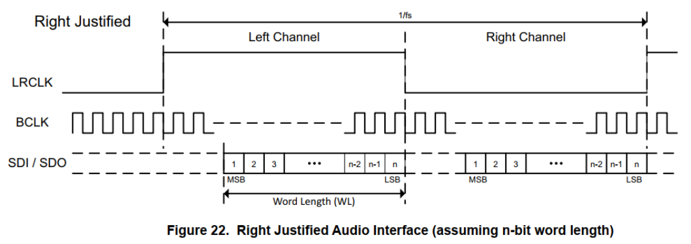

声音数据LSB传输完成的同时，LRCLK完成二次偏转，

### I2S的demo 
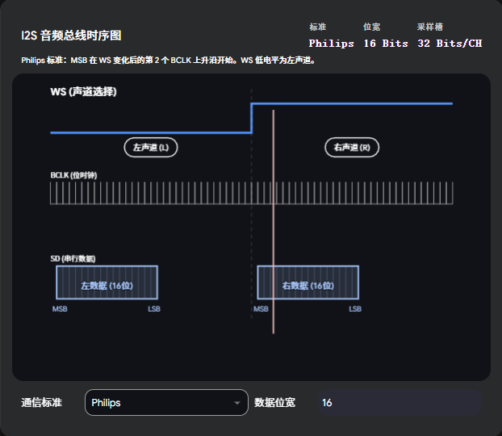
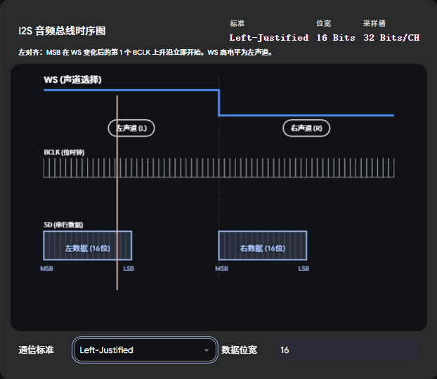
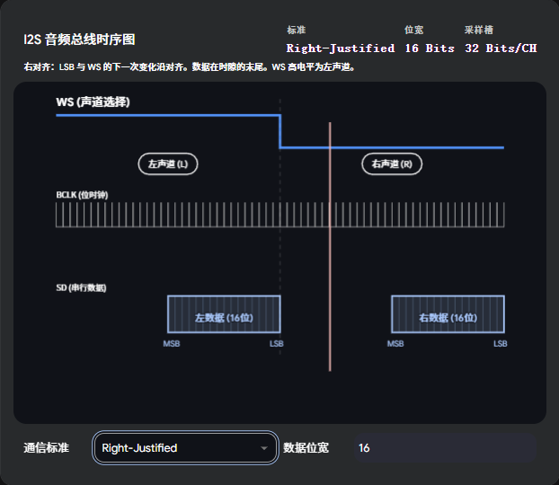
### 嵌入式开发的典型架构
在嵌入式系统中，音频数据量非常的大，如果依靠cpu去每产生一个数据就出发一次中断去搬运，那么cpu就会被完全的榨干，因此I2S的灵魂就是在于使用DMA去搬运数据，以及ping-pong buffer（双缓冲）去实现数据的连续搬运，保证音频数据的连续性和稳定性。

1. 内存分配(双缓冲区)：在内存中分配两个缓冲区，分别用于存储当前正在播放的数据和即将要播放的数据。当一个缓冲区正在被DMA搬运数据时，另一个缓冲区可以被CPU填充新的音频数据。
2. DMA启动：在I2S外设中配置DMA控制器，设置DMA的源地址为当前正在播放的缓冲区，目的地址为I2S外设的数据寄存器，并且设置DMA的传输大小为缓冲区的大小。
3. DMA传输：当DMA启动后，DMA控制器会自动从当前正在播放的缓冲区搬运数据到I2S外设的数据寄存器中，直到整个缓冲区的数据被搬运完成。
4. 中断处理：当DMA搬运完成后，DMA控制器会触发一个中断，CPU会进入中断服务函数，在中断服务函数中，CPU会切换到另一个缓冲区，并且重新配置DMA控制器，设置DMA的源地址为新的缓冲区，目的地址为I2S外设的数据寄存器，并且设置DMA的传输大小为缓冲区的大小。这样就实现了数据的连续搬运，保证了音频数据的连续性和稳定性。

### 步骤拆解

- step 1：gpio配置
> 蒋对应的引脚配置为复用功能，推挽输出，高数率，需要配置BCLK,WS,SD。如果外部的codec需要主时钟，还需要配出MCLK

- step 2：外设时钟配置
> 需要给I2S外设提供时钟信号，通常是通过系统时钟或者外部晶振来提供的。需要根据具体的芯片和应用需求来选择合适的时钟源，并且配置时钟分频器以满足I2S协议的时序要求。

- step 3：I2S外设配置
> 需要配置I2S外设的工作模式（主模式或从模式）、数据格式（I2S Philips标准、左对齐标准或右对齐标准）、采样率、声道数等参数，以确保I2S外设能够正确地传输音频数据。
- step 4：DMA配置
> 需要配置DMA控制器的源地址、目的地址、传输大小等参数，以确保DMA能够正确地搬运音频数据到I2S外设的数据寄存器中。
- step 5：启动传输
> 先使能I2S外设，然后启动DMA传输，确保音频数据能够连续地搬运到I2S外设中进行播放。

### PCM脉冲编码调制
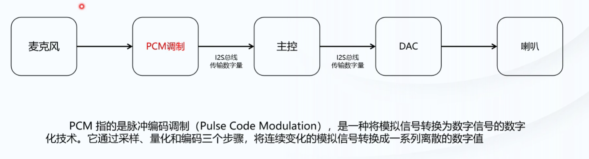
PCM（Pulse Code Modulation）是一种数字音频编码方式，用于将模拟音频信号转换为数字信号。PCM通过对模拟信号进行采样和量化来实现数字化。采样是指在一定时间间隔内对模拟信号进行测量，量化是指将测量结果转换为离散的数字值。PCM编码的音频数据通常以二进制形式存储，每个采样点对应一个数字值，表示该时刻的音频信号强度。PCM编码的音频数据可以通过I2S协议进行传输和处理，在数字音频设备中广泛应用，例如CD、DVD、数字音频播放器等。
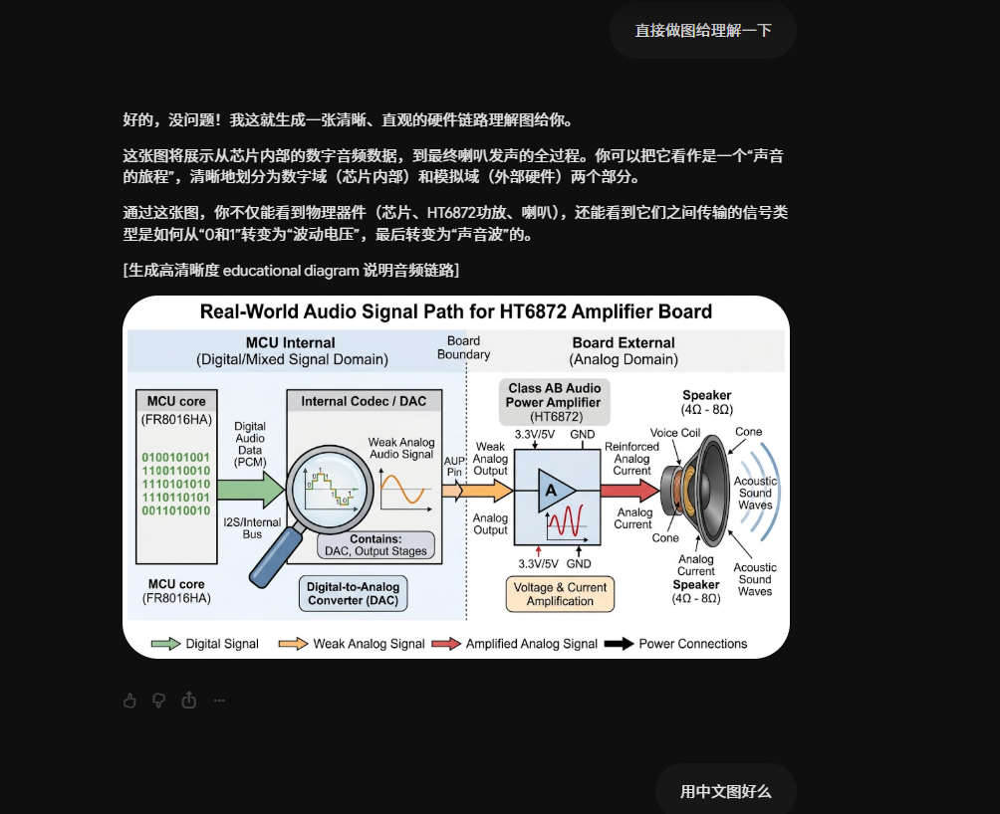

### ESP32编写I2S驱动
ESP32提供了丰富的I2S外设接口，可以通过ESP-IDF框架来编写I2S驱动程序。

ns4168
这个芯片是一个音频编解码器（Codec），它支持多种音频输入和输出接口，包括I2S接口。ns4168芯片可以用于音频处理和传输，例如在智能音箱、数字音频播放器等设备中使用。通过配置ns4168芯片的寄存器，可以实现对音频数据的采样率、位深度、声道数等参数的设置，以满足不同应用的需求。

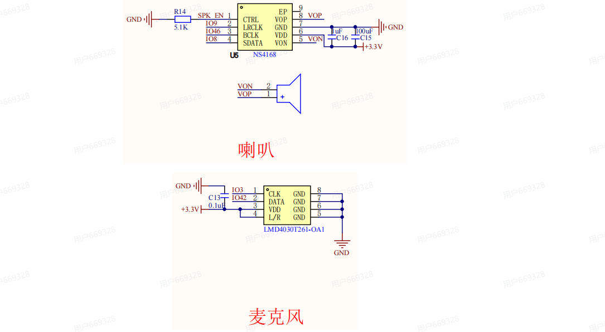