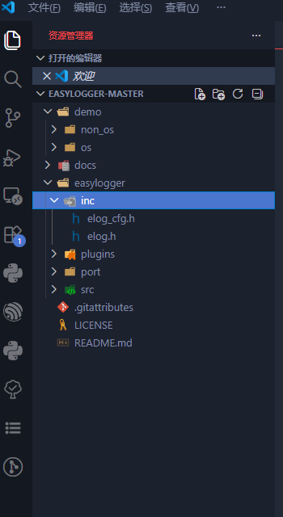
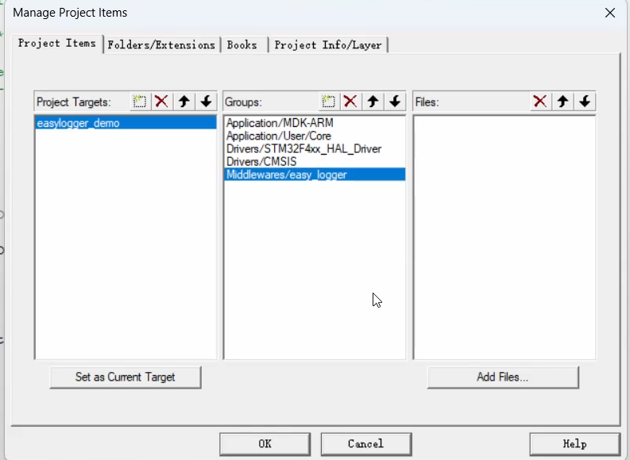
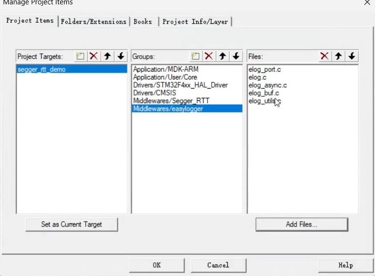

## 日志

日志是软件开发中非常重要的一部分，它可以帮助开发者了解程序的运行状态、调试问题以及记录重要事件。在嵌入式开发中，日志同样扮演着重要的角色，因为嵌入式系统通常资源有限，调试困难，日志可以提供宝贵的信息。


### easy_log
easy_log是一个轻量级的日志库，适用于嵌入式系统。它提供了简单的接口来记录日志信息，并且支持不同的日志级别（如DEBUG、INFO、WARN、ERROR）。easy_log可以帮助开发者更好地管理和输出日志信息，提高调试效率。
[easy_log](https://github.com/armink/EasyLogger)

#### easy_log的目录

easy_log的目录结构如下：


在inc目录下的elog.h定义了不同的info日志级别的输出接口，在elog_cfg.h异步输出和缓冲区的大小等。在之类主要是提供了一个标准化的接口，不用关注底层

port目录下定义了不同平台的日志输出接口，例如在stm32f4xx_port.c中定义了基于串口的日志输出接口。

plugins目录下定义了不同的日志输出插件，例如在elog_async.c中定义了基于异步输出的日志插件。还可以再数据到flash或者sd卡等。


#### easy_log的移植

1. 在git上donwload easy_log的源码
2. 将easy_log的源码添加到项目中
3. 在项目当中创建一个Middlewares目录，并将easy_log的源码放入其中
4. 实现一个串口的重定向

``` cpp
#include "elog.h"
#include "usart.h"
PUTCHAR_PROTOTYPE
{
    /* Place your implementation of fputc here */
    /* e.g. write a character to the USART */
    /* For example: */
    HAL_UART_Transmit(&huart1, (uint8_t *)&ch, 1, 0xFFFF);
    
    return ch;
}
```

5. 在keil 里面添加easy_log的头文件路径和源文件路径


把所有的.c和.h文件都添加到工程当中

> 在C++里面添加.h的和.cpp的文件路径

#### 接口移植
在elog.c 当中定义一下ELG_LVL等的info日志界别

进入`elog_cfg.h`当中定义一下日志输出的接口，例如：

``` cpp
void elog_port_output(const char *log, size_t size);
```

log 是指的是日志内容，size是日志内容的大小

``` cpp
#include "stdio.h"

void elog_port_output(const char *log, size_t size)
{
    /* Place your implementation of output log here */
    /* e.g. write a character to the USART */
    /* For example: */
    printf("%.*s", size, log);
}
```

在这个函数当中实现日志输出的接口，例如使用printf函数将日志输出到串口或者其他设备上。

``` cpp

void elog_port_output_lock(void)
{
    /* Place your implementation of lock here */
    /* e.g. disable interrupt */
    disable_interrupt();
}

void elog_port_output_unlock(void)
{
    /* Place your implementation of unlock here */
    /* e.g. enable interrupt */
    enable_interrupt();
}
```

在多线程环境下，日志输出可能会被多个线程同时调用，因此需要实现锁机制来保证日志输出的线程安全。在elog_port_output_lock函数当中实现锁定机制，例如禁用中断或者使用互斥锁等。在elog_port_output_unlock函数当中实现解锁机制，例如启用中断或者释放互斥锁等。


``` cpp
/**
 * @brief Get current time
 */
void elog_port_output_time(void)
{
    /* Place your implementation of get time here */
    /* e.g. get current time */
    get_current_time();
}

```

在日志输出中，通常需要记录日志的时间戳信息，因此需要实现获取当前时间的接口。在elog_port_output_time函数当中实现获取当前时间的接口，例如使用系统时钟或者RTC等来获取当前时间，并将其格式化为字符串输出到日志中。 

在`elog_cfg.h`当中悬着ENABLE等，就可以直接的进行日志输出
```cpp
#define ELGO_OUTPUT_ENABLE

#define ELOG_OUT_PUT_LVL
这里可以定义输出日志的级别，例如只输出INFO级别以上的日志
```

___异步输出和同步输出___
> 在日志输出中，通常有两种方式：同步输出和异步输出。同步输出是指日志信息直接输出到设备上，例如串口或者文件等，这种方式简单易实现，但是可能会影响程序的性能，因为日志输出可能会占用较多的时间。异步输出是指日志信息先存储在一个缓冲区中，然后由一个独立的线程或者任务来处理这些日志信息并将其输出到设备上，这种方式可以提高程序的性能，因为日志输出不会阻塞主线程或者任务，但是需要额外的资源来管理缓冲区和处理线程或者任务。

在main函数当中初始化日志系统，例如：

``` cpp
int main(void)
{
    /* Initialize the log system */
    elog_init();
    elog_a
    /* Output log */
    LOG_I("Hello, EasyLogger!");
    while (1)
    {
        /* Do something */
    }
}
```

#### easy_log的使用

1. 引入头文件

``` cpp
#include "elog.h"
```

然后单独编写 elog的init的函数

``` cpp

void app_elog_init(void)
{   

    /* Initialize the log system */
    elog_init();
    /*设置日志输出格式*/
    elog_set_fmt(ELOG_LVL_ASSERT, ELOG_FMT_TIME|ELOG_FMT_LVL|ELOG_FMT_TAG|ELOG_FMT_FUNC|ELOG_FMT_LINE);
    elog_set_fmt(ELOG_LVL_DEBUG, ELOG_FMT_TIME|ELOG_FMT_LVL|ELOG_FMT_TAG|ELOG_FMT_FUNC|ELOG_FMT_LINE);
    elog_set_fmt(ELOG_LVL_INFO, ELOG_FMT_TIME|ELOG_FMT_LVL|ELOG_FMT_TAG|ELOG_FMT_FUNC|ELOG_FMT_LINE);
    elog_set_fmt(ELOG_LVL_WARN, ELOG_FMT_TIME|ELOG_FMT_LVL|ELOG_FMT_TAG|ELOG_FMT_FUNC|ELOG_FMT_LINE);
    elog_set_fmt(ELOG_LVL_ERROR, ELOG_FMT_TIME|ELOG_FMT_LVL|ELOG_FMT_TAG|ELOG_FMT_FUNC|ELOG_FMT_LINE);

    elog_start();
}


void main(void)
{
    /* Initialize the log system */
    app_elog_init();
    /* Output log */
    log_i("Hello, EasyLogger!");
    log_a("Hello, EasyLogger!");

    while (1)
    {
        /* Do something */
    }
}
```

如果在mobaxterm当中看见的日志是行错误的，就在换行的地方(`elog_cfg.h`)改一下`\r\n`，就可以了

加入TAG标签，方便日志的分类和过滤，例如：

``` cpp

#define TAG "APP"
elog_i(TAG, "This is an info log with tag");
elog_e(TAG, "This is an error log with tag");
```

这样输出的日志就会带有TAG标签，方便我们在日志中进行分类和过滤。

### RTT上移植easy_log

RTT（Real-Time Transfer）是一种基于J-Link调试器的实时数据传输技术，可以用于在嵌入式系统中实现高效的日志输出。RTT上移植easy_log可以让我们在调试过程中更方便地查看日志信息，提高调试效率。

1. 把SeggerRTT和easy_log的源码添加到项目中
2. 在keil中添加Middlewares目录，并将SeggerRTT和easy_log的源码放入其中
3. 点击魔术棒添加头文件路径和源文件路径
4. 点击工程目录添加elog和SeggerRTT的.c和.h文件到工程当中

5. 在`elog_port.c`当中实现RTT的日志输出接口，例如：

``` cpp
#include "elog.h"
#include "SEGGER_RTT.h"

void elog_port_init(void)
{
    /* Place your implementation of initialization here */
    /* e.g. initialize USART or other devices for output */
    SEGGER_RTT_Init();
}   

void elog_port_output(const char *log, size_t size)
{
    /* Place your implementation of output log here */
    /* e.g. write a character to the USART */
    /* For example: */
    SEGGER_RTT_Write(0, log, size);
}
```

6. 测试在main函数当中初始化日志系统，并输出日志信息，例如：

在main函数当中初始化日志系统，例如：

``` cpp
#include "elog.h"

int main(void)
{
    /* Initialize the log system */
    elog_init();
    elog_start();
    elog_set_text_color_enabled(true);
    /* Output log */
    log_i("Hello, EasyLogger with RTT!");
    log_e("Hello, EasyLogger with RTT!");
    log_w("Hello, EasyLogger with RTT!");
    log_d("Hello, EasyLogger with RTT!");
    while (1)
    {
        /* Do something */
    }
}
```

输出格式
在`elog_cfg.h`当中定义一下日志输出的接口，例如：

`elog_set_fmt`函数可以设置不同日志级别的输出格式，例如：

``` cpp
elog_set_fmt(ELOG_LVL_ASSERT, ELOG_FMT_TIME|ELOG_FMT_LVL|ELOG_FMT_TAG|ELOG_FMT_FUNC|ELOG_FMT_LINE);
elog_set_fmt(ELOG_LVL_DEBUG, ELOG_FMT_TIME|ELOG_FMT_LVL|ELOG_FMT_TAG|ELOG_FMT_FUNC|ELOG_FMT_LINE);
elog_set_fmt(ELOG_LVL_INFO, ELOG_FMT_TIME|ELOG_FMT_LVL|ELOG_FMT_TAG|ELOG_FMT_FUNC|ELOG_FMT_LINE);
elog_set_fmt(ELOG_LVL_WARN, ELOG_FMT_TIME|ELOG_FMT_LVL|ELOG_FMT_TAG|ELOG_FMT_FUNC|ELOG_FMT_LINE);
elog_set_fmt(ELOG_LVL_ERROR, ELOG_FMT_TIME|ELOG_FMT_LVL|ELOG_FMT_TAG|ELOG_FMT_FUNC|ELOG_FMT_LINE);
```

这样输出的日志就会包含时间戳、日志级别、TAG标签、函数名和行号等信息，方便我们在调试过程中快速定位问题。
