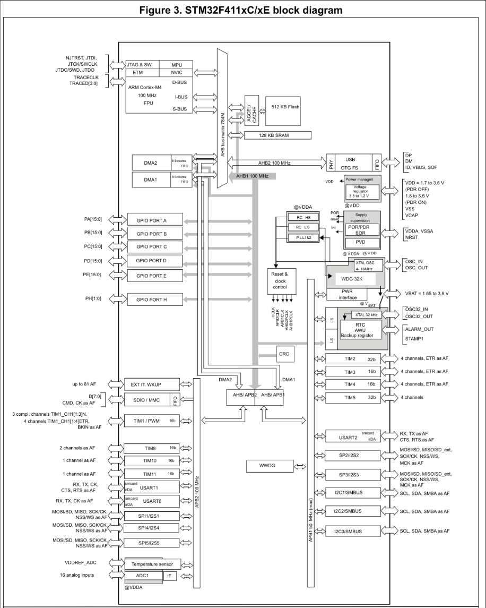
- 什么是core 什么是总线以及外设
> etm ：嵌入式跟踪宏单元，提供了一个接口，可以让我们在调试过程中追踪程序的执行情况，帮助我们更好地理解程序的行为和性能。
> 除了cpu核心之外的，都是片上外设， 和cpu核心通过总线连接在一起，cpu核心通过总线访问片上外设
-  什么是中断？什么是异常
>所以的终端都会走到NVIC
> 中断和异常是两回事，对于cpu来说，打断cpu的事件都是异常，而中断是异常的一种，异常还包括了复位、硬件故障、系统调用等事件。
> 对于cpu来说，中断只是通过NVIC打断cpu的事件的一种，cpu并不关心这个事件是中断还是其他异常，它只会根据异常向量表来处理这个事件。

-  同步异常和异步异常
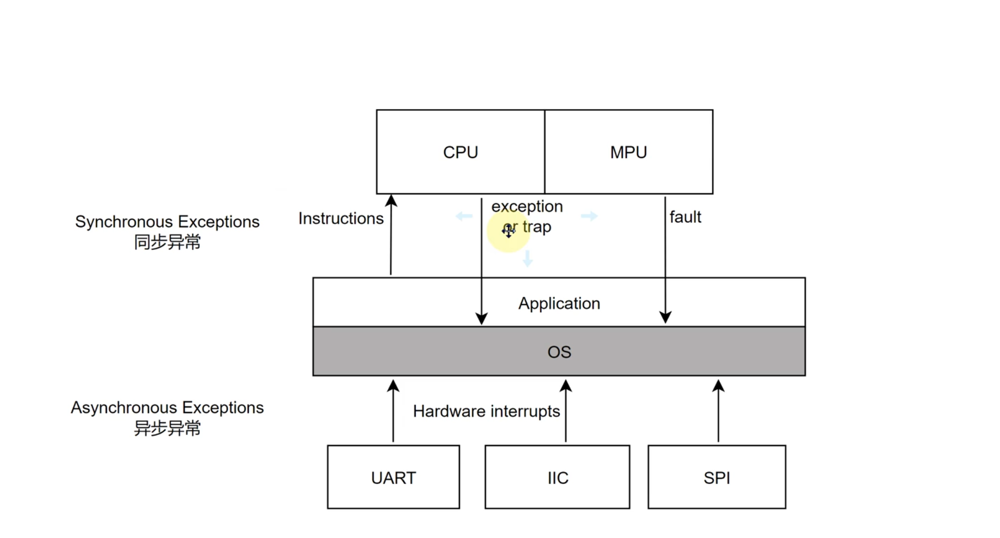
> 当有同步异常发生时，cpu会立即响应这个异常，并且在处理完这个异常之后继续执行后续的指令。而当有异步异常发生时，cpu会在当前指令执行完之后才会响应这个异常，并且在处理完这个异常之后继续执行后续的指令。所以可以直接用栈回溯来分析同步异常的原因，而对于异步异常来说，由于它是在当前指令执行完之后才会响应，所以我们无法直接通过栈回溯来分析它的原因。
>

## NVIC
- NVIC的全称是Nested Vectored Interrupt Controller，中文名称是嵌套向量中断控制器。
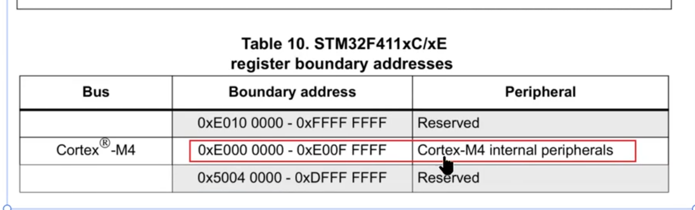
在cortex-m4中，这些内部外设都是不通过bus访问，去通过cpu去访问NVIC
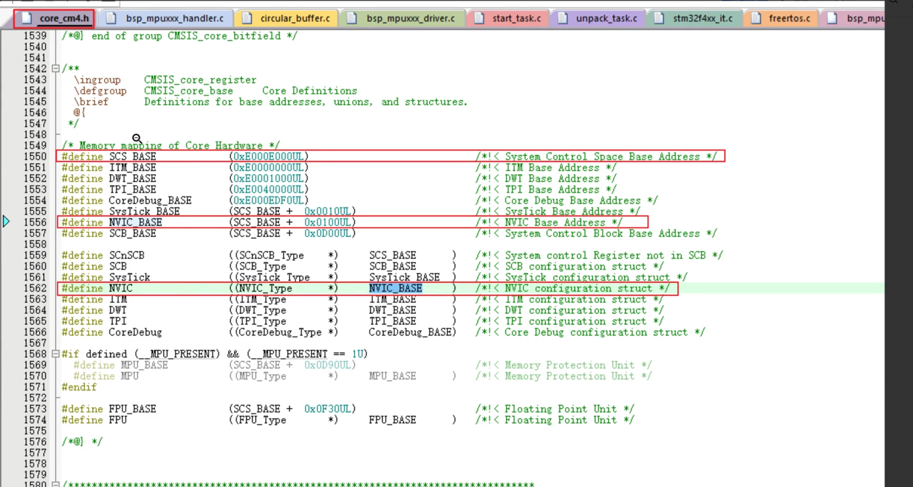
在coretex-m4 中，这个文件里面有很多的寄存器映射
> 访问NVIC的部分寄存器只能通过特权模式去访问，访问NVIC的其他寄存器可以通过用户模式去访问
> 产生软终端其实就是NVIC_STIR寄存器，往这里写一个中断号就可以触发一个中断，用于测试回调函数的正确性和check 时间的长度
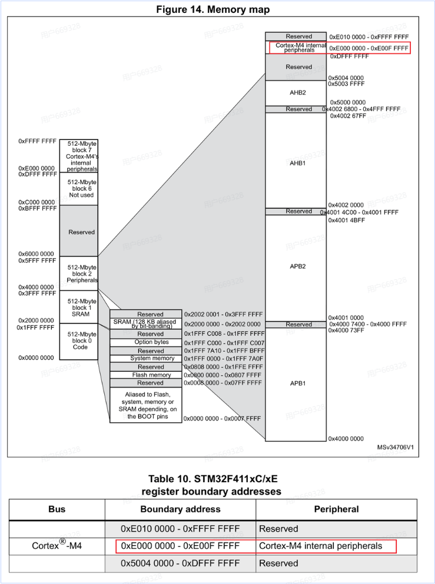
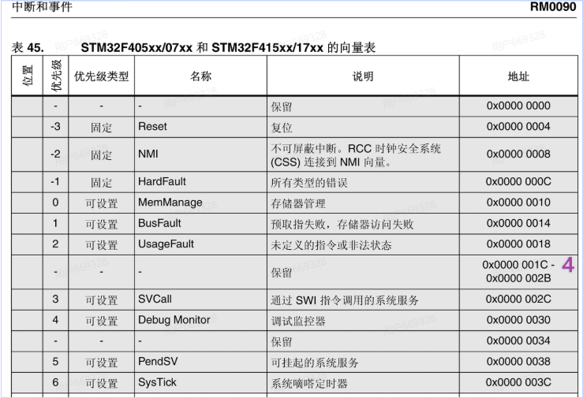
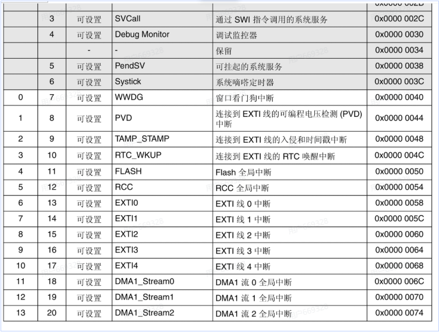
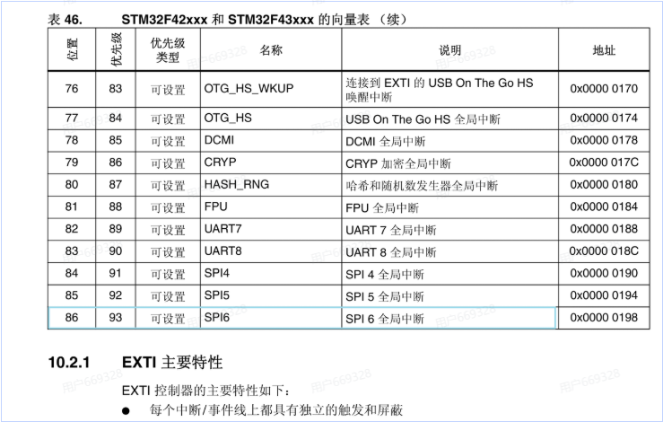
内部中断(同步) 外部中断(异步)
这是因为外部中断是由外部事件触发的，而内部中断是由cpu内部事件触发的，所以外部中断需要等待当前指令执行完之后才会响应，而内部中断可以立即响应。

### 中断向量表的元整
例如在 stm32f411 当中，外部异常16个，外部中断87个 一共就以后103个中断向量表项
103 * 4 = 412 字节
那么要求圆整，其实是就是2的次幂，512字节，也就是必须地址0x200对齐
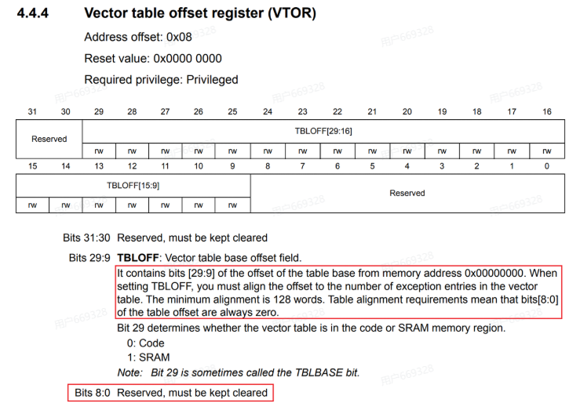

## 丢中断的情况

### 寄存器映射

对于cpu来说，当它要访问rxne的这个寄存器的时候，system bus会把这个访问请求转发到AHB总线矩阵，然后被转义到apb_bus 上，但是apb_bus 是不清楚 *（0x4001 1000) =1 的代表什么，当这个时候往里面写1，这个过程就是寄存器映射。

### 产生单一中断的过程

当有中断发生的时候，例如串口产生中断，就会发一起在ahbbus上跑的请求， 直到nvic当中
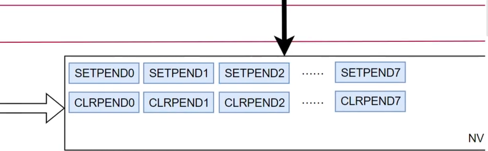
这是中断悬起寄存器，当外部的中断发生的时候，nvic会把这个中断号写到这个寄存器当中，NVIC就会把中断转化为异常，cpu就会去处理这个异常，处理完这个异常之后，cpu就会去检查这个寄存器当中有没有其他的中断，如果有的话，就会继续处理下一个中断，这样就形成了一个中断嵌套的过程。
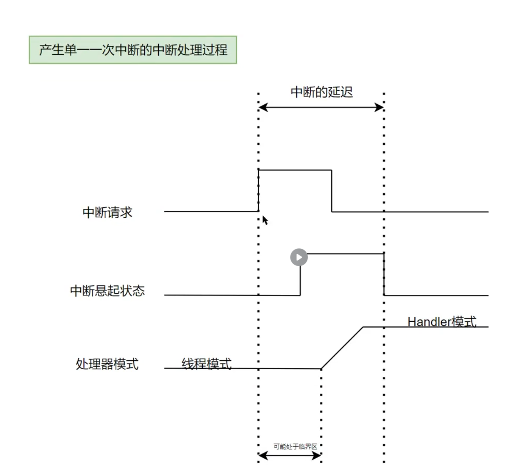
当cpu从线程模式转化为handler模式的时候，cpu会把当前的程序计数器和程序状态寄存器压栈，然后跳转到中断向量表当中对应的中断处理函数去执行，当中断处理函数执行完之后，cpu会从栈当中弹出之前压栈的程序计数器和程序状态寄存器，然后继续执行之前的线程模式的代码。
**如果此时中断悬起，那么cpu就会去写解悬寄存器，之后handler就会进入中断服务函数**
在中断请求发起，中断被悬起，cpu切换到handler模式，然后解悬寄存器，这个过程就是**中断的延迟**

先线程模式当中，有处理临界区资源的时候，就会带会屏蔽很多的中断，这个时候如果有中断发生，那么这个中断就会被悬起，等到临界区资源处理完之后，cpu就会去解悬这个中断，然后进入中断服务函数去处理这个中断，这个过程就是**中断的丢失**

### 丢中断的情况1
在中断悬起的过程中，中断请求是一直以脉冲的方式持续的产生
例如DMA完成搬运了之后，产生中断，但是DMA的标志位只有一个，当在悬起的过程当中，DMA的标志位被清除了，那么这个中断就会丢失了，处理器切换到handler模式之后，也会只能处理这个中断一次，之后这个中断就会丢失了
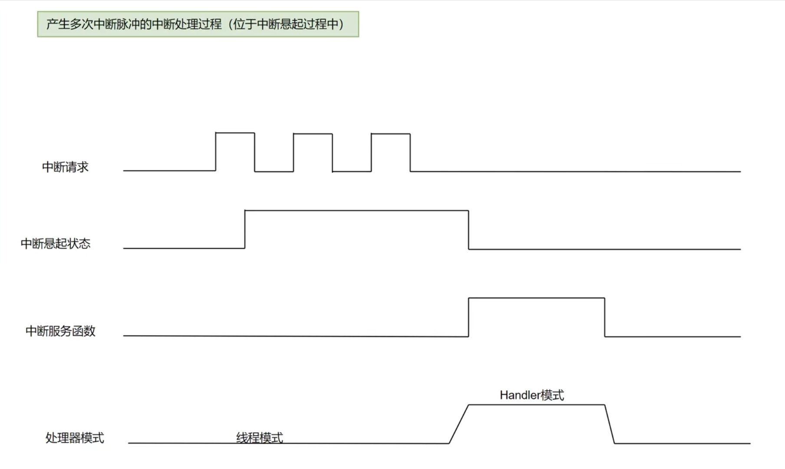

### 丢中断的情况2
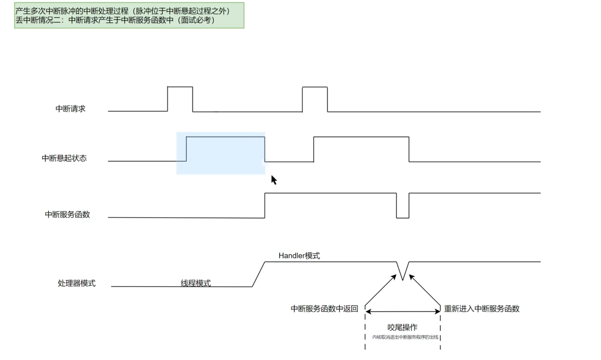
脉冲处于中断悬起之外
在处理第一个中断请求的时候，中断服务函数中有产生了一个新的中断，并且中断脉冲是同一个，中断服务函数中清理标志位，那么只处理一次，那么再次进入中断服务函数的时候，标志位已经被清理了，那么终端服务函数就没有处理这个中断，这个中断就会丢失了，并且handler模式，此时并没有出栈
这样就导致了中断咬尾操作。

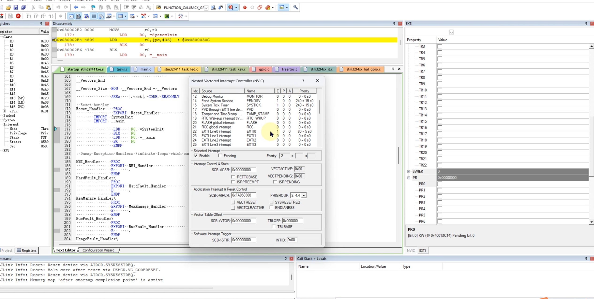

e是中断标志位，p是悬起状态，a是处理中断服务函数。
