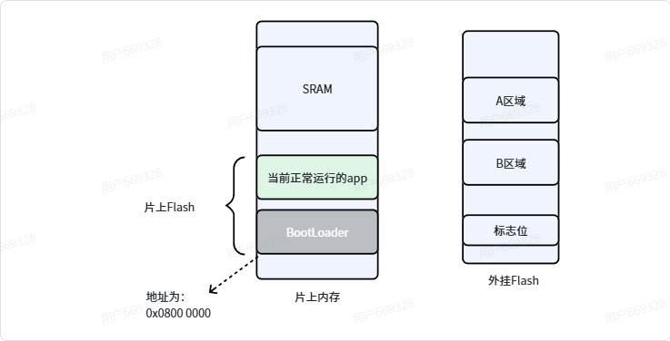
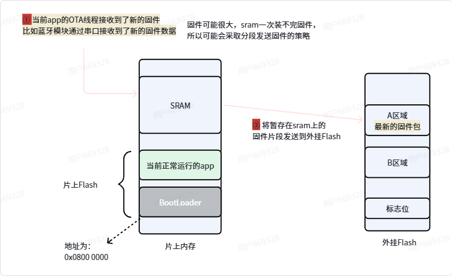
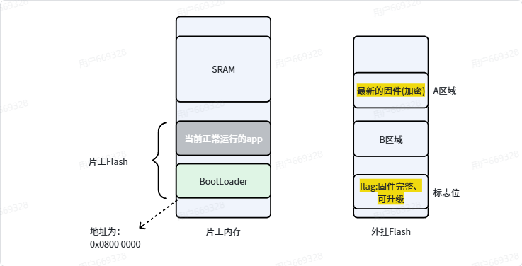

### OTA工作原理

1. 服务器端：
- 开发人员在服务器端准备好开发好的ufw/bin文件的固件包
- 服务器打包，通过无线信号发送给设备

2. 设备端：
- 1. 通过无线模块接受服务器推送的固件更新信息
- 2. 对接受的固件进行校验，确保准确性和完整性
- 3. 把固件写入到设备的存储介质中，通常是Flash存储器
- 4. 更新完成后，设备重启并加载新的固件进行运行

### 流程

1. OTA升级过程概述
> 在app中的一个task进行OTA的操作，用户可以在手表等正常使用的同时进行OTA升级(无感升级)，当升级完成后，重启设备，加载新的固件进行运行。
>首先将固件下载到外挂flash的A区域，确保下载的稳定性和完整性，可以使用断点续传的技术来应对网络不稳的情况

2. 计算和配置FALG
> 下载完成之后，计算固件的校验值（如CRC32），并将其与服务器提供的校验值进行比较，以确保下载的固件没有被篡改或损坏。
> 如果校验成功，设置一个标志位（FLAG）来指示新的固件已经准备好被加载。这个FLAG可以存储在设备的非易失性存储器中，例如EEPROM或Flash的特定区域。
>
> 
> 
> 

3.BootLoader阶段
1. check FLAG的值
> 在设备重启时，BootLoader会首先检查之前设置的FLAG值，以确定是否有新的固件需要加载。
> 如果FLAG指示有新的固件，BootLoader会继续执行以下步骤；如果FLAG指示没有新的固件，BootLoader会直接跳转到当前的APP程序继续执行。
2. 解密与转移固件
>Bootloader将A
3. 备份当前APP
>将内部正常用运行的app纯入A区域，覆盖掉原本的A区域内容，在这样的情况下，如果新的固件有问题，用户可以通过重启设备来恢复到之前的APP程序，确保设备的可靠性和稳定性。
4. 搬移新的固件到片上Flash
>把解密的固件搬移到STM32的片上Flash中，覆盖掉原本的APP程序。要确保数据的传输正确和完整性
>搬运完后，将FLAG修改，表明新的固件已经准备好被加载。
5. 跳转到新的APP程序
>Bootloader会检查新的APP程序的有效性，确保其正确性和完整性。如果新的APP程序有效，Bootloader会跳转到新的APP程序的入口点执行；如果新的APP程序无效，Bootloader会继续执行之前的APP程序，确保设备的