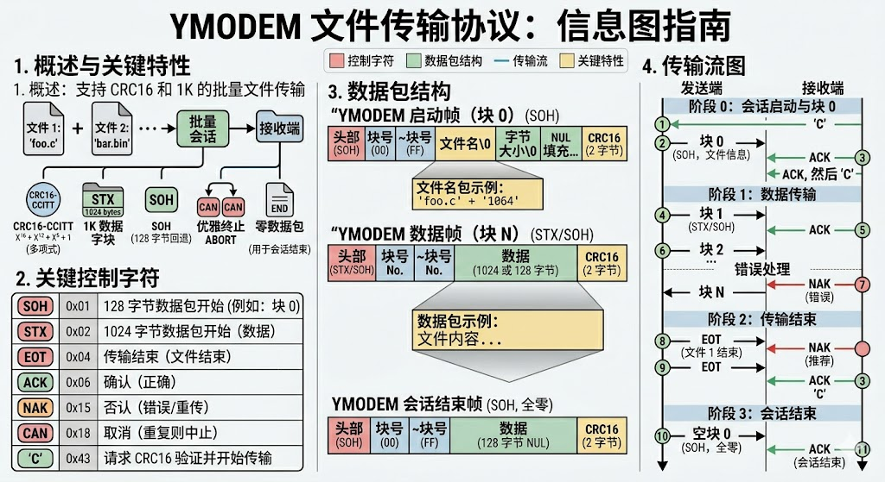
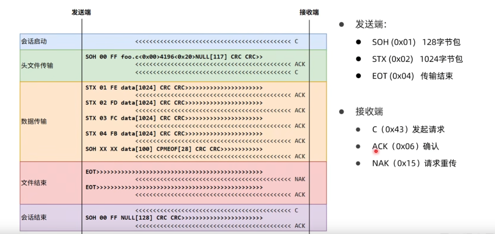

## ymodem协议
### 1. ymodem协议简介
Ymodem协议是一种用于在计算机之间传输文件的协议，基于Xmodem协议进行改进和扩展。Ymodem协议支持批量文件传输，可以同时传输多个文件，并且具有更高的传输效率和可靠性。Ymodem协议使用CRC16校验来确保数据的完整性，并且支持断点续传功能，可以在传输过程中断开连接后继续传输未完成的文件。Ymodem协议广泛应用于嵌入式系统、串口通信等领域，特别适用于需要在资源受限的环境中进行文件传输的场景。

### 2. ymodem协议的工作原理

文件传输会话
|字段|长度|说明|
|---|---:|---|
|数据开始信号|1字节|通常为 `SOH` 或 `STX`，分别表示 128 字节和 1024 字节数据块|
|发送序号|1字节|当前数据包序号|
|发送序号的反码|1字节|序号取反，用于校验|
|数据块|128字节或1024字节|真正传输的文件数据|
|CRC校验码|2字节|CRC16 校验结果|

### 3. ymodem协议的数据传输流程
basic_yomodem 流转