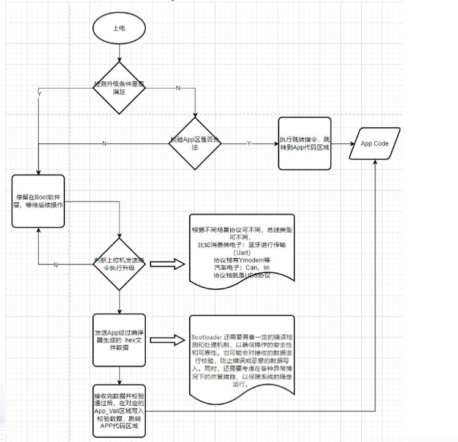
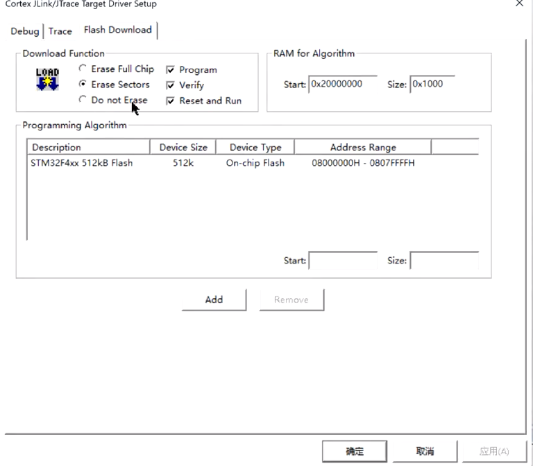
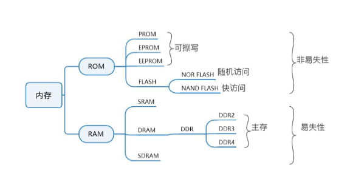
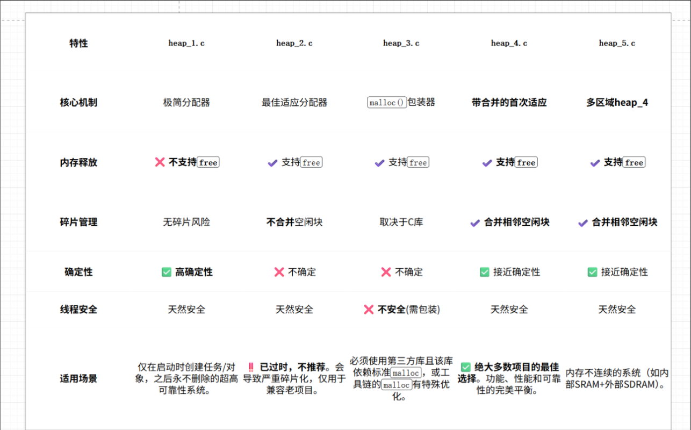
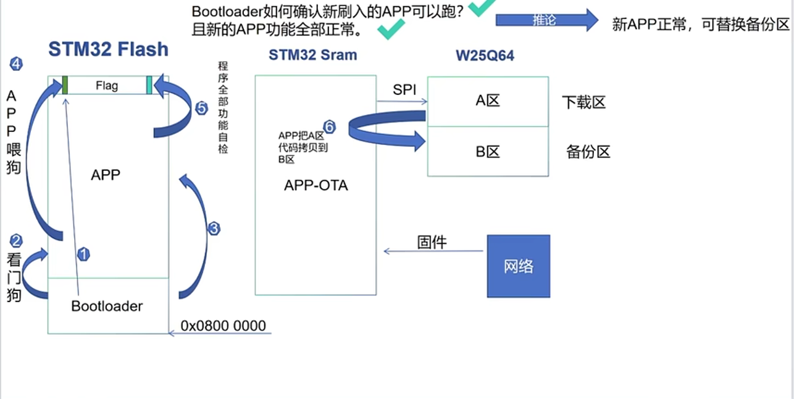

## bootloader
作用以及应用场景

__作用__：

- 引导加载：在系统启动时，bootloader负责初始化硬件设备、设置系统环境，并将控制权转交给操作系统或应用程序。
- 程序更新：bootloader可以支持远程或本地的程序更新，允许用户在不需要物理访问设备的情况下更新固件。

> 当系统启动时，bootloader会首先运行，进行必要的硬件初始化和系统检查，然后加载并执行主程序或操作系统。
>
> bootloader主要是解决当APP程序出现问题时，用户无法通过正常方式进行更新的问题。通过bootloader，用户可以在APP程序无法正常运行的情况下，仍然能够进入bootloader模式进行固件更新，从而恢复设备的正常功能。

__应用场景__：
  
- 产品远程升级：在物联网设备、智能家居等领域，bootloader允许用户通过网络远程更新设备固件，提升用户体验和设备安全性。
- 功能扩展：通过bootloader，用户可以在设备上安装新的功能或修复现有功能的漏洞，而无需更换硬件。
- 量产阶段：在产品的量产阶段，bootloader可以简化生产流程，允许批量更新设备固件，提高生产效率。
- 开发调试：在开发过程中，bootloader可以帮助开发者快速测试和调试新版本的固件，提升开发效率。

### 原理


> 1. APP的最前面的4字节是app的栈顶地址，bootloader通过读取这个地址来判断APP程序是否存在以及是否有效。如果这个地址无效或不正确，bootloader会认为APP程序不可用，从而进入bootloader模式等待新的固件更新。也就是把sp的地址赋值给MSP寄存器，来设置堆栈指针的位置。
> 2. 5~8字节是app的复位函数地址，复位函数是程序的入口点，bootloader通过读取这个地址来确定APP程序的入口位置，并将控制权转交给这个地址开始执行APP程序。
> 3. 偏移中断向量表

- 当设备上电或重置时，bootloader首先运行，进行必要的硬件初始化和系统检查。
- bootloader会检查是否有新的固件可用，通常通过检查特定的标志位或版本号来判断。
- 如果有新的固件可用，bootloader会将新的固件从存储介质（如闪存、SD卡等）加载到内存中，并进行必要的验证（如校验和、数字签名等）以确保固件的完整性和安全性。
- 验证通过后，bootloader会将控制权转交给新的固件，启动新的应用程序或操作系统。

>在keil等编译器中，APP和BL是分开编译的，例如APP的起始地址是0x08004000，BL的起始地址是0x08000000。APP的前8字节存储了APP的栈顶地址和复位函数地址，bootloader通过读取这些信息来判断APP程序是否存在以及是否有效，并将控制权转交给APP程序的入口点开始执行。   


``` cpp
tpdef void (*pFunction)(void); // 定义一个函数指针类型，用于指向APP程序的入口点
#define APP_ADDRESS 0x08004000 // 定义APP程序的起始地址
while(1)
{
    if((*(__IO uint32_t*)APP_ADDRESS& 0x2FEF0000) == 0xFFFFFFFF) // 判断APP程序是否存在
    {
        // APP程序不存在，进入bootloader模式等待新的固件更新
        bootloader_mode();
        LOGO("enter bootloader mode");
        LOGO("wait for new firmware update");
    }
    else
    {   LOGI("start app");
        // APP程序存在，获取APP的栈顶地址和复位函数地址
        uint32_t app_stack_top = *(__IO uint32_t*)APP_ADDRESS; // 获取APP的栈顶地址
        uint32_t app_entry_point = *(__IO uint32_t*)(APP_ADDRESS + 4); // 获取APP的复位函数地址
        jump2app = (pFunction)app_entry_point; // 将APP的复位函数地址赋值给函数指针
        // 设置堆栈指针的位置
        __set_MSP(app_stack_top);

        // 跳转到APP程序的入口点开始执行
        ((void (*)(void))app_entry_point)();
    }
}


```

注意：下载bootloader和APP程序时，必须确保它们被正确地烧录到指定的地址，并且APP程序的前8字节包含了正确的栈顶地址和复位函数地址，以确保bootloader能够正确地判断APP程序的有效性并成功跳转到APP程序的入口点执行。当然下载的时候也需要选择扇区删除，防止下载的时候把BL/app程序覆盖掉了。





### 存储介质


- SRAM：SRAM是一种易失性存储器，通常用于存储临时数据和变量。由于SRAM在断电后会丢失数据，因此不适合用于存储固件或重要数据。
- DRAM：DRAM也是一种易失性存储器，通常用于存储大量数据和程序代码。与SRAM相比，DRAM具有更高的密度和更低的成本，但访问速度较慢。由于DRAM在断电后会丢失数据，因此也不适合用于存储固件或重要数据。
- Flash：Flash是一种非易失性存储器，常用于存储固件、程序代码和重要数据。Flash具有较快的访问速度和较高的耐久性，适合用于存储bootloader和APP程序。
- EEPROM：EEPROM也是一种非易失性存储器，常用于存储小量的配置数据和参数。与Flash相比，EEPROM具有更高的写入耐久性，但访问速度较慢。EEPROM适合用于存储一些需要频繁更新的数据，如设备配置参数等。


#### 内存空间分配
一个C语言工程包含了多个源文件和头文件，可执行部分可以分为下面几个部分：

1. 源代码：包含了程序的逻辑和功能实现，通常以.c或.cpp为后缀。
2. 可执行文件：编译和链接源代码后生成的可执行文件，通常以.exe或.out为后缀。文件名可能会因为编译器的不同而有所不同。
    - 典型的可执行文件结构包括：
        - 代码段（.text）：存储程序的机器代码和函数实现。
        - 数据段（.data）：存储已初始化的全局变量和静态变量。
          - BSS段（.bss）：存储未初始化的全局变量和静态变量，系统会在程序启动时将其初始化为0。
          - 常量段（.rodata）：存储只读数据，如字符串常量和常量数组 （ROM）。
          - 动态数据（dynamic data）：存储在运行时动态分配的内存，如堆和栈。（SRAM）
          - Text段（.text）：存储程序的代码和函数的二进制实现，这些代码在执行期间不会改变，所以放在只读存储器（ROM）中。
          - code段：存储程序的机器代码和函数实现，这些代码在执行期间会改变，所以放在只读存储器（ROM）/flash中。
          - rwdata段：存储已初始化的全局变量和静态变量，这些变量在执行期间会改变，所以放在随机访问存储器（RAM）/SRAM中。
          - rodata段：存储只读数据，如字符串常量和常量数组，这些数据在执行期间不会改变，所以放在只读存储器（ROM）/flash中。

__C语言的数据类型__：

- 数据类型和数据存储类别(静态和动态)的关系

- 存储类别包括4种 ：自动(auto)、寄存器(register)、静态(static)和外部(extern)。其中，自动和寄存器存储类别的变量在函数调用结束后会被销毁，而静态和外部存储类别的变量在程序运行期间一直存在。

__内存对齐__：

```cpp
struct MyStruct {
    char a; // 1 byte
    int b;  // 4 bytes
    char c; // 1 byte
};

#pragma pack(1) // 设置结构体的内存对齐为1字节
struct MyStruct {
    char a; // 1 byte
    int b;  // 4 bytes
    char c; // 1 byte
};
#pragma pack() // 恢复默认的内存对齐
```

总结：如果要做OTA一定要明白bootloader和内存存储的关系，方便进行debug和进行固件更新。
> extern ： 在添加一个freerots当中的内存分配的逻辑，



### MCU 启动流程

在 OTA 架构中，MCU 的启动流程可以拆成下面几个步骤：

1. 设备上电或复位后，CPU 会先读取当前中断向量表的前 8 字节：
    - 第 1 个字（4 字节）是初始栈顶地址（MSP）
    - 第 2 个字（4 字节）是复位中断入口（Reset_Handler）

2. 因为工程把 BL（bootloader）放在 `0x08000000`，APP 放在 `0x08004000`，所以系统先进入 BL。

3. BL 初始化最小硬件后，读取 APP 首地址（`0x08004000`）的前 8 字节，判断 APP 是否有效：
    - 栈顶地址是否落在 SRAM 合法范围
    - 复位入口地址是否落在 Flash 的 APP 合法范围

4. 如果 APP 有效，则进行跳转：
    - 关闭中断并清理必要外设状态（防止 BL 状态污染 APP）
    - 设置 MSP 为 APP 的栈顶地址（`__set_MSP(app_stack_top)`）
    - 偏移中断向量表到 APP（常见做法是设置 `SCB->VTOR = APP_ADDRESS`）
    - 跳转到 APP 的复位入口执行

5. 如果 APP 无效，或者检测到升级标志位，则 BL 不跳转 APP，而是进入升级模式（串口/蓝牙/CAN 等）等待新固件。

> 为什么这样设计：
>
> - 先运行 BL，能保证即使 APP 损坏也能恢复升级（可维护性高）。
> - 启动前校验 APP 的栈和入口地址，能减少非法跳转导致的 HardFault。
> - 跳转前处理 MSP 和向量表，是为了让 APP 以“完整上电初始化”的上下文运行。

> 常见 bug 原因（启动失败 / HardFault）：
>
> - APP 链接地址和 BL 中 `APP_ADDRESS` 不一致。
> - 只改了跳转地址，没有重定位中断向量表。
> - MSP 设置错误，导致函数调用或中断入栈异常。
> - 烧录方式错误（整片擦除）覆盖了 BL 或 APP。
> - APP 前 8 字节异常（镜像损坏、未完整下载、校验逻辑不严谨）。


### OTA升级示意图
前面先说明了存储介质的重要性，下面是一个OTA升级的示意图：



#### BL 跳转后 CPU 是怎么继续取指的？

```mermaid
flowchart TD
    A[上电/复位] --> B[进入BL: 0x08000000]
    B --> C[BL从Flash取指执行]
    C --> D{APP是否有效?}
    D -- 否 --> E[进入升级模式并等待新固件]
    D -- 是 --> F[读取APP向量表: MSP和Reset_Handler]
    F --> G[设置MSP]
    G --> H[VTOR偏移到APP基址0x08004000]
    H --> I[跳转到APP复位入口]
    I --> J[CPU从APP Flash连续取指]
    J --> K[运行时数据在SRAM读写(XIP执行)]
```

在这个示意图里，可以把 CPU 的执行理解成“取指令 -> 译码 -> 执行”的循环，只是取指地址发生了切换：

1. MCU 上电后先执行 BL（位于 `0x08000000` 区域），此时 CPU 从 BL 对应的 Flash 区域取指。
2. BL 判断 APP 有效后，读取 APP 向量表：
    - `APP[0]`：初始栈顶（MSP）
    - `APP[1]`：复位入口（Reset_Handler）
3. BL 设置 `MSP`，并将 `VTOR` 偏移到 APP 基地址（例如 `0x08004000`）。
4. 执行函数跳转到 APP 的复位入口地址后，CPU 后续就从 APP 所在的 Flash 区域连续取指执行。
5. 此时并不是“代码整体搬到 RAM 再跑”，而是典型的 XIP（eXecute In Place，就地执行）：
    - 指令主要从 Flash 取
    - 栈、堆、运行时变量在 SRAM 中读写

> 为什么会这样：Flash 适合保存程序且断电不丢失，SRAM 适合高频读写数据。CPU 通过总线既能从 Flash 取指，也能同时访问 SRAM 做数据操作。
> 
> 常见 bug 原因（和这里强相关）：如果只跳了 PC（程序计数器）而没有正确设置 MSP/VTOR，就会出现中断跑飞、异常入栈错误、HardFault 等问题。

先理清flash在擦除的时候，flash作为永久性存储器件，在擦除时需要先擦除掉原有的数据才能写入新的数据。但是运行的固件在执行过程中需要访问flash中的数据，如果在擦除过程中访问了正在擦除的flash区域，就会导致程序崩溃或者无法正常运行。因此，在OTA升级过程中，需要确保在擦除flash时，程序不会访问正在擦除的flash区域，以避免出现问题。

所以在OTA升级过程中，通常会采用双备份的方式来保证系统的稳定性和可靠性。具体来说，系统会将新的固件写入到一个备用区域（Backup Area），而不是直接覆盖正在运行的固件所在的区域（Active Area）。当新的固件写入完成并验证通过后，系统会切换到备用区域，开始执行新的固件。这样，即使在写入过程中出现问题，系统仍然可以继续使用旧的固件，保证设备的正常运行。

看门狗的作用，当然设计到了crc,hash,md5等校验机制，但是如果本身的固件就有问题的话，那么就会导致设备无法正常启动，进入死循环，甚至无法进入升级模式，这时候看门狗就可以发挥作用了。看门狗是一种硬件计时器，可以在系统出现异常时自动重启设备，防止设备长时间处于不可用状态。在OTA升级过程中，如果新的固件有问题导致设备无法正常启动，看门狗会在一定时间内检测到这个问题，并自动重启设备，进入升级模式等待新的固件更新。这样可以保证设备的可用性和稳定性，即使在升级过程中出现问题，也能够及时恢复正常运行。

---

ICP和ISP的区别：

- ICP（In-Circuit Programming）是一种通过物理连接到芯片的编程方式，通常需要使用专用的编程器或调试器来进行固件烧录。ICP适用于开发阶段和小批量生产，可以直接在电路板上进行编程。
- ISP（In-System Programming）是一种通过系统接口进行编程的方式，通常不需要物理连接到芯片，而是通过通信接口（如串口、USB、CAN等）进行固件烧录。ISP适用于大批量生产和远程升级，可以在设备已经安装在系统中后进行编程。(厂商提供的ISP工具)
- APU（Application Programming Unit）是一种专门用于应用程序编程的单元，通常集成在芯片内部，提供了一个独立的编程环境和接口。APU可以通过特定的指令或命令来进行固件烧录和更新，适用于需要频繁更新固件的应用场景，如物联网设备、智能家居等。


### 代码


``` cpp


#define APP_ADDRESS 0x08019000 // 定义APP程序的起始地址
typdef void (*pFunction)(void); // 定义一个函数指针类型，用于指向APP程序的入口点


void Disable_Interrupts(void)
{   
    __HAL_RCC_RTC_DISABLE(); // 禁止RTC时钟，防止RTC中断
    __disable_irq(); // 禁止全局中断
}


void JunToAPP(void)
{
    uint16_t i;
    uint32_t jumpAddr , armAddr;
    armAddr = *(__IO uint32_t*)(APP_ADDRESS + 4); // 获取APP的复位函数地址
    delay_seconds(1); // 延时等待外设稳定
    for (i = 0; i < 1000; i++); // 简单的延时循环，等待外设稳定
    {
        printf("delay %d ms\n", i);
    }
    delay_seconds(1); // 再次延时等待外设稳定
    if (((*(__IO uint32_t*)APP_ADDRESS) & 0x2FFE0000) == 0x20000000) // 判断APP程序是否存在
    {
        printf("start app\n");
        pFunction JumpToApplication; // 定义一个函数指针变量，用于指向APP程序的入口点
        JumpToApplication = (pFunction)armAddr; // 将APP的复位函数地址赋值给函数指针变量
        __set_MSP(*(__IO uint32_t*)APP_ADDRESS); // 设置堆栈指针的位置
        JumpToApplication(); // 跳转到APP程序的入口点开始执行
    }
    else
    {
        printf("app is not exist\n");
    }
}