## git使用

### git的安装
git的安装可以参考[git安装](https://git-scm.com/downloads)官网，选择对应的操作系统进行安装即可。


### git的基本使用

1.  复制clone 命令行
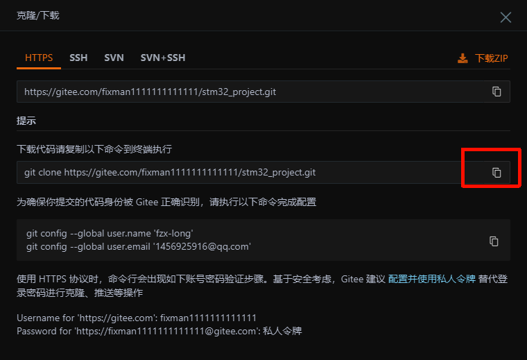
2. 文件夹打开git bash
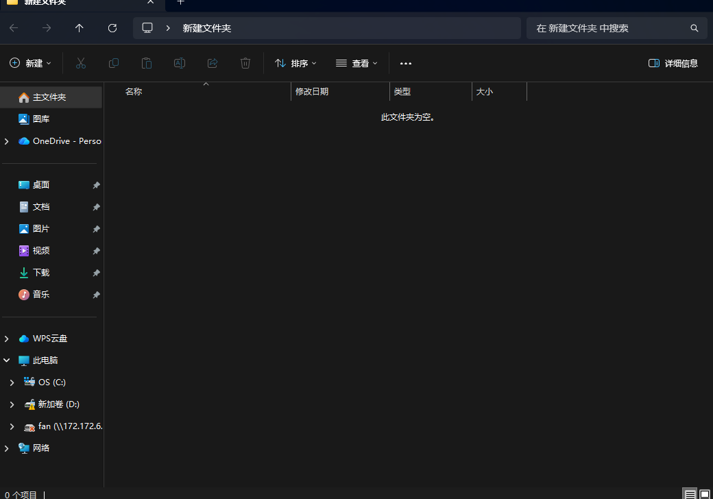
3. 按shift+ins 粘贴命令行
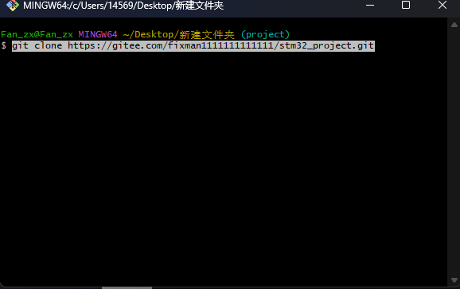
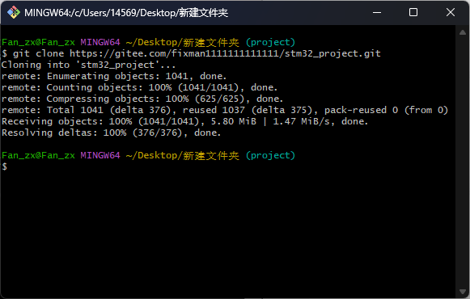
至此本地仓库和远程仓库就关联在一起了，查看本地内容可以看见已经被克隆下来
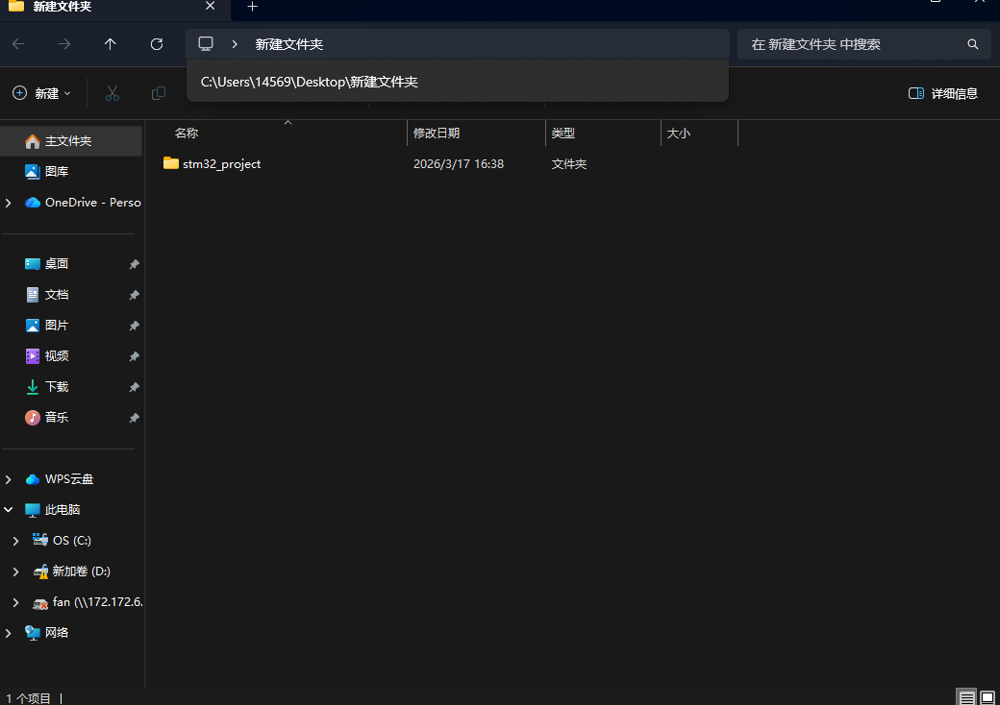
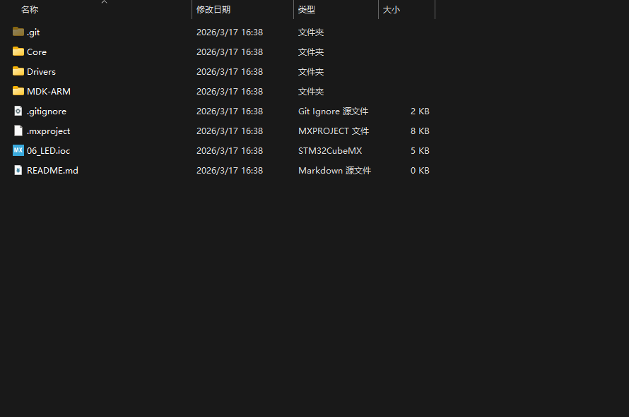
4. 进行修改（如添加一个文件）
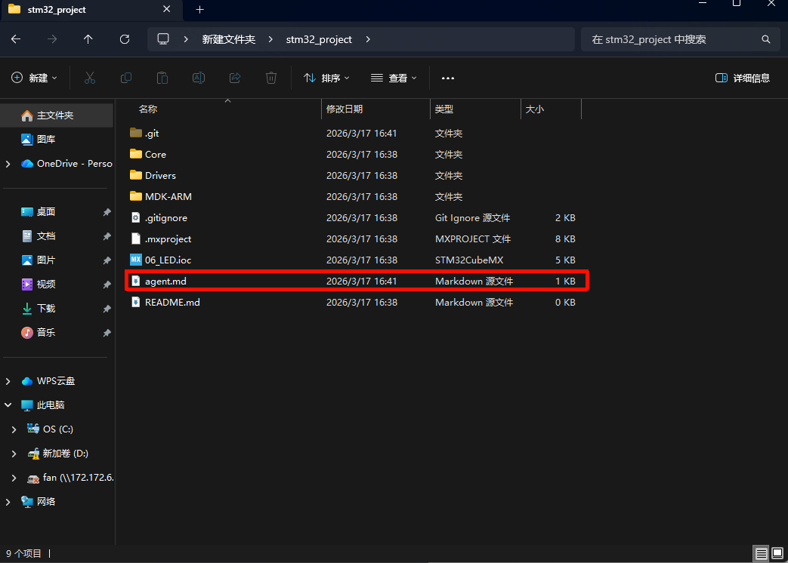
5. 打开git bash， 执行添加文件（输入git add .）
注：这个命令会将当前目录下的所有修改过的文件添加到暂存区，如果只想添加特定的文件，可以使用git add <filename>命令。
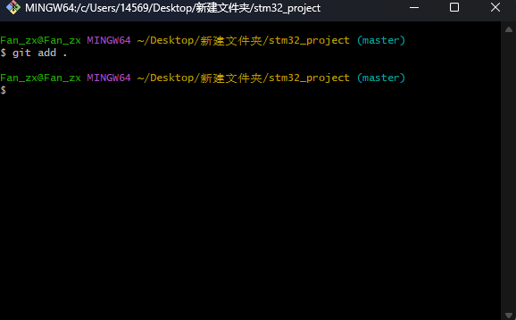
6. 提交修改（输入git commit -m "提交信息"）
注：-m选项用于指定提交信息，提交信息应该简洁明了，描述本次提交的内容和目的。
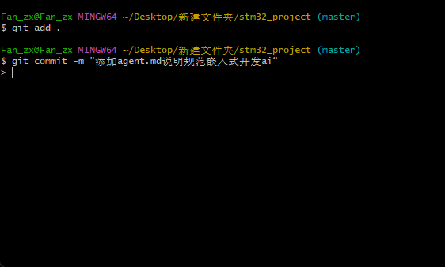
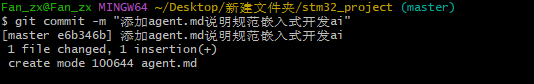
7. 推送到远程仓库（输入git push origin main）
``` bash
git push origin 分支名
```
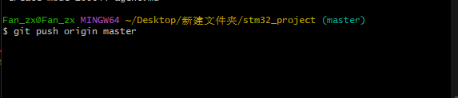
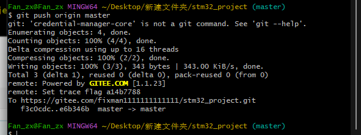
查看远端仓库
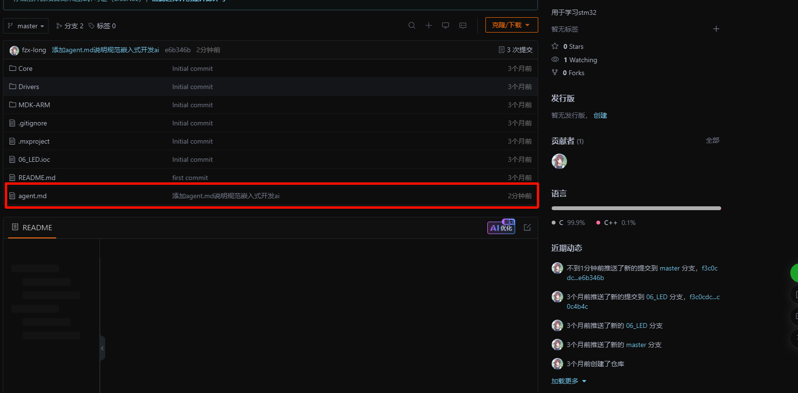

8. 创建远程分支（输入git push origin main:dev）
``` bash
git push origin 本地分支名:远程分支名
```
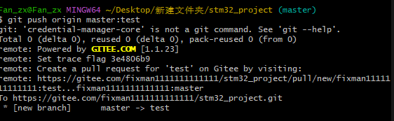

本地的分支名是后面的(master)，创建的时候注意一下
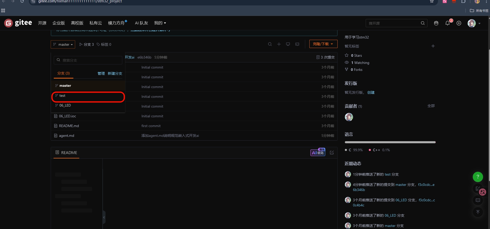
看看远程仓库的分支已经创建成功了

9. 创建本地分支并关联远程分支
 - 创建分支
``` bash
git branch 分支名
```
- 切换分支
``` bash
git checkout 分支名
``` 
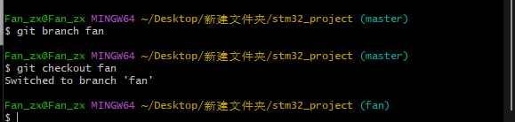

- 关联本地分支和远程分支
  - 如果本地分支和远程分支同名，可以直接使用以下命令关联`git push --set-upstream origin 分支名`
  - 如果本地分支和远程分支不同名，可以使用以下命令关联`git push --set-upstream origin 本地分支名:远程分支名`
 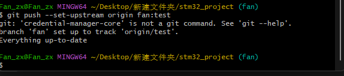
> 我这里是git 版本过于老了，无法使用`git push --set-upstream origin 分支名`命令来关联本地分支和远程分支，所以只能使用`git push --set-upstream origin 本地分支名:远程分支名`命令来关联本地分支和远程分支。

#### git的切换和合并代码

如果想切换回主分支，可以使用以下命令：
``` bash
git checkout master
```

**本地主分支合并从分支代码**
``` bash
git merge 分支名
```
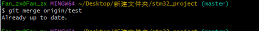

**本地主分支合并远程分支代码**
``` bash
git add .
git commit -m "提交信息"
git pull origin 分支名
```


#### 代码回退

执行`git log`命令查看提交历史，找到需要回退的提交记录的哈希值（commit hash），然后执行以下命令进行回退：
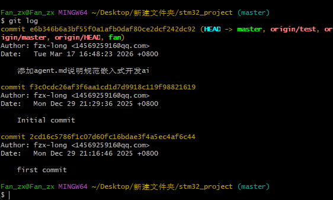

代码回退有很多的方式，常用的有以下几种：
- 软回退：`git reset --soft commit_hash`，这种方式会将HEAD指针移动到指定的提交记录，但不会修改工作目录和暂存区的内容。
- 混合回退：`git reset --mixed commit_hash`，这种方式会将HEAD指针移动到指定的提交记录，并且会修改暂存区的内容，但不会修改工作目录的内容。
- 硬回退：`git reset --hard commit_hash`，这种方式会将HEAD指针移动到指定的提交记录，并且会修改工作目录和暂存区的内容，彻底回退到指定的提交记录。

例如我这里执行`git reset --hard e6b346b6a3bf55f0a1afb0daf80ce2dcf242dc92`命令来回退到指定的提交记录，回退后会丢失回退点之后的所有提交记录和修改内容，请谨慎使用。

#### 代码删除
如果想删除某个文件，可以使用以下命令：
``` bash
git add -u
git commit -m "删除文件"
git push origin 分支名
```
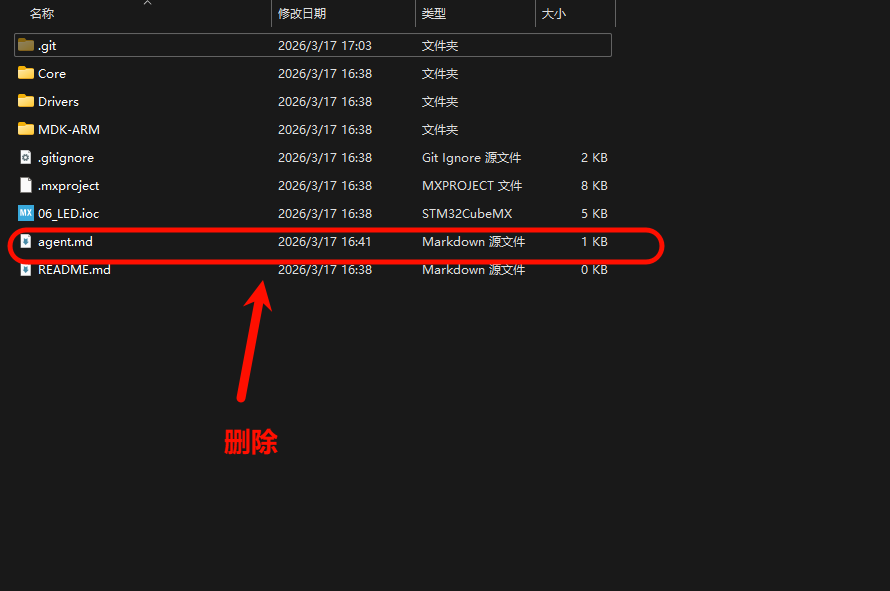

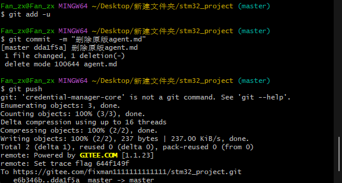

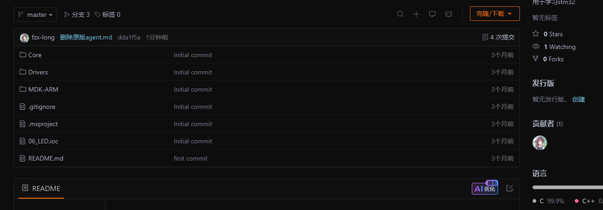

这里已经删除了agent.md文件，并且提交了删除操作，最后推送到远程仓库。