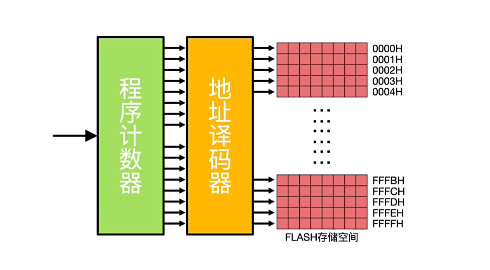
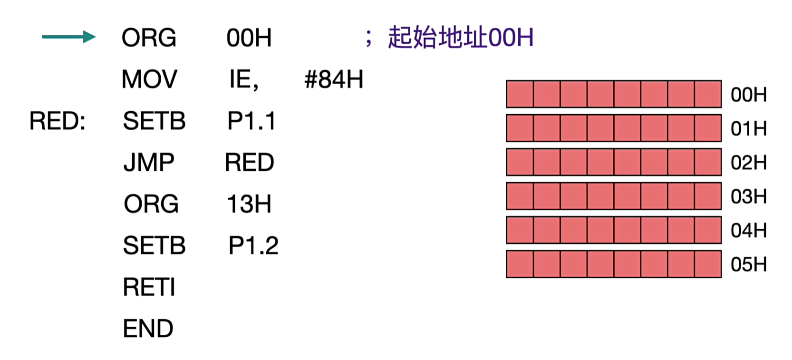
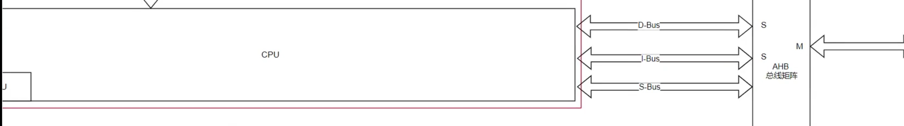
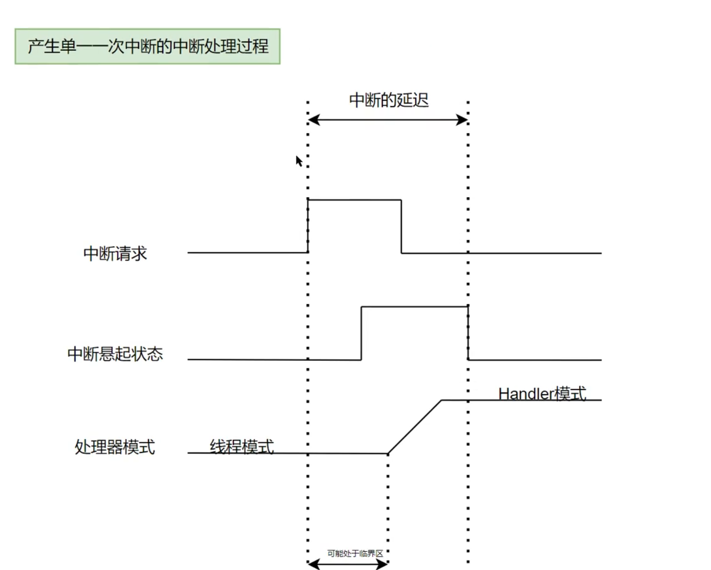
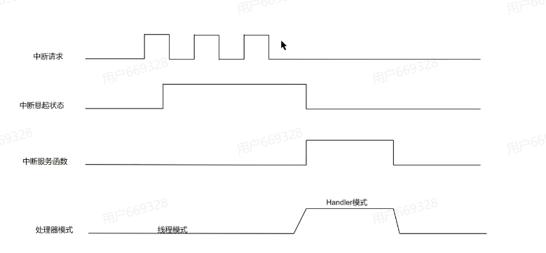
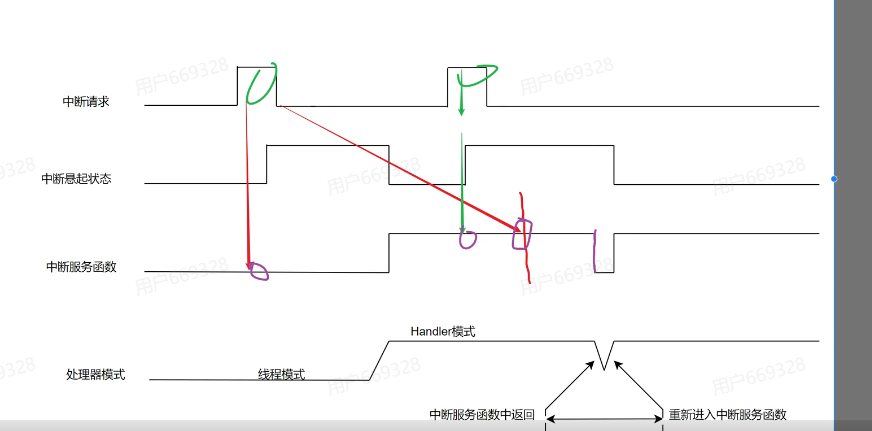
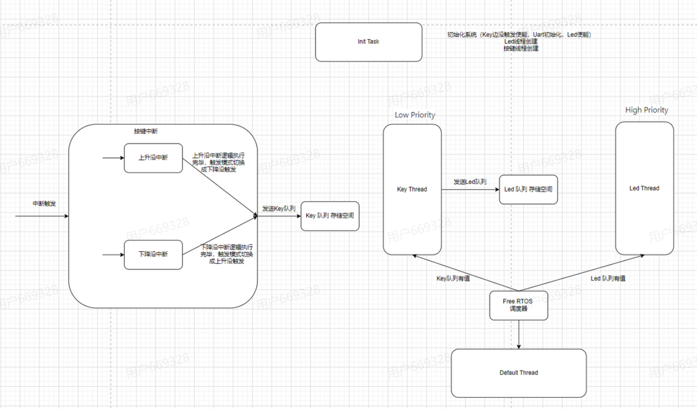

## 中断
### 从汇编角度理解中断
中断是一种异步事件，它会打断当前正在执行的程序流，转而执行一个预定义的处理程序（中断服务例程，ISR）。从汇编语言的角度来看，中断处理涉及以下几个关键步骤：
1. **保存上下文**：当中断发生时，处理器会自动保存当前的程序计数器（PC）和状态寄存器（如CPSR）的值，以便在中断处理完成后能够恢复到中断前的状态。
2. **跳转到中断向量表**：处理器会根据中断类型，从中断向量表中获取对应的中断服务例程的地址，并跳转到该地址开始执行中断处理代码。
3. **执行中断服务例程**：中断服务例程会执行特定的任务，如读取外设数据、清除中断标志等。
4. **恢复上下文**：中断服务例程执行完毕后，处理器会从堆栈中恢复之前保存的PC和状态寄存器的值，继续执行被中断的程序。

程序计数器(PC)保存了下一条要执行的指令地址，当中断发生时，PC的值会被压入堆栈，以便中断处理完成后能够返回到正确的位置继续执行。



- ORG指令用于设置程序的起始地址
- MOV指令用于将数据从一个寄存器传输到另一个寄存器 
- STB指令用于将寄存器中的数据存储到内存地址中
- JMP指令用于无条件跳转到指定的地址执行代码

#### 什么是内核和总线
- 内核（Core）：微控制器的核心处理单元，负责执行指令和处理数据。它包含了算术逻辑单元（ALU）、寄存器组、程序计数器（PC）等基本组件。
- 总线（Bus）：用于连接微控制器内部各个组件（如内核、内存、外设等）以及与外部设备进行数据传输的通信通道。总线可以分为数据总线、地址总线和控制总线。
当有异常或中断发生时，内核会暂停当前的任务，保存必要的上下文信息（如PC和状态寄存器），然后通过总线跳转到中断向量表中对应的中断服务例程地址，开始执行中断处理代码。

> 在NVIC_STIR 是属于用户模式下访问的寄存器，这是软件中断触发的寄存器

#### NVIC简介
NVIC（Nested Vectored Interrupt Controller，嵌套向量中断控制器）是ARM Cortex-M系列微控制器中的一个重要组件，负责管理和调度外设中断。它提供了中断优先级管理、嵌套中断支持以及中断向量表的功能，使得系统能够高效地响应各种中断请求。

在cortex-M系列处理器中，是内部外设，不通过bus访问的，所以响应速度非常快。

##### 向量表
向量表是一个存储中断服务例程（ISR）地址的表格，用于在中断发生时快速定位到对应的处理函数。每个中断源都有一个唯一的向量表项，包含该中断的ISR地址。当中断发生时，处理器会根据中断类型，从向量表中获取对应的ISR地址，并跳转到该地址执行中断处理代码。
向量表起到了一个引导的作用，通过地址指针快速定位到中断服务例程，确保中断能够被及时响应和处理。
#### 寄存器映射
寄存器映射是指将微控制器的外设寄存器映射到特定的内存地址空间中，以便通过内存访问方式对外设进行配置和控制。每个外设都有一组寄存器，这些寄存器用于存储外设的状态信息、配置参数以及数据传输等。
通过寄存器映射，程序可以直接访问这些寄存器地址，从而实现对外设的操作。例如，要配置GPIO引脚，可以通过访问对应的GPIO寄存器地址来设置引脚模式、输出类型等参数。



cpu通过D-BUS、I-BUS 还有S-BUS三条总线访问不同的外设寄存器
- D-BUS：数据总线，用于访问数据存储器和外设寄存器
- I-BUS：指令总线，用于访问程序存储器（如闪存）
- S-BUS：系统总线，用于连接内核与外设之间的通信

#### 产生中断的条件

当有中断产生的时，就会产生中断请求信号（IRQ），这个信号会被送到内核的中断控制器（NVIC）中断悬起寄存器。中断控制器会根据中断的优先级和当前的处理状态，决定是否响应该中断请求。
> 中断悬起寄存器：用于存储当前悬起的中断请求信息。当有中断请求产生时，相应的位会被设置为1，表示该中断处于悬起状态，等待处理。
> 中断的延迟：当多个中断请求同时发生时，内核会根据中断的优先级来决定处理顺序。高优先级的中断会优先被处理，而低优先级的中断则会被延迟，直到高优先级的中断处理完成后才会被响应。
> 中断的处理：当内核决定响应一个中断请求时，会暂停当前的任务，保存必要的上下文信息（如PC和状态寄存器），然后跳转到中断向量表中对应的中断服务例程地址，开始执行中断处理代码。

> 当有IRQ信号产生的时候，NVIC会根据中断的优先级和当前的处理状态，决定是否响应该中断请求。如果响应中断请求，内核会暂停当前任务，保存上下文信息，然后跳转到中断服务例程地址执行中断处理代码,进入到handler模式

那么如果一直有中断进行请求会怎么样呢？
- 第一次中断请求进来，cpu响应中断，进入handler模式，保存上下文，执行中断服务例程，但在中断处理的时候，有心的IQR进入，但是NVIC的标志位被clear了，所以不会响应这个中断请求，但是还有有IQR，所以Handler优惠继续执行。

##### 丢中断情况
__情况1__ ：中断请求在产生于中断悬起的过程中，此时中断请求信号可能会被忽略，导致中断丢失。

__情况2__ : 中断请求产生在中断服务函数中，此时如果中断优先级设置不当，可能会导致高优先级中断被低优先级中断阻塞，进而丢失高优先级中断请求。

> 当中断服务执行完毕之后，就clear中断悬起寄存器的标志位，然后检查是否有新的中断请求，但是在这个过程中，如果有新的中断请求产生，那么这个请求可能会被忽略，导致中断丢失。

##### 如果程序卡死，怎么办？
- 检查中断优先级设置，确保高优先级中断不会被低优先级中断阻塞。
- 使用看门狗定时器（Watchdog Timer）来监控系统运行状态，防止系统长时间卡死。
- 优化中断服务例程，确保其执行时间尽可能短，避免长时间占用CPU资源。
- 使用调试工具（如JTAG、SWD）来分析系统状态，定位卡死原因，防止咬尾操作。
> 咬尾操作：指的是程序在执行过程中进入一个无限循环或死循环，导致系统无法继续正常运行。这种情况通常发生在中断服务例程中，如果中断服务例程没有正确处理完毕，可能会导致程序一直停留在该例程中，无法返回到主程序执行，从而引发系统卡死问题。
> 在用freertos的时候，要注意中断服务例程的设计，因为会使用pendsv中断来进行任务切换，如果中断服务例程设计不当，可能会影响freertos的调度机制，导致系统卡死。


### 实验
#### 参考架构

#### 讲解+代码
之前是使用的poling方式来轮询访问key是否被按下的，现在改成使用中断的方式来实现按键控制LED的功能。

#### 中断追踪
使用HAL_GetTick()函数获取系统滴答计数器的值，然后使用printf函数将计数器的值通过串口发送出去，从而实现每隔一秒钟打印一次系统时间的功能。

### 面试题准备
#### C语言基础
##### 不用sizeof，如何计算一个数据类型的长度？
```c
#define TYPE_LENGTH(type) ((char *)(&type + 1) - (char *)(&type))
```

