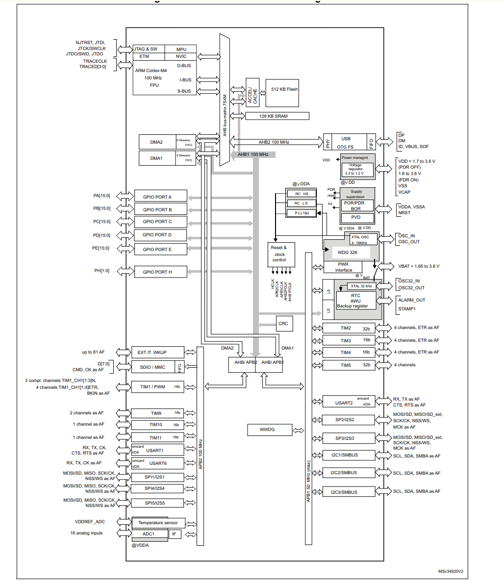
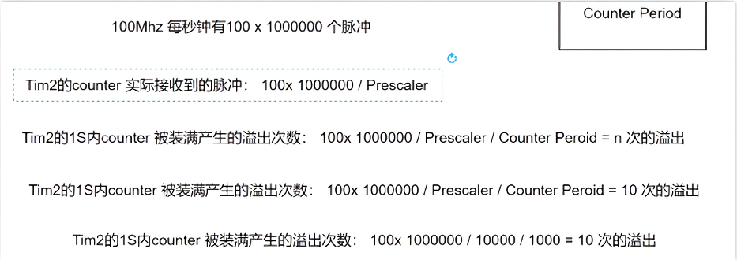

## 回顾stm32定时器
timer是stm32中一个非常重要的外设，主要用于计时和计数。它可以配置为多种工作模式，如基本定时器模式、输入捕获模式、输出比较模式和PWM模式等。在本实验中，我们将使用定时器来实现LED的定时闪烁。
### stm32定时器的基本概念
定时器可以有多种计数模式，常见的有：
- 向上计数模式：定时器从0开始计数，直到达到预设的自动重装载值（ARR），然后重新从0开始计数。
- 向下计数模式：定时器从预设的自动重装载值开始计数，直到计数到0，然后重新从预设值开始计数。
- 向上/向下计数模式：定时器在达到ARR后反向计数，直到计数到0，然后再次向上计数。

当然定时器还有很多功能，但是最主要的就是计时和产生PWM波形。
#### 定时器的关键寄存器
timer定时器有很多寄存器，下面是一些关键寄存器的介绍：
- PSC（预分频器寄存器）：用于设置定时器的时钟预分频值，从而调整定时器的计数速度。
- >当PSC的值为N时，定时器的计数频率为：f_timer = f_clk / (N + 1)，其中f_clk是定时器的输入时钟频率。
- ARR（自动重装载寄存器）：用于设置定时器的计数上限值，当计数器达到该值时会触发更新事件。
- CNT（计数器寄存器）：用于存储当前的计数值，可以读取或写入该寄存器来获取或设置计数值。
  >当CNT的值达到
  ARR时，计数器会重新加载为0（向上计数模式）或ARR（向下计数模式）。或者者触发一个更新事件（UEV），可以用于产生中断或更新输出。
- DIER（DMA/中断使能寄存器）：用于配置定时器的中断和DMA请求。
- CCR（捕获/比较寄存器）：用于存储捕获或比较的值，常用于输入捕获和输出比较模式。

怎么样配置定时器呢？一般来说，我们需要以下几个步骤：
1. 使能定时器时钟：通过RCC寄存器使能定时器的时钟。
2. 配置预分频器和自动重装载寄存器：设置PSC和ARR寄存器来确定定时器的计数频率和周期。
3. 配置定时器模式：根据需要选择定时器的工作模式，如基本定时器模式、输入捕获模式等。
4. 使能定时器：通过设置定时器的控制寄存器来启动定时器。
5. 配置中断（可选）：如果需要使用定时器中断，可以配置DIER寄存器并编写中断服务例程。

### 实验目标
通过配置STM32的定时器，实现LED的定时闪烁。具体要求如下：
- 5hz闪烁频率，也就是每200ms翻转一次状态
- 使用定时器中断来实现LED的翻转

这里的tim2挂载了APB1总线，时钟频率是72MHz

#### `100ms` 的定时器应该怎么配置
>  当然这里我们需要一个`100ms`的定时器中断，因为LED每`200ms`翻转一次状态，也就是每`100ms`触发一次中断，在中断服务函数中进行状态翻转。
- 定时器时钟频率：72MHz
- 预分频器PSC：7199
- 自动重装载寄存器ARR：999
- 定时器计数频率计算：
  - f_timer = f_clk / (PSC + 1) = 72,000,000 / (7199 + 1) = 10,000 Hz
> 其实这里的预分频器值选择7199是为了将72MHz的时钟频率降低到10kHz，这样每个计数周期为0.1ms。也就是当72MHZ时钟经过7200个周期后，定时器计数器增加1。事件也就是72000000个时钟周期后，计数器增加10000次。

这里的F4的外部timer时钟是100MHZ，经过预分配器后变成10KHZ，然后经过ARR=999后，每1000个计数周期触发一次中断，也就是每100ms触发一次中断。就像装满一个篮子，每次装满1000个苹果就触发一次中断。



##### 代码细节
`使用HAL库的时候，timer是需要手动配置的` 使用API`HAL_TIM_Base_Init`来配置定时器的基本参数。在文件的`stm32f1xx_hal_timer.c`文件中，有关于timer的初始化函数demo可以看看。还有开启定时器中断的函数`HAL_TIM_Base_Start_IT`。
- `HAL_TIM_Base_Init(&htim2);`：初始化定时器2的基本参数，包括预分频器和自动重装载寄存器等。不会产生中断。
- `HAL_TIM_Base_Start_IT(&htim2);`：启动定时器2并使能中断功能。当定时器计数达到ARR值时，会触发中断。

#### 完整代码
```c

void TIM2_IRQHandler(void)
{
  /* USER CODE BEGIN TIM2_IRQn 0 */

  /* USER CODE END TIM2_IRQn 0 */
  HAL_TIM_IRQHandler(&htim2);
  /* USER CODE BEGIN TIM2_IRQn 1 */

  /* USER CODE END TIM2_IRQn 1 */
}
``` 

__在mian.c中添加如下代码：__
```c
void HAL_TIM_PeriodElapsedCallback(TIM_HandleTypeDef *htim)
{
    if(htim->Instance == TIM2) // 检查是否是定时器2的中断
    {
      /* Toggle LED or LED_callback */
        HAL_GPIO_TogglePin(LED_GPIO_Port, LED_Pin); // 翻转LED状态
        /* 或者调用LED回调函数 */
        led_callback_intimer2();
    }
}
```

在`led.c`文件中添加如下代码：
> 这一个函数在不断的进出，这里的LED的变量生命周期一定要延长 ，所以使用static
``` c
/* 初始化闪缩次数、次序和状态*/
static uint32_t     g_blink_times = 0;// 1： blink:1 blink: 5 
static uint32_t     g_blink_order = 0;
/**********************************************
 * @brief 定时器2中断回调函数，用于控制LED状态翻转
 * @retval led_status_t 当前LED状态
 */
led_status_t led_callback_intimer2(void)
{   
    if(g_blink_times > 0)
    {
      if(g_blink_order % 2 == 0)
      {
        led_on_off(LED_ON);
      }
      else
      {
        led_on_off(LED_OFF)
        g_blink_times --;
      }

      g_blink_oreder++;
      
      if(g_blink_order > g_blink_timer)
      {
        g_blink_timer = 0;
        g_blink_order = 0;
      }
    }
    return LED_OK;
}
```
---
在led.h 的枚举当中添加
``` cpp
typdef enum
{ 
  LED_BLINK_1_TIMES  = 4
  LED_BLINK_3_TIMES  = 4,
  LED_BLINK_10_TIMES = 5 
}
``` 

``` cpp
led_status_t led_callback_irq()
{ /*队列接受*/
  if()
}

```