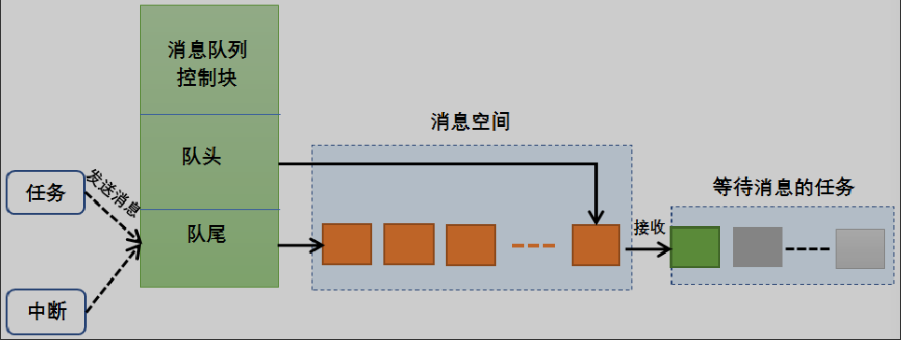

 ## 消息队列
 ### 概念
 __消息队列__（Message Queue）是一种用于任务间通信和数据交换的机制。它允许一个任务将消息发送到队列中，另一个任务从队列中接收消息。消息队列通常用于在不同任务之间传递数据或事件通知。


> 队列就是一个容器(FIFO),一个或者多个task往队列当中发消息，一个或者多个task从队列当中取消息。这样实现通信，

freertos的消息队列
- 支持FIFO、 LIFO也支持异步读写工作方式
- 支持超时机制
- 支持不同长度(在节点长度范围内)的数据类型
- 一个消息队列支持被多个任务读写
- 队列使用一次后自动从消息队列中删除

---
### 拷贝和引用
在c++ 当中，可以接触到引用的概念，引用是一个变量的别名，引用本质上是一个指向变量的指针，但是引用在使用时更加方便，不需要解引用操作符。
在freertos的消息队列中，消息是通过拷贝的方式传递的，而不是通过引用。这意味着当一个任务将数据发送到消息队列时，数据会被复制到队列中，而不是将数据的地址传递给队列。
__设计方法__: 为了避免数据搬运一次就进行拷贝一次，可以使用引用的方式进行数据传递。具体方法是将数据存储在一个共享的内存区域中，然后将该内存区域的地址发送到消息队列中。接收任务可以通过该地址访问数据，而不需要进行数据拷贝。

``` cpp

typedef struct
{
    uint32_t id;
    char data[32];
} Message;

// 假设有一个全局或静态的Message实例，用于共享,避免频繁分配和释放内存，外部文件可以使用
/*extern Message g_Message_sharedMsg; 来进行连接*/
static Message g_Message_sharedMsg;

// 发送任务
void SenderTask(void *pvParameters)
{
    g_Message_sharedMsg.id = 1;
    strcpy(g_Message_sharedMsg.data, "Hello, World!");

    // 发送消息地址（引用）到队列
    Message* msgPtr = &g_Message_sharedMsg;
    xQueueSend(xQueue, &msgPtr, portMAX_DELAY);
}

// 接收任务
void ReceiverTask(void *pvParameters)
{
    Message* msgPtr;
    // 从队列接收消息地址
    xQueueReceive(xQueue, &msgPtr, portMAX_DELAY);

    // 通过地址访问数据（引用传递）
    printf("Received Message: ID=%d, Data=%s\n", msgPtr->id, msgPtr->data);
}
```
> 这里的消息队列传递的是Messag的地址，而不是Messag本身，从而避免了数据拷贝的开销
> 需要注意的是，这种方法要求发送和接收任务对共享内存区域的访问进行适当的同步，以避免数据竞争和不一致性问题。

__为什么要传全局变量的地址？__
因为局部变量在函数调用结束后会被销毁，如果传递局部变量的地址，接收任务可能会访问到无效的内存地址，导致不可预知的行为。
使用全局变量，可以只进行一次内存分配(拷贝)，避免频繁的分配和释放内存带来的开销，同时确保数据在任务间的有效传递。

#### 零拷贝&二级指针
__零拷贝__（Zero-Copy）是一种优化技术，旨在减少数据在不同内存区域之间的复制次数，从而提高系统性能。在消息队列中，零拷贝意味着数据可以直接从发送任务传递到接收任务，而不需要经过中间的缓冲区或复制操作。
__二级指针__（Pointer to Pointer）是一种指针类型，它指向
另一个指针。使用二级指针可以实现对指针本身的修改，从而实现更灵活的数据传递和管理。

发送的是指针的地址（即二级指针），接收方接收到的是指针，可以直接访问数据，而不需要进行数据拷贝。
``` cpp
/* 注意：向队列发送指针时，队列创建时的项大小应为 sizeof(Message*) */
/* 发送（发送指针的地址：Message* 的地址） */
Message* p_msgPtr = &g_Message_sharedMsg;
xQueueSend(xQueue, &p_msgPtr, portMAX_DELAY);

/* 接收 */
Message* p_msgPtr1 = NULL;
xQueueReceive(xQueue, &p_msgPtr1, portMAX_DELAY);

/* 直接访问共享数据（零拷贝） */
printf("Received Message: ID=%u, Data=%s\n", (unsigned)p_msgPtr1->id, p_msgPtr1->data);

/* 如果需要把数据拷贝到本地副本（更安全） */
Message local;
local.id = p_msgPtr1->id;
memcpy(local.data, p_msgPtr1->data, sizeof(local.data));
printf("Copied Message: ID=%u, Data=%s\n", (unsigned)local.id, local.data);
```

---
### 深入理解消息队列
#### 消息队列控制块
消息队列的控制块（Message Queue Control Block）是操作系统内部用于管理消息队列的数据结构。==它包含了消息队列的各种属性和状态信息，如队列的长度、消息的大小、当前消息的数量、读写指针等。==


__队列控制块源码`struct QueueDefinition`__:

``` cpp
/*
 * Definition of the queue used by the scheduler.
 * Items are queued by copy, not reference.  See the following link for the
 * rationale: http://www.freertos.org/Embedded-RTOS-Queues.html
 */
typedef struct QueueDefinition
{
	int8_t *pcHead;					/*< Points to the beginning of the queue storage area. */
	int8_t *pcTail;					/*< Points to the byte at the end of the queue storage area.  Once more byte is allocated than necessary to store the queue items, this is used as a marker. */
	int8_t *pcWriteTo;				/*< Points to the free next place in the storage area. */

	union						/* Use of a union is an exception to the coding standard to ensure two mutually exclusive structure members don't appear simultaneously (wasting RAM). */
	{
		int8_t *pcReadFrom;			/*< Points to the last place that a queued item was read from when the structure is used as a queue. */
		UBaseType_t uxRecursiveCallCount;/*< Maintains a count of the number of times a recursive mutex has been recursively 'taken' when the structure is used as a mutex. */
	} u;

	List_t xTasksWaitingToSend;		/*< List of tasks that are blocked waiting to post onto this queue.  Stored in priority order. */
	List_t xTasksWaitingToReceive;	/*< List of tasks that are blocked waiting to read from this queue.  Stored in priority order. */

	volatile UBaseType_t uxMessagesWaiting;/*< The number of items currently in the queue. */
	UBaseType_t uxLength;			/*< The length of the queue defined as the number of items it will hold, not the number of bytes. */
	UBaseType_t uxItemSize;			/*< The size of each items that the queue will hold. */

	volatile int8_t cRxLock;		/*< Stores the number of items received from the queue (removed from the queue) while the queue was locked.  Set to queueUNLOCKED when the queue is not locked. */
	volatile int8_t cTxLock;		/*< Stores the number of items transmitted to the queue (added to the queue) while the queue was locked.  Set to queueUNLOCKED when the queue is not locked. */

	#if( ( configSUPPORT_STATIC_ALLOCATION == 1 ) && ( configSUPPORT_DYNAMIC_ALLOCATION == 1 ) )
		uint8_t ucStaticallyAllocated;	/*< Set to pdTRUE if the memory used by the queue was statically allocated to ensure no attempt is made to free the memory. */
	#endif

	#if ( configUSE_QUEUE_SETS == 1 )
		struct QueueDefinition *pxQueueSetContainer;
	#endif

	#if ( configUSE_TRACE_FACILITY == 1 )
		UBaseType_t uxQueueNumber;
		uint8_t ucQueueType;
	#endif

} xQUEUE;
```
该部分用于理解消息队列的内部工作原理，帮助开发者更好地使用和调试消息队列。