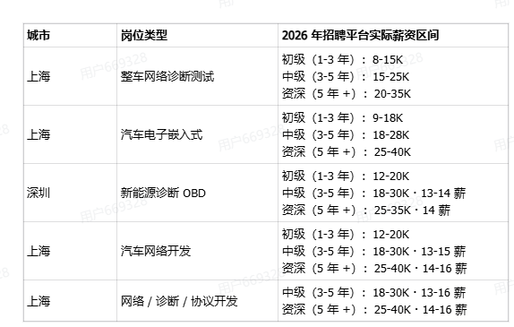
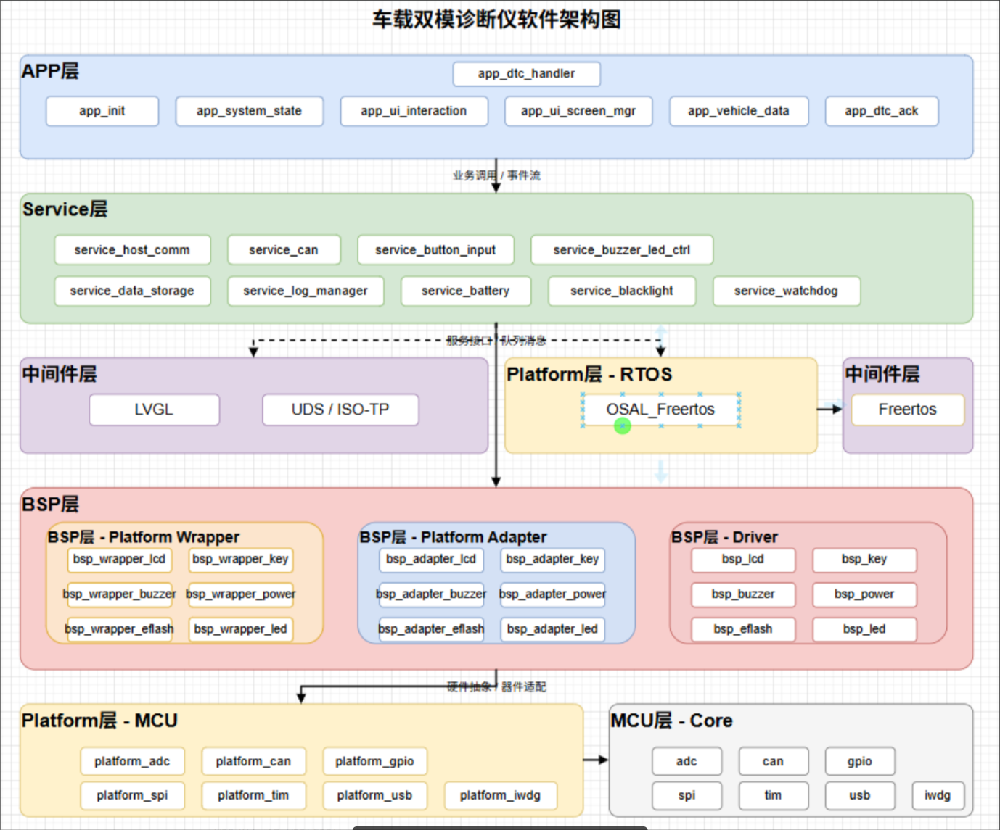

## 课程导学

### 为什么要学OBD项目

OBD项目是汽车行业中非常重要的一个领域，涉及到车辆诊断、维修和维护等方面。学习OBD项目可以帮助我们更好地理解汽车的工作原理，提高我们的维修技能，并且在未来的职业发展中具有很大的优势。

- 整车/ECU诊断：OBD项目可以帮助我们了解整车和ECU的诊断方法，掌握如何使用诊断工具进行故障排除和维修。

- 诊断仪/测试工具开发：OBD终端开发，数据读取和显示
- 车载测试和联调：CAN通信联调，UDS诊断链路，故障码模拟和验证
- 售后和运维支持：OBD项目可以帮助我们提供更好的售后服务和运维支持，提升客户满意度。

基本薪资

### 为什么把OBD项目作为学习主线

``` bash 
上电->系统自检->CAN诊断->数据显示->modBus 远程控制
```


#### 车载通信基础

**车载通信基础**
- CAN物理层 
- CAN协议层
- 过滤器

**诊断协议方向**
- UDS/OBD/DID
- ISO-TP多帧传输

**工程开发能力**
- 平台化抽象
- 模块化设计
- 四层架构设计

**项目落地能力**
- Modebus 
- USB CDC
- LVGL
- FLASh 日志和联调


##### 四层架构设计

- APP应用层
> UI 交互 DTC处理 车辆数据处理

- Service服务层
> CAN收发，主机通信，数据存储

- Platform平台层
> 硬件抽象，操作系统，驱动接口

- BSP/HAL底层
> 硬件初始化，外设驱动，系统时钟




### 怎么学懂

1. 导学和全局认知
2. CAN外设驱动 + UDS配置
3. 架构设计 + LVGL -> CAN
4. UDS/ISO - TP /DID 实战
5. modebus + USB CDC 实战
6. 日志 界面 综合实战

> 每节课后跑一下代码，理解每行代码的作用和实现原理，遇到不懂的地方及时提问和讨论。