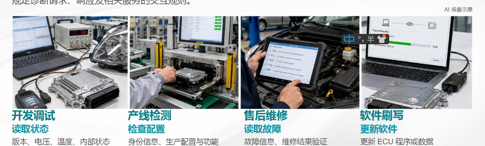
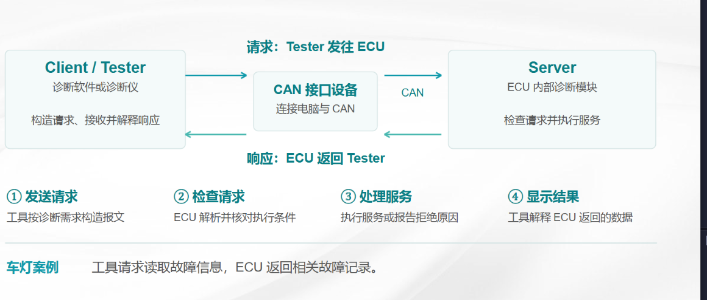
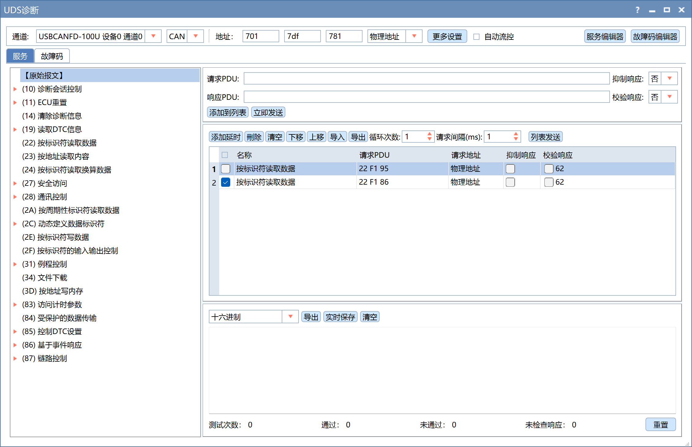
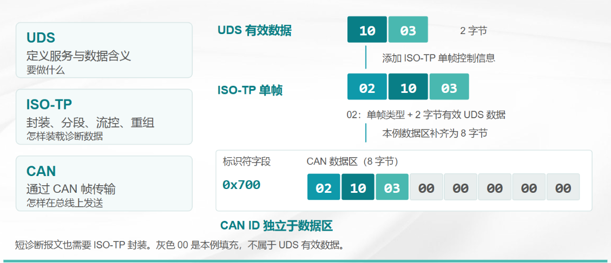
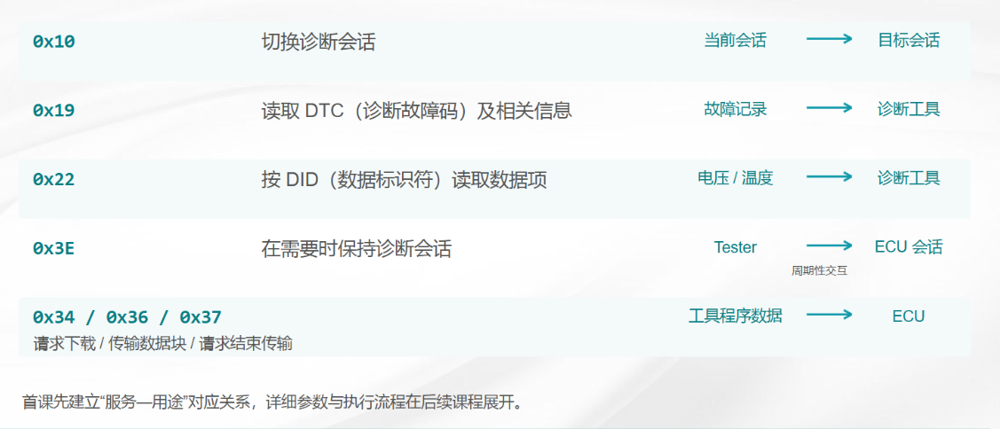
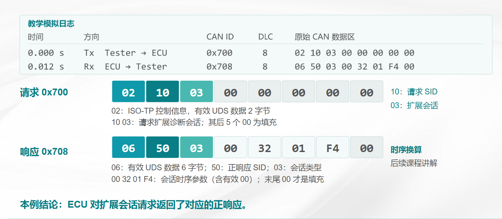
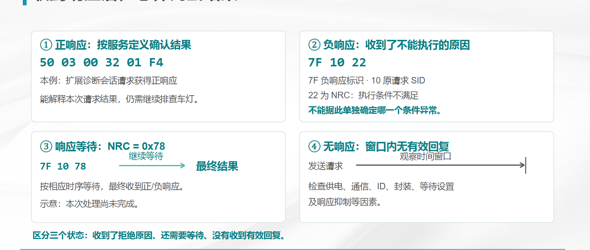

# UDS 基础

> 本文面向第一次接触汽车诊断的读者。示例用于理解报文结构，CAN ID、DID、
> 会话权限、seed/key 算法、刷写地址和超时参数必须以具体项目的诊断调查表、
> DBC、Bootloader 和源码为准。

## 1. 为什么需要 UDS

UDS（Unified Diagnostic Services，统一诊断服务）是诊断工具和 ECU 之间约定
的一组服务。它把“读取什么、写入什么、如何清故障、如何刷写程序”等动作，
定义成可以在总线上传输的请求和响应。

常见使用场景如下：

- **开发调试**：读取软件版本、电压、温度、传感器状态和内部状态。
- **产线测试**：检查硬件配置、写入车辆信息、执行下线检测和功能测试。
- **售后维修**：读取当前故障和历史故障，查看故障发生时的环境数据。
- **软件更新**：切换编程会话、擦除存储区、传输新固件并校验。



UDS 的价值在于把不同 ECU 的诊断动作统一成标准化服务。诊断工具不必知道
ECU 内部每个函数的实现方式，只需要按照服务格式发送请求并解析响应。

## 2. 诊断工具如何和 ECU 对话

诊断工具可以是 ZCANPRO、CANoe、自研刷写工具、TBOX 或另一块作为诊断客户
端的控制器。被诊断的控制器称为 ECU，也可以称为 Server。



典型过程如下：

1. 诊断工具通过 CAN 接口连接车辆或台架。
2. 工具向目标 ECU 的诊断请求 ID 发送 UDS 请求。
3. ECU 接收请求，检查服务、会话、权限和当前条件。
4. ECU 返回肯定响应或否定响应。
5. 如果数据超过一帧，ISO-TP 会负责分段、流控和重组。

例如，工具想读取 ECU 的一个 DID，可以发送 `22 DID_H DID_L`。ECU 支持该
服务且条件满足时，返回 `62 DID_H DID_L 数据...`。



在一些项目中，ZCANPRO 的 DID 列表会出现 `F186`、`F193` 或 `F195`。DID
只是一个数据标识符，具体代表 Boot 版本、应用版本、硬件版本还是其他数据，
必须查看项目定义，不能仅凭 DID 数值猜测。

## 3. CAN、ISO-TP 和 UDS 的关系

这三者处于不同层次：

| 层次 | 名称 | 负责什么 | 典型内容 |
| --- | --- | --- | --- |
| 应用层 | UDS | 定义诊断服务和参数 | `22 F1 95` |
| 传输层 | ISO-TP | 分段、重组、流控和长度管理 | `02`、`10`、`21`、`30` |
| 数据链路层 | CAN | 通过 CAN ID 传输一帧数据 | ID、DLC、Data[0..7] |

可以把它们理解成寄快递：

- CAN 是快递车，每次最多装一个 CAN 数据帧。
- ISO-TP 是分包规则，决定大包如何拆成首帧和连续帧。
- UDS 是业务单据，说明这次要读版本、清故障还是刷程序。




### 3.1 不要把 CAN 数据区都当成 UDS 数据

一帧 CAN 报文通常有以下字段：

```text
CAN ID + DLC + Data[0] ... Data[7]
```

在 ISO-TP over CAN 中，`Data[0]` 往往是 PCI（Protocol Control Information，
协议控制信息），它用于表示单帧、首帧、连续帧或流控帧。PCI 不属于 UDS 的
SID 和业务参数。

例如下面的 CAN 数据：

```text
CAN ID: 0x701
DLC:    8
DATA:   03 22 F1 95 AA AA AA AA
```

逐字节解释如下：

```text
03       ISO-TP 单帧 PCI，表示后面有 3 字节 UDS 数据
22 F1 95 UDS 载荷：SID=0x22，DID=0xF195
AA...    填充字节，不属于 UDS 业务数据
```

因此，这里的 UDS 有效载荷是 `22 F1 95`，不是整行 8 个字节，也不是只有
“2 字节”。`03` 表示 UDS 载荷长度为 3；实际 UDS 载荷长度可以是 1 字节，
也可以是数百字节。

## 4. UDS 报文的基本规律

### 4.1 SID、子功能和 DID

- **SID（Service Identifier）**：服务标识符，例如 `0x10`、`0x22`、`0x19`。
- **Sub-function**：子功能，用于区分同一服务下的不同动作，例如 `0x10 03`
  表示进入扩展会话。
- **DID（Data Identifier）**：数据标识符，通常占两个字节，例如 `F1 95`。

常见请求结构为：

```text
SID
SID + Sub-function
SID + DID_H + DID_L
SID + Sub-function + DID 或其他参数
```

### 4.2 肯定响应和否定响应

UDS 的基本响应规律如下：

| 类型 | 格式 | 示例 | 含义 |
| --- | --- | --- | --- |
| 请求 | `SID + 参数` | `22 F1 95` | 请求读取 DID |
| 肯定响应 | `SID + 0x40 + 参数` | `62 F1 95 ...` | 服务执行成功 |
| 否定响应 | `7F + 原 SID + NRC` | `7F 22 31` | 请求被拒绝 |

肯定响应 SID 只对 SID 做加法。例如：

```text
请求 SID       0x22
肯定响应 SID   0x22 + 0x40 = 0x62
```

否定响应中的第二个字节仍然是原始 SID，第三个字节是 NRC（Negative Response
Code，否定响应码）。

### 4.3 常见 NRC

| NRC | 名称 | 常见含义 |
| --- | --- | --- |
| `0x10` | generalReject | ECU 无法用更具体的 NRC 说明拒绝原因 |
| `0x11` | serviceNotSupported | 不支持该 SID |
| `0x12` | subFunctionNotSupported | 不支持该子功能 |
| `0x13` | incorrectMessageLengthOrInvalidFormat | 长度或格式错误 |
| `0x22` | conditionsNotCorrect | 当前条件不满足 |
| `0x24` | requestSequenceError | 请求顺序错误 |
| `0x31` | requestOutOfRange | 参数、DID、地址或记录号超出范围 |
| `0x33` | securityAccessDenied | 尚未通过安全访问 |
| `0x35` | invalidKey | key 不正确 |
| `0x36` | exceedNumberOfAttempts | 错误次数超过限制 |
| `0x37` | requiredTimeDelayNotExpired | 还未到允许再次尝试的时间 |
| `0x78` | responsePending | 请求已接收，处理仍未完成 |

`0x78` 不是最终失败。ECU 正在执行擦除、校验或其他耗时操作时，可以先返回
`7F SID 78`，完成后还应继续发送最终的肯定响应或其他最终否定响应。

## 5. UDS 的寻址方式

### 5.1 物理寻址

物理寻址针对一个明确 ECU。工具把请求发送给某个 ECU 的请求 ID，只有目标
ECU 返回响应。它适合读版本、读 DTC、刷写等需要确认目标的操作。

### 5.2 功能寻址

功能寻址把请求发送给一组支持该功能的 ECU。多个 ECU 可能同时收到请求，因
此并非每个 ECU 都必须回复。清除故障或切换某些公共状态时，项目可能会使用
功能寻址，但是否允许必须以诊断规范为准。

### 5.3 CAN ID 只是项目配置

教学中经常使用以下示例：

```text
Tester -> ECU: 0x701
ECU -> Tester: 0x781
功能请求:      0x7DF
```

这不是所有项目的固定值。实际项目可能使用不同的 ID，甚至存在多个 ECU、
网关转发或代理刷写路径。调试时必须同时确认请求方向、响应方向、波特率和
寻址类型。

## 6. ISO-TP 入门

CAN 一帧最多携带 8 个数据字节，但 UDS 消息经常超过 7 个有效字节，因此需要
ISO-TP。ISO-TP 的 PCI 高半字节表示帧类型：

| PCI 高半字节 | 帧类型 | 作用 |
| --- | --- | --- |
| `0x0` | Single Frame，单帧 | 一帧内完成传输 |
| `0x1` | First Frame，首帧 | 声明总长度并发送开头数据 |
| `0x2` | Consecutive Frame，连续帧 | 继续发送剩余数据 |
| `0x3` | Flow Control，流控帧 | 接收方告知发送方如何继续 |

### 6.1 单帧示例

请求 `22 F1 95` 的 UDS 载荷长度为 3，因此可用单帧：

```text
CAN ID 0x701: 03 22 F1 95 AA AA AA AA
                 |  |--------|
                 |    UDS 载荷
                 单帧长度=3
```

### 6.2 多帧示例

假设 ECU 返回 13 字节 UDS 载荷：

```text
62 F1 90 31 32 33 34 35 36 37 38 39 00
```

典型传输过程如下：

```text
ECU -> Tester  0x781: 10 0D 62 F1 90 31 32 33
Tester -> ECU  0x701: 30 00 00 AA AA AA AA AA
ECU -> Tester  0x781: 21 34 35 36 37 38 39 00
```

逐帧解释：

1. `10 0D` 表示首帧，总 UDS 载荷长度为 `0x0D`，即 13 字节。
2. 首帧后面携带 UDS 载荷的前 6 个字节。
3. `30 00 00` 是流控帧，表示继续发送，块大小为 0，最小间隔为 0。
4. `21` 表示第 1 个连续帧，低四位是序号；连续帧序号到 `2F` 后循环。
5. 最后一帧不足 7 个数据字节时，剩余位置用项目约定的填充字节补齐。

## 7. 常用服务详解



### 7.1 `0x10` DiagnosticSessionControl

诊断会话决定 ECU 当前开放哪些服务。常见子功能如下：

| 子功能 | 名称 | 常见用途 |
| --- | --- | --- |
| `0x01` | Default Session | 默认诊断状态 |
| `0x02` | Programming Session | 软件刷写 |
| `0x03` | Extended Session | 高级诊断和测试 |

进入扩展会话的教学示例：

```text
请求:       10 03
肯定响应:   50 03 00 32 01 F4
```

响应中的后续字节通常用于告诉 Tester 的 P2/P2* 时间参数。不同项目可能采用
不同编码和数值，不能只根据示例推断实际超时。

进入非默认会话后，ECU 通常会启动 S3 会话计时器。Tester 在规定时间内发送
`3E` 保活，或者继续发送其他有效诊断请求，避免 ECU 回到默认会话。

### 7.2 `0x3E` TesterPresent

`0x3E` 用来告诉 ECU：“Tester 仍然在线，请保持当前会话。”

```text
请求:       3E 00
肯定响应:   7E 00
```

某些场景会设置抑制肯定响应位，此时 ECU 可能不返回 `7E`。这不代表请求格式
错误，Tester 需要按照项目配置处理。

### 7.3 `0x22` ReadDataByIdentifier

`0x22` 根据 DID 读取数据。请求格式为：

```text
22 DID_H DID_L
```

以读取软件版本 DID `F195` 为例：

```text
CAN ID 0x701: 03 22 F1 95 AA AA AA AA
CAN ID 0x781: 07 62 F1 95 31 2E 35 2E
```

其中：

```text
03       单帧 UDS 载荷长度
22       ReadDataByIdentifier
F1 95    DID
62       0x22 的肯定响应 SID
31 2E... ASCII 数据示例，例如版本字符串的一部分
```



常见失败示例：

```text
请求 DID 不支持:  7F 22 31
格式或长度错误:   7F 22 13
当前条件不满足:   7F 22 22
```

### 7.4 `0x19` ReadDTCInformation

`0x19` 用于读取 DTC 数量、状态、快照和扩展数据。项目不一定支持所有子功能，
需要查看诊断调查表。

读取当前状态匹配的 DTC，常见教学请求为：

```text
19 02 FF
|  |  |
|  |  状态掩码：示例中匹配所有可用状态位
|  按状态掩码读取 DTC
读取 DTC 信息
```

典型响应：

```text
59 02 FF 0A 08 17 2F
|  |  |  |--------|  |
|  |  |      3 字节 DTC
|  |  DTC 状态可用掩码
|  子功能
肯定响应 SID
```

一个 DTC 记录通常由 3 字节 DTC 加 1 字节状态组成。`0A 08 17` 和 `2F` 必须
按照项目 DTC 格式解释，不能只凭数值猜出故障名称。

### 7.5 `0x14` ClearDiagnosticInformation

`0x14` 用于清除指定 DTC 分组的诊断信息。它不是 `0x31`，也不是简单地把
当前显示的一个字符串删除。ECU 可能还需要清除状态、快照、扩展数据和持久化
存储。

示例：

```text
请求:       14 FF FF FF
肯定响应:   54
```

`FF FF FF` 表示 DTC 分组的教学示例。实际项目可能只允许清除某些分组，或者
要求满足点火、电压、车辆静止等条件。

### 7.6 `0x27` SecurityAccess

安全访问通常采用 seed/key 流程：

1. Tester 请求 seed。
2. ECU 返回随机或伪随机 seed。
3. Tester 按项目算法计算 key。
4. Tester 发送 key。
5. ECU 校验成功后开放受保护服务。

教学报文：

```text
请求 seed:    27 05
返回 seed:    67 05 12 34 56 78
发送 key:     27 06 A1 B2 C3 D4
解锁成功:     67 06
```

上面的 seed 和 key 只是示例，不能用于真实 ECU。真实算法、等级、长度、
错误次数和延时都属于项目安全配置。

### 7.7 `0x31` RoutineControl

`0x31` 用于启动、停止或读取某个例程结果。常见例程包括擦除 Flash、校验
CRC、检查编程条件和执行自检。

```text
请求启动例程:  31 01 RID_H RID_L 参数...
肯定响应:      71 01 RID_H RID_L 结果...
```

其中 `0x01` 通常表示 startRoutine，但具体 RID 和参数由项目定义。擦除时间较
长时，ECU 可能先返回 `7F 31 78`，完成后再返回 `71` 或最终错误。

### 7.8 `0x34`、`0x36`、`0x37` 刷写传输

软件刷写不是只发送一条“升级命令”，而是一组有顺序的服务：

| 步骤 | 服务 | 作用 |
| --- | --- | --- |
| 1 | `0x10` | 进入编程会话 |
| 2 | `0x27` | 获取权限 |
| 3 | `0x31` | 擦除或检查编程条件 |
| 4 | `0x34` | 声明目标地址和数据大小 |
| 5 | `0x36` | 按块传输固件 |
| 6 | `0x37` | 声明传输结束 |
| 7 | `0x31` | 校验完整性 |
| 8 | `0x11` | 复位 ECU |

简化示例：

```text
10 02                 -> 50 02 ...
27 05                 -> 67 05 seed...
27 06 key...          -> 67 06
31 01 FF 00           -> 71 01 FF 00 ...
34 ...                -> 74 ...
36 01 data-block-1    -> 76 01
36 02 data-block-2    -> 76 02
37                    -> 77 ...
31 01 CRC...          -> 71 01 ...
11 01                 -> 51 01
```

实际刷写时还可能包含 `0x28` 通信控制、`0x85` DTC 设置、指纹写入、Bootloader
跳转、双分区切换和掉电恢复。必须按照目标 ECU 的刷写规范执行，不能只套用
上面的简化顺序。

## 8. 三个完整学习案例

### 案例一：读取软件版本

目标：读取 DID `F195`。

```text
1. Tester -> ECU:  CAN ID 0x701, DATA=03 22 F1 95 AA AA AA AA
2. ECU -> Tester:  CAN ID 0x781, DATA=08 62 F1 95 31 2E 35 2E
```

阅读方法：先去掉 ISO-TP 的 `03` 或 `08`，再解析 UDS 载荷。请求 SID 是
`22`，响应 SID 是 `62`，两边的 DID 都是 `F195`。

### 案例二：读取 DTC 后清除

```text
1. 请求读取:  19 02 FF
2. 正常响应:  59 02 FF 0A 08 17 2F
3. 请求清除:  14 FF FF FF
4. 正常响应:  54
5. 再次读取:  19 02 FF
```

清除后再次读取不一定立即得到“完全空白”。具体结果取决于故障是否仍然存在、
是否保留历史记录、是否有持久化延迟，以及项目对 DTC 状态的定义。

### 案例三：为什么刷写中会看到 `0x78`

擦除 Flash 可能需要较长时间：

```text
Tester -> ECU: 31 01 FF 00
ECU -> Tester: 7F 31 78
ECU -> Tester: 7F 31 78
ECU -> Tester: 71 01 FF 00 00
```

前两个响应表示仍在处理中，最后一条才是最终肯定响应。Tester 如果把第一条
`0x78` 当成最终失败，可能会错误地中断一个实际正常的刷写流程。

## 9. 诊断调试方法

### 9.1 完全没有响应

按以下顺序检查：

1. CAN 物理层是否正常，设备是否打开，波特率是否正确。
2. 请求 ID、响应 ID 和扩展/标准帧格式是否正确。
3. CAN DLC 和数据字节是否正确，是否遗漏 ISO-TP PCI。
4. ECU 是否上电、是否处于允许诊断的状态。
5. 请求是否使用了功能寻址，而工具却等待单个 ECU 的物理响应。

### 9.2 收到 `7F`

先按 `7F + 原 SID + NRC` 拆解，不要只看“失败”两个字：

```text
7F 22 13  -> 0x22 请求长度或格式错误
7F 22 31  -> DID 或参数超出范围
7F 34 22  -> 当前电压、会话或其他条件不满足
7F 27 33  -> 安全访问尚未开放
```

同一个 SID 可能因为会话、权限、参数和前置步骤不同返回不同 NRC。



### 9.3 只收到 `0x78`

确认工具是否支持等待响应，确认 ECU 后续是否发送最终响应，并检查 P2/P2*
超时配置。若 ECU 只重复 `0x78` 而没有最终响应，应进一步查看服务任务、
Flash 操作、看门狗和异常复位记录。

### 9.4 多帧无法完成

重点检查：

- 首帧声明的总长度是否与实际 UDS 载荷一致；
- Tester 是否在首帧后发送流控帧；
- Block Size 和 STmin 是否被双方正确解释；
- 连续帧序号是否从 `1` 开始并按 4 位循环；
- CAN ID 方向是否在请求和响应路径中反了；
- 填充字节是否被错误地当成业务数据。

## 10. 读报文的固定步骤

拿到一条 CAN 诊断报文时，可以固定按下面的顺序阅读：

1. **确认方向**：这是 Tester 发给 ECU，还是 ECU 回给 Tester？
2. **确认 ID**：是物理寻址还是功能寻址？ID 是否属于目标 ECU？
3. **确认 DLC**：数据长度是否合理？
4. **解析 PCI**：判断单帧、首帧、连续帧还是流控帧。
5. **提取 UDS 载荷**：去掉 PCI 和填充字节。
6. **识别 SID**：确定服务类型。
7. **识别参数**：继续解析子功能、DID、RID、地址、长度或状态掩码。
8. **判断响应**：看是肯定响应、最终否定响应，还是 `0x78` 等待响应。
9. **核对前置条件**：会话、安全访问、车辆状态和服务顺序是否满足。

## 11. 文档中的示例与项目配置边界

本文示例是为了帮助理解协议结构，不等于某个 ECU 的完整诊断规范。以下内容
必须从项目资料确认：

- CAN 请求 ID、响应 ID、功能 ID 和波特率；
- 支持的会话和每个服务的权限；
- DID 的实际含义、长度、编码和版本字符串格式；
- DTC 编号、状态位、快照和清除策略；
- seed/key 算法、访问等级、错误次数和延时；
- 刷写地址、数据块大小、擦除例程、CRC 算法和复位方式；
- ISO-TP 的填充字节、Block Size、STmin 和超时参数。

源码能够证明“软件当前实现了什么”，编译能够证明“代码能否通过构建”，
但这两者都不能代替 CAN 抓包、台架刷写和实车验证。

## 12. 常用术语表

| 术语 | 中文 | 解释 |
| --- | --- | --- |
| Tester | 诊断工具 | 发起诊断请求的一方 |
| ECU/Server | 被诊断 ECU | 接收请求并返回响应的一方 |
| SID | 服务标识符 | 例如 `0x22` |
| DID | 数据标识符 | 例如 `0xF195` |
| RID | 例程标识符 | `0x31` 使用的例程编号 |
| NRC | 否定响应码 | 说明请求为什么被拒绝 |
| DTC | 诊断故障码 | ECU 记录的故障编号和状态 |
| ISO-TP | ISO 15765-2 传输协议 | 在 CAN 上承载长诊断消息 |
| SF/FF/CF/FC | 单帧/首帧/连续帧/流控帧 | ISO-TP 的四种主要帧类型 |

## 13. 自测题

1. `02 10 03` 中的 `02`、`10`、`03` 分别代表什么？
2. 为什么 `0x22` 的肯定响应是 `0x62`？
3. `7F 22 13` 和 `7F 22 31` 的原因有什么不同？
4. 为什么超过单帧长度后不能直接把数据连续塞进多个 CAN 帧？
5. `0x78` 是最终失败吗？Tester 还需要等待什么？
6. 读取 DID 前，需要确认哪些 CAN、会话和权限信息？
7. `0x14` 和 `0x31` 在清故障和执行例程方面有什么区别？

建议先自己拆解，再对照下面的答案：

```text
1. 0x02 是单帧长度，0x10 是 SID，0x03 是会话子功能。
2. 肯定响应 SID = 请求 SID + 0x40，即 0x22 + 0x40 = 0x62。
3. 0x13 是长度或格式错误，0x31 是参数或资源超出范围。
4. 多帧必须使用 ISO-TP 的首帧、流控帧和连续帧，接收端才能知道总长度和顺序。
5. 不是，0x78 表示处理中，最终还应收到肯定响应或其他最终 NRC。
6. 至少确认请求/响应 ID、DID 定义、当前会话、访问权限和 ECU 前置条件。
7. 0x14 是清除诊断信息，0x31 是控制指定例程，例程可能用于擦除或校验。
```
