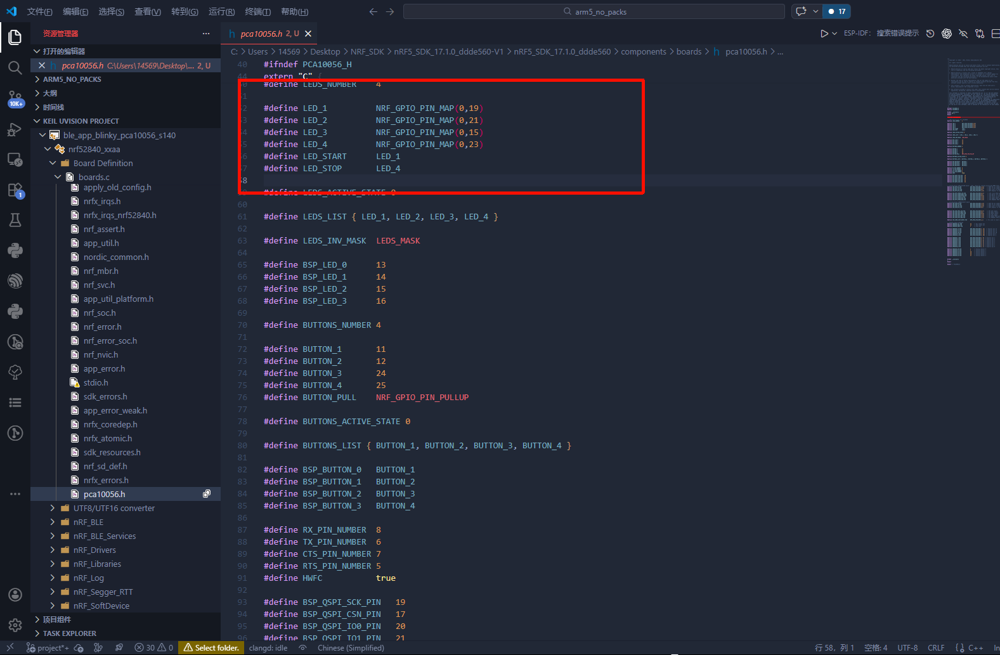
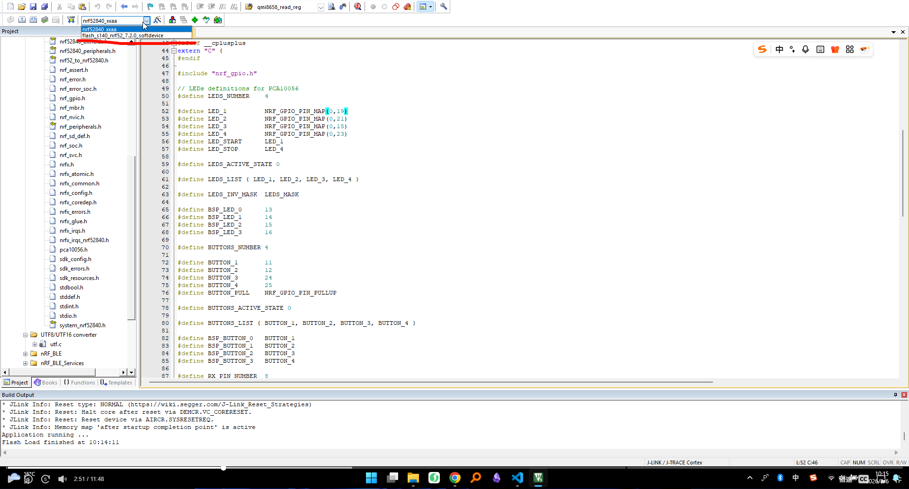
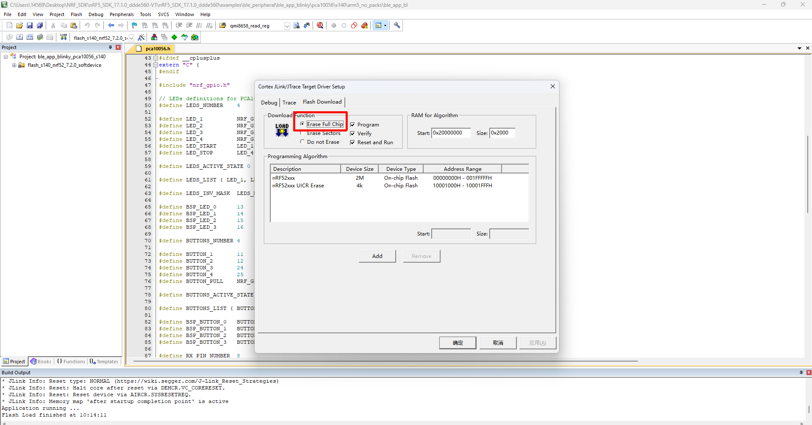
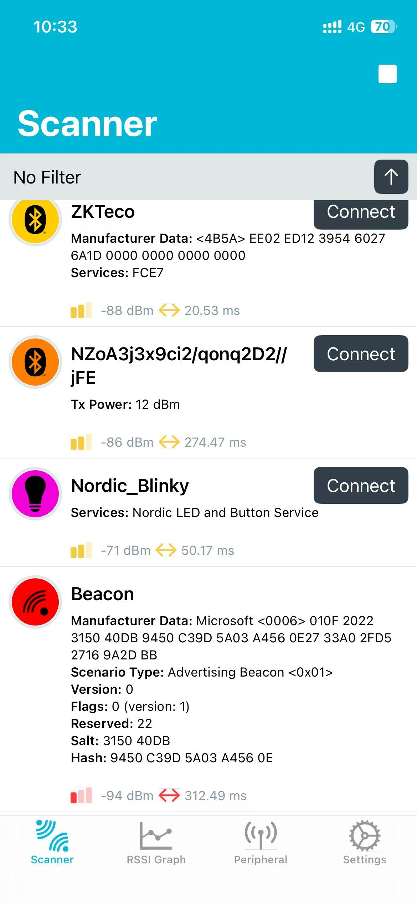
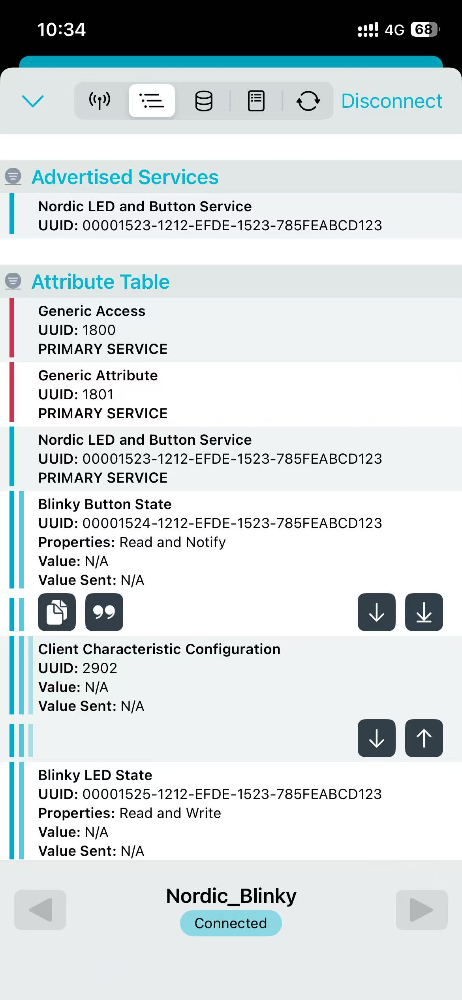

## SDK说明

因为BLE的逻辑，都会兼容很多的demo，所以在SDK当中，就有很多的架构逻辑，为了兼容众多的demo，学习BLE的代码的时候，架构一定要清晰，才能更好的理解BLE的代码。

### 回顾注册器模式

注册器模式是一个设计模式，主要用于管理和组织对象的创建和生命周期。在这个模式中，注册器（Registry）负责维护一个对象的集合，并提供接口来注册、获取和管理这些对象。注册器模式通常用于实现依赖注入、服务定位器等功能。

为什么这样做：

1. BLE项目里模块多（GATT、连接管理、按键、LED、日志），注册器可以把“模块对象”和“查找逻辑”统一起来。
2. 当你换板子或换驱动时，只要替换注册对象，不需要到处改业务逻辑。
3. 代码分层更清晰，便于调试和扩展。

### 一个LED灯的例子（C语言）

```c
#include <stdbool.h>
#include <stdint.h>

#define MAX_LED_DEVICES 8

typedef struct {
    uint8_t id;
    bool state;
} LED;

typedef struct {
    LED *table[MAX_LED_DEVICES];
} LEDRegistry;

// 初始化注册器
void led_registry_init(LEDRegistry *registry) {
    if (registry == NULL) {
        return;
    }

    for (uint8_t i = 0; i < MAX_LED_DEVICES; i++) {
        registry->table[i] = NULL;
    }
}

// 注册LED设备：根据id放入注册表
bool led_registry_register(LEDRegistry *registry, LED *led) {
    if (registry == NULL || led == NULL) {
        return false;
    }

    if (led->id >= MAX_LED_DEVICES) {
        return false;
    }

    registry->table[led->id] = led;
    return true;
}

// 按id获取LED设备
LED *led_registry_get(LEDRegistry *registry, uint8_t id) {
    if (registry == NULL || id >= MAX_LED_DEVICES) {
        return NULL;
    }

    return registry->table[id];
}

// 控制LED开关
bool led_turn_on(LEDRegistry *registry, uint8_t id) {
    LED *led = led_registry_get(registry, id);
    if (led == NULL) {
        return false;
    }

    led->state = true;
    return true;
}

bool led_turn_off(LEDRegistry *registry, uint8_t id) {
    LED *led = led_registry_get(registry, id);
    if (led == NULL) {
        return false;
    }

    led->state = false;
    return true;
}
```

### 点亮一个LED灯



在这里，根据开发版的原理图，这几个原生的LED灯是在reset引脚上，所以当控制LED灯的时候，实际上会让板子重启，重启之后会没有蓝牙了，导致一直卡死在这里，这里需要改一下。

操作LED3进行控制，更改LED的状态，让他们达到点亮的效果。
下载完了LED的代码之后，还需要下载协议栈的代码，协议栈的代码是放在SDK当中的，所以需要把协议栈的代码也下载到开发板上，才能让LED灯正常的工作。




因为这里板子里面已经有协议栈的代码了，不一定能够正常工作，使用擦除的全部Flash的方式，来把协议栈的代码也下载到开发板上，这样就能够让LED灯的demo正常的工作了。

#### 使用NRF





出现了uuid和service的概念，uuid是一个128位的唯一标识符，用于标识一个服务或者特征，service是一个包含多个特征的集合，用于组织和管理特征。

在Binkky LED State 当中写入 0x01，就能够让LED灯点亮，写入0x00，就能够让LED灯熄灭。


##### 代码讲解

```c
/**@brief Function for handling write events to the LED characteristic.
 *
 * @param[in] p_lbs     Instance of LED Button Service to which the write applies.
 * @param[in] led_state Written/desired state of the LED.
 */
static void led_write_handler(uint16_t conn_handle, ble_lbs_t * p_lbs, uint8_t led_state)
{
    if (led_state)
    {
        bsp_board_led_on(LEDBUTTON_LED);
        NRF_LOG_INFO("Received LED ON!");
    }
    else
    {
        bsp_board_led_off(LEDBUTTON_LED);
        NRF_LOG_INFO("Received LED OFF!");
    }
}

/**@brief Function for initializing services that will be used by the application.
 */
static void services_init(void)
{
    ret_code_t         err_code;
    ble_lbs_init_t     init     = {0};
    nrf_ble_qwr_init_t qwr_init = {0};

    // Initialize Queued Write Module.
    qwr_init.error_handler = nrf_qwr_error_handler;

    err_code = nrf_ble_qwr_init(&m_qwr, &qwr_init);
    APP_ERROR_CHECK(err_code);

    // Initialize LBS.
    /** 注册LED驱动的事件处理函数 */
    init.led_write_handler = led_write_handler;

    err_code = ble_lbs_init(&m_lbs, &init);
    APP_ERROR_CHECK(err_code);
}

```
和杰理的芯片一样，不同接口的uuid使用了不同的handle来处理不同的事件，这种逻辑叫做事件驱动，也就是当某个事件发生的时候，触发对应的事件处理函数来处理这个事件，这样就能够实现不同事件的处理逻辑分离，代码更加清晰和易于维护。

Nodic的SDK当中，使用了事件驱动的方式来处理不同的事件，比如连接事件、断开事件、写入事件等等，这些事件都会触发对应的事件处理函数来处理这些事件，这样就能够实现不同事件的处理逻辑分离，代码更加清晰和易于维护。


``` cpp
/**
 * Copyright (c) 2015 - 2021, Nordic Semiconductor ASA
 *
 * All rights reserved.
 *
 * Redistribution and use in source and binary forms, with or without modification,
 * are permitted provided that the following conditions are met:
 *
 * 1. Redistributions of source code must retain the above copyright notice, this
 *    list of conditions and the following disclaimer.
 *
 * 2. Redistributions in binary form, except as embedded into a Nordic
 *    Semiconductor ASA integrated circuit in a product or a software update for
 *    such product, must reproduce the above copyright notice, this list of
 *    conditions and the following disclaimer in the documentation and/or other
 *    materials provided with the distribution.
 *
 * 3. Neither the name of Nordic Semiconductor ASA nor the names of its
 *    contributors may be used to endorse or promote products derived from this
 *    software without specific prior written permission.
 *
 * 4. This software, with or without modification, must only be used with a
 *    Nordic Semiconductor ASA integrated circuit.
 *
 * 5. Any software provided in binary form under this license must not be reverse
 *    engineered, decompiled, modified and/or disassembled.
 *
 * THIS SOFTWARE IS PROVIDED BY NORDIC SEMICONDUCTOR ASA "AS IS" AND ANY EXPRESS
 * OR IMPLIED WARRANTIES, INCLUDING, BUT NOT LIMITED TO, THE IMPLIED WARRANTIES
 * OF MERCHANTABILITY, NONINFRINGEMENT, AND FITNESS FOR A PARTICULAR PURPOSE ARE
 * DISCLAIMED. IN NO EVENT SHALL NORDIC SEMICONDUCTOR ASA OR CONTRIBUTORS BE
 * LIABLE FOR ANY DIRECT, INDIRECT, INCIDENTAL, SPECIAL, EXEMPLARY, OR
 * CONSEQUENTIAL DAMAGES (INCLUDING, BUT NOT LIMITED TO, PROCUREMENT OF SUBSTITUTE
 * GOODS OR SERVICES; LOSS OF USE, DATA, OR PROFITS; OR BUSINESS INTERRUPTION)
 * HOWEVER CAUSED AND ON ANY THEORY OF LIABILITY, WHETHER IN CONTRACT, STRICT
 * LIABILITY, OR TORT (INCLUDING NEGLIGENCE OR OTHERWISE) ARISING IN ANY WAY OUT
 * OF THE USE OF THIS SOFTWARE, EVEN IF ADVISED OF THE POSSIBILITY OF SUCH DAMAGE.
 *
 */
/** @file
 *
 * @defgroup ble_lbs LED Button Service Server
 * @{
 * @ingroup ble_sdk_srv
 *
 * @brief LED Button Service Server module.
 *
 * @details This module implements a custom LED Button Service with an LED and Button Characteristics.
 *          During initialization, the module adds the LED Button Service and Characteristics
 *          to the BLE stack database.
 *
 *          The application must supply an event handler for receiving LED Button Service
 *          events. Using this handler, the service notifies the application when the
 *          LED value changes.
 *
 *          The service also provides a function for letting the application notify
 *          the state of the Button Characteristic to connected peers.
 *
 * @note    The application must register this module as BLE event observer using the
 *          NRF_SDH_BLE_OBSERVER macro. Example:
 *          @code
 *              ble_hids_t instance;
 *              NRF_SDH_BLE_OBSERVER(anything, BLE_HIDS_BLE_OBSERVER_PRIO,
 *                                   ble_hids_on_ble_evt, &instance);
 *          @endcode
 */

#ifndef BLE_LBS_H__
#define BLE_LBS_H__

#include <stdint.h>
#include <stdbool.h>
#include "ble.h"
#include "ble_srv_common.h"
#include "nrf_sdh_ble.h"

#ifdef __cplusplus
extern "C" {
#endif

/**@brief   Macro for defining a ble_lbs instance.
 *
 * @param   _name   Name of the instance.
 * @hideinitializer
 */
#define BLE_LBS_DEF(_name)                                                                          \
static ble_lbs_t _name;                                                                             \
NRF_SDH_BLE_OBSERVER(_name ## _obs,                                                                 \
                     BLE_LBS_BLE_OBSERVER_PRIO,                                                     \
                     ble_lbs_on_ble_evt, &_name)

#define LBS_UUID_BASE        {0x23, 0xD1, 0xBC, 0xEA, 0x5F, 0x78, 0x23, 0x15, \
                              0xDE, 0xEF, 0x12, 0x12, 0x00, 0x00, 0x00, 0x00}
#define LBS_UUID_SERVICE     0x1523
#define LBS_UUID_BUTTON_CHAR 0x1524
#define LBS_UUID_LED_CHAR    0x1525


// Forward declaration of the ble_lbs_t type.
typedef struct ble_lbs_s ble_lbs_t;

typedef void (*ble_lbs_led_write_handler_t) (uint16_t conn_handle, ble_lbs_t * p_lbs, uint8_t new_state);

/** @brief LED Button Service init structure. This structure contains all options and data needed for
 *        initialization of the service.*/
typedef struct
{
    ble_lbs_led_write_handler_t led_write_handler; /**< Event handler to be called when the LED Characteristic is written. */
} ble_lbs_init_t;

/**@brief LED Button Service structure. This structure contains various status information for the service. */
struct ble_lbs_s
{
    uint16_t                    service_handle;      /**< Handle of LED Button Service (as provided by the BLE stack). */
    ble_gatts_char_handles_t    led_char_handles;    /**< Handles related to the LED Characteristic. */
    ble_gatts_char_handles_t    button_char_handles; /**< Handles related to the Button Characteristic. */
    uint8_t                     uuid_type;           /**< UUID type for the LED Button Service. */
    ble_lbs_led_write_handler_t led_write_handler;   /**< Event handler to be called when the LED Characteristic is written. */
};


/**@brief Function for initializing the LED Button Service.
 *
 * @param[out] p_lbs      LED Button Service structure. This structure must be supplied by
 *                        the application. It is initialized by this function and will later
 *                        be used to identify this particular service instance.
 * @param[in] p_lbs_init  Information needed to initialize the service.
 *
 * @retval NRF_SUCCESS If the service was initialized successfully. Otherwise, an error code is returned.
 */
uint32_t ble_lbs_init(ble_lbs_t * p_lbs, const ble_lbs_init_t * p_lbs_init);


/**@brief Function for handling the application's BLE stack events.
 *
 * @details This function handles all events from the BLE stack that are of interest to the LED Button Service.
 *
 * @param[in] p_ble_evt  Event received from the BLE stack.
 * @param[in] p_context  LED Button Service structure.
 */
void ble_lbs_on_ble_evt(ble_evt_t const * p_ble_evt, void * p_context);


/**@brief Function for sending a button state notification.
 *
 ' @param[in] conn_handle   Handle of the peripheral connection to which the button state notification will be sent.
 * @param[in] p_lbs         LED Button Service structure.
 * @param[in] button_state  New button state.
 *
 * @retval NRF_SUCCESS If the notification was sent successfully. Otherwise, an error code is returned.
 */
uint32_t ble_lbs_on_button_change(uint16_t conn_handle, ble_lbs_t * p_lbs, uint8_t button_state);


#ifdef __cplusplus
}
#endif

#endif // BLE_LBS_H__

/** @} */
```