## 学习目标

1. 学习蓝牙的一个demo，学习实时的抓包
2. 进行蓝牙的数据解析

### wireshark
Wireshark是一款流行的网络协议分析工具，可以用于捕获和分析网络数据包。对于蓝牙通信，Wireshark可以帮助我们捕获蓝牙数据包，并对其进行详细的分析和解码。

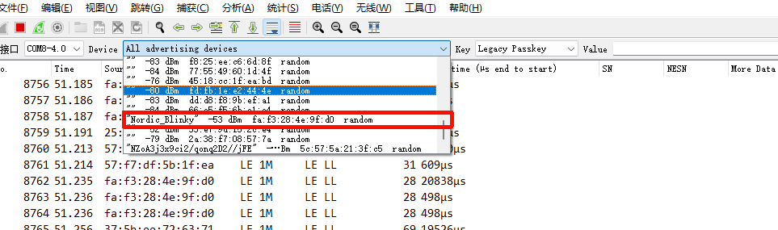

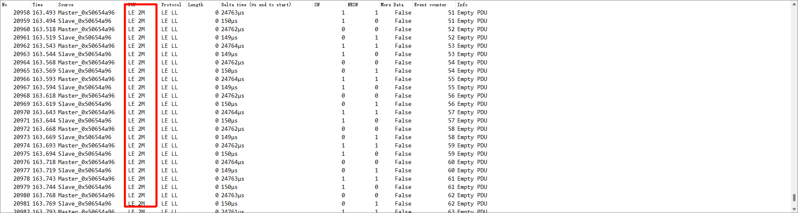

连接上之后，会出现这个界面，变成了2M，也就是蓝牙的物理层速率，广播的时候是1M的速率，连接上之后就变成了2M的速率了。

#### 数据分析

- source是数据包的来源
- PHY 物理层的天线/滤波器等 1Mbps是贷款
- protocol 链路层协议
- LL 组包
- length 包的长度 这里描写的是净载荷
- data_time 数据包的时间戳
- sn 用于连接后数据流控和重传
- more data 1表示还有数据包
- event counter 连接事件计数器 记录当前连接事件的序号
- info 包的详细信息

---

重要数据分析
> ADV_IND：广播包类型，表示这是一个可连接的广播包(37/39/38)。
> PHY:LE 1M：物理层速率，表示使用的是1Mbps的蓝牙物理层速率。
> Channel Index:37：广播信道索引，表示使用的是37号广播信道。

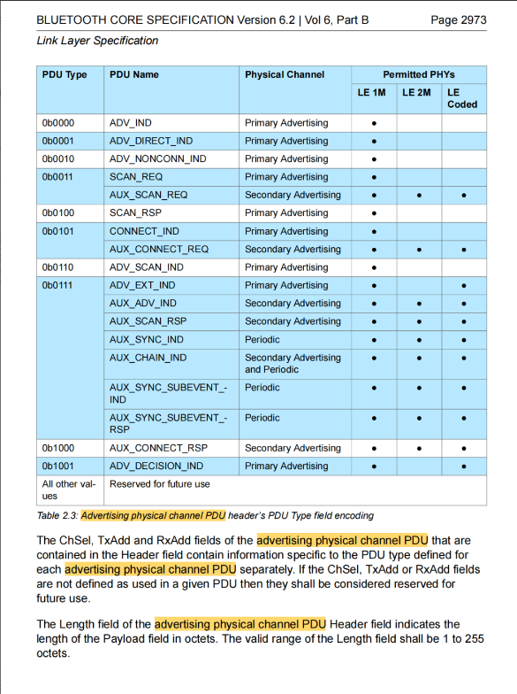

从蓝牙的信道上是2402MHz到2480MHz，分为40个信道，其中37、38、39是广播信道，其他的0-36是数据通道，primary advertising channels是37、38、39，secondary advertising channels是0-36。
因为wifi和蓝牙都是在2.4GHz频段工作的，所以会有干扰，所以蓝牙就设计了3个广播信道，来避免干扰使用37、38、39这三个信道来进行广播，就和wifi避开了

__PDU__:在蓝牙协议中，PDU（Protocol Data Unit）是指协议数据单元，是在蓝牙通信中传输的数据包的基本单位。PDU包含了蓝牙通信中的各种信息，如连接请求、数据传输、控制命令等。

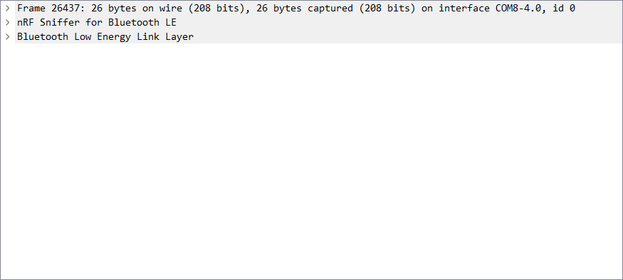
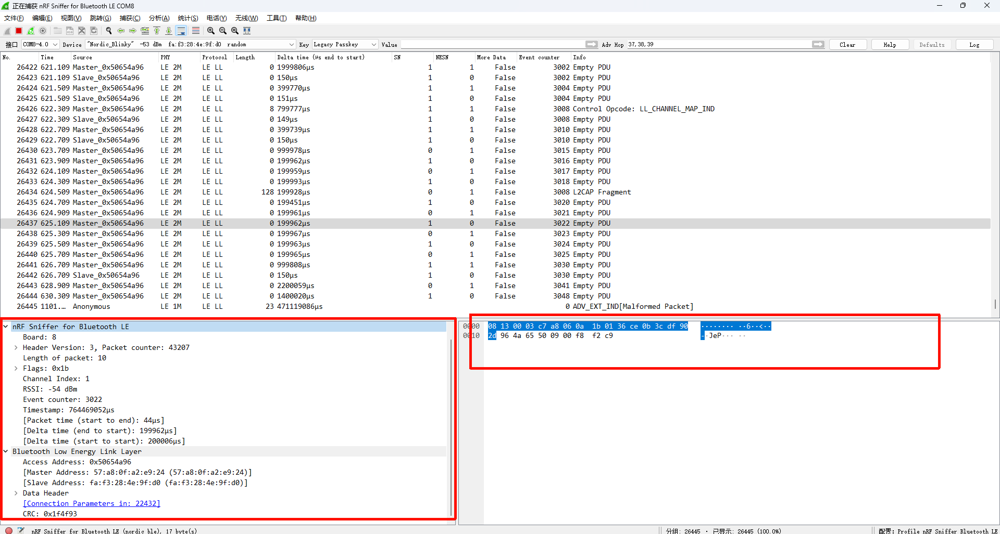

第一个是软件的解析，第二个是蓝牙的PHY用于发送数据的，最后一个蓝牙的LL层用于打包数据，所以只关心LL层就好了，LL层的payload就是我们发送的数据了。

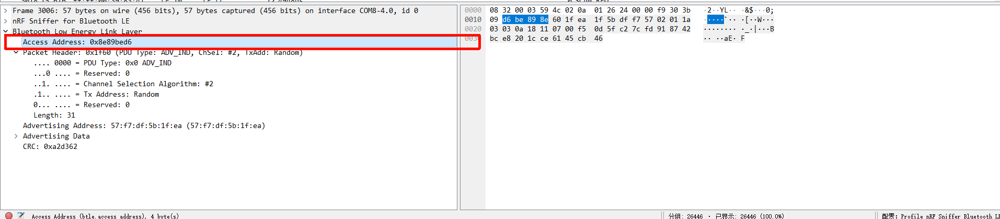
这里就是发送的地址
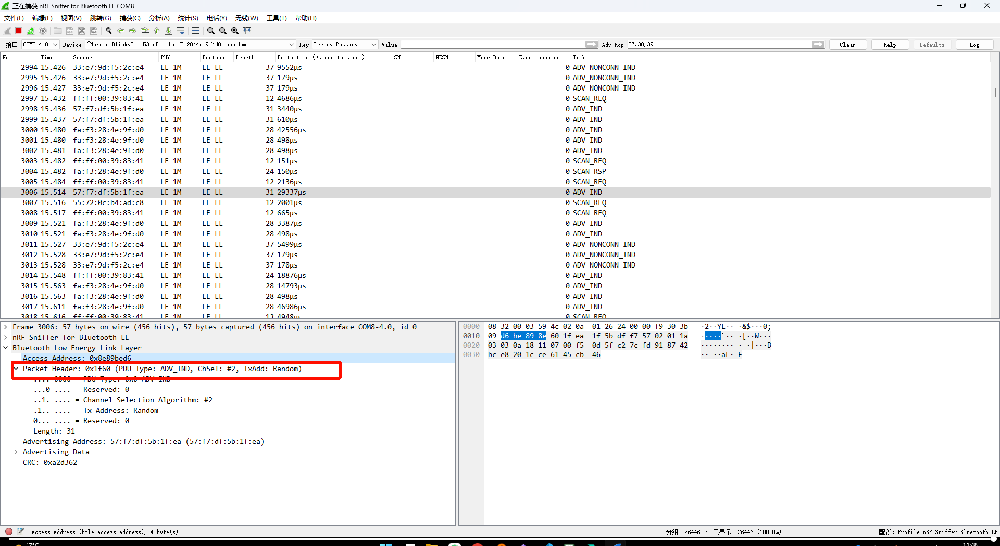
这里是广播的PDU，包含了广播数据和广播地址等信息。

>  蓝牙原本协议的设计逻辑，ADV_IND 是可连接和可扫描的广播包，ADV_NONCONN_IND 是不可连接和不可扫描的广播包，ADV_SCAN_IND 是可扫描但不可连接的广播包，ADV_DIRECT_IND 是定向广播包，分为可连接和不可连接两种类型。

__Delta Time__:在蓝牙通信中，Delta Time（增量时间）是指两个连续数据包之间的时间差。它表示了数据包之间的时间间隔，可以用于分析通信的时序和性能。

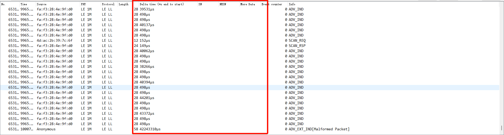
这里比较大的Delta Time可能是因为蓝牙通信中存在一些延迟或者等待时间，比如等待连接建立、等待数据传输完成等，这些都可能导致数据包之间的时间间隔较大。
例如这里的4w多就能因为广播间隔的原因，在不同的信道上跳动

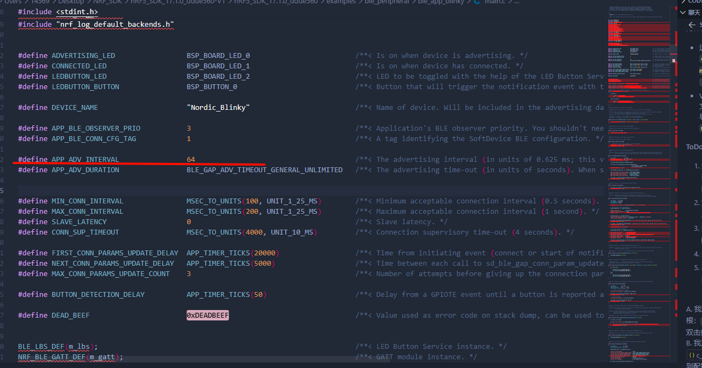
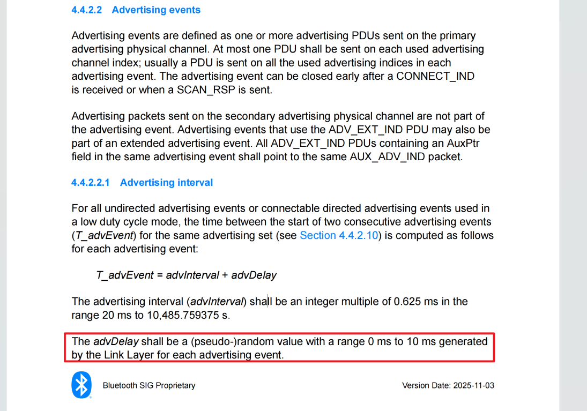
这里就是设置广播的间隔，单位是0.625ms，所以这里设置的0x20就是64*0.625ms=40ms的广播间隔了。
然后在协议里面加入了一个random机制，随机的在1~10里面去一个加上也就是 40ms~50ms的广播间隔，这样就能够避免和其他设备的广播间隔重叠了。

##### Scanning 
在蓝牙当中，都有一个唯一的身份证，但是广播当中并没有，在这里就需要有一个扫描的过程，来获取到这个设备的地址了，这个过程就叫做Scanning了。
这一步的本质就是进行一个身份验证，知道了`cumstom UUID`之后就能够知道这个设备的身份了，就能够进行连接了。
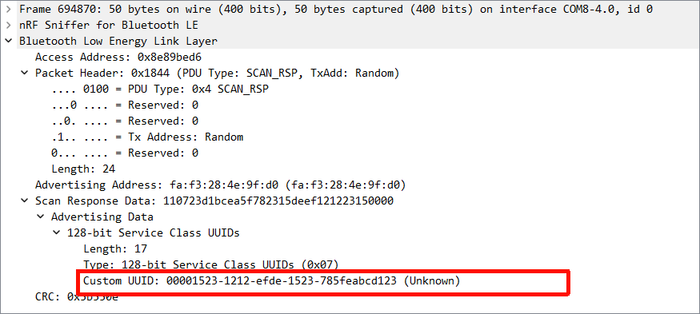
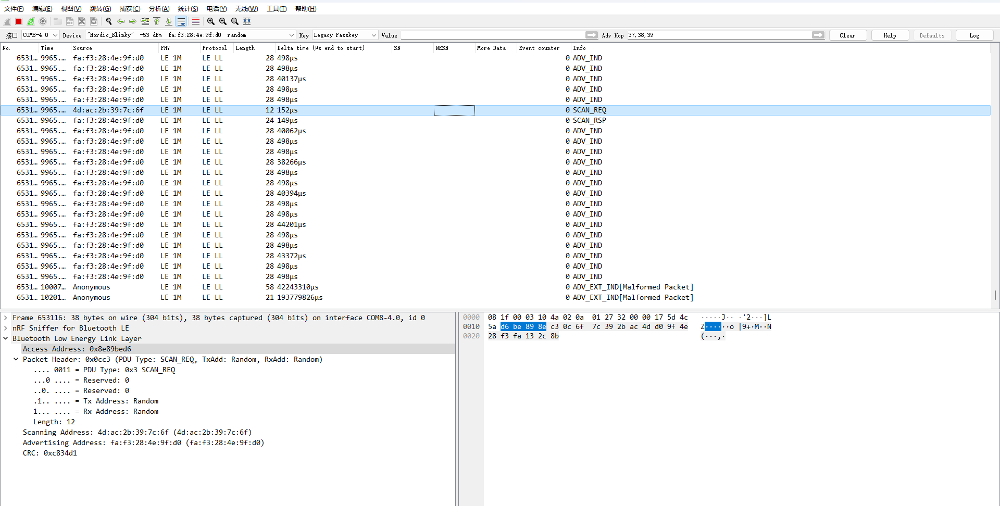
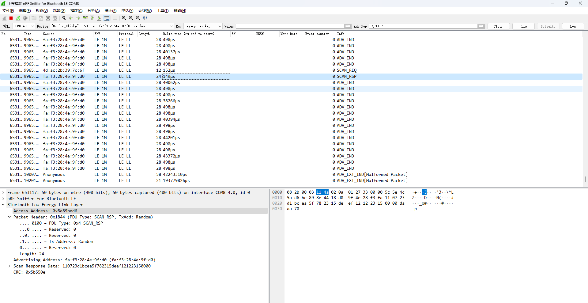

##### connecting

__CONNECT_IND__:连接请求包，表示这是一个连接请求包，包含了连接请求的相关信息，如连接参数、设备地址等。
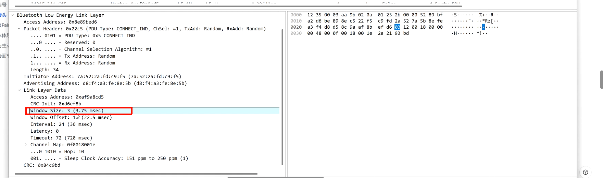

- Windows Size:窗口大小，表示在蓝牙通信中，发送方和接收方之间的流控机制。窗口大小定义了发送方可以连续发送的数据包数量，而不需要等待接收方的确认。较大的窗口大小可以提高数据传输效率，但也可能增加丢包的风险。
- Windows Offset:窗口偏移，表示在蓝牙通信中，发送方和接收方之间的时间同步机制。窗口偏移定义了发送方和接收方之间的时间差，以确保数据包的正确传输和接收。较大的窗口偏移可以增加数据传输的可靠性，但也可能增加通信延迟。
- Interval:连接间隔，表示在蓝牙通信中，连接事件之间的时间间隔。连接间隔定义了发送方和接收方之间的通信频率，较短的连接间隔可以提高数据传输效率，但也可能增加功耗。
- Timeout:连接超时，表示在蓝牙通信中，连接请求的超时时间。连接超时定义了发送方等待连接请求响应的时间，如果在该时间内没有收到响应，发送方将认为连接请求失败并进行相应的处理。
- General Purpose Advertising Packet：通用广告包，表示这是一个通用的广告包，包含了设备的基本信息和广播数据等内容。
- Hop Type:跳频类型，表示在蓝牙通信中，跳频机制的类型。跳频机制是一种用于避免干扰和提高通信可靠性的技术，通过在不同的频率上进行通信来实现。跳频类型定义了跳频机制的具体实现方式，如固定跳频、随机跳频等。

##### Connection Establishment

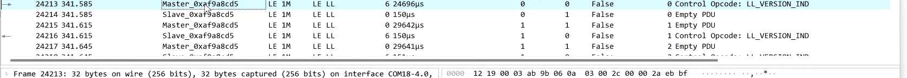

Master： 主设备，负责发起连接请求并管理连接的设备。
Slave： 从设备，响应主设备的连接请求并与主设备进行通信。

- connection Parameters：连接参数，定义了连接的相关参数，如连接间隔、连接超时等。 
- Access Address：访问地址，表示在蓝牙通信中，用于标识连接的唯一地址。每个连接都有一个唯一的访问地址，用于区分不同的连接。
> 例如：0x8E89BED6是蓝牙通信中常用的访问地址，表示一个特定的连接。这就是一个门牌号，如果是广播的话都是用这个门牌号的，连接之后就会分配一个新的门牌号了。这里用作哪一个蓝牙到哪一个蓝牙的通信了。

#### Paring/Encryption/Bonding
在蓝牙通信中，Paring（配对）、Encryption（加密）和 Bonding（绑定）是三个重要的安全机制，用于保护蓝牙设备之间的通信安全

- Paring（配对）：配对是指两个蓝牙设备之间建立信任关系的过程。通过配对，设备可以交换安全信息，如加密密钥和身份验证信息，以确保通信的安全性。配对过程通常涉及用户交互，如输入PIN码或确认配对请求。
- Encryption（加密）：加密是指对蓝牙通信中的数据进行加密处理，以保护数据的机密性和完整性。加密可以防止未经授权的设备窃听和篡改通信内容。蓝牙通信中常用的加密算法包括AES（Advanced Encryption Standard）和CCM（Counter with CBC-MAC）。
- Bonding（绑定）：绑定是指在配对成功后，设备之间建立持久的信任关系的过程。通过绑定，设备可以在未来的连接中自动识别和信任对方，无需再次进行配对。绑定通常涉及存储配对信息和加密密钥，以便在后续连接中使用。

LL-version：LL版本，表示蓝牙通信中使用的链路层协议的版本。不同版本的链路层协议可能具有不同的功能和性能特性，了解LL版本可以帮助我们更好地理解和分析蓝牙通信的行为和性能。

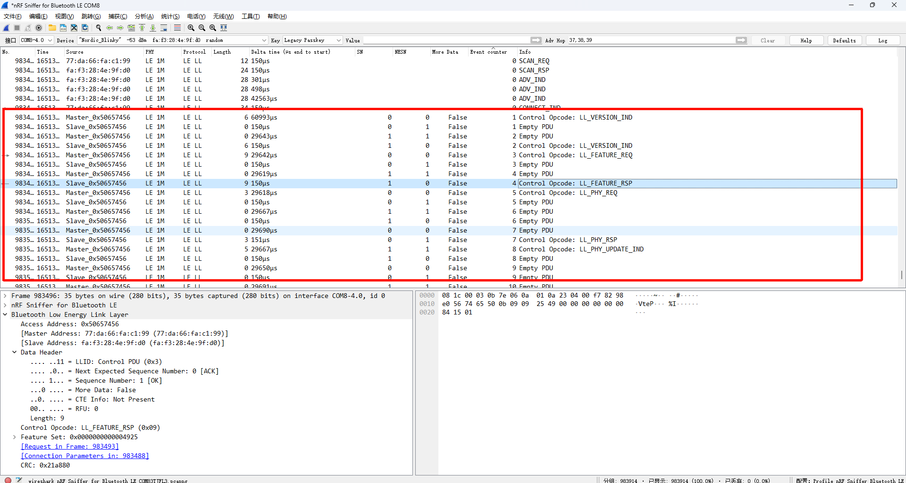
对于Encryption Request包，LL版本为0x08表示使用的是蓝牙5.0的链路层协议版本。蓝牙5.0引入了许多新的功能和改进，包括更高的数据传输速率、更长的通信范围和更低的功耗等。因此，了解LL版本可以帮助我们更好地理解和分析蓝牙通信的行为和性能。

#### 记事本体系 （GATT/characteristic/descriptor）

在蓝牙通信中，GATT（Generic Attribute Profile）是一个重要的协议，用于定义蓝牙设备之间的通信和数据交换方式。GATT协议基于属性（Attribute）的概念，属性是蓝牙设备中的一个数据单元，包含了特定的信息和功能。

__GATT和ATT的关系__:GATT（Generic Attribute Profile）是基于ATT（Attribute Protocol）协议构建的一个更高层次的协议。GATT定义了蓝牙设备之间的通信和数据交换方式，而ATT则定义了属性的访问和操作方式。可以理解为GATT是基于ATT协议的一个应用层协议，提供了更丰富的功能和更高层次的抽象。

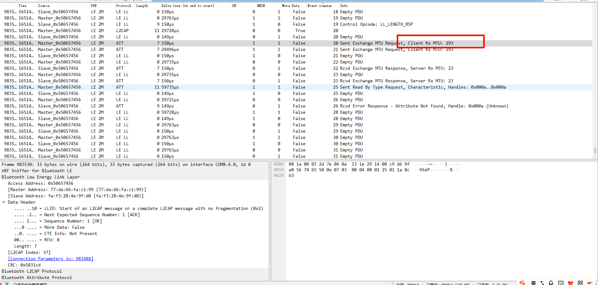
这里的MTU（Maximum Transmission Unit）表示在蓝牙通信中，单个数据包的最大传输单元。MTU定义了在一次数据传输中可以发送的最大数据量，超过MTU的数据需要进行分段传输。较大的MTU可以提高数据传输效率，但也可能增加通信延迟和功耗。
当master和slave建立连接后，双方会协商一个MTU值，表示在一次数据传输中可以发送的最大数据量。这个MTU值会影响数据传输的效率和性能，因此在设计蓝牙通信时需要合理设置和优化MTU值。
最大的MTU值是512字节，但实际应用中通常会设置为较小的值，如23字节，以兼容更多的设备和应用场景。

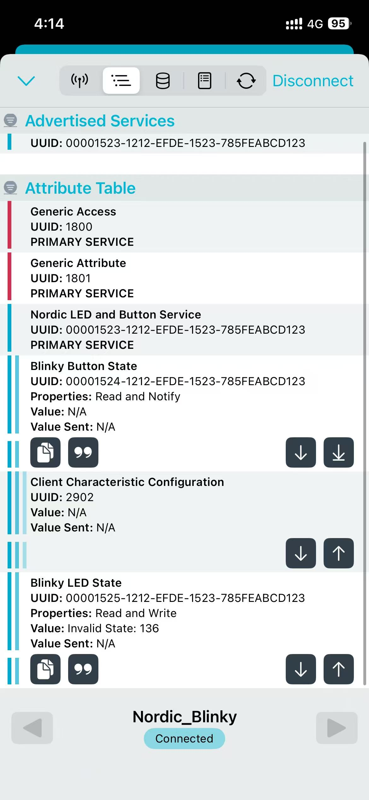

- 目录/分册：GATT协议中的目录（Service）和分册（Characteristic）是用于组织和管理蓝牙设备中的属性的概念。目录表示一个功能模块或服务，包含了多个分册，每个分册表示一个具体的功能或数据项。
- 目录（Service）：目录是GATT协议中的一个重要概念，表示一个功能模块或服务。目录包含了多个分册，每个分册表示一个具体的功能或数据项。目录可以用于组织和管理蓝牙设备中的属性，使得设备的功能更加模块化和可管理。
- 分册（Characteristic）：分册是GATT协议中的一个重要概念，表示一个具体的功能或数据项。分册包含了属性值和属性描述符，可以用于存储和传输特定的数据或功能。分册可以被客户端读取、写入或订阅，以实现与蓝牙设备的交互。
- 描述符（Descriptor）：描述符是GATT协议中的一个重要概念，表示一个属性的附加信息或功能。描述符包含了属性的元数据，如属性的权限、格式、单位等信息，可以用于提供更详细的属性信息和功能。描述符可以被客户端读取或写入，以实现对属性的更细粒度的控制和交互。

__ATT__:在蓝牙通信中，ATT（Attribute Protocol）是一个重要的协议，用于定义蓝牙设备之间的属性访问和操作方式。ATT协议基于属性（Attribute）的概念，属性是蓝牙设备中的一个数据单元，包含了特定的信息和功能。
这里的ATT相当于一个记事本

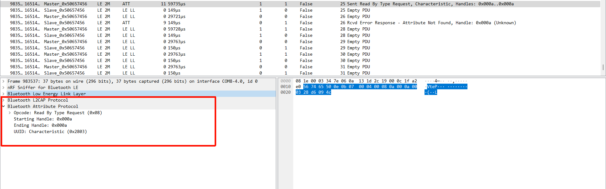
这里的Handler是每一个service或者characteristic的唯一标识符，就像记事本当中的页码一样，可以通过Handler来访问和操作对应的属性。

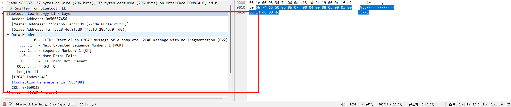

#### 订阅 Notification/Indication

在蓝牙通信中，Notification（通知）和 Indication（指示）是两种常用的属性更新机制，用于实现蓝牙设备之间的数据传输和交互

- Notification（通知）：通知是一种属性更新机制，允许服务器（Server）主动向客户端（Client）发送属性值的更新。当属性值发生变化时，服务器会向客户端发送一个通知消息，告知客户端属性值已经更新。客户端可以选择订阅特定的属性，以便在属性值发生变化时接收通知。
- Indication（指示）：指示是一种属性更新机制，类似于通知，但具有更高的可靠性。与通知不同，指示需要客户端发送一个确认消息（ACK）来确认已经收到指示消息。只有在客户端确认收到指示消息后，服务器才会认为指示消息已经成功传输。指示适用于需要更高可靠性的场景，如重要数据的传输或需要确保数据完整性的应用。
- 订阅（Subscription）：订阅是指客户端（Client）向服务器（Server）表达对特定属性的兴趣，以便在属性值发生变化时接收通知或指示消息。通过订阅，客户端可以主动获取属性值的更新，而不需要频繁地轮询服务器来检查属性值的变化。

#### 静默通信心跳

在约定好的Interval（连接间隔）内，如果没有数据传输，蓝牙设备会发送一个空的Notification或者Indication消息，作为心跳包来维持连接的活跃状态。这种机制可以帮助设备检测连接是否仍然有效，并在必要时进行重连或断开连接。