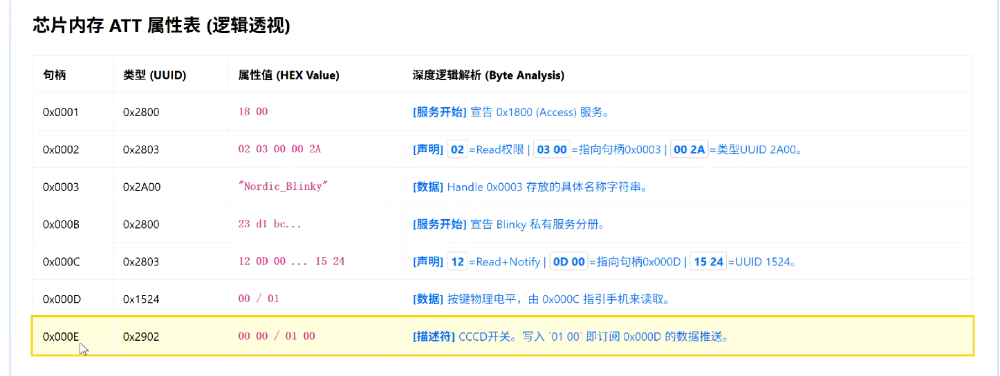
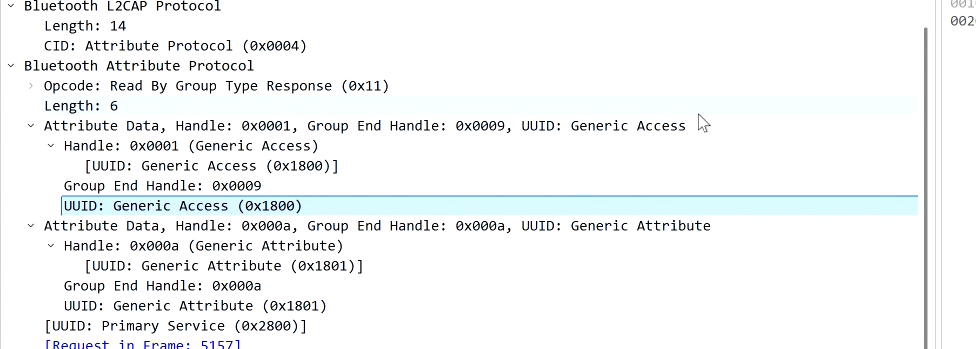

## 学习目标

1. 理解BLE开发过程中的数据流向，和建立数据的大致概念
2. 理解什么是空口报文，PDU和ATT以及GATT

---

### GATT 和ATT以及PDU

描述了BLE设备的服务和特征的结构和组织方式。GATT定义了服务、特征和描述符等概念，以及它们之间的关系和交互方式。通过GATT，BLE设备可以提供各种功能和数据，例如传感器数据、设备信息、控制命令等。
GATT会把server的数据组织成一个树形结构，树的根节点是一个服务（service），服务下面可以有多个特征（characteristic），每个特征下面可以有多个描述符（descriptor）。每个特征和描述符都有一个唯一的UUID（Universally Unique Identifier）来标识它们的类型和功能。
变成了一个表之后，会放入到ATT里面，可以把ATT理解位一个数组

PDU（Protocol Data Unit）是BLE通信中的一个重要概念，表示在BLE通信中传输的数据单元。PDU包含了BLE通信中的各种数据和控制信息，如连接请求、数据传输、属性访问等。PDU的结构和内容根据不同的通信场景和协议层次而有所不同，但通常包含了头部信息、有效载荷和校验信息等部分。

当GATT协议中的属性访问请求或响应需要传输数据时，这些数据会被封装成PDU进行传输。PDU的结构和内容根据不同的通信场景和协议层次而有所不同，但通常包含了头部信息、有效载荷和校验信息等部分。

空中报文（Over-the-Air Packet）是指在BLE通信中通过无线信道传输的数据包。空中报文包含了BLE通信中的各种数据和控制信息，如连接请求、数据传输、属性访问等。空中报文的结构和内容根据不同的通信场景和协议层次而有所不同，但通常包含了头部信息、有效载荷和校验信息等部分。

当PDU封装完成之后，这些PDU会被进一步封装成空中报文进行传输。空中报文的结构和内容根据不同的通信场景和协议层次而有所不同，但通常包含了头部信息、有效载荷和校验信息等部分。

> 空中报文就是在PHY层面上发送的数据包，PDU是LL层面上发送的数据包，GATT是应用层面上发送的数据包了。GATT里面的属性访问请求或者响应会被封装成PDU进行传输，PDU会被进一步封装成空中报文进行传输了。

开发蓝牙的时候，就只需要关注GATT/ATT 这是应用层的协议，大多数SDK都封装好了

广播通道PDU和连接通道PDU的区别：
- 广播通道PDU：广播通道PDU是用于BLE设备进行广播的PDU，包含了设备的基本信息和广播数据等内容。广播通道PDU通常包含了设备的名称、服务UUID、制造商数据等信息，用于向周围的设备广播自己的存在和功能。
- 连接通道PDU：连接通道PDU是用于BLE设备进行连接的PDU，包含了连接请求、连接响应、数据传输等内容。连接通道PDU通常包含了连接参数、访问地址、数据包类型等信息，用于建立和维护BLE设备之间的连接关系。

### NRF渲染

1. 当连接上的时候，手机主动的向蓝牙设备发起一个读取的请求，读取蓝牙设备的所有的服务和特征，手机就会把这些服务和特征渲染出来，用户就可以看到这些服务和特征了。

> 这里的1800和1801是蓝牙SIG定义的UUID，分别代表了Generic Access和Generic Attribute两个服务，这两个服务是BLE设备必须要实现的服务，包含了设备的基本信息和属性信息等内容。
> 所有的服务和特征都必须要和SIG定义的UUID进行匹配，才能被手机识别和渲染出来。
> 0x1801 是蓝牙SIG定义的UUID，代表了Generic Attribute服务，这个服务包含了设备的属性信息等内容。手机会根据这个UUID来识别和渲染这个服务以及它下面的特征和描述符等内容。

notify和read

- notify：当蓝牙设备的某个特征的值发生变化时，蓝牙设备会主动向手机发送一个通知，通知手机这个特征的值发生了变化，手机就可以根据这个通知来更新界面或者进行其他操作。
- read：当手机需要获取蓝牙设备的某个特征的值时，手机会向蓝牙设备发送一个读取请求，蓝牙设备收到这个请求后会返回这个特征的值给手机，手机就可以根据这个值来更新界面或者进行其他操作。
- write：当手机需要向蓝牙设备写入某个特征的值时，手机会向蓝牙设备发送一个写入请求，蓝牙设备收到这个请求后会更新这个特征的值，并且可以选择是否返回一个写入响应给手机，手机就可以根据这个响应来更新界面或者进行其他操作。

描述符CCCD（Client Characteristic Configuration Descriptor）是BLE设备中的一个特殊的描述符，用于配置特征的通知和指示功能。CCCD包含了一个16位的值，用于表示特征的通知和指示状态。当CCCD的值为0x0001时，表示启用通知功能；当CCCD的值为0x0002时，表示启用指示功能；当CCCD的值为0x0000时，表示禁用通知和指示功能。