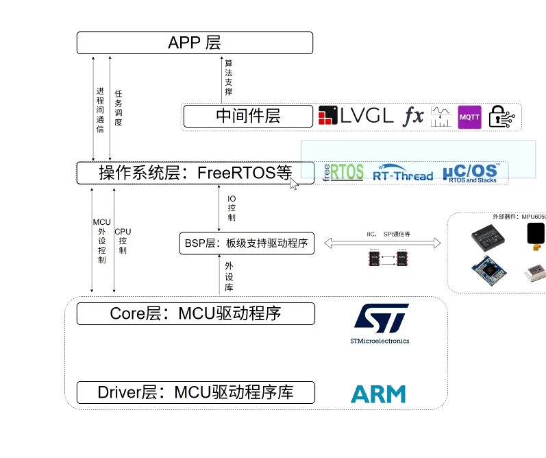
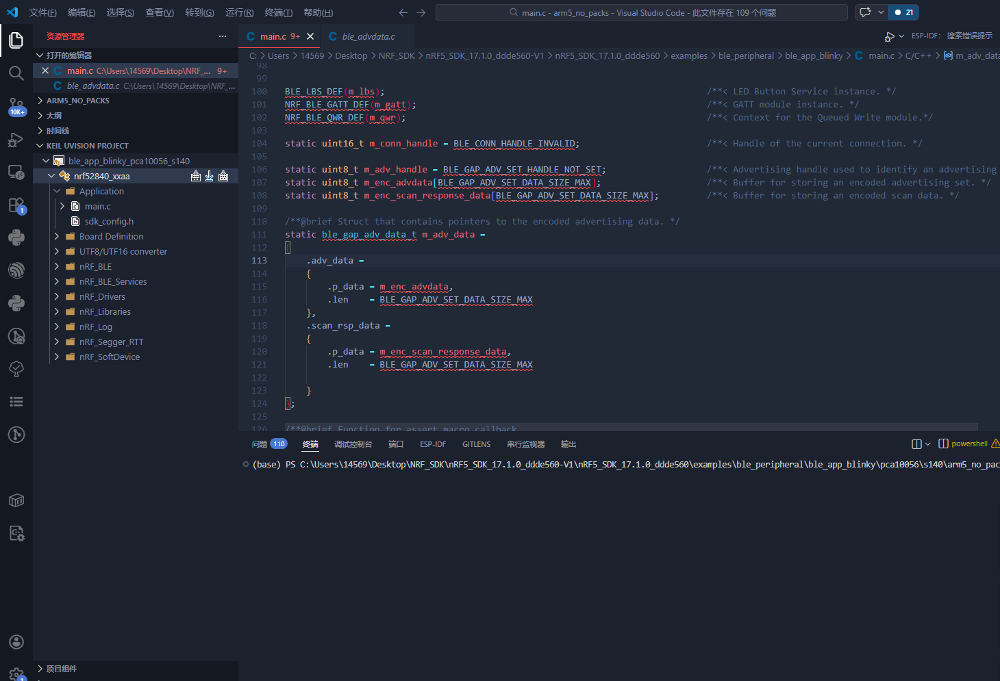
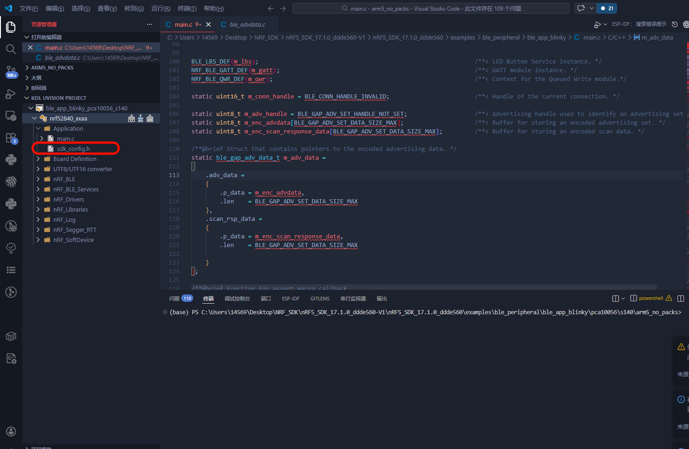

### 单片机架构基础复习



所有的代码构架没有OS一定是这样的，从上到下



对于蓝牙协议栈来说，BLE的本质上来说是一个外设，和AHT11等在同一位置
BLE驱动程序在BSP层

sdk_config 相当于就是BSP层和Direver层

例如AES加解密或者utf8-urf16等工具就存在于中间件层


### main函数的流程

拿到一个大型的项目就一定拿到框架去寻找

在原生的nordic sdk当中大多数都是用驱动解耦来实现的，main函数的流程大致上来说是这样的：
``` cpp

/**@brief Function for application main entry.
 */
int main(void)
{
    // Initialize.
    log_init();
    leds_init();
    timers_init();
    buttons_init();
    power_management_init();

    /* Initialize BLE stack  蓝牙协议栈初始化 */
    ble_stack_init();
    /* Initialize GAP parameters  GAP参数初始化 决定设备的广播名称、连接间隔等 */
    gap_params_init();
    /* Initialize GATT  GATT协议初始化 定义了服务和特征等 */
    gatt_init();// 这里就是总目录，相当于一个树的根节点，下面会有很多的服务和特征等内容，这些内容都是在services_init函数里面定义的
    /* Initialize services  服务初始化 定义了具体的服务和特征等 */ 
    services_init();
    /* Initialize advertising  广播初始化 定义了广播数据和广播参数等 */
    advertising_init();
    /* Initialize connection parameters 连接参数初始化 定义了连接间隔、连接超时等 */
    conn_params_init();

    // Start execution.
    NRF_LOG_INFO("Blinky example started.");
    /* Start advertising  开始广播 */
    advertising_start();

    // Enter main loop.
    for (;;)
    {
        idle_state_handle();
    }
}


/**
 * @}
 */
```

### 了解文件当中面向对象的设计

1.类的实现，结构体和头文件(.h)的设计
2. 对象的实例化
3. 对象的方法

当然在这里是C语言的实例的时候进行初始化

``` cpp

static ble_gap_adv_data_t m_adv_data; // 广播数据结构体

m_adv_data = 
{
    .adv_data =
    {
        .name_type = BLE_ADVDATA_FULL_NAME, // 广播数据包含完整的设备名称
        .include_appearance = false, // 不包含外观信息
        .flags = BLE_GAP_ADV_FLAGS_LE_ONLY_GENERAL_DISC_MODE, // 广播标志，表示设备是一个LE-only的通用可发现模式设备
    },
    .scan_rsp_data =
    {
        .include_appearance = false, // 扫描响应数据不包含外观信息
        .flags = BLE_GAP_ADV_FLAGS_LE_ONLY_GENERAL_DISC_MODE, // 扫描响应数据的标志，表示设备是一个LE-only的通用可发现模式设备
    }
}

```
