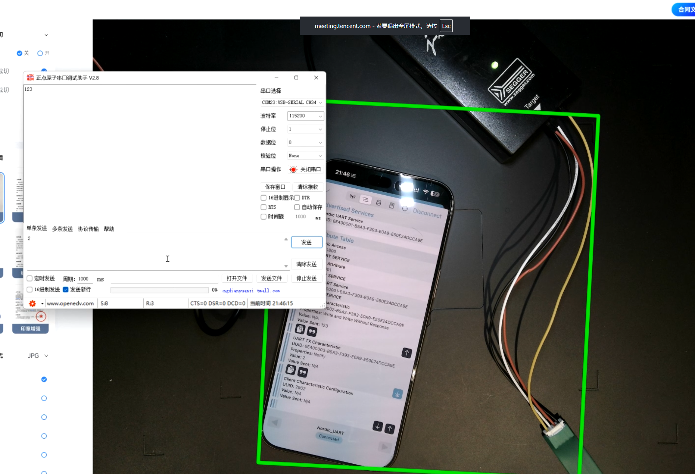

学习目标
1. 运行demo，实时的演示抓包信号
2. 分析这信号

## BLE的串口透传特性

什么是NUS？
> 这个是nordic uart service的缩写，中文叫做nordic串口服务，是nordic公司提供的一种蓝牙串口服务，主要用于蓝牙设备之间的数据传输。

``` cpp

static void nus_data_handler(ble_nus_evt_t * p_evt)
{
    if (p_evt->type == BLE_NUS_EVT_RX_DATA)
    {
        printf("Received data from BLE NUS. Data len: %d\r\n", p_evt->params.rx_data.length);
        printf("Data: %s\r\n", p_evt->params.rx_data.p_data);
    }
}
```

上面这段代码是nordic串口服务的事件处理函数，当接收到数据时，会打印出接收到的数据长度和数据内容。



nordic 的代码都是面向对象，当然这里的串口也是
在`ble_nus_evt_t`这个结构体中，包含了串口事件的类型和数据内容。

``` cpp

static void uart_init(void)
{
    uint32_t err_code;
    app_uart_comm_params_t const comm_params =
      {
          RX_PIN_NUMBER,
          TX_PIN_NUMBER,
          RTS_PIN_NUMBER,
          CTS_PIN_NUMBER,
          APP_UART_FLOW_CONTROL_DISABLED,
          false,
          UART_BAUDRATE_BAUDRATE_Baud115200
      };

    APP_UART_FIFO_INIT(&comm_params,
                         UART_RX_BUF_SIZE,
                         UART_TX_BUF_SIZE,
                         uart_error_handle,
                         APP_IRQ_PRIORITY_LOWEST,
                         err_code);
    APP_ERROR_CHECK(err_code);
}
```

最后在发送的时候已在发送服务里面`ble_nus_data_send`函数中调用了串口发送函数`app_uart_put`，将数据发送到串口。