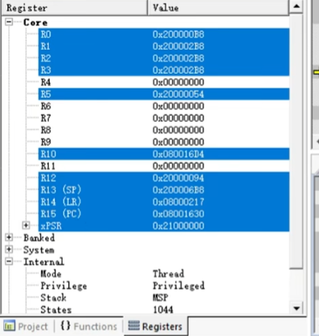

# 04_理解函数调用栈：通过栈回溯定位问题

## 1. 为什么要理解函数调用栈

程序发生 HardFault、BusFault 或者数据访问异常时，调试器往往会停在
一个看起来并不熟悉的地址。此时只看当前函数，通常只能知道“在哪里
停下”，还不能回答下面几个问题：

- 哪个函数发起了这次调用？
- 函数返回后本来应该执行哪里？
- 传入的参数和局部变量是否已经被破坏？
- 这是当前函数本身的错误，还是更早的调用者传入了非法数据？

函数调用栈记录了函数之间的进入和返回关系。栈回溯就是从当前栈帧和
返回地址出发，逐级找到调用者，恢复出故障发生前的大致执行路径。它
是定位空指针、数组越界、栈溢出和非法函数指针等问题的基础方法。

需要注意：栈回溯可以给出源码层面的执行证据，但不能单独证明某个
硬件故障已经在实车或台架上复现。最终结论仍需要结合寄存器、构建产物、
日志以及硬件验证。

## 2. 栈、栈顶和栈帧

### 2.1 栈的作用

栈是一段按照后进先出规则使用的内存区域。Cortex-M 通常采用向低地址
增长的满递减栈：执行 `push` 或者给局部变量预留空间时，SP 的数值会
减小；执行 `pop` 或者释放局部变量时，SP 的数值会增大。

函数调用期间，栈主要保存以下内容：

| 内容 | 作用 |
| --- | --- |
| 返回地址 | 函数执行结束后，回到调用者继续执行 |
| 被调用者保存寄存器 | 保存调用者后续仍然需要的寄存器值 |
| 函数参数和临时值 | 当寄存器不够用时，溢出到栈上的参数或中间结果 |
| 局部变量 | 函数自己的自动存储期变量 |
| 对齐填充 | 满足 ABI 对栈地址对齐的要求 |

一次函数执行所使用的这部分栈空间称为一个栈帧。栈帧的精确布局由
ABI、编译器、编译选项和函数实现共同决定，不能只凭 C 源码猜测每个
变量的固定偏移。

可以用下面的概念图理解栈帧。地址方向仅表示典型的 Cortex-M 栈增长
方式，实际布局应以当前构建生成的汇编、AXF/ELF 和调试信息为准。

```text
高地址
┌────────────────────────────┐
│ 调用者的栈帧                 │
├────────────────────────────┤
│ 保存的 LR、R4~R11 等寄存器  │
├────────────────────────────┤
│ 当前函数的局部变量           │
├────────────────────────────┤
│ 对齐空间和临时溢出参数       │
└────────────────────────────┘ ← 当前 SP
低地址
```

### 2.2 普通函数调用的过程

以 `caller()` 调用 `callee()` 为例，典型过程如下：

1. `caller()` 将前四个整型或指针参数放入 R0~R3，更多参数可能放到栈上。
2. 执行 `BL callee`，处理器把返回地址写入 LR，并跳转到 `callee`。
3. 如果 `callee` 还要调用其他函数，新的 `BL` 会覆盖 LR，因此编译器
     通常先把 LR 保存到当前栈帧。
4. `callee` 分配局部变量空间，执行函数体，并在返回前恢复保存的寄存器。
5. 函数通过 `BX LR`，或者通过从栈中恢复 PC 的方式返回到 `caller()`。

`BL` 保存的是返回位置的地址，LR 在 Thumb 状态下通常带有最低位标志位。
因此调试器中看到的返回地址可能是奇数，而代码段中的指令地址通常按
偶数对齐。解析地址时应保留 Thumb 语义，并使用与固件匹配的符号文件
进行定位，不能只对地址做机械的加减。

典型的函数序言和尾声可能类似下面的汇编。不同编译器或优化级别下，
寄存器集合和指令顺序会改变，示例只用于说明概念：

```asm
callee:
    push    {r4, lr}       ; 保存后续仍需使用的寄存器和返回地址
    sub     sp, #16        ; 为局部变量预留栈空间
    ...                    ; 执行函数体
    add     sp, #16        ; 释放局部变量空间
    pop     {r4, pc}       ; 恢复寄存器并跳回调用者
```

如果函数是叶子函数，且不再调用其他函数，编译器可能不保存 LR；如果
函数被内联，源码中的函数边界也可能不会出现在运行时调用栈中。开启
高等级优化后，尾调用、公共子表达式消除和寄存器复用都会让回溯结果
与源码结构不完全一致。

## 3. Core 寄存器表



截图中的寄存器窗口显示了 Core 寄存器和处理器内部状态。常用寄存器
含义如下：

| 寄存器 | 名称 | 调试时的主要用途 |
| --- | --- | --- |
| R0~R3 | 参数/返回值寄存器 | 查看前几个函数参数和简单返回值 |
| R4~R11 | 被调用者保存寄存器 | 观察跨函数调用仍应保持的上下文 |
| R12 | 临时寄存器 | 编译器生成的中间值，不能默认当作参数 |
| R13 / SP | 栈指针 | 指向当前使用栈的栈顶位置 |
| R14 / LR | 链接寄存器 | 保存函数返回地址，异常处理时还可能保存 EXC_RETURN |
| R15 / PC | 程序计数器 | 指示当前或即将执行的代码位置 |
| xPSR | 程序状态寄存器 | 查看条件标志、Thumb 状态和异常号 |

截图下方的状态信息还可以这样理解：

- `Thread`：当前处于普通线程或任务上下文，而不是异常处理上下文。
- `Privileged`：当前代码处于特权级。非特权模式下访问受限资源可能触发
  MemManage 或 HardFault。
- `MSP`：当前线程使用主堆栈。使用 RTOS 时，线程通常可能改用 PSP，
  不能仅凭“有 SP”就判断这是系统栈还是任务栈。

### 3.1 MSP 和 PSP

Cortex-M 通常有两个物理栈指针：

- **MSP（Main Stack Pointer）**：复位后默认使用；异常处理通常切换到
  MSP。启动代码、中断服务和系统异常经常使用它。
- **PSP（Process Stack Pointer）**：可用于线程或 RTOS 任务，使每个任务
  拥有自己的栈空间。异常处理仍使用 MSP，异常返回后再切回原线程栈。

当前使用哪一个栈由处理器状态和 `CONTROL.SPSEL` 决定。在 Handler 模式
下处理器固定使用 MSP。调试时应同时记录 MSP、PSP 和异常入口时 LR，
避免从错误的栈指针读取现场。

### 3.2 xPSR 和异常号

xPSR 由多个状态字段组成，其中 IPSR 部分记录当前异常号，T 位表示
Thumb 状态。发生异常时，xPSR 会被自动保存到异常栈帧中。若调试器停在
HardFault_Handler 内，不能只看 Handler 当前的 PC；应优先读取被压入栈
帧中的故障前 PC 和 xPSR。

## 4. 函数调用约定与栈帧变化

Cortex-M 工程通常遵循 ARM 的过程调用标准（AAPCS）或编译器兼容的约定。
理解下面几条规则，才能把寄存器和栈中的数值对应回 C 代码：

1. R0~R3 用于传递前四个参数，也用于返回简单整数、指针或地址。
2. R4~R11 属于被调用者保存寄存器。被调用函数修改前必须保存，返回前
   必须恢复。
3. R12 是调用过程中可被破坏的临时寄存器，不能把它当作稳定的现场变量。
4. 参数超过寄存器容量时，会按照 ABI 规则放在调用者或被调用者可访问的
   栈区域中。
5. 栈通常需要保持 8 字节对齐，编译器可能插入填充字（padding）。

因此，看到某个函数的 SP 后，不能简单地认为“SP 加 4 就是下一个局部
变量”。应先确认函数序言保存了哪些寄存器、分配了多少局部空间，并考虑
优化和对齐填充。

## 5. 异常进入时的自动栈帧

普通函数调用由编译器生成保存和恢复代码；Cortex-M 进入异常时，还会由
硬件自动保存一组最小现场。基本异常栈帧通常按以下顺序排列：

| 相对异常栈 SP 的偏移 | 保存内容 |
| ---: | --- |
| `+0x00` | R0 |
| `+0x04` | R1 |
| `+0x08` | R2 |
| `+0x0C` | R3 |
| `+0x10` | R12 |
| `+0x14` | 异常发生前的 LR |
| `+0x18` | 异常发生前的 PC |
| `+0x1C` | 异常发生前的 xPSR |

这里的“异常栈 SP”是硬件压栈完成后的地址，不一定等于进入
`HardFault_Handler` 后调试器直接显示的当前 SP。若使用 FPU，或者发生
栈对齐调整，现场可能还有扩展内容，读取前必须确认处理器配置和异常
返回信息。

异常处理函数里的 LR 往往不是普通函数返回地址，而是 `EXC_RETURN`。
它描述异常返回时应恢复哪个栈和哪个处理器模式。常见判断方法是查看
其 bit2：通常为 0 表示从 MSP 恢复，为 1 表示从 PSP 恢复。具体位定义
仍应以当前 Cortex-M 内核手册为准。

## 6. 栈回溯定位的完整步骤

### 6.1 先固定现场

程序停住后，先不要单步运行，也不要立即复位。记录以下信息：

- 当前 PC、LR、SP、MSP、PSP 和 xPSR；
- 异常处理函数中的 LR，即可能的 EXC_RETURN；
- `SCB->CFSR`、`SCB->HFSR`，以及有效时的 `SCB->BFAR`、`SCB->MMFAR`；
- 当前任务名、任务栈起止地址和剩余栈空间（如果使用 RTOS）；
- 当前固件对应的 AXF/ELF、Map 文件和构建配置。

这些信息要先保存下来，因为继续执行、异常嵌套或复位可能会覆盖原始
栈内容。

### 6.2 选择正确的异常栈指针

如果停在异常 Handler 中，应根据 EXC_RETURN 判断故障发生前使用的是
MSP 还是 PSP。然后从对应地址读取异常栈帧：

```text
exception_sp + 0x00 -> 故障前 R0
exception_sp + 0x04 -> 故障前 R1
exception_sp + 0x08 -> 故障前 R2
exception_sp + 0x0C -> 故障前 R3
exception_sp + 0x10 -> 故障前 R12
exception_sp + 0x14 -> 故障前 LR
exception_sp + 0x18 -> 故障前 PC
exception_sp + 0x1C -> 故障前 xPSR
```

故障前 PC 比 Handler 当前 PC 更有价值，因为它通常指向触发异常的访问
指令或其附近位置。使用反汇编确认该指令是在读、写、取指，还是执行
间接跳转，再把 PC 映射到源码行。

### 6.3 用匹配的符号文件解析地址

应使用与目标板上固件完全同一次构建产生的 AXF/ELF 和 Map 文件。解析
顺序建议如下：

1. 确认 PC 位于有效代码区，并使用调试器的“地址到源码”功能定位函数
   和行号。
2. 反汇编 PC 附近的指令，判断异常是数据访问、非法取指还是函数指针
   跳转。
3. 将保存的 LR 解析为调用者返回位置，必要时结合 LR 前后的指令确认
   是 `BL`、`BLX` 还是异常返回。
4. 根据当前函数的栈帧大小和保存寄存器，向更高地址搜索上一层栈帧。
5. 对每一层调用者重复检查，直到到达任务入口、中断入口或无法验证的
   栈内容。

调试器显示的调用栈通常依赖帧指针、编译器生成的 unwind 信息和调试符号。
若调用栈中出现 `??`、地址跳出代码区或层级明显异常，应回到原始栈内存
和反汇编手工核对，不能直接把显示结果当作完整事实。

## 7. 一个栈回溯示例

假设代码的逻辑调用关系如下：

```text
AppTask
  └─ Sensor_Process
      └─ I2C_Read
          └─ Driver_Write
              └─ HardFault
```

调试器停在 `HardFault_Handler` 后得到一组示例数据：

```text
HardFault_Handler 当前 LR = 0xFFFFFFFD
PSP = 0x200006B8
异常栈帧中的 PC = 0x0800162E
异常栈帧中的 LR = 0x080004A5
异常栈帧中的 xPSR = 0x21000000
```

可以按以下顺序分析：

1. `0xFFFFFFFD` 的 bit2 表明异常返回时使用 PSP，因此先从 `0x200006B8`
   读取异常栈帧，而不是从当前 MSP 读取。
2. 异常栈帧中的 PC 为 `0x0800162E`。通过 AXF/ELF 映射，确认它位于
   `Driver_Write()` 的某条存储指令上。
3. 反汇编发现该指令通过指针写外设地址。检查异常状态寄存器和 BFAR，
   判断是地址错误、权限错误还是总线响应错误。
4. 异常栈帧中的 LR 为 `0x080004A5`，它是 `Driver_Write()` 返回到
   `I2C_Read()` 的位置。再根据 `I2C_Read()` 的栈帧和保存的 LR，继续向
   `Sensor_Process()` 和 `AppTask` 回溯。
5. 最后检查传入的设备地址、缓冲区生命周期、任务栈剩余空间以及是否有
   并发代码改写了同一控制块。

这个例子中，`Driver_Write()` 是“异常发生的位置”，但根因未必就在该
函数内部。若传入指针来自已经失效的局部变量，真正的问题可能发生在
更早的任务或回调代码中。

## 8. 常见误判

### 8.1 把当前 PC 当成故障前 PC

停在 `HardFault_Handler` 时，当前 PC 通常属于异常处理函数。应读取异常
栈帧中保存的 PC，再结合故障寄存器和反汇编判断真正触发异常的指令。

### 8.2 只看 LR，不看栈和反汇编

LR 可能已经被下一次函数调用覆盖，也可能因为栈溢出、内存越界或非法
函数指针而损坏。可靠回溯至少要同时核对 LR、栈内容、代码地址范围和
对应的调用指令。

### 8.3 使用错误的 AXF/ELF

源码行号和地址映射依赖精确的构建产物。重新编译过代码后，旧的符号文件
可能把同一个地址映射到完全不同的函数，导致错误结论。

### 8.4 忽略编译优化

优化可能造成函数内联、尾调用、变量寄存器化和部分栈帧消除。调试版本
可以降低优化级别并保留调试信息来提高可读性，但这只能帮助分析，不能
证明发布版本一定采用相同的执行路径。

### 8.5 忽略 RTOS 和中断切换

任务切换会改变 PSP，嵌套中断会继续使用 MSP。调用链跨越任务切换时不
一定能像普通函数那样连续回溯，此时应同时查看任务控制块、任务栈范围、
当前异常嵌套层级和 RTOS 的上下文切换代码。

## 9. 栈回溯检查清单

- [ ] 是否在复位或继续运行前保存了原始寄存器和栈内存？
- [ ] 是否同时记录了 PC、LR、SP、MSP、PSP 和 xPSR？
- [ ] 是否根据 EXC_RETURN 选择了正确的异常栈指针？
- [ ] 异常栈帧中的 PC 是否位于有效代码区？
- [ ] 是否用同一次构建的 AXF/ELF 和 Map 文件解析地址？
- [ ] 是否通过反汇编确认 PC 对应的实际指令？
- [ ] 是否检查了 CFSR、HFSR、BFAR 和 MMFAR 的有效标志？
- [ ] 是否检查栈边界、8 字节对齐、栈溢出和栈内容覆盖？
- [ ] 是否区分了异常发生位置和最初传入非法数据的调用者？
- [ ] 是否将源码、调试器、日志和台架/实车证据分别记录？

## 10. 小结

理解函数调用栈的核心，不是死记某一个寄存器地址，而是建立下面这条
关系：

```text
函数参数 -> R0~R3 或栈
函数调用 -> BL 写入 LR
继续调用 -> 保存 LR 和被调用者寄存器
函数返回 -> 恢复寄存器并恢复 PC
异常进入 -> 硬件保存最小异常栈帧
故障定位 -> 选择正确栈指针 -> 解析保存 PC/LR -> 反汇编和符号映射
```

当 PC、LR、SP、异常栈帧和构建符号能够相互印证时，栈回溯才具备较高的
可信度；如果其中任何一项不一致，应把结论标记为待验证，而不是直接
归因于当前停住的那一行代码。
