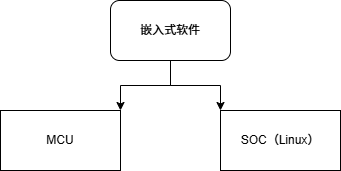
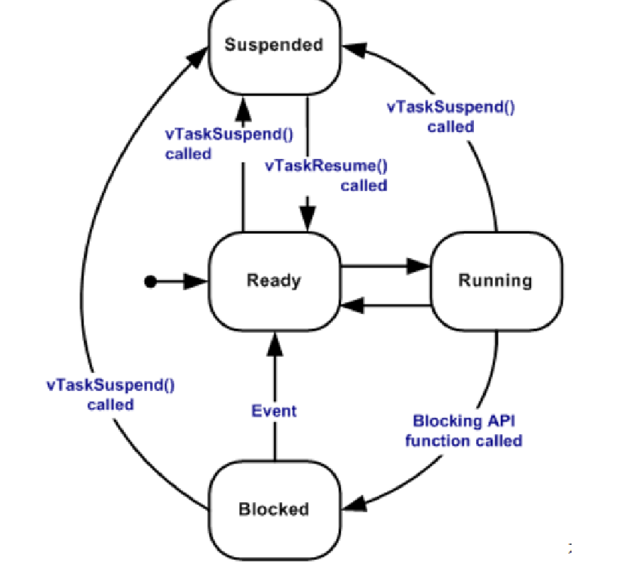

# 嵌入式学习路径

说到嵌入式开发，必然跳不过stm32系列的单片机了(现在已经是2026年了，stm32系列的单片机依然是主流)，所以在学习嵌入式开发之前，首先要对stm32系列的单片机有一个大概的了解。

当然嵌入式主要分为两个部分：软件和硬件，软件方面主要是指单片机的编程，硬件方面主要是指单片机的电路设计和调试。

最好是先从软件方面入手，毕竟软件方面相对来说比较简单一些，硬件方面需要一定的电路基础和调试经验。

对于软件来说，嵌入式分为了单片机和linux两大类，但是随着时代的进步和实时操作系统的普及，除了在一些特定环境下的嵌入式开发当中，例如对功耗要求严格，还有对数据敏感的场景下，单片机开发都向着RTOS发展了。

## 单片机开发

想入门单片机开发，首先要了解单片机的基本组成和工作原理，建议先从stm32系列的单片机入手，毕竟stm32系列的单片机在市场上占有率较高，资料也比较丰富。

对于STM32入门来说的话，建议先从STM32F103系列的单片机入手，毕竟STM32F103系列的单片机价格便宜，性能也不错，适合初学者入门。而且B站上也有很多关于STM32F103系列的单片机的教程，建议先看一些视频教程，了解一下单片机的基本概念和编程方法。
这里建议从B站up主"江协科技"的视频教程入手，江协科技的视频教程讲解的非常详细，适合初学者入门，而且后续还有一些PID、蓝牙、CAN通信等教程，方便后续学习。
[江协科技的STM32视频教程](https://www.bilibili.com/video/BV1th411z7sn/?spm_id_from=333.337.search-card.all.click)

当然江协科技的stm32已经讲的模块已经非常的详细了，包含了GPIO、USART、ADC、PWM、IIC、SPI等常用的模块，先学习这些模块的使用方法，后续再学习一些其他的模块，例如USB、SDIO、CAN等。

最好的流程示意图
.png>)

## RTOS

有了单片机裸机开发的基础之后，就可以进阶到使用RTOS(实时操作系统)，对于嵌入式来说RTOS分为很多种，ucosII，FreeRTOS，RT-Thread
对于新手来说建议学习freeRtos
[中文官网](https://www.freertos.org/zh-cn-cmn-s)
学习RTOS建议先学习计算机操作系统，当然只是建议，学习完成计算系统之后可以更加的全面了解到计算机底层的task/线程逻辑

任务状态转变

- 就绪（Ready）：准备就绪任务指那些能够执行（它们不处于阻塞或挂起状态）， 但目前没有执行 的任务， 因为同等或更高优先级的不同任务已经处于运行状态。
- 运行（Running）：该状态表明任务正在执行， 此时它占用处理器， FreeRTOS 调度器选择运行 的永远是处于最高优先级的就绪态任务，当任务被运行的一刻，它的任务状态就变成了运行态。
- 阻塞（Blocked）： 如果任务当前正在 等待时间或外部事件 ，则该任务被认为处于阻塞状态。 例 如，如果一个任务调用vTaskDelay()，它将被阻塞（被置于阻塞状态）， 直到延迟结束。 任务也 可以通过阻塞来等待队列、信号量、事件组、通知或信号量 事件。处于阻塞状态的任务通常有一 个"超时"期， 超时后任务将被超时，并被解除阻塞， 即使该任务所等待的事件没有发生。“阻 塞”状态下的任务不使用任何处理时间，不能 被选择进入运行状态。。
- 挂起态(Suspended)： 与“阻塞”状态下的任务一样， “挂起”状态下的任务不能 被选择进入运 行状态，但处于挂起状态的任务 没有超时。相反，任务只有在分别通过 vTaskSuspend() 和 xTaskResume() API 调用明确命令时 才会进入或退出挂起状态

后续就是学习FreeRTOS的API，了解FreeRTOS的调度算法，学习如何使用FreeRTOS进行任务管理、内存管理、时间管理等方面的知识。

- 任务管理：学习如何创建、删除、挂起、恢复任务，了解任务的优先级和调度算法。
- 内存管理：学习FreeRTOS的内存管理机制，了解如何使用动态内存分配和静态内存分配，了解内存泄漏和内存碎片的问题。
- 时间管理：学习FreeRTOS的时间管理机制，了解如何使用延迟、定时器和事件组来管理任务的时间。

> 学完RTOS之后，后续可以学习一些其他的RTOS，例如RT-Thread，ucosII等，了解它们的特点和使用方法，选择适合自己的RTOS进行开发。
> 因为每一家厂商的单片机可能都会用不同的RTOS，但是不可能学习完所有的RTOS，所以之前建议的学习计算机操作系统的原因就是为了能够更好的理解RTOS的底层原理，这样在学习其他的RTOS的时候就会更加的容易理解和上手了。

## Linux开发

如果说单片机开发更加偏向于资源受限场景下的控制，那么Linux开发更像是在一个完整操作系统之上做应用、驱动和系统适配。

之所以要单独学习Linux，是因为很多中高性能嵌入式产品，例如工业网关、智能显示终端、IPC、车载中控、边缘计算设备，已经不再是单纯的“点灯、采样、串口收发”问题，而是要同时处理界面、网络、存储、多进程协作、驱动适配这些更复杂的需求。

对于新手来说，Linux这条路线不建议一上来就直接啃内核源码，更合理的顺序是先理解“Linux系统是怎么跑起来的”，再学习常用命令和应用开发，最后再进入驱动开发和系统移植。
可以先买一个rk3399或者rk3568的开发板，先在上面跑个Ubuntu系统，熟悉一下Linux的使用环境和开发流程。然后再逐步深入到内核、驱动和系统适配的内容。
而且可以买讯为的开发板，视频比较全面，适合初学者入门，后续还有一些驱动开发、系统移植等教程，方便后续学习 后面还是涉及到边缘计算AI等。       
[讯为的Linux视频教程](https://www.bilibili.com/video/BV1vg411S7QW/?spm_id_from=333.337.search-card.all.click)

Linux学习路线我建议拆成下面几个阶段：

- 第一阶段，先建立整体认识。先理解嵌入式Linux的基本组成：bootloader、kernel、rootfs。要知道一个开发板上电之后，为什么不是直接运行应用程序，而是先经过引导程序、再加载内核、最后挂载文件系统。
- 第二阶段，学习常用Linux命令和基础开发环境。这个阶段的重点不是背命令，而是学会在终端里完成文件管理、权限管理、进程查看、网络测试、编译和调试。因为后面无论是调试驱动还是移植系统，都离不开这些基本功。
- 第三阶段，学习Linux应用开发。重点掌握文件IO、进程、线程、进程间通信、网络编程这些内容。因为很多嵌入式Linux岗位，刚进去做的并不是内核，而是上层应用开发。
- 第四阶段，学习设备模型和驱动开发。这里要重点理解字符设备驱动、设备树、platform总线、中断、GPIO、I2C、SPI这些内容。因为Linux驱动的核心不是“会写几个API”，而是理解内核怎么管理设备，驱动怎么和硬件建立关系。
- 第五阶段，学习系统移植和裁剪。也就是基于具体芯片平台，完成u-boot、kernel、rootfs的配置、编译、烧录和启动。这个阶段更接近真实项目，也是很多面试里会被重点问到的内容。

如果目标是快速提升Linux开发能力，那么建议按照下面这个顺序往下推进：

- Linux基础命令
- C语言在Linux下的开发
- 文件IO和系统调用
- 多进程、多线程
- 网络编程
- makefile和交叉编译
- 字符设备驱动
- GPIO、中断、平台总线、设备树
- 根文件系统、内核裁剪、系统启动流程

学习Linux的时候，很多人容易学乱，主要原因有两个：

- 第一个原因是把“桌面Linux使用”和“嵌入式Linux开发”混在一起。前者更偏向日常使用系统，后者更偏向在开发板上做应用、驱动和系统适配。
- 第二个原因是一开始就钻进驱动或者源码细节，结果前面的命令、编译、进程、文件系统这些基础没打牢，后面看驱动的时候就会觉得每一步都很抽象。

> 单片机、RTOS、Linux三条线本质上是递进关系：裸机帮助你理解硬件，RTOS帮助你理解任务调度和实时性，Linux帮助你理解完整系统的软件架构和驱动模型。
