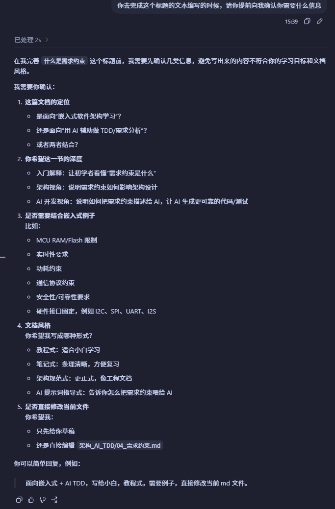
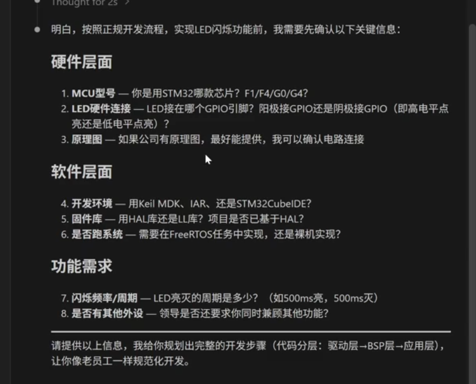

## AI的需求约束

学习目标
- 理解AI提示三要素：角色，任务，上下文
- 掌握初学者不会描述需求的正确问题：**不要先让AI代码，先让AI描述需求反问**
- 学会围绕一个简单的FreeROTS分层工程，整理需求约束硬件约束，任务队列，功能需求，非功能约束，验收条件

### AI提示三要素
例子：

#### 角色
角色是指AI在回答问题时所扮演的身份或角色。通过设定角色，可以让AI更好地理解问题的背景和上下文，从而提供更准确和相关的回答。

1. 让AI站在什么身份去思考问题
> 嵌入式软件架构师，
> 嵌入式软件开发工程师(驱动工程师)
> 嵌入式软件测试工程师
>
> 这3个角色输出是不一样的
> 如果是架构师，它应该先关注
> - 模块边界；
> - 任务划分；
> - 接口关系；
> - 约束条件；
> - 风险点；
>
> 如果是驱动工程师，它应该先关注
> - GPIO
> - UART
> - 中断
> - BSP接口
> - HAL封装
>
> 如果是测试工程师，它应该先关注
> - 功能测试
> - 边界测试
> - 异常测试
> - 验收标准

#### 任务
任务是指AI需要完成的具体工作或目标。明确任务可以帮助AI集中注意力，提供更有针对性的回答。

在真正的工程里面，AI不应该一上来就直接写代码
合理的任务顺序应该
1. 帮我分析需求
2. 帮我整理约束包
3. 帮我输出模块划分
4. 帮我实现某个局部函数
5. 帮我检查代码是否越界
6. 最后帮我生成验证清单

#### 上下文
上下文是指与问题相关的背景信息和环境。提供足够的上下文可以帮助AI更好地理解问题的细节，从而提供更准确和有用的回答。

对于嵌入式来说，上下文包括
- MCU型号
- 开发框架
- HAL库版本
- 是否使用RTOS
- LED连接在哪个引脚
- 按键连接在哪个引脚
- 串口port
- 任务周期
- 队列关系
- 分层架构
- 文件目录
- 那些文件是生产文件
- 那些文件是用户代码
- 那些接口已经存在
- 那些接口不允许直接调用
- 功能验收标准


``` bash
你是一个有量产经验的嵌入式软件架构师，你熟悉stm32开发，了解HAL库，了解FreeROTS操作系统，了解嵌入式软件开发流程，了解软件架构设计原则，了解软件需求分析方法，了解软件测试方法。

我是一个嵌入式零基础小白，我现在在公司上班，公司交给我一个任务，让我去闪烁一个LED灯

你的任务是，让我符合一个有工作经验的人的开发方式，去完成这个任务，你实现这个功能需要什么信息，请提前向我确认、
```


之后再进行输入内容
``` bash
芯片用的 STM32F411
LED连接在PC13上
低电平点亮

需要的功能需求：
- 需要使用FreeROTS操作系统
- 需要使用HAL库进行开发
- 需要实现一个LED闪烁的功能，闪烁频率为1Hz
- 需要实现一个按键控制LED闪烁的功能，按键连接在PA0上，按下按键时LED闪烁，松开按键时LED停止闪烁


```

### 需求约束包

#### 什么是需求约束

需求约束可以理解为：**在实现一个功能之前，必须提前说清楚的限制条件、边界条件和验收条件**。

对于初学者来说，最容易犯的错误是：
- 只告诉AI“帮我写一个LED闪烁代码”
- 没有告诉AI使用什么芯片
- 没有告诉AILED接在哪个引脚
- 没有告诉AI高电平点亮还是低电平点亮
- 没有告诉AI是否使用RTOS
- 没有告诉AI代码应该放在哪一层
- 没有告诉AI最后怎么验证功能是对的

这样AI虽然也能生成代码，但是生成的代码很可能不能直接用于你的工程。

所以在让AI写代码之前，应该先让AI帮你整理一个“需求约束包”。

#### 需求约束包是什么

需求约束包就是把一个功能相关的信息统一整理出来，让AI、开发人员、测试人员都能基于同一份信息进行工作。

它不是代码，而是代码之前的工程说明。

一个完整的需求约束包通常包括：
- 背景信息
- 硬件约束
- 软件约束
- 功能需求
- 非功能约束
- 模块边界
- 接口约束
- 验收条件
- 风险点

对于嵌入式开发来说，需求约束包非常重要。因为嵌入式软件不是单独运行在电脑上的程序，它一定会受到硬件、芯片资源、外设接口、实时性、功耗、可靠性等条件限制。

#### 为什么不能直接让AI写代码

AI写代码依赖上下文。

如果上下文不完整，AI就会自己猜。

例如你只说：
``` bash
帮我写一个LED闪烁程序
```

AI可能会猜：
- 你用的是STM32
- LED接在某个默认引脚
- 高电平点亮
- 不使用RTOS
- 直接在main函数里面while循环延时

但是你的真实工程可能是：
- STM32F411
- LED连接在PC13
- 低电平点亮
- 必须使用FreeRTOS
- 不能在业务层直接调用HAL_GPIO_WritePin
- LED控制必须走BSP层接口

这时AI生成的代码就会和你的工程要求不一致。

所以，正确做法不是：
``` bash
你帮我写代码
```

而是：
``` bash
你先根据我的任务，帮我整理需求约束包。
如果信息不足，请先向我反问，不要直接写代码。
```

#### 嵌入式里面常见的需求约束

##### 1. 硬件约束

硬件约束是由电路和芯片决定的，软件不能随便改。

常见内容：
- MCU型号
- 主频
- Flash大小
- RAM大小
- 外设资源
- GPIO引脚连接
- 电平有效状态
- 是否有上拉或下拉
- 是否使用中断
- 外设是否被其他模块占用

例子：
``` bash
MCU：STM32F411
LED引脚：PC13
LED有效电平：低电平点亮
按键引脚：PA0
按键触发方式：按下为高电平
```

这里的PC13、PA0、低电平点亮，都是硬件约束。软件开发时必须遵守。

##### 2. 软件约束

软件约束是由工程框架、操作系统、代码规范决定的。

常见内容：
- 是否使用FreeRTOS
- 是否使用HAL库
- 是否有BSP层
- 是否有App层
- 是否允许直接调用HAL函数
- 文件应该放在哪个目录
- 命名风格
- 任务周期
- 队列或事件组使用方式

例子：
``` bash
必须使用FreeRTOS
必须使用HAL库
LED控制封装在BSP层
App层不能直接调用HAL_GPIO_WritePin
LED任务周期为500ms
```

这些约束会影响代码结构。

如果没有这些约束，AI可能会直接在`main.c`里面写死GPIO控制，这种代码虽然能跑，但是不一定符合工程架构。

##### 3. 功能需求

功能需求描述“系统要做什么”。

例子：
``` bash
系统需要实现LED闪烁功能
LED闪烁频率为1Hz
按键按下时LED开始闪烁
按键松开时LED停止闪烁
```

功能需求要尽量明确，避免只写“控制LED”这种模糊描述。

##### 4. 非功能约束

非功能约束描述“系统要以什么质量完成这个功能”。

常见内容：
- 实时性
- 稳定性
- 可维护性
- 可测试性
- 资源占用
- 功耗
- 安全性

例子：
``` bash
按键状态变化后，LED状态响应时间不超过50ms
LED控制逻辑不能阻塞其他任务
任务中不能使用长时间忙等待
代码需要方便后续扩展多个LED
```

非功能约束经常决定架构质量。

一个功能“能跑”不等于“工程上可接受”。

##### 5. 模块边界

模块边界描述每一层负责什么，不负责什么。

例子：
``` bash
BSP_LED层：
- 负责封装具体GPIO控制
- 对外提供LED_Init、LED_On、LED_Off、LED_Toggle接口

APP_LED层：
- 负责LED闪烁业务逻辑
- 不直接操作GPIO寄存器
- 不直接调用HAL_GPIO_WritePin

APP_KEY层：
- 负责读取按键状态
- 负责按键消抖
```

模块边界清楚以后，AI生成代码时就不容易把所有逻辑都写到一个文件里。

##### 6. 验收条件

验收条件描述“怎么判断这个功能完成了”。

例子：
``` bash
上电后，如果按键没有按下，LED保持熄灭
按下PA0按键后，PC13 LED开始以1Hz频率闪烁
松开PA0按键后，LED停止闪烁
连续按键10次，系统不能卡死
LED任务不能影响其他FreeRTOS任务运行
```

验收条件越清楚，AI越容易帮你生成测试清单，也越容易检查代码是否符合需求。

#### LED闪烁任务的需求约束包示例

下面是一个适合给AI使用的需求约束包示例。

``` bash
项目背景：
- 我正在学习嵌入式软件开发
- 当前任务是在STM32F411上实现LED闪烁
- 希望按照分层架构方式实现，而不是把代码全部写在main.c里面

硬件约束：
- MCU型号：STM32F411
- LED连接引脚：PC13
- LED有效电平：低电平点亮
- 按键连接引脚：PA0
- 按键按下状态：高电平

软件约束：
- 使用HAL库
- 使用FreeRTOS
- LED底层控制需要封装到BSP_LED层
- App层不能直接调用HAL_GPIO_WritePin
- LED闪烁逻辑放在应用层任务中

功能需求：
- 实现LED闪烁功能
- 闪烁频率为1Hz
- 按键按下时LED闪烁
- 按键松开时LED停止闪烁

非功能约束：
- LED任务不能长时间阻塞系统
- 按键响应时间尽量小于50ms
- 代码结构要方便后续增加多个LED
- 代码需要方便单独测试BSP_LED接口

验收条件：
- 按键未按下时，LED不闪烁
- 按键按下后，LED以1Hz频率闪烁
- 按键松开后，LED停止闪烁
- 系统运行过程中不能卡死
- LED控制代码不能散落在多个业务文件中
```

#### 给AI的推荐提问方式

当你要让AI帮你开发一个嵌入式功能时，可以这样提问：

``` bash
你是一个有量产经验的嵌入式软件架构师。

我现在要实现一个嵌入式功能，请你不要直接写代码。

你的任务是：
1. 先帮我整理需求约束包
2. 如果我的信息不完整，请先向我反问
3. 等需求约束包完整后，再帮我进行模块划分
4. 最后再根据模块划分生成代码

当前已知信息如下：
- MCU：
- 是否使用RTOS：
- 是否使用HAL库：
- 硬件引脚：
- 功能目标：
- 验收条件：
```

#### 小白需要记住的核心原则

- 需求约束不是多余的文字，而是代码生成前的输入条件
- 嵌入式开发必须先确认硬件，再讨论软件
- 不要让AI一上来就写代码，要先让AI反问
- 需求描述越清楚，AI生成的代码越接近真实工程
- 约束包的作用是防止AI乱猜
- 验收条件的作用是判断功能是否真的完成

一句话总结：

> 需求约束包就是在写代码之前，把“要做什么、不能怎么做、受什么限制、怎么验收”提前说清楚。
