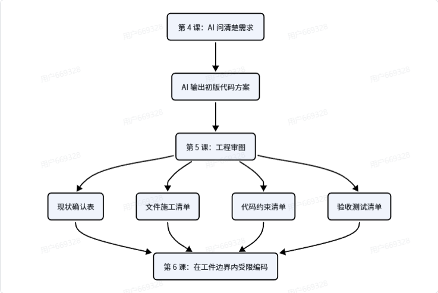
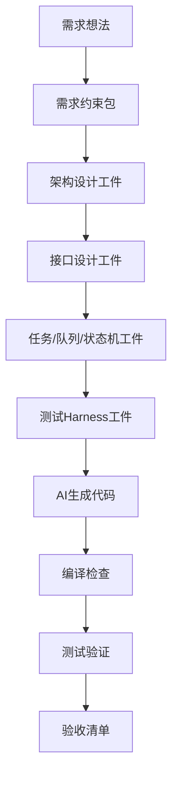
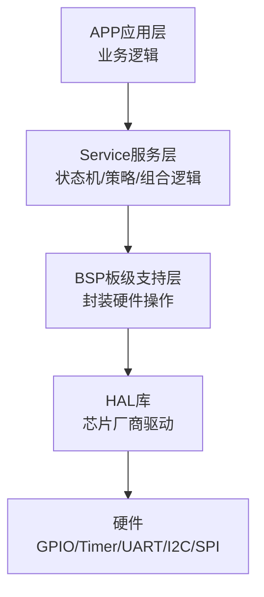
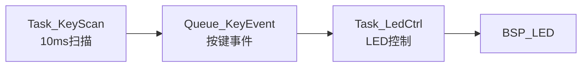
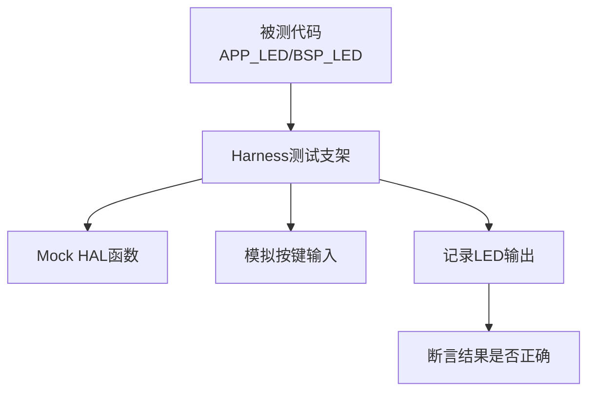
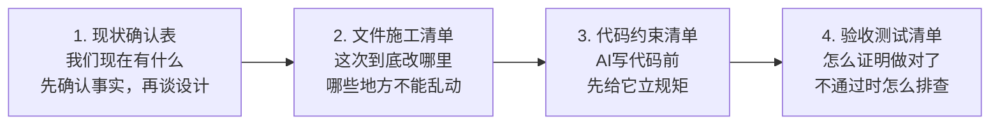
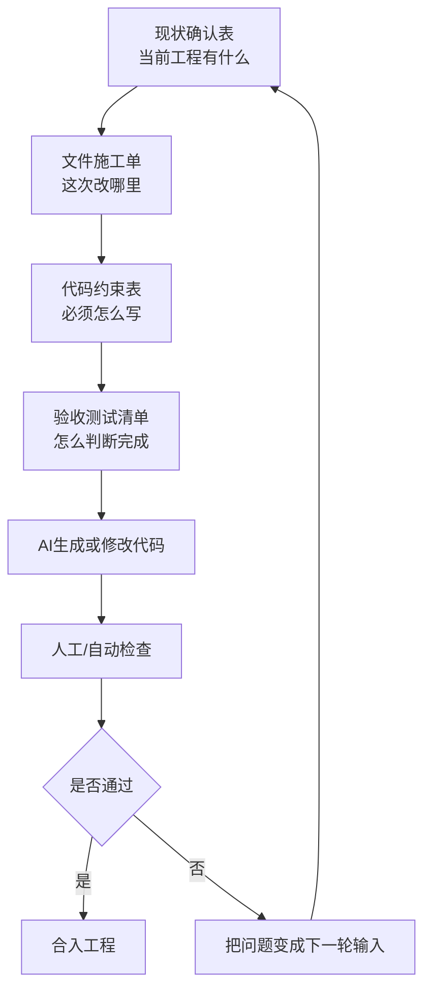

## 工程工件化：把设计变成AI可执行输入

### 学习目标

- 理解什么是工程工件化
- 理解为什么AI第一版输出不能直接复制到工程
- 知道为什么不能只把“想法”丢给AI
- 学会把需求、架构、接口、测试整理成AI能执行的输入
- 学会让AI审查上一轮输出，并且把审查结果变成下一轮输入
- 学会用工件约束AI写代码，减少AI乱猜
- 掌握AI工程审图4步法：现状确认表、文件施工单、代码约束表、验收测试清单
- 理解harness的概念，知道它如何帮助AI写代码和验证代码

> 核心问题：怎么让AI审视自己的输出，而不是让AI直接改工程？



### 本章默认假设

为了方便学习，本章先使用一个简单嵌入式例子：

``` bash
平台：STM32F411
开发方式：HAL库 + FreeRTOS
功能：按键控制LED闪烁
分层：BSP层 + APP层
目标：让AI根据工程工件生成更接近真实项目的代码
```

如果你后续换成其他芯片、RTOS、裸机工程、其他外设，也可以复用本章方法。

---

## 1. 什么是工程工件化

工程工件化，就是把开发过程中那些“脑子里的想法”，变成可以被人阅读、可以被AI理解、可以被测试验证的文档或文件。

简单说：

> 工程工件化 = 把设计变成明确的输入材料。

对AI开发来说，工程工件化尤其重要。

因为AI不是你项目组里长期工作的同事，它不知道你的工程习惯、目录结构、模块边界、接口规则、测试方式。

如果你不把这些信息整理成工件，AI就会自己猜。

### 小白常见错误

``` bash
帮我写一个按键控制LED闪烁代码
```

这个输入太少，AI可能不知道：
- 你用不用FreeRTOS
- LED接在哪个引脚
- LED高电平点亮还是低电平点亮
- 按键有没有消抖
- 代码放在哪个文件
- APP层能不能直接调用HAL
- 怎么判断代码写对了

### 工程化的表达方式

``` bash
请根据以下工程工件生成代码：
1. 需求约束包
2. 模块设计说明
3. 接口定义
4. 任务与队列设计
5. 文件生成清单
6. 测试harness要求
7. 验收清单

如果信息不足，请先反问，不要直接写代码。
```

这两种提问方式的区别很大。

前者是“让AI猜”。

后者是“让AI按工程输入执行”。

---

## 2. 工程工件在AI开发中的位置

可以把AI开发流程理解为下面这张图。



这张图里面最重要的一点是：

> AI写代码不是第一步，而是在工件准备完成之后才开始。

如果没有前面的工件，AI生成代码的质量会非常不稳定。

---

## 3. 你需要学习哪些工程工件

### 3.1 需求约束包

需求约束包解决的问题是：

> 这个功能要做什么，受到什么限制，最后怎么验收？

它应该包括：
- 硬件约束
- 软件约束
- 功能需求
- 非功能需求
- 验收条件
- 风险点

例子：

``` bash
功能：按键控制LED闪烁

硬件约束：
- LED：PC13，低电平点亮
- 按键：PA0，按下为高电平

软件约束：
- 使用FreeRTOS
- 使用HAL库
- APP层不能直接调用HAL_GPIO_WritePin

验收条件：
- 按键按下后LED以1Hz闪烁
- 按键松开后LED停止闪烁
- 系统不能因为LED任务阻塞
```

### 3.2 架构设计工件

架构设计工件解决的问题是：

> 代码应该分成哪些模块，每个模块负责什么？

对于小型嵌入式工程，可以先学习这种分层：



每一层的职责：

- APP层：负责业务，比如“按键按下时LED闪烁”
- Service层：负责可复用逻辑，比如状态机、滤波、协议解析
- BSP层：负责板级硬件封装，比如`BSP_LED_On`
- HAL层：负责调用芯片厂商库
- 硬件层：真实外设和电路

初学阶段不一定每个功能都需要Service层。

但是你必须理解一个原则：

> 上层描述业务，下层屏蔽硬件。

### 3.3 模块边界工件

模块边界工件解决的问题是：

> 每个模块能做什么，不能做什么？

例子：

``` bash
模块：BSP_LED

允许做：
- 初始化LED GPIO
- 点亮LED
- 熄灭LED
- 翻转LED

不允许做：
- 判断按键状态
- 创建FreeRTOS任务
- 处理业务状态机
```

再看APP层：

``` bash
模块：APP_LED

允许做：
- 创建LED控制任务
- 根据按键状态决定LED是否闪烁
- 调用BSP_LED接口

不允许做：
- 直接调用HAL_GPIO_WritePin
- 直接操作GPIO寄存器
- 修改硬件初始化细节
```

这个工件可以直接拿来约束AI：

``` bash
生成代码时必须遵守模块边界：
- APP_LED.c不能直接调用HAL_GPIO_WritePin
- BSP_LED.c可以调用HAL_GPIO_WritePin
- 按键逻辑不能写在BSP_LED.c里面
```

### 3.4 接口设计工件

接口设计工件解决的问题是：

> 模块之间通过什么函数、数据结构、返回值交互？

例子：

``` c
typedef enum
{
    BSP_LED_ID_STATUS = 0,
} BSP_LED_ID_E;

void BSP_LED_Init(void);
void BSP_LED_On(BSP_LED_ID_E led);
void BSP_LED_Off(BSP_LED_ID_E led);
void BSP_LED_Toggle(BSP_LED_ID_E led);
```

接口设计时要注意：
- 函数名要表达意图
- 参数不能暴露太多硬件细节
- 返回值要能表达错误
- 上层不应该知道底层GPIO端口和引脚

不推荐：

``` c
void LED_Write(GPIO_TypeDef *port, uint16_t pin, GPIO_PinState state);
```

原因是APP层拿到了太多硬件细节。

更推荐：

``` c
void BSP_LED_On(BSP_LED_ID_E led);
void BSP_LED_Off(BSP_LED_ID_E led);
```

这样以后LED从PC13换到PB5，上层代码不需要改。

### 3.5 数据流工件

数据流工件解决的问题是：

> 信息从哪里来，经过哪些模块，最后影响什么输出？

按键控制LED可以画成这样：


这张图的作用是帮助你和AI确认：
- 按键输入从哪里来
- 是否需要消抖
- 谁负责判断按下和松开
- 谁负责控制LED
- 谁可以接触硬件

### 3.6 任务与队列工件

在FreeRTOS工程中，你还需要描述任务、队列、事件组、互斥锁这些运行时关系。

例子：

``` bash
任务设计：

Task_KeyScan：
- 周期：10ms
- 职责：扫描按键并消抖
- 输出：按键状态事件

Task_LedCtrl：
- 周期：100ms或事件触发
- 职责：根据按键状态控制LED闪烁
- 输入：按键状态事件
```

可以画成：



任务设计要写清楚：
- 任务名称
- 任务周期
- 优先级
- 栈大小
- 输入来源
- 输出目标
- 是否允许阻塞
- 是否使用队列或事件组

这类信息不写清楚，AI很容易写出不合理的FreeRTOS代码。

### 3.7 文件生成清单

文件生成清单解决的问题是：

> AI应该创建或修改哪些文件？

例子：

``` bash
需要生成：
- Core/Inc/bsp_led.h
- Core/Src/bsp_led.c
- Core/Inc/bsp_key.h
- Core/Src/bsp_key.c
- App/Inc/app_led.h
- App/Src/app_led.c

不能修改：
- startup_stm32f411xx.s
- 系统自动生成的HAL库文件
- 与本功能无关的驱动文件
```

给AI写代码时，要明确文件范围。

否则AI可能会改很多不相关文件，后续很难检查。

---

## 4. Harness是什么

Harness可以翻译成“测试支架”或“运行支架”。

在AI写代码场景里，你可以先这样理解：

> Harness就是为了让某段代码能被单独运行、单独测试、单独验证而搭建的一层辅助环境。

嵌入式代码经常依赖硬件。

例如`BSP_LED_On()`里面可能会调用：

``` c
HAL_GPIO_WritePin(GPIOC, GPIO_PIN_13, GPIO_PIN_RESET);
```

这段代码在真实板子上可以运行，但是在电脑上不能直接测试。

因为电脑上没有STM32的GPIOC，也没有PC13引脚。

这时就需要harness。

### 4.1 Harness解决什么问题

Harness主要解决三个问题：

- 让代码脱离真实硬件也能被编译或测试
- 让AI写完代码后，有地方验证行为是否正确
- 让测试输入和测试结果变得明确

可以画成这样：



### 4.2 Harness和真实硬件的区别

``` bash
真实硬件：
- 按键状态来自PA0
- LED输出到PC13
- HAL函数真正操作寄存器

Harness环境：
- 按键状态由测试代码模拟
- LED输出记录到变量里
- HAL函数替换成Mock函数
```

真实硬件关注“能不能在板子上跑”。

Harness关注“逻辑是不是正确”。

这两个都重要。

### 4.3 一个LED Harness的简单例子

假设我们要测试APP层逻辑：

``` bash
需求：
- 按键按下时LED开始闪烁
- 按键松开时LED停止闪烁
```

Harness可以提供这些能力：

``` bash
Harness输入：
- 模拟按键按下
- 模拟按键松开
- 模拟系统tick推进

Harness输出：
- 记录LED On次数
- 记录LED Off次数
- 记录LED Toggle次数

Harness断言：
- 按键未按下时，LED不应该Toggle
- 按键按下1秒内，LED应该Toggle约2次
- 按键松开后，LED不再Toggle
```

伪代码示例：

``` c
void test_led_should_blink_when_key_pressed(void)
{
    Harness_Reset();

    Harness_SetKeyPressed(true);

    for (int i = 0; i < 1000; i += 10)
    {
        APP_LED_Tick10ms();
        Harness_AdvanceTimeMs(10);
    }

    TEST_ASSERT_GREATER_OR_EQUAL(2, Harness_GetLedToggleCount());
}
```

这里的重点不是语法，而是思想：

> Harness把硬件输入和硬件输出变成了可控制、可观察、可断言的东西。

### 4.4 Harness为什么适合AI写代码

AI写代码最怕需求模糊。

Harness能把需求变成明确的验证规则。

你可以这样要求AI：

``` bash
请先不要写最终驱动代码。

请先为APP_LED模块设计一个测试harness：
- 能模拟按键按下和松开
- 能模拟时间推进
- 能记录LED Toggle次数
- 能验证按键按下时LED闪烁
- 能验证按键松开时LED停止

然后再根据harness生成APP_LED代码。
```

这个流程比直接让AI写代码更可靠。

原因是：
- AI先明确测试方式
- 再根据测试目标写实现
- 最后可以用测试结果反推代码是否正确

这就是AI开发里很重要的思路：

> 先写可验证的输入，再让AI写代码。

---

## 5. 工件之间的关系

可以把工程工件理解成一条链路。


每个工件都在减少AI的不确定性。

| 工件 | 解决的问题 | 给AI的价值 |
| --- | --- | --- |
| 需求约束包 | 要做什么、限制是什么 | 防止AI乱猜需求 |
| 架构设计 | 分几层、怎么组织 | 防止AI把代码写乱 |
| 模块边界 | 谁负责什么 | 防止职责混乱 |
| 接口定义 | 模块如何交互 | 防止函数风格不统一 |
| 任务设计 | FreeRTOS如何运行 | 防止任务和阻塞设计错误 |
| Harness | 如何验证逻辑 | 防止代码不可测试 |
| 验收清单 | 最终怎么确认完成 | 防止功能做偏 |

---

## 6. AI工程审图4步法

工程审图原本是硬件、结构、建筑等工程里的概念。

在AI写代码这里，也可以借用这个思想：

> 不要让AI直接施工，先让AI审图。

这里的“图”不是只指图片，而是指AI准备改代码之前的设计输入。

### AI工程审图四件套

对零基础同学来说，不要一上来讲太多UML、复杂状态图和复杂架构图。

本节只抓四个最重要、最能落地的工件：

| 四件套 | 核心问题 | 小白理解 |
| --- | --- | --- |
| 1. 现状确认表 | 我们现在有什么？ | 先确认事实，再谈设计 |
| 2. 文件施工清单 | 这次到底改哪里？ | 哪些地方能动，哪些地方不能乱动 |
| 3. 代码约束清单 | AI写代码前要遵守什么规矩？ | 先给AI立规矩，再让AI写 |
| 4. 验收测试清单 | 怎么证明做对了？ | 不通过时怎么排查 |

也可以用下面这张图理解：



这四个工件的顺序不能乱：

- 先知道当前工程有什么
- 再决定这次改哪些文件
- 再规定AI写代码时必须遵守什么
- 最后用验收测试判断是否真的完成

### 6.1 第一步：现状确认表

现状确认表解决的问题是：

> 当前工程是什么样的？

AI在改代码前，必须先知道现在工程里已经有什么。

例子：

``` bash
现状确认表：

工程平台：
- MCU：STM32F411
- RTOS：FreeRTOS
- 驱动库：STM32 HAL

已有文件：
- Core/Src/main.c
- Core/Src/gpio.c
- Core/Inc/gpio.h
- App/Src/app_led.c
- BSP/Src/bsp_led.c

已有接口：
- BSP_LED_On()
- BSP_LED_Off()
- BSP_LED_Toggle()

不能随便修改：
- startup文件
- HAL库源码
- CubeMX自动生成区域以外的初始化逻辑
```

现状确认表的价值：
- 防止AI重复造接口
- 防止AI修改不该改的文件
- 防止AI不知道工程已有结构

### 6.2 第二步：文件施工单

文件施工单解决的问题是：

> 这次到底要改哪些文件，每个文件改什么？

例子：

``` bash
文件施工单：

需要新增：
- App/Inc/app_led.h：声明APP_LED_Init和APP_LED_Task
- App/Src/app_led.c：实现LED闪烁任务

需要修改：
- Core/Src/freertos.c：创建LED任务

禁止修改：
- Core/Src/gpio.c
- Drivers/STM32F4xx_HAL_Driver/*
```

文件施工单的价值：
- 控制AI的修改范围
- 方便后续代码审查
- 出问题时容易回退

### 6.3 第三步：代码约束表

代码约束表解决的问题是：

> AI写代码时必须遵守哪些规则？

例子：

``` bash
代码约束表：

分层约束：
- APP层不能直接调用HAL_GPIO_WritePin
- APP层只能调用BSP_LED接口
- BSP层可以调用HAL库

RTOS约束：
- 任务中不能使用HAL_Delay
- FreeRTOS任务中使用vTaskDelay
- 任务不能长时间忙等待

命名约束：
- BSP层函数以BSP_开头
- APP层函数以APP_开头

可测试性约束：
- 业务逻辑尽量放到可单独调用的函数中
- 时间推进逻辑尽量可以被harness模拟
```

代码约束表的价值：
- 防止AI写出能跑但不符合架构的代码
- 防止AI在RTOS任务里使用错误延时
- 防止AI把硬件细节泄漏到业务层

### 6.4 第四步：验收测试清单

验收测试清单解决的问题是：

> 怎么判断AI写出来的代码真的完成了？

例子：

``` bash
验收测试清单：

编译检查：
- 工程可以无错误编译
- 没有新增未使用函数警告

功能检查：
- 按键未按下时LED不闪烁
- 按键按下时LED以1Hz闪烁
- 按键松开时LED停止闪烁

架构检查：
- APP层没有直接调用HAL_GPIO_WritePin
- BSP层没有出现业务判断逻辑

Harness检查：
- 可以模拟按键按下和松开
- 可以记录LED Toggle次数
- 可以验证LED闪烁逻辑
```

验收测试清单的价值：
- 让AI知道完成标准
- 让你知道怎么检查AI输出
- 让下一轮修改有明确依据

### 6.5 审图4步法总图



小白要记住：

> AI工程审图4步法的目的，不是让流程变复杂，而是让AI每次修改都可控、可查、可回退。

---

## 7. 给AI的工件化输入模板

以后你可以用下面这个模板让AI帮你开发嵌入式功能。

``` bash
你是一个有量产经验的嵌入式软件架构师，熟悉STM32、HAL库、FreeRTOS、分层架构和单元测试。

我现在要开发一个嵌入式功能。

请你按照工程工件化方式工作，不要一上来直接写代码。

你的工作顺序：
1. 检查我的需求是否完整
2. 如果信息不足，先向我反问
3. 整理需求约束包
4. 输出架构设计
5. 输出模块边界
6. 输出接口定义
7. 输出任务/队列设计
8. 输出测试harness设计
9. 输出文件生成清单
10. 最后再生成代码

当前已知信息：
- MCU：
- 开发框架：
- 是否使用RTOS：
- 功能目标：
- 硬件连接：
- 模块分层要求：
- 不允许修改的文件：
- 验收条件：
```

### 让AI生成代码前的检查清单

在让AI写代码之前，先检查下面这些问题。

- 需求是否说清楚
- 硬件引脚是否确认
- 电平有效状态是否确认
- 是否使用RTOS已经确认
- 模块边界是否确认
- 接口是否定义清楚
- 文件生成范围是否明确
- 是否有测试harness
- 是否有验收条件
- 是否说明哪些文件不能改

如果这些问题没有确认，先不要让AI写代码。

---

## 8. 小白学习路径

建议你按下面顺序学习工程工件化：

1. 先学会写需求约束包
2. 再学会画模块分层图
3. 再学会写模块职责和边界
4. 再学会定义接口
5. 再学会描述任务和队列
6. 再学会写验收条件
7. 最后学习harness和自动化测试

学习时不要追求一开始就写得很专业。

先做到这件事：

> 让AI看完你的输入后，不需要猜，也知道应该在哪里写、怎么写、怎么验证。

---

## 9. 本章总结

工程工件化的核心不是写很多文档。

它的核心是：

> 把模糊想法变成AI可以执行、代码可以落地、测试可以验证的输入。

对嵌入式AI开发来说，最重要的工件有：

- 需求约束包
- 架构设计图
- 模块边界说明
- 接口定义
- 任务与队列设计
- 文件生成清单
- Harness测试支架
- 验收清单

一句话总结：

> 工程工件化就是先把“怎么想清楚、怎么分清楚、怎么测清楚”写出来，再让AI去写代码。
