## IIC驱动程序

__学习目标__
1. 掌握0到1根据数据手册写IIC驱动程序的流程，掌握正确的方法论去解决问题
2. 掌握IIC协议的基本原理，能够分析IIC总线上的数据传输过程
3. 根据芯片手册的介绍明确IIC通信的各个细节点
4. 通过读取目标芯片的ID，确保硬件通路的正确性，设备的正常工作

### AHT21的数据手册

拿到了数据手册的时候，应该去拿到原厂的英文版数据手册，中文版的数据手册可能会有翻译错误，导致理解上的偏差。原厂的英文版数据手册通常会更详细和准确。

一般来，数据手册的前面的部分会介绍芯片的电气信息，包括引脚定义、工作电压、工作温度范围等。这些信息对于硬件工程师非常重要。作为软件工程师更注重的是芯片的功能描述、寄存器定义、通信协议等部分。
首先关注接口定义和SCL和SDA的接口和频率等
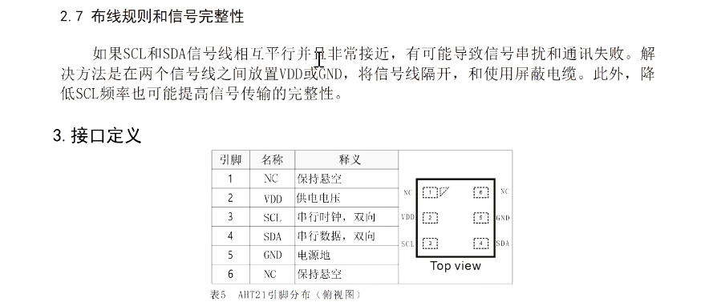

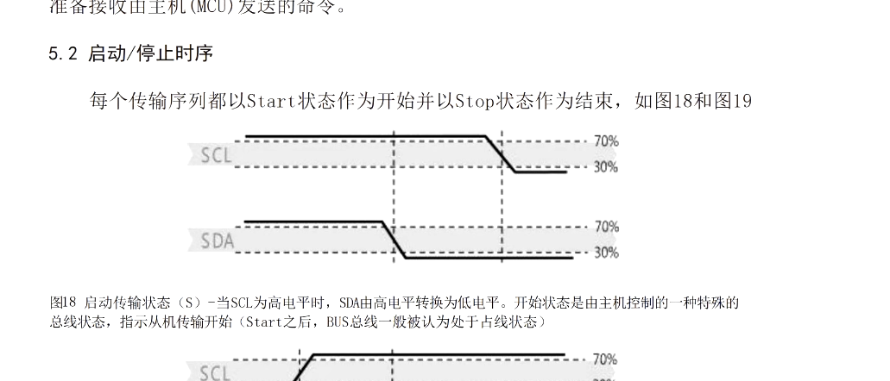
控制顺序和读取顺序以及转换公式等

#### IIC通信协议

1. 起始信号(主机先拉低SDA，然后拉低SCL)
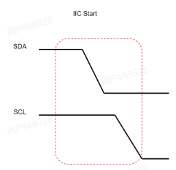

2. 停止信号(主机先拉低SCL，然后拉高SDA)
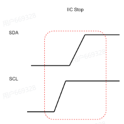

3. IIC的逻辑0和逻辑1的表达
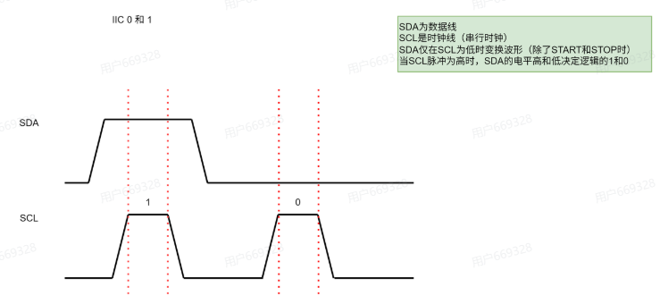
> IIC总线上的数据传输是通过SDA线上的电平变化来表示的。逻辑0通常表示为SDA线被拉低，而逻辑1则表示为SDA线被拉高。主机通过控制SCL线的时钟信号来同步数据的传输。
>总结就是：
>SCL在高电平的时候，SDA线的电平是什么数据(高/低)就表示什么数据。SCL在低电平的时候，SDA线的电平变化不被认为是数据传输，而是被忽略的。

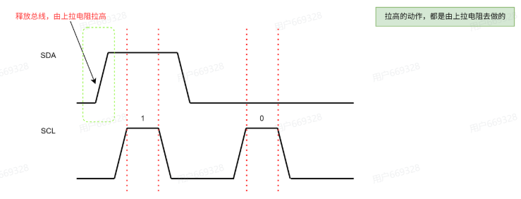
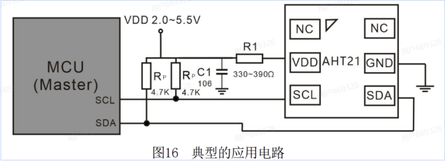

拉高的动作都是上拉电阻去做的
> 在经典的IIC设计电路当中，上拉电阻是必不可少的。上拉电阻的作用是确保当SDA线和SCL线没有被任何设备拉低时，它们能够保持在高电平状态。这是因为IIC总线是开漏(open-drain)设计的，设备只能将线拉低，而不能主动拉高。因此，上拉电阻提供了一个默认的高电平状态，确保总线在空闲时处于已知状态。


IIC的通信过程
1. 发送地址帧 这里的地址帧是7位地址加1位读写位，那么就是2的7次方，也就是128个地址空间最多挂载128个设备
2. 发送数据帧在一帧的ACK后，在后面读写位是W的时候，主机连续发送8位数据帧，设备每接收完8位数据帧后会发送一个ACK信号，表示已经成功接收了数据帧
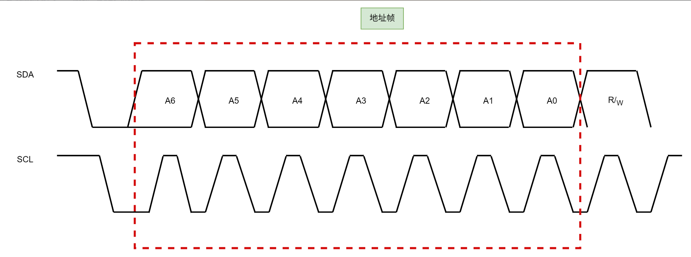
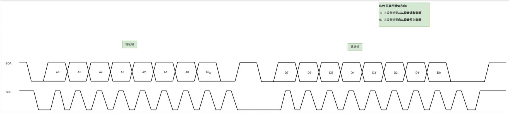
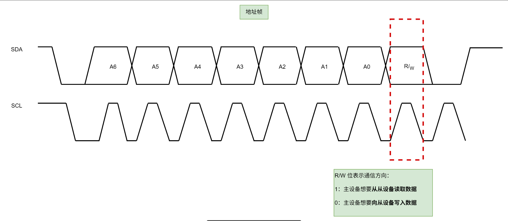
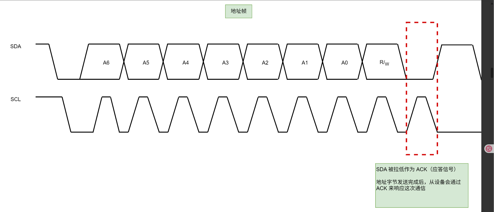

### AHT21对IIC的要求
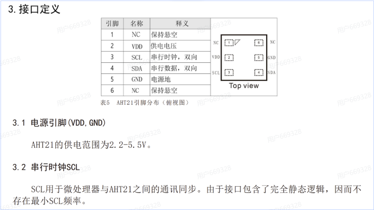

- NC引脚是没有连接的引脚，通常在设计电路时不需要连接任何东西，可以直接悬空。
- VDD引脚是电源引脚，通常需要连接到3.3V的电源。
- GND引脚是地线引脚，需要连接到系统的地。

什么是存在最小的SCL频率？
> 最小的SCL频率是指在IIC通信中，SCL线的时钟频率不能低于某个特定值，否则可能会导致通信不稳定或数据丢失。对于AHT21来说，最小的SCL频率是10kHz，这意味着在进行IIC通信时，SCL线的时钟频率必须至少为10kHz，以确保数据能够正确传输和接收。
> 也就是可以直接打断点进行debug

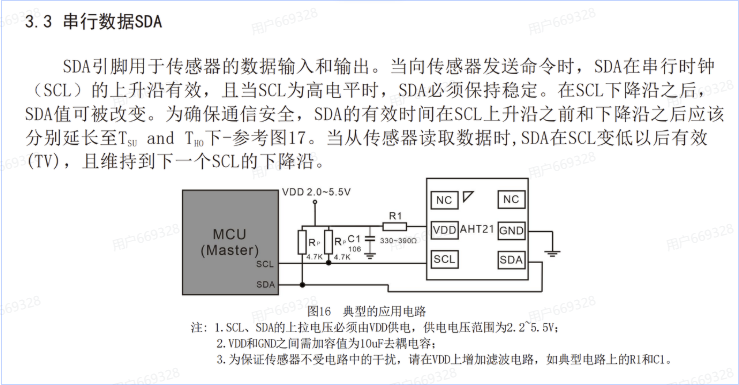
采样时间的确定：在SCL的上升沿采样数据，SCL的下降沿改变数据
> 不同的芯片，对于采样的时间有所不同，但是一般都是在SCL的上升沿采样数据，在SCL的下降沿改变数据。这是因为在IIC通信中，SCL线的时钟信号用于同步数据的传输，主机和从设备都需要在特定的时刻进行数据的采样和改变，以确保通信的正确性和稳定性。

- tsu(SDA)是指在IIC通信中，SDA线上的数据必须在SCL线的上升沿之前稳定，并且保持至少tsu(SDA)的时间，以确保从设备能够正确地采样数据。因为在这里的TTL电平是一个范围，一定要到接近真实值的时候去读取数据，才能保证数据的正确性。
- tho(SDA)是指在IIC通信中，SDA线上的数据必须在SCL线的下降沿之后保持稳定，并且保持至少tho(SDA)的时间，以确保从设备能够正确地采样数据

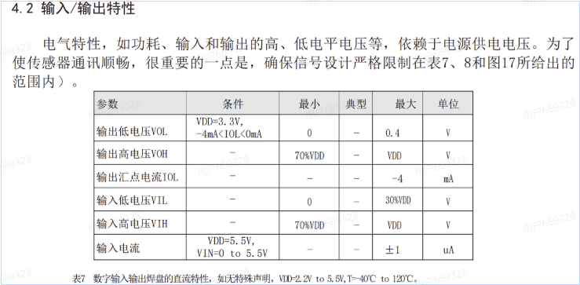

输入和输出的特性
> 确定了传感器的TTL电平的范围，在这里确定了输入和输出的电压范围，确保在设计电路和编写驱动程序时能够正确地处理这些电压水平，以避免通信错误和设备损坏。

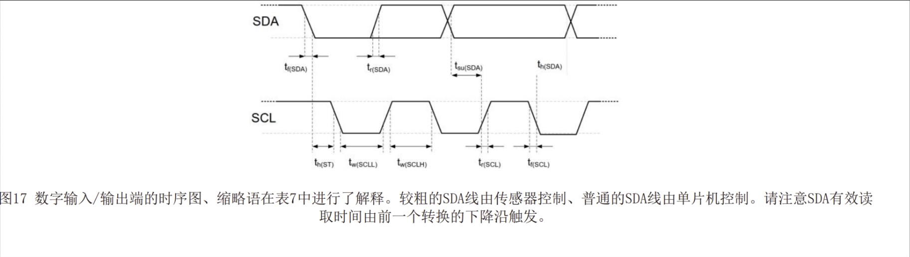
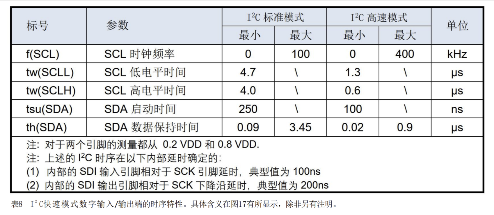
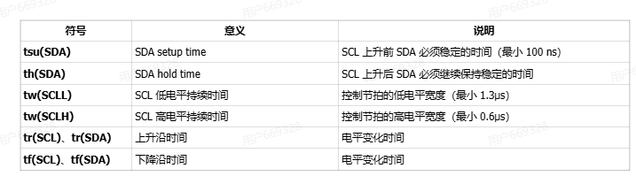


启动传感器
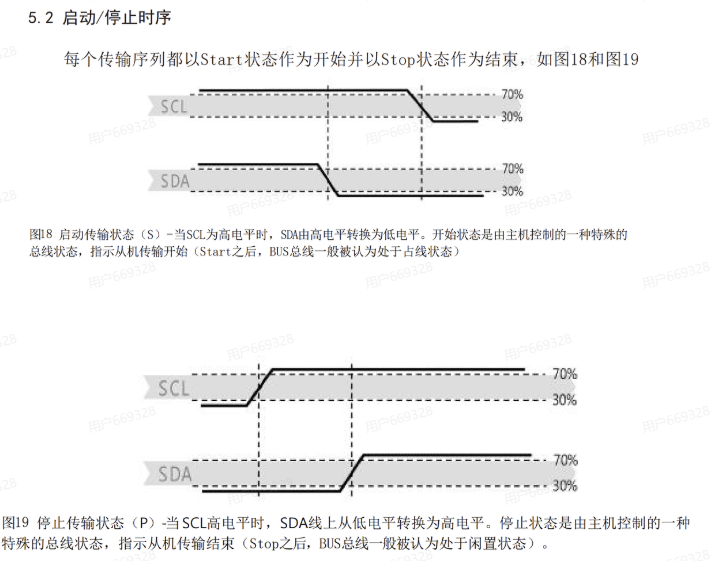


### AHT21对IIC的控制顺序    

##### 确保设备硬件通路正常的方法1
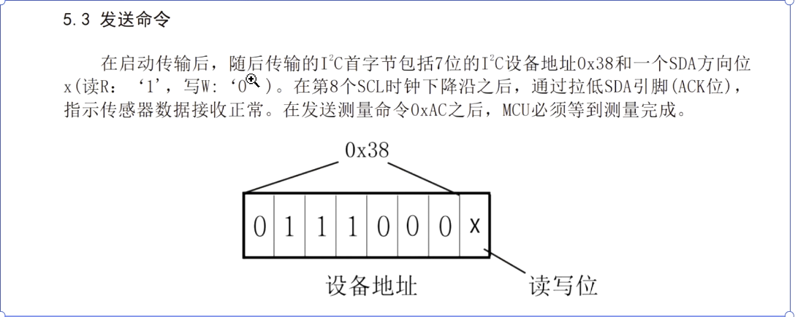
在这里直接发送一个cmd(x38)

##### 确保设备硬件通路正常的方法2
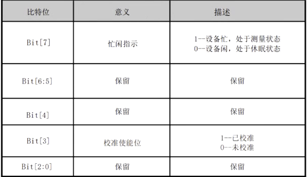

发送完0XAC后再发送0x71 后，读取到0x18，表示采集成功

### 软件实验环境搭建

#### 裸机环境，带串口通信

1. 配置GPIO
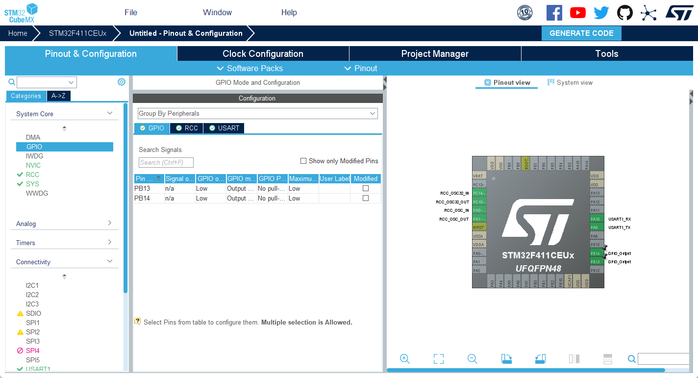
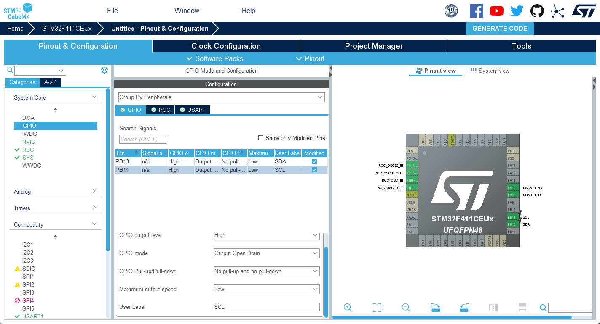
配置好SCL和SDA的GPIO口，配置成开漏输出模式，并且配置好上拉电阻(看芯片手册的要求)

2. 配置外部晶振
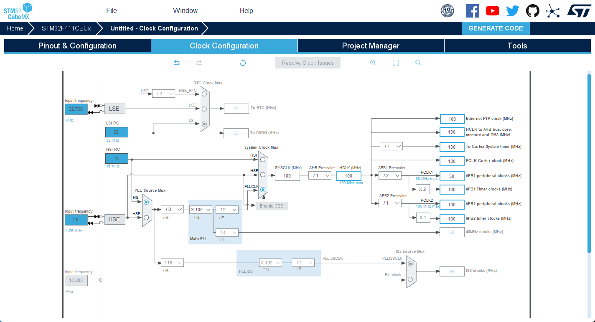

3. project manager配置


1. 配置串口和gpio
``` cpp
/* USER CODE BEGIN 0 */
#ifdef __GNUC__
  #else 
    #define PUTCHAR_PROTOTYPE int fputc(int ch, FILE *f)
#endif

PUTCHAR_PROTOTYPE
{
  HAL_UART_Transmit(&huart1, (uint8_t *)&ch, 1, 0xFFFF);
  return ch;
}
/* USER CODE END 0 */
```
然后再main函数中包含stdio这个标准库
之后进行一个printf的测试，看看串口通信是否正常
``` cpp
#include <stdio.h>
#include <stdio.h> 
#ifdef __GNUC__
     #define PUTCHAR_PROTOTYPE int _io_putchar(int ch)
 #else
     #define PUTCHAR_PROTOTYPE int fputc(int ch, FILE *f)
 #endif /* __GNUC__*/
 
 /******************************************************************
     *@brief  Retargets the C library printf  function to the USART.
     *@param  None
     *@retval None
 ******************************************************************/
 PUTCHAR_PROTOTYPE
 {
     HAL_UART_Transmit(&huart1, (uint8_t *)&ch,1,0xFFFF);
     return ch;
 }
 ```
 确定GPIO的配置

 ```cpp

HAL_GPIO_WritePin(GPIOB, SDA_Pin|SCL_Pin, GPIO_PIN_SET); // SCL拉高
HAL_GPIO_WritePin(GPIOB, SDA_Pin|SCL_Pin, GPIO_PIN_SET); // SDA拉高
``` 
__明确延时(DWT)__

```cpp
// 先包含头文件
#include "core_cm4.h"

void SystemClock_Config(void);
/* USER CODE BEGIN PFP */
/**
 * @brief 初始化 DWT 计数器，用于精确延时（微秒级）
 * 注意：使用此函数前需确保系统时钟已配置且 DWT 可用。
 */
void dwt_delay_init(void)
{
    CoreDebug->DEMCR |= CoreDebug_DEMCR_TRCENA_Msk;     // 使能 DWT（调试跟踪）
    DWT->CYCCNT = 0;                                    // 清零循环计数器
    DWT->CTRL |= DWT_CTRL_CYCCNTENA_Msk;                // 使能 CYCCNT 计数器
}

/**
 * @brief 微秒级延时
 * @param us 延时时间（微秒）
 * 通过读取 DWT->CYCCNT 计数器实现精确延时，要求 SystemCoreClock 为系统时钟频率（Hz）
 */
void delay_us(uint32_t us)
{
    uint32_t start = DWT->CYCCNT;
    uint32_t ticks = us * (SystemCoreClock / 1000000U);

    while ((DWT->CYCCNT - start) < ticks) { }
}

/**
 * @brief 毫秒级延时
 * @param ms 延时时间（毫秒）
 */
void delay_ms(uint32_t ms)
{
    while (ms--)
    {
        delay_us(1000);
    }
}
/* USER CODE END PFP */


int main(void)
{
    /* USER CODE BEGIN 1 */
    SystemClock_Config(); // 配置系统时钟
    dwt_delay_init(); // 初始化 DWT 计数器
    /* USER CODE END 1 */

    /* MCU Configuration--------------------------------------------------------*/

    /* Reset of all peripherals, Initializes the Flash interface and the Systick. */
    HAL_Init();

    /* USER CODE BEGIN Init */

    /* USER CODE END Init */

    /* Configure the system clock */
    while(1)
    {

    }
}
```

移植IIC库
```cpp
#include "iic_hal.h"
#include "delay.h"

/**
  * @brief SDA������ģʽ����
  * @param None
  * @retval None
  */
void SDA_Input_Mode(iic_bus_t *bus)
{
    GPIO_InitTypeDef GPIO_InitStructure = {0};

    GPIO_InitStructure.Pin = bus->IIC_SDA_PIN;
    GPIO_InitStructure.Mode = GPIO_MODE_INPUT;
    GPIO_InitStructure.Pull = GPIO_PULLUP;
    GPIO_InitStructure.Speed = GPIO_SPEED_FREQ_HIGH;
    HAL_GPIO_Init(bus->IIC_SDA_PORT, &GPIO_InitStructure);
}

/**
  * @brief SDA�����ģʽ����
  * @param None
  * @retval None
  */
void SDA_Output_Mode(iic_bus_t *bus)
{
    GPIO_InitTypeDef GPIO_InitStructure = {0};

    GPIO_InitStructure.Pin = bus->IIC_SDA_PIN;
    GPIO_InitStructure.Mode = GPIO_MODE_OUTPUT_OD;
    GPIO_InitStructure.Pull = GPIO_NOPULL;
    GPIO_InitStructure.Speed = GPIO_SPEED_FREQ_HIGH;
    HAL_GPIO_Init(bus->IIC_SDA_PORT, &GPIO_InitStructure);
}

/**
  * @brief SDA�����һ��λ
  * @param val ���������
  * @retval None
  */
void SDA_Output(iic_bus_t *bus, uint16_t val)
{
    if ( val )
    {
        bus->IIC_SDA_PORT->BSRR |= bus->IIC_SDA_PIN;
    }
    else
    {
        bus->IIC_SDA_PORT->BSRR = (uint32_t)bus->IIC_SDA_PIN << 16U;
    }
}

/**
  * @brief SCL�����һ��λ
  * @param val ���������
  * @retval None
  */
void SCL_Output(iic_bus_t *bus, uint16_t val)
{
    if ( val )
    {
        bus->IIC_SCL_PORT->BSRR |= bus->IIC_SCL_PIN;
    }
    else
    {
         bus->IIC_SCL_PORT->BSRR = (uint32_t)bus->IIC_SCL_PIN << 16U;
    }
}

/**
  * @brief SDA����һλ
  * @param None
  * @retval GPIO����һλ
  */
uint8_t SDA_Input(iic_bus_t *bus)
{
	if(HAL_GPIO_ReadPin(bus->IIC_SDA_PORT, bus->IIC_SDA_PIN) == GPIO_PIN_SET){
		return 1;
	}else{
		return 0;
	}
}

/**
  * @brief IIC��ʼ�ź�
  * @param None
  * @retval None
  */
void IICStart(iic_bus_t *bus)
{
    SDA_Output(bus,1);
    //delay1(DELAY_TIME);
		delay_us(2);
    SCL_Output(bus,1);
		delay_us(1);
    SDA_Output(bus,0);
		delay_us(1);
    SCL_Output(bus,0);
		delay_us(1);
}

/**
  * @brief IIC�����ź�
  * @param None
  * @retval None
  */
void IICStop(iic_bus_t *bus)
{
    SCL_Output(bus,0);
		delay_us(2);
    SDA_Output(bus,0);
		delay_us(1);
    SCL_Output(bus,1);
		delay_us(1);
    SDA_Output(bus,1);
		delay_us(1);

}

/**
  * @brief IIC�ȴ�ȷ���ź�
  * @param None
  * @retval None
  */
unsigned char IICWaitAck(iic_bus_t *bus)
{
    unsigned short cErrTime = 5;
    SDA_Input_Mode(bus);
    SCL_Output(bus,1);
    while(SDA_Input(bus))
    {
        cErrTime--;
				delay_us(1);
        if (0 == cErrTime)
        {
            SDA_Output_Mode(bus);
            IICStop(bus);
            return ERROR;
        }
    }
    SDA_Output_Mode(bus);
    SCL_Output(bus,0);
		delay_us(2);
    return SUCCESS;
}

/**
  * @brief IIC����ȷ���ź�
  * @param None
  * @retval None
  */
void IICSendAck(iic_bus_t *bus)
{
    SDA_Output(bus,0);
		delay_us(1);
    SCL_Output(bus,1);
		delay_us(1);
    SCL_Output(bus,0);
		delay_us(1);
	
}

/**
  * @brief IIC���ͷ�ȷ���ź�
  * @param None
  * @retval None
  */
void IICSendNotAck(iic_bus_t *bus)
{
    SDA_Output(bus,1);
		delay_us(1);
    SCL_Output(bus,1);
		delay_us(1);
    SCL_Output(bus,0);
		delay_us(2);

}

/**
  * @brief IIC����һ���ֽ�
  * @param cSendByte ��Ҫ���͵��ֽ�
  * @retval None
  */
void IICSendByte(iic_bus_t *bus,unsigned char cSendByte)
{
    unsigned char  i = 8;
    while (i--)
    {
        SCL_Output(bus,0);
        delay_us(2);
        SDA_Output(bus, cSendByte & 0x80);
				delay_us(1);
        cSendByte += cSendByte;
				delay_us(1);
        SCL_Output(bus,1);
				delay_us(1);
    }
    SCL_Output(bus,0);
		delay_us(2);
}

/**
  * @brief IIC����һ���ֽ�
  * @param None
  * @retval ���յ����ֽ�
  */
unsigned char IICReceiveByte(iic_bus_t *bus)
{
    unsigned char i = 8;
    unsigned char cR_Byte = 0;
    SDA_Input_Mode(bus);
    while (i--)
    {
        cR_Byte += cR_Byte;
        SCL_Output(bus,0);
				delay_us(2);
        SCL_Output(bus,1);
				delay_us(1);
        cR_Byte |=  SDA_Input(bus);
    }
    SCL_Output(bus,0);
    SDA_Output_Mode(bus);
    return cR_Byte;
}

uint8_t IIC_Write_One_Byte(iic_bus_t *bus, uint8_t daddr,uint8_t reg,uint8_t data)
{				   	  	    																 
  IICStart(bus);  
	
	IICSendByte(bus,daddr<<1);	    
	if(IICWaitAck(bus))	//�ȴ�Ӧ��
	{
		IICStop(bus);		 
		return 1;		
	}
	IICSendByte(bus,reg);
	IICWaitAck(bus);	   	 										  		   
	IICSendByte(bus,data);     						   
	IICWaitAck(bus);  		    	   
  IICStop(bus);
	delay_us(1);
	return 0;
}

uint8_t IIC_Write_Multi_Byte(iic_bus_t *bus, uint8_t daddr,uint8_t reg,uint8_t length,uint8_t buff[])
{			
	unsigned char i;	
  IICStart(bus);  
	
	IICSendByte(bus,daddr<<1);	    
	if(IICWaitAck(bus))
	{
		IICStop(bus);
		return 1;
	}
	IICSendByte(bus,reg);
	IICWaitAck(bus);	
	for(i=0;i<length;i++)
	{
		IICSendByte(bus,buff[i]);     						   
		IICWaitAck(bus); 
	}		    	   
  IICStop(bus);
	delay_us(1);
	return 0;
} 

unsigned char IIC_Read_One_Byte(iic_bus_t *bus, uint8_t daddr,uint8_t reg)
{
	unsigned char dat;
	IICStart(bus);
	IICSendByte(bus,daddr<<1);
	IICWaitAck(bus);
	IICSendByte(bus,reg);
	IICWaitAck(bus);
	
	IICStart(bus);
	IICSendByte(bus,(daddr<<1)+1);
	IICWaitAck(bus);
	dat = IICReceiveByte(bus);
	IICSendNotAck(bus);
	IICStop(bus);
	return dat;
}


uint8_t IIC_Read_Multi_Byte(iic_bus_t *bus, uint8_t daddr, uint8_t reg, uint8_t length, uint8_t buff[])
{
	unsigned char i;
	IICStart(bus);
	IICSendByte(bus,daddr<<1);
	if(IICWaitAck(bus))
	{
		IICStop(bus);		 
		return 1;		
	}
	IICSendByte(bus,reg);
	IICWaitAck(bus);
	
	IICStart(bus);
	IICSendByte(bus,(daddr<<1)+1);
	IICWaitAck(bus);
	for(i=0;i<length;i++)
	{
		buff[i] = IICReceiveByte(bus);
		if(i<length-1)
		{IICSendAck(bus);}
	}
	IICSendNotAck(bus);
	IICStop(bus);
	return 0;
}


//
void IICInit(iic_bus_t *bus)
{
    GPIO_InitTypeDef GPIO_InitStructure = {0};

		//bus->CLK_ENABLE();
		
    GPIO_InitStructure.Pin = bus->IIC_SDA_PIN ;
    GPIO_InitStructure.Mode = GPIO_MODE_OUTPUT_PP;
    GPIO_InitStructure.Pull = GPIO_PULLUP;
    GPIO_InitStructure.Speed = GPIO_SPEED_FREQ_HIGH;
    HAL_GPIO_Init(bus->IIC_SDA_PORT, &GPIO_InitStructure);
		
		GPIO_InitStructure.Pin = bus->IIC_SCL_PIN ;
    HAL_GPIO_Init(bus->IIC_SCL_PORT, &GPIO_InitStructure);
}
```

 
``` cpp
#ifndef __IIC_HAL_H
#define __IIC_HAL_H

#include "stm32f4xx_hal.h"

typedef struct
{
	GPIO_TypeDef * IIC_SDA_PORT;
	GPIO_TypeDef * IIC_SCL_PORT;
	uint16_t IIC_SDA_PIN;
	uint16_t IIC_SCL_PIN;
	//void (*CLK_ENABLE)(void);
}iic_bus_t;

void IICStart(iic_bus_t *bus);
void IICStop(iic_bus_t *bus);
unsigned char IICWaitAck(iic_bus_t *bus);
void IICSendAck(iic_bus_t *bus);
void IICSendNotAck(iic_bus_t *bus);
void IICSendByte(iic_bus_t *bus, unsigned char cSendByte);
unsigned char IICReceiveByte(iic_bus_t *bus);
void IICInit(iic_bus_t *bus);

uint8_t IIC_Write_One_Byte(iic_bus_t *bus, uint8_t daddr,uint8_t reg,uint8_t data);
uint8_t IIC_Write_Multi_Byte(iic_bus_t *bus, uint8_t daddr,uint8_t reg,uint8_t length,uint8_t buff[]);
unsigned char IIC_Read_One_Byte(iic_bus_t *bus, uint8_t daddr,uint8_t reg);
uint8_t IIC_Read_Multi_Byte(iic_bus_t *bus, uint8_t daddr, uint8_t reg, uint8_t length, uint8_t buff[]);
#endif
``` 

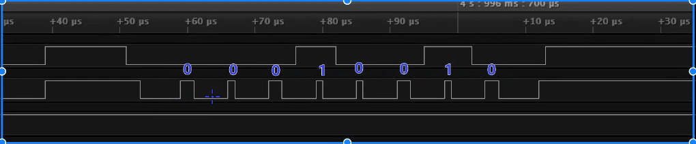


#### 测试方法1

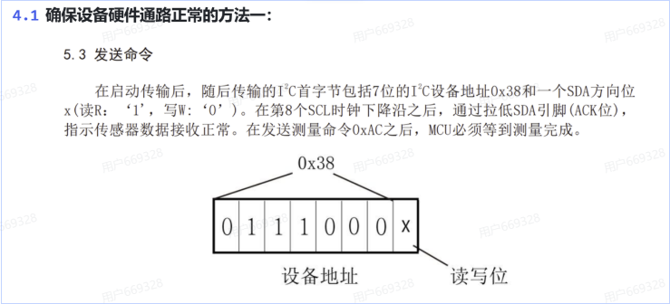
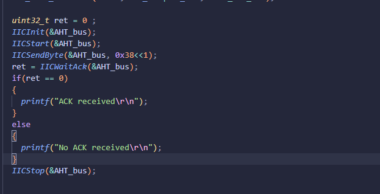
第一次先拔掉AHT21，后面再次插上AHT21，看看SDA线的变化，确认设备是否正确响应了主机的地址帧。
先发0x38，看看SDA线是否被拉低，如果被拉低了，说明设备已经正确地响应了主机的地址帧，通信通路是正常的。
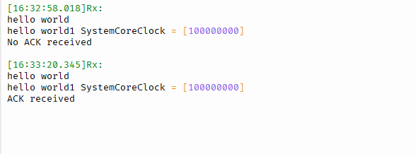