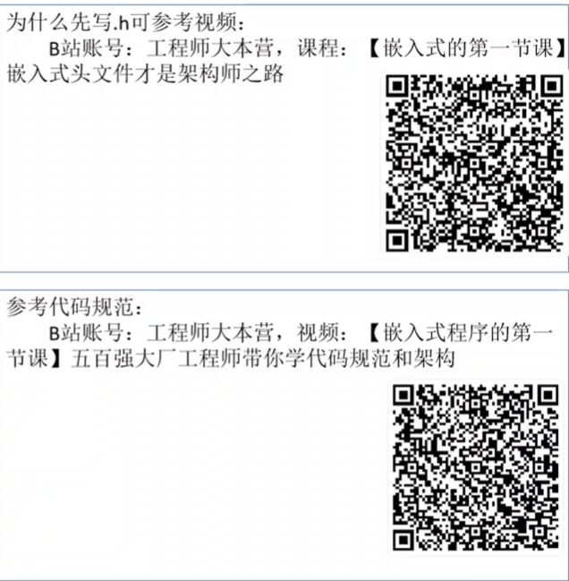
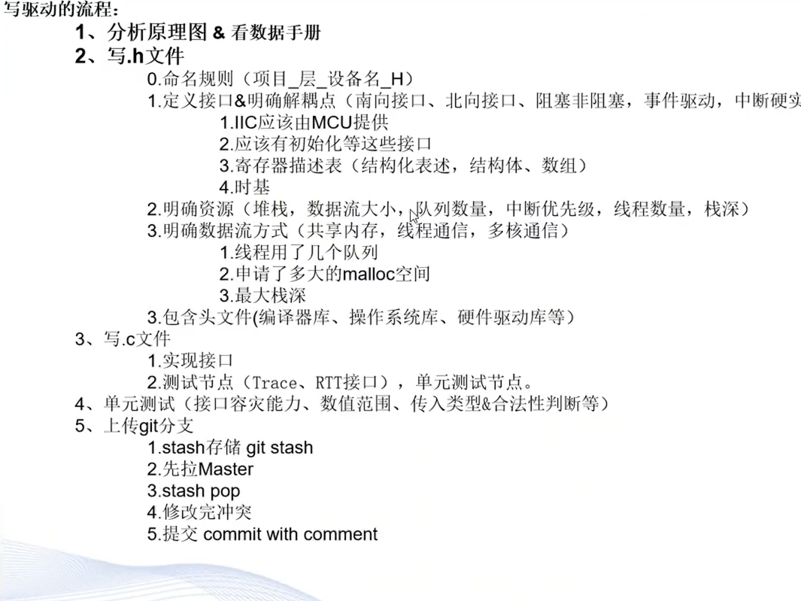
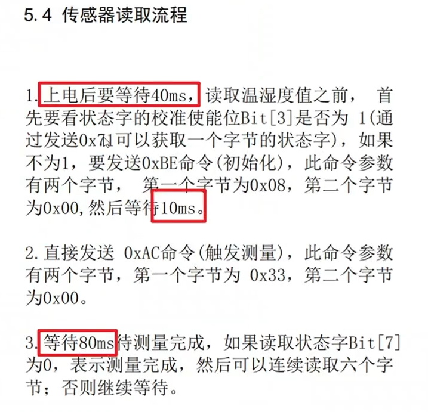
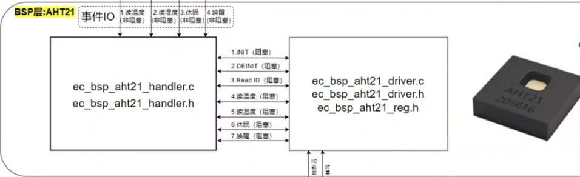
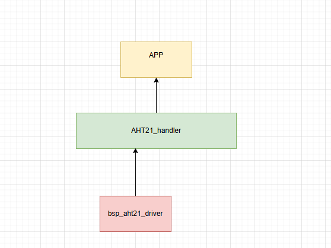

## IIC驱动程序

__学习目标__
1. 掌握0到1根据数据手册写IIC驱动程序的流程，掌握正确的方法论去解决问题
2. 掌握IIC协议的基本原理，能够分析IIC总线上的数据传输过程
3. 根据芯片手册的介绍明确IIC通信的各个细节点
4. 通过读取目标芯片的ID，确保硬件通路的正确性，设备的正常工作

### AHT21的数据手册

拿到了数据手册的时候，应该去拿到原厂的英文版数据手册，中文版的数据手册可能会有翻译错误，导致理解上的偏差。原厂的英文版数据手册通常会更详细和准确。

一般来说，数据手册的前面的部分会介绍芯片的电气信息，包括引脚定义、工作电压、工作温度范围等。这些信息对于硬件工程师非常重要。作为软件工程师更注重的是芯片的功能描述、寄存器定义、通信协议等部分。
首先关注接口定义和SCL和SDA的接口和频率等


控制顺序和读取顺序以及转换公式等

#### IIC通信协议

1. 起始信号(主机先拉低SDA，然后拉低SCL)


2. 停止信号(主机先拉低SCL，然后拉高SDA)


3. IIC的逻辑0和逻辑1的表达

> IIC总线上的数据传输是通过SDA线上的电平变化来表示的。逻辑0通常表示为SDA线被拉低，而逻辑1则表示为SDA线被拉高。主机通过控制SCL线的时钟信号来同步数据的传输。
>总结就是：
>SCL在高电平的时候，SDA线的电平是什么数据(高/低)就表示什么数据。SCL在低电平的时候，SDA线的电平变化不被认为是数据传输，而是被忽略的。


拉高的动作都是上拉电阻去做的
> 在经典的IIC设计电路当中，上拉电阻是必不可少的。上拉电阻的作用是确保当SDA线和SCL线没有被任何设备拉低时，它们能够保持在高电平状态。这是因为IIC总线是开漏(open-drain)设计的，设备只能将线拉低，而不能主动拉高。因此，上拉电阻提供了一个默认的高电平状态，确保总线在空闲时处于已知状态。


IIC的通信过程
1. 发送地址帧 这里的地址帧是7位地址加1位读写位，那么就是2的7次方，也就是128个地址空间最多挂载128个设备
2. 发送数据帧在一帧的ACK后，在后面读写位是W的时候，主机连续发送8位数据帧，设备每接收完8位数据帧后会发送一个ACK信号，表示已经成功接收了数据帧


### AHT21对IIC的要求


- NC引脚是没有连接的引脚，通常在设计电路时不需要连接任何东西，可以直接悬空。
- VDD引脚是电源引脚，通常需要连接到3.3V的电源。
- GND引脚是地线引脚，需要连接到系统的地。

什么是存在最小的SCL频率？
> 最小的SCL频率是指在IIC通信中，SCL线的时钟频率不能低于某个特定值，否则可能会导致通信不稳定或数据丢失。对于AHT21来说，最小的SCL频率是10kHz，这意味着在进行IIC通信时，SCL线的时钟频率必须至少为10kHz，以确保数据能够正确传输和接收。
> 也就是可以直接打断点进行debug


采样时间的确定：在SCL的上升沿采样数据，SCL的下降沿改变数据
> 不同的芯片，对于采样的时间有所不同，但是一般都是在SCL的上升沿采样数据，在SCL的下降沿改变数据。这是因为在IIC通信中，SCL线的时钟信号用于同步数据的传输，主机和从设备都需要在特定的时刻进行数据的采样和改变，以确保通信的正确性和稳定性。

- tsu(SDA)是指在IIC通信中，SDA线上的数据必须在SCL线的上升沿之前稳定，并且保持至少tsu(SDA)的时间，以确保从设备能够正确地采样数据。因为在这里的TTL电平是一个范围，一定要到接近真实值的时候去读取数据，才能保证数据的正确性。
- tho(SDA)是指在IIC通信中，SDA线上的数据必须在SCL线的下降沿之后保持稳定，并且保持至少tho(SDA)的时间，以确保从设备能够正确地采样数据


输入和输出的特性
> 确定了传感器的TTL电平的范围，在这里确定了输入和输出的电压范围，确保在设计电路和编写驱动程序时能够正确地处理这些电压水平，以避免通信错误和设备损坏。


启动传感器


### AHT21对IIC的控制顺序    

##### 确保设备硬件通路正常的方法1

在这里直接发送一个cmd(x38)

##### 确保设备硬件通路正常的方法2


发送完0XAC后再发送0x71 后，读取到0x18，表示采集成功

### 软件实验环境搭建

#### 裸机环境，带串口通信

1. 配置GPIO


配置好SCL和SDA的GPIO口，配置成开漏输出模式，并且配置好上拉电阻(看芯片手册的要求)

2. 配置外部晶振


3. project manager配置


1. 配置串口和gpio
``` cpp
/* USER CODE BEGIN 0 */
#ifdef __GNUC__
  #define PUTCHAR_PROTOTYPE int __io_putchar(int ch)
#else
  #define PUTCHAR_PROTOTYPE int fputc(int ch, FILE *f)
#endif

PUTCHAR_PROTOTYPE
{
  HAL_UART_Transmit(&huart1, (uint8_t *)&ch, 1, 0xFFFF);
  return ch;
}
/* USER CODE END 0 */
```
然后再main函数中包含stdio这个标准库
之后进行一个printf的测试，看看串口通信是否正常
``` cpp

#include <stdio.h> 
#ifdef __GNUC__
     #define PUTCHAR_PROTOTYPE int _io_putchar(int ch)
 #else
     #define PUTCHAR_PROTOTYPE int fputc(int ch, FILE *f)
 #endif /* __GNUC__*/
 
 /******************************************************************
     *@brief  Retargets the C library printf  function to the USART.
     *@param  None
     *@retval None
 ******************************************************************/
 PUTCHAR_PROTOTYPE
 {
     HAL_UART_Transmit(&huart1, (uint8_t *)&ch,1,0xFFFF);
     return ch;
 }
 ```
 确定GPIO的配置

 ```cpp

HAL_GPIO_WritePin(GPIOB, SDA_Pin|SCL_Pin, GPIO_PIN_SET); // SCL拉高
HAL_GPIO_WritePin(GPIOB, SDA_Pin|SCL_Pin, GPIO_PIN_SET); // SDA拉高
``` 
__明确延时(DWT)__

```cpp
// 先包含头文件
#include "core_cm4.h"

void SystemClock_Config(void);
/* USER CODE BEGIN PFP */
/**
 * @brief 初始化 DWT 计数器，用于精确延时（微秒级）
 * 注意：使用此函数前需确保系统时钟已配置且 DWT 可用。
 */
void dwt_delay_init(void)
{
    CoreDebug->DEMCR |= CoreDebug_DEMCR_TRCENA_Msk;     // 使能 DWT（调试跟踪）
    DWT->CYCCNT = 0;                                    // 清零循环计数器
    DWT->CTRL |= DWT_CTRL_CYCCNTENA_Msk;                // 使能 CYCCNT 计数器
}

/**
 * @brief 微秒级延时
 * @param us 延时时间（微秒）
 * 通过读取 DWT->CYCCNT 计数器实现精确延时，要求 SystemCoreClock 为系统时钟频率（Hz）
 */
void delay_us(uint32_t us)
{
    uint32_t start = DWT->CYCCNT;
    uint32_t ticks = us * (SystemCoreClock / 1000000U);

    while ((DWT->CYCCNT - start) < ticks) { }
}

/**
 * @brief 毫秒级延时
 * @param ms 延时时间（毫秒）
 */
void delay_ms(uint32_t ms)
{
    while (ms--)
    {
        delay_us(1000);
    }
}
/* USER CODE END PFP */


int main(void)
{
    /* USER CODE BEGIN 1 */
    SystemClock_Config(); // 配置系统时钟
    dwt_delay_init(); // 初始化 DWT 计数器
    /* USER CODE END 1 */

    /* MCU Configuration--------------------------------------------------------*/

    /* Reset of all peripherals, Initializes the Flash interface and the Systick. */
    HAL_Init();

    /* USER CODE BEGIN Init */

    /* USER CODE END Init */

    /* Configure the system clock */
    while(1)
    {

    }
}
```

移植IIC库
```cpp
#include "iic_hal.h"
#include "delay.h"

/**
  * @brief SDA������ģʽ����
  * @param None
  * @retval None
  */
void SDA_Input_Mode(iic_bus_t *bus)
{
    GPIO_InitTypeDef GPIO_InitStructure = {0};

    GPIO_InitStructure.Pin = bus->IIC_SDA_PIN;
    GPIO_InitStructure.Mode = GPIO_MODE_INPUT;
    GPIO_InitStructure.Pull = GPIO_PULLUP;
    GPIO_InitStructure.Speed = GPIO_SPEED_FREQ_HIGH;
    HAL_GPIO_Init(bus->IIC_SDA_PORT, &GPIO_InitStructure);
}

/**
  * @brief SDA�����ģʽ����
  * @param None
  * @retval None
  */
void SDA_Output_Mode(iic_bus_t *bus)
{
    GPIO_InitTypeDef GPIO_InitStructure = {0};

    GPIO_InitStructure.Pin = bus->IIC_SDA_PIN;
    GPIO_InitStructure.Mode = GPIO_MODE_OUTPUT_OD;
    GPIO_InitStructure.Pull = GPIO_NOPULL;
    GPIO_InitStructure.Speed = GPIO_SPEED_FREQ_HIGH;
    HAL_GPIO_Init(bus->IIC_SDA_PORT, &GPIO_InitStructure);
}

/**
  * @brief SDA�����һ��λ
  * @param val ���������
  * @retval None
  */
void SDA_Output(iic_bus_t *bus, uint16_t val)
{
    if ( val )
    {
        bus->IIC_SDA_PORT->BSRR |= bus->IIC_SDA_PIN;
    }
    else
    {
        bus->IIC_SDA_PORT->BSRR = (uint32_t)bus->IIC_SDA_PIN << 16U;
    }
}

/**
  * @brief SCL�����һ��λ
  * @param val ���������
  * @retval None
  */
void SCL_Output(iic_bus_t *bus, uint16_t val)
{
    if ( val )
    {
        bus->IIC_SCL_PORT->BSRR |= bus->IIC_SCL_PIN;
    }
    else
    {
         bus->IIC_SCL_PORT->BSRR = (uint32_t)bus->IIC_SCL_PIN << 16U;
    }
}

/**
  * @brief SDA����һλ
  * @param None
  * @retval GPIO����һλ
  */
uint8_t SDA_Input(iic_bus_t *bus)
{
	if(HAL_GPIO_ReadPin(bus->IIC_SDA_PORT, bus->IIC_SDA_PIN) == GPIO_PIN_SET){
		return 1;
	}else{
		return 0;
	}
}

/**
  * @brief IIC��ʼ�ź�
  * @param None
  * @retval None
  */
void IICStart(iic_bus_t *bus)
{
    SDA_Output(bus,1);
    //delay1(DELAY_TIME);
		delay_us(2);
    SCL_Output(bus,1);
		delay_us(1);
    SDA_Output(bus,0);
		delay_us(1);
    SCL_Output(bus,0);
		delay_us(1);
}

/**
  * @brief IIC�����ź�
  * @param None
  * @retval None
  */
void IICStop(iic_bus_t *bus)
{
    SCL_Output(bus,0);
		delay_us(2);
    SDA_Output(bus,0);
		delay_us(1);
    SCL_Output(bus,1);
		delay_us(1);
    SDA_Output(bus,1);
		delay_us(1);

}

/**
  * @brief IIC�ȴ�ȷ���ź�
  * @param None
  * @retval None
  */
unsigned char IICWaitAck(iic_bus_t *bus)
{
    unsigned short cErrTime = 5;
    SDA_Input_Mode(bus);
    SCL_Output(bus,1);
    while(SDA_Input(bus))
    {
        cErrTime--;
				delay_us(1);
        if (0 == cErrTime)
        {
            SDA_Output_Mode(bus);
            IICStop(bus);
            return ERROR;
        }
    }
    SDA_Output_Mode(bus);
    SCL_Output(bus,0);
		delay_us(2);
    return SUCCESS;
}

/**
  * @brief IIC����ȷ���ź�
  * @param None
  * @retval None
  */
void IICSendAck(iic_bus_t *bus)
{
    SDA_Output(bus,0);
		delay_us(1);
    SCL_Output(bus,1);
		delay_us(1);
    SCL_Output(bus,0);
		delay_us(1);
	
}

/**
  * @brief IIC���ͷ�ȷ���ź�
  * @param None
  * @retval None
  */
void IICSendNotAck(iic_bus_t *bus)
{
    SDA_Output(bus,1);
		delay_us(1);
    SCL_Output(bus,1);
		delay_us(1);
    SCL_Output(bus,0);
		delay_us(2);

}

/**
  * @brief IIC����һ���ֽ�
  * @param cSendByte ��Ҫ���͵��ֽ�
  * @retval None
  */
void IICSendByte(iic_bus_t *bus,unsigned char cSendByte)
{
    unsigned char  i = 8;
    while (i--)
    {
        SCL_Output(bus,0);
        delay_us(2);
        SDA_Output(bus, cSendByte & 0x80);
				delay_us(1);
        cSendByte += cSendByte;
				delay_us(1);
        SCL_Output(bus,1);
				delay_us(1);
    }
    SCL_Output(bus,0);
		delay_us(2);
}

/**
  * @brief IIC����һ���ֽ�
  * @param None
  * @retval ���յ����ֽ�
  */
unsigned char IICReceiveByte(iic_bus_t *bus)
{
    unsigned char i = 8;
    unsigned char cR_Byte = 0;
    SDA_Input_Mode(bus);
    while (i--)
    {
        cR_Byte += cR_Byte;
        SCL_Output(bus,0);
				delay_us(2);
        SCL_Output(bus,1);
				delay_us(1);
        cR_Byte |=  SDA_Input(bus);
    }
    SCL_Output(bus,0);
    SDA_Output_Mode(bus);
    return cR_Byte;
}

uint8_t IIC_Write_One_Byte(iic_bus_t *bus, uint8_t daddr,uint8_t reg,uint8_t data)
{				   	  	    																 
  IICStart(bus);  
	
	IICSendByte(bus,daddr<<1);	    
	if(IICWaitAck(bus))	//�ȴ�Ӧ��
	{
		IICStop(bus);		 
		return 1;		
	}
	IICSendByte(bus,reg);
	IICWaitAck(bus);	   	 										  		   
	IICSendByte(bus,data);     						   
	IICWaitAck(bus);  		    	   
  IICStop(bus);
	delay_us(1);
	return 0;
}

uint8_t IIC_Write_Multi_Byte(iic_bus_t *bus, uint8_t daddr,uint8_t reg,uint8_t length,uint8_t buff[])
{			
	unsigned char i;	
  IICStart(bus);  
	
	IICSendByte(bus,daddr<<1);	    
	if(IICWaitAck(bus))
	{
		IICStop(bus);
		return 1;
	}
	IICSendByte(bus,reg);
	IICWaitAck(bus);	
	for(i=0;i<length;i++)
	{
		IICSendByte(bus,buff[i]);     						   
		IICWaitAck(bus); 
	}		    	   
  IICStop(bus);
	delay_us(1);
	return 0;
} 

unsigned char IIC_Read_One_Byte(iic_bus_t *bus, uint8_t daddr,uint8_t reg)
{
	unsigned char dat;
	IICStart(bus);
	IICSendByte(bus,daddr<<1);
	IICWaitAck(bus);
	IICSendByte(bus,reg);
	IICWaitAck(bus);
	
	IICStart(bus);
	IICSendByte(bus,(daddr<<1)+1);
	IICWaitAck(bus);
	dat = IICReceiveByte(bus);
	IICSendNotAck(bus);
	IICStop(bus);
	return dat;
}


uint8_t IIC_Read_Multi_Byte(iic_bus_t *bus, uint8_t daddr, uint8_t reg, uint8_t length, uint8_t buff[])
{
	unsigned char i;
	IICStart(bus);
	IICSendByte(bus,daddr<<1);
	if(IICWaitAck(bus))
	{
		IICStop(bus);		 
		return 1;		
	}
	IICSendByte(bus,reg);
	IICWaitAck(bus);
	
	IICStart(bus);
	IICSendByte(bus,(daddr<<1)+1);
	IICWaitAck(bus);
	for(i=0;i<length;i++)
	{
		buff[i] = IICReceiveByte(bus);
		if(i<length-1)
		{IICSendAck(bus);}
	}
	IICSendNotAck(bus);
	IICStop(bus);
	return 0;
}


//
void IICInit(iic_bus_t *bus)
{
    GPIO_InitTypeDef GPIO_InitStructure = {0};

		//bus->CLK_ENABLE();
		
    GPIO_InitStructure.Pin = bus->IIC_SDA_PIN ;
    GPIO_InitStructure.Mode = GPIO_MODE_OUTPUT_PP;
    GPIO_InitStructure.Pull = GPIO_PULLUP;
    GPIO_InitStructure.Speed = GPIO_SPEED_FREQ_HIGH;
    HAL_GPIO_Init(bus->IIC_SDA_PORT, &GPIO_InitStructure);
		
		GPIO_InitStructure.Pin = bus->IIC_SCL_PIN ;
    HAL_GPIO_Init(bus->IIC_SCL_PORT, &GPIO_InitStructure);
}
```

 
``` cpp
#ifndef __IIC_HAL_H
#define __IIC_HAL_H

#include "stm32f4xx_hal.h"

typedef struct
{
	GPIO_TypeDef * IIC_SDA_PORT;
	GPIO_TypeDef * IIC_SCL_PORT;
	uint16_t IIC_SDA_PIN;
	uint16_t IIC_SCL_PIN;
	//void (*CLK_ENABLE)(void);
}iic_bus_t;

void IICStart(iic_bus_t *bus);
void IICStop(iic_bus_t *bus);
unsigned char IICWaitAck(iic_bus_t *bus);
void IICSendAck(iic_bus_t *bus);
void IICSendNotAck(iic_bus_t *bus);
void IICSendByte(iic_bus_t *bus, unsigned char cSendByte);
unsigned char IICReceiveByte(iic_bus_t *bus);
void IICInit(iic_bus_t *bus);

uint8_t IIC_Write_One_Byte(iic_bus_t *bus, uint8_t daddr,uint8_t reg,uint8_t data);
uint8_t IIC_Write_Multi_Byte(iic_bus_t *bus, uint8_t daddr,uint8_t reg,uint8_t length,uint8_t buff[]);
unsigned char IIC_Read_One_Byte(iic_bus_t *bus, uint8_t daddr,uint8_t reg);
uint8_t IIC_Read_Multi_Byte(iic_bus_t *bus, uint8_t daddr, uint8_t reg, uint8_t length, uint8_t buff[]);
#endif
``` 


#### 测试方法1


第一次先拔掉AHT21，后面再次插上AHT21，看看SDA线的变化，确认设备是否正确响应了主机的地址帧。
先发0x38，看看SDA线是否被拉低，如果被拉低了，说明设备已经正确地响应了主机的地址帧，通信通路是正常的。


思考： 如果在有RTOS的情况下，需要写delay函数应该怎么办
> 在有RTOS的情况下，编写delay函数时需要考虑到RTOS的调度机制和任务优先级。通常情况下，可以使用RTOS提供的延时函数，如vTaskDelay()或osDelay()，来实现任务的延时。这些函数会将当前任务挂起一段时间，让其他任务有机会执行，从而实现多任务之间的协作和资源共享。
> 需要注意的是，在使用RTOS的延时函数时，应该避免在中断服务程序（ISR）中调用这些函数，因为它们可能会导致系统不稳定或死锁。在ISR中，应该使用RTOS提供的专门用于ISR的延时函数，如vTaskDelayFromISR()或osDelayFromISR()，来实现延时。
``` cpp

taskENTER_CRITICAL();
// 在这里执行需要保护的代码，例如访问共享资源或修改全局变量
vTaskDelay(100); // 延时100毫秒
taskEXIT_CRITICAL();

```

### HAL层的文件书写

#### 为什么要用框架
- 开发需要
- 个人技能提升
- 写出更好的代码 
- 产品业务的快速更改

可以看看LED_桥接模式

#### 怎么写驱动框架

技术基础
1. 指针(函数指针，结构体指针，指针数组等)
2. 结构体(结构体的定义，结构体的初始化，结构体指针等)
3. 联合体
4. 枚举
5. 动态内存分配
6. 预处理器指令
7. 链表
8. 线程间通信


写驱动的流程
1、分析原理图&看数据手册
2、写.h文件
  - 命名规则
  - 定义接口&明确解耦
  - 明确资源
  - 明确数据流方式
  - 包含头文件
3、写.c文件
  - 实现接口
  - 测试节点，单元测试
4、写测试代码
  - 确定测试方法
  - 编写测试代码
  - 调试测试代码，确保功能正确
5、上传git分支





##### 分析原理图&看数据手册


分析文件，定义文件的数量，每个文件的功能，文件之间的关系，文件的命名规则等
这取决于北向接口和南向接口的定义，资源的定义，数据流方式的定义等


因为在这里的IIC驱动和AHT21的驱动都需要进行阻塞的，在rtos里面都可以传入一个
`suspend`参数，来决定是阻塞的还是非阻塞的，这样就可以满足不同场景的需求了

在BSP的hanler里面通过事件IO驱动就实现非阻塞的逻辑，让app的代码不会被阻塞，通过事件II的回调函数来实现非阻塞的逻辑。

#### 编写.h文件

1. 写任何一个代码都应该先写注释
2. 明确`function 的返回值`
``` cpp
typedef enum
{
    AHT21_OK = 0,           /* AHT21 operation successful */
    AHT21_ERROR,            /* AHT21 operation failed     */
    AHT21_ERRORTIMEOUT,     /* AHT21 operation timed out  */
    AHT21_ERRORRSOURCE,     /* AHT21 resource error       */
    AHT21_ERRORPARAMETER,   /* AHT21 parameter error      */
    AHT21_ERRORNOMEMORY,    /* AHT21 memory error         */    
    AHT21_ERRORISR,         /* AHT21 ISR   error          */
    AHT21_RESERVED,         /* AHT21 reserved error code  */
}aht21_status_t;
```
  

3.明确所有的function接口

```cpp
/******************************************************************************
 * @file bsp_aht21_driver.h
 * @author Lumos (1456925916@qq.com)
 * @brief 创建AHT21 bsp层驱动文件 b
 * @version 0.1
 * @date 2026-04-02
 * @par dependencies
 * - bsp_aht21_reg.h
 * - stdio.h
 * - sddint .h
 * @note 1 tab == 4 spaces
 * @copyright Copyright (c) 2026
 *
 ******************************************************************************/

#ifndef __BSP_AHT21_DRIVER_H__
#define __BSP_AHT21_DRIVER_H__
//********************************* Include *********************************//
#include "bsp_aht21_reg.h"

#include <stdint.h>
#include <stdio.h>

//********************************* Include *********************************//

//********************************* Defines *********************************//
#define OS_SUPPORTING
#define HRADWARE_IIC
#define SOFTWARE_IIC

/*        return function AHT21 status enumeration        */
typedef enum
{
    AHT21_OK = 0,         /* AHT21 operation successful */
    AHT21_ERROR,          /* AHT21 operation failed     */
    AHT21_ERRORTIMEOUT,   /* AHT21 operation timed out  */
    AHT21_ERRORRSOURCE,   /* AHT21 resource error       */
    AHT21_ERRORPARAMETER, /* AHT21 parameter error      */
    AHT21_ERRORNOMEMORY,  /* AHT21 memory error         */
    AHT21_ERRORISR,       /* AHT21 ISR   error          */
    AHT21_RESERVED,       /* AHT21 reserved error code  */
} aht21_status_t;

//********************************* Defines *********************************//

//********************************* Declaring *******************************//

/*   From Core Layer : IIC protocol  */
#ifndef HARDWARE_IIC                       /* True ：software IIC */
typedef struct
{
    aht21_status_t (*pf_iic_init)(void);   /* IIC interface init     */
    aht21_status_t (*pf_iic_deinit)(void); /* IIC interface deinit   */
    aht21_status_t (*pf_iic_start)(void);  /* IIC interface read     */
    aht21_status_t (*pf_iic_stop)(void);   /* IIC interface write    */
    aht21_status_t (*pf_iic_send_ack)(void);
    /* IIC interface send ack      */
    aht21_status_t (*pf_iic_send_no_ack)(void);
    /* IIC interface not ack     */
    aht21_status_t (*pf_iic_send_byte)(uint8_t byte);
    /* IIC interface send byte     */
    aht21_status_t (*pf_iic_receive_byte)(uint8_t *byte);
    /* IIC interface receive byte  */

    aht21_status_t (*pf_critical_enter)(void); /* Enter critical section  */
    aht21_status_t (*pf_critical_exit)(void);  /* Exit critical section   */

} iic_driver_interface_t;

#endif                                   /*end of HARDWARE_IIC */

#ifdef HARDWARE_IIC                      /* True ：hardware IIC */
typedef struct
{
    uint8_t (*pf_iic_init)(void);        /* IIC interface init     */
    uint8_t (*pf_iic_deinit)(void);      /* IIC interface deinit   */
    uint8_t (*pf_iic_send_ack)(void);    /* IIC interface read     */
    uint8_t (*pf_iic_send_no_ack)(void); /* IIC interface write    */
    uint8_t (*pf_iic_send_byte)(uint8_t byte);
    /* IIC interface send byte     */
    uint8_t (*pf_iic_receive_byte)(uint8_t *byte);
    /* IIC interface receive byte  */
}
#endif /*end of HARDWARE_IIC */

/* From Core Layer : TimeBase  */

typedef struct
{
    uint32_t (*pf_get_tick_count)(void); /* Get tick count */
} timebase_interface_t;

/* From Core Layer : os_layer  */

#ifdef OS_SUPPORTING
typedef struct
{
    aht21_status_t (*pf_os_delay_ms)        (uint32_t ms); /* OS delay ms */
    aht21_status_t (*pf_os_delay_us)        (uint32_t us); /* OS delay us */
} yield_interface_t;
#endif                                             /*end of OS_SUPPORTING */

typedef struct
{
    iic_driver_interface_t *piic_driver_instance; /* IIC driver interface*/
    timebase_interface_t   *ptimebase_instance;   /* Timebase interface */
#ifdef OS_SUPPORTING
    yield_interface_t *pyield_instance;           /* OS layer interface */
#endif                                            /*end of OS_SUPPORTING */

    uint8_t (*pfinst)(void *const                   pah21_instance,
                      timebase_interface_t *const   ptimebase_instance,
                      iic_driver_interface_t *const piic_driver_instance,
#ifdef OS_SUPPORTING
                      yield_interface_t *const pyield_instance
#endif /*end of OS_SUPPORTING */
    ); /* AHT21 instance init function pointer */

    uint8_t (*pfinit)                   (void *const pah21_init); 
                                        /* ah21 init function pointer */
    uint8_t (*pfdeinit)                 (void *const pah21_deinit); 
                                        /* ah21 deinit function pointer */      
    uint8_t (*pfread_id)                (void *const pah21_read,
                                         float      *temperature,
                                         float      *humidity);
    uint8_t (*pfread_temperature)       (void *const pah21_read,
                                         float *temperature);              
    /* ah21 read function pointer */
    uint8_t (*pfread_humidity)          (void *const pah21_read, 
                                         float *humidity);
    /* ah21 read humidity function pointer */
    uint8_t (*pfsleep)                  (void *const pah21_sleep);  
                                        /* ah21 sleep function pointer */
    uint8_t (*pfwakeup)                 (void *const pah21_wakeup); 
                                        /* ah21 wakeup function pointer */
} bsp_aht21_driver_t;


/* AHT21_hal_driver 构造函数*/
uint8_t (*pfinst)(void *const                   pah21_instance,
                      timebase_interface_t *const   ptimebase_instance,
                      iic_driver_interface_t *const piic_driver_instance,
#ifdef OS_SUPPORTING
                      yield_interface_t *const pyield_instance
#endif /*end of OS_SUPPORTING */
                 );/* AHT21 instance init function pointer */
//********************************* Declaring *******************************//


#endif /*End of __BSP_AHT21_DRIVER_H__ */
```


##### Q&A
1. 为什么bsp和app的栈要隔离开
> 
> bsp线程就是要短小精悍，如果bsp里面的内容过多，或者说bsp里面的函数调用了很多其他的函数，那么就会导致bsp线程的栈空间被占用过多，这样就会导致app线程的栈空间不足，最终可能会导致系统崩溃或者死锁等问题。
>


#### 编写.c文件
直接根据.h文件的接口来实现.c文件的内容，按照接口的定义来实现函数的功能，确保每个函数都能够正确地完成它的任务，并且在实现过程中要注意代码的可读性和可维护性，尽量写出清晰、简洁、易懂的代码。


``` cpp

/******************************************************************************
 * @file bsp_aht21_driver.c
 * @author Lumos (1456925916@qq.com)
 * @brief   AHT21 bsp层驱动文件 by Lumos
 * @version 0.1
 * @date 2026-04-02
 * 
 *  processing flow :
 * 1. 实例化aht21驱动结构体对象
 * 2. 挂载IIC驱动接口函数指针
 * 3. 挂载时间基准接口函数指针
 * 4. 挂载OS接口函数指针（如果需要）
 * 5. 为外部提供function interface
 * @copyright Copyright (c) 2026
 * 
 * @note 1 tab == 4 spaces
******************************************************************************/

//********************************* Include *********************************//
#include "bsp_aht21_driver.h"


//********************************* Include *********************************//


//********************************* Defines *********************************//
#define DEBUG 

#define AHT21_MEASURE_WATING_TIME 800   /* ms */
#define AHT21_NOT_INTED           0     /* AHT21 not initialized */
#define AHT21_INTED               1     /* AHT21 initialized   */
#define AHT21_ID                  0x18  /* AHT21 device ID  */


#define CRC8_POLYNOMIAL            0x31  /* CRC polynomial for AHT21 */
#define CRC8_INITAL_VALUE          0xFF  /* CRC initial value for AHT21 */

#define IS_INITED                  (AHT21_INTED == g_inited) 
                                    /* Check if AHT21 is initialized */
//********************************* Defines *********************************//


//********************************* Variables *******************************//

static int8_t g_inited = AHT21_NOT_INTED; /* AHT21 initialization status flag*/
static uint8_t g_device_id = 0;           /* AHT21 device ID storage variable*/

//********************************* Variables *******************************//

#pragma diag_suppress=177

/******************************************************************************
 * @brief  function for calculating CRC8 for AHT21 data integrity check
 * steps：
 * 1. Initialize CRC with initial value (0xFF).
 * 2. For each byte in the input data:
 *   a. XOR the byte with the current CRC value.   
 *   b. For each bit in the byte (8 bits):
 * 
 * @param p_data ： Poniter to the input data  
 * @param length : Length of the input data in bytes
 * @return uint8_t 
******************************************************************************/
static uint8_t CheckCrc8(const uint8_t *p_data , const uint8_t length)
{
    uint8_t crc = CRC8_INITAL_VALUE; /* Initialize CRC with initial value */

    for (uint8_t i = 0; i < length; i++)
    {
        crc ^= p_data[i]; /* XOR byte into CRC */

        for (uint8_t j = 0; j < 8; j++)
        {
            if (crc & 0x80) /* If the MSB is set */
            {
                crc = (crc << 1) ^ CRC8_POLYNOMIAL; /* Shift left and
                                                     XOR with polynomial */
            }
            else
            {
                crc <<= 1; /* Just shift left */
            }
        }
    }

    return crc; /* Return the calculated CRC value */   
}


/******************************************************************************
 * @brief  chek AHT21 device ID to verify communication and sensor presence
 * 
 * @param paht21_instance 
 * @note : this function only staitic for internal user checkout this sensor
 * @return aht21_status_t 
******************************************************************************/
static aht21_status_t __read_id(bsp_aht21_driver_t *const paht21_instance)
{
// 1.check if the AHT21 instance is initialized && device ID is valid
    if(NULL == paht21_instance)
    {
        return AHT21_ERRORPARAMETER; /* Invalid parameter */
    }
    if (!IS_INITED)
    {
        return AHT21_ERRORPARAMETER; /* AHT21 not initialized */
    }
    uint8_t data = 0;
#ifdef SOFTWARE_IIC
    paht21_instance->piic_driver_instance->pf_critical_enter(); /* Enter c
                                ritical section to ensure thread safety */
#endif /*end of SOFTWARE_IIC */

    /*send commd to read id */
    paht21_instance->piic_driver_instance->pf_iic_start(); 
    paht21_instance->piic_driver_instance->\
                              pf_iic_send_byte((AHT21_ID << 1) | 0);
    
    // wait for IIC ack
    if (AHT21_OK == \
        paht21_instance->piic_driver_instance->pf_iic_wait_ack)
    {
        // receive device ID byte
        paht21_instance->piic_driver_instance->\
                              pf_iic_receive_byte(&data);
        g_device_id = data; /* Store the received device ID */
    }
    // send stop condition
    paht21_instance->piic_driver_instance->pf_iic_stop();

#ifdef SOFTWARE_IIC
    paht21_instance->piic_driver_instance->pf_critical_exit(); /* Exit 
                                                    critical section */
#endif /*end of SOFTWARE_IIC */

    //chek if the received device ID is correct
    if (AHT21_ID == (g_device_id & AHT21_ID)) /* Masking to check 
                                            only relevant bits */
    {
        return AHT21_OK; /* Device ID matches, return success */
    }
    else
    {   
        g_device_id = 0; /* Clear the stored device ID */
        return AHT21_ERROR; /* Device ID mismatch */
    }
}

/******************************************************************************
 * @brief Read the device ID from the AHT21 sensor
 * 
 * @param paht21_instance 
 * @return aht21_status_t 
******************************************************************************/
static aht21_status_t aht21_read_id(bsp_aht21_driver_t *const paht21_instance)
{
    if(NULL == paht21_instance)
    {
        return AHT21_ERRORPARAMETER; /* Invalid parameter */
    }
    if (!IS_INITED)
    {
        return AHT21_ERRORPARAMETER; /* AHT21 not initialized */
    }
    if (AHT21_ID == g_device_id)
    {
        return AHT21_OK; /* Device ID is valid */
    }
    else
    {
        return AHT21_ERROR; /* Invalid device ID */
    }
}

/******************************************************************************
 * @brief aht21 initialization function to set up the sensor and verify
 *        communication
 * 
 * @param paht21_instance 
 * @return aht21_status_t 
******************************************************************************/
static aht21_status_t aht21_init(bsp_aht21_driver_t *const paht21_instance)
{   
    aht21_status_t status = AHT21_OK; /* Status variable for IIC operations */
    if(NULL == paht21_instance)
    {
        return AHT21_ERRORPARAMETER; /* Invalid parameter */
    }
    if (IS_INITED)
    {
        return AHT21_ERRORPARAMETER; /* AHT21 already initialized */
    }
   
    // Initialize the IIC interface
#ifdef SOFTWARE_IIC
    paht21_instance->piic_driver_instance->pf_critical_enter(); 
            /* Enter critical section to ensure thread safety */
#endif /*end of SOFTWARE_IIC */
    status = paht21_instance->piic_driver_instance->pf_iic_init();
    if (AHT21_OK != status)
    {
        return status; /* IIC initialization failed */
    }

    // Read and verify the device ID
    status = __read_id(paht21_instance);
    if (AHT21_OK != status)
    {
        return status; /* Device ID verification failed */
    }

    g_inited = AHT21_INTED; /* Set initialization flag */
    return AHT21_OK; /* Initialization successful */
}

/******************************************************************************
 * @brief deint aht21 sensor to release resources and reset state
 * 
 * @param paht21_instance 
 * @return aht21_status_t 
******************************************************************************/
static aht21_status_t aht21_deinit(bsp_aht21_driver_t *const paht21_instance)
{
    if(NULL == paht21_instance)
    {
        return AHT21_ERRORPARAMETER; /* Invalid parameter */
    }
    if (!IS_INITED)
    {
        return AHT21_ERRORPARAMETER; /* AHT21 not initialized */
    }
    g_inited = AHT21_NOT_INTED; /* Clear initialization flag */
    g_device_id = 0; /* Clear stored device ID */
    return AHT21_OK; /* Deinitialization successful */
}


/******************************************************************************
 * @brief Read the status of the AHT21 sensor
 * 
 * @param paht21_instance 
 * @return uint8_t 
******************************************************************************/
static uint8_t aht21_read_status(bsp_aht21_driver_t * const paht21_instance)
{
    if(NULL == paht21_instance)
    {
        return AHT21_ERRORPARAMETER; /* Invalid parameter */
    }
    uint8_t data = 0; /* Variable to store received data byte */
#ifdef SOFTWARE_IIC
    paht21_instance->piic_driver_instance->pf_critical_enter(); /* Enter 
                                critical section to ensure thread safety */
#endif /*end of SOFTWARE_IIC */

    /*send commd to read status */
    paht21_instance->piic_driver_instance->pf_iic_start(); 
    paht21_instance->piic_driver_instance->\
                              pf_iic_send_byte((AHT21_ID << 1) | 0);
    
    // wait for IIC ack
    if (AHT21_OK == \
        paht21_instance->piic_driver_instance->pf_iic_wait_ack())
    {
        // receive status byte
        data = *(uint8_t *)paht21_instance->piic_driver_instance->\
                              pf_iic_receive_byte(&data);
    }
    // send stop condition
    paht21_instance->piic_driver_instance->pf_iic_stop();
#ifdef SOFTWARE_IIC
    paht21_instance->piic_driver_instance->pf_critical_exit(); /* Exit 
                                                    critical section */ 
#endif /*end of SOFTWARE_IIC */
    return data; /* Return the read status byte */
}


static aht21_status_t aht21_read_temperature_and_humidity(bsp_aht21_driver_t *const paht21_instance,
                                                      float *temperature, float *humidity)
{
    if (!IS_INITED)
    {
        return AHT21_ERRORPARAMETER; /* AHT21 not initialized */
    }
    aht21_status_t status = AHT21_OK; /* Status variable for IIC operations */
    uint8_t byte_1th = 0;
    uint8_t byte_2th = 0;
    uint8_t byte_3th = 0;
    uint8_t byte_4th = 0;
    uint8_t byte_5th = 0;
    uint8_t byte_6th = 0;
#ifdef SOFTWARE_IIC
    paht21_instance->piic_driver_instance->pf_critical_enter(); /* Enter 
                                critical section to ensure thread safety */
#endif /*end of SOFTWARE_IIC */
    
    // Read temperature and humidity data
    status = paht21_instance->piic_driver_instance->pf_iic_start();
    status = paht21_instance->piic_driver_instance->pf_iic_send_byte((AHT21_ID << 1) | 1);
    
    // wait for IIC ack
    if (AHT21_OK == paht21_instance->piic_driver_instance->pf_iic_wait_ack())
    {
        // Receive 6 bytes of data
        status = paht21_instance->piic_driver_instance->pf_iic_receive_byte(&byte_1th);
        status = paht21_instance->piic_driver_instance->pf_iic_receive_byte(&byte_2th);
        status = paht21_instance->piic_driver_instance->pf_iic_receive_byte(&byte_3th);
        status = paht21_instance->piic_driver_instance->pf_iic_receive_byte(&byte_4th);
        status = paht21_instance->piic_driver_instance->pf_iic_receive_byte(&byte_5th);
        status = paht21_instance->piic_driver_instance->pf_iic_receive_byte(&byte_6th);
    }
    else
    {
        status = AHT21_ERROR; /* IIC communication failed */
    }
    
    status = paht21_instance->piic_driver_instance->pf_iic_stop();
#ifdef SOFTWARE_IIC
    paht21_instance->piic_driver_instance->pf_critical_exit();
#endif /*end of SOFTWARE_IIC */
    
    return status;
}
```

### Handler的编写

#### handler的作用
1. 向上彻底屏蔽底层的细节
> 中间隔开一层，能够帮助操作系统进行一个更好的调度，能够让app的代码更加的清晰，app层的代码不需要关心底层的细节了，只需要调用handler提供的接口就可以了，这样就能够让app层的代码更加的清晰了。
2. 帮助hal驱动进行一个凑接,解耦
> handler层能够帮助hal驱动进行一个凑接，解耦了hal驱动和app层的代码，让hal驱动和app层的代码之间没有直接的联系了，这样就能够让hal驱动和app层的代码更加的独立了，也能够让hal驱动和app层的代码更加的清晰了。
3. 维护事件IO
> 通过传入自己的的event线程来实现非阻塞的事件IO
4. 防止硬件资源的冲突
> 在多线程的环境下，可能有资源竞态的情况下，handler层能够帮助我们进行一个资源的管理，防止硬件资源的冲突了，这样就能够让我们的系统更加的稳定
>
5. 内部数据流和局部业务的优化统筹
>比如可以给数据定义生命周期，10s的数据是有有效的，可以给上层app发送多个aht21的数据、也可以在handler层进行一个数据的缓存，减少对hal层的调用频率了，这样就能够让我们的系统更加的高效。

__分析__
- APP 一般的业务逻辑
  - 1. 读取温湿度
  - 2. 更新数据
  - 3. 扫描屏幕的触摸操作
- aht21 的逻辑
  - 1. 读取温湿度命令
  - 2. 等待80ms
  - 3. 读取温湿度数据
如果app直接不用handler，那么app的任务栈就非常的深，调用的时间也非常的长，app的业务逻辑一定是"蜻蜓点水",这样的代码非常的慢，会导致app的任务栈空间被占用过多，最终可能会导致系统崩溃或者死锁等问题。

> 类似于后面的换芯片的逻辑，handler的逻辑就不用变了，就直接改bsp，例如aht21变成层dht11了之后，handler暴露给上层app的逻辑就不用变了，直接去更改bsp的实现，iic改为one-wire去实现，直接的改bsp的读取温湿度和驱动。
>
#### handler的接口(低耦合)

1. COre给Handler传入接口的种类（输入）
    - 1. 时间基准接口
    包含aht21的hal_dirver头文件，然后将时间基准接口的函数指针传入到handler层的构造函数里面去
    - 2. IIC接口
    包含aht21的hal_dirver头文件，然后将IIC接口的函数指针传入到handler层的构造函数里面去
    - 3. OS接口
  -  包含aht21的中断屏蔽以及临界区的函数指针传入到handler层的构造函数里面去
2. OS给Handler传入事件IO的接口
  - 1. OS的操作系统的延时函数
  - 2. OS的队列发送函数

3. Handler给APP提供接口（输出）
  - 1. 事件IO来读取温度
  - 2. 线程运行函数，同时提供传入参数列表


#### 内部对应的函数的作用

1. temp_humi_handler_inst/deinst
构造自身的对象
解构自身的对象

2. temp_humi_handler_init/deinit
初始化handler层的资源，主要是aht21的bsp层的资源
确定挂载那个硬件设备

3. 内部Handler的作用
所有的资源都汇聚到一起管理(高内聚)，(mutex queue task_handler等)，维护事件IO，防止资源冲突，优化数据流和局部业务逻辑

#### 调用流程

1. 操作系统这一层
FreeRtos->temp_humi_handler_thread->inst->init->handler->app开始调用接口


2.handler 调用hal_driver 


