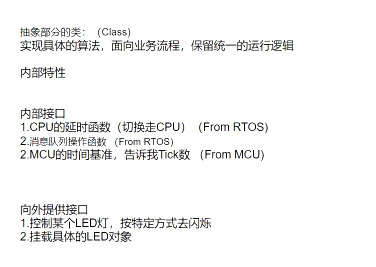
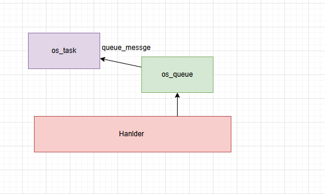
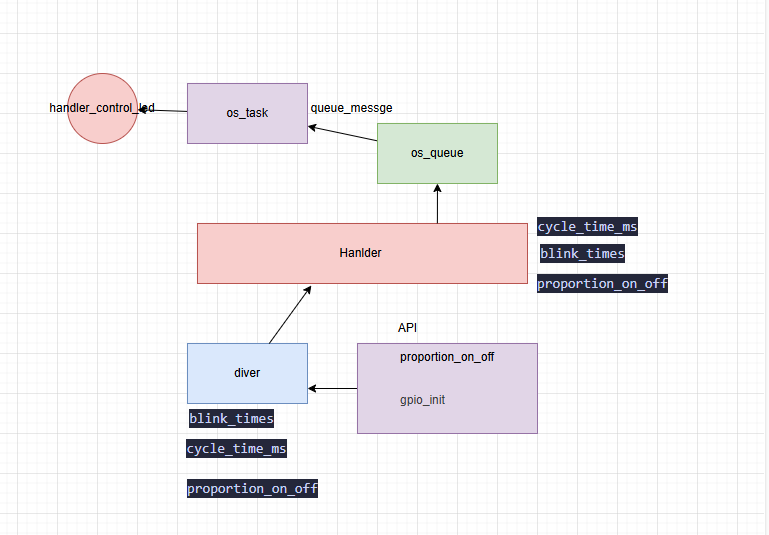
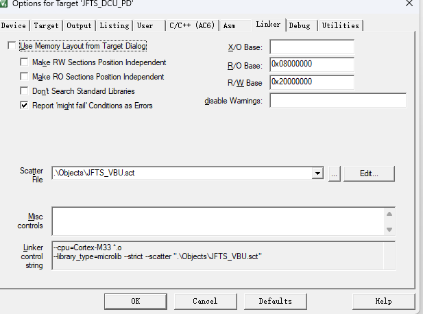
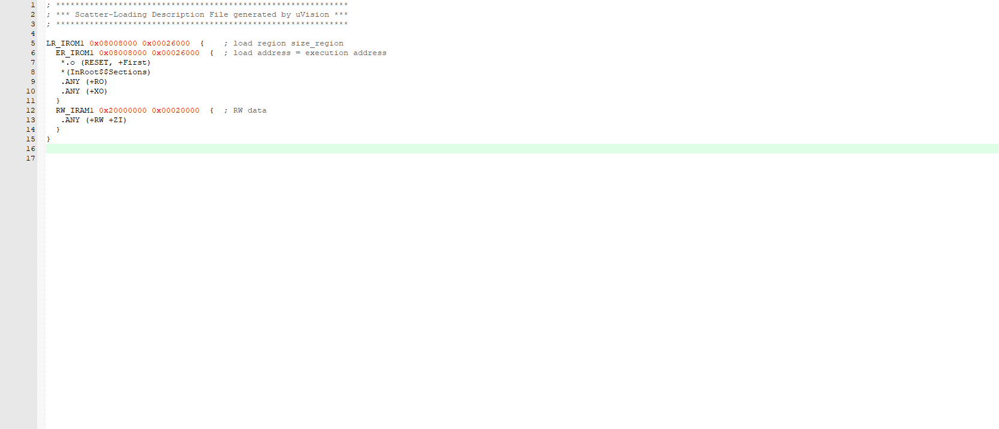

## LED驱动找对象


### 桥接模式

桥接模式： 把抽象部分和他的现实部分分离，使他们可以独立的变化。
- 可拓展性：可以方便的新添加LED类型和新的处理器逻辑
- 可维护性：改动一部分的代码不会影响到另一部分
- 灵活性：抽象和实现部分可以单独变化，不会影响

### 尝试理解面向对象

写面向对象的程序的时候，怎么找到对象

类：（class）

写类的时候，需要考虑哪些属性，哪些方法

例如： 分析LED驱动的特点
> 1. 它的闪烁周期
> 2. 它需要闪缩几次
> 3. 亮灭的时间占比 

对象：(Instance)


#### 基于面向对象的概念实装

bsp 层： 把硬件资源抽象出来，提供统一的接口
> 要想bsp层写的好，就需要再这里只对一个硬件资源进行抽象，不要把多个硬件资源都抽象出来。

使用typdef struct 这样就等价于了一个类型，这个类型就是一个对象。

> 类：
> 外部特性需求的接口
> 1. 它的闪缩周期
> 2. 它需要闪缩几次
> 3. 亮灭的时间占比
>
> 内部用到的接口
> Core：
> 1. GPIO的控制
> 2. MCU的时间基准
>RTOS：
> CPU的延时函数(切换走CPU)
>
> 向外提供接口
> 1. 控制某个LED，按特定方式去闪烁


``` cpp
/*******************************************************
 * @file bsp_led_diver.h
 * @author fanzx (fanzx@1456925916.com)
 * @brief provide led driver api
 * @version 0.1
 * @date 2026-03-20
 * @note 1 tab == 4 space
 * @copyright Copyright (c) 2026
 *
 *******************************************************/


#ifndef __BSP_LED_DRIVER_H__
#define __BSP_LED_DRIVER_H__

#ifdef __cplusplus
extern "C" {
#endif

//*************************************Includes*****************************************/
#include <stdio.h>
#include <stdint.h>
//*************************************Includes*****************************************/


//*************************************Defines*****************************************/
#define INITLEDSTATUS   1   /* LED的状态 用于判断是否初始化*/
#define NOT_INITLEDSTATUS 0 /* LED的状态 用于判断是否初始化*/
#define OS_SUPPORT 1        /* 是否支持OS */
#define DEBUG      1         /* 是否开启调试模式 */
#define DEBUG_OUT(X) printf(X)     /* 调试输出接口 */
typedef enum { LED_OK = 0, LED_ERROR, LED_ERRORTIMOUT, LED_ON, LED_BLINKING } 
led_status_t;

typedef enum {
    PROPORTION_1_3 = 0,
    PROPORTION_1_2,
    PROPORTION_1_1,
    PROPORTION_x_x = 0xff,
} proportion_t;

/**
 * @brief led 的操作接口
 *
 */
typedef struct {
    led_status_t (*pf_led_on)();
    led_status_t (*pf_led_off)();
} led_operations_t;

typedef struct {
    led_status_t (*pf_get_time_ms)(uint32_t *const);

} time_base_t;

typedef struct {
    led_status_t (*pf_os_delay_ms)(uint32_t delay_ms);
} os_delay_t;

typedef led_status_t (*pf_led_control_t)(bsp_led_driver_t *const p_led_driver_inst);
typedef struct {
    / **target of inernal status* /
    uint8_t init_status; /* LED的状态 用于判断是否初始化*/
    /** Target of Features**** */
    /*1. 亮的时间
      2. 亮几次
      3. 亮和灭的比值 */
    uint32_t cycle_time_ms;     /* 闪烁周期时间 */
    uint32_t blink_times;       /* 闪烁周期次数 */
    uint32_t proportion_on_off; /* 闪烁周期占空比 */
    /****Target of Features****/


    /****************IOS 需要的的接口*****************/
    /*1.GPIO的配置
      2.时间基准配置
     */
    led_operations_t *p_led_opes_inst;

    time_base_t *p_time_base_ms;

    os_delay_t *p_os_delay_ms;


    /*************提供的API********************/
    pf_led_control_t pf_led_control;


} bsp_led_driver_t;


//*************************************Defines*****************************************/


//*************************************Typedefs*****************************************/
/*** @brief led驱动的实例对象
 *
 * @param p_led_driver_inst led驱动的实例对象
 * @return led_status_t 返回LED的状态
 * @note 按照arm的规范，如果参数>4个的时候，就要用stack来传了 S-BUS --->flash里面会把code读出来然后进行压栈 （优化方向，进行参数优化，包装到一个结构体里面）
 */
led_status_t led_driver_inst(bsp_led_driver_t *  const   self
                             const  led_operations_t * const led_ops
#ifdef OS_SUPPORT
                             const time_base_t      *const time_base
                             const os_delay_t       * const os_delay
#endif
                             );

#ifdef __cplusplus
}
#endif


/* @brief Control the target bsp_led_drver
 * @param self led驱动的实例对象
 * @param cycle_time_ms 闪烁周期时间
 * @param blink_times 闪烁次数
 * @param proportion_on_off 闪烁占空比

 * @return led_status_t 返回LED的状态
 * @note 1. 根据LED的特性，来控制LED的闪烁
 *       2. 根据LED的状态，来控制LED的闪烁
 */
 led_status_t led_driver_control(bsp_led_driver_t * const self,
                                uint32_t cycle_time_ms,
                                uint32_t blink_times,
                                proportion_t proportion_on_off);


#endif /* BSP_LED_DIVER_H */
```


写完bsp层，就可以在应用层去new一个具体的对象了.

1. 构造函数 用于创建对象，初始化对象的属性 能够方便用户去填入参数，一般来说，对于.c文件会封装成为lib文件，防止别人去修改.c文件，导致代码的不可维护性。

``` c
#inclued "bsp_led_driver.h"

/** @brief led驱动默认的数据
 * @param self led驱动的实例对象
 * @return led_status_t 返回LED的状态
 * @note 1. 初始化LED的状态
 *       2. 初始化LED的特性
 *       3. 初始化LED的接口
 *       4. 初始化LED的控制接口
 */
led_status_t led_driver_init(bsp_led_driver_t * const self)
{   
    led_status_t ret = LED_OK;
    if(NULL == self)
    {
#ifdef DEBUG
        DEBUG_OUT("led driver instance is NULL\r\n");
#endif // DEBUG
        return LEDERRORPARAM;
    }
   self->p_led_opes_inst->pf_led_on ();
   self->p_os_time_delay->pf_os_delay_ms(1000);
   uint32_t time_ms = 0;
   self->p_time_base_ms->pf_get_time_ms(&time_ms);

    return ret;
}
led_status_t led_blink(bsp_led_driver_t * const self)
{
    led_status_t ret = LED_OK;
    if(NULL == self)
    { 
#ifdef DEBUG
        DEBUG_OUT("led driver instance is NULL\r\n");
#endif // DEBUG
        ret = LEDERRORPARAM; // 错误参数
        return ret;
    }

    /*2.根据cycle_time 去控制LED的闪烁开关*/
    {
        uint32_t cycle_time_local;
        uint32_t  blink_time_local;
        proportion_t proportion_on_off_local;
        uint32_t   led_toggle_time;

        cycle_time_local = self->cycle_time_ms;
        blink_time_local = self->blink_times;
        proportion_on_off_local = self->proportion_on_off;
    /*2.21 define the time value for saving the features*/
        switch (proportion_on_off_local)
        { 
        case PROPORTION_1_3:
            led_toggle_time = cycle_time_local / 4;
            break;
        case PROPORTION_1_2:
            led_toggle_time = cycle_time_local / 3;
            break;
        case PROPORTION_1_1:
            led_toggle_time = cycle_time_local/2;
            break;
        default:
            ret = LEDERRORPARAM;
            return ret;
            break;
        }

     /* do the operation 1.闪烁次数 2.闪烁占空比*/
     for(uint32_t i = 0; i < blink_time_local; i++)
     {
        for(uint32_t j = 0; j < cycle_time_local; j++)
        {
            if(j < led_toggle_time)
            {
                self->p_led_opes_inst->pf_led_on ();
            }
            else
            {
                self->p_led_opes_inst->pf_led_off ();
            }
            self->p_os_time_delay->pf_os_delay_ms(1);
        }
     }
    }
}
/* @brief Control the target bsp_led_drver
 * @param self led驱动的实例对象
 * @param cycle_time_ms 闪烁周期时间
 * @param blink_times 闪烁次数
 * @param proportion_on_off 闪烁占空比

 * @return led_status_t 返回LED的状态
 * @note 1. 根据LED的特性，来控制LED的闪烁
 *       2. 根据LED的状态，来控制LED的闪烁
 */
 static led_status_t led_driver_control(bsp_led_driver_t * const self,
                                uint32_t cycle_time_ms,
                                uint32_t blink_times,
                                proportion_t proportion_on_off)
 {  
    /**********checking the target status**********/
    led_status_t ret = LED_OK;
    /** 1. 检查是否初始化了 check if the target has benn initialized
     *  2. 如果没有被初始化，就返回error
     *  3. 加入互斥锁 option waite for the target to be ready 完成确定性调度，保证在多线程的情况下，能够正确的去访问这个对象
     */
    if(NULL == self)
    {
#ifdef DEBUG
        DEBUG_OUT("led driver instance is NULL\r\n");
#endif // DEBUG
        ret = LEDERRORPARAM;
        return ret;
    }
    if(INITED != self->is_inited)
    {
#ifdef DEBUG
        DEBUG_OUT("led driver instance is not inited\r\n");
#endif // DEBUG
        ret = LEDERRORSTATUS;
        return ret;
    }

    /**********checking the parameters**********/
    /* 把握好参数的范围，来保证代码的健壮性，来防止代码的崩溃 具体由项目决定 */
    if (0 == cycle_time_ms || 0 == blink_times || PROPORTION_x_x == proportion_on_off)
    {
#ifdef DEBUG
        DEBUG_OUT("led driver instance parameters are invalid\r\n");
#endif // DEBUG
        ret = LEDERRORPARAM;
        return ret;
    }
    /*updata new parameters for the led driver instance */
    self->cycle_time_ms = cycle_time_ms;
    self->blink_times = blink_times;
    self->proportion_on_off = proportion_on_off;
    self->pf_led_control = led_driver_control; // 这里是为了让用户能够在外部调用这个接口来控制LED的闪烁的特性，来实现不同的闪烁效果的。
    /*根据LED的状态，来控制LED的闪烁*/
    /********* run the operation of led*****************/
    /** 怎么解决多线程的问题？ 时间序列强度相关，例如led在这里闪烁10s，让core切走，不要在这里死等？
    TODO： 1. 实现非阻塞的model*/

    /* 1. call the fuciton to blink  */
    led_blink(self); // 根据self去解析状态

 }
/** @brief instaiation of led driver instance 
 * steps:
 * 1. adding the core interfaces into the led driver instance
 * 2. adding OS interfaces into the led driver instance
 * 3. adding the timebase interfaces into the led driver instance 
 * @param p_led_driver_inst led驱动的实例对象
 * @return led_status_t 返回LED的状态
 * @note 按照arm的规范，如果参数>4个的时候，就要用stack来传了 S-BUS --->flash里面会把code读出来然后进行压栈 （优化方向，进行参数优化，包装到一个结构体里面）
 */
led_status_t led_driver_inst(
    bsp_led_driver_t *  const   self,
                            led_operations_t * const led_ops
#ifdef OS_SUPPORT
    time_base_t      *const time_base,
    os_delay_t       * const os_delay
#endif
                             )
{   
/**********checking the parameters**********/ 
    if (NULL == self || 
        NULL == led_ops ||
        NULL == time_base ||
        NULL == os_delay) 
        {
#ifdef DEBUG
        DEBUG_OUT("led driver instance is NULL\r\n");
#endif // DEBUG
        return LED_ERROR;
         }
         
#ifdef DEBUG
    DEBUG_OUT("led driver instance is created successfully\r\n");
#endif // DEBUG

/**********checking the Resource**********/
    if(INITED == self-> is_inited)
    {
#ifdef DEBUG
        DEBUG_OUT("led driver instance is already inited\r\n");
#endif // DEBUG
        return LED_ERROR;
    }


/*updata new parameters for the led driver instance */
    self->p_led_opes_inst = led_ops;
    self->p_time_base_ms = time_base;
    self->p_os_delay_ms = os_delay;
    self->is_inited = INITED;
/*************default status of the led driver instance************/
    self->blink_times = 0;
    self->cycle_time_ms = 0;
    self->proportion_on_off = 0; 

    ret = led_driver_init (self) // 外部的接口调用
    if(LED_OK != ret)
    {
#ifdef DEBUG
        DEBUG_OUT("led driver instance is initialized failed\r\n");
#endif // DEBUG

       self->p_led_opes_inst = NULL;
       self->p_time_base_ms = NULL;
       self->p_os_delay_ms = NULL;
       self->led_control =  NULL;
       return ret
    }
    self-> is_inited = INITED;
    return LED_OK;
}

``` 


在task的任务里面去new一个对象，去调用这个对象的接口
``` cpp

#define LED_DIVER_TEST 0
// *************Unit test for led driver************** */
#ifdef LED_DIVER_TEST
led_status_t led_on_myown()
{
    printf("led on\r\n");
    return LED_OK;
}

led_status_t led_off_myown()
{
    printf("led off\r\n");
    return LED_OK;
}

led_operations_t led_ops = {
    .pf_led_on = led_on_myown,
    .pf_led_off = led_off_myown,
};


led_status_t get_time_ms_myown(uint32_t *const time_ms)
{   
    printf("get time ms\r\n");
    *time_ms = 1000;
    return LED_OK;
}

time_base_t time_base = {
    .pf_get_time_ms = get_time_ms_myown,
};

led_status_t os_delay_myown(uint32_t delay_ms)
{
    printf("os delay %d ms\r\n", delay_ms);
    for(int i = 0; i < delay_ms * 1000; i++);   
    printf（"flish led for %d ms\r\n", delay_ms);s
    return LED_OK;
}
os_delay_t os_delay = {
    .pf_os_delay_ms = os_delay_myown,
};

#endif
/************* end of unit test for led driver****************/


void StartDefaultTask(void *argument)
{
  /* USER CODE BEGIN StartDefaultTask */
  /* Infinite loop */
  printf("hello world\r\n");
  bsp_led_driver_t led_driver;// 在这里都是脏数据，都是随机的，不能直接使用
  led_driver_inst(&led_driver, &led_ops, &time_base, &os_delay);
  led_driver.led_control(&led_driver, 1000, 10, PROPORTION_1_2); // 1000ms的周期，闪烁10次，亮和灭的时间占比为1:1
  /*怎么去找到这led1的内初空间？----> 把led1的对象也传入进去，当做this指针使用*/
  for(;;)
  {
    osDelay(1);
  }
  /* USER CODE END StartDefaultTask */
}
```     

在这里进行了一个简单的单元测试，来验证这个led驱动的正确性，是否能够正确的调用接口，是否能够正确的进行闪烁。

之后就可以直接的在应用层去调用这个led驱动的接口了，来实现不同的闪烁效果了。

那么所有的GPIO的pin脚都不同，但是bsp层都可以根据不同的硬件平台去实现不同的GPIO接口，来满足不同的LED驱动的需求了。

> 写代码的时候，一定要考虑到os的竟态问题，考虑到多线程的安全问题，如果多线程都在用这个实例对象led，那么这些control的控制一定会发生段错误（hardware fault）
> 1. 一定要考虑到target_status 的检查
>  - 检查是否初始化了 check if the target has benn initialized
>  - 如果没有被初始化，就返回error
>  - 加入互斥锁 option waite for the target to be ready 完成确定性调度，保证在多线程的情况下，能够正确的去访问这个对象
> 2. 一定要考虑到参数的检查 check the parameters


> 在之这里的面向对象的封装已经完成了，后面就可以去生成不同的led进行不同的闪烁了，来满足不同的需求了。

``` cpp

void StartDefaultTask(void *argument)
{
  /* USER CODE BEGIN StartDefaultTask */
  /* Infinite loop */
  printf("hello world\r\n");
  bsp_led_driver_t led_driver;// 在这里都是脏数据，都是随机的，不能直接使用
  bsp_led_driver_t led_driver2;// 在这里都是脏数据，都是随机的，不能直接使用
  led_driver_inst(&led_driver, &led_ops, &time_base, &os_delay);
  led_driver.led_control(&led_driver, 1000, 10, PROPORTION_1_2); // 1000ms的周期，闪烁10
  
  led_driver_inst(&led_driver2, &led_ops, &time_base, &os_delay);
  led_driver2.led_control(&led_driver2, 500, 20, PROPORTION_1_3); // 500ms的周期，闪烁20次，亮和灭的时间占比为1:3
  for(;;)
  {
    osDelay(1);
  }
  /* USER CODE END StartDefaultTask */
}
```


### 构造桥接模式


在这里，写完了ec_bsp_led_driver.h和ec_bsp_led_driver.c之后，就完成了一个led驱动的桥接模式的构造了，来满足不同的LED驱动的需求了。
可能每一个公司都是LED_handler.c和LED_handler.h，来实现不同的LED驱动的需求了。

思考，到底怎么去挂载到`LED_Handler` 上

> 为了实现解耦，需要分析到底实现的部分的类，那一些是给外部用户暴露的？或者是保留的
>向handler暴露亮和灭的接口，来控制LED的状态，来实现不同的闪烁效果了。
> 分析
> hanlder的内部职责
> 1. 内部特性
>  > - 1.CPU的延时函数（切走CPU）
>  > - 2.MCU的时间基准 告诉我tick数
> 2. 内部接口
> 3. 向外提供接口
>    >- 1.控制某个LED，按特定方式去闪烁
>    >- 2.挂载LED的具体对象

多态的实现：
一般写完bsp的时候，就可以在git上创建一个new的分支，`git -checkout -b "桥接模式的实现"`，来实现这个桥接模式了，来满足不同的LED驱动的需求了。


在src和inc里面，去创建bsp_led_handler.c和bsp_led_handler.h，来实现这个桥接模式了，来满足不同的LED驱动的需求了。


``` cpp  h
/*******************************************************
 * @file bsp_led_handler.h
 * @author fanzx (fanzx@1456925916.com)
 * @brief provide led handler api
 * @version 0.1
 * @date 2026-03-20
 * @note 1 tab == 4 space
 * @copyright Copyright (c) 2026
 *
 *******************************************************/


#ifndef __BSO_LED_HANDLER_H__
#define __BSO_LED_HANDLER_H__

#ifdef __cplusplus
extern "C" {
#endif

//*************************************Includes*****************************************/
#incude "bsp_led_driver.h"
#include <stdio.h>
#include <stdint.h>
//*************************************Includes*****************************************/


//*************************************Defines*****************************************

#define OS_SUPPORT 1        /* 是否支持OS 这里可以定义全局宏*/
#define DEBUG      1         /* 是否开启调试模式 */
#define DEBUG_OUT(X) printf(X)     /* 调试输出接口 */

#define INIT_AR_PATTERN (0xFFFFFFFF) /* 初始化数组的模式 */
#define MAX_INSTANCE_NUM \
                         (10) /* 最大的LED实例对象的数量 这里可以根据项目的需求进行调整*/


typedef struct bsp_led_driver bsp_led_driver_t; // 前向声明，来解决循环依赖的问题了
typedef struct bsp_led_handler bsp_led_handler_t; // 前向声明，来解决循环依赖的问题了
typedef led_handler_status_t (*led_register_inst_t)(
                                bsp_led_handler_t * const self,
                                bsp_led_driver_t * const led_driver_inst);
typedef enum {
    HANDLER_NOT_INITED = 0,
    HANDLER_INITED,
} handler_init_status_t;


typedef enum {
    LED_INDEX_1 = 0,
    LED_INDEX_2,
    LED_INDEX_3,
    LED_INDEX_4,
    LED_INDEX_5,
    LED_INDEX_6,
    LED_INDEX_7,
    LED_INDEX_8,
    LED_INDEX_9,
    LED_MAX_INDEX 
} led_index_t;

typedef enum { HAN_OK = 0,
               HAN_ERROR,
               HAN_ERRORTIMOUT,
               HAN_ON, 
               HAN_BLINKING } 
led_handler_status_t;


typdef struct {
    uint32_t           led_instance_num;        /* LED实例对象的数量 */
    bsp_led_driver_t * led_instance_group [MAX_INSTANCE_NUM]; 
                        /* 目标LED对象 指针数组*/
}instance_registered_t;

#ifdef OS_SUPPORT
typedfef struct {
    /*os queue create*/
    /*这里讲解一下为什么void **,因为作为bsp层的接口，都需要返回一个led_handler_status_t的状态，所以不能直接的返回一个queue_handle的指针了，所以只能通过参数传入一个void **queue_handle来返回这个queue_handle的指针了。*/
    led_handler_status_t (*pf_os_queue_create)(uint32_t const item_num,
                                               uint32_t const item_size,
                                               void     **queue_handle);
    /*os queue put*/
    led_handler_status_t (*pf_os_queue_put )(void *queue_handle,
                                            void *         item,
                                            uint32_t timeout_ms);
    /*os queue get*/
    led_handler_status_t (*pf_os_queue_get)(void *queue_handle,
                                            void *         msg,
                                            uint32_t timeout_ms);
    /*os queue delete*/
    led_handler_status_t (*pf_os_queue_delete)(void *queue_handle);
} handler_os_queue_t;


typedef struct {
    led_handler_status_t (*pf_os_critical_enter)(void);
    led_handler_status_t (*pf_os_critical_exit)(void);
} handler_os_critical_t;

#endif //OS_SUPPORT


typedef struct {
    led_handler_status_t (*pf_get_time_ms)(uint32_t *const);

} time_base_t;

#ifdef OS_SUPPORT
typedef struct {
    led_handler_status_t (*pf_os_delay_ms)(uint32_t delay_ms);
} os_delay_t;
#endif

typedef led_status_t (*pf_led_control_t)(bsp_led_driver_t *const p_led_driver_inst);

typedef struct {
    /*********************Internal runtime data***********************/
    //TBD :add lock for the target status, to guarantee the thread safety of the target status
    / *target of inernal status* /
    uint8_t init_status; /* LED的状态 用于判断是否初始化*/
    instance_registered_t instances; /* LED实例对象的挂载情况 */
    /****Target of Features****/

    /********************Interfaces for internal*********************/

    /****************IOS 需要的的接口*****************/
    time_base_t            *p_time_base_ms;
#ifdef OS_SUPPORT
    os_delay_t              *p_os_delay_ms;
    /*Queue_creart get put delete
      Thread_creat delet 
      这样就可以把接口随便的传入进来，不用传任何的os的头文件，实现解耦
      */
    handler_os_queue_t *p_handler_os_queue;

#endif

    /*************提供的API********************/
    pf_led_control_t pf_led_control;
    
    pf_led_register_t pf_led_register; 

} bsp_led_handler_t;


//*************************************Defines*****************************************/


//*************************************Typedefs****************************************
/** @brief led_handler的实例对象
 *
 * @param bsp_led_driver_t *  const   self led驱动的实例对象
 * @param os_delay_t    * const led_ops led驱动的操作接口
 * @param time_base_t      *const time_base 时间基准接口
 * @return led_handler_status_t 返回LED的状态
 * @note 管理所有的LED驱动的实例对象，来实现不同的LED驱动的需求了。
 */
led_handler_status_t led_driver_inst(bsp_led_driver_t *  const   self
#ifdef OS_SUPPORT
                             const time_base_t      *const time_base
                             const os_delay_t       * const os_delay
                             const handler_os_queue_t * const handler_os_queue
#endif
                             );

#ifdef __cplusplus
}
#endif


#endif /* BSP_LED_HANDLER_H */
```
> 当然在这里，每一个handler可以跑在不同的core上，这样体现了一个多核的设计，并发。

--- 

对于.c文件的实现
✋️
``` cpp
/*******************************************************
 * @file bsp_led_handler.c
 * @author fanzx (1456925916@qq.com)
 * @brief provide led handler api
    * @version 0.1
    * @date 2026-03-20
    * @note 1 tab == 4 space    
、*******************************************************/

#include "bsp_led_handler.h"
static led_handler_status_t __array_init(bsp_led_driver_t * led_instance_group[]，  uint32_t size)
{   
    led_handler_status_t ret = HAN_OK;
    for(int i = 0; i < size; i++)
    {
        led_instance_group[i] = (bsp_led_driver_t *)INIT0_AR_PATTERN;
        
    }
    //TBD: volid the memory is initialized successfully or not
     return ret;
}
led_handler_status_t led_register(bsp_led_handler_t * const       self,
                                  bsp_led_driver_t  * const led_driver,
                                  uint32_t          * const      index)
{
/**************checking the traget parameters*****************/
    led_handler_status_t ret = HAN_OK;
    if(NULL == self || NULL == led_driver|| NULL == index)
    {
#ifdef DEBUG
        DEBUG_OUT("led handler instance or led driver instance is NULL\r\n");
#endif // DEBUG
        ret = HAN_ERRORPAMETER;
        return ret;
    }
/**************1.checking the traget status********************/
    if(HANDLER_INITED != self->init_status)
    {
#ifdef DEBUG
        DEBUG_OUT("led handler instance is not inited\r\n");
#endif // DEBUG
       // 2， if instanceted , return error to caller
       // TBD ： 3.option - mutex to upgrade low priority task to target ASAP
        ret = HAN_ERRORPARAMETER;
        return ret;
    }
/***************cheking the input parameters******************/
    if(self->instances.led_instance_num >= MAX_INSTANCE_NUM)
    {
#ifdef DEBUG
        DEBUG_OUT("led handler instance is full\r\n");
#endif // DEBUG
        ret = HAN_ERRORPARAMETER;
        return ret; 
}
/***************Adding the instance in target array******************/
    /* 1。防止数组越界 */
    if((MAX_INSTANCE_NUM - self->instances.led_instance_num) == 0)
    {   ret = HAN_ERRORPARAMETER;
        return ret;
    }
    /* 临界区的逻辑需要考虑安全性，如果在临界区里面retrun会导致os死锁 */
    if(MAX_INSTANCE_NUM - self->instances.led_instance_num > 0)
    {
#ifdef OS_SUPPORTING
    self->p_os_critical_enter(); // 进入临界区，来保证线程安全
#endif
    // TBD: add mutex forthis register (离线断点？ or 临界区？)
    self->instances.led_instance_group[self->instances.led_instance_num] = 
                                                                led_driver;
    self->instances.led_instance_num++;
    *index = self->instances.led_instance_num - 1; // 返回当前注册的LED实例对象的索引
#ifdef OS_SUPPORTING
    self->p_os_critical_exit(); // 退出临界区，来保证线程安全
#endif
    }
    else
    {
#ifdef DEBUG
        DEBUG_OUT("led handler instance is full\r\n");
#endif // DEBUG

        ret = HAN_ERRORPARAMETER;
    }
    ret = HAN_OK;   

#endif

}


static led_handler_status_t led_driver_control(bsp_led_driver_t * const self,
                                uint32_t cycle_time_ms,
                                uint32_t blink_times,
                                proportion_t proportion_on_off);
{

}

led_handler_status_t led_driver_inst(bsp_led_driver_t *  const   self
#ifdef OS_SUPPORT
                             const time_base_t      *const time_base
                             const os_delay_t       * const os_delay
                             const handler_os_queue_t * const handler_os_queue
#endif
                             );
{

}

led_handler_status_t led_register_inst(bsp_led_handler_t * const self,
#ifdef OS_SUPPORT
                                       os_delay_t * const os_delay,     
                                       handler_os_queue_t * const handler_os_queue,    
#endif
                                        time_base_t * const time_base,
                                 )
{
    led_handler_status_t ret = HAN_OK;
    if(NULL == self || 
#ifdef OS_SUPPORT
    NULL == os_delay ||
    
#endif
    NULL == time_base)
    {
#ifdef DEBUG
        DEBUG_OUT("led handler instance or led driver instance is NULL\r\n");
#endif // DEBUG
        ret = HAN_ERROR;
        return ret;
    }

    if(HANDLER_INITED == led_dirver->init_status)
    {
#ifdef DEBUG
        DEBUG_OUT("led handler instance is already inited\r\n");
#endif // DEBUG
        ret = HAN_ERROR;


/* adding the inetrface of time base and os delay into the led handler instance */
    // mount external interfaces
    self->p_time_base_ms = time_base;
#ifdef OS_SUPPORT
    self->p_os_delay_ms  = os_delay;
    self->p_handler_os_queue = handler_os_queue;
#endif

    // mount inernal interfaces
    self->pf_led_control  = led_driver_control;
    self->pf_led_register = led_register_inst;

    // init the target status
    // init the variables will be used
    self->instances.led_instance_num = 0U; // init the instace number to 0
    __array_init(self->led_instance_group， MAX_INSTANCE_NUM); // init the instance array
    self->init_status = HANDLER_INITED;
    ret = HAN_OK;
#if DEBUG 
    DEBUG_OUT("led handler instance is inited successfully\r\n");
#endif // DEBUG
    return ret;
}


```


在之前的blink的时候，都是硬执行的，之后执行问for循环之后才能有一个ret的返回，这样会导致其他任务被阻塞
所以在之类的Blink实现就需要使用mutex和fifo等机制来实现非阻塞的模型。

> 使用rots做消息队列，先执行发送队列消息，不会直接的进行闪灯的操作，先判断是否有其他的任务在闪灯，在闪灯的任务执行完之后，在去执行这个闪灯的操作，这样就实现了非阻塞的模型了。这样就是异步的，程序的复杂度就会下降。
>所以在这里直接考虑队列的创建，push和get的数据。


> 那么都挂载到了LED_handler上了，那么怎么知道我挂载的是哪一个LED呢？
> 1. 创建一个led的索引的枚举类型，来区分不同的LED
> 2. 在注册LED实例对象的时候，传入一个索引，来区分不同的LED
``` cpp
typedef enum {
    LED_INDEX_1 = 0,
    LED_INDEX_2,
    LED_INDEX_3,
    LED_INDEX_4,
    LED_INDEX_5,
    LED_INDEX_6,
    LED_INDEX_7,
    LED_INDEX_8,
    LED_INDEX_9,
    LED_MAX_INDEX 
} led_index_t;

led_handler_status_t led_register(bsp_led_handler_t * const       self,
                                  bsp_led_driver_t  * const led_driver,
                                  uint32_t          * const      index)
{
    // 1. checking the parameters
    // 2. checking the target status
    // 3. checking the input parameters
    // 4. adding the instance in target array
}
```

__单元测试__：在这里写完了register的接口之后，就可以在这个.c文件里面去写一个简单的单元测试了，来验证这个register接口的正确性了。
``` cpp

void StartDefaultTask(void *argument)
{
    /* USER CODE BEGIN StartDefaultTask */
    /* Infinite loop */
    printf("hello world\r\n");
        Test_1(); // self test for driver layer testing
  for(;;)
  {
    osDelay(1);
  }
  /* USER CODE END StartDefaultTask */
}

// self test ::driver-layer-testing
void Test_1 ()
{
   printf("hello world\r\n");
   bsp_led_handler_t led_handler;
   led_register_inst(&led_handler,
                     &time_base, 
                     &os_delay, 
                     &handler_os_queue);
   bsp_led_driver_t led_driver;// 在这里都是脏数据，都是随机的，不能直接使用
   led_index_t handle_index = 0XFF;
   led_register(&led_handler, &led_driver, &handle_index); // 注册一个LED实例对象，
   // 来验证这个接口的正确性了
}

// self test :: handler-layer-testing
void Test_2 ()
{
//*********************** Handler ************************//
   printf("hello world\r\n");
   led_handler_status_t ret = HAN_OK;
   bsp_led_handler_t led_handler_1;
   bsp_led_handler_t led_handler_2;
   ret = led_register_inst(&led_handler_1, 
                           &time_base, 
                           &os_delay, 
                           &handler_os_queue);
   ret = led_register_inst(&led_handler_2, 
                           &time_base, 
                           &os_delay, 
                           &handler_os_queue);

//************************ Driver *************************/
   bsp_led_driver_t led_driver;// 在这里都是脏数据，都是随机的，不能直接使用
   bsp_led_driver_t led_driver2;// 在这里都是脏数据，都是随机的，不能直接使用
   ret = led_driver_inst(&led_driver, 
                         &led_ops, 
                         &time_base, 
                         &os_delay);
   ret = led_driver_inst(&led_driver2,
                         &led_ops,
                         &time_base,
                         &os_delay);

//************************* Integration Test *************************/
   led_index_t handle_index_1 = 0XFF;
   led_index_t handle_index_2 = 0XFF;
   ret = led_register(&led_handler_1, &led_driver, &handle_index_1); 
   ret = led_register(&led_handler_2, &led_driver2, &handle_index_2);
   
   printf("led handler instance 1 register led driver 
   instance successfully, the index is %d\r\n", handle_index_1);
   printf("led handler instance 2 register led driver 
   instance successfully, the index is %d\r\n", handle_index_2);
   
}  

os_delay_t os_delay = {
    .pf_os_delay_ms = pf_os_delay_ms_handler_1,
};


led_handler_status_t pf_os_delay_ms_handler_1(uint32_t delay_ms)
{
#ifdef OS_SUPPORTING
    return os_delay.pf_os_delay_ms(delay_ms);
#else
    return LED_ERROR;
#endif
}


led_handler_status_t pf_os_queue_create_handler_1(uint32_t const item_num,
                                                 uint32_t const item_size,
                                                 void     **queue_handle)
{
#ifdef OS_SUPPORTING
       QueueHandle_t temp_queue_handle = xQueueCreate(item_num, item_size);
       if(NULL == temp_queue_handle)
       {
#ifdef DEBUG
        DEBUG_OUT("os queue create failed\r\n");
#endif // DEBUG
        return HAN_ERRORRESOURCE;
       }
       else
       {
        *queue_handle = temp_queue_handle;// 把创建的queue handle返回给调用者了
        return HAN_OK;
       }
       //xQueueCreate(item_num, item_size);
#endif
}


led_handler_status_t pf_os_queue_put_handler_1(void *queue_handle,
                                               void *         item,
                                               uint32_t timeout_ms)
{   
    led_handler_status_t ret = HAN_OK;
#ifdef OS_SUPPORTING
    if(NULL == queue_handle     || 
       NULL == item             ||
       timeout_ms > proMAX_DELAY) 
    {
        return HAN_ERRORPARAMETER;
    }
    else
    {
        ret = xQueueSend(queue_handle, item, timeout_ms);
    }
    if(pdPASS == ret)
    {
        return HAN_OK;
    }
    else
    {
#ifdef DEBUG
        DEBUG_OUT("os queue put failed\r\n");
#endif // DEBUG
        return HAN_ERROR;
    }
#endif
}

led_handler_status_t pf_os_queue_get_handler_1(void *queue_handle,
                                               void *         msg,
                                               uint32_t timeout_ms)
{   
    led_handler_status_t ret = HAN_OK;
#ifdef OS_SUPPORTING
    if(NULL == queue_handle     || 
       NULL == msg              ||
       timeout_ms > proMAX_DELAY) 
    {
        return HAN_ERRORPARAMETER;
    }
    else
    {
        ret = xQueueReceive(queue_handle, msg, timeout_ms);
        if(pdPASS == ret)
        {
            return HAN_OK;
        }
        else
        {
#ifdef DEBUG
            DEBUG_OUT("os queue get failed\r\n");
#endif // DEBUG 
            return HAN_ERROR;
        }
    }
#endif
}


led_handler_status_t pf_os_queue_delete_handler_1(void *queue_handle)
{   
    led_handler_status_t ret = HAN_OK;
#ifdef OS_SUPPORTING
    if(NULL == queue_handle)
    {
        return HAN_ERRORPARAMETER;
    }
    else
    {
        vQueueDelete(queue_handle);
        return HAN_OK;
    }
#endif
}

handler_os_queue_t handler_os_queue = {
    .pf_os_queue_create = pf_os_queue_create_handler_1,
    .pf_os_queue_put    = pf_os_queue_put_handler_1,
    .pf_os_queue_get    = pf_os_queue_get_handler_1,
    .pf_os_queue_delete = pf_os_queue_delete_handler_1,
};

led_handler_status_t pf_os_critical_enter_handler_1(void)
{
    //TBD ； if Alrady in critical, return error to caller
#ifdef OS_SUPPORTING
    vportENTER_CRITICAL();
    return HAN_OK;
#else
    return HAN_ERROR;
#endif
}
led_handler_status_t pf_os_critical_exit_handler_1(void)
{
#ifdef OS_SUPPORTING
    //TBD ； if not in critical, return error to caller
    vportEXIT_CRITICAL();
    return HAN_OK;
#else   
    return HAN_ERROR;
#endif
}   

handler_os_critical_t handler_os_critical = {
    .pf_os_critical_enter = pf_os_critical_enter_handler_1,
    .pf_os_critical_exit  = pf_os_critical_exit_handler_1,
};

led_handler_status_t pf_get_time_ms_handler_1(uint32_t *const time_ms)
{
#ifdef OS_SUPPORTING
    *time_ms = HAL_GetTick();
    if(NULL == time_ms)
    {
#ifdef DEBUG
        DEBUG_OUT("get time ms failed\r\n");
#endif // DEBUG
        return HAN_ERRORPARAMETER;
    }
    return HAN_OK;
#else
    return HAN_ERROR;
#endif
}
handler_time_base_t handler_time_base = {
    .pf_get_time_ms = pf_get_time_ms_handler_1,
};
```

到这里的代码，已经完成了简单的LED_handler的实现了，那么应该怎么去挂载到led_handler上进行统一的管理呢？
在实际的项目里面，led的注册顺序都不一定，也许led和led_1 泡在不同的task和croe上，就会出现一些偶发性问题，一定要关注到线程安全问题，用mutex或者临界区来保证线程安全问题了。

``` cpp
//*********************** Defien *******************************/
typedef struct {
    uint32_t   Cycle_time;
    uint32_t   Blink_times;
    proportion_t Proportion_on_off;
}led_event_t;
//***********************targer for app ***********************//

typdef led_status_t (led_control_t)(bsp_led_driver_t * const self,
                            uint32_t cycle_time_ms,
                            uint32_t blink_times,
                            proportion_t proportion_on_off);


typdef struct {
    uint8_t init_status; /* LED的状态 用于判断是否初始化*/

    instance_registered_t instances; /* LED实例对象的挂载情况 */

    handler_time_base_t *p_time_base_ms;

    #ifdef OS_SUPPORTING
    os_delay_t *p_os_delay_ms;
    handler_os_queue_t *p_handler_os_queue;
    handler_os_critical_t *p_handler_os_critical;
    #endif // OS_SUPPORTING

    pf_handler_led_control_t pf_led_control;
    pf_led_register_t pf_led_register;

} bsp_led_handler_t;

/**
    * @brief Control the target bsp_led_drver
    * @param self led驱动的实例对象
    * @param cycle_time_ms 闪烁周期时间
    * @param blink_times 闪烁次数
    * @param proportion_on_off 闪烁占空比
    * @return led_status_t 返回LED的状态
    * @note  需要设计成为异步的模型让APP层不会进行阻塞，同步modle 设
    *        TBD：回调的模式？
    */
typdef led_status_t (led_control_t)(bsp_led_driver_t * const self,
                            uint32_t cycle_time_ms,
                            uint32_t blink_times,
                            proportion_t proportion_on_off);
{
/**************checking the traget parameters*****************/
     led_status_t ret = LED_OK;
    if(NULL == self ||
       NOT_INITED == self->init_status)
    {
#ifdef DEBUG
        DEBUG_OUT("led driver instance is NULL\r\n");
#endif // DEBUG
        ret = LEDERRORPARAM;
        return ret;
    }
/**************checking the traget status********************/
    if(HANDLER_INITED != self->init_status)
    {
#ifdef DEBUG
        DEBUG_OUT("led driver instance is not inited\r\n");
#endif // DEBUG
       ret = HANDLER_ERRORSTATUS;
       return ret;
    }
/***************cheking the input parameters******************/
    if(0 == cycle_time_ms || 0 == blink_times || PROPORTION_x_x == proportion_on_off)
    {
#ifdef DEBUG
        DEBUG_OUT("led driver instance parameters are invalid\r\n");
#endif // DEBUG
        ret = LEDERRORPARAM;
        return ret;
    }

/***************sending event to LED queue******************/
led_event_t led_event
    {
        .Cycle_time = cycle_time_ms,
        .Blink_times = blink_times,
        .Proportion_on_off = proportion_on_off
    };
    /*考虑用携程或者线程来执行这个闪烁的操作，来实现非阻塞的模型了。*/
    ret = self->p_os_queue_interface->pf_os_queue_put(self->q_handler,
                                                      &led_event, 0); 
    //  发送事件到LED队列中，来实现非阻塞的模型了。
#ifdef DEBUG
        DEBUG_OUT("led event is sent to led queue successfully\r\n");
#endif // DEBUG
    return ret;
}
```

---


``` cpp


void test3()
{
//******************************* Handler *******************************//
   printf("System Starting\r\n");
    
   led_handler_status_t ret = HANDLER_OK;
    bsp_led_handler_t led_handler_1;
    ret = led_register_inst(&led_handler_1, 
                            &time_base, 
                            &os_delay, 
                            &handler_os_critical,
                            &handler_os_thread,
                            &handler_os_queue);
    if(HAN_OK != ret)
    {
#ifdef DEBUG
        DEBUG_OUT("led handler instance is initialized failed\r\n");
#endif // DEBUG
        return;
    }
//******************************* Driver *******************************//
    led_status_t ret = LED_OK;
    bsp_led_driver_t led_driver;// 在这里都是脏数据，都是随机的，不能直接使用
    ret = led_driver_inst(&led_driver, 
                             &led_ops, 
                             &time_base, 
                             &os_delay);
    ret = led_register(&led_handler_1, &led_driver, &handle_index_1);
     if(LED_OK != ret)
     {
#ifdef DEBUG
        DEBUG_OUT("led driver instance is initialized failed\r\n");
#endif // DEBUG
        return;
    }

    // APP层调用LED_handler的接口来控制LED的闪烁了，来验证这个接口的正确性了。
    ret = led_handler_1.pf_led_control(&led_driver, 
    100U, 1U, PROPORTION_1_2,                      
    handler1_index_1);
    if(LED_OK != ret)
    {
#ifdef DEBUG
        DEBUG_OUT("led control failed\r\n");
#endif // DEBUG
        return;
    }
    // LED完成了调用
}
```







>为什么这里和前面都有一个control的控制接口？
> - 在裸机的情况下，handler的control控制接口无法单独的使用协程或者线程来执行闪烁的操作了，所以只能在handler的control接口里面直接的调用led_driver的control接口来实现闪烁的操作了。

现在已经把handle和driver的接口都实现了，就可以进行handler上层业务的实现了，来进行异步编程。

使用协程处理`event`，来实现非阻塞的模型。
``` cpp

/**
    * @brief 处理LED事件的函数
    * @param self led_handler的实例对象
    * @param msg LED事件的内容 包含闪烁周期，闪烁次数，闪烁占空比等信息了。
    * @return led_handler_status_t 返回LED事件处理的状态
    * @note 1. 需要设计成为异步的模型让APP层不会进行阻塞，同步modle 设计
    *       TBD：回调的模式？或者是事件驱动的模式？来实现这个事件处理函数了。
    */
led_handler_t __event_process(bsp_led_handler_t self,led_event_t msg)
{
    /****************处理事件的逻辑******************/
    //1. 解析事件的内容，来获取闪烁的周期，闪烁的次数，闪烁的占空比等信息了。
        // 检查driver 目标的index是否合法(挂载是否完成)
    if((msg.index >= MAX_INSTANCE_NUM)||
        (LED_NOT_INITED != msg.index))
    {
#ifdef DEBUG
        DEBUG_OUT("led driver instance index is invalid\r\n");
#endif // DEBUG
        return HAN_ERRORPARAMETER;
    }
    if(INIT_PATTERN == self->instance->led_instance_group[msg.index])
    {
#ifdef DEBUG
        DEBUG_OUT("led driver instance is not registered\r\n");
#endif // DEBUG
        return HAN_ERRORPARAMETER;
    }

#ifdef DEBUG
        DEBUG_OUT("led event is processed successfully\r\n");
        DEBUG_OUT("start to control led driver instance __event_process\r\n");
#endif // DEBUG
    uint32_t cycle_time_ms = msg.Cycle_time;
    uint32_t blink_times = msg.Blink_times;
    proportion_t proportion_on_off = msg.Proportion_on_off;
    *(self->instance.led_instance_group[msg.index]) // 通过事件中的index来获取对应的LED实例对象了
    //2. 调用led_driver的接口来实现闪烁的操作了。
    led_blink( self, cycle_time_ms, blink_times, proportion_on_off);

}

void handler_thread(void *argument)
{
    /* USER CODE BEGIN handler_thread */
    /* Infinite loop */
    printf("handler thread is running\r\n");
    led_event_t led_event;
    for(;;)
    {
        
        ret = p_led_handler->p_os_queue_interface->pf_os_queue_get(p_led_handler->q_handler,
                                                              &led_event, 
                                                              portMAX_DELAY);
        if(HAN_OK == ret)
        {
#ifdef DEBUG
            DEBUG_OUT("led event is received from led queue successfully\r\n");
#endif // DEBUG 
        __event_process(p_led_handler->queue_handler, led_event);
        }
    }
}


``` 


> 思考如果有很多个LED都挂载在handler上，那这个handler_thread会不会成为一个性能瓶颈，应该怎么去优化这个handler_thread的性能问题了？
> 1. 可以考虑使用多个handler_thread来处理不同的LED事件了，来实现负载均衡了。
> 2. 可以考虑使用协程来处理LED事件了，来实现非阻塞的模型了。
> 3. 可以考虑使用事件驱动的模型来处理LED事件了，来实现非阻塞的模型了。

``` cpp
// 轻量固定尺寸内存池（头文件风格，便于嵌入式项目直接包含）
#ifndef MEMPOOL_H
#define MEMPOOL_H

#include <stdint.h>
#include <stddef.h>

typedef void (*mempool_lock_fn_t)(void);
typedef void (*mempool_unlock_fn_t)(void);

typedef struct {
    uint8_t *buffer;           /* 指向原始内存块 */
    size_t item_size;          /* 每项实际占用（已按指针对齐） */
    uint32_t capacity;         /* 总项数 */
    void *free_head;           /* 空闲链表头（利用块内存作 next 指针） */
    uint32_t free_count;       /* 当前空闲数量 */
    mempool_lock_fn_t lock;    /* 可选的临界区进入函数（NULL = 不加锁） */
    mempool_unlock_fn_t unlock;/* 可选的临界区退出函数（NULL = 不加锁） */
} mempool_t;

static inline size_t _mempool_align_item(size_t sz) {
    const size_t align = sizeof(void*);
    return (sz + align - 1) & ~(align - 1);
}

/* 初始化：buffer 由调用者提供，buffer 大小须 >= align(item_size) * capacity */
static inline void mempool_init(mempool_t *mp, void *buffer, size_t item_size,
                                uint32_t capacity,
                                mempool_lock_fn_t lock, mempool_unlock_fn_t unlock)
{
    mp->buffer = (uint8_t*)buffer;
    mp->item_size = _mempool_align_item(item_size);
    mp->capacity = capacity;
    mp->lock = lock;
    mp->unlock = unlock;
    mp->free_count = capacity;
    uint8_t *p = mp->buffer;
    for (uint32_t i = 0; i < capacity; ++i) {
        void **next = (void**)p;
        *next = (i + 1 < capacity) ? (void*)(p + mp->item_size) : NULL;
        p += mp->item_size;
    }
    mp->free_head = (void*)mp->buffer;
}

/* 分配一项，失败返回 NULL */
static inline void *mempool_alloc(mempool_t *mp)
{
    if (mp->lock) mp->lock();
    void *blk = mp->free_head;
    if (blk) {
        mp->free_head = *(void**)blk;
        mp->free_count--;
    }
    if (mp->unlock) mp->unlock();
    return blk;
}

/* 归还一项（会做简单合法性检查） */
static inline void mempool_free(mempool_t *mp, void *ptr)
{
    if (ptr == NULL) return;
    uintptr_t base = (uintptr_t)mp->buffer;
    uintptr_t end = base + (uintptr_t)(mp->item_size) * mp->capacity;
    uintptr_t p = (uintptr_t)ptr;
    if (p < base || p >= end) return;                         /* 非池内地址，忽略 */
    if (((p - base) % mp->item_size) != 0) return;             /* 未对齐到项边界，忽略 */
    if (mp->lock) mp->lock();
    *(void**)ptr = mp->free_head;
    mp->free_head = ptr;
    mp->free_count++;
    if (mp->unlock) mp->unlock();
}

static inline uint32_t mempool_free_count(const mempool_t *mp) { return mp->free_count; }
static inline uint32_t mempool_used_count(const mempool_t *mp) { return (mp->capacity - mp->free_count); }

#endif // MEMPOOL_H
```


```  cpp
/* 示例：基于上面内存池的 LED 事件池用法（按你的队列设计，队列应设置为存放指针，即 item_size = sizeof(void*)） */

#include "mempool.h"

/* 与你的文档兼容的事件结构：可按需扩展 */
typedef struct {
    uint32_t Cycle_time;
    uint32_t Blink_times;
    uint8_t  index;
    uint8_t  proportion_on_off;
} led_event_t;

#define LED_EVENT_POOL_CAP  32
static uint8_t led_event_pool_buf[ sizeof(led_event_t) * LED_EVENT_POOL_CAP ];
static mempool_t led_event_pool;

/* 可选：临界区包装，使用你现有的 handler_os_critical 接口（若无 OS，传 NULL） */
static void mp_lock_wrapper(void)
{
#ifdef OS_SUPPORT
    if (handler_os_critical.pf_os_critical_enter) handler_os_critical.pf_os_critical_enter();
#endif
}
static void mp_unlock_wrapper(void)
{
#ifdef OS_SUPPORT
    if (handler_os_critical.pf_os_critical_exit) handler_os_critical.pf_os_critical_exit();
#endif
}

/* 在系统初始化时调用一次 */
void led_event_pool_init(void)
{
    mempool_init(&led_event_pool,
                 led_event_pool_buf,
                 sizeof(led_event_t),
                 LED_EVENT_POOL_CAP,
                 /* 若无锁需求，将最后两参数改为 NULL, NULL */
                 mp_lock_wrapper,
                 mp_unlock_wrapper);
}

/* 发送事件（非阻塞示例）：
   注意：队列必须按指针存放（创建时 item_size = sizeof(void*)），这里把事件指针入队 */
int send_led_event_via_pool(void *queue_handle,
                            uint32_t cycle_time, uint32_t blink_times,
                            uint8_t proportion, uint8_t index)
{
    led_event_t *ev = (led_event_t*)mempool_alloc(&led_event_pool);
    if (!ev) {
        /* 池耗尽，选择丢弃、合并或返回错误 */
        return -1;
    }
    ev->Cycle_time = cycle_time;
    ev->Blink_times = blink_times;
    ev->proportion_on_off = proportion;
    ev->index = index;

    /* 假设 pf_os_queue_put 的语义是复制 item_size 字节到队列，
       我们要把指针入队，所以传入 &ev（指向指针的指针），队列创建时 item_size=sizeof(void*) */
    led_handler_status_t r = handler_os_queue.pf_os_queue_put(queue_handle, &ev, 0);
    if (r != HAN_OK) {
        mempool_free(&led_event_pool, ev);
        return -2;
    }
    return 0;
}

/* handler 线程：接收指针、处理后归还 */
void handler_thread(void *argument)
{
    void *msg_ptr;
    for (;;) {
        led_handler_status_t r = handler_os_queue.pf_os_queue_get(p_led_handler->q_handler, &msg_ptr, portMAX_DELAY);
        if (r == HAN_OK) {
            led_event_t *ev = (led_event_t*)msg_ptr;
            /* 将你的 __event_process 改为接收指针或写一个适配层 */
            __event_process(p_led_handler, ev); /* 处理事件，非阻塞或按设计实现 */
            mempool_free(&led_event_pool, ev);
        }
    }
}
```


#### 系统集成和飞秒启动，差分升级，hex驱动直接引导
##### 裁剪
1. 在这里的driver 层面 `led_blink`接口就没有用了，在这里直接用#if 0 和#endif 来裁剪掉这个接口了，这样就不会占用ROM空间。(这里就涉及到为什么会在dirver里面也设计一个blink的算法了) os_supporting就是一个编译选项了，如果不支持os，就直接裁剪掉这个接口。
2. 创建`inter`gorup 然后创建System文件夹，在这文件夹下边创建`system_adaption.c`文件，来适配MCU的系统底层
``` cpp
/******************************************************************************

 * Copyright (C) 2024 EternalChip, Inc.(Gmbh) or its affiliates.

 *

 * All Rights Reserved.

 *

 * @file system_adaption.h

 *

 * @par dependencies

 * - bsp_led_driver.h

 * - bsp_led_handler.h

 *

 * @author Jack | R&D Dept. | EternalChip ��оǶ��ʽ

 *

 * @brief integrate all the resources in the system and enable them to work.

 *

 * Processing flow:

 *

 * call directly.

 *

 * @version V1.0 2024-10-22

 *

 * @note 1 tab == 4 spaces!

 *

 *****************************************************************************/

#ifndef __SYSTEM_ADAPTION_H__

#define __SYSTEM_ADAPTION_H__

  

//******************************** Includes *********************************//

//1.Compiling system standard head file

#include <stdio.h>

#include <stdint.h>

  

//2.MCU layer head file

//2.1 CPU driver

#include "cmsis_os.h"    //ARM provided

//2.2 Core

#include "main.h"

#include "usart.h"

#include "gpio.h"

  

//3.OS layer head file

#include "queue.h"

#include "task.h"

#include "main.h"

  

//4.BSP layer head file

#include "bsp_led_driver.h"

#include "bsp_led_handler.h"

  

//******************************** Includes *********************************//

  

//******************************** Defines **********************************//

#define OS_SUPPORTING

#define HANLDER_1_DEBUG

#define INIT_PATTERN_SYSTEM (uint8_t)0xEC

  

typedef enum

{

    SYSTEM_OK             = 0,      /* LED Operation completed successfully  */

    SYSTEM_ERROR          = 1,      /* LED Run-time error without case matc  */

    SYSTEM_ERRORTIMEOUT   = 2,      /* LED Operation failed with timeout     */

    SYSTEM_ERRORRESOURCE  = 3,      /* LED Resource not available.           */

    SYSTEM_ERRORPARAMETER = 4,      /* LED Parameter error.                  */

    SYSTEM_ERRORNOMEMORY  = 5,      /* LED Out of memory.                    */

    SYSTEM_ERRORISR       = 6,      /* LED Not allowed in ISR context        */

    SYSTEM_RESERVED       = 0xFF,   /* LED Reserved                          */

} system_status_t;

  

//******************************** Defines **********************************//

  

//******************************** BSP Layer ********************************//

  

//******************************** Declaring ********************************//

//************** BSP Layer Targets***********************//

extern bsp_led_handler_t handler_1;

extern bsp_led_driver_t led1;

//************** BSP Layer Targets***********************//

  

//************** BSP Layer adapters**********************//

/*DRIVER_Layer:---<led_operations_myown>--*/

led_status_t led_on_myown                                               (void);

led_status_t led_off_myown                                              (void);

extern led_operations_t                                   led_operations_myown;

  

/*DRIVER_Layer:---<time_base_ms_myown>----*/

led_status_t pf_get_time_ms_mywon               ( uint32_t * const time_stamp);

extern time_base_ms_t                                       time_base_ms_myown;

  

/*DRIVER_Layer:---<os_delay_myown>--------*/

led_status_t pf_os_delay_ms_myown                 ( const uint32_t delay_time);

extern os_delay_t                                os_delay_myown;

  

/* =====self-test :: driver-layer-testing========*/

void Test_1();

  

/*HANDLER_Layer:---<handler_1_os_delay>---*/

led_handler_status_t os_delay_ms_hanler_1         ( const uint32_t delay_time);

extern os_delay_t                                           handler_1_os_delay;

  

/*HANDLER_Layer:---<handler1_os_queue>----*/

led_handler_status_t os_queue_create_handler_1 (

                                                  uint32_t const     item_num,

                                                  uint32_t const    item_size,

                                                  void ** const queue_handler);

led_handler_status_t os_queue_put_handler_1    (

                                                  void * const  queue_handler,

                                                  void * const           item,

                                                  uint32_t            timeout);

led_handler_status_t os_queue_get_handler_1    (

                                                  void * const  queue_handler,

                                                  void * const            msg,

                                                  uint32_t            timeout);

led_handler_status_t os_queue_delete_handler1  ( void * const   queue_handler);

extern handler_os_queue_t                                    handler1_os_queue;

  

/*HANDLER_Layer:---<handler1_os_critical>-*/

led_handler_status_t                        os_critical_enter_handler_1(void );

led_handler_status_t                        os_critical_exit_handler_1 (void );

extern handler_os_critical_t                              handler1_os_critical;

  

led_handler_status_t get_time_ms_handler1       ( uint32_t * const p_os_tick );

extern handler_time_base_ms_t                               handler1_time_base;

  

/*HANDLER_Layer:---<handler1_os_thread>---*/

led_handler_status_t thread_create_handler1 ( /* thread_create.         */

                void * const                   task_code,/* Defined. Internal*/

                const char * const             task_name,/* Defined. external*/

                const uint32_t               stack_depth,/* Defined. external*/

                void * const                  parameters,/* Defined. Internal*/

                uint32_t                        priority,/* Defined. external*/

                void ** const               task_handler /* Defined. Internal*/

                                     );

led_handler_status_t thread_delete_handler1 ( void * const queue_handler);

extern handler_os_thread_t                            handler1_os_thread ;            

  

/* =====self-test :: handler-layer-testing=====*/

void Test_3();

//************** BSP Layer adapters**********************//

  

//************** Unity Test *************************************************//

//************** Unity Test *************************************************//

  

/**

 * @brief init all the resources.

 *

 * Steps:

 *  1, mix up all the resources in this system.

 *  

 *

 * @param[in] self      : Pointer to the input data.

 * @param[in] led_ops   : Length of the input data.

 * @param[in] os_delay  : Pointer to the input data.

 * @param[in] time_base : Pointer to the input data.

 *

 * @return led_status_t : The status of running

 *

 * */

led_status_t system_init_resources ( void );

//******************************** Declaring ********************************//

  

#endif // End of __SYSTEM_ADAPTION_H__


```


``` cpp

/******************************************************************************
 * Copyright (C) 2024 EternalChip, Inc.(Gmbh) or its affiliates.
 * 
 * All Rights Reserved.
 * 
 * @file system_adaption.c
 * 
 * @par dependencies 
 * - system_adaption.h
 * 
 * 
 * @author Jack | R&D Dept. | EternalChip 立芯嵌入式
 * 
 * @brief integrate all the resources in the system and enable them to work.
 * 
 * Processing flow:
 * 
 * call directly.
 * 
 * @version V1.0 2024-10-18
 *
 * @note 1 tab == 4 spaces!
 * 
 *****************************************************************************/
//******************************** Includes *********************************//
#include "system_adaption.h"

//******************************** Includes *********************************//

//******************************** Defines **********************************//

// self-test :: handler-layer-testing
__attribute__((used,section("bsp_target")))
bsp_led_handler_t handler_1 = {INIT_PATTERN_SYSTEM};
__attribute__((used,section("bsp_target")))
bsp_led_driver_t led1 = {INIT_PATTERN_SYSTEM};

led_status_t led_on_myown  (void)
{
    printf("led is on\r\n");
    return LED_OK;
}

led_status_t led_off_myown  (void)
{
    printf("led is off\r\n");
    return LED_OK;
}

led_operations_t led_operations_myown = {
    .pf_led_on  = led_on_myown,
    .pf_led_off = led_off_myown
};

led_status_t pf_get_time_ms_mywon( uint32_t * const time_stamp)
{
     printf("get time now timezero\r\n");
     *time_stamp = 0;
     return LED_OK;
}

time_base_ms_t time_base_ms_myown = {
    .pf_get_time_ms = pf_get_time_ms_mywon
};

led_status_t pf_os_delay_ms_myown  ( const uint32_t delay_time)
{
    //printf("pf_os_delay_ms now delay 1ms\r\n");
    //test
//    for(int i = delay_time; i > 0 ; i --)
//    {
//    
//    }
    vTaskDelay(delay_time);
    printf("delay [%d]ms finished\r\n", delay_time);
    return LED_OK;
}

os_delay_t os_delay_myown = {
    .pf_os_delay_ms = pf_os_delay_ms_myown
};

// self-test :: driver-layer-testing
void Test_1()
{
  led_status_t ret = LED_OK;
  bsp_led_driver_t led1;
  bsp_led_driver_t led2;
  ret = led_driver_inst(&led1,
                        &led_operations_myown,
                        &os_delay_myown,
                        &time_base_ms_myown); 
  ret = led_driver_inst(&led2,
                        &led_operations_myown,
                        &os_delay_myown,
                        &time_base_ms_myown); 
  ret = led1.pf_led_countroler(&led1,5, 30, PROPORTIONN_1_1);
  ret = led1.pf_led_countroler(&led2,2, 10, PROPORTIONN_1_1);
    
}


led_handler_status_t os_delay_ms_hanler_1  ( const uint32_t delay_time)
{
    vTaskDelay(delay_time);
#ifdef HANLDER_1_DEBUG
      printf("os_delay_ms_hanler_1 \r\n");
#endif // HANLDER_1_DEBUG
    return LED_OK;
}

os_delay_t handler_1_os_delay = {
   .pf_os_delay_ms = os_delay_ms_hanler_1
};

led_handler_status_t os_queue_create_handler_1 (
                                                  uint32_t const     item_num,
                                                  uint32_t const    item_size,
                                                  void ** const queue_handler)
{
#ifdef HANLDER_1_DEBUG
      printf("os_queue_create_handler_1 \r\n");
#endif // HANLDER_1_DEBUG
  QueueHandle_t temp_queue_handle = NULL;
  temp_queue_handle = xQueueCreate(item_num, item_size);
  if( NULL == temp_queue_handle)
  {
    return HANDLER_ERRORRESOURCE;
  }
  else
  {
    *queue_handler = temp_queue_handle;
    return HANDLER_OK;
  }
}

led_handler_status_t os_queue_put_handler_1 (
                                              void * const  queue_handler,
                                              void * const           item,
                                              uint32_t            timeout)
{
#ifdef HANLDER_1_DEBUG
      printf("os_queue_put_handler_1 \r\n");
#endif // HANLDER_1_DEBUG
  led_handler_status_t ret = HANDLER_OK;
  if( NULL == queue_handler ||
      NULL == item          ||
      timeout > portMAX_DELAY )
  {
    return HANDLER_ERRORRESOURCE;
  }
  else
  {
    ret = xQueueSend(queue_handler, item , timeout);
    if (ret == pdFALSE)
    {
      ret = HANDLER_ERROR;
    }
    return HANDLER_OK;
  }
}

led_handler_status_t os_queue_get_handler_1 (
                                              void * const  queue_handler,
                                              void * const            msg,
                                              uint32_t            timeout)
{
#ifdef HANLDER_1_DEBUG
      printf("os_queue_get_handler_1 \r\n");
#endif // HANLDER_1_DEBUG
  led_handler_status_t ret = HANDLER_OK;
  if( NULL == queue_handler ||
      NULL == msg           ||
      timeout > portMAX_DELAY )
  {
    return HANDLER_ERRORRESOURCE;
  }
  else
  {
    ret = xQueueReceive(queue_handler, msg , timeout);

    if ( pdPASS == ret)
    {
        return HANDLER_OK;
    }
    

    return HANDLER_ERROR;
  }
}
led_handler_status_t os_queue_delete_handler1  ( void * const      queue_handler)
{
#ifdef HANLDER_1_DEBUG
      printf("os_queue_delete_handler1 \r\n");
#endif // HANLDER_1_DEBUG
    led_handler_status_t ret = HANDLER_OK;
    if( NULL == queue_handler )
    {
      return HANDLER_ERRORRESOURCE;
    }
    vQueueDelete(queue_handler);
    return HANDLER_OK;
}

handler_os_queue_t handler1_os_queue = {
  .pf_os_queue_create = os_queue_create_handler_1,
  .pf_os_queue_put    =    os_queue_put_handler_1,
  .pf_os_queue_get    =    os_queue_get_handler_1,
  .pf_os_queue_delete =  os_queue_delete_handler1
};

led_handler_status_t os_critical_enter_handler_1 (void )
{
#ifdef HANLDER_1_DEBUG
      printf("os_critical_enter_handler_1 \r\n");
#endif // HANLDER_1_DEBUG
  //TBD:if Already in critical state, return error
  vPortEnterCritical(); 
  return    HANDLER_OK;
}

led_handler_status_t os_critical_exit_handler_1 (void )
{
#ifdef HANLDER_1_DEBUG
      printf("os_critical_exit_handler_1 \r\n");
#endif // HANLDER_1_DEBUG
  //TBD:if Already in critical state, return error
  vPortExitCritical(); 
  return HANDLER_ERROR;
}

handler_os_critical_t handler1_os_critical = {
    .pf_os_critical_enter = os_critical_enter_handler_1,
    .pf_os_critical_exit  = os_critical_exit_handler_1
};

led_handler_status_t get_time_ms_handler1  ( uint32_t * const p_os_tick )
{
    if( NULL == p_os_tick )
    {
      return HANDLER_ERRORRESOURCE;
    }
    *p_os_tick = HAL_GetTick();
}

handler_time_base_ms_t handler1_time_base = {
    .pf_get_time_ms = get_time_ms_handler1
};


led_handler_status_t thread_create_handler1 ( /* thread_create.         */
                void * const                   task_code,/* Defined. Internal*/
                const char * const             task_name,/* Defined. external*/
                const uint32_t               stack_depth,/* Defined. external*/
                void * const                  parameters,/* Defined. Internal*/
                uint32_t                        priority,/* Defined. external*/
                void ** const               task_handler /* Defined. Internal*/
                                     )
{
    BaseType_t ret = pdPASS;
#ifdef HANLDER_1_DEBUG
    printf("parameters = [%p]\r\n",parameters);
      printf("thread_create_handler1 \r\n");
#endif // HANLDER_1_DEBUG
    ret =  xTaskCreate(	                      task_code,
                                        "led_handler_1",		
                                                128 * 4,
                                             parameters,
                        (osPriority_t) osPriorityNormal,
                   (TaskHandle_t * const)task_handler );
#ifdef HANLDER_1_DEBUG
      printf("thread_create_handler1 ret = [%d]\r\n", ret);
#endif // HANLDER_1_DEBUG
    if ( pdPASS != ret )
    {
        return HANDLER_ERRORRESOURCE;
    }
    else
    {
        return HANDLER_OK;
    }

    
}

led_handler_status_t thread_delete_handler1 ( void * const queue_handler)
{
    led_handler_status_t ret = HANDLER_OK;

    if ( NULL == queue_handler )
    {
       return HANDLER_ERRORRESOURCE;
    }

    vTaskDelete(queue_handler);

    return ret;
}


handler_os_thread_t handler1_os_thread = {
  .pf_os_thread_create = thread_create_handler1,
  .pf_os_thread_delete = thread_delete_handler1
};

void Test_2()
{
//******************************** Handler **********************************//
    led_handler_status_t ret = HANDLER_OK;   
    bsp_led_handler_t handler_1;         
    ret = led_handler_inst ( &handler_1,            //跑在线程3上，Core1
                            &handler_1_os_delay,
                            &handler1_os_queue,
                            &handler1_os_critical,
                            &handler1_os_thread,
                            //tbd &
                            &handler1_time_base
                            );
                  
     printf("handler_1.pf_led_countroler\r\n");
//******************************** Driver **********************************//
    led_status_t ret1 = LED_OK;
    bsp_led_driver_t led1;
    bsp_led_driver_t led2;
    ret1 = led_driver_inst(&led1,
                            &led_operations_myown,
                            &os_delay_myown,
                            &time_base_ms_myown); 
    ret1 = led_driver_inst(&led2,
                            &led_operations_myown,
                            &os_delay_myown,
                            &time_base_ms_myown); 
    //ret1 = led1.pf_led_countroler(&led1,5, 30, PROPORTIONN_1_1);
    //ret1 = led2.pf_led_countroler(&led2,2, 10, PROPORTIONN_1_1);

//******************************** Integrated Test **************************//
    led_index_t handler_1_led_index_1 = LED_NOT_INITIALIZED;
    ret = handler_1.pf_led_register( &handler_1,    //跑在线程1上，Core1
                                          &led1,
                         &handler_1_led_index_1);
            
    printf("The return of handler_1.pf_led_register is [%d]\r\n", \
                                                    ret);                          
    printf("The registered &led1 index is LED_[%d]\r\n", \
                                                   (handler_1_led_index_1+1));
    
    led_index_t handler_1_led_index_2 = LED_NOT_INITIALIZED;
    ret = handler_1.pf_led_register( &handler_1,   //跑在线程2上，Core2
                                          &led2,
                         &handler_1_led_index_2);
            
    printf("The return of handler_1.pf_led_register is [%d]\r\n", \
                                                    ret);                          
    printf("The registered &led2 index is LED_[%d]\r\n", \
                                                   (handler_1_led_index_2+1));

    
//******************************Test the API for APP ************************//

    //APP1 线程4
    
    handler_1.pf_led_countroler(&handler_1,
                                100U,
                                1U,
                                PROPORTIONN_1_2,
                                handler_1_led_index_1);
}

void Test_3()
{
//APP工程师：
//******************************** Driver Handler ***************************//

    led_handler_status_t ret = HANDLER_OK; 
    //APP1 线程1
    led_index_t handler_1_led_index_1 = LED_NOT_INITIALIZED;
    ret = handler_1.pf_led_register( &handler_1,    //跑在线程1上，Core1
                                          &led1,
                         &handler_1_led_index_1);
    
    if (HANDLER_OK == ret )
    {
        printf("leds have been registered \r\n");
    }

    //APP1 线程2
    ret = handler_1.pf_led_countroler(&handler_1,
                                100U,
                                1U,
                                PROPORTIONN_1_2,
                                handler_1_led_index_1);
    if (HANDLER_OK == ret )
    {
        printf("led1 has been controlled\r\n");
    }

    // 到这一步时，APP完成调用
    //UI
    while(1);
}

/**
 * @brief init all the resources.
 * 
 * Steps:
 *  1, mix up all the resources in this system.
 *  
 * 
 * @param[in] self      : Pointer to the input data.
 * @param[in] led_ops   : Length of the input data.
 * @param[in] os_delay  : Pointer to the input data.
 * @param[in] time_base : Pointer to the input data.
 * 
 * @return led_status_t : The status of running
 * 
 * */
 #if 1
led_status_t system_init_resources ( void )
{
    
//系统集成工程师：
//******************************** Driver Handler ***************************//
    printf("System Starting.....\r\n");
    led_handler_status_t ret = HANDLER_OK;   
       
    ret = led_handler_inst (&handler_1,            //跑在线程3上，Core1
                            &handler_1_os_delay,
                            &handler1_os_queue,
                            &handler1_os_critical,
                            &handler1_os_thread,
                            //tbd &
                            &handler1_time_base
                            );
    if (HANDLER_OK == ret )
    {
        printf("handler_1 has been instantiated \r\n");
    }
    
    led_status_t ret1 = LED_OK;

    ret1 = led_driver_inst( &led1,
                            &led_operations_myown,
                            &os_delay_myown,
                            &time_base_ms_myown); 

// 到这一步时，系统基础的LED handler1 服务线程 和 LED的对象已经构造完毕
}
 #endif
//******************************** Defines **********************************//

//******************************** Declaring ********************************//
//******************************** Declaring ********************************//
```

在keil里面加载分散加载的配置文件，


