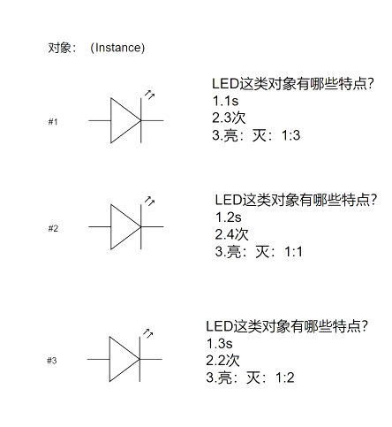
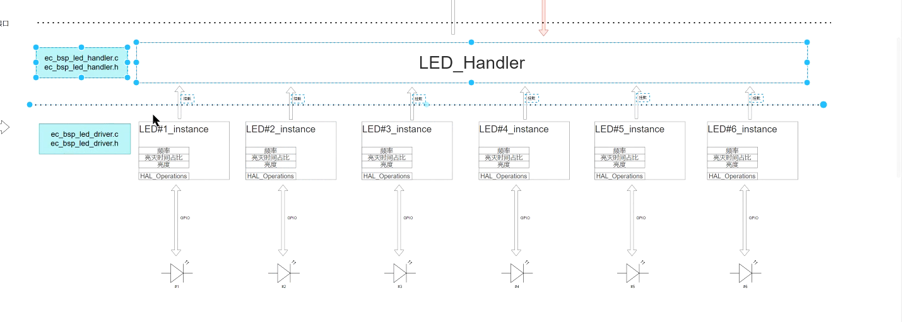
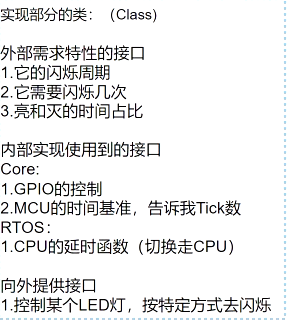
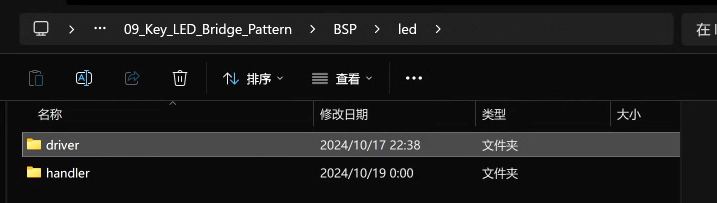
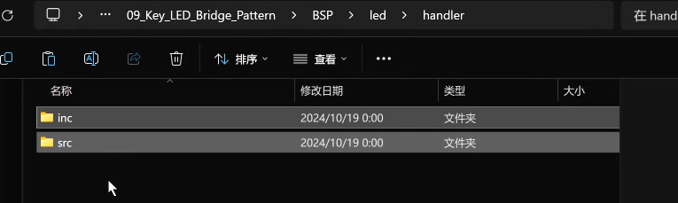

## LED驱动找对象


### 桥接模式

桥接模式： 把抽象部分和他的现实部分分离，使他们可以独立的变化。
- 可拓展性：可以方便的新添加LED类型和新的处理器逻辑
- 可维护性：改动一部分的代码不会影响到另一部分
- 灵活性：抽象和实现部分可以单独变化，不会影响

### 尝试理解面向对象

写面向对象的程序的时候，怎么找到对象

类：（class）

写类的时候，需要考虑哪些属性，哪些方法

例如： 分析LED驱动的特点
> 1. 它的闪烁周期
> 2. 它需要闪缩几次
> 3. 亮灭的时间占比 

对象：(Instance)



#### 基于面向对象的概念实装

bsp 层： 把硬件资源抽象出来，提供统一的接口
> 要想bsp层写的好，就需要再这里只对一个硬件资源进行抽象，不要把多个硬件资源都抽象出来。

使用typdef struct 这样就等价于了一个类型，这个类型就是一个对象。

> 类：
> 外部特性需求的接口
> 1. 它的闪缩周期
> 2. 它需要闪缩几次
> 3. 亮灭的时间占比
>
> 内部用到的接口
> Core：
> 1. GPIO的控制
> 2. MCU的时间基准
>RTOS：
> CPU的延时函数(切换走CPU)
>
> 向外提供接口
> 1. 控制某个LED，按特定方式去闪烁


``` cpp
/*******************************************************
 * @file bsp_led_diver.h
 * @author fanzx (fanzx@1456925916.com)
 * @brief provide led driver api
 * @version 0.1
 * @date 2026-03-20
 * @note 1 tab == 4 space
 * @copyright Copyright (c) 2026
 *
 *******************************************************/


#ifndef __BSP_LED_DRIVER_H__
#define __BSP_LED_DRIVER_H__

#ifdef __cplusplus
extern "C" {
#endif

//*************************************Includes*****************************************/
#include <stdio.h>
#include <stdint.h>
//*************************************Includes*****************************************/


//*************************************Defines*****************************************/
#define INITLEDSTATUS   1   /* LED的状态 用于判断是否初始化*/
#define NOT_INITLEDSTATUS 0 /* LED的状态 用于判断是否初始化*/
#define OS_SUPPORT 1        /* 是否支持OS */
#define DEBUG      1         /* 是否开启调试模式 */
#define DEBUG_OUT(X) printf(X)     /* 调试输出接口 */
typedef enum { LED_OK = 0, LED_ERROR, LED_ERRORTIMOUT, LED_ON, LED_BLINKING } 
led_status_t;

typedef enum {
    PROPORTION_1_3 = 0,
    PROPORTION_1_2,
    PROPORTION_1_1,
    PROPORTION_x_x = 0xff,
} proportion_t;

/**
 * @brief led 的操作接口
 *
 */
typedef struct {
    led_status_t (*pf_led_on)();
    led_status_t (*pf_led_off)();
} led_operations_t;

typedef struct {
    led_status_t (*pf_get_time_ms)(uint32_t *const);

} time_base_t;

typedef struct {
    led_status_t (*pf_os_delay_ms)(uint32_t delay_ms);
} os_delay_t;

typedef led_status_t (*pf_led_control_t)(bsp_led_driver_t *const p_led_driver_inst);
typedef struct {
    / **target of inernal status* /
    uint8_t init_status; /* LED的状态 用于判断是否初始化*/
    /** Target of Features**** */
    /*1. 亮的时间
      2. 亮几次
      3. 亮和灭的比值 */
    uint32_t cycle_time_ms;     /* 闪烁周期时间 */
    uint32_t blink_times;       /* 闪烁周期次数 */
    uint32_t proportion_on_off; /* 闪烁周期占空比 */
    /****Target of Features****/


    /****************IOS 需要的的接口*****************/
    /*1.GPIO的配置
      2.时间基准配置
     */
    led_operations_t *p_led_opes_inst;

    time_base_t *p_time_base_ms;

    os_delay_t *p_os_delay_ms;


    /*************提供的API********************/
    pf_led_control_t pf_led_control;


} bsp_led_driver_t;


//*************************************Defines*****************************************/


//*************************************Typedefs*****************************************/
/*** @brief led驱动的实例对象
 *
 * @param p_led_driver_inst led驱动的实例对象
 * @return led_status_t 返回LED的状态
 * @note 按照arm的规范，如果参数>4个的时候，就要用stack来传了 S-BUS --->flash里面会把code读出来然后进行压栈 （优化方向，进行参数优化，包装到一个结构体里面）
 */
led_status_t led_driver_inst(bsp_led_driver_t *  const   self
                             const  led_operations_t * const led_ops
#ifdef OS_SUPPORT
                             const time_base_t      *const time_base
                             const os_delay_t       * const os_delay
#endif
                             );

#ifdef __cplusplus
}
#endif


/* @brief Control the target bsp_led_drver
 * @param self led驱动的实例对象
 * @param cycle_time_ms 闪烁周期时间
 * @param blink_times 闪烁次数
 * @param proportion_on_off 闪烁占空比

 * @return led_status_t 返回LED的状态
 * @note 1. 根据LED的特性，来控制LED的闪烁
 *       2. 根据LED的状态，来控制LED的闪烁
 */
 led_status_t led_driver_control(bsp_led_driver_t * const self,
                                uint32_t cycle_time_ms,
                                uint32_t blink_times,
                                proportion_t proportion_on_off);


#endif /* BSP_LED_DIVER_H */
```


写完bsp层，就可以在应用层去new一个具体的对象了.

1. 构造函数 用于创建对象，初始化对象的属性 能够方便用户去填入参数，一般来说，对于.c文件会封装成为lib文件，防止别人去修改.c文件，导致代码的不可维护性。

``` c
#inclued "bsp_led_driver.h"

/** @brief led驱动默认的数据
 * @param self led驱动的实例对象
 * @return led_status_t 返回LED的状态
 * @note 1. 初始化LED的状态
 *       2. 初始化LED的特性
 *       3. 初始化LED的接口
 *       4. 初始化LED的控制接口
 */
led_status_t led_driver_init(bsp_led_driver_t * const self)
{   
    led_status_t ret = LED_OK;
    if(NULL == self)
    {
#ifdef DEBUG
        DEBUG_OUT("led driver instance is NULL\r\n");
#endif // DEBUG
        return LEDERRORPARAM;
    }
   self->p_led_opes_inst->pf_led_on ();
   self->p_os_time_delay->pf_os_delay_ms(1000);
   uint32_t time_ms = 0;
   self->p_time_base_ms->pf_get_time_ms(&time_ms);

    return ret;
}
led_status_t led_blink(bsp_led_driver_t * const self)
{
    led_status_t ret = LED_OK;
    if(NULL == self)
    { 
#ifdef DEBUG
        DEBUG_OUT("led driver instance is NULL\r\n");
#endif // DEBUG
        ret = LEDERRORPARAM; // 错误参数
        return ret;
    }

    /*2.根据cycle_time 去控制LED的闪烁开关*/
    {
        uint32_t cycle_time_local;
        uint32_t  blink_time_local;
        proportion_t proportion_on_off_local;
        uint32_t   led_toggle_time;

        cycle_time_local = self->cycle_time_ms;
        blink_time_local = self->blink_times;
        proportion_on_off_local = self->proportion_on_off;
    /*2.21 define the time value for saving the features*/
        switch (proportion_on_off_local)
        { 
        case PROPORTION_1_3:
            led_toggle_time = cycle_time_local / 4;
            break;
        case PROPORTION_1_2:
            led_toggle_time = cycle_time_local / 3;
            break;
        case PROPORTION_1_1:
            led_toggle_time = cycle_time_local/2;
            break;
        default:
            ret = LEDERRORPARAM;
            return ret;
            break;
        }

     /* do the operation 1.闪烁次数 2.闪烁占空比*/
     for(uint32_t i = 0; i < blink_time_local; i++)
     {
        for(uint32_t j = 0; j < cycle_time_local; j++)
        {
            if(j < led_toggle_time)
            {
                self->p_led_opes_inst->pf_led_on ();
            }
            else
            {
                self->p_led_opes_inst->pf_led_off ();
            }
            self->p_os_time_delay->pf_os_delay_ms(1);
        }
     }
    }
}
/* @brief Control the target bsp_led_drver
 * @param self led驱动的实例对象
 * @param cycle_time_ms 闪烁周期时间
 * @param blink_times 闪烁次数
 * @param proportion_on_off 闪烁占空比

 * @return led_status_t 返回LED的状态
 * @note 1. 根据LED的特性，来控制LED的闪烁
 *       2. 根据LED的状态，来控制LED的闪烁
 */
 static led_status_t led_driver_control(bsp_led_driver_t * const self,
                                uint32_t cycle_time_ms,
                                uint32_t blink_times,
                                proportion_t proportion_on_off)
 {  
    /**********checking the target status**********/
    led_status_t ret = LED_OK;
    /** 1. 检查是否初始化了 check if the target has benn initialized
     *  2. 如果没有被初始化，就返回error
     *  3. 加入互斥锁 option waite for the target to be ready 完成确定性调度，保证在多线程的情况下，能够正确的去访问这个对象
     */
    if(NULL == self)
    {
#ifdef DEBUG
        DEBUG_OUT("led driver instance is NULL\r\n");
#endif // DEBUG
        ret = LEDERRORPARAM;
        return ret;
    }
    if(INITED != self->is_inited)
    {
#ifdef DEBUG
        DEBUG_OUT("led driver instance is not inited\r\n");
#endif // DEBUG
        ret = LEDERRORSTATUS;
        return ret;
    }

    /**********checking the parameters**********/
    /* 把握好参数的范围，来保证代码的健壮性，来防止代码的崩溃 具体由项目决定 */
    if (0 == cycle_time_ms || 0 == blink_times || PROPORTION_x_x == proportion_on_off)
    {
#ifdef DEBUG
        DEBUG_OUT("led driver instance parameters are invalid\r\n");
#endif // DEBUG
        ret = LEDERRORPARAM;
        return ret;
    }
    /*updata new parameters for the led driver instance */
    self->cycle_time_ms = cycle_time_ms;
    self->blink_times = blink_times;
    self->proportion_on_off = proportion_on_off;
    self->pf_led_control = led_driver_control; // 这里是为了让用户能够在外部调用这个接口来控制LED的闪烁的特性，来实现不同的闪烁效果的。
    /*根据LED的状态，来控制LED的闪烁*/
    /********* run the operation of led*****************/
    /** 怎么解决多线程的问题？ 时间序列强度相关，例如led在这里闪烁10s，让core切走，不要在这里死等？
    TODO： 1. 实现非阻塞的model*/

    /* 1. call the fuciton to blink  */
    led_blink(self); // 根据self去解析状态

 }
/** @brief instaiation of led driver instance 
 * steps:
 * 1. adding the core interfaces into the led driver instance
 * 2. adding OS interfaces into the led driver instance
 * 3. adding the timebase interfaces into the led driver instance 
 * @param p_led_driver_inst led驱动的实例对象
 * @return led_status_t 返回LED的状态
 * @note 按照arm的规范，如果参数>4个的时候，就要用stack来传了 S-BUS --->flash里面会把code读出来然后进行压栈 （优化方向，进行参数优化，包装到一个结构体里面）
 */
led_status_t led_driver_inst(
    bsp_led_driver_t *  const   self,
                            led_operations_t * const led_ops
#ifdef OS_SUPPORT
    time_base_t      *const time_base,
    os_delay_t       * const os_delay
#endif
                             )
{   
/**********checking the parameters**********/ 
    if (NULL == self || 
        NULL == led_ops ||
        NULL == time_base ||
        NULL == os_delay) 
        {
#ifdef DEBUG
        DEBUG_OUT("led driver instance is NULL\r\n");
#endif // DEBUG
        return LED_ERROR;
         }
         
#ifdef DEBUG
    DEBUG_OUT("led driver instance is created successfully\r\n");
#endif // DEBUG

/**********checking the Resource**********/
    if(INITED == self-> is_inited)
    {
#ifdef DEBUG
        DEBUG_OUT("led driver instance is already inited\r\n");
#endif // DEBUG
        return LED_ERROR;
    }


/*updata new parameters for the led driver instance */
    self->p_led_opes_inst = led_ops;
    self->p_time_base_ms = time_base;
    self->p_os_delay_ms = os_delay;
    self->is_inited = INITED;
/*************default status of the led driver instance************/
    self->blink_times = 0;
    self->cycle_time_ms = 0;
    self->proportion_on_off = 0; 

    ret = led_driver_init (self) // 外部的接口调用
    if(LED_OK != ret)
    {
#ifdef DEBUG
        DEBUG_OUT("led driver instance is initialized failed\r\n");
#endif // DEBUG

       self->p_led_opes_inst = NULL;
       self->p_time_base_ms = NULL;
       self->p_os_delay_ms = NULL;
       self->led_control =  NULL;
       return ret
    }
    self-> is_inited = INITED;
    return LED_OK;
}

``` 


在task的任务里面去new一个对象，去调用这个对象的接口
``` cpp

#define LED_DIVER_TEST 0
// *************Unit test for led driver************** */
#ifdef LED_DIVER_TEST
led_status_t led_on_myown()
{
    printf("led on\r\n");
    return LED_OK;
}

led_status_t led_off_myown()
{
    printf("led off\r\n");
    return LED_OK;
}

led_operations_t led_ops = {
    .pf_led_on = led_on_myown,
    .pf_led_off = led_off_myown,
};


led_status_t get_time_ms_myown(uint32_t *const time_ms)
{   
    printf("get time ms\r\n");
    *time_ms = 1000;
    return LED_OK;
}

time_base_t time_base = {
    .pf_get_time_ms = get_time_ms_myown,
};

led_status_t os_delay_myown(uint32_t delay_ms)
{
    printf("os delay %d ms\r\n", delay_ms);
    for(int i = 0; i < delay_ms * 1000; i++);   
    printf（"flish led for %d ms\r\n", delay_ms);s
    return LED_OK;
}
os_delay_t os_delay = {
    .pf_os_delay_ms = os_delay_myown,
};

#endif
/************* end of unit test for led driver****************/


void StartDefaultTask(void *argument)
{
  /* USER CODE BEGIN StartDefaultTask */
  /* Infinite loop */
  printf("hello world\r\n");
  bsp_led_driver_t led_driver;// 在这里都是脏数据，都是随机的，不能直接使用
  led_driver_inst(&led_driver, &led_ops, &time_base, &os_delay);
  led_driver.led_control(&led_driver, 1000, 10, PROPORTION_1_2); // 1000ms的周期，闪烁10次，亮和灭的时间占比为1:1
  /*怎么去找到这led1的内初空间？----> 把led1的对象也传入进去，当做this指针使用*/
  for(;;)
  {
    osDelay(1);
  }
  /* USER CODE END StartDefaultTask */
}
```     

在这里进行了一个简单的单元测试，来验证这个led驱动的正确性，是否能够正确的调用接口，是否能够正确的进行闪烁。

之后就可以直接的在应用层去调用这个led驱动的接口了，来实现不同的闪烁效果了。

那么所有的GPIO的pin脚都不同，但是bsp层都可以根据不同的硬件平台去实现不同的GPIO接口，来满足不同的LED驱动的需求了。

> 写代码的时候，一定要考虑到os的竟态问题，考虑到多线程的安全问题，如果多线程都在用这个实例对象led，那么这些control的控制一定会发生段错误（hardware fault）
> 1. 一定要考虑到target_status 的检查
>  - 检查是否初始化了 check if the target has benn initialized
>  - 如果没有被初始化，就返回error
>  - 加入互斥锁 option waite for the target to be ready 完成确定性调度，保证在多线程的情况下，能够正确的去访问这个对象
> 2. 一定要考虑到参数的检查 check the parameters


> 在之这里的面向对象的封装已经完成了，后面就可以去生成不同的led进行不同的闪烁了，来满足不同的需求了。

``` cpp

void StartDefaultTask(void *argument)
{
  /* USER CODE BEGIN StartDefaultTask */
  /* Infinite loop */
  printf("hello world\r\n");
  bsp_led_driver_t led_driver;// 在这里都是脏数据，都是随机的，不能直接使用
  bsp_led_driver_t led_driver2;// 在这里都是脏数据，都是随机的，不能直接使用
  led_driver_inst(&led_driver, &led_ops, &time_base, &os_delay);
  led_driver.led_control(&led_driver, 1000, 10, PROPORTION_1_2); // 1000ms的周期，闪烁10
  
  led_driver_inst(&led_driver2, &led_ops, &time_base, &os_delay);
  led_driver2.led_control(&led_driver2, 500, 20, PROPORTION_1_3); // 500ms的周期，闪烁20次，亮和灭的时间占比为1:3
  for(;;)
  {
    osDelay(1);
  }
  /* USER CODE END StartDefaultTask */
}
```


### 构造桥接模式



在这里，写完了ec_bsp_led_driver.h和ec_bsp_led_driver.c之后，就完成了一个led驱动的桥接模式的构造了，来满足不同的LED驱动的需求了。
可能每一个公司都是LED_handler.c和LED_handler.h，来实现不同的LED驱动的需求了。

思考，到底怎么去挂载到`LED_Handler` 上

> 为了实现解耦，需要分析到底实现的部分的类，那一些是给外部用户暴露的？或者是保留的
>向handler暴露亮和灭的接口，来控制LED的状态，来实现不同的闪烁效果了。
> 分析
> hanlder的内部职责
> 1. 内部特性
>  > - 1.CPU的延时函数（切走CPU）
>  > - 2.MCU的时间基准 告诉我tick数
> 2. 内部接口
> 3. 向外提供接口
>    >- 1.控制某个LED，按特定方式去闪烁
>    >- 2.挂载LED的具体对象

多态的实现：
一般写完bsp的时候，就可以在git上创建一个new的分支，`git -checkout -b "桥接模式的实现"`，来实现这个桥接模式了，来满足不同的LED驱动的需求了。



在src和inc里面，去创建bsp_led_handler.c和bsp_led_handler.h，来实现这个桥接模式了，来满足不同的LED驱动的需求了。


``` cpp  h
/*******************************************************
 * @file bsp_led_handler.h
 * @author fanzx (fanzx@1456925916.com)
 * @brief provide led handler api
 * @version 0.1
 * @date 2026-03-20
 * @note 1 tab == 4 space
 * @copyright Copyright (c) 2026
 *
 *******************************************************/


#ifndef __BSO_LED_HANDLER_H__
#define __BSO_LED_HANDLER_H__

#ifdef __cplusplus
extern "C" {
#endif

//*************************************Includes*****************************************/
#incude "bsp_led_driver.h"
#include <stdio.h>
#include <stdint.h>
//*************************************Includes*****************************************/


//*************************************Defines*****************************************

#define OS_SUPPORT 1        /* 是否支持OS 这里可以定义全局宏*/
#define DEBUG      1         /* 是否开启调试模式 */
#define DEBUG_OUT(X) printf(X)     /* 调试输出接口 */


typedef struct bsp_led_driver bsp_led_driver_t; // 前向声明，来解决循环依赖的问题了
typedef struct bsp_led_handler bsp_led_handler_t; // 前向声明，来解决循环依赖的问题了
typedef led_handler_status_t (*led_register_inst_t)(
                                bsp_led_handler_t * const self,
                                bsp_led_driver_t * const led_driver_inst);
typedef enum {
    HANDLER_NOT_INITED = 0,
    HANDLER_INITED,
} handler_init_status_t;

typedef enum { HAN_OK = 0,
               HAN_ERROR,
               HAN_ERRORTIMOUT,
               HAN_ON, 
               HAN_BLINKING } 
led_handler_status_t;


typedef struct {
    led_handler_status_t (*pf_get_time_ms)(uint32_t *const);

} time_base_t;

#ifdef OS_SUPPORT
typedef struct {
    led_handler_status_t (*pf_os_delay_ms)(uint32_t delay_ms);
} os_delay_t;
#endif

typedef led_status_t (*pf_led_control_t)(bsp_led_driver_t *const p_led_driver_inst);

typedef struct {
    / **target of inernal status* /
    uint8_t init_status; /* LED的状态 用于判断是否初始化*/
    bsp_led_driver_t * led_instance_group [10]; /* 目标LED对象 指针数组*/

    /****Target of Features****/


    /****************IOS 需要的的接口*****************/
    time_base_t *p_time_base_ms;
#ifdef OS_SUPPORT
    os_delay_t *p_os_delay_ms;
#endif

    /*************提供的API********************/
    pf_led_control_t pf_led_control;
    
    pf_led_register_t pf_led_register; 

} bsp_led_handler_t;


//*************************************Defines*****************************************/


//*************************************Typedefs****************************************
/** @brief led_handler的实例对象
 *
 * @param bsp_led_driver_t *  const   self led驱动的实例对象
 * @param os_delay_t    * const led_ops led驱动的操作接口
 * @param time_base_t      *const time_base 时间基准接口
 * @return led_handler_status_t 返回LED的状态
 * @note 管理所有的LED驱动的实例对象，来实现不同的LED驱动的需求了。
 */
led_handler_status_t led_driver_inst(bsp_led_driver_t *  const   self
#ifdef OS_SUPPORT
                             const time_base_t      *const time_base
                             const os_delay_t       * const os_delay
#endif
                             );

#ifdef __cplusplus
}
#endif


/** * @brief Register the target bsp_led_handler_t
    @param self led_handler的实例对象
    @param led_driver_inst led驱动的实例对象
    @return led_handler_status_t 返回LED的状态    
 */
led_handler_status_t led_register_inst(bsp_led_handler_t * const self,
                                bsp_led_driver_t * const led_driver_inst);


#endif /* BSP_LED_HANDLER_H */
```
> 当然在这里，每一个handler可以跑在不同的core上，这样体现了一个多核的设计，并发。

--- 

对于.c文件的实现
✋️
``` cpp
/*******************************************************
 * @file bsp_led_handler.c
 * @author fanzx (1456925916@qq.com)
 * @brief provide led handler api
    * @version 0.1
    * @date 2026-03-20
    * @note 1 tab == 4 space    
、*******************************************************/

#incude "bsp_led_handler.h"


led_handler_status_t led_register_inst(bsp_led_handler_t * const self,
#ifdef OS_SUPPORT
                                       os_delay_t * const os_delay,         
#endif
                                        time_base_t * const time_base,
                                 )
{
    led_handler_status_t ret = HAN_OK;
    if(NULL == self || 
#ifdef OS_SUPPORT
    NULL == os_delay ||
#endif
    NULL == time_base)
    {
#ifdef DEBUG
        DEBUG_OUT("led handler instance or led driver instance is NULL\r\n");
#endif // DEBUG
        ret = HAN_ERROR;
        return ret;
    }

    if(HANDLER_INITED == self->init_status)
    {
#ifdef DEBUG
        DEBUG_OUT("led handler instance is already inited\r\n");
#endif // DEBUG
        ret = HAN_ERROR;


/* adding the inetrface of time base and os delay into the led handler instance */

    return ret;
}


```