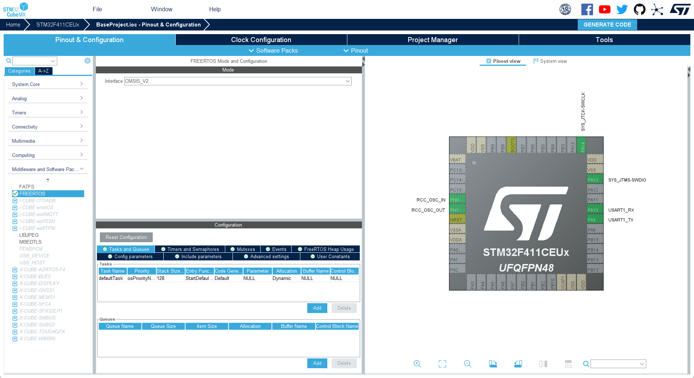
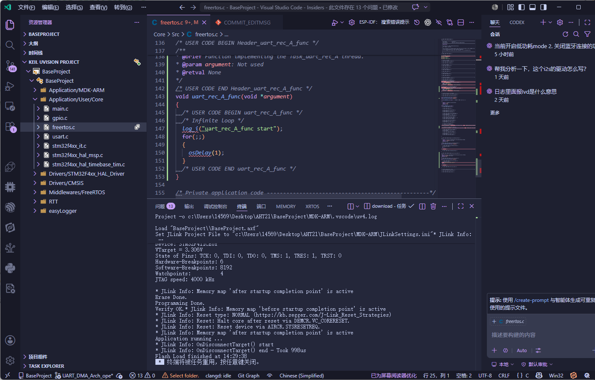
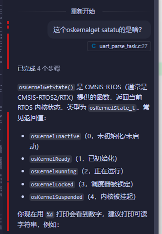
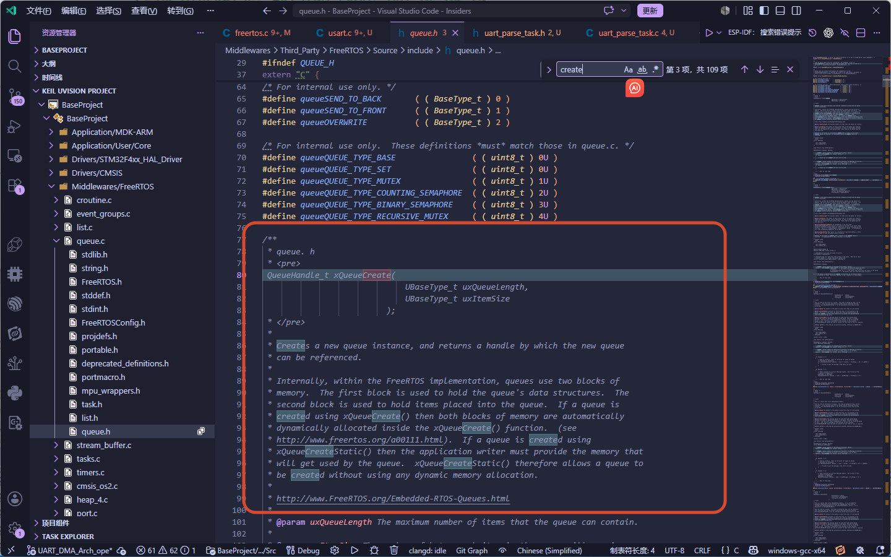
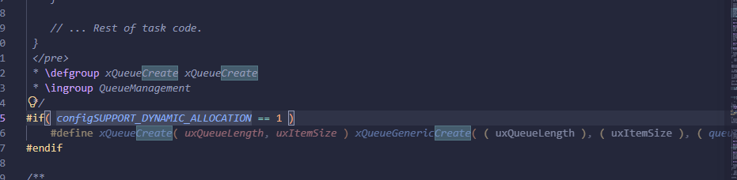
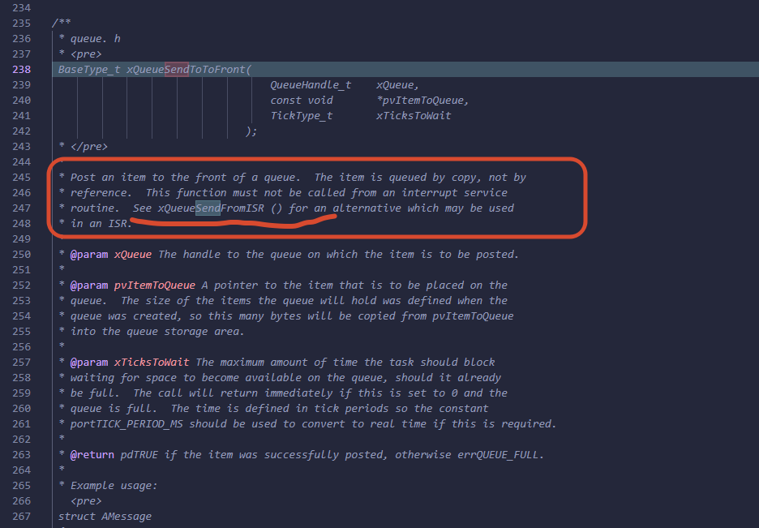
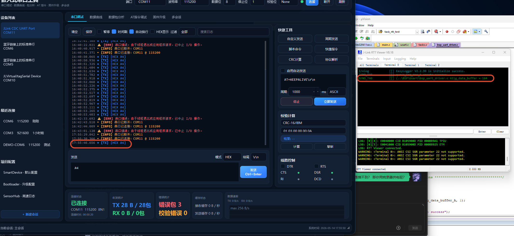

### 移植RTT
可以看一下[RTT移植文档](https://www.rt-thread.org/document/site/#/rt-thread-version/rt-thread-master/rt-thread-porting/porting-overview)。


### USART框图

需要使能CR1和SR寄存器

rx线的电平变化的本质都是由adc时钟在这些采样点上采样的结果，所有的GPIO设备都是

**- 字符接收**

USART 接受期间，通过RX引脚移入数据的最低位有效位，该模式下，DR寄存器的缓冲区位于内部总线和接受寄存器之间，接受到字符的时候，rxne寄存器会被置位。说明移位寄存器的内容已传送到RDR当中
如果RXNEIE的位置1，那么就会产生中断。


RXNE ： 读取寄存器不为空(read data register not empty)
>当RDR寄存器的内容已传输到USART_DR 寄存器时，该位置1，如果USART_CR1寄存器rxneie=1会产生中断
ORE  : overrun error，溢出错误
> 数据没有及时读取，导致新的数据覆盖了旧的数据


创建usart1

移植完成之后，在elog_init()打上断点
然后打开view -> systeam viewer -> usart usart1


这样就和串口的说明一样了

打开全速运行
这里的SR寄存器的TC标志位是发送完成标志位，这里是打开的表示发送完成了，说明串口发送数据成功了。

**BRR** 寄存器是波特率寄存器，用于设置USART的通信速率。BRR寄存器的值由以下公式计算得出：
BRR = Fck / BaudRate
其中，Fck是USART的时钟频率，BaudRate是所需的通信速率。例如，如果USART的时钟频率为16 MHz，所需的通信速率为115200 bps，那么BRR寄存器的值可以计算如下：
BRR = 16,000,000 / 115,200 ≈ 138.89

**CR1** 寄存器是控制寄存器1，用于配置USART的工作模式和功能。CR1寄存器的位定义如下：
TE：发送使能位，设置为1时，USART可以发送数据。
RE：接收使能位，设置为1时，USART可以接收数据。


打开串口发送数据，然后全速运行，观察寄存器数据变化


这里注意要用HEX模式发送


**添加task**




创建好task之后，就可以创建dobule buffer 了

``` cpp

#include <stdint.h>

uint8_t buffer1[128];
uint8_t buffer2[128];

```
**找到最终的中断函数**


>os: 想要找到正在运行的task，可以使用 `oskernalgetstatus` 函数来获取当前系统的状态信息，其中包括正在运行的任务。以下是一个示例代码片段，演示如何使用 `oskernalgetstatus` 函数来获取当前正在运行的任务：

``` cpp

printf("Current running task: %s\n", oskernalgetstatus());

```

在中断回调通过邮箱(基于队列的方式)通知线程A

先创一个queue

``` cpp
#include "queue.h"

QueueHandle_t queue_irq_rec_A = NULL;

void uart_rec_A_func(void *argument)
{
  /* USER CODE BEGIN uart_rec_A_func */
    if (NULL != queue_irq_rec_A)
  {
    log_i("queue_irq_rec_A is not NULL");
  }
  /* 添加 邮箱 
     item size == 4 byte
     only one */
    queue_irq_rec_A = xQueueCreate(1, sizeof(uint32_t));
    if (NULL != queue_irq_rec_A)
  {
    log_i("queue_irq_rec_A create success");
  }
  else
  {
    log_e("queue_irq_rec_A create failed");
  }
  /* Infinite loop */
  for(;;)
  {
    osDelay(1);
  }
  /* USER CODE END uart_rec_A_func */
}

```

完成了队列的创建就在中断回调函数中发送数据到队列

#### 中断回调函数使用队列进行发送

在中断里面一定要用xQueueSendFromISR () 来发送数据到队列，不能用xQueueSend ()，因为xQueueSend () 是在任务上下文中使用的，而中断回调函数是在中断上下文中执行的，所以必须使用xQueueSendFromISR () 来确保线程安全。

``` cpp

void HAL_UART_RxCpltCallback(UART_HandleTypeDef *huart)
{
  if (huart->Instance == USART1)
    {
        BaseType_t xHigherPriorityTaskWoken = pdFALSE;
        uint32_t base_send_data = uart1_rx_byte;

        if (queue_irq_rec_A != NULL)
        {
          (void)xQueueSendFromISR(queue_irq_rec_A, &base_send_data, &xHigherPriorityTaskWoken);
        }

        (void)HAL_UART_Receive_IT(huart, &uart1_rx_byte, 1);

        portYIELD_FROM_ISR(xHigherPriorityTaskWoken);
    }
}
```

#### 创建bsp_uart_driver 

创建bsp_uart_drvier_task 然后单独来处理串口接收的数据，并且由于这里的要处理中断服务函数，那么task的优先级要比中断优先级高



``` cpp


/******************************** Include ************************************/
#include "bsp_uart_driver.h"
#include "uart_parse_task.h"
#include "freertos.h"
#include "task.h"
#include "elog.h"
#include "cmsis_os.h"
#include "queue.h"
#include "usart.h"
/******************************** Include ************************************/


/********************************* Define ************************************/

#define BUFFER_A 0
#define BUFFER_B 1

/********************************* Define ************************************/

/********************************** global ***********************************/
extern QueueHandle_t queue_irq_rec_A;
extern uint8_t uart1_rx_byte;


uint8_t g_data_buffer_A[256];
uint8_t g_data_buffer_B[256];

uint8_t flag_AB = BUFFER_A;

/******************************* Functions ***********************************/

void uart_driver_fun(void *argument)
{
    flag_AB = BUFFER_A;
    HAL_UART_Receive_IT(&huart1, g_data_buffer_A, 1);

    /* Infinite loop */
    for(;;)
    {
        osDelay(1000);
    }
}


void HAL_UART_RxCpltCallback(UART_HandleTypeDef *huart)
{
  if (huart->Instance == USART1)
    {

        BaseType_t xHigherPriorityTaskWoken = pdFALSE;
        uint32_t base_send_data = uart1_rx_byte;

        if (queue_irq_rec_A != NULL)
        {
          (void)xQueueSendFromISR(queue_irq_rec_A, &base_send_data, &xHigherPriorityTaskWoken);
        }

        (void)HAL_UART_Receive_IT(huart, &uart1_rx_byte, 1);
        log_d("g_data_buffer = %d", g_data_buffer_A[0]);

        portYIELD_FROM_ISR(xHigherPriorityTaskWoken);
    }
}
```
