### 移植RTT
可以看一下[RTT移植文档](https://www.rt-thread.org/document/site/#/rt-thread-version/rt-thread-master/rt-thread-porting/porting-overview)。


### USART框图

需要使能CR1和SR寄存器

rx线的电平变化的本质都是由adc时钟在这些采样点上采样的结果，所有的GPIO设备都是

**- 字符接收**

USART 接受期间，通过RX引脚移入数据的最低位有效位，该模式下，DR寄存器的缓冲区位于内部总线和接受寄存器之间，接受到字符的时候，rxne寄存器会被置位。说明移位寄存器的内容已传送到RDR当中
如果RXNEIE的位置1，那么就会产生中断。


RXNE ： 读取寄存器不为空(read data register not empty)
>当RDR寄存器的内容已传输到USART_DR 寄存器时，该位置1，如果USART_CR1寄存器rxneie=1会产生中断
ORE  : overrun error，溢出错误
> 数据没有及时读取，导致新的数据覆盖了旧的数据


创建usart1

移植完成之后，在elog_init()打上断点
然后打开view -> systeam viewer -> usart usart1


这样就和串口的说明一样了

打开全速运行
这里的SR寄存器的TC标志位是发送完成标志位，这里是打开的表示发送完成了，说明串口发送数据成功了。

**BRR** 寄存器是波特率寄存器，用于设置USART的通信速率。BRR寄存器的值由以下公式计算得出：
BRR = Fck / BaudRate
其中，Fck是USART的时钟频率，BaudRate是所需的通信速率。例如，如果USART的时钟频率为16 MHz，所需的通信速率为115200 bps，那么BRR寄存器的值可以计算如下：
BRR = 16,000,000 / 115,200 ≈ 138.89

**CR1** 寄存器是控制寄存器1，用于配置USART的工作模式和功能。CR1寄存器的位定义如下：
TE：发送使能位，设置为1时，USART可以发送数据。
RE：接收使能位，设置为1时，USART可以接收数据。


打开串口发送数据，然后全速运行，观察寄存器数据变化


这里注意要用HEX模式发送


**添加task**


创建好task之后，就可以创建dobule buffer 了

``` cpp

#include <stdint.h>

uint8_t buffer1[128];
uint8_t buffer2[128];

```
**找到最终的中断函数**


>os: 想要找到正在运行的task，可以使用 `oskernalgetstatus` 函数来获取当前系统的状态信息，其中包括正在运行的任务。以下是一个示例代码片段，演示如何使用 `oskernalgetstatus` 函数来获取当前正在运行的任务：

``` cpp

printf("Current running task: %s\n", oskernalgetstatus());

```

在中断回调通过邮箱(基于队列的方式)通知线程A

先创一个queue

``` cpp
#include "queue.h"

QueueHandle_t queue_irq_rec_A = NULL;

void uart_rec_A_func(void *argument)
{
  /* USER CODE BEGIN uart_rec_A_func */
    if (NULL != queue_irq_rec_A)
  {
    log_i("queue_irq_rec_A is not NULL");
  }
  /* 添加 邮箱 
     item size == 4 byte
     only one */
    queue_irq_rec_A = xQueueCreate(1, sizeof(uint32_t));
    if (NULL != queue_irq_rec_A)
  {
    log_i("queue_irq_rec_A create success");
  }
  else
  {
    log_e("queue_irq_rec_A create failed");
  }
  /* Infinite loop */
  for(;;)
  {
    osDelay(1);
  }
  /* USER CODE END uart_rec_A_func */
}

```

完成了队列的创建就在中断回调函数中发送数据到队列

#### 中断回调函数使用队列进行发送

在中断里面一定要用xQueueSendFromISR () 来发送数据到队列，不能用xQueueSend ()，因为xQueueSend () 是在任务上下文中使用的，而中断回调函数是在中断上下文中执行的，所以必须使用xQueueSendFromISR () 来确保线程安全。

``` cpp

void HAL_UART_RxCpltCallback(UART_HandleTypeDef *huart)
{
  if (huart->Instance == USART1)
    {
        BaseType_t xHigherPriorityTaskWoken = pdFALSE;
        uint32_t base_send_data = uart1_rx_byte;

        if (queue_irq_rec_A != NULL)
        {
          (void)xQueueSendFromISR(queue_irq_rec_A, &base_send_data, &xHigherPriorityTaskWoken);
        }

        (void)HAL_UART_Receive_IT(huart, &uart1_rx_byte, 1);

        portYIELD_FROM_ISR(xHigherPriorityTaskWoken);
    }
}
```

#### 创建bsp_uart_driver 

创建bsp_uart_drvier_task 然后单独来处理串口接收的数据，并且由于这里的要处理中断服务函数，那么task的优先级要比中断优先级高


``` cpp


/******************************** Include ************************************/
#include "bsp_uart_driver.h"
#include "uart_parse_task.h"
#include "freertos.h"
#include "task.h"
#include "elog.h"
#include "cmsis_os.h"
#include "queue.h"
#include "usart.h"
/******************************** Include ************************************/


/********************************* Define ************************************/

#define BUFFER_A 0
#define BUFFER_B 1

/********************************* Define ************************************/

/********************************** global ***********************************/
extern QueueHandle_t queue_irq_rec_A;
extern uint8_t uart1_rx_byte;


uint8_t g_data_buffer_A[256];
uint8_t g_data_buffer_B[256];

uint8_t flag_AB = BUFFER_A;

/******************************* Functions ***********************************/

void uart_driver_fun(void *argument)
{
    flag_AB = BUFFER_A;
    HAL_UART_Receive_IT(&huart1, g_data_buffer_A, 1);

    /* Infinite loop */
    for(;;)
    {
        osDelay(1000);
    }
}


void HAL_UART_RxCpltCallback(UART_HandleTypeDef *huart)
{
  if (huart->Instance == USART1)
    {

        BaseType_t xHigherPriorityTaskWoken = pdFALSE;
        uint32_t base_send_data = uart1_rx_byte;

        if (queue_irq_rec_A != NULL)
        {
          (void)xQueueSendFromISR(queue_irq_rec_A, &base_send_data, &xHigherPriorityTaskWoken);
        }

        (void)HAL_UART_Receive_IT(huart, &uart1_rx_byte, 1);
        log_d("g_data_buffer = %d", g_data_buffer_A[0]);

        portYIELD_FROM_ISR(xHigherPriorityTaskWoken);
    }
}
```


#### 切换buffer

当有两个buffer之后，当Abuffer满了之后就切换到Bbuffer，继续接收数据，当Bbuffer满了之后就切换到Abuffer，继续接收数据，这样就实现了双buffer的功能。
> 使用flag_AB来标志当前使用的是哪个buffer，当flag_AB == BUFFER_A的时候，说明当前使用的是Abuffer，当flag_AB == BUFFER_B的时候，说明当前使用的是Bbuffer，当Abuffer满了之后，就切换到Bbuffer，继续接收数据，当Bbuffer满了之后，就切换到Abuffer，继续接收数据，这样就实现了双buffer的功能。

``` cpp
HAL_StatusTypeDef ret = HAL_OK;
void HAL_UART_RxCpltCallback(UART_HandleTypeDef *huart)
{
  if (huart->Instance == USART1)
    {

        BaseType_t xHigherPriorityTaskWoken = pdFALSE;
        uint32_t base_send_data = uart1_rx_byte;

        if (queue_irq_rec_A != NULL)
        {
          (void)xQueueSendFromISR(queue_irq_rec_A, &base_send_data, &xHigherPriorityTaskWoken);
        }

        ret = HAL_UART_Receive_IT(huart, &uart1_rx_byte, 1);
        log_i("g_data_buffer = %d", g_data_buffer_A[0]);
        log_i("g_data_buffer = %d", g_data_buffer_B[0]);

        if(BUFFER_A == flag_AB)
        {
            flag_AB = BUFFER_B;
            ret = HAL_UART_Receive_IT(huart, g_data_buffer_B, 1);
            if(HAL_OK != ret)
            {
                log_e("HAL_UART_Receive_IT error_B");
            }

        }
        else
        {
            flag_AB = BUFFER_A;
            ret = HAL_UART_Receive_IT(huart, g_data_buffer_A, 1);
            if(HAL_OK != ret)
            {
                log_e("HAL_UART_Receive_IT error");
            }
        }
        portYIELD_FROM_ISR(xHigherPriorityTaskWoken);
    }
}
```
当然在环形缓冲区里面，这个算中间件，所以在middleware


#### 环形缓冲区

在环形缓冲区里面，这个算中间件，所以在middleware里面创建一个circular_buffer.c和circular_buffer.h来实现环形缓冲区的功能，具体的实现可以参考一下[环形缓冲区的实现]
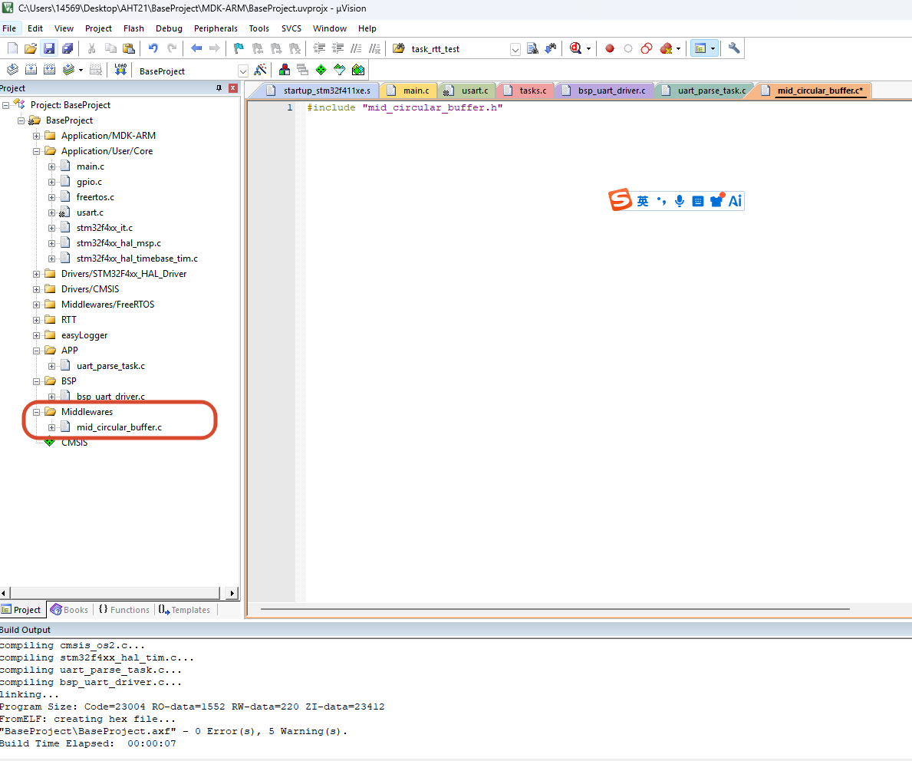

单独创建一个middlewares文件夹来存放中间件，然后在middlewares里面创建一个circular_buffer文件夹来存放环形缓冲区的代码

> 基本的环形缓冲区的功能包括：创建一个空的环形缓冲区，检查环形缓冲区是否为空，检查环形缓冲区是否为满，向环形缓冲区写入数据，从环形缓冲区读取数据并且删除数据。
``` cpp
/******************************************************************************
 * @file mid_circular_buffer.h
 * @author Lumos (1456925916@qq.com)
 * @brief the header file of mid_circular_buffer.c
 * @version 0.1
 * @date 2026-05-18
 * @note 提供给上层应用和下层驱动使用的循环缓冲区接口
 * @copyright Copyright (c) 2026
 * 
******************************************************************************/
#ifndef __MID_CIRCULAR_BUFFER_H
#define __MID_CIRCULAR_BUFFER_H

/******************************** Include ************************************/
#include "stdint.h"
#include "stdbool.h"
/******************************** Include ************************************/

/********************************* Define ************************************/
#define CIRCULAR_BUFFER_SIZE 256  // 定义循环缓冲区的大小

typedef uint8_t circular_Buffer_Data_t;  // 定义循环缓冲区中存储的数据类型

/******************************************************************************
 * @brief  循环缓冲区状态枚举类型定义
 * 
******************************************************************************/
typedef enum
{
    CIRCULAR_BUFFER_OK = 0,      // 操作成功
    CIRCULAR_BUFFER_FULL,        // 缓冲区已满
    CIRCULAR_BUFFER_EMPTY,       // 缓冲区为空
    CIRCULAR_BUFFER_ERROR        // 其他错误
} circular_Buffer_Status_t;

/******************************************************************************
 * @brief  循环缓冲区的数据结构定义
 * 
******************************************************************************/
typedef struct
{
    circular_Buffer_Data_t  data[CIRCULAR_BUFFER_SIZE];      
                                              // 循环缓冲区的存储空间
    uint32_t head;                            // 头指针，指向下一个写入位置
    uint32_t tail;                            // 尾指针，指向下一个读取位置
    uint32_t size;                            // 循环缓冲区的总大小
    bool full;                                // 标志位，表示缓冲区是否已满
} circular_Buffer_t; 


/******************************************************************************
 * @brief Create a Empty Circular Buffer object 
 * 
 * @param none  
 * @return circular_Buffer_t* 
******************************************************************************/
circular_Buffer_t* createEmptyCircularBuffer(void);

/******************************************************************************
 * @brief Check if the circular buffer is empty
 * 
 * @param buffer Pointer to the circular buffer
 * @return circular_Buffer_Status_t Status of the buffer (empty or not)
******************************************************************************/
circular_Buffer_Status_t buffer_is_empty(circular_Buffer_t* p_buffer);


/******************************************************************************
 * @brief Check if the circular buffer is full
 * 
 * @param p_buffer Pointer to the circular buffer
 * @return circular_Buffer_Status_t Status of the buffer (full or not)
******************************************************************************/
circular_Buffer_Status_t buffer_is_full(circular_Buffer_t* p_buffer);


/******************************************************************************
 * @brief Write data to the circular buffer
 * 
 * @param p_buffer Pointer to the circular buffer
 * @param data Data to be written to the buffer
 * @return circular_Buffer_Status_t Status of the buffer 
 *         (success, full,or error)
******************************************************************************/
circular_Buffer_Status_t insert_data(circular_Buffer_t* p_buffer, 
                                     circular_Buffer_Data_t data);

/******************************************************************************
 * @brief Read data from the circular buffer and will delete the data in the 
 *      buffer after reading 
 * 
 * @param p_buffer Pointer to the circular buffer
 * @param data Pointer to the variable where the read data will be stored
 * @return circular_Buffer_Status_t Status of the buffer 
 *         (success, empty, or error)
******************************************************************************/
circular_Buffer_Status_t get_data(circular_Buffer_t* p_buffer, 
                                   circular_Buffer_Data_t* data);                                     
/********************************* Define ************************************/


#endif /* __MID_CIRCULAR_BUFFER_H */
```

基本的环形缓冲区的.h文件搭建好之后，就可以在.c文件里面实现具体的功能了

> 在有操作系统的时候，一般都会用pdmalloc来分配内存，从而达到内存管理的目的，防止mcu在不断的malloc和free的过程中产生内存碎片，最终导致内存不足的情况发生，所以在createEmptyCircularBuffer函数里面要用pdmalloc来分配内存。
> 在pdmalloc分配内存的时候，是使用一个静态的大数组来分配的，ucHeap数组的大小是由configTOTAL_HEAP_SIZE宏定义的，所以在使用pdmalloc分配内存的时候，要确保configTOTAL_HEAP_SIZE的值足够大，以满足系统的内存需求。
> 在FreeRtos中，分配的内存是在bss段的，而malloc实在堆区的，所以在使用pdmalloc分配内存的时候，要确保堆区的大小足够大，以满足系统的内存需求。


**编写创建环形缓冲区**
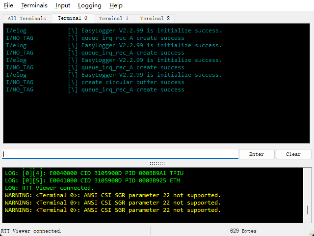
``` cpp

/******************************************************************************
 * @brief Create a Empty Circular Buffer object
 * @note  返回一个指向新创建的空循环缓冲区对象的指针
 * @TBD 1.用一个二级指针来创建这个buffer 参数传入，用于标准的嵌入式系统
 * @return circular_Buffer_t* 
******************************************************************************/
circular_Buffer_t* createEmptyCircularBuffer(void)
{   
    /**init a empty circular buffer 
     * 1. use pdmalloc to create a circular_Buffer_t object in heap memory
     * 2. initialize the head and tail pointers to 0, 
     * size to CIRCULAR_BUFFER_SIZE,and full flag to false
    */
#ifdef OS
    circular_Buffer_t* p_circularBuffer = \
    (circular_Buffer_t*)pvPortMalloc(sizeof(circular_Buffer_t));
#else
    circular_Buffer_t* p_circularBuffer = \
    (circular_Buffer_t*)malloc(sizeof(circular_Buffer_t));
#endif // OS
    /** check the allocation result
     * if the allocation fails, return NULL
     * if the allocation succeeds, 
     *  initialize the circular buffer object and return its pointer
     */
    if (NULL != p_circularBuffer)
    {
        p_circularBuffer->head = 0;
        p_circularBuffer->tail = 0;
        p_circularBuffer->size = CIRCULAR_BUFFER_SIZE;
        p_circularBuffer->full = false;
    }
    else
    {
        /** allocation failed, return NULL */
        return NULL;
    }
    return p_circularBuffer;
}


```
标准的环形缓冲区.c文件实现
```  cpp
/******************************************************************************
 * @file mid_circular_buffer.c
 * @author Lumos (1456925916@qq.com)
 * @brief  the source file of mid_circular_buffer.c
 * @version 0.1
 * @date 2026-05-18
 * 
 * @copyright Copyright (c) 2026
 * 
******************************************************************************/

/******************************** Include ************************************/
#include "mid_circular_buffer.h"
#include "stdlib.h"
#include "elog.h"
#ifdef OS
#include "cmsis_os.h"
#endif // OS
/******************************** Include ************************************/

/********************************** Functions ********************************/
/******************************************************************************
 * @brief Create a Empty Circular Buffer object
 * @note  返回一个指向新创建的空循环缓冲区对象的指针
 * @TBD 1.用一个二级指针来创建这个buffer 参数传入，用于标准的嵌入式系统
 * @return circular_Buffer_t* 
******************************************************************************/
circular_Buffer_t* createEmptyCircularBuffer(void)
{   
    /**init a empty circular buffer 
     * 1. use pdmalloc to create a circular_Buffer_t object in heap memory
     * 2. initialize the head and tail pointers to 0, 
     * size to CIRCULAR_BUFFER_SIZE,and full flag to false
    */
#ifdef OS
    circular_Buffer_t* p_circularBuffer = \
    (circular_Buffer_t*)pvPortMalloc(sizeof(circular_Buffer_t));
#else
    circular_Buffer_t* p_circularBuffer = \
    (circular_Buffer_t*)malloc(sizeof(circular_Buffer_t));
#endif // OS
    /** check the allocation result
     * if the allocation fails, return NULL
     * if the allocation succeeds, 
     *  initialize the circular buffer object and return its pointer
     */
    if (NULL != p_circularBuffer)
    {
        p_circularBuffer->head = 0;
        p_circularBuffer->tail = 0;
        p_circularBuffer->size = CIRCULAR_BUFFER_SIZE;
        p_circularBuffer->full = false;
    }
    else
    {
        /** allocation failed, return NULL */
        return NULL;
    }
    return p_circularBuffer;
}


/******************************************************************************
 * @brief Check if the circular buffer is empty
 * 
 * @param buffer Pointer to the circular buffer
 * @return circular_Buffer_Status_t Status of the buffer (empty or not)
******************************************************************************/
circular_Buffer_Status_t buffer_is_empty(circular_Buffer_t* p_buffer)
{
    if(NULL != p_buffer)
    {
        return (p_buffer->full == false && p_buffer->head == p_buffer->tail) \
        ? CIRCULAR_BUFFER_EMPTY : CIRCULAR_BUFFER_OK;
    }
    return CIRCULAR_BUFFER_ERROR;
}


/******************************************************************************
 * @brief Check if the circular buffer is full
 * 
 * @param p_buffer Pointer to the circular buffer
 * @return circular_Buffer_Status_t Status of the buffer (full or not)
******************************************************************************/
circular_Buffer_Status_t buffer_is_full(circular_Buffer_t* p_buffer)
{
    if(NULL != p_buffer)
    {
         return (p_buffer->full == true) \
        ? CIRCULAR_BUFFER_FULL : CIRCULAR_BUFFER_OK;
    }
    return CIRCULAR_BUFFER_ERROR;
}

/******************************************************************************
 * @brief Write data to the circular buffer
 * 
 * @param p_buffer Pointer to the circular buffer
 * @param data Data to be written to the buffer
 * @return circular_Buffer_Status_t Status of the buffer 
 *         (success, full,or error)
******************************************************************************/
circular_Buffer_Status_t insert_data(circular_Buffer_t* p_buffer, 
                                     circular_Buffer_Data_t data)
{
    /** check p_buffer is not NULL
     * if p_buffer is NULL, return CIRCULAR_BUFFER_ERROR
     * if p_buffer is not NULL, check if the buffer is full
     * if the buffer is full, return CIRCULAR_BUFFER_FULL
     * if the buffer is not full, write data to the buffer at head position
     */
    if(NULL != p_buffer)
    {
        if(buffer_is_full(p_buffer) == CIRCULAR_BUFFER_FULL)
        {
            return CIRCULAR_BUFFER_FULL;
        }
        p_buffer->data[p_buffer->head] = data;
        p_buffer->head = (p_buffer->head + 1) % p_buffer->size;
        if(p_buffer->head == p_buffer->tail)
        {
            p_buffer->full = true;
        }
        return CIRCULAR_BUFFER_OK;
    }
    return CIRCULAR_BUFFER_ERROR; 
}


/******************************************************************************
 * @brief Read data from the circular buffer and will delete the data in the 
 *      buffer after reading 
 * 
 * @param p_buffer Pointer to the circular buffer
 * @param data Pointer to the variable where the read data will be stored
 * @return circular_Buffer_Status_t Status of the buffer 
 *         (success, empty, or error)
******************************************************************************/
circular_Buffer_Status_t get_data(circular_Buffer_t* p_buffer, 
                                   circular_Buffer_Data_t* data)
{
    /** check p_buffer and data are not NULL
     * if p_buffer or data is NULL, return CIRCULAR_BUFFER_ERROR
     * if p_buffer and data are not NULL, check if the buffer is empty
     * if the buffer is empty, return CIRCULAR_BUFFER_EMPTY
     * if the buffer is not empty, read data from the buffer at tail position
     * and store it in the variable pointed by data, then move tail pointer 
     * to the next position and set full flag to false
     */
    if(NULL != p_buffer && NULL != data)
    {
        if(buffer_is_empty(p_buffer) == CIRCULAR_BUFFER_EMPTY)
        {
            return CIRCULAR_BUFFER_EMPTY;
        }
        *data = p_buffer->data[p_buffer->tail];
        p_buffer->tail = (p_buffer->tail + 1) % p_buffer->size;
        p_buffer->full = false;
        return CIRCULAR_BUFFER_OK;
    }
    return CIRCULAR_BUFFER_ERROR;
}

/********************************** Functions ********************************/

```
在bsp_uart_driver.c里面测试一下环形缓冲区的功能
``` cpp
void uart_driver_fun(void *argument)
{
    flag_AB = BUFFER_A;
    HAL_UART_Receive_IT(&huart1, g_data_buffer_A, 1);

    /* 1。creat circular buffer */
    circular_Buffer_t* p_circularBuffer = createEmptyCircularBuffer();
    if (NULL == p_circularBuffer)
    {
        log_e("create circular buffer failed");
        return;
    }
    else
    {
        log_i("create circular buffer success");
    }
    if (buffer_is_empty(p_circularBuffer) == CIRCULAR_BUFFER_EMPTY)
    {
        log_i("circular buffer is empty");
    }
    if (buffer_is_full(p_circularBuffer) == CIRCULAR_BUFFER_FULL)
    {
        log_i("circular buffer is full");
    }
    // todo : add data to circular buffer and read data from circular buffer
    insert_data(p_circularBuffer, 0x55);
    circular_Buffer_Data_t read_data = 0;
    if(buffer_is_empty(p_circularBuffer) == CIRCULAR_BUFFER_EMPTY)
    {
        log_i("circular buffer is empty");
    }
    get_data(p_circularBuffer, &read_data);
    log_i("read data from circular buffer: 0x%02X", read_data);

    // todo : test circular buffer full 
    for (int i = 0; i < CIRCULAR_BUFFER_SIZE; i++)
    {
        insert_data(p_circularBuffer, i);
    }
    if (buffer_is_full(p_circularBuffer) == CIRCULAR_BUFFER_FULL)
    {
        log_i("circular buffer is full");
    }
    if(buffer_is_empty(p_circularBuffer) == CIRCULAR_BUFFER_EMPTY)
    {
        log_i("circular buffer is empty free circular buffer");
        free(p_circularBuffer);
    }
    /* Infinite loop */
    for(;;)
    {   
        osDelay(1000);
    }
}
```
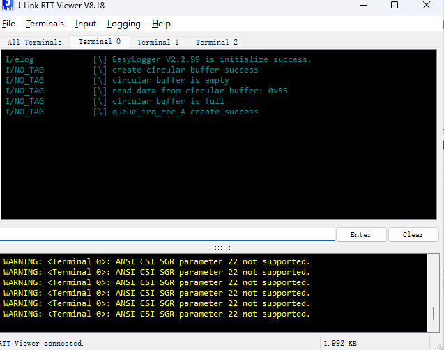


#### AB buffer切换环形缓冲区
将实现的AB_buffer切换的功能改成环形缓冲区。
1. AB_buffer切换环形缓冲区
> 1.1把数据的存储方式从单纯的数组改成环形缓冲区，这样就可以实现更高效的数据存储和读取，同时也可以避免数据丢失的问题。**在中断当中**
> 测试写入后立马读取，看看数据是否正确
> 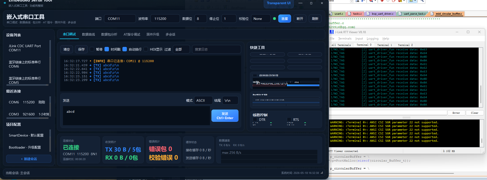
> 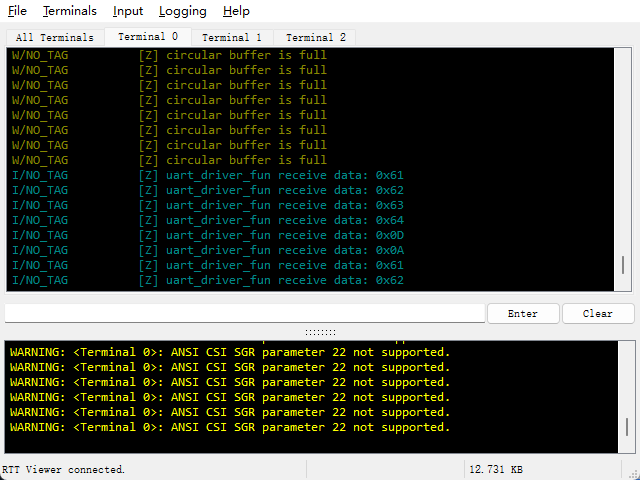

``` cpp
/******************************** Include ************************************/
#include "bsp_uart_driver.h"
#include "uart_parse_task.h"
#include "freertos.h"
#include "task.h"
#include "elog.h"
#include "cmsis_os.h"
#include "queue.h"
#include "usart.h"
#include "mid_circular_buffer.h"
/******************************** Include ************************************/


/********************************* Define ************************************/

#define BUFFER_A 0
#define BUFFER_B 1

/********************************* Define ************************************/

/********************************** global ***********************************/
extern QueueHandle_t queue_irq_rec_A;
extern uint8_t uart1_rx_byte;


uint8_t g_data_buffer_A[256];
uint8_t g_data_buffer_B[256];

uint8_t flag_AB = BUFFER_A;
static circular_Buffer_t* gp_circularBuffer = NULL;
/******************************* Functions ***********************************/

void uart_driver_fun(void *argument)
{
    HAL_UART_Receive_IT(&huart1, &uart1_rx_byte, 1);
    // mount the circular buffer for uart driver
    gp_circularBuffer = createEmptyCircularBuffer();
    if (NULL == gp_circularBuffer)
    {
        log_e("circular buffer create failed");
    }
    
    circular_Buffer_Data_t data = 0;
    /* Infinite loop */
    for(;;)
    {   
        get_data(gp_circularBuffer,&data);
        log_i("uart_driver_fun receive data: 0x%02X", data);
        osDelay(1000);
    }
}
/******************************************************************************
 * @brief  uart接收中断回调函数 
 * 
******************************************************************************/
static void __circular_buffer_irq(void)
{
    if(NULL == gp_circularBuffer)
      {
          log_e("circular buffer is NULL gp_circularBuffer");
          return;
      }
    if (CIRCULAR_BUFFER_FULL == buffer_is_full(gp_circularBuffer))
     {
         log_w("circular buffer is full");
         return;
     }
     if (CIRCULAR_BUFFER_ERROR == insert_data(gp_circularBuffer, uart1_rx_byte))
     {
         log_e("put data to circular buffer failed");
         return;
     }
 
}

HAL_StatusTypeDef ret = HAL_OK;
/******************************************************************************
 * @brief  使用ciruclar_buffer实现uart接收中断回调函数
 * 
 * @param huart 
******************************************************************************/
void HAL_UART_RxCpltCallback(UART_HandleTypeDef *huart)
{
    if(huart->Instance == USART1)
    {
    
     __circular_buffer_irq();
    HAL_UART_Receive_IT(&huart1, &uart1_rx_byte, 1);
    }
}

```

#### 通过邮箱通知解析线程来解析数据
帧头帧尾的解析可以在解析线程里面来做，uart_driver_fun这个线程只负责接收数据并且存储数据，解析线程负责解析数据，这样就实现了职责分离，同时也可以提高系统的效率和稳定性。
    帧头：0xFE
    帧尾：0xFF
状态机的实现：Switch

在中断当中把数据传输单独事情告诉串口驱动程序(前端)，串口驱动程序在通知app解包(后端)
系统硬件->前端->后端->系统硬件

**中断**
1. 将数据存储到环形缓冲区中
2. 通知前端，数据已就绪(队列去通知)
3. 开启下次接收
``` cpp
/******************************************************************************
 * @brief  uart接收中断回调函数 
 * @note 
 * * 1.将数据放入循环缓冲区
 * 2.通知前端数据已就绪
 * 3.重新使能uart接收中断
******************************************************************************/
static void __circular_buffer_irq(void)
{
# if 0  //test circular buffer in uart irq callback
    if(NULL == gp_circularBuffer)
      {
          log_e("circular buffer is NULL gp_circularBuffer");
          return;
      }
    if (CIRCULAR_BUFFER_FULL == buffer_is_full(gp_circularBuffer))
     {
         log_w("circular buffer is full");
         return;
     }
     if (CIRCULAR_BUFFER_ERROR == insert_data(gp_circularBuffer, uart1_rx_byte))
     {
         log_e("put data to circular buffer failed");
         return;
     }
# endif

/**
 * 1.将数据放入循环缓冲区
 * 2.通知前端数据已就绪
 * 3.重新使能uart接收中断
 */
 if(NULL == queue_irq_notify)
 {
     log_e("queue is NULL queue_irq_notify");
     return;
 }
 
 if(CIRCULAR_BUFFER_ERROR == insert_data(gp_circularBuffer, uart1_rx_byte))
 {
     log_e("put data to circular buffer failed");
     return;
 }
 if(pdPASS != xQueueSendFromISR(queue_irq_notify, &notify_flag, NULL))
 {
     log_e("send queue from isr failed");
     return;
 }
 else
 {
     log_i("send queue from isr success");
 }
 
}

HAL_StatusTypeDef ret = HAL_OK;
/******************************************************************************
 * @brief  使用ciruclar_buffer实现uart接收中断回调函数
 * 
 * @param huart 
******************************************************************************/
void HAL_UART_RxCpltCallback(UART_HandleTypeDef *huart)
{
    if(huart->Instance == USART1)
    {
    
    __circular_buffer_irq();
    HAL_UART_Receive_IT(&huart1, &uart1_rx_byte, 1);//重新使能uart接收中断
    }
}
```
**前端**
1. check buffer is full -> 停下串口
2. 将当前数据就绪的事件发送到后端

``` cpp
/******************************************************************************
 * @brief 创建uart驱动任务
 * 
 * @param argument 
******************************************************************************/
void uart_driver_fun(void *argument)
{   uint32_t receive_data = 0;

    HAL_UART_Receive_IT(&huart1, &uart1_rx_byte, 1);
    // mount the circular buffer for uart driver
    gp_circularBuffer = createEmptyCircularBuffer();
    if (NULL == gp_circularBuffer)
    {
        log_e("circular buffer create failed");
    }
    
    circular_Buffer_Data_t data = 0;
    
    /**
     * 创建队列用于系统硬件传递消息
     * @note 1.队列长度为1，消息大小为uint16_t(邮箱mode)
     * 
     */
    queue_irq_notify = xQueueCreate(1, 4);
    if(NULL == queue_irq_notify)
    {
        log_e("queue create failed");
    }
    else
    {
        log_i("queue create success");
    }

    

    /* Infinite loop */
    for(;;)
    {   
        xQueueReceive(queue_irq_notify, &receive_data, portMAX_DELAY);
        if(UART_NOTFIY_SEND == receive_data)
        {
            log_i("uart driver receive notify from isr");
            /* 2 通知后端数据 已经准备好*/
            if(pdTRUE == xQueueSend(queue_irq_rec_A, 
                                    &send_to_end, 
                                    portMAX_DELAY))
            {
                log_i("uart driver send notify to uart_rec_A_func success");
            }
            else
            {
                log_e("uart driver send notify to uart_rec_A_func failed");
            }
        }
        else
        {
            log_w("uart driver receive unknown notify from isr");
        }
        osDelay(1000);
    }
}
```
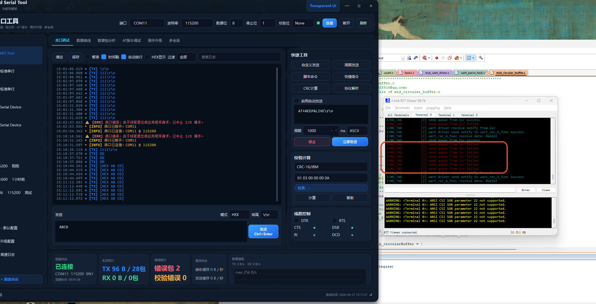
因为是邮箱，所以处理的消息很慢，容易failed
**后端**
>  app 后端获取到通知之后，依次将数据从循环缓冲区中取出
1. 对数据进行解包(检测到包头开始输出，检测到包尾结束输出)
2. 如果find 帧头，开始输出数据，并且时刻检测帧尾
3. 如果find 帧尾，结束输出数据，发送一个换行

> 因为在环形缓冲区里面已经用static把它声明为静态变量，所以在不同函数中访问的是同一个缓冲区实例，为此需要用一个全局指针来访问它，用一个api获取值

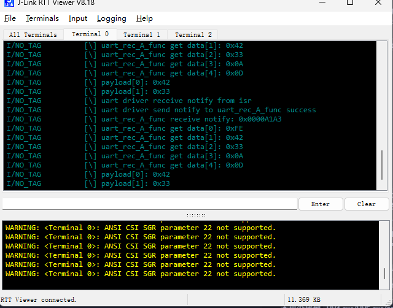


``` cpp
/******************************************************************************
 * @file uart_parse_task.c
 * @author Lumos (1456925916@qq.com)
 * @brief  
 * @version 0.1
 * @date 2026-05-14
 * 
 * @copyright Copyright (c) 2026
 * 
******************************************************************************/

/******************************** Include ************************************/
#include "uart_parse_task.h"
#include "freertos.h"
#include "task.h"
#include "elog.h"
#include "cmsis_os.h"
#include "queue.h"
#include "usart.h"
#include "mid_circular_buffer.h"
#include "bsp_uart_driver.h"
#include <string.h>
/******************************** Include ************************************/

/********************************* Define ************************************/
#define MAX_DATA_LENGTH 256
QueueHandle_t queue_irq_rec_A = NULL;
extern uint8_t uart1_rx_byte;

uint8_t buffer1[256] = {0};
uint8_t buffer2[256] = {0};

static circular_Buffer_t* gp_parse_circularBuffer = NULL;
static uint8_t effective_data[MAX_DATA_LENGTH] = {0};
static uint16_t g_effective_len = 0;
static uint8_t frame_cache[MAX_DATA_LENGTH] = {0};
static uint16_t frame_cache_len = 0;
/********************************* Define ************************************/


/******************************* Functions ***********************************/


/******************************************************************************
 * @brief  check UART data
 * 
 * @param data The UART data to be checked
******************************************************************************/
parse_data_t check_receive_data(void)
{
    uint32_t re_data = 0;

    if (NULL == queue_irq_rec_A)
    {
        log_e("queue_irq_rec_A is NULL");
        return PARSE_PAR_ERROR;
    }

    if (NULL == gp_parse_circularBuffer)
    {
        log_e("circular buffer is NULL");
        return PARSE_PAR_ERROR;
    }

    if (CIRCULAR_BUFFER_EMPTY == buffer_is_empty(gp_parse_circularBuffer))
    {
        xQueueReceive(queue_irq_rec_A, &re_data, portMAX_DELAY);
        if (0 != re_data)
        {
            log_i("uart_rec_A_func receive notify: 0x%08X", re_data);
        }
    }

    if (CIRCULAR_BUFFER_EMPTY == buffer_is_empty(gp_parse_circularBuffer))
    {
        return PARSE_DATA_ERROR;
    }
    /* Build one complete frame from the UART byte stream. */
    while (CIRCULAR_BUFFER_EMPTY != buffer_is_empty(gp_parse_circularBuffer))
    {
        uint8_t byte = 0;

        if (CIRCULAR_BUFFER_ERROR == get_data(gp_parse_circularBuffer, &byte))
        {
            log_e("get data from circular buffer failed");
            return PARSE_PAR_ERROR;
        }

        if ((0U == frame_cache_len) && (0xFE != byte))
        {
            log_w("discard byte before frame header: 0x%02X", byte);
            continue;
        }

        if (frame_cache_len >= MAX_DATA_LENGTH)
        {
            log_w("frame cache overflow, restart from byte: 0x%02X", byte);
            frame_cache_len = 0;
            if (0xFE != byte)
            {
                continue;
            }
        }

        frame_cache[frame_cache_len++] = byte;
        log_i("uart_rec_A_func get data[%d]: 0x%02X", frame_cache_len - 1U, byte);

        if ((frame_cache_len >= 2U) &&
            (0x0A == frame_cache[frame_cache_len - 2U]) &&
            (0x0D == frame_cache[frame_cache_len - 1U]))
        {
            memcpy(effective_data, frame_cache, frame_cache_len);
            g_effective_len = frame_cache_len;
            frame_cache_len = 0;
            return PARSE_DATA_OK;
        }
    }

    return PARSE_DATA_ERROR;
}

/******************************************************************************
 * @brief  parse UART data 
 * @note   解析 data 用于确认有用的数据 
 *          0xFE 开头
 *          0x0A0D 结尾
 * 做一个最长为256的数据检查，直到数据为 0x0A0D 结尾
 * @param data The UART data to be parsed
******************************************************************************/
parse_data_t __uart_parse(uint8_t* data, uint16_t len)
{
    if (NULL == data)
    {
        log_e("data is NULL");
        return PARSE_PAR_ERROR;
    }

    /* 最短帧: 0xFE + 至少1字节数据 + 0x0A + 0x0D = 4字节 */
    if (len < 4)
    {
        log_w("data length is too short: %d", len);
        return PARSE_PAR_ERROR;
    }

    /* 检查帧头 */
    if (data[0] != 0xFE)
    {
        log_w("data does not start with 0xFE, got 0x%02X", data[0]);
        return PARSE_PAR_ERROR;
    }

    /* 检查帧尾 0x0A 0x0D */
    if (data[len - 2] != 0x0A || data[len - 1] != 0x0D)
    {
        log_w("data does not end with 0x0A 0x0D");
        return PARSE_PAR_ERROR;
    }

    return PARSE_DATA_OK;
}


/******************************************************************************
 * @brief  check and parse UART data
 * 
 * @param argument 
******************************************************************************/
void uart_rec_A_func(void *argument)
{
  /* 获取 buffer，等待 uart_driver_fun 完成初始化 */
  do {
    get_circular_buffer(&gp_parse_circularBuffer);
    if (NULL == gp_parse_circularBuffer)
    {
      log_w("circular buffer not ready, retrying...");
      osDelay(10);
    }
  } while (NULL == gp_parse_circularBuffer);
  /* USER CODE BEGIN uart_rec_A_func */
    if (NULL != queue_irq_rec_A)
  {
    log_i("queue_irq_rec_A is not NULL");
  }
  /* 添加 邮箱 
     item size == 4 byte
     only one */
    queue_irq_rec_A = xQueueCreate(1, sizeof(uint32_t));
    if (NULL != queue_irq_rec_A)
  {
    log_i("queue_irq_rec_A create success");
  }
  else
  {
    log_e("queue_irq_rec_A create failed");
    for(;;)
    {
      osDelay(1000);
    }
  }

  

  /* Infinite loop */
  for(;;)
  {
   
   if (PARSE_DATA_OK == check_receive_data())
   {
       if (PARSE_DATA_OK == __uart_parse(effective_data, g_effective_len))
       {
           /* 打印有效载荷（去掉帧头帧尾）*/
           for (uint16_t i = 1; i < g_effective_len - 2; i++)
           {
               log_i("payload[%d]: 0x%02X", i - 1, effective_data[i]);
           }
       }
   }
    osDelay(1);
  }
  /* USER CODE END uart_rec_A_func */
}

```
#### 在解析线程中，加入checksum
1. 数据可能在打印后才发现，校验和不对
2. 先把有效数据线暂存起来，check 完成之后再打印出来

``` cpp
/******************************************************************************
 * @brief  check UART data checksum
 * 校验和算法，不定长
 * @note  数据最后一个字节为校验和，校验和为前面所有字节的累加和
 * @param data 
 * @param len 
 * @return parse_data_t 
******************************************************************************/
parse_data_t __check_sum(uint8_t* data, uint16_t len)
{
    if (NULL == data)
    {
        log_e("data is NULL");
        return PARSE_PAR_ERROR;
    }

    if (len < 2)
    {
        log_w("data length is too short for checksum: %d", len);
        return PARSE_PAR_ERROR;
    }

    uint8_t sum = 0;
    for (uint16_t i = 0; i < len - 1; i++)
    {
        sum += data[i];
    }

    if (sum != data[len - 1])
    {
        log_w("checksum mismatch: calculated 0x%02X, expected 0x%02X", sum, data[len - 1]);
        return PARSE_DATA_ERROR;
    }

    return PARSE_DATA_OK;
}
```
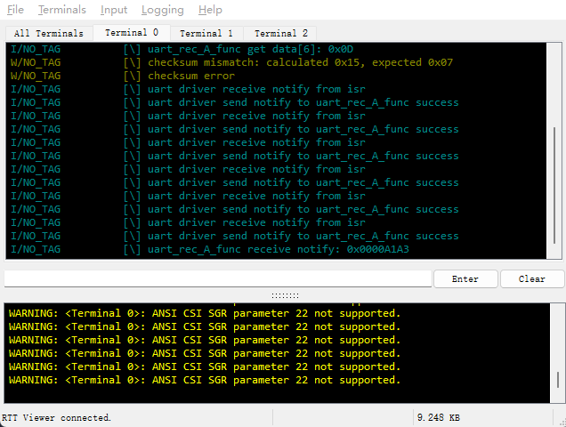


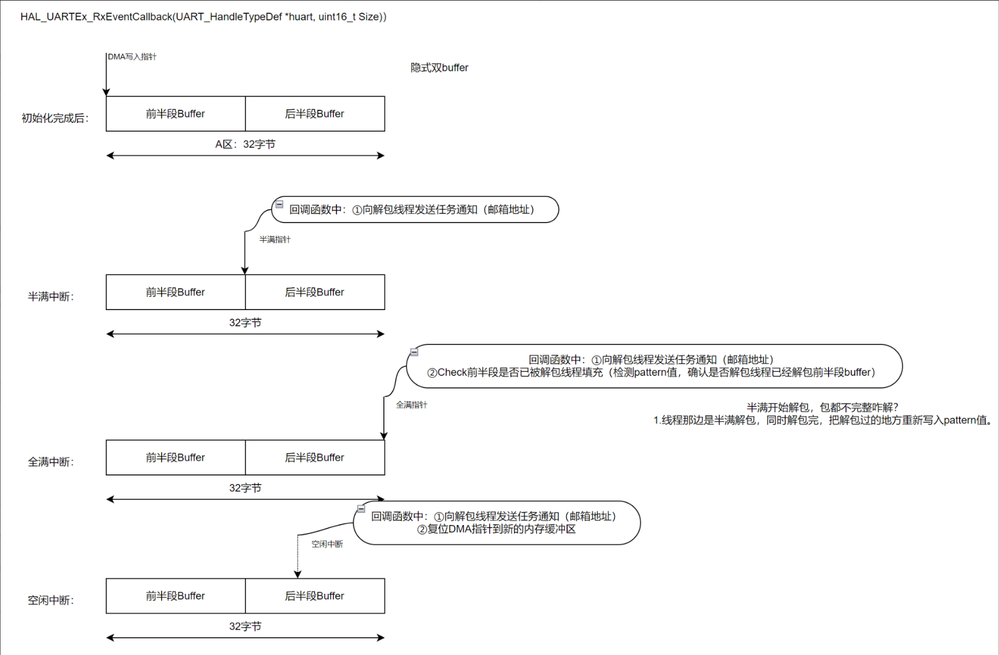
### 通过DMA来接收数据     
#### 使用空闲中断来接收数据  
单字节接收的方式效率比较低，尤其是在数据量较大的情况下，CPU需要频繁地处理中断，导致系统性能下降。使用DMA（Direct Memory Access）可以让数据直接从外设传输到内存，减少CPU的干预，提高数据传输效率。
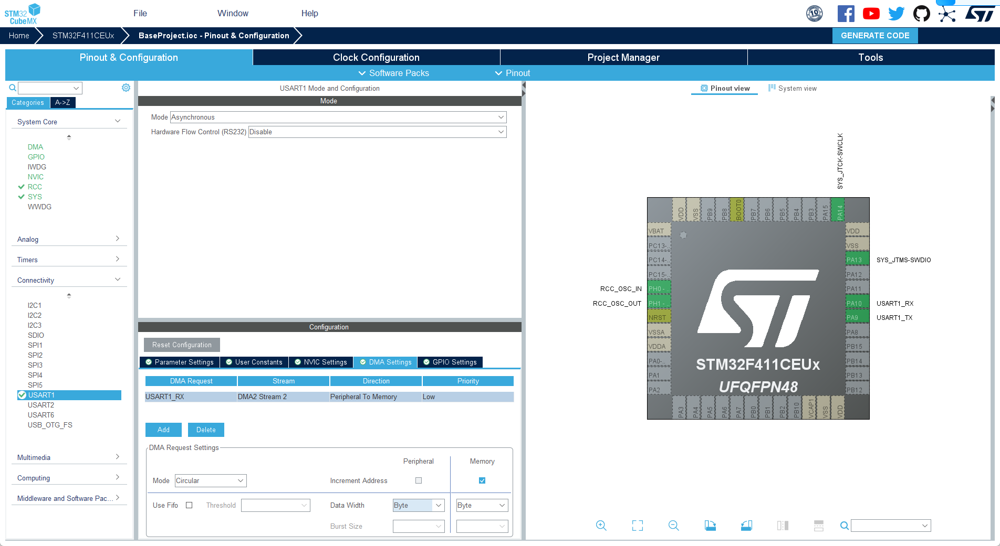

备份一下当前的代码，准备切换到DMA接收数据的方式

``` cpp

/******************************************************************************
 * @brief HAL库uart空闲中断回调函数，使用ciruclar_buffer实现uart接收中断回调函数
 * 
 * @param huart 
 * @param Size 
******************************************************************************/
void HAL_UARTEx_RxEventCallback(UART_HandleTypeDef *huart, uint16_t Size)
{
    if(huart->Instance == USART1)
    {
        log_i("uart receive to idle callback, received data size is %d", Size);
        __circular_buffer_irq();
        HAL_UARTEx_ReceiveToIdle_DMA(&huart1, gp_circularBuffer->data,
                                     CIRCULAR_BUFFER_SIZE);
    }
}
```
#### 偏移算法
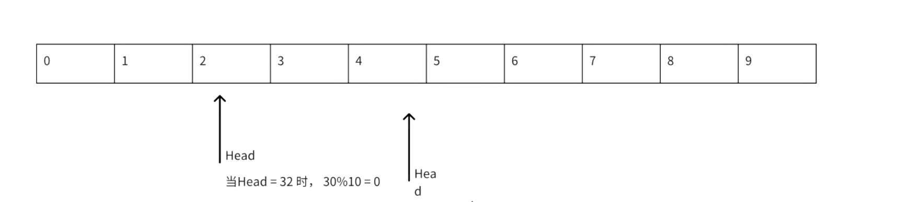
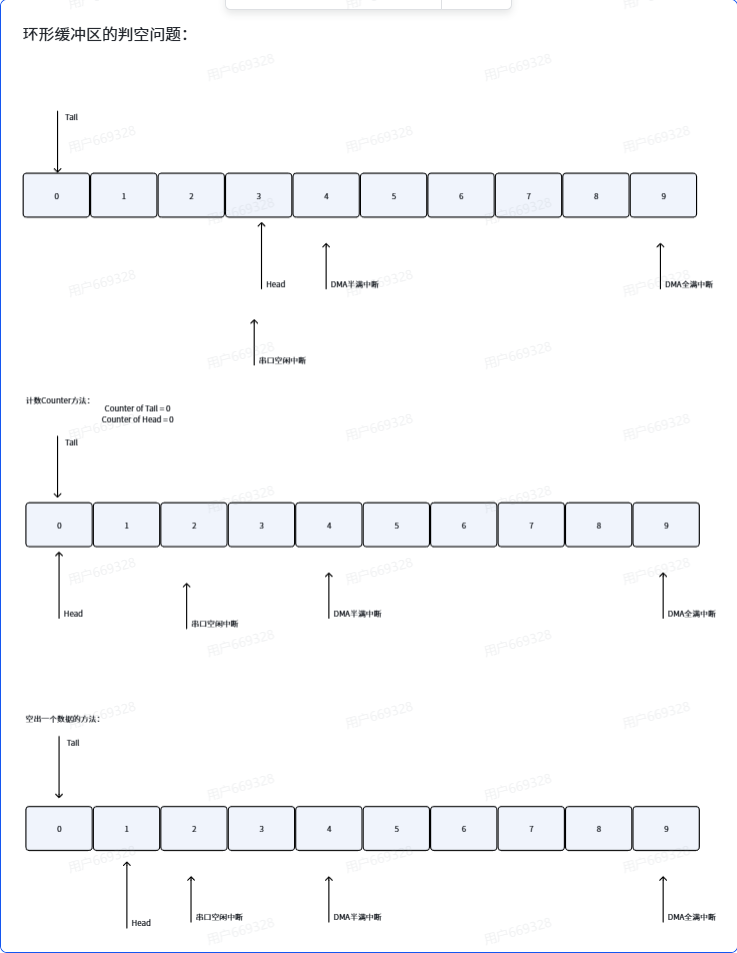


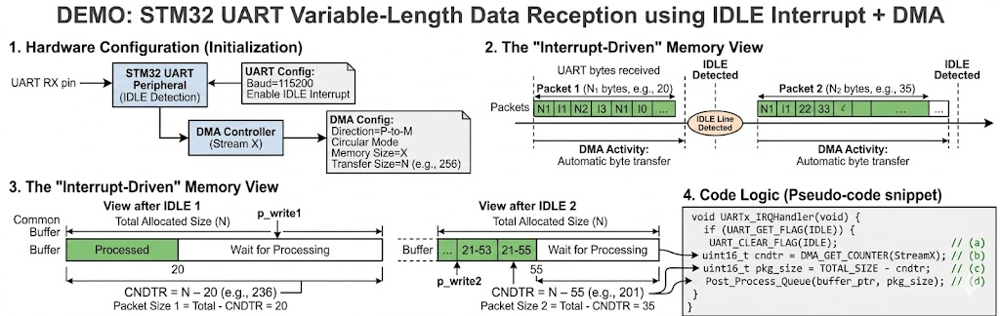

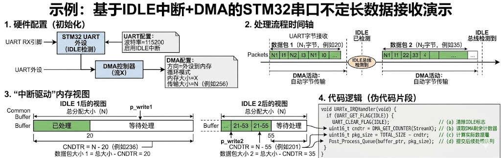


### 多命令下的串口设计思路
当一个系统当中，涉及到不同的cmd需要去parse的时候，用`switch - case`的模式是非常臃肿的，推荐使用表驱动的方式来设计串口协议的解析，这样可以让代码更加清晰，同时也更容易维护和扩展。
#### 直接访问表
这是最简单的一种方式，当输入的cmd是一个整数，并且这个整数可以直接作为数组的索引时，可以直接访问表来获取对应的处理函数。

``` cpp
// 定义一张数据表（直接放在常量区/Flash中，不占RAM）
const char* ErrorTable[] = {
    "Success",   // 索引 0
    "Timeout",   // 索引 1
    "CRC Error", // 索引 2
    "Low Power"  // 索引 3
};

/**
 * @brief 通过错误码获取错误字符串
 * @param error_code 错误码，应该在0到3之间
 * @return 对应的错误字符串，如果错误码无效则返回"Unknown"
 */
const char* GetErrorString(int error_code) {
    // 只需要做一次越界检查，直接查表返回
    if (error_code < 0 || error_code >= (sizeof(ErrorTable)/sizeof(char*))) {
        return "Unknown";
    }
    return ErrorTable[error_code];
}
``` 

#### 索引访问表/动作表
这是串口通信当中最常见的一种方式，当命令是不连续的时候，比如命令是(0x11,0x3A,0x7F)，这时候就不能直接访问表了，需要先做一个映射，把命令映射到一个连续的索引上，然后再通过索引访问表来获取对应的处理函数。
我们需要一张键值对的表，如果查出来是一个函数指针，这张表就变成了"动作表"，如果查出来是一个索引，这张表就变成了"索引访问表"。


``` cpp

typedef void (*CommandHandler)(uint32_t *parse_data, uint16_t len); // 定义一个函数指针类型，指向无参数无返回值的函数


typedef struct
{
    uint8_t cmd; // 命令码
    CommandHandler handler; // 对应的处理函数
} CommandTableEntry_t; // 定义一个结构体，包含命令码和对应的处理函数

// 具体的命令处理函数

void MotorStartHandler(uint32_t *parse_data, uint16_t len);
void MotorStopHandler(uint32_t *parse_data, uint16_t len);


// 构建索引表
const CommandTableEntry_t CommandTable[] = {
    {0x11, MotorStartHandler}, // 命令0x11对应MotorStartHandler函数
    {0x3A, MotorStopHandler}   // 命令0x3A对应MotorStopHandler函数
};

// 解析函数，根据输入的命令码查表并调用对应的处理函数
void ProcessCommand(uint8_t cmd, uint32_t *parse_data, uint16_t len) {
    // 遍历命令表，找到对应的处理函数并调用
    for (size_t i = 0; i < sizeof(CommandTable)/sizeof(CommandTableEntry_t); i++) {
        if (CommandTable[i].cmd == cmd) { // 找到匹配的命令码
            CommandTable[i].handler(parse_data, len); // 调用对应的处理函数
            return;
        }
    }
    // 如果没有找到匹配的命令码，可以选择返回错误或者忽略
    log_w("Unknown command: 0x%02X", cmd);
}
```

#### 阶梯访问表
当输入不是单一的确切值，而是一个范围区间时，直接访问和索引访问都不好用，这时候就需要阶梯访问表。

常见场景： 传感器数据（ADC值）映射为电量百分比、考试分数评定等级（90-100为A，80-89为B）。

``` cpp
typedef struct {
    uint16_t voltage_mv;  // 阶梯上限阈值
    uint8_t battery_pct;  // 对应的电量百分比
} BatteryCurve;

// 定义一条电池放电曲线表（必须按从小到大或从大到小排序）
const BatteryCurve BatTable[] = {
    {3300, 0},   // 低于 3300mV 算 0%
    {3600, 20},  // 3300 - 3600mV 算 20%
    {3800, 50},  // 3600 - 3800mV 算 50%
    {4000, 80},  // 3800 - 4000mV 算 80%
    {4200, 100}  // 4000 - 4200mV 算 100%
};

uint8_t GetBatteryPercentage(uint16_t current_mv) {
    uint8_t len = sizeof(BatTable) / sizeof(BatTable[0]);
    for (uint8_t i = 0; i < len; i++) {
        if (current_mv <= BatTable[i].voltage_mv) {
            return BatTable[i].battery_pct;
        }
    }
    return 100; // 超过最高阈值
}
```


#### 架构设计
当已经确认了使用表驱动的方式来设计串口协议解析之后，接下来就是要设计整个架构了，通常来说，架构设计需要考虑以下几个方面：

任何的动作架构都由已下3个部分组成：
1. 触发键(key/cmdID)：唯一标识，用于表里面配对
2. 动作函数(action handler)：当触发键被触发时要执行的函数
3. 上下文(context)：动作函数执行时需要的上下文信息，可以是一个结构体，包含了函数执行时需要的所有信息

> 核心思想：永远不要给动作函数传递散装的变量，而是封装好传递一个context 无论未来add多少参数，都不会改变函数的接口，函数的接口永远是一个context指针，这样就实现了函数接口的稳定性和可扩展性。

``` cpp
typedef struct 
{
    uint8_t  src_port;  // 数据来源端口（例如：UART1、UART2等）
    uint8_t* rx_payload; // 接收到的数据指针
    uint16_t payload_len; // 接收到的数据长度
    uint8_t* tx_buffer;  // 用于存放处理结果的发送缓冲区
    uint16_t* tx_len;    // 发送缓冲区的长度指针
} Context_t;


// 统一定义动作函数类型，所有的动作函数都必须符合这个接口
typedef void (*ActionHandler)(Context_t* context);

// 定义命令表项结构体，包含触发键和对应的动作函数
typedef struct 
{
    uint8_t cmd_id;       // 触发键，例如：命令ID
    ActionHandler handler; // 对应的动作函数
} CommandTableEntry_t;

```
这就是一个比较完整的表驱动架构设计，核心思想是通过一个统一的Context结构体来传递所有的上下文信息，所有的动作函数都遵循同一个接口，这样就实现了代码的清晰、可维护和可扩展。


##### 健壮性版本:统一错误码和自动应答
动作函数不应该直接调用底层的串口发送函数去回复数据，这违背了分层原则。动作函数只需将回复数据填入 Context.tx_buffer，并返回一个标准化错误码，由“调度器（Dispatcher）”统一打包发送。

``` cpp
// 动作函数实现示例
int32_t Handle_SetMotorSpeed(CmdContext_t* ctx) {
    if (ctx->rx_len != 4) {
        return ERR_INVALID_LENGTH; // 返回标准错误码
    }
    
    // 执行业务逻辑...
    uint32_t speed = /* 解析数据 */;
    Motor_SetSpeed(speed);

    // 填充回复数据
    ctx->tx_buffer[0] = 0x00; // 0x00 表示成功
    ctx->tx_len = 1;

    return ERR_SUCCESS; 
}
```


##### 终极形态：解耦的“分散注册”架构 (Linux Kernel 风格)

在常规设计中，你需要维护一个全局的数组（如 const ActionEntry_t CmdTable[] = {...}）。当团队多人协作时，每次加新命令都要去修改这个集中的大数组，极易引发代码冲突（Merge Conflict）。

顶级架构的设计思路是：消除集中式大表，实现分散注册。

利用编译器的特性（如 GCC 的 __attribute__((section("...")))），我们可以让每个动作函数在实现的地方“自动”把自己注册进表中。

原理与实现步骤：

1. 定义注册宏： 在代码的任何一个 .c 文件中，写完函数后，用一个宏把 cmd_id 和函数指针绑定，并告诉链接器把它们统一放到名为 .cmd_table 的内存段中。
``` cpp
// 宏定义：将结构体放入自定义的内存段中
#define EXPORT_CMD(id, func) \
    const ActionEntry_t _cmd_##id __attribute__((used, section(".cmd_table"))) = {id, func}

// 在 Motor.c 中编写业务并直接注册，无需修改其他文件！
int32_t Handle_MotorStart(CmdContext_t* ctx) { /*...*/ return ERR_SUCCESS; }
EXPORT_CMD(0x10, Handle_MotorStart);

// 在 Sensor.c 中编写业务并直接注册！
int32_t Handle_ReadTemp(CmdContext_t* ctx) { /*...*/ return ERR_SUCCESS; }
EXPORT_CMD(0x11, Handle_ReadTemp);
```


2. 链接器脚本： 在链接阶段，链接器会把所有 .cmd_table 段的数据合并成一个连续的表。我们需要在链接器脚本中定义这个段的位置和大小。
``` cpp

// 链接器脚本中导出的外部符号，代表自定义段的起始和结束地址
extern const ActionEntry_t _cmd_table_start;
extern const ActionEntry_t _cmd_table_end;

void Dispatcher_Run(uint8_t cmd_id, CmdContext_t* ctx) {
    const ActionEntry_t* entry;
    
    // 遍历这块连续的内存区域
    for (entry = &_cmd_table_start; entry < &_cmd_table_end; entry++) {
        if (entry->cmd_id == cmd_id) {
            int32_t result = entry->handler(ctx);
            // 调度器根据 result 统一处理应答...
            return;
        }
    }
    // 未找到命令处理逻辑
}
```

**架构设计避坑指南**

- 表必须存在只读区： 如果使用的是集中定义的数组表，务必加上 const 关键字。这样这张表会被编译进 Flash/ROM 中，不会占用宝贵的 RAM 空间。
- 耗时任务的处理： 动作函数（Handler）必须是非阻塞的。如果某个命令需要执行 2 秒钟（比如等待电机复位），Handler 应该只负责“置位标志”或“发送消息给 RTOS 队列”，然后立刻返回，绝不能在 Handler 里写 Delay()。
- 查表效率优化： 如果命令数量少于 50 个，简单的 for 循环线性查找（$O(n)$）完全足够。如果命令上百个，可以要求注册时按 ID 排序，调度器使用二分查找（$O(\log n)$）。

#### 架构设计映射表
当有多个维度需要映射时，可以使用多维映射表来设计架构，这样可以让代码更加清晰，同时也更容易维护和扩展.

不仅要映射命令，还要考虑数据（Payload）怎么转换。比如：BLE 发来的开锁命令带 1 字节密钥，而 MCU 内部开锁需要 2 字节。我们在表里加一个“数据转换函数指针”，专门负责把外部数据转换成内部格式。

``` cpp

// 定义数据转换函数指针
typedef void (*PayloadConverter)(uint8_t* src_data, uint16_t src_len, uint8_t* dest_data, uint16_t* dest_len);

// 映射表条目结构体
typedef struct {
    uint8_t          ble_cmd;       // 外部（BLE）命令
    uint8_t          internal_cmd;  // 内部统一命令
    PayloadConverter convert_func;  // 数据转换逻辑，不需要转换就填 NULL
} BleMapEntry_t;

// 实际的数据转换示例：BLE 1字节转MCU 2字节
void Convert_SeatLockData(uint8_t* src, uint16_t src_len, uint8_t* dest, uint16_t* dest_len) {
    dest[0] = src[0]; // 复制密钥
    dest[1] = 0x55;   // 补上MCU需要的验证尾
    *dest_len = 2;
}

// 注册映射表
const BleMapEntry_t BleMapTable[] = {
    {0x17, 0x11, Convert_SeatLockData}, // 0x17映射为0x11，并调用转换函数
    {0x18, 0x12, NULL}                  // 0x18映射为0x12，不需要数据转换
};

// BLE 接收中断/回调函数
void BLE_Parse_Handler(uint8_t* ble_rx_buf, uint16_t ble_rx_len) {
    uint8_t ble_cmd = ble_rx_buf[0]; // 假设第0字节是Cmd ID
    
    // 查表
    for (uint8_t i = 0; i < sizeof(BleMapTable)/sizeof(BleMapTable[0]); i++) {
        if (BleMapTable[i].ble_cmd == ble_cmd) {
            uint8_t mcu_payload[16] = {0};
            uint16_t mcu_len = 0;
            
            // 如果有转换函数就转换，没有就直接复制
            if (BleMapTable[i].convert_func != NULL) {
                BleMapTable[i].convert_func(&ble_rx_buf[1], ble_rx_len - 1, mcu_payload, &mcu_len);
            } else {
                memcpy(mcu_payload, &ble_rx_buf[1], ble_rx_len - 1);
                mcu_len = ble_rx_len - 1;
            }
            
            // 翻译完成，直接喂给 MCU 的主调度器
            MCU_Main_Dispatcher(BleMapTable[i].internal_cmd, mcu_payload, mcu_len);
            return;
        }
    }
    // 异常处理：没找到映射
}
```


