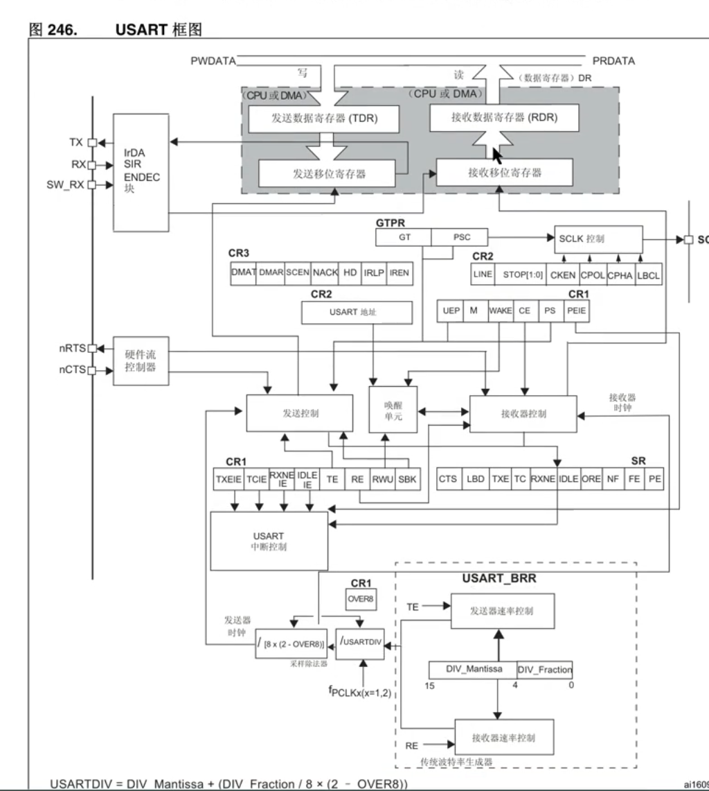
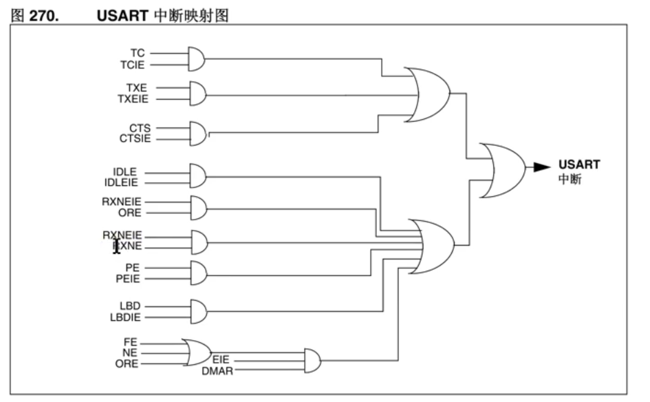
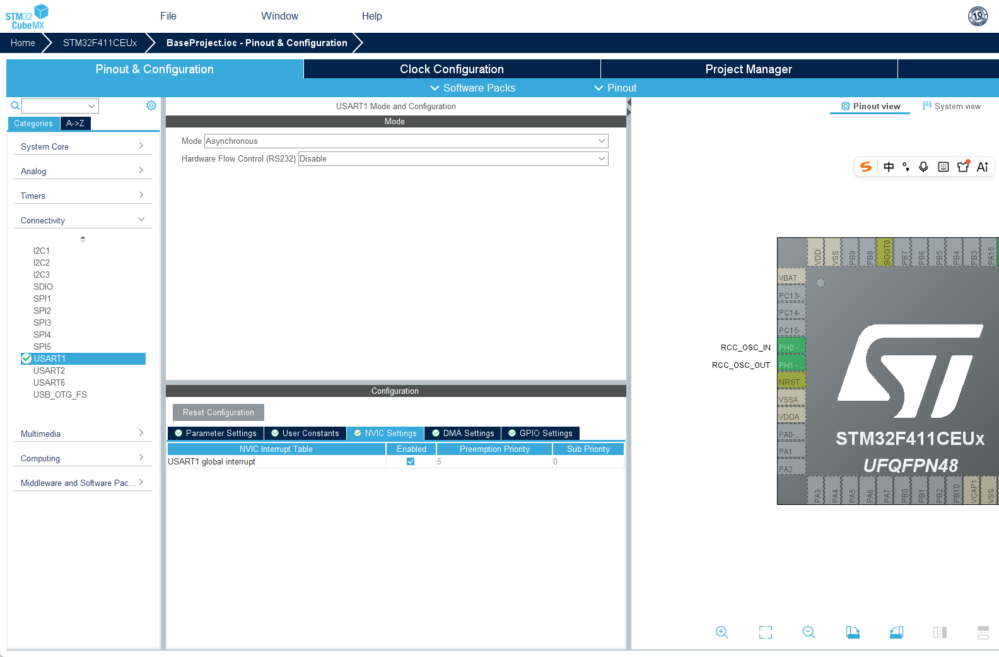
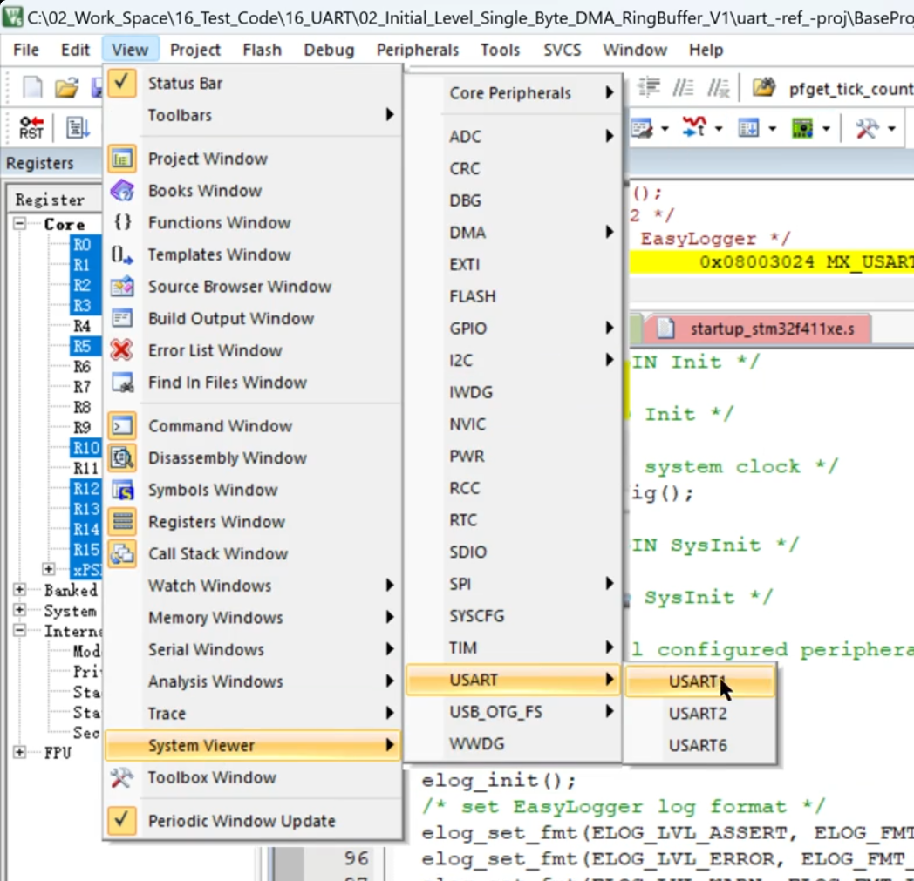
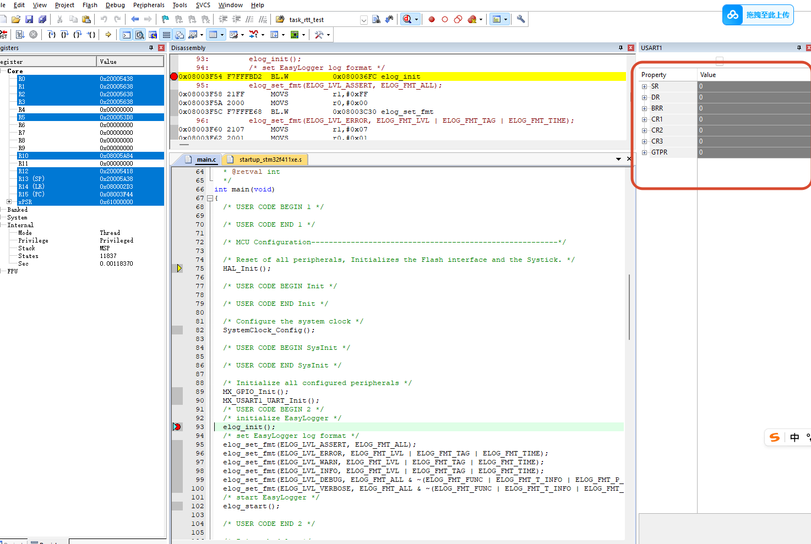
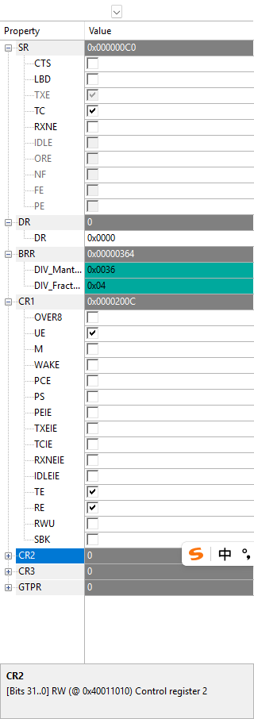
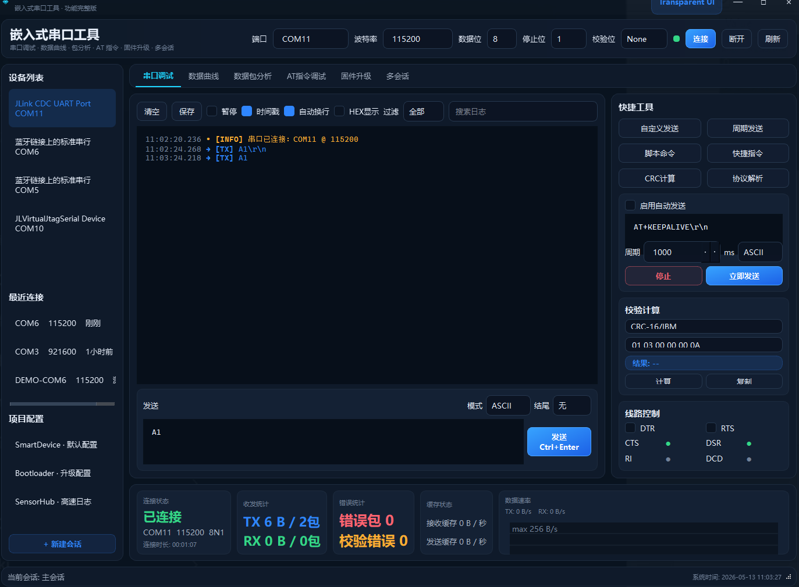
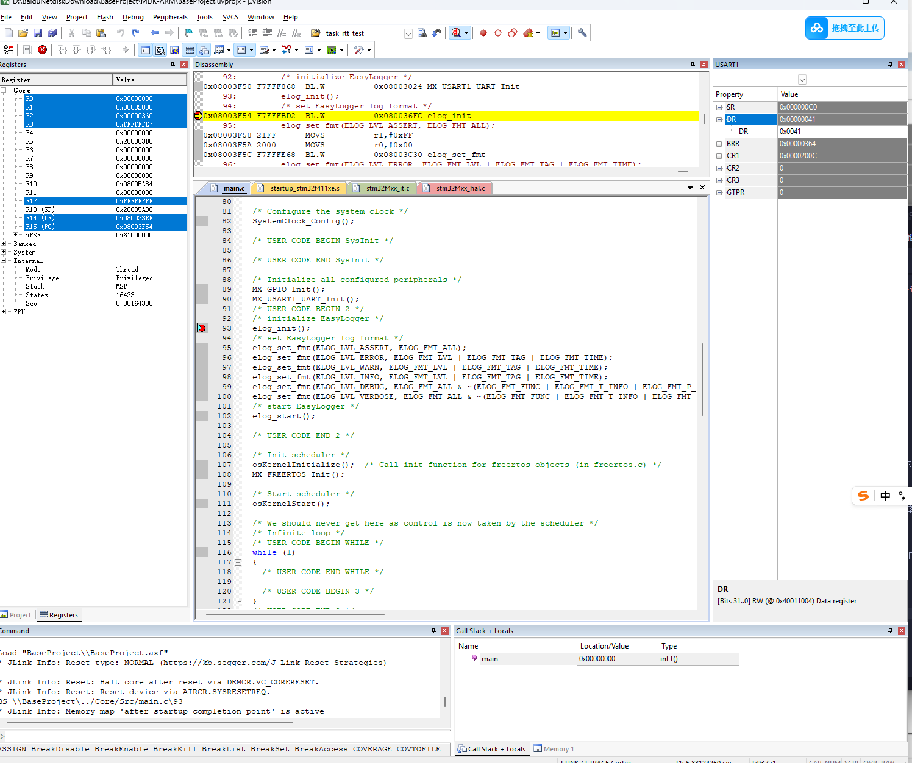
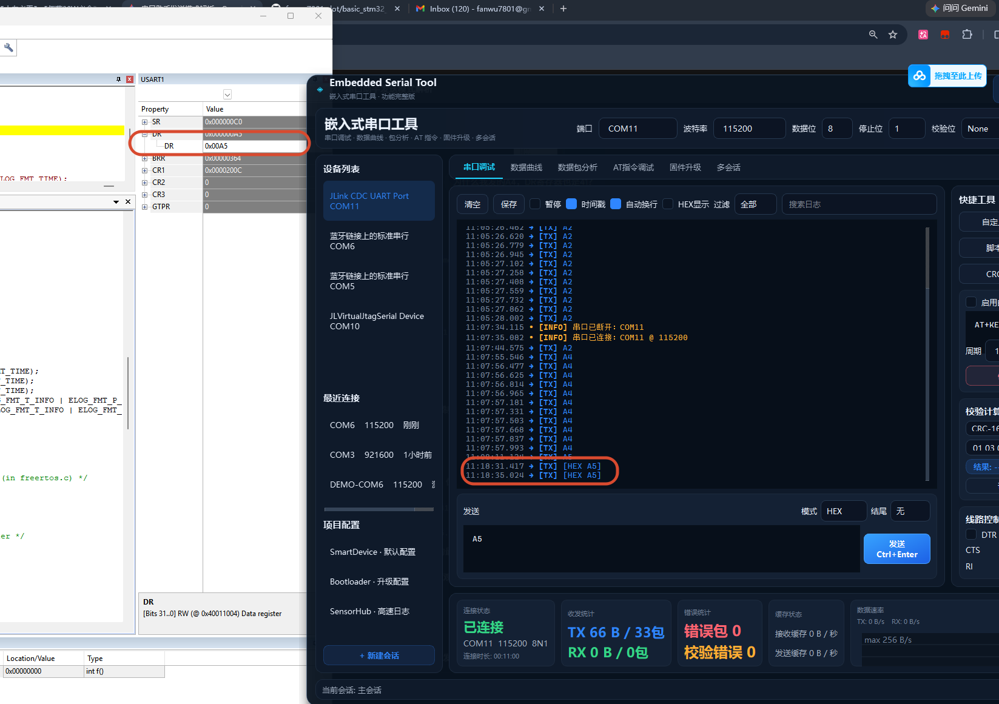
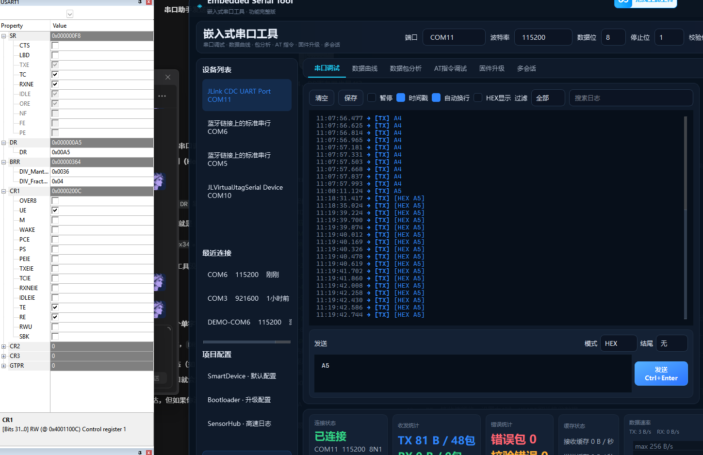

### 移植RTT
可以看一下[RTT移植文档](https://www.rt-thread.org/document/site/#/rt-thread-version/rt-thread-master/rt-thread-porting/porting-overview)。

### USART框图

需要使能CR1和SR寄存器

rx线的电平变化的本质都是由adc时钟在这些采样点上采样的结果，所有的GPIO设备都是

**- 字符接收**

USART 接受期间，通过RX引脚移入数据的最低位有效位，该模式下，DR寄存器的缓冲区位于内部总线和接受寄存器之间，接受到字符的时候，rxne寄存器会被置位。说明移位寄存器的内容已传送到RDR当中
如果RXNEIE的位置1，那么就会产生中断。

RXNE ： 读取寄存器不为空(read data register not empty)
>当RDR寄存器的内容已传输到USART_DR 寄存器时，该位置1，如果USART_CR1寄存器rxneie=1会产生中断
ORE  : overrun error，溢出错误
> 数据没有及时读取，导致新的数据覆盖了旧的数据

创建usart1

移植完成之后，在elog_init()打上断点
然后打开view -> systeam viewer -> usart usart1

这样就和串口的说明一样了

打开全速运行
这里的SR寄存器的TC标志位是发送完成标志位，这里是打开的表示发送完成了，说明串口发送数据成功了。

**BRR** 寄存器是波特率寄存器，用于设置USART的通信速率。BRR寄存器的值由以下公式计算得出：
BRR = Fck / BaudRate
其中，Fck是USART的时钟频率，BaudRate是所需的通信速率。例如，如果USART的时钟频率为16 MHz，所需的通信速率为115200 bps，那么BRR寄存器的值可以计算如下：
BRR = 16,000,000 / 115,200 ≈ 138.89

**CR1** 寄存器是控制寄存器1，用于配置USART的工作模式和功能。CR1寄存器的位定义如下：
TE：发送使能位，设置为1时，USART可以发送数据。
RE：接收使能位，设置为1时，USART可以接收数据。

打开串口发送数据，然后全速运行，观察寄存器数据变化

这里注意要用HEX模式发送