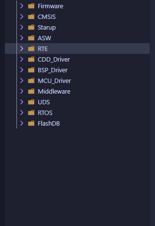

# 摩托车 VCU 架构入门

本文面向刚接触车载嵌入式软件的读者，说明摩托车 VCU 软件通常由哪些部分组成，以及应当怎样阅读一个实际工程。

文中的工程组织参考 `wybt_dcu-main-fuel` 项目的 `README.md`：该项目使用 **FreeRTOS**，README 的硬件平台项列出主控为 **GD32E513VET6**、蓝牙 SoC 为 **FR8016HA**；工程使用 CMake 构建，并在应用、RTE、BSP、中间件和驱动目录中组织源文件。

注意：README 的产物名是 `JFTS_DCU_Fuel`。这说明它是一个具体 DCU/Fuel 软件工程；仅凭 README 不能断言其已经覆盖完整摩托车 VCU 的全部功能。因此，本文借它学习“车载控制软件如何分层”，不把项目中未明确的功能当作既定事实。



---

## 1. 先理解：VCU 是什么

VCU 是 **Vehicle Control Unit，整车控制器**。它不直接等于电机控制器，也不只是一个 CAN 网关。

以电动摩托车为例，VCU 常需要接收油门、刹车、档位、车速、电池管理系统（BMS）和电机控制器的信息，然后根据车辆状态决定：

- 是否允许上高压或进入可骑行状态；
- 请求多少驱动扭矩或能量回收扭矩；
- 电池、电机或通信异常时怎样限扭或禁止驱动；
- 向仪表、BMS、电机控制器发送什么状态和命令；
- 怎样保存、读取和清除诊断故障。

燃油摩托车、混动摩托车或专用 DCU 的具体控制对象会不同，但软件的基本问题一致：**采集输入、判断状态、执行控制、处理故障、通过通信发布结果。**

---

## 2. 不要把“参考 AUTOSAR”理解成“必须使用 AUTOSAR”

汽车领域常用 AUTOSAR 的分层思想。小型摩托车控制器或已有项目不一定采用完整 AUTOSAR，也不需要为了分层而引入整套 AUTOSAR 工具链。

真正需要保留的是它的工程原则：

```text
业务控制逻辑不直接操作寄存器。
硬件差异集中在底层。
应用通过稳定接口读取输入、发布请求和获取诊断状态。
```

参考项目的 README 已经体现出类似分层：ASW、RTE、BSP/驱动、RTOS、UDS。可以按下面的简化结构理解：

```text
ASW / 应用功能
        ↓ 通过接口读写
RTE / 服务与接口层
        ↓ 调用
BSP、驱动、中间件、FreeRTOS
        ↓
GD32 MCU、CAN、ADC、GPIO、Flash、蓝牙等硬件
```

这张图描述的是依赖方向，而不是要求每层只能有一个目录。

---

## 3. 各层到底做什么

### 3.1 ASW：车辆功能逻辑

ASW（Application Software）是“车辆应该怎么工作”的代码。README 指出，该项目的 ASW 逻辑代码由 Simulink 模型生成。

对初学者来说，可以把 ASW 理解为做决策的一层：

```text
输入：油门开度、刹车状态、BMS 允许功率、电机状态
处理：状态机、合理性检查、限值计算、扭矩仲裁
输出：驱动使能、扭矩请求、故障状态、仪表请求
```

ASW 应该写成“意图”，而不是“硬件操作”。例如：

```c
if (battery_voltage_low == true)
{
    vcu_request_warning_lamp(true);
}
```

这段代码表达的是“欠压时请求点亮警告灯”。它不应知道警告灯连接到哪个 GPIO，也不应直接写 GPIO 寄存器。

### 3.2 RTE：应用与底层之间的接口

RTE（Runtime Environment）可以理解为应用层和底层软件之间的“翻译层”。完整 AUTOSAR 中 RTE 通常自动生成；在许多小型或自研项目中，它可能是手写接口、服务模块或管理器。

它的价值是让 ASW 不依赖硬件细节：

```c
Platform_ErrorCode_t rte_read_battery_voltage(int16_t *voltage_v_x10);
Platform_ErrorCode_t rte_write_motor_torque_request(int16_t torque_nm_x10);
```

ASW 只知道“读取已经换算好的电池电压”和“发布扭矩请求”。至于数据来自 ADC 还是 CAN、是否滤波、CAN ID 是多少，应该由 RTE 以下的模块负责。

### 3.3 BSP 与驱动：让软件能操作板子

BSP（Board Support Package）与驱动负责硬件相关工作，例如：

- 配置时钟、GPIO、中断和启动顺序；
- 操作 CAN、ADC、PWM、Flash、串口等外设；
- 按实际原理图完成引脚映射和电压/电流换算；
- 提供板级下载、调试和 OpenOCD 配置。

README 中将板级驱动标为 `BSP_DRV`，底层驱动抽象标为 `MCU_DRV`。初学时可以先记住：**BSP 更关心这块板子怎么连接；MCU 驱动更关心 MCU 外设怎么使用。**

### 3.4 FreeRTOS：让多个周期任务有序运行

README 明确该项目使用 FreeRTOS。它通常负责任务、消息队列、互斥锁、软件定时器等运行机制。

VCU 常见的任务划分可能是：

| 周期/事件 | 典型工作 |
| --- | --- |
| CAN 接收中断或接收任务 | 收报文、检查长度、更新时间戳、通知上层 |
| 10 ms 控制任务 | 输入有效性检查、状态机、扭矩和限扭计算 |
| 100 ms 诊断任务 | 故障去抖、DTC 管理、诊断状态更新 |
| 通信发送任务 | 按周期发送电机、仪表或诊断报文 |

这些周期只是常见示例，不是 README 对该项目的具体调度承诺。实际周期要以需求、CPU 负载和控制对象的实时性为准。

### 3.5 UDS：诊断通信

README 列出 `UDS` 模块。UDS（Unified Diagnostic Services）是车辆诊断协议，常用于读取故障码、读取数据、执行例程、软件升级等。

初学阶段先区分两件事：

- **CAN** 是通信总线，负责把报文传出去；
- **UDS** 是运行在诊断通信之上的服务协议，规定“读取故障码、清除故障码”等请求的含义。

因此，业务控制不能把“收到一帧 CAN 报文”直接当成“UDS 功能已经完成”。CAN 驱动、传输层、UDS 服务和诊断数据管理各有边界。

---

## 4. 一条信号如何从硬件走到控制逻辑

以“电池电压参与欠压保护”为例：

```text
电压采样引脚 / BMS CAN 报文
        ↓
ADC 或 CAN 驱动：获取原始数据
        ↓
BSP/信号适配：换算单位、检查范围、记录时间戳
        ↓
RTE/服务接口：提供统一的电池电压快照
        ↓
ASW：判断是否欠压，决定是否限扭、告警或禁止驱动
        ↓
RTE/通信适配：发布仪表状态或电机扭矩请求
```

这条链路最重要的不是层数，而是每一步都清楚回答：

1. 数据来自哪里？
2. 当前值是否可信、是否超时？
3. 单位是什么？
4. 谁可以修改它？
5. 结果最终发给谁？

---

## 5. 与 `cfg / ctx / data / ops` 的关系

上一节“数据模型设计”给出了一种非常适合 VCU 的对象划分：

```text
cfg   固定规则：CAN ID、周期、扭矩上限、阈值、车型配置
ctx   运行过程：状态机、报文超时、去抖计数、任务内部状态
data  对外快照：油门、车速、BMS 输入、扭矩请求、故障状态
ops   行为接口：初始化、周期运行、CAN 接收、读取快照、模式请求
```

例如，CAN 报文超时 `100 ms` 是规则，应在 `cfg`；“上一次收到 BMS 报文的时间”是运行过程，应在 `ctx`；“当前 BMS 数据是否超时”是上层需要知道的事实，应在 `data`；“处理一帧 CAN 数据”的函数属于 `ops`。

这个划分能避免一个常见错误：把 CAN 接收缓存、控制状态机、车辆信号和外部命令全塞进一个巨大结构体，让模块之间可以随意改数据。

---

## 6. 如何阅读参考工程

建议按“先运行、再跟链路、最后改功能”的顺序阅读。

### 第一步：确认构建和调试入口

README 给出的 CMake 构建方式是：

```bat
cmake --preset gcc-arm-debug
cmake --build --preset firmware
```

构建结果位于 `build\cmake`，包括：

- `JFTS_DCU_Fuel.elf`：用于调试的可执行文件；
- `JFTS_DCU_Fuel.bin`：常见的烧录镜像；
- `JFTS_DCU_Fuel.hex`：另一种常见烧录格式；
- `JFTS_DCU_Fuel.map`：链接映射，用于分析代码和 RAM/Flash 占用。

README 还提供 `syntax` 目标，可用于检查可移植 UDS 核心的语法：

```bat
cmake --build build\cmake --target syntax
```

调试使用 Cortex-Debug、OpenOCD 和 J-Link SWD；对应配置文件为 `BSP/Firmware/openocd_gdlink.cfg`。这些是项目实际 README 给出的入口，初学者应先确保它们可用，再分析业务逻辑。

### 第二步：从启动入口找到任务

从 `main`、板级启动文件或 FreeRTOS 任务创建处开始，回答：

- 创建了哪些任务？它们的周期或触发条件是什么？
- CAN 接收数据先进入哪个模块？
- ASW 在哪个任务或函数中运行？
- UDS 请求在哪里被分发？

不要一开始就搜索“扭矩”然后修改。先找到数据是怎样进入、被谁调用、最后怎样发出的，才能避免改错层。

### 第三步：选一条完整链路追踪

优先选择容易观察的功能，例如 CAN 信号、一个 ADC 采样量或一个诊断 DID：

```text
驱动初始化 → 数据接收/采样 → 信号换算 → RTE 接口 → ASW 使用 → CAN/诊断输出
```

能完整走通一条链路后，再学习状态机、故障管理和扭矩控制，效率会高很多。

---

## 7. 初学者最容易混淆的概念

| 概念 | 简单理解 | 不应混同为 |
| --- | --- | --- |
| VCU | 做整车控制决策的控制器或软件功能 | 单纯 CAN 网关或电机控制器 |
| DCU | 某个领域控制单元，范围取决于项目定义 | 必然等于完整 VCU |
| ASW | 车辆功能与算法逻辑 | 直接访问寄存器的代码 |
| RTE | 应用和基础软件之间的稳定接口/服务层 | 必然是完整 AUTOSAR 自动生成代码 |
| BSP | 与具体板卡、引脚和启动相关的软件 | 所有业务算法 |
| FreeRTOS | 任务调度和资源管理机制 | 车辆控制策略本身 |
| UDS | 诊断服务协议 | CAN 驱动本身 |

---

## 8. 下一步学习顺序

1. 先完成一次构建，知道 `.elf`、`.bin`、`.map` 分别是什么。
2. 找到 FreeRTOS 任务创建处，画出任务与周期。
3. 选一条 CAN 或 ADC 信号走完整数据链路。
4. 阅读 `cfg / ctx / data / ops` 数据模型，把信号的配置、过程、快照和接口分开。
5. 再进入 VCU 状态机、扭矩仲裁、故障诊断和通信超时等控制主题。

入门阶段的目标不是马上改出一个控制功能，而是先能清楚说明：**一个输入从哪里来，经过哪些层，在哪个任务里被处理，最后影响了哪个输出。**
