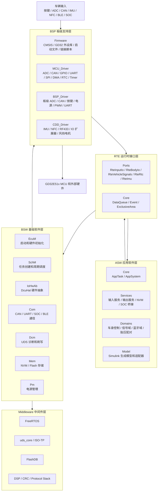
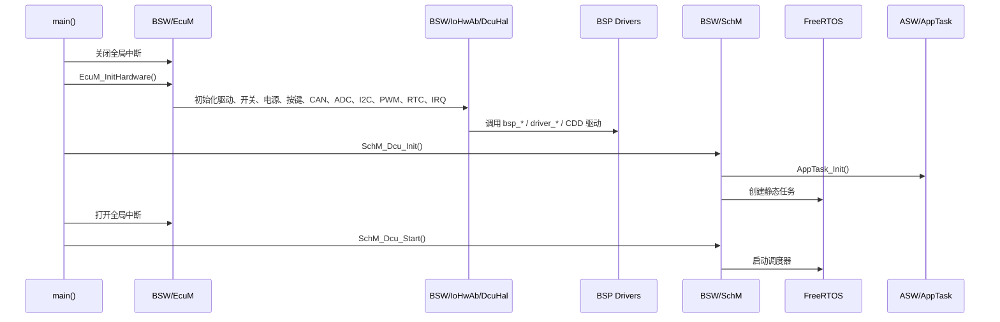
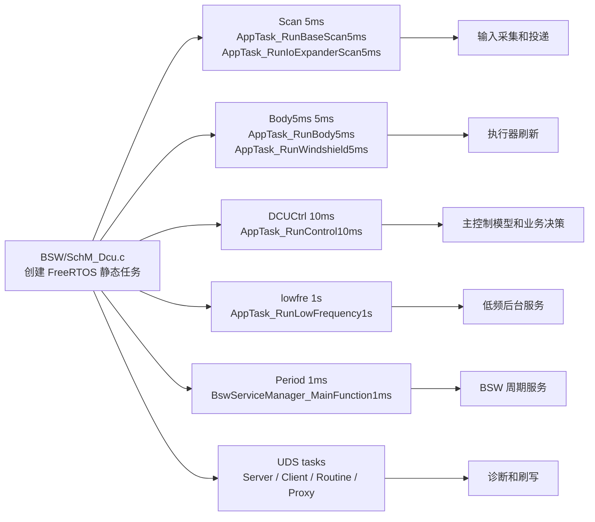
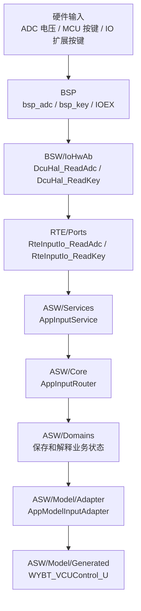
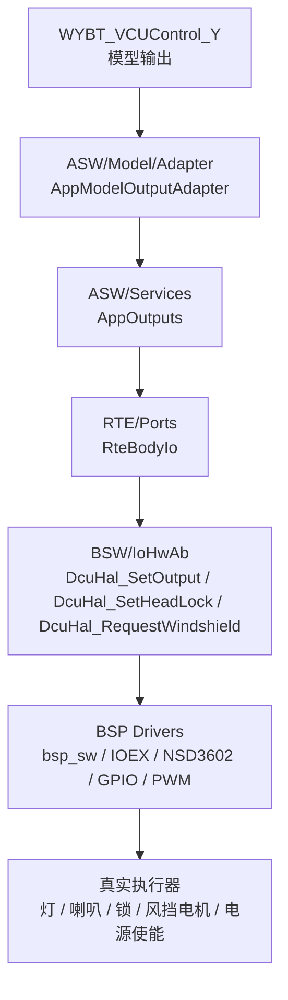

# 摩托车 VCU 架构设计

本文面向刚接触车载嵌入式软件的读者，基于下面这个真实工程目录来讲解架构：

```text
C:\Users\14569\Desktop\五羊本田\software\DCU_WYBT\WYBT_DCU_Hybrid_HDV1.3\WYBT_DCU_Hybrid_HDV1.3
```

这份文档不是抽象地介绍“什么是 AUTOSAR”，而是带着你看一个实际摩托车 VCU/DCU 工程应该怎样分层、怎样启动、怎样跑任务、怎样从硬件输入走到应用逻辑，再从应用逻辑控制真实输出。

工程的目标芯片是 **GD32E51x Cortex-M33**。从目录和 README 可以看出，它采用了比较清晰的分层结构：

```text
ASW  应用软件层
RTE  运行时接口层
BSW  基础软件层
BSP  板级支持层
Middleware 中间件层
```

初学者先记住一句话：

```text
ASW 负责“车应该怎么工作”
RTE 负责“应用怎么稳定访问底层”
BSW 负责“系统基础能力”
BSP 负责“这块板子和芯片怎么操作”
Middleware 负责“可复用的通用组件”
```

---

## 1. 先看总体架构

这个工程的核心分层可以画成下面这样：



图里有两条方向：

- **输入方向**：硬件信号从 BSP 往上走，最后被 ASW 消费。
- **输出方向**：ASW 计算出控制意图，通过 RTE、BSW、BSP 操作真实硬件。

很多新手读代码会犯一个错误：一看到按键、灯、CAN，就直接去 BSP 找逻辑。实际应该先分清楚：

- BSP 里通常是“怎么读这个 GPIO、怎么启动 ADC、怎么发 CAN 帧”；
- ASW 里才是“按下这个键以后车辆应该做什么”。

---

## 2. 每一层到底负责什么

### 2.1 ASW：车辆业务逻辑

`ASW` 是 Application Software，也就是应用软件层。它回答的是车辆功能问题：

- 当前车辆处于什么状态？
- 按键、刹车、转把、CAN 信号、蓝牙、NFC、IMU 数据代表什么含义？
- 灯、喇叭、锁、风挡、SOC 电源应该怎么动作？
- Simulink 模型需要哪些输入？
- 模型输出要怎样变成 CAN 信号、执行器命令或保存数据？

当前工程中，ASW 的关键目录是：

| 目录 | 作用 |
| --- | --- |
| `ASW/Core/` | 应用层入口和主周期组织，例如 `AppTask.c`、`AppSystem.c`。 |
| `ASW/Services/` | 应用服务，例如输入采集、输出处理、NVM、SOC 桥接、CAN 发送发布。 |
| `ASW/Domains/` | 业务域状态，例如车身控制、信号域、蓝牙域、胎压配对。 |
| `ASW/Model/Adapter/` | Simulink 模型适配层，负责把工程数据映射到模型输入和输出。 |
| `ASW/Model/Generated/` | Simulink 生成代码，例如 `WYBT_VCUControl.c/.h`。 |
| `ASW/Types/` | 应用层共享类型。 |

初学者可以把 ASW 理解成“驾驶规则和车辆行为的大脑”。它不应该直接操作寄存器，也不应该直接关心某个灯接在哪个 GPIO 上。

例如，ASW 更应该表达这种意图：

```c
RteBodyIo_SetOutput(RTE_BODY_IO_OUT_HORN, 1U);
```

而不是在应用逻辑里写：

```c
gpio_bit_set(GPIOB, GPIO_PIN_3);
```

前者表示“我要打开喇叭”，后者表示“我要操作某个芯片引脚”。车辆业务逻辑应该尽量使用前者。

### 2.2 RTE：应用和底层之间的接口

`RTE` 是 Runtime Environment，运行时接口层。它是 ASW 和底层之间的“翻译层”。

当前工程的 RTE 主要有两类内容：

| 目录 | 作用 |
| --- | --- |
| `RTE/Ports/` | 面向 ASW 的端口接口，例如输入、输出、CAN 信号、RTC、IMU、NFC、BLE、SOC。 |
| `RTE/Core/` | 运行时基础设施，例如数据队列、事件、临界区。 |

举一个喇叭按键的例子。ASW 只认识：

```text
RTE_INPUT_IO_KEY_HORN
```

它不关心喇叭按键来自 MCU 直连 GPIO，还是来自 IO 扩展芯片。映射关系在 `RTE/Ports/RteInputIo.c` 里：

```text
RteInputIo_ReadKey(RTE_INPUT_IO_KEY_HORN)
  -> DcuHal_ReadKey(DCU_HAL_KEY_HORN)
  -> BSP 读取真实硬件状态
```

RTE 的价值是：当硬件接线变化时，尽量不要让 ASW 业务逻辑大面积变化。

### 2.3 BSW：系统基础软件

`BSW` 是 Basic Software，基础软件层。它提供系统级能力，例如：

- ECU 启动；
- FreeRTOS 任务创建；
- 任务周期调度；
- 硬件抽象；
- CAN、UART、SOC、BLE 通信；
- UDS 诊断和刷写；
- NVM/Flash 存储；
- 电源管理、休眠、唤醒。

当前工程中，BSW 的关键目录是：

| 目录 | 作用 |
| --- | --- |
| `BSW/EcuM/` | ECU Manager，系统入口、冷启动、唤醒、硬件初始化流程。 |
| `BSW/SchM/` | Scheduler Manager，创建 FreeRTOS 静态任务并安排周期 runnable。 |
| `BSW/Os/` | OS 适配层，把 FreeRTOS API 包装成工程统一接口。 |
| `BSW/IoHwAb/` | IO Hardware Abstraction，硬件抽象层，核心文件是 `DcuHal.c`。 |
| `BSW/Com/` | 通信基础软件，包括 CAN 接口、CAN 矩阵、UART、SOC/BLE 传输。 |
| `BSW/Dcm/` | Diagnostic Communication Manager，UDS 诊断、刷写、代理升级。 |
| `BSW/Mem/` | 存储服务，例如 NVM 和 Flash 存储封装。 |
| `BSW/Pm/` | Power Management，低功耗、休眠、唤醒源和恢复流程。 |
| `BSW/Services/` | BSW 服务管理器，统一初始化和周期服务调度。 |

新手可以这样理解 BSW：

```text
ASW 想要“读按键、发 CAN、保存数据、进入休眠”
BSW 提供这些能力的稳定软件服务
BSP 负责真正操作芯片和外设
```

### 2.4 BSP：贴近硬件的板级支持

`BSP` 是 Board Support Package，板级支持层。它最贴近硬件。

当前工程的 BSP 主要分三类：

| 目录 | 作用 |
| --- | --- |
| `BSP/Firmware/` | GD32E51x 芯片基础文件、CMSIS、标准外设库、启动文件、链接脚本、SVD。 |
| `BSP/Software_Driver/MCU_Driver/` | MCU 外设驱动，例如 ADC、CAN、GPIO、UART、SPI、DMA、RTC、Timer。 |
| `BSP/Software_Driver/BSP_Driver/` | 当前 PCB 的板级驱动，例如 `bsp_adc`、`bsp_key`、`bsp_sw`、`bsp_can`。 |
| `BSP/Software_Driver/CDD_Driver/` | 复杂器件驱动，例如 IMU、NFC、RF433、IO 扩展器、风挡电机。 |

BSP 适合回答这些问题：

- ADC 通道接了什么信号？
- 某个输出接哪个 GPIO？
- CAN 使用哪个外设、哪个波特率？
- UART DMA 怎么配置？
- IO 扩展器、IMU、NFC 芯片怎么初始化和通信？

一般来说，只有 PCB 改版、芯片外设配置变化、外部器件变化时，才应该优先修改 BSP。

### 2.5 Middleware：可复用中间件

`Middleware` 里放的是可复用组件：

| 目录 | 作用 |
| --- | --- |
| `Middleware/FreeRTOS/` | 实时操作系统内核和移植。 |
| `Middleware/uds_core/` | UDS 协议栈核心和 ISO-TP。 |
| `Middleware/FlashDB-2.2.0/` | FlashDB 存储库。 |
| `Middleware/DSP_LIB/` | CMSIS-DSP 数学库。 |
| `Middleware/CRC/` | CRC 校验。 |
| `Middleware/Protocol Stack/` | 项目内部协议工具、FIFO、软件 I2C 等。 |

Middleware 通常不应该写入车辆专属业务逻辑。它可以被 BSW、BSP 或 ASW 调用，但它本身应该尽量通用。

---

## 3. 程序是怎么启动的

当前工程的入口在：

```text
BSW/EcuM/EcuM_Main.c
```

入口函数很短：

```text
main()
  -> EcuM_SetGlobalInterrupts(0)
  -> EcuM_InitHardware()
  -> SchM_Dcu_Init()
  -> EcuM_SetGlobalInterrupts(1)
  -> SchM_Dcu_Start()
```

可以画成下面这样：



### 3.1 为什么启动时先关中断

初始化阶段，很多资源还没准备好：

- 队列还没创建；
- 任务还没创建；
- IO 扩展器还没初始化；
- CAN、UART、ADC 的缓冲区还没准备好；
- 中断回调依赖的状态变量还没初始化。

如果这个时候中断先来了，就可能出现“硬件事件到了，但软件还没准备好”的问题。所以 `main()` 先关中断，等硬件初始化、任务创建完成后再开中断。

### 3.2 冷启动硬件初始化顺序

`BSW/EcuM/EcuM.c` 的 `EcuM_InitHardware()` 做了冷启动初始化。按代码顺序可以理解为：

```text
DcuHal_DriverInit()
DcuHal_InitSwitches()
DcuHal_EnableMainPowerRails()
DcuHal_DelayMs(10)
DcuHal_InitKeys()
DcuHal_InitSpiGroup()
DcuHal_InitUartGroup()
DcuHal_InitVehicleCan()
DcuHal_InitAdc()
DcuHal_InitSoftI2cGroup()
DcuHal_InitIoExpander()
DcuHal_EnableNseDriver(1)
DcuHal_FlushOutputs()
DcuHal_InitWindshieldDriver()
DcuHal_InitPwm()
CddRf433_Init()
CddImu_HardwareInit()
DcuHal_InitRtc()
DcuHal_InitIrq()
```

这里最值得新手学习的是“依赖关系”：

- 先初始化基础驱动，再初始化具体外设；
- 先打开主电源轨，再访问依赖供电的外设；
- 先初始化 I2C，再访问 IO 扩展器；
- 最后再初始化中断，避免初始化过程被打断。

---

## 4. FreeRTOS 任务架构

任务由下面文件创建：

```text
BSW/SchM/SchM_Dcu.c
```

这个工程使用静态任务创建。也就是说，任务栈和任务控制块由静态数组提供，而不是运行时频繁动态申请。这种方式更适合车载控制器，因为内存使用更可预测。

主要任务如下：

| 任务名 | 周期 | 入口函数 | 主要职责 |
| --- | --- | --- | --- |
| `Scan` | 5 ms | `SchM_Dcu_Scan5msTask` | ADC 采样、MCU 直连按键扫描、周期输入采样、IO 扩展输入扫描。 |
| `Body5ms` | 5 ms | `SchM_Dcu_Body5msTask` | 应用执行器输出、喇叭状态机、风挡控制、IO 扩展输出刷新。 |
| `DCUCtrl` | 10 ms | `SchM_Dcu_Control10msTask` | 主控制周期，消费输入、运行模型、发布输出。 |
| `lowfre` | 1 s | `SchM_Dcu_LowFrequencyTask` | RTC 同步、诊断升级复位允许条件更新等低频服务。 |
| `Period` | 1 ms | `SchM_Dcu_Periodic1msTask` | BSW 1 ms 周期服务。 |
| `UDSSrv` | 任务驱动 | `BswServiceManager_UdsServerTask` | UDS 服务端诊断任务。 |
| `UDSCli` | 任务驱动 | `BswServiceManager_UdsClientTask` | UDS 客户端任务。 |
| `UDSRtn` | 任务驱动 | `BswServiceManager_UdsRoutineTask` | UDS 例程相关任务。 |
| `UDSProxy` | 任务驱动 | `BswServiceManager_UdsProxyTask` | UDS 代理升级相关任务。 |

任务关系可以这样看：



这里有一个重要设计点：`Scan` 和 `Body5ms` 都会访问 I2C 相关资源，所以代码里用了同一个静态互斥锁 `s_i2cMutex`。这说明架构设计不只是分目录，还要考虑共享总线的并发访问。

---

## 5. 10 ms 主控制周期

ASW 的主控制周期在：

```text
ASW/Core/AppSystem.c
```

核心函数是：

```text
AppSystem_RunControlCycle()
```

它每 10 ms 被 `DCUCtrl` 任务调用一次。代码里的执行顺序非常适合当作架构学习主线：

```text
1. AppInputRouter_Consume()
2. AppSystem_ConsumeSystemEvents()
3. AppSystem_RunModelStep()
4. AppSystem_PublishModelOutputs()
5. AppSystem_DispatchOutputCommands()
6. AppSystem_UpdatePowerManagement()
7. AppSystem_ProcessTransientDomainState()
```

换成小白能理解的话就是：

```text
先把底层采到的新输入拿进来
再处理异步事件
再把数据喂给 Simulink 模型
然后运行一次模型
再把模型输出发给 CAN、SOC 和执行器
最后更新电源管理和一些临时状态
```

这一段是整个应用层的“心跳”。如果你想理解车辆控制逻辑，不要一开始就跳进某个驱动文件，而是先读这里。

---

## 6. 一条输入信号是怎么走到模型里的

以 ADC 和按键输入为例，输入链路大致如下：



对应真实文件：

| 步骤 | 真实位置 | 说明 |
| --- | --- | --- |
| ADC 和按键底层采集 | `BSP/Software_Driver/BSP_Driver/` | 操作 ADC、GPIO、IO 扩展器等真实硬件。 |
| 硬件抽象 | `BSW/IoHwAb/DcuHal.c` | 把 BSP 能力封装成 `DcuHal_*` 接口。 |
| RTE 输入端口 | `RTE/Ports/RteInputIo.c` | 把应用层枚举映射到底层枚举。 |
| 应用输入服务 | `ASW/Services/AppInputService.c` | 5 ms 周期读取 ADC、按键、周期采样，并投递给输入路由。 |
| 输入路由 | `ASW/Core/AppInputRouter.c` | 把不同来源的输入分发到对应业务域。 |
| 模型输入适配 | `ASW/Model/Adapter/AppModelInputAdapter.c` | 把应用状态写入 `WYBT_VCUControl_U`。 |

`AppInputService_RunBaseScanCycle()` 的逻辑很典型：

```text
读取 ADC 完成数据
  -> 投递模拟量样本
  -> 重启下一次 ADC
扫描 MCU 直连按键
  -> 投递按键样本
采集周期样本
  -> 投递周期样本
```

`AppInputService_RunIoExpanderScanCycle()` 则负责：

```text
刷新 IO 扩展器输入
  -> 扫描 IO 扩展按键
  -> 投递按键样本
```

这说明输入采样不是直接进模型的，而是先经过 RTE、输入服务、输入路由、业务域，再由模型适配器写入模型输入。

这样的好处是：

- 采样和控制解耦；
- 硬件枚举和应用枚举解耦；
- 模型不直接依赖底层驱动；
- 后续换硬件时，尽量少改模型和业务逻辑。

---

## 7. 一条输出命令是怎么控制硬件的

以喇叭、灯、锁、风挡这类车身输出为例，输出链路大致如下：



对应真实文件：

| 步骤 | 真实位置 | 说明 |
| --- | --- | --- |
| 模型输出 | `ASW/Model/Generated/WYBT_VCUControl.c` | Simulink 生成模型产生控制结果。 |
| 模型输出读取 | `ASW/Model/Adapter/AppModelOutputAdapter.c` | 从模型输出结构读取命令。 |
| 应用输出服务 | `ASW/Services/AppOutputs.c` | 处理车辆电源、执行器、保养保存事件等输出逻辑。 |
| RTE 输出端口 | `RTE/Ports/RteBodyIo.c` | 提供车身 IO 输出接口，并映射到底层 HAL 枚举。 |
| 硬件抽象 | `BSW/IoHwAb/DcuHal.c` | 调用 BSP 或复杂器件驱动。 |
| 真正硬件操作 | `BSP/Software_Driver/` | 操作 GPIO、IO 扩展器、PWM、电机驱动芯片等。 |

`RteBodyIo.c` 里有一张输出映射表，把应用层输出转换为 HAL 输出，例如：

```text
RTE_BODY_IO_OUT_HORN
  -> DCU_HAL_OUT_HORN
  -> DcuHal_SetOutput()
  -> DcuBoard_SetHorn()
  -> BSP/硬件输出
```

初学者要注意：不要在模型输出适配器或应用服务里直接写 BSP。模型和 ASW 只应该表达“打开喇叭、打开灯、请求风挡上升”这种车辆意图。

---

## 8. CAN 和诊断在架构中的位置

这个工程不是只有输入输出 IO，还有车辆通信和诊断。

### 8.1 CAN 通信

CAN 相关链路通常会涉及这些位置：

```text
BSP/Software_Driver/BSP_Driver/bsp_can.c
BSW/Com/
BSW/Com/Can_Matrix/
RTE/Ports/RteVehicleSignals.c
ASW/Services/AppCanTxPublisher.c
ASW/Services/AppCommGateway.c
```

可以这样理解：

- BSP 负责 CAN 外设怎么初始化、怎么收发一帧；
- BSW/Com 负责 CAN 接口、矩阵解析、通信服务；
- RTE/VehicleSignals 负责给 ASW 提供“有名字的车辆信号”；
- ASW 再根据这些信号做业务判断，或者发布新的车辆状态。

不要把“CAN 收到一帧报文”直接等同于“业务逻辑已经处理完”。中间还有解析、信号更新、超时判断、路由、业务消费等步骤。

### 8.2 UDS 诊断

UDS 诊断主要在：

```text
BSW/Dcm/
Middleware/uds_core/
```

其中：

- `Middleware/uds_core/` 提供 UDS、ISO-TP 等协议栈基础能力；
- `BSW/Dcm/` 负责把协议能力接到本项目的诊断、刷写、代理升级场景；
- `SchM_Dcu.c` 创建了 `UDSSrv`、`UDSCli`、`UDSRtn`、`UDSProxy` 等诊断相关任务；
- `AppSystem_RunLowFrequencyServices()` 会更新升级复位允许条件，避免不合适的时机复位。

UDS 和 CAN 的关系可以简单理解为：

```text
CAN 是运输工具
ISO-TP 是把长数据拆包和组包的运输规则
UDS 是诊断服务协议
Dcm 是项目里管理诊断服务的模块
```

---

## 9. BSW 和 BSP 的边界怎么判断

很多嵌入式新手最容易混淆 `BSW` 和 `BSP`。可以用下面的问题判断：

| 问题 | 更可能属于 |
| --- | --- |
| 是否直接操作 GPIO、ADC、CAN、UART、SPI、DMA、寄存器、芯片外设编号？ | BSP |
| 是否直接依赖原理图、引脚号、ADC 通道号、外部芯片手册？ | BSP |
| 是否提供系统级服务，例如启动、任务、通信、诊断、存储、电源管理？ | BSW |
| 是否希望屏蔽硬件细节，让上层稳定调用？ | BSW |
| 是否是面向 ASW 的统一输入输出端口？ | RTE |
| 是否描述车辆功能和业务策略？ | ASW |

举例：

```text
bsp_DMA_ADC_config()
```

这是 BSP，因为它关心 ADC、DMA、通道配置。

```text
DcuHal_InitAdc()
```

这是 BSW/IoHwAb，因为它把“初始化 ADC 能力”包装成统一接口。

```text
RteInputIo_ReadAdc()
```

这是 RTE，因为它面向 ASW 提供输入端口。

```text
AppInputService_RunBaseScanCycle()
```

这是 ASW 服务，因为它决定应用层怎样周期性采集和投递输入。

---

## 10. 如果要新增一个功能，应该怎么设计

假设要新增一个“新的车身输出”，例如新增一个指示灯。不要直接在某个任务里随手写 GPIO。更推荐按下面顺序思考：

### 10.1 先确认硬件

需要回答：

- 指示灯接在哪个 GPIO 或 IO 扩展器引脚？
- 高电平有效还是低电平有效？
- 是否需要 PWM？
- 是否需要上电默认状态？
- 是否会受低功耗影响？

这一步主要看：

```text
DOC/
BSP/Software_Driver/BSP_Driver/
BSP/Software_Driver/CDD_Driver/
BSW/IoHwAb/DcuHal_Cfg.h
```

### 10.2 再扩展 BSP 或 HAL

如果底层还没有这个输出，就需要在 BSP 或 `DcuHal` 增加能力。

通常链路是：

```text
BSP 增加真实引脚控制
  -> DcuHal 增加统一输出枚举和 SetOutput 分支
  -> RTE 增加应用层输出枚举映射
```

### 10.3 再扩展 ASW

ASW 里应该写车辆逻辑：

- 什么条件下开灯？
- 什么条件下关灯？
- 是否需要闪烁？
- 是否需要故障优先级？
- 是否需要和模型输出关联？

可能涉及：

```text
ASW/Services/AppOutputs.c
ASW/Domains/
ASW/Model/Adapter/
ASW/Model/Generated/
```

### 10.4 最后考虑诊断、NVM 和 CAN

如果这个功能需要被诊断读取、需要保存状态、需要发 CAN 信号，还要继续扩展：

```text
BSW/Dcm/
BSW/Mem/
RTE/Ports/RteVehicleSignals.c
BSW/Com/Can_Matrix/
ASW/Services/AppCanTxPublisher.c
```

新增功能的基本原则是：

```text
硬件细节留在 BSP/BSW
接口映射放在 RTE
车辆策略放在 ASW
通用协议和库能力放在 Middleware
```

---

## 11. 推荐阅读代码顺序

不要从 `driver_gpio.c` 或某个模型生成文件开始读。建议按下面顺序：

1. `README.md`

   先理解工程顶层目录和启动流程。

2. `BSW/EcuM/EcuM_Main.c`

   看 `main()`，知道程序从哪里开始。

3. `BSW/EcuM/EcuM.c`

   看硬件冷启动和唤醒初始化顺序。

4. `BSW/SchM/SchM_Dcu.c`

   看有哪些任务、周期是多少、每个任务调用哪个 ASW 或 BSW 函数。

5. `ASW/Core/AppTask.c`

   看调度任务如何转发到应用层 runnable。

6. `ASW/Core/AppSystem.c`

   看 10 ms 主控制周期，这是理解业务架构的主线。

7. `ASW/Services/AppInputService.c`

   看 ADC、按键、周期采样怎么进入应用层。

8. `RTE/Ports/RteInputIo.c` 和 `RTE/Ports/RteBodyIo.c`

   看应用枚举和 HAL 枚举怎么映射。

9. `BSW/IoHwAb/DcuHal.c`

   看硬件抽象怎么调用 BSP。

10. `BSP/Software_Driver/`

    最后再看具体硬件驱动、引脚、外设配置。

这样读的好处是：你先理解系统骨架，再理解数据流，最后才深入硬件细节。

---

## 12. 初学者常见误区

| 误区 | 正确理解 |
| --- | --- |
| 一上来就看 BSP 驱动。 | 先看启动、任务、主控制周期，再看驱动。 |
| 看到 CAN 就认为业务已经处理了。 | CAN 只是通信载体，还要经过解析、信号映射、路由和业务消费。 |
| 在 ASW 里直接操作 GPIO。 | ASW 应通过 RTE 表达业务意图，硬件细节留给 BSW/BSP。 |
| 把 RTE 当成复杂业务层。 | RTE 应保持轻量，主要做接口、映射、队列、事件和隔离。 |
| 把 BSW 和 BSP 混在一起。 | BSW 提供系统服务，BSP 操作具体板子和芯片。 |
| 在 10 ms 主周期里做耗时等待。 | 主控制周期要稳定，避免阻塞式 I/O、长时间 Flash 写入和复杂等待。 |
| 修改第三方中间件核心代码。 | 优先在 port 或适配层处理项目差异。 |

---

## 13. 用一句话总结这个工程的架构

这个 VCU/DCU 工程的架构可以理解为：

```text
EcuM 负责启动硬件，
SchM 负责创建任务，
AppTask 把任务转给应用层，
AppSystem 负责 10 ms 主控制周期，
RTE 负责应用和底层之间的稳定接口，
DcuHal 负责统一硬件抽象，
BSP 负责真实板级和芯片操作，
Middleware 提供 FreeRTOS、UDS、FlashDB 等通用能力。
```

如果你能顺着下面这条链路讲清楚，就说明你已经入门这个工程的架构了：

```text
硬件输入
  -> BSP 驱动
  -> BSW/DcuHal
  -> RTE 端口
  -> ASW 输入服务和输入路由
  -> ASW 业务域和模型输入适配
  -> Simulink 模型 step
  -> 模型输出适配和应用输出服务
  -> RTE 输出端口
  -> BSW/DcuHal
  -> BSP 驱动
  -> 真实执行器
```

这就是阅读、修改和扩展该工程时最重要的主线。
