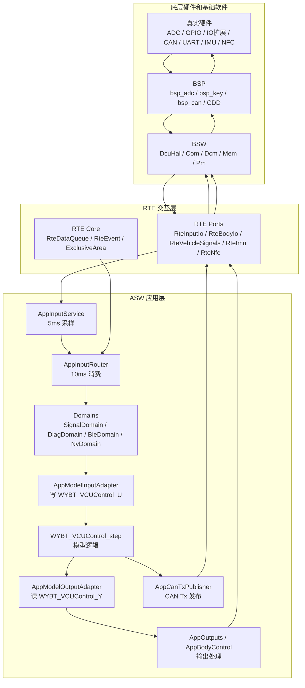
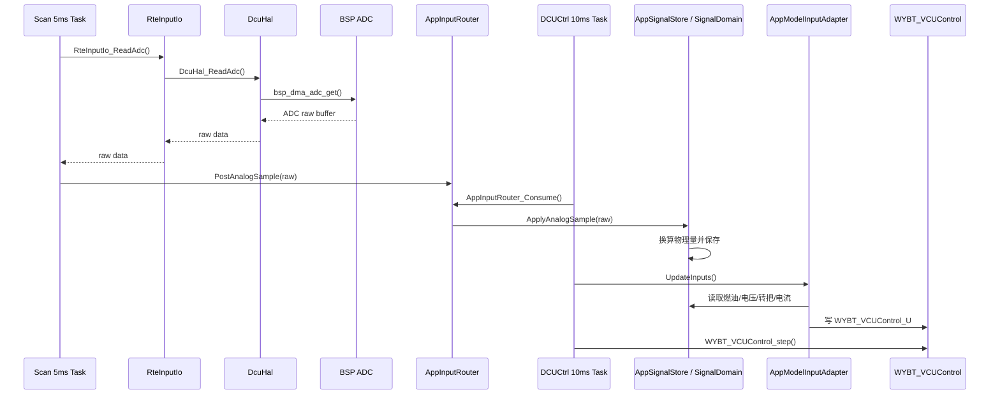
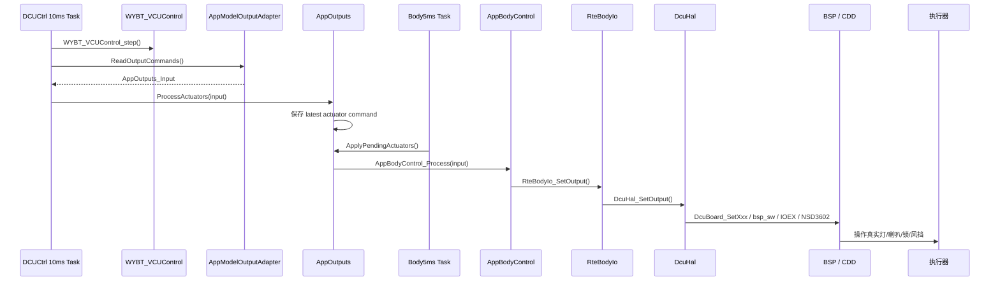

# 摩托车 VCU 应用层与底层交互

本文继续基于当前真实工程：

```text
C:\Users\14569\Desktop\五羊本田\software\DCU_WYBT\WYBT_DCU_Hybrid_HDV1.3\WYBT_DCU_Hybrid_HDV1.3
```

上一篇 `02_架构设计.md` 讲的是“工程分几层”。这一篇重点讲“这些层到底怎么说话”：

- 应用层 ASW 怎么拿到底层采集的数据；
- 应用层怎么控制底层硬件；
- Simulink 生成模型 `WYBT_VCUControl` 怎么和底层交互；
- CAN、BLE、SOC、UDS 这类通信数据怎么进入或离开应用层；
- 新增一个功能时，应该在哪一层加什么。

先给结论：

```text
应用层不应该直接操作 BSP。
应用层通过 RTE 读输入、写输出、收事件、发信号。
RTE 再通过 BSW 的 DcuHal、Com、Dcm、Mem、Pm 等模块和底层交互。
模型本身也不直接碰底层，它只读 WYBT_VCUControl_U，写 WYBT_VCUControl_Y。
```

---

## 1. 什么叫“应用层和底层交互”

在这个工程里，“交互”不是简单地函数互相调用。更准确地说，它有三类：

| 交互类型 | 典型场景 | 工程中的实现方式 |
| --- | --- | --- |
| 状态输入 | ADC、按键、轮速、IMU、CAN 信号 | 底层采集，ASW 周期消费，常用 overwrite-latest 最新值覆盖模式。 |
| 事件命令 | BLE 命令、SOC 按键事件、胎压配对请求、保养保存事件 | 用 `RteDataQueue` 或 `RteEvent` 排队，避免丢失顺序。 |
| 控制输出 | 灯、喇叭、锁、风挡、电源、CAN Tx 信号 | ASW 产生控制意图，经 RTE/BSW/BSP 落到硬件或通信。 |

这三类交互的处理方式不同。

### 1.1 状态输入：只关心最新值

例如 ADC 电压、按键当前状态、轮速当前值。这类数据通常是“状态”，不是“事件”。

如果 5 ms 扫描一次，10 ms 控制周期消费一次，中间来了两次 ADC 数据，一般只需要最新一次。旧值被覆盖是可以接受的。

工程里 `AppInputRouter.c` 对 ADC、MCU 按键、IO 扩展按键、周期采样就是这种思路：

```text
PostAnalogSample()
PostMcuKeySample()
PostIoExpanderKeySample()
PostPeriodicSample()
```

它们保存 latest sample，并设置 updated 标志。10 ms 主周期执行 `AppInputRouter_Consume()` 时再统一消费。

### 1.2 事件命令：不能随便覆盖

例如 BLE 发来“解锁”，SOC 发来“保养清除”，胎压配对请求，这类数据是“事件”。

事件通常不能简单覆盖，因为连续两个事件可能都需要处理。工程里用 `RteDataQueue` 或 `RteEvent` 做排队：

```text
RTE_DATA_QUEUE_APP_BLE_COMMAND
RTE_DATA_QUEUE_APP_SYSTEM_EVENT
RTE_DATA_QUEUE_SOC_MAINTENANCE
RTE_DATA_QUEUE_SOC_KEY_EVENT
```

这类交互的重点是：生产者可以在别的任务或回调里投递，真正修改业务状态的动作放到 10 ms 控制周期里做。

### 1.3 控制输出：先生成意图，再落到硬件

例如打开喇叭、打开远光灯、控制龙头锁、请求风挡动作。

应用层不应该直接写 GPIO，而是这样走：

```text
ASW 输出命令
  -> RTE 输出端口
  -> BSW/DcuHal
  -> BSP/板级驱动
  -> 真实硬件
```

这样做的好处是，应用层只描述“我要打开喇叭”，不用知道喇叭接在哪个引脚。

---

## 2. 总体交互图

下面这张图把输入、模型、输出和底层放在一起：



你可以把 RTE 看成应用层和底层之间的“插座”。ASW 插在 RTE 上，底层也插在 RTE 上，双方不要直接乱连。

---

## 3. 输入交互：底层数据怎么进入应用层

以 ADC 和按键为例，真实链路是：

```text
BSP 采集硬件
  -> BSW/DcuHal 抽象
  -> RTE/RteInputIo 转成应用接口
  -> ASW/AppInputService 5ms 读取
  -> ASW/AppInputRouter 暂存
  -> ASW/AppSystem 10ms 消费
  -> ASW/SignalDomain 保存业务状态
  -> AppModelInputAdapter 写入模型输入
```

### 3.1 ADC 输入链路

相关文件：

| 层 | 文件 | 职责 |
| --- | --- | --- |
| BSP | `BSP/Software_Driver/BSP_Driver/bsp_adc.c` | 配置 ADC + DMA，获取原始采样值。 |
| BSW | `BSW/IoHwAb/DcuHal.c` | 提供 `DcuHal_StartAdc()`、`DcuHal_ReadAdc()`、`DcuHal_GetAdcRaw()`。 |
| RTE | `RTE/Ports/RteInputIo.c` | 提供 `RteInputIo_ReadAdc()`、`RteInputIo_GetAdcRaw()`，并做 ADC 枚举映射。 |
| ASW Service | `ASW/Services/AppInputService.c` | 5 ms 周期读取 ADC，并投递到输入路由。 |
| ASW Core | `ASW/Core/AppInputRouter.c` | 保存最新 ADC 样本，10 ms 主周期统一消费。 |
| ASW Domain | `ASW/Domains/AppSignalStore.c`、`SignalDomain.c` | 把原始 ADC 转成燃油、电池电压、转把电压、电流等物理量并保存。 |
| Model Adapter | `ASW/Model/Adapter/AppModelInputAdapter.c` | 从 `SignalDomain` 读数据，写入 `WYBT_VCUControl_U`。 |

可以画成：



注意这里有两个周期：

- `Scan` 任务 5 ms 采样；
- `DCUCtrl` 任务 10 ms 消费并运行模型。

这就是为什么 `AppInputRouter` 使用 latest sample。采样周期和控制周期不同，需要一个缓冲点把它们接起来。

### 3.2 按键输入链路

按键分两类：

- MCU 直连按键；
- IO 扩展器按键。

`AppInputService_RunBaseScanCycle()` 读取 MCU 直连按键：

```text
RteInputIo_ReadKey()
  -> DcuHal_ReadKey()
  -> BSP 读取 GPIO 或板级按键状态
```

`AppInputService_RunIoExpanderScanCycle()` 读取 IO 扩展器按键：

```text
RteInputIo_RefreshIoExpanderInputs()
  -> DcuHal_RefreshIoExpanderInputs()
  -> IOEX_RefreshInputPorts()

RteInputIo_ReadKey()
  -> DcuHal_ReadKey()
  -> IO 扩展器缓存状态
```

进入 `SignalDomain` 后，模型输入适配器会把按键状态写入模型，例如：

```text
keyState.Horn
  -> WYBT_VCUControl_U.BSW2ASW_HornSwt_boolean

keyState.WindUp
  -> WYBT_VCUControl_U.BSW2ASW_EleWindshieldUp_boolean

keyState.HighLamp
  -> WYBT_VCUControl_U.BSW2ASW_HighBeamSwitch_boolean
```

也就是说，模型看到的不是 GPIO，而是“喇叭开关、风挡上升开关、远光开关”这种业务信号。

---

## 4. 模型输入：应用层怎么给 Simulink 模型喂数据

模型交互的入口在：

```text
ASW/Model/Adapter/AppModelAdapter.c
```

核心函数很短：

```c
void AppModelAdapter_RunStep(void)
{
    AppModelInputAdapter_UpdateInputs();
    WYBT_VCUControl_step();
}
```

这句话非常关键：

```text
先更新模型输入 WYBT_VCUControl_U
再执行模型 step
```

### 4.1 模型输入来自哪里

`AppModelInputAdapter_UpdateInputs()` 会按类别更新模型输入：

```text
ResetTransientInputs()
UpdateVehicleCommandInputs()
UpdateMotionInputs()
UpdateMemoryInputs()
UpdateBleAndTireInputs()
UpdateBodyInputs()
UpdateCanInputs()
```

对应关系如下：

| 输入类别 | 数据来源 | 进入模型的方式 |
| --- | --- | --- |
| 一次性命令 | `AppVehicleCommand_ReadAndClearTransient()` | 写入 reset trip、TCS switch 等瞬态模型输入。 |
| IMU/NFC | `RteImu_ReadMotionData()`、`RteNfc_IsUnlockActive()` | 写入加速度、角速度、NFC 解锁状态。 |
| 时间和 NVM | `RteVehicleSignals_ReadTboxTime()`、`NvDomain_*` | 写入 UTC 时间、里程、保养记录、油耗累积。 |
| BLE/胎压 | `AppBleDomain_ReadState()`、`AppTirePairDomain_ReadStatus()` | 写入 BLE 解锁、寻车、胎压、胎温等。 |
| 本地硬线输入 | `SignalDomain_ReadKeyState()`、`SignalDomain_Get*()` | 写入按键、燃油、电池电压、转把电压、电流、轮速等。 |
| CAN 信号 | `RteVehicleSignals_Read*()` | 写入 TBOX、ABS、雷达、ECU、ISG 等车辆网络信号。 |

模型输入适配器的价值是：把工程里分散的状态，整理成模型需要的 `WYBT_VCUControl_U`。

### 4.2 为什么模型不直接读底层

模型生成代码通常关注控制算法。它应该尽量保持稳定，不要和某个芯片、某个引脚、某个 CAN 矩阵函数强绑定。

正确边界是：

```text
底层数据
  -> RTE/Domain 形成稳定业务信号
  -> AppModelInputAdapter 写模型输入
  -> 模型只处理算法逻辑
```

如果让模型直接调用 `bsp_adc_get()` 或 `DCU_Get_TBOX10_xxx()`，会带来几个问题：

- 模型很难脱离硬件做测试；
- 硬件变化会影响模型代码；
- CAN 矩阵变化会污染模型逻辑；
- 自动生成代码和手写底层代码耦合太重。

所以当前工程用了 `AppModelInputAdapter` 把模型和底层隔开。

---

## 5. 模型输出：模型结果怎么控制底层

模型执行后，结果在：

```text
WYBT_VCUControl_Y
```

这些输出不会自动控制硬件，需要 ASW 把它们取出来并分发。

在 `AppSystem_RunControlCycle()` 中，模型输出主要走两条路：

```text
AppSystem_PublishModelOutputs()
AppSystem_DispatchOutputCommands()
```

也就是：

```text
模型输出一部分用于 CAN/SOC 发布
模型输出另一部分用于本地执行器控制
```

### 5.1 输出到本地执行器

本地执行器输出链路是：

```text
WYBT_VCUControl_Y
  -> AppModelAdapter_ReadOutputCommands()
  -> AppOutputs_ProcessActuators()
  -> AppOutputs_ApplyPendingActuators()
  -> AppBodyControl_Process()
  -> RteBodyIo_SetOutput()
  -> DcuHal_SetOutput()
  -> BSP/硬件
```

对应图：



这里注意一个细节：模型输出在 `DCUCtrl` 10 ms 任务里产生，但真正执行器刷新在 `Body5ms` 任务里做。

`AppOutputs.c` 用了 latest command 的共享变量：

```text
DCUCtrl 10ms:
  AppOutputs_ProcessActuators()
    -> 保存最新输出命令

Body5ms:
  AppOutputs_ApplyPendingActuators()
    -> 取出最新命令
    -> AppBodyControl_Process()
```

这是一种跨任务交互。它不使用 FIFO，因为执行器状态通常只需要最新命令。例如灯现在应该亮还是灭，旧命令没有必要排队逐个执行。

### 5.2 输出到 CAN

CAN 发布链路是：

```text
WYBT_VCUControl_Y
  -> AppModelAdapter_PublishCanSignals()
  -> AppCanTxPublisher_PublishModelSignals()
  -> RteVehicleSignals_WriteXxx()
  -> BSW/Com/Can_Matrix
  -> CAN Tx 报文
```

`AppCanTxPublisher.c` 会把模型输出组装成 RTE 的 Tx 结构体，例如：

```text
RteVehicleSignals_DcuMainStateTxType
RteVehicleSignals_DcuSwitchCtrlTxType
RteVehicleSignals_DcuAttachmentCtrlTxType
RteVehicleSignals_DcuFuelConsumptionTxType
RteVehicleSignals_DcuSpeedInfoTxType
```

然后调用：

```text
RteVehicleSignals_WriteDcuMainState()
RteVehicleSignals_WriteDcuSwitchCtrl()
RteVehicleSignals_WriteDcuAttachmentCtrl()
...
```

`RteVehicleSignals.c` 再把这些结构体转成 CAN 矩阵层的 Tx 数据：

```text
DCU_Update_DCU_MainState_TxData()
DCU_Update_DCU_SwitchCtrl_TxData()
DCU_Update_DCU_AttachmentCtrl_TxData()
```

这里的原则是：

```text
ASW 负责决定发什么业务信号
RTE 负责提供车辆信号端口
BSW/Com/Can_Matrix 负责 DBC 形态和字节级打包
BSP/CAN 驱动负责真正发出 CAN 帧
```

---

## 6. CAN 输入：网络信号怎么进入模型

CAN 输入链路和本地 ADC/按键不同。它不是从 `AppInputService` 走，而是从 CAN 矩阵和 `RteVehicleSignals` 读取。

典型链路：

```text
CAN 硬件收到报文
  -> BSP CAN 驱动
  -> BSW/Com/CanIf_Dcu
  -> BSW/Com/Can_Matrix/can_dcu
  -> RTE/RteVehicleSignals_ReadXxx()
  -> AppModelInputAdapter_UpdateCanInputs()
  -> WYBT_VCUControl_U
```

例如 `AppModelInputAdapter_UpdateCanInputs()` 会读取：

```text
RteVehicleSignals_ReadTboxParam()
RteVehicleSignals_ReadAbsStatus()
RteVehicleSignals_ReadRadarStatus()
RteVehicleSignals_ReadEcu101Status()
RteVehicleSignals_ReadIsgBrakeState()
RteVehicleSignals_IsIsg111Timeout()
```

然后写入模型输入：

```text
MODLE_U.ISG_Msg111Timeout_flag
MODLE_U.BSW2ASW_BrkSwt_boolean
MODLE_U.ABS_WheelSpeed_R
MODLE_U.Radar_State
MODLE_U.ECU_Engine_Speed
MODLE_U.TBOX_Unlock
...
```

注意：模型看到的是已经解码后的物理信号，不是 8 字节 CAN 原始帧。

这也是分层的意义：

```text
CAN 原始帧 -> CAN 矩阵解码 -> RTE 车辆信号 -> 模型输入
```

---

## 7. 事件交互：为什么要用 RteDataQueue 和 RteEvent

有些数据不是连续状态，而是一次性事件。例如：

- BLE 发来一个命令；
- SOC 发来一个按键事件；
- 需要保存保养信息；
- 胎压配对请求；
- 车辆电源状态变化。

这类数据如果简单用 latest 覆盖，可能会丢掉中间事件。所以工程里用了 `RteDataQueue` 和 `RteEvent`。

### 7.1 BLE 命令

`AppInputRouter_PostBleCommand()` 会把 BLE 命令投递到：

```text
RTE_DATA_QUEUE_APP_BLE_COMMAND
```

10 ms 主周期里 `AppInputRouter_Consume()` 再循环读取：

```text
while(RteDataQueue_Receive(...)) {
    AppBleDomain_ApplyCommand(&bleCommand);
}
```

这样 BLE 命令不会直接在通信回调里修改业务域，而是在主控制周期统一落地。

### 7.2 系统事件

`AppSystem.c` 里注册了几个 RTE 事件：

```text
RTE_EVENT_TIREPAIR_REQ
RTE_EVENT_VEHICLE_POWER_CHANGED
RTE_EVENT_MAINTENANCE_SAVE
```

事件回调不直接做耗时操作，而是转成 `APP_SYSTEM_EVENT_xxx` 放进：

```text
RTE_DATA_QUEUE_APP_SYSTEM_EVENT
```

然后在 `AppSystem_ConsumeSystemEvents()` 中处理。

这种设计很适合车载嵌入式：

- 回调路径短；
- 存储写入不在中断或通信回调里做；
- 业务状态集中在 10 ms 周期里修改；
- 顺序更可控，问题更容易定位。

---

## 8. 应用层和底层交互的四条主线

为了方便记忆，可以把整个工程的交互分成四条主线。

### 8.1 本地输入主线

```text
BSP 输入采集
  -> DcuHal
  -> RteInputIo / RteCapture / RteImu / RteNfc
  -> AppInputService 或模型输入适配器
  -> SignalDomain / DiagDomain / BleDomain
  -> WYBT_VCUControl_U
```

适用于：

- ADC；
- 按键；
- IO 扩展器；
- 轮速/捕获；
- IMU；
- NFC。

### 8.2 CAN 输入主线

```text
CAN Rx
  -> CanIf_Dcu
  -> Can_Matrix/can_dcu
  -> RteVehicleSignals_ReadXxx
  -> AppModelInputAdapter_UpdateCanInputs
  -> WYBT_VCUControl_U
```

适用于：

- TBOX；
- ABS；
- ECU；
- ISG；
- 雷达；
- 低压电池等网络信号。

### 8.3 本地输出主线

```text
WYBT_VCUControl_Y
  -> AppModelOutputAdapter
  -> AppOutputs
  -> AppBodyControl
  -> RteBodyIo
  -> DcuHal
  -> BSP
  -> 执行器
```

适用于：

- 灯；
- 喇叭；
- ACC/IGN；
- NFC 使能；
- 座桶锁；
- 尾箱锁；
- 龙头锁；
- 风挡电机。

### 8.4 CAN 输出主线

```text
WYBT_VCUControl_Y + ASW/RTE 上下文
  -> AppCanTxPublisher
  -> RteVehicleSignals_WriteXxx
  -> Can_Matrix/can_dcu
  -> CAN Tx
```

适用于：

- DCU 主状态；
- 开关状态；
- 附件状态；
- 车速/里程/油耗；
- 胎压信息；
- 车辆姿态；
- 参数设置状态。

---

## 9. 模型逻辑和底层交互到底是什么关系

可以把模型看成一个纯控制函数：

```text
输入：WYBT_VCUControl_U
输出：WYBT_VCUControl_Y
```

模型本身的理想边界是：

```text
不读 GPIO
不读 ADC DMA buffer
不直接收 CAN 原始帧
不直接发 CAN
不直接写 Flash
不直接控制 IO 扩展器
```

实际交互由适配层完成：

```text
底层 -> RTE/Domain -> AppModelInputAdapter -> 模型输入 U
模型输出 Y -> AppModelOutputAdapter/AppCanTxPublisher -> RTE/BSW/BSP
```

这能把问题拆开：

- 模型错了：看模型输入是否正确、模型逻辑是否正确、模型输出是否符合预期；
- 输入错了：看 RTE、SignalDomain、CAN 矩阵、采样换算；
- 输出没动作：看模型输出、AppOutputs、AppBodyControl、RteBodyIo、DcuHal、BSP；
- CAN 没发对：看 AppCanTxPublisher、RteVehicleSignals、Can_Matrix、CanIf。

调试时不要一上来怀疑所有层。顺着链路逐段验证。

---

## 10. 具体例子：喇叭按键到喇叭输出

喇叭是一个适合新手理解的例子。

### 10.1 输入进入模型

```text
喇叭按键
  -> BSP 读取 GPIO 或 IO 扩展器
  -> DcuHal_ReadKey(DCU_HAL_KEY_HORN)
  -> RteInputIo_ReadKey(RTE_INPUT_IO_KEY_HORN)
  -> AppInputService_PostIoExpanderKeySample()
  -> AppInputRouter_PostIoExpanderKeySample()
  -> AppInputRouter_Consume()
  -> AppSignalStore_ApplyIoExpanderKeySample()
  -> SignalDomain_UpdateKeyState()
  -> AppModelInputAdapter_UpdateBodyInputs()
  -> WYBT_VCUControl_U.BSW2ASW_HornSwt_boolean
```

### 10.2 模型产生输出

```text
WYBT_VCUControl_step()
  -> WYBT_VCUControl_Y.BSW_HornSwitch_Cmd
  -> WYBT_VCUControl_Y.DCU_HornSta
```

### 10.3 输出控制硬件

```text
AppModelAdapter_ReadOutputCommands()
  -> commands->hornCmd
  -> AppOutputs_ProcessActuators()
  -> AppOutputs_ApplyPendingActuators()
  -> AppBodyControl_Process()
  -> BodyHorn_Process()
  -> RteBodyIo_SetOutput(RTE_BODY_IO_OUT_HORN)
  -> DcuHal_SetOutput(DCU_HAL_OUT_HORN)
  -> DcuBoard_SetHorn()
  -> 喇叭硬件
```

这条链路说明：喇叭不是“按键直接控制 GPIO”。按键先成为模型输入，模型输出喇叭命令，再由车身控制域和 RTE/HAL 落到底层。

---

## 11. 新增一个交互功能应该怎么做

假设要新增一个“新的输入信号”，比如一个新的开关。

### 11.1 新增输入信号

推荐顺序：

1. BSP：确认真实硬件来源

   如果是 GPIO 或 IO 扩展器，先在 BSP 或 DcuHal 映射中确认能读到它。

2. BSW/DcuHal：增加统一硬件抽象枚举

   例如新增 `DCU_HAL_KEY_xxx`。

3. RTE：增加应用层输入枚举和映射

   例如在 `RteInputIo` 增加 `RTE_INPUT_IO_KEY_xxx`，并映射到 `DCU_HAL_KEY_xxx`。

4. ASW 输入服务：决定在哪个扫描周期读取

   MCU 直连按键放在 base scan，IO 扩展按键放在 IO expander scan。

5. ASW 输入路由和 Domain：保存成业务信号

   扩展 `AppSystem_McuKeySample` 或 `AppSystem_IoKeySample`，再写入 `SignalDomain`。

6. 模型输入适配：写入 `WYBT_VCUControl_U`

   在 `AppModelInputAdapter_UpdateBodyInputs()` 中把业务信号赋给模型输入。

### 11.2 新增输出执行器

推荐顺序：

1. BSP：确认输出引脚或外设驱动

   是 GPIO、IO 扩展器、PWM，还是专用芯片。

2. BSW/DcuHal：增加统一输出能力

   例如新增 `DCU_HAL_OUT_xxx`，并在 `DcuHal_SetOutput()` 中调用真实底层。

3. RTE：增加 `RTE_BODY_IO_OUT_xxx`

   在 `RteBodyIo_MapOutput()` 中映射到 HAL 输出。

4. ASW 输出类型：扩展 `AppOutputs_Input`

   让应用层能表达这个执行器命令。

5. 模型输出适配：从 `WYBT_VCUControl_Y` 读取命令

   在 `AppModelAdapter_ReadOutputCommands()` 中赋值。

6. 车身控制域：处理执行器策略

   在 `AppBodyControl_Process()` 或对应子函数中调用 `RteBodyIo_SetOutput()`。

### 11.3 新增 CAN 信号

推荐顺序：

1. 更新 DBC 或 CAN 矩阵生成代码；
2. 在 `RteVehicleSignals` 增加 Read/Write 接口；
3. 如果是模型输入，在 `AppModelInputAdapter_UpdateCanInputs()` 写入 `WYBT_VCUControl_U`；
4. 如果是模型输出，在 `AppCanTxPublisher_PublishModelSignals()` 从 `WYBT_VCUControl_Y` 组装 Tx 结构；
5. 确认 BSW/Com 周期发送或接收超时逻辑。

---

## 12. 调试交互问题的方法

遇到“模型没反应”或“底层没动作”，不要盲目改代码，按链路查。

### 12.1 输入没进模型

按这个顺序查：

```text
硬件原始值是否变化？
BSP 是否读到？
DcuHal 是否返回正确？
RteInputIo 是否映射正确？
AppInputService 是否周期读取？
AppInputRouter 是否 post 和 consume？
SignalDomain 是否更新？
AppModelInputAdapter 是否写入 WYBT_VCUControl_U？
```

### 12.2 模型有输出但硬件没动作

按这个顺序查：

```text
WYBT_VCUControl_Y 是否正确？
AppModelAdapter_ReadOutputCommands 是否拷贝？
AppOutputs 是否收到 latest command？
Body5ms 是否执行 ApplyPendingActuators？
AppBodyControl 是否调用 RteBodyIo？
RteBodyIo 映射是否正确？
DcuHal_SetOutput 分支是否正确？
BSP 输出是否操作真实引脚？
```

### 12.3 CAN 信号不对

按这个顺序查：

```text
模型输入/输出是否正确？
RteVehicleSignals Read/Write 是否正确？
Can_Matrix 的 Get/Update 函数是否正确？
CAN 报文周期是否启动？
CAN ID、字节序、Factor、Offset 是否和 DBC 一致？
```

---

## 13. 最重要的设计原则

最后总结成几条规则：

1. ASW 不直接包含 `bsp_*.h`、`driver_*.h` 或芯片头文件。
2. 模型不直接碰硬件，不直接收发 CAN 原始帧。
3. 状态输入用 latest sample，事件命令用 queue/event。
4. 10 ms 控制周期负责统一消费输入、运行模型、发布输出。
5. 5 ms 扫描任务负责采样和执行器刷新，不负责复杂业务决策。
6. RTE 是应用和底层的接口边界，不要把复杂业务塞进 RTE。
7. DcuHal 是 BSW 和 BSP 的边界，底层硬件变化优先封装在这里以下。
8. CAN 业务信号走 `RteVehicleSignals`，不要让 ASW 直接处理原始 8 字节帧。

一句话理解：

```text
底层负责采集和执行，
RTE 负责隔离和转接，
ASW 负责业务和模型，
模型负责算法，
适配器负责把工程世界和模型世界互相翻译。
```
