## UDS协议
本来UDS协议是想放在OBD协议的基础上讲解的，但是考虑到UDS协议在汽车电子中应用非常广泛，所以单独拿出来讲解。UDS协议是ISO14229标准定义的，UDS协议是基于CAN总线的应用层协议，UDS协议主要用于车辆诊断、ECU编程、数据传输等功能。

**简介** UDS协议是ISO14229标准定义的，UDS协议是基于CAN总线的应用层协议，UDS协议主要用于车辆诊断、ECU编程、数据传输等功能。（Unified Diagnostic Services）
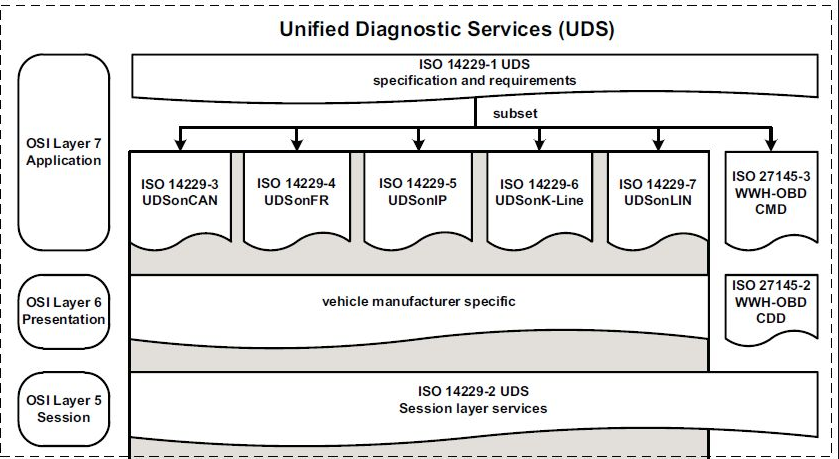
### UDS协议的主要功能包括：
- 诊断服务：UDS协议提供了一系列的诊断服务，用于读取车辆的故障码、传感器数据、ECU状态等信息。
- ECU编程：UDS协议支持对ECU进行编程和软件更新，可以通过UDS协议将新的软件版本下载到ECU中，实现功能升级和修复。
- 数据传输：UDS协议支持数据传输功能，可以在车辆和诊断设备之间传输数据，例如读取传感器数据、上传日志信息等。

主要的标准如下：
- ISO 14229-1: Road Vehicles -- Unified Diagnostic Services (UDS) -- Part 1: Specification and requirements

- ISO 14229-2: Road Vehicles -- Unified Diagnostic Services (UDS) -- Part 2: Session layer services

- ISO 14229-3: Road Vehicles -- Unified Diagnostic Services (UDS) -- Part 3: Unified Diagnostic Services on CAN implementation (UDS on CAN)

- ISO 15765-2: Road vehicles -- Diagnostic communication over Controller Area Network (DoCAN) -- Part 2: Transport protocol and network layer services

- ISO 15765-3: Road vehicles -- Diagnostic communication over Controller Area Network (DoCAN) -- Part 3: Implementation of unified diagnostic services (UDS on CAN)

#### 相关标准的层次关系
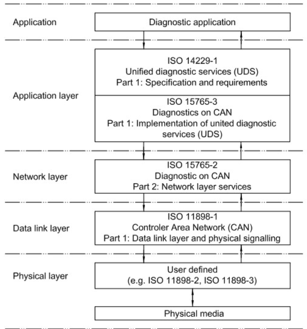

这里提供一个UDS协议的学习资料，供大家参考：
- [UDS协议学习资料](https://www.canfd.net/udsreference.html)

### 快速入门UDS协议
虽然ISO是最权威的资料，但是直接阅读ISO标准文档可能会比较困难，建议先从一些入门资料开始学习UDS协议的基本概念和使用方法。以下是一些入门资料的推荐：
- [UDS协议入门教程](https://zhuanlan.zhihu.com/p/37310388)
- [UDS协议学习笔记](https://zhuanlan.zhihu.com/p/135422985) 
- [UDS协议学习视频](https://www.bilibili.com/video/BV1aP4y1p7Vo/?vd_source=eee1fa96c4c50c361ee4fe7f40c0f9a8)

### 正式学习UDS协议
本文按照链接文档的方式进行学习，建议大家先阅读入门资料，然后再深入学习UDS协议的各个方面。
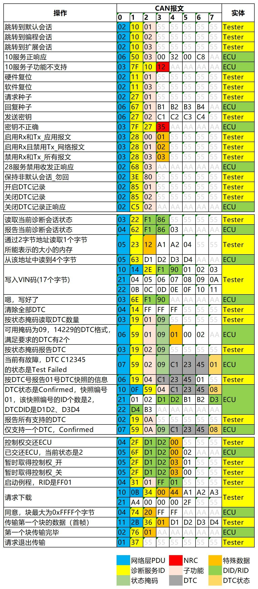
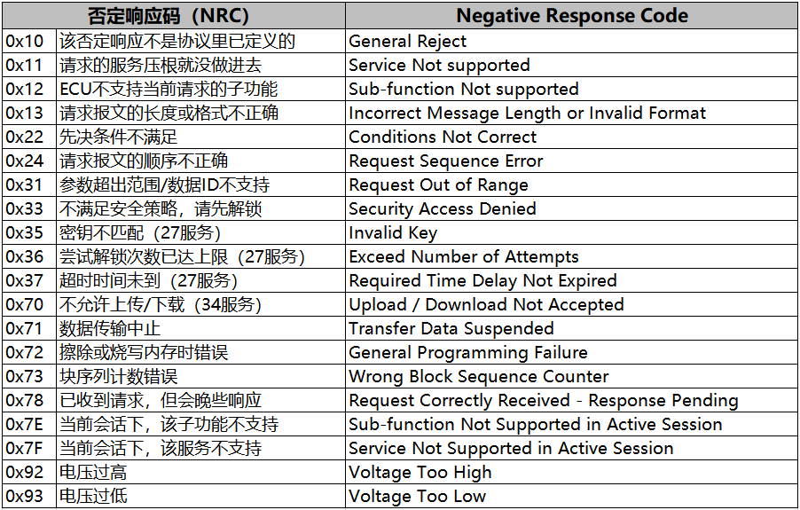
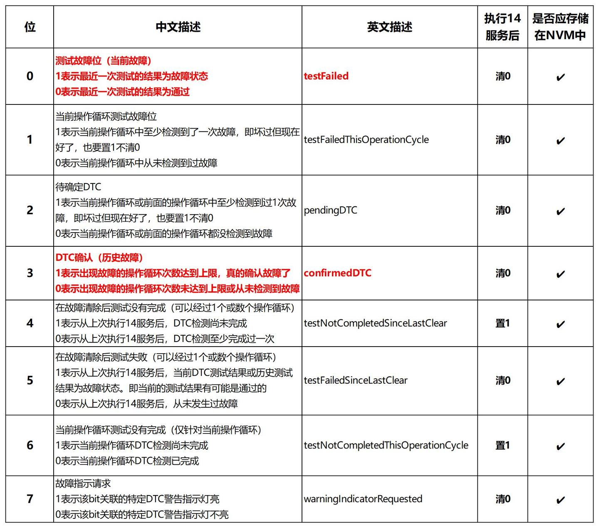

#### 简介
虽然前面已经介绍过了UDS协议的基本概念和使用方法，但是在实际应用中，UDS协议的使用场景非常复杂
>UDS（Unified Diagnostic Services，统一的诊断服务）诊断协议是在汽车电子ECU环境下的一种诊断通信协议，在ISO 14229中规定。它是从ISO 14230-3（KWP2000）和ISO 15765-3协议衍生出来的。“统一”这个词意味着它是一个“国际化的”而非”公司特定的”标准。到目前为止，这种通信协议被用在几乎所有由OEM一级供应商所制造的新ECU上面。这些ECU控制车辆的各种功能，包括电控燃油喷射系统（EFI），发动机控制系统，变速箱，防抱死制动系统(ABS)，门锁，制动器等。

>诊断工具与车内的所有控制单元均有连接，且这些控制单元均启用了UDS服务。不同于仅使用OSI模型第一层、第二层的CAN协议，UDS服务使用OSI模型的第五层和第七层（会话层和应用层）。服务ID（SID）和与服务相关的参数包含在CAN数据帧的8个数据字节中，这些数据帧是从诊断工具发出的。

>目前市面上的新车都具有用于车外诊断的诊断接口，这使得我们可以用电脑或诊断工具（业内称为测试器Tester）连接到车辆的总线系统上。因此，UDS中定义的消息可以发送到支持UDS服务的控制器（业内称ECU）。这样我们就可以访问各个控制单元的故障存储器或用新的固件更新ECU的程序。除此之外，UDS还用于下线检测时把一些信息（如VIN码）写入到汽车的各个零部件中。这些功能也是UDS最为核心的功能。


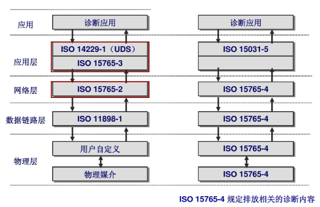


#### UDS的服务
UDS本质上一系列服务的集合，UDS的服务包含6大类，共26种。每种服务都有自己的ID，也就是服务ID（SID）。

**SID**:service Identifier，服务标识符。每个UDS服务都有一个唯一的SID，用于区分不同的服务。SID是一个字节（8位），范围从0x00到0xFF。
>UDS是定向通信，也就是诊断方给ECU指定发送请求数据，这条数据需要包含SID，且SID在应用层的第一个字节当中，如果是肯定的响应，ECU会返回SID+0x40作为响应的第一个字节，如果是负响应，ECU会返回0x7F+SID作为响应的第一个字节。
>比如Tester请求0x10服务，我想进入编程模式，ECU给出否定响应，首字节0x7F，第二字节回复0x10，代表我否定你的0x10服务请求，第三字节是NRC(否定响应码)，代表我否定你的依据


通常，在CAN总线中，Addressing information寻址信息会在CAN的帧ID中体现出来，例外是远程寻址，但不常使用。所谓的寻址信息包含了源地址(Source Address)和目标地址(Target Address)，就是这条信息是由谁发给谁的，类似于收件人和发件人。当然，ECU回信给Tester时，ECU就变成源地址了。因此源地址和目标地址在UDS中并不是一成不变的。


---
***UDS的寻址方式***：
UDS协议中有三种寻址方式，分别是物理寻址、功能寻址和广播寻址。物理寻址是指诊断工具直接与特定的ECU进行通信，功能寻址是指诊断工具向所有支持特定功能的ECU发送请求，而广播寻址是指诊断工具向所有ECU发送请求。

___每一个ECU都有2个CAN的诊断ID，通常由主机厂来确定不同ECU的这两个特定的诊断ID。比如0x701对应接收Tester的消息，0x709对应发给Tester的消息。。___


#### UDS的服务分类

**UDS的服务分为6大类**，但常用的服务是加背景色的15种。这15种服务又可粗略地划分为权限控制、读取数据/信息、写入数据/信息、通信控制、功能控制这几类（注：这几类是我自己划分的）。

本文重点介绍以下几个服务：$10 Diagnostic Session Control（诊断会话），$14 Clear Diagnostic Information（清除诊断信息），$19 Read DTC Information，$22 Read Data By Identifier（通过ID读数据），$27 Security Access（安全访问），$2E Write Data By Identifier（通过ID写数据），$3E Tester Present（待机握手）。

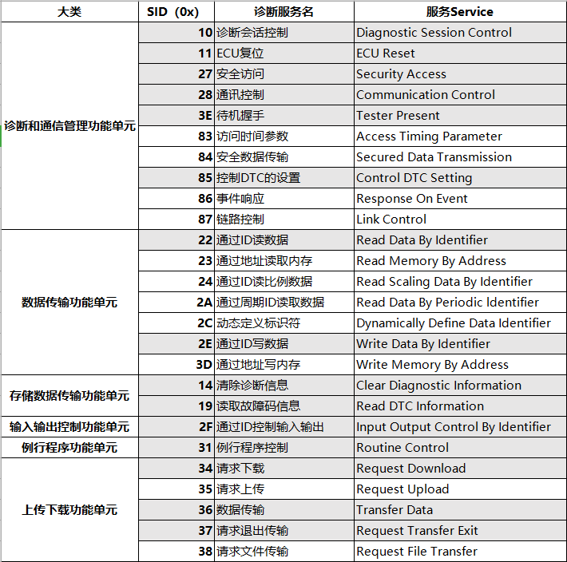


##### 0x10 Diagnostic Session Control（诊断会话）
**诊断会话**是UDS协议中最重要的服务之一，它用于在诊断工具和ECU之间建立和管理诊断会话。通过诊断会话，诊断工具可以访问ECU的各种功能和数据。

$10分为3个子服务：
- 0x01 Default Session（默认会话）：这是ECU的默认会话，诊断工具在连接ECU后，默认进入该会话。默认会话下，诊断工具只能访问ECU的基本功能和数据，无法进行高级操作。
- 0x02 Programming Session（编程会话）：这是用于ECU编程的会话，诊断工具在进入该会话后，可以对ECU进行编程和软件更新。编程会话下，诊断工具可以访问ECU的高级功能和数据，但需要满足一定的安全要求。
- 0x03 Extended Diagnostic Session（扩展诊断会话）：这是用于高级诊断的会话，诊断工具在进入该会话后，可以访问ECU的所有功能和数据。扩展诊断会话下，诊断工具可以进行高级操作，如读取传感器数据、上传日志信息等。

>这三个会话模式好比普通项目成员（默认会话）、项目组长（扩展会话）和会计（编程会话）的关系，小职员权限最小，小职员有的权限项目组长全有，项目组长还多了些其他的高端权限（如写数据、例程控制）。会计则不同，它有些自己独有的权限（刷写程序），但项目组的很多权限它没有（读/擦故障码），因为它只干会计相关的事，本身不参与项目。

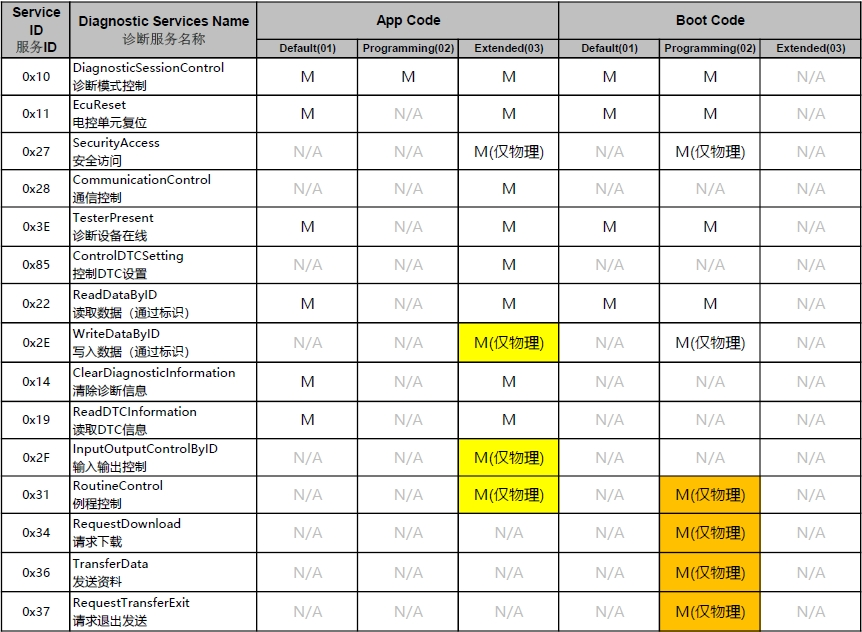


>如果您进入了一个非默认会话的状态，一个定时器会运转，如果一段时间内没有请求，那么到时间后，诊断退回到默认会话01(最低权限)。当然，我们有一个$3E的服务，可以使诊断保持在非默认的状态。
UDS的请求命令有4种构成方式，即SID，SID+SF（Sub-function），SID+DID（Data Identifier）（读写用），SID+SF+DID。每种服务都有自己不同的构成方式，查看服务说明即可，不用死记硬背。
NRC：Negative Response Code（否定响应码）。如   果ECU拒绝了一个请求，做出否定响应（Negative Response），它会在第三字节回复一个NRC。不同的NRC有不同的含义。本文开头时有一个常见NRC的图，当然完整版请参照ISO14229附录A。
这里提一下一个特殊的NRC——0x78，requestCorrectlyReceived-ResponsePending（RCRRP，请求已被正确接收-回复待定）。这个NRC表明请求消息被正确地接收，请求消息中的所有参数都是有效的，但是要执行的操作还没有完成，Server端还没有准备好接收另一个请求。一旦请求的服务已经完成，服务器应该发送一个积极的响应或消极的响应，响应代码应与此不同。这个NRC的消极响应可以被Server端重复，直到被请求的服务完成并且最终的响应消息被发送。
当使用此NRC时，服务器应始终发送最终响应(不管正响应还是负响应)，与suppress-PosRspMsgIndicationBit值（抑制肯定响应位）或NRCs（SNS、SFNS、SNSIAS、SFNSIAS和ROOR）对功能寻址的处理请求的响应抑制要求无关。这里的有一个特殊的知识点，即什么情况下，功能寻址是不需要给出否定响应的呢？如果被测ECU需要回复上面5个NRC（SNS 0x11、SFNS 0x12、SNSIAS 0x7E、SFNSIAS 0x7F和ROOR 0x31）时，不需要回复否定响应。

---

## 从0理解UDS：把它当成“维修电脑和ECU的对话规则”

> 本节结合上面两个知乎入门链接的学习路线，并对照当前项目代码：
> `C:\Users\14569\Desktop\五羊本田\software\DCU_WYBT\WYBT_DCU_Hybrid_HDV1.3\WYBT_DCU_Hybrid_HDV1.3`

### 1. 一句话先讲明白

UDS不是CAN，也不是OTA本身。UDS是跑在CAN/ISO-TP上面的一套“诊断服务命令”。

可以这样理解：

- CAN：像快递车，只负责把8字节一帧的数据送到指定CAN ID。
- ISO-TP：像分包快递规则，大文件超过8字节时，拆成首帧、连续帧、流控帧。
- UDS：像维修电脑和ECU约好的业务菜单，例如读版本、解锁、擦Flash、下载程序、复位。
- OTA：是升级业务。OTA可以借UDS的刷写服务，把新固件写进ECU。

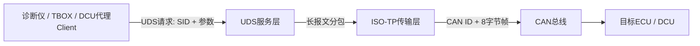

### 2. UDS报文最小规律

UDS请求的第一个有效字节一般是SID，也就是服务号。

| 类型 | 格式 | 小白理解 |
| --- | --- | --- |
| 请求 | `SID + 参数` | Tester问ECU：“我要做某个服务” |
| 肯定响应 | `SID + 0x40 + 参数` | ECU答：“可以，结果如下” |
| 否定响应 | `0x7F + 原SID + NRC` | ECU答：“不行，原因是NRC” |

例子：

| 场景 | 请求 | 正响应 | 说明 |
| --- | --- | --- | --- |
| 进入扩展会话 | `10 03` | `50 03 ...` | `0x10 + 0x40 = 0x50` |
| 安全访问请求种子 | `27 05` | `67 05 seed...` | ECU给seed |
| 安全访问发送key | `27 06 key...` | `67 06` | ECU解锁 |
| 请求不满足条件 | `34 ...` | `7F 34 22` | `0x22`表示条件不正确 |

### 3. 最常用的UDS服务怎么记

不要一开始背完整ISO表。先记项目里真的会用的服务：

| SID | 名称 | 用途 | 当前项目中的角色 |
| --- | --- | --- | --- |
| `0x10` | DiagnosticSessionControl | 切换会话 | 默认、扩展、编程会话 |
| `0x11` | ECUReset | ECU复位 | 刷写完成后复位 |
| `0x22` | ReadDataByIdentifier | 读DID数据 | 读BootId、诊断状态 |
| `0x27` | SecurityAccess | 安全访问 | 编程前seed/key解锁 |
| `0x28` | CommunicationControl | 通信控制 | 刷写时关闭/恢复普通CAN |
| `0x2E` | WriteDataByIdentifier | 写DID数据 | 写指纹`0xF199` |
| `0x31` | RoutineControl | 执行例程 | 预检查、擦除、CRC校验 |
| `0x34` | RequestDownload | 请求下载 | 告诉ECU要写的地址和大小 |
| `0x36` | TransferData | 传输数据块 | 真正搬运固件数据 |
| `0x37` | RequestTransferExit | 退出传输 | 固件数据发完 |
| `0x3E` | TesterPresent | 保活 | 防止非默认会话超时 |
| `0x85` | ControlDTCSetting | DTC开关 | 刷写前关闭/刷写后打开DTC |

### 4. 会话和安全等级：UDS的“权限门”

很多小白看UDS会卡在“为什么我发了服务ECU不理我”。核心原因通常是权限不够。

UDS大致有两道门：

1. 会话门：你在哪种诊断会话里？
2. 安全门：你有没有通过seed/key解锁？

在本项目 `UdsServerFlash.c` 中，服务访问规则写得很清楚：

| 服务 | 会话要求 | 安全要求 |
| --- | --- | --- |
| `0x10`切会话 | 任意会话 | 不需要 |
| `0x11`复位 | 任意会话 | 不需要 |
| `0x22`读DID | 任意会话 | 不需要 |
| `0x27`安全访问 | 编程会话 | 不需要，因为它本身就是用来解锁 |
| `0x28`通信控制 | 扩展/编程会话 | 不需要 |
| `0x31`例程控制 | 扩展/编程会话 | 按具体例程判断 |
| `0x34/0x36/0x37`下载刷写 | 编程会话 | 需要安全等级9 |
| `0x3E`保活 | 扩展会话 | 不需要 |
| `0x85`DTC开关 | 扩展/编程会话 | 不需要 |

也就是说，刷写不是一上来就能发`34/36/37`。正确顺序通常是：

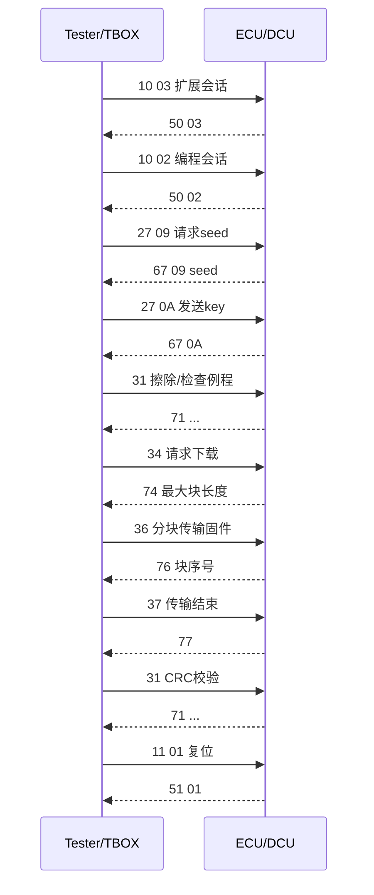

### 5. 项目代码地图：你应该从哪里看

当前项目把UDS分成两层：

| 层级 | 路径 | 作用 |
| --- | --- | --- |
| 通用UDS协议栈 | `Middleware/uds_core` | 实现UDS Client/Server、ISO-TP、SID/NRC、打包解包 |
| 项目诊断适配层 | `BSW/Dcm` | 配置本项目CAN ID、刷写流程、Flash、SOC镜像读取、安全算法 |
| 服务集成层 | `BSW/Services/BswServiceManager.c` | 把CAN收发路由给UDS Server或Client，控制普通CAN是否放行 |
| 任务调度层 | `BSW/SchM/SchM_Dcu.c` | 创建`UDSSrv`、`UDSCli`、`UDSRtn`、`UDSProxy`任务 |

最建议的阅读顺序：

1. `Middleware/uds_core/uds.h`：先看SID、NRC、会话、子功能这些常量。
2. `Middleware/uds_core/uds_node.h`：看UDS Server/Client节点怎么绑定CAN ID。
3. `BSW/Dcm/UdsServerFlash.c`：看DCU作为“被刷写对象”时怎么处理请求。
4. `BSW/Dcm/UdsClientFlash.c`：看DCU作为“代理刷写工具”时怎么刷其它ECU。
5. `BSW/Dcm/UdsDcuPort.c/.h`：看UDS如何调用平台能力，例如CAN发送、Flash擦写、安全算法、SOC镜像读取。

### 6. 本项目里DCU同时有两个身份

这是理解当前项目的关键。

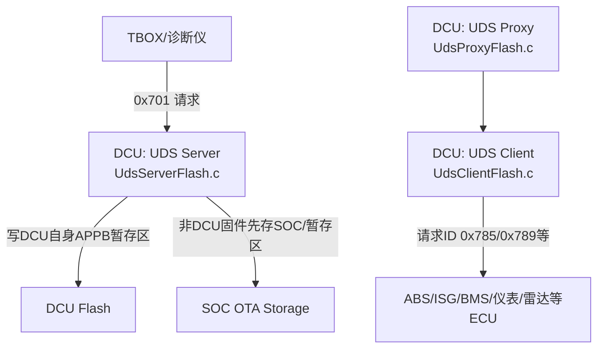

#### 身份1：DCU作为UDS Server

外部TBOX/诊断仪把DCU当目标ECU。

项目里的CAN ID：

| 含义 | CAN ID |
| --- | --- |
| Tester/TBOX发给DCU的物理请求 | `0x701` |
| DCU回复Tester/TBOX | `0x781` |
| 功能寻址请求 | `0x7DF` |

对应代码：`BSW/Dcm/UdsServerFlash.c`

它负责：

- 收外部诊断请求。
- 判断服务、会话、安全等级是否合法。
- 处理DCU自身升级。
- 如果固件不是DCU自己的，就先存储并触发代理刷写。
- 上报OTA进度到TBOX，使用CAN ID `0x761`。

#### 身份2：DCU作为UDS Client

DCU也可以像诊断仪一样，去刷写其它ECU。

对应代码：`BSW/Dcm/UdsClientFlash.c`

项目中的目标ECU诊断ID示例：

| 目标ECU | 请求ID | 响应ID |
| --- | --- | --- |
| FI ECU | `0x788` | `0x770` |
| ISG | `0x789` | `0x780` |
| BMS | `0x783` | `0x720` |
| ABS | `0x785` | `0x740` |
| 仪表 | `0x786` | `0x750` |
| 雷达 | `0x78A` | `0x7A0` |

### 7. DCU本机OTA刷写流程

DCU作为Server时，典型流程是：

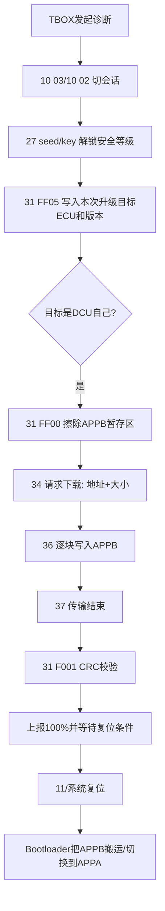

代码对应关系：

| 流程节点 | 代码函数 |
| --- | --- |
| 初始化UDS Server节点 | `UdsServerFlash_Init()` |
| CAN帧进UDS队列 | `UdsServerFlash_OnCanRxFromIsr()` |
| 服务分发 | `UdsServerFlash_Event()` |
| 切会话 | `HandleDiagnosticSession()` |
| 安全访问seed/key | `HandleRequestSeed()` / `HandleValidateKey()` |
| 擦除例程 | `RoutineEraseMemory()` |
| 请求下载 | `HandleRequestDownload()` |
| 数据传输 | `HandleTransferData()` |
| 传输结束 | `HandleRequestTransferExit()` |
| CRC校验 | `RoutineProgramCrcCheck()` |
| 升级后复位 | `RequestUpgradeResetAfterResponse()` / `ProcessPendingUpgradeReset()` |

注意一个项目细节：外部请求的目标地址可能是APP地址，但代码实际把DCU自身固件写到`APPB`暂存区：

```c
s_flash.address = UDS_PROXY_STAGING_ADDR;
```

注释说明：写到APPB后，由bootloader负责搬运或切换到APPA。

### 8. DCU代理刷写其它ECU流程

如果TBOX下发的固件目标不是DCU，而是ABS、ISG、BMS等，DCU会变成代理刷写器。

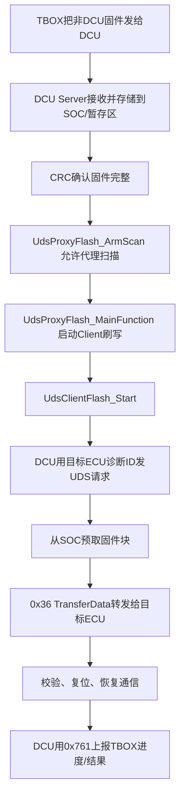

代理刷写的核心步骤在`UdsClientFlash.c`的流程表中：

| 步骤 | UDS服务 | 意义 |
| --- | --- | --- |
| `kStepPhysicalExtendedSessionPre` | `10 03` | 目标ECU进入扩展会话 |
| `kStepProgrammingCondition` | `31 0200` | 检查编程条件 |
| `kStepFunctionalDisableComm` | `28` | 功能寻址关闭普通通信 |
| `kStepPhysicalProgrammingSession` | `10 02` | 进入编程会话 |
| `kStepRequestSeedLevel5` | `27 05` | 请求安全种子 |
| `kStepSendKeyLevel5` | `27 06` | 发送安全key |
| `kStepWriteFingerprint` | `2E F199` | 写刷写指纹 |
| `kStepEraseMemory` | `31 FF00` | 擦目标ECU内存 |
| `kStepRequestDownload` | `34` | 请求下载 |
| `kStepTransferData` | `36` | 分块传输固件 |
| `kStepRequestTransferExit` | `37` | 退出传输 |
| `kStepProgramCheck` | `31 0201` | 编程校验 |
| `kStepTransferCheck` | `31 FF01` | 传输完整性校验 |
| `kStepEcuReset` | `11 01` | 目标ECU复位 |
| `kStepFunctionalEnableComm` | `28` | 恢复普通通信 |

### 9. 为什么刷写时要用0x3E TesterPresent

非默认会话会有S3超时。也就是说，ECU进入扩展/编程会话后，如果一段时间没有诊断请求，就会退回默认会话。

刷写时有些动作很慢，例如擦Flash、CRC校验、等待SOC读固件块。为了不掉会话，需要周期性或在关键步骤插入`0x3E`保活。

项目里的Client侧做了这件事：

- `MaybeSendTesterPresent()`
- `MaybeSendFunctionalTesterPresent()`
- `UDS_CLIENT_STEP_POST_FUNC_TP(...)`

### 10. 为什么会看到0x78响应

`0x78`的意思不是失败，而是“请求我收到了，但还没做完”。

典型场景：

- Flash擦除需要时间。
- CRC校验需要时间。
- SOC写入或读取固件块需要时间。

项目Server侧把长耗时任务放到`UDSRtn`任务中执行，并在需要时返回`0x78`：

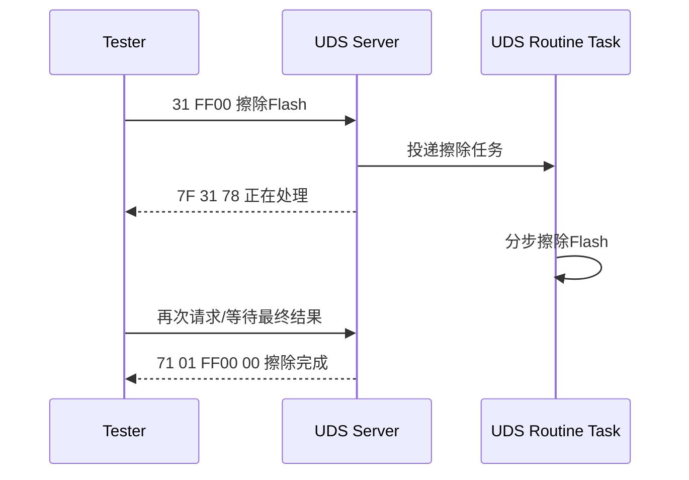

### 11. CAN路由和通信门控

项目不是所有CAN帧都给业务层。`BswServiceManager.c`会先判断是不是诊断帧：

- 如果CAN ID是DCU的UDS请求，投递给`UdsServerFlash`。
- 如果CAN ID是代理刷写目标ECU的响应，投递给`UdsClientFlash`。
- 刷写时普通CAN收发可能会被`0x28 CommunicationControl`限制。
- 诊断响应、OTA进度上报、代理刷写诊断请求会被特别放行。

这就是为什么刷写时普通车身报文可能减少，但诊断刷写报文仍能发出去。

### 12. 小白调试UDS时先看这5个点

1. CAN ID对不对：请求ID和响应ID是否匹配。
2. 会话对不对：需要编程会话的服务，不能在默认会话发。
3. 安全解锁对不对：`0x34/0x36/0x37`在本项目需要安全等级9。
4. 顺序对不对：没有擦除就传数据，通常会返回`0x24`请求顺序错误。
5. 长任务是不是`0x78`：看到`7F xx 78`先不要当失败，要继续等最终响应。

### 13. 常见NRC快速记忆

| NRC | 名称 | 小白解释 |
| --- | --- | --- |
| `0x10` | GeneralReject | ECU拒绝，但原因很泛 |
| `0x11` | ServiceNotSupported | 不支持这个SID |
| `0x12` | SubFunctionNotSupported | 不支持这个子功能 |
| `0x13` | IncorrectLengthOrFormat | 报文长度或格式错 |
| `0x21` | BusyRepeatRequest | ECU忙，稍后重试 |
| `0x22` | ConditionsNotCorrect | 当前条件不满足 |
| `0x24` | RequestSequenceError | 请求顺序错 |
| `0x31` | RequestOutOfRange | DID、地址、参数越界 |
| `0x33` | SecurityAccessDenied | 没解锁或权限不足 |
| `0x35` | InvalidKey | key算错 |
| `0x36` | ExceedNumberOfAttempts | key错误次数超限 |
| `0x37` | RequiredTimeDelayNotExpired | 安全等待时间没到 |
| `0x70` | UploadDownloadNotAccepted | 下载请求不接受 |
| `0x72` | GeneralProgrammingFailure | 编程失败 |
| `0x73` | WrongBlockSequenceCounter | `0x36`块序号错 |
| `0x78` | ResponsePending | 正在处理，等最终响应 |
| `0x7E` | SubFunctionNotSupportedInActiveSession | 当前会话不支持子功能 |
| `0x7F` | ServiceNotSupportedInActiveSession | 当前会话不支持服务 |

### 14. 你现在应该建立的心智模型

看UDS代码时，不要从函数细节开始钻。先问自己这4个问题：

1. 现在谁是Client，谁是Server？
2. 当前请求用的是物理寻址还是功能寻址？
3. 当前服务需要什么会话和安全等级？
4. 这个服务是在读信息、改状态，还是在执行刷写流程？

对当前项目来说：

- 外部TBOX刷DCU：TBOX是Client，DCU是Server。
- DCU代理刷ABS/ISG等：DCU是Client，目标ECU是Server。
- `Middleware/uds_core`解决通用协议问题。
- `BSW/Dcm`解决项目业务问题。
- OTA不是替代UDS，而是使用UDS服务完成升级。

### 15. 两个知乎链接的学习重点

这两篇适合作为入门材料看概念，但落到项目时要对照代码：

- [UDS协议入门教程](https://zhuanlan.zhihu.com/p/37310388)：重点看UDS服务、SID、正响应/负响应、寻址、会话。
- [UDS协议学习笔记](https://zhuanlan.zhihu.com/p/135422985)：重点看常用服务、NRC、DTC、刷写服务的顺序。

因为知乎页面当前不稳定，建议把它们当作概念入口。真正判断项目行为，要以本项目代码和主机厂诊断规范为准。
