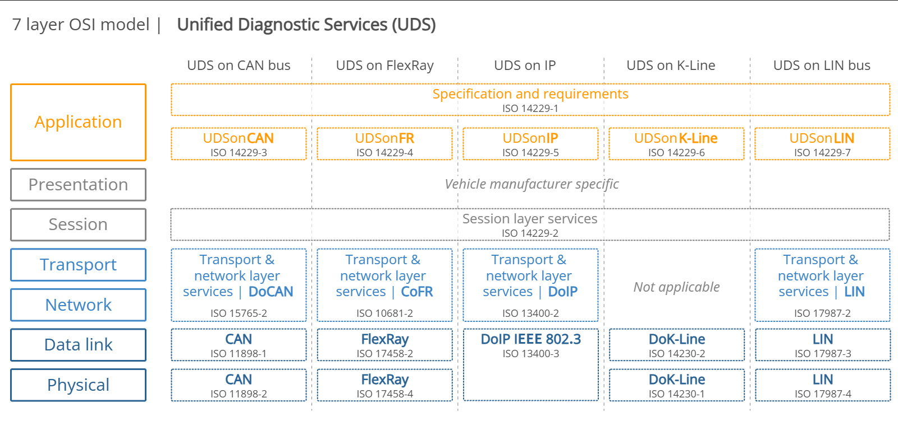
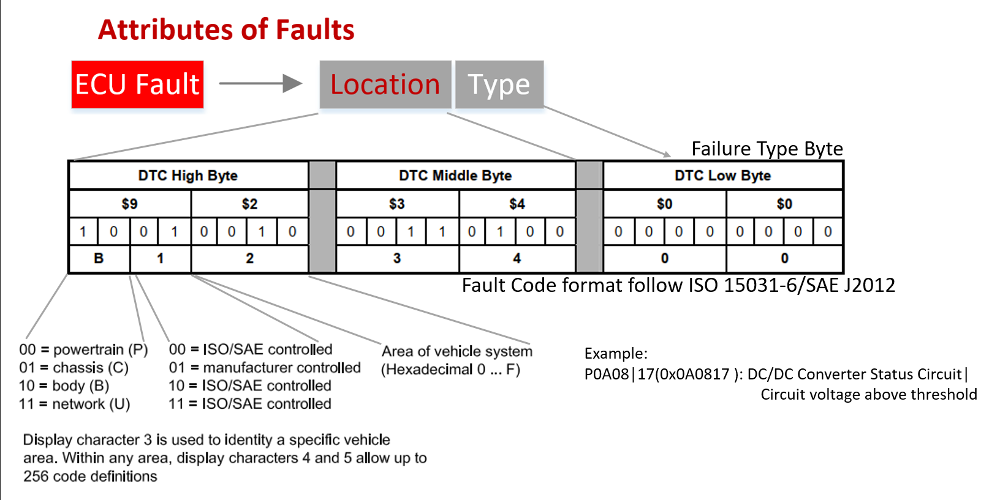
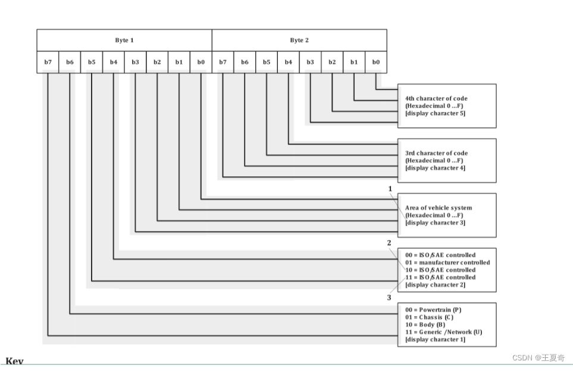
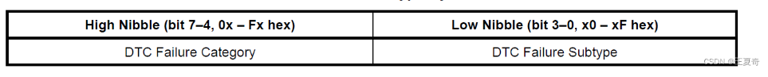
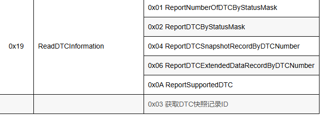

## DTC 协议设计
使用DTC可以查看具体的故障，通过读取DTC就可以知道确认出现了什么问题，并且惊喜相关的修复
DTC一般是由数字和字母组成
例如一个DTC代码可能是P0301，其中P表示动力系统，03表示点火系统，01表示第一个气缸。通过读取这个代码，维修人员可以快速定位问题所在，并采取相应的修复措施。

UDS 属于应用层协议（ISO 14229-1）。它的最大特点是与底层的物理总线解耦——无论底层是用 CAN、LIN、FlexRay 还是以太网（DoIP），应用层的 UDS 命令格式都是统一的。
### DTC的基本格式
UDS诊断中，DTC故障内码分为3个字节，分别为低中高,并且代表SID为`0x19`和`0x14`的服务。DTC的格式如下：

| Bit | 位名称 | 含义（为 1 时） |
|----:|:------:|:----------------|
| 0 | `testFailed` | 当前测试失败。当前诊断周期内刚报了这个错（指示故障正在发生）。 |
| 1 | `testFailedThisOperationCycle` | 本次工作循环内失败过。自上电/启动以来，该诊断测试至少失败过一次。 |
| 2 | `pendingDTC` | 挂起 DTC。故障已触发但尚未达到“确诊（Confirmed）”的去抖计数上限（Debounce Filter）。 |
| 3 | `confirmedDTC` | 已确诊 DTC。故障已满足确诊条件，需要落盘保存在 NVM 中（亮故障灯或等待清码）。 |
| 4 | `testNotCompletedSinceLastClear` | 自上次清码（0x14 服务）后，该测试尚未完整运行过。 |
| 5 | `testFailedSinceLastClear` | 自上次清码后，该测试至少失败过一次。 |
| 6 | `testNotCompletedThisOperationCycle` | 本次工作循环内，该测试尚未完整运行过。 |
| 7 | `warningIndicatorRequested` | 请求警告灯（如 MIL 灯、警告音），提示用户需处理故障 |

_表格说明：第一列为 DTC 状态位（Bit），第二列为状态位名称，第三列为该位为 1 时的含义与处理建议。_

1：动力系统域EMC,排气系统等。。） 。2：车身域（包括，大屏，BCM，座椅，电动后尾门之类）3：车载底盘（abs+emp等）4：通讯部分
DTC的最高字节的最高两位，决定了是什么DTC属于那个域，具体如下：

| DTC域 | 最高字节的最高两位 |
|:----:|:-----------------:|
| 0 | 动力系统域（发动机、排气系统等）P:powertrain 动力系统 |
| 1 | 车身域（包括大屏、BCM、座椅、电动后尾门等）C:chassis 底盘系统 |
| 2 | 车载底盘（ABS、ESP等）B:body 车身 |
| 3 | 通讯部分U:network 通讯 |

#### 常用子功能(sub-function)
对于网络域：
- 0代表网络电气
- 1,2代表网络通信
- 3代表网络软件
- 4，5代表网络数据

下面以3个实例说明
U0101，前三个字符按照上述说明解析，后两字符01代表的具体故障对象和类型是与TCM通讯丢失
U0302，后两字符02代表的具体故障对象和类型是与变速器控制模块软件不兼容，这里是不兼容，的意思：软件中配置的DTC格式和软件生成的DTC格式不兼容。
U0405，后两字符05代表的具体故障对象和类型是从巡航控制模块接收到的数据无效

#### DTC的MiddleByte字节
要了解清楚DTC的MiddleByte字节，首先要知道DTC的格式是由3个字节组成的，分别是HighByte、MiddleByte和LowByte。MiddleByte字节主要用于表示故障的具体类型和子功能。
所谓的有效DTC，就是包含有效信息的字节
第一种:前两个字节包含了有效信息，第三个字节lowbyte是0x00，表示没有更多的故障信息。
第二种：DTC的三个字节都包含了有效信息，表示有更多的故障信息需要处理。

#### DTC的LowByte字节
DTCLowByte则是描述故障种类和子类型，该部分内容遵循ISO 15031-6；对于不需要该字节信息的DTC，可填充为0x00

#### 介绍19服务
19服务一般包含6个子功能，比较常见

