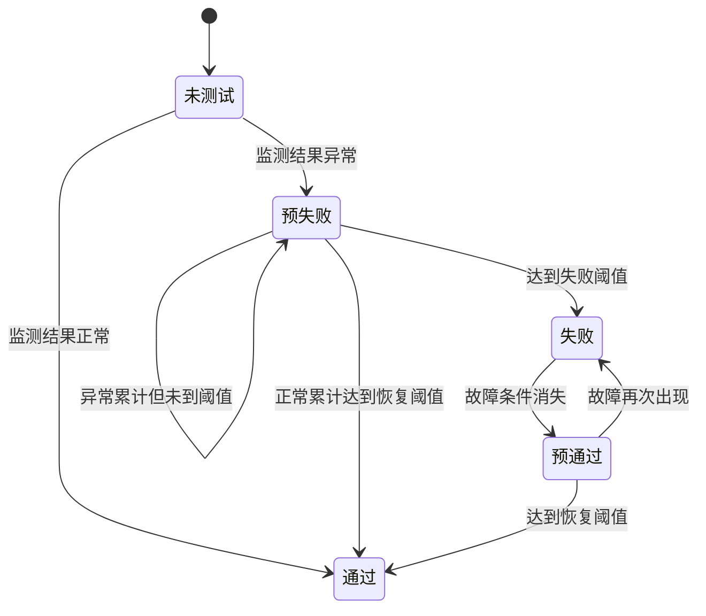
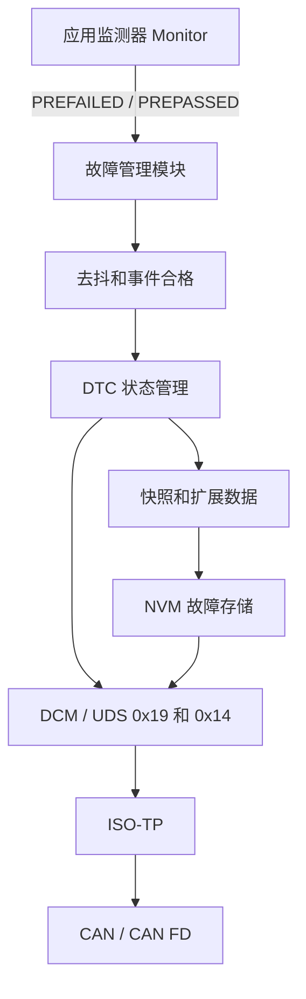
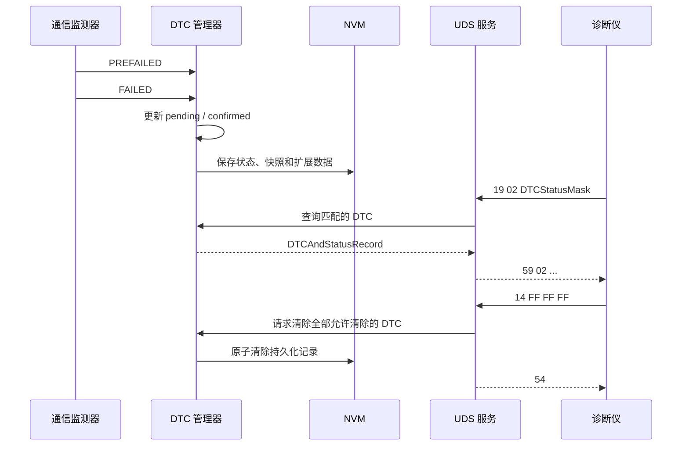

# DTC 协议设计与实现指南

> 文档定位：面向初学者的通用教学文档，同时提供摩托车 VCU 项目可落地的
> 设计模板。
>
> 标准基线：ISO 14229-1:2026、SAE J2012:2025 和 AUTOSAR CP
> Diagnostic Event Manager R25-11。具体量产项目仍应以主机厂诊断规范、
> ECU 诊断调查表和项目约定为最终依据。

## 1. DTC 是什么

DTC（Diagnostic Trouble Code，诊断故障码）是 ECU 对故障的标准化记录。
它不仅回答“哪里发生了故障”，还需要描述：

- 故障是否正在发生；
- 本次运行周期是否发生过；
- 故障是否已经确认；
- 故障发生时车辆处于什么状态；
- 故障是否达到点灯或报警条件；
- 故障能否通过诊断仪读取和清除。

一个完整的 DTC 系统不是简单地保存一个编号，而是由故障监测、去抖、
状态管理、故障存储以及 UDS 诊断服务共同组成。


## 2. DTC、故障事件和状态字节的区别

初学 DTC 时最容易混淆以下三个概念。

| 名称 | 作用 | 示例 |
| --- | --- | --- |
| 故障事件 Event | 软件内部的一次监测对象 | 蓄电池电压过低 |
| DTC 编号 | 诊断仪识别故障的 3 字节编号 | `0x0A0817` |
| DTC 状态字节 | 描述该 DTC 当前所处状态 | `0x2F` |

多个故障事件可以映射到同一个 DTC，但必须事先定义聚合规则。对于小型 VCU
项目，建议优先采用“一个故障事件对应一个 DTC”，这样便于定位和测试。

在 `0x19 reportDTCByStatusMask` 的典型响应中，一个 DTC 记录由以下字段组成：

```text
DTCAndStatusRecord = DTC[3 字节] + DTCStatus[1 字节]
```

例如：

```text
0A 08 17 2F
|-----|  |
  DTC   DTCStatus
```

需要特别注意：`0x19` 和 `0x14` 是 UDS 服务号，不是 DTC 编号的组成部分。

## 3. UDS 三字节 DTC 编码

### 3.1 原始格式

UDS 在诊断报文中使用 3 字节 DTC：

| 字节 | 名称 | 说明 |
| --- | --- | --- |
| Byte 1 | DTC High Byte | DTC 高字节 |
| Byte 2 | DTC Middle Byte | DTC 中字节 |
| Byte 3 | DTC Low Byte | DTC 低字节 |

三字节共同组成一个 24 位编号：

```text
DTC = (HighByte << 16) | (MiddleByte << 8) | LowByte
```

DTC 的解释方式由诊断系统采用的 `DTCFormatIdentifier` 决定。不能在不知道
格式标识符和主机厂定义的情况下，把任意三字节 DTC 都直接解释成 P 码。

### 3.2 SAE J2012 显示形式

当项目采用 SAE J2012 对应格式时，前两个字节可以转换为维修人员常见的
五字符显示码，例如 `P0301`、`U0101`。最高两位的含义如下：

| HighByte bit7~bit6 | 显示字符 | 系统域 |
| --- | --- | --- |
| `00` | `P` | Powertrain，动力系统 |
| `01` | `C` | Chassis，底盘系统 |
| `10` | `B` | Body，车身系统 |
| `11` | `U` | Network，网络通信 |

后续位用于表示标准/厂商定义范围、车辆系统区域以及具体故障编号。第三字节
通常作为 Failure Type Byte（FTB，故障类型字节），其高半字节表示故障类别，
低半字节表示故障子类型。实际定义应查询 SAE J2012 Digital Annex 或项目
诊断规范，不能只根据数字猜测故障含义。

以 `0x0A0817` 为例，在相应 J2012 格式下可显示为：

```text
原始 UDS DTC：0A 08 17
维修显示形式：P0A08-17
位置码：      P0A08
故障类型：    17
```

`LowByte = 0x00` 只表示项目为该 DTC 选择了 `0x00` 这一故障类型值，不能
通用地解释为“没有更多故障信息”或“该字节无效”。

### 3.3 项目编号分配原则

VCU 项目分配 DTC 时建议遵守以下规则：

1. 优先使用标准已经定义的 DTC 和 FTB。
2. 没有合适标准码时，使用主机厂分配的厂商自定义范围。
3. 同一个 DTC 编号在同一 ECU 中只能表达一种稳定含义。
4. 不要因为软件版本变化而改变已有 DTC 的故障含义。
5. 废弃 DTC 应保留编号记录，避免后续重复分配。
6. DTC 编号、检测条件、恢复条件和维修建议必须同步维护。

## 4. DTC 状态字节

DTC 状态字节独立于三字节 DTC 编号，共包含 8 个状态位。

| Bit | 掩码 | 名称 | 为 1 时的准确含义 |
| ---: | ---: | --- | --- |
| 0 | `0x01` | `testFailed` | 最近一次已完成的测试结果为失败 |
| 1 | `0x02` | `testFailedThisOperationCycle` | 本运行周期内至少失败过一次 |
| 2 | `0x04` | `pendingDTC` | 故障满足挂起条件，仍需按策略观察 |
| 3 | `0x08` | `confirmedDTC` | 故障已达到项目规定的确认条件 |
| 4 | `0x10` | `testNotCompletedSinceLastClear` | 清码后尚未完成过一次有效测试 |
| 5 | `0x20` | `testFailedSinceLastClear` | 清码后至少失败过一次 |
| 6 | `0x40` | `testNotCompletedThisOperationCycle` | 本运行周期尚未完成有效测试 |
| 7 | `0x80` | `warningIndicatorRequested` | 请求故障灯、文字或声音警告 |

### 4.1 三个容易误解的状态位

#### pendingDTC

`pendingDTC` 不应简单理解成“尚未确认”。它表示故障已经满足挂起规则，
但其置位和清除可能跨越多个运行周期。故障刚恢复时，pending 位也可能根据
项目策略暂时保持。

#### confirmedDTC

`confirmedDTC` 表示达到确认条件，并不自动等于点亮故障灯。是否报警应由
故障等级、法规要求和 `warningIndicatorRequested` 策略共同决定。

#### warningIndicatorRequested

该位表示 ECU 请求警告指示。警告形式可以是仪表灯、文字提示、蜂鸣器或
功能降级提示，不一定是发动机 MIL 灯。

### 4.2 状态变化示例

下面的数值用于帮助理解，不代表所有项目都必须使用相同确认和清除策略。

| 阶段 | 典型状态 | 说明 |
| --- | ---: | --- |
| 刚执行清码 | `0x50` | 清码后、当前周期均未完成测试 |
| 首次有效测试通过 | `0x00` | 测试已完成且没有失败 |
| 首次确认失败 | `0x27` | bit0、bit1、bit2、bit5 置位 |
| 达到确认条件 | `0x2F` | 在 `0x27` 基础上置位 bit3 |
| 同时请求报警 | `0xAF` | 在 `0x2F` 基础上置位 bit7 |
| 故障暂时恢复 | 项目定义 | bit0 清零，其他位按恢复策略处理 |

实际状态机必须明确以下内容：

- 什么时候开始一个新的 Operation Cycle；
- 什么条件下认为一次测试已经完成；
- pending 和 confirmed 分别何时置位、何时清零；
- confirmed DTC 是否支持自动老化；
- 报警请求如何恢复；
- 掉电重启后哪些状态位需要保留。

## 5. 故障监测和去抖设计

传感器瞬时抖动、CAN 报文偶发延迟或电源波动不应立刻形成 confirmed DTC。
因此监测器应先输出原始检测结果，再由去抖逻辑得到合格结果。



### 5.1 使能条件

每个监测器都应先判断使能条件。条件不满足时，应报告“未完成测试”，而不是
直接报告通过或失败。

例如，12 V 蓄电池欠压监测的使能条件可以包括：

- ECU 已完成初始化；
- IGN 已打开；
- ADC 自检通过；
- 电源处于稳定阶段；
- 起动电机未处于允许的瞬时压降阶段。

### 5.2 常用去抖方式

| 去抖方式 | 适用场景 | 设计参数 |
| --- | --- | --- |
| 连续计数 | 周期固定、结果稳定的监测 | 失败次数、恢复次数 |
| 加减计数器 | 允许中间穿插少量相反结果 | 步长、上下限、阈值 |
| 时间去抖 | 超时、持续过压或欠压 | 失败时间、恢复时间 |
| 监测器内部去抖 | 算法已有可信度判断 | FAILED/PASSED 输出条件 |

所有阈值都应写入 DTC 配置表，不能只隐藏在代码中。

### 5.3 使能、存储和恢复应分开

- 使能条件：当前是否允许执行故障检测。
- 存储条件：当前是否允许把合格故障写入故障存储器。
- 恢复条件：故障消失后，何时认为功能已经恢复。

例如低电压可能允许被监测，但在整车刷写或起动瞬间禁止存储，避免产生大量
无维修价值的 DTC。

## 6. Operation Cycle、确认、恢复和老化

### 6.1 Operation Cycle

Operation Cycle 是 DTC 状态管理使用的运行周期，不一定等于 MCU 上电周期。
摩托车 VCU 常见定义可以是：

```text
周期开始：IGN 由 OFF 变为 ON，并且系统完成初始化
周期结束：IGN 由 ON 变为 OFF，并完成必要的 NVM 保存
```

若项目存在低功耗保持、远程唤醒或 OTA 模式，必须说明这些模式是否开启新的
Operation Cycle。

### 6.2 确认策略

建议按故障安全等级选择确认策略：

| 故障类型 | 建议确认方式 |
| --- | --- |
| 严重硬件故障 | 一次合格失败即可确认 |
| 传感器范围故障 | 去抖后一次或连续多个周期确认 |
| CAN 通信丢失 | 超时去抖后确认 |
| 数据合理性故障 | 多个关联信号和工况共同确认 |

### 6.3 恢复、愈合和老化

- 恢复：当前测试从 FAILED 变为 PASSED，通常清除 bit0。
- 愈合：连续若干周期不再失败，允许取消报警或清除部分状态。
- 老化：达到规定的无故障周期数后，允许清除 confirmed 状态或故障记录。
- 清码：诊断仪通过 `0x14` 主动清除允许清除的诊断信息。

四个概念不能混用。特别是“当前故障恢复”不等于“历史故障记录立即消失”。

## 7. 故障存储、快照和扩展数据

### 7.1 故障存储内容

建议每条故障存储项至少包含：

| 字段 | 说明 |
| --- | --- |
| DTC | 三字节 DTC 编号 |
| DTCStatus | 状态字节 |
| OccurrenceCounter | 故障发生次数 |
| AgingCounter | 连续无故障周期计数 |
| FirstFailedTimestamp | 首次失败时间 |
| MostRecentFailedTimestamp | 最近失败时间 |
| SnapshotRecordNumber | 快照记录号 |
| ExtendedDataRecordNumber | 扩展数据记录号 |

### 7.2 快照数据

快照数据用于回答“故障发生时车辆是什么状态”。VCU 的通用快照可包含：

- IGN 和整车电源模式；
- 12 V 蓄电池电压；
- 车速和电机转速；
- 节气门或加速踏板开度；
- MCU 温度；
- 关键 CAN 网络状态；
- 软件版本和运行时间。

必须明确快照触发时机，例如“首次 pending”“首次 confirmed”或“最近一次
confirmed”。如果存储空间有限，优先保留首次确认快照，避免被后续重复故障
覆盖。

### 7.3 扩展数据

扩展数据用于保存随故障生命周期变化的统计信息，例如：

- 故障发生次数；
- 老化计数；
- 去抖计数器终值；
- 自清码后的运行周期数；
- 首次和最近一次失败里程；
- 故障持续时间。

### 7.4 NVM 设计要求

1. 只在状态或记录发生有效变化时标记待写，避免周期性重复擦写。
2. 使用版本号、长度和 CRC 检查存储数据完整性。
3. 掉电写入应采用双区、日志式或其他可恢复机制。
4. 存储空间满时必须定义替换优先级。
5. 安全相关 DTC 不应被普通低优先级故障覆盖。
6. 清码过程中掉电后，结果必须处于可识别的一致状态。

## 8. 0x19 ReadDTCInformation

`0x19` 用于读取 DTC 数量、DTC 状态、快照和扩展数据。请求的第二个字节是
子功能。ISO 14229-1 不要求每个 ECU 支持所有子功能，项目必须在诊断调查表中
明确支持范围。

### 8.1 建议优先支持的子功能

| 子功能 | 名称 | 用途 |
| ---: | --- | --- |
| `0x01` | `reportNumberOfDTCByStatusMask` | 按状态掩码读取 DTC 数量 |
| `0x02` | `reportDTCByStatusMask` | 按状态掩码读取 DTC 和状态 |
| `0x03` | `reportDTCSnapshotIdentification` | 读取快照记录标识 |
| `0x04` | `reportDTCSnapshotRecordByDTCNumber` | 按 DTC 读取快照 |
| `0x06` | `reportDTCExtDataRecordByDTCNumber` | 按 DTC 读取扩展数据 |
| `0x0A` | `reportSupportedDTC` | 读取 ECU 支持的 DTC |

标准还定义了按严重度、镜像存储、首次/最近失败、永久 DTC、用户自定义存储等
其他子功能。是否支持应根据法规、售后工具和存储资源决定，不能用“0x19 一共
有 6 个子功能”来描述。

### 8.2 按状态掩码读取 DTC

典型请求：

```text
19 02 08
|  |  |
|  |  +-- DTCStatusMask = confirmedDTC
|  +----- SubFunction = reportDTCByStatusMask
+-------- SID = ReadDTCInformation
```

典型肯定响应：

```text
59 02 FF 0A 08 17 2F
|  |  |  |--------|  |
|  |  |      DTC     DTCStatus
|  |  +-- DTCStatusAvailabilityMask
|  +----- SubFunction
+-------- Positive Response SID
```

状态掩码用于筛选 DTC。通常当下式不为零时，该 DTC 与请求匹配：

```text
(DTCStatus & DTCStatusMask & DTCStatusAvailabilityMask) != 0
```

`DTCStatusAvailabilityMask` 表示本 ECU 实际支持哪些状态位。诊断仪不能假定
所有 ECU 都支持全部 8 位。

### 8.3 0x19 常见 NRC

| NRC | 名称 | 典型原因 |
| ---: | --- | --- |
| `0x12` | `subFunctionNotSupported` | ECU 不支持该子功能 |
| `0x13` | `incorrectMessageLengthOrInvalidFormat` | 请求长度或格式错误 |
| `0x22` | `conditionsNotCorrect` | 当前条件不允许读取 |
| `0x31` | `requestOutOfRange` | DTC 或记录号不支持 |
| `0x7E` | `subFunctionNotSupportedInActiveSession` | 当前会话不支持该子功能 |

实际 NRC 集合应以项目诊断规范和所选标准版本为准。

## 9. 0x14 ClearDiagnosticInformation

`0x14` 用于清除指定 DTC 分组对应的诊断信息。典型请求格式为：

```text
14 FF FF FF
|  |-----|
|  groupOfDTC = 全部 DTC
+-- SID = ClearDiagnosticInformation
```

成功时返回：

```text
54
```

失败时返回：

```text
7F 14 NRC
```

### 9.1 清码应处理的内容

项目应明确清除：

- 对应 DTC 的允许清除状态位；
- 故障发生次数和老化计数；
- 快照记录；
- 扩展数据；
- 首次/最近失败记录；
- 与故障关联的报警锁存状态。

清码不能消除仍然存在的物理故障。清码后重新执行监测，如果故障条件仍然
存在，DTC 应再次进入失败、挂起或确认流程。

### 9.2 清码条件

以下内容必须由项目明确：

- 支持清码的诊断会话；
- 是否需要安全访问解锁；
- 车辆运行时是否允许清码；
- NVM 正忙或电压异常时返回什么 NRC；
- 是否支持按 DTC 分组清除；
- 法规永久 DTC 是否允许通过 `0x14` 清除。

### 9.3 0x14 常见 NRC

| NRC | 名称 | 典型原因 |
| ---: | --- | --- |
| `0x13` | `incorrectMessageLengthOrInvalidFormat` | 请求长度错误 |
| `0x22` | `conditionsNotCorrect` | 电压、车速或运行状态不允许 |
| `0x31` | `requestOutOfRange` | 不支持请求的 DTC 分组 |
| `0x72` | `generalProgrammingFailure` | 清除非易失存储失败 |

## 10. VCU DTC 配置表模板

实现代码前，应先完成 DTC 配置表。下面字段可直接用于项目诊断调查表。

| 字段 | 示例 | 说明 |
| --- | --- | --- |
| EventId | `EVENT_BATT_UV` | 软件内部唯一事件编号 |
| DTC | `0xXXXXXX` | 三字节 DTC 编号，待项目分配 |
| 名称 | 12 V 蓄电池欠压 | 唯一、稳定、便于检索 |
| 故障等级 | B | 安全、功能和售后等级 |
| 监测周期 | 10 ms | 监测器调用周期 |
| 使能条件 | IGN ON 且 ADC 有效 | 不满足时不判失败 |
| 失败条件 | 电压低于项目阈值 | 阈值由电气规范给出 |
| 恢复条件 | 电压高于恢复阈值 | 应设计回差 |
| 失败去抖 | 持续项目规定时间 | 防止瞬态误报 |
| 恢复去抖 | 持续项目规定时间 | 防止反复跳变 |
| 确认条件 | 连续若干周期失败 | 根据安全等级确定 |
| 老化条件 | 若干周期无故障 | 是否允许自动老化 |
| 报警策略 | 仪表电源警告 | 是否置位 bit7 |
| 功能降级 | 限制非必要负载 | 故障后的安全动作 |
| 快照 | 电压、车速、电源模式 | 首次确认时保存 |
| 扩展数据 | 次数、持续时间 | 用于售后分析 |
| 清码权限 | 扩展会话并解锁 | 项目定义 |
| 维修建议 | 检查电池和线束 | 面向售后人员 |

所有“项目规定”的内容都需要结合原理图、电气信息表、HSI 和两轮车通信协议
确认，不能仅由软件人员自行假设。

## 11. 通用软件分层建议



各层职责如下：

| 层级 | 职责 |
| --- | --- |
| Monitor | 读取信号、检查使能条件、输出原始测试结果 |
| Event/DTC Manager | 去抖、确认、恢复、老化、状态位管理 |
| Storage | 快照、扩展数据、NVM 一致性和磨损控制 |
| DCM/UDS | 解析 `0x19`、`0x14` 并组织响应 |
| ISO-TP | 处理超过单帧长度的诊断报文 |
| CAN/CAN FD | 完成诊断报文的实际传输 |

不要让 UDS 服务直接读取零散的业务变量并临时拼凑 DTC。UDS 层应该读取故障
管理模块已经形成的一致快照。

## 12. 从故障发生到诊断仪读出的完整逻辑

以 CAN 报文超时故障为例：

1. 通信监测器记录目标报文最后一次接收时间。
2. 只有网络启动完成、目标节点应当在线时，才使能超时监测。
3. 超过超时阈值后输出 PREFAILED。
4. 去抖达到失败阈值后输出 FAILED。
5. 故障管理模块置位相应 DTC 状态位。
6. 达到确认条件时保存首次确认快照和扩展数据。
7. 若故障等级要求报警，则置位 `warningIndicatorRequested`。
8. 诊断仪通过 `19 02` 读取 DTC 和状态。
9. 报文恢复后，经恢复去抖输出 PASSED，但历史记录按策略保留。
10. 达到老化条件或收到合法 `0x14` 后，清除允许清除的记录。



## 13. 测试与验收

每个 DTC 至少覆盖以下测试场景：

| 编号 | 测试场景 | 预期结果 |
| ---: | --- | --- |
| 1 | 使能条件不满足 | 不误报，测试未完成状态正确 |
| 2 | 异常时间小于失败去抖 | 不产生合格失败 |
| 3 | 异常达到失败阈值 | `testFailed` 等状态正确变化 |
| 4 | 达到确认条件 | `confirmedDTC` 正确置位并保存 |
| 5 | 故障恢复但未达到恢复阈值 | 不提前报告 PASSED |
| 6 | 完成恢复去抖 | 当前失败位按策略清零 |
| 7 | ECU 掉电重启 | 需要持久化的状态和记录不丢失 |
| 8 | `19 01` 查询数量 | 数量和状态掩码匹配 |
| 9 | `19 02` 查询记录 | DTC、状态及排序符合规范 |
| 10 | 读取快照和扩展数据 | 记录号和数据内容正确 |
| 11 | 合法 `0x14` 清码 | 返回 `0x54`，允许清除内容被清除 |
| 12 | 不允许清码的工况 | 返回项目规定的 NRC |
| 13 | 清码后故障仍存在 | 重新监测后 DTC 再次产生 |
| 14 | NVM 写入或清除时掉电 | 重启后数据保持一致且可识别 |
| 15 | 故障存储器已满 | 替换策略符合故障优先级 |

测试报告应记录原始监测值、去抖计数、Operation Cycle、状态字节、诊断请求、
诊断响应和 NVM 结果，避免只记录“诊断仪能看到故障码”。

## 14. 设计检查清单

- [ ] DTC 编号来源和格式标识符已经确认。
- [ ] 每个 DTC 都有唯一名称和维修描述。
- [ ] 使能、失败、恢复和存储条件已经分别定义。
- [ ] 去抖参数有电气或系统需求依据。
- [ ] Operation Cycle 起止条件已经定义。
- [ ] pending、confirmed、报警、愈合和老化策略已经定义。
- [ ] 快照触发时机和数据布局已经定义。
- [ ] NVM 满载、损坏和掉电恢复策略已经定义。
- [ ] `0x19` 支持的子功能和 NRC 已列入诊断调查表。
- [ ] `0x14` 的会话、安全等级、清除分组和 NRC 已定义。
- [ ] 每个 DTC 均有可执行的测试用例。
- [ ] 项目特定阈值已经对照原理图、电气信息表、HSI 和通信协议确认。

## 15. 参考标准

- [ISO 14229-1:2026 - Unified diagnostic services, Application layer](https://www.iso.org/standard/87962.html)
- [SAE J2012:2025 - Diagnostic Trouble Code Definitions](https://saemobilus.sae.org/standards/j2012_202509-diagnostic-trouble-code-definitions)
- [SAE J2012 Digital Annex 202510](https://saemobilus.sae.org/standards/j2012da_202510-digital-annex-diagnostic-trouble-code-definitions-failure-type-byte-definitions)
- [AUTOSAR CP R25-11 Diagnostic Event Manager](https://www.autosar.org/fileadmin/standards/R25-11/CP/AUTOSAR_CP_SWS_DiagnosticEventManager.pdf)

> 标准文本和主机厂诊断规范具有优先级。本章用于建立设计方法，不能替代受控
> 标准文件、诊断调查表或量产项目需求。
