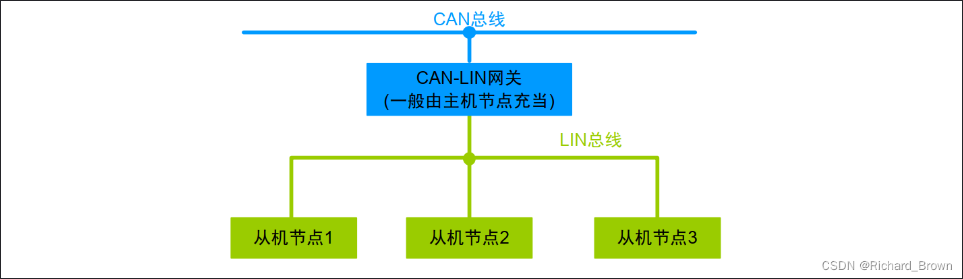
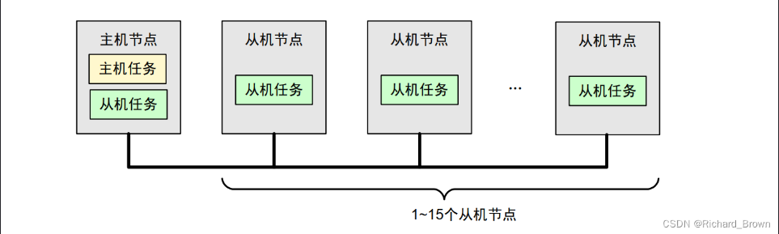
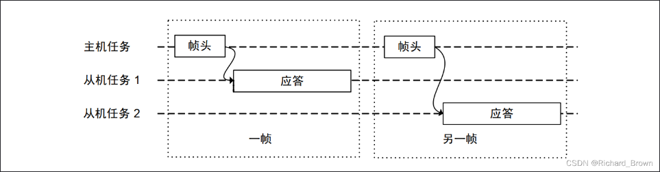

## Lin总线简介
Lin是local interconnect network的缩写，是一种低成本、低速率的串行通信协议，主要用于汽车电子系统中的传感器和执行器之间的通信。Lin总线通常用于非关键性应用，如车窗控制、座椅调节、车灯控制等。

### LIN子网
一般来说，lin网络不会单独的存在，只有在有CAN总线的情况下才会使用lin总线，因此子网是相对于上层can网络的，如果不强调和上层网络相连，也称作lin网络

一个节点不一定对应一个ECU(electronic control unit)，一个ECU可以有多个节点，一个节点也可以有多个ECU组成，lin网络的拓扑结构是单主多从的，只有一个主节点，其他都是从节点。

### LIN节点
一般来说，LIn的拓扑结构为单总线，应用了一主多从的概念
总线的电平为12V，传输速率最高为20kbps，传输距离一般不超过40米。LIN总线的通信协议是基于UART的，数据传输采用异步串行通信方式。
主机节点有且只有1一个，从机的节点可以从1到15个

主机节点包含了`主机任务和从机任务`,从机任务只包含了从机任务。主机节点负责发送命令和接收数据，从机节点负责响应主机的请求并发送数据。

__主机任务__
主机任务主要包括以下几个方面：
1. 调度总线上的帧发送gd持续
2. 检测数据，处理错误
3. 作为标准时钟参考
4. 将接收从机节点的唤醒命令

__从机任务__
从机任务主要包括以下几个方面：
1. 发送ack
2. 接收应答
3. 既不接受也不应答

### LIN的协议层

#### LIN帧结构

帧(Frame)包含帧头和应答两个部分
主机任务：负责发送帧头、
从机任务：接收帧头并且对帧头包含的信息进行解析，解析后根据帧头的内容决定是否发送应答帧。

帧头包括同步间隔段，同步段，以及PID段
