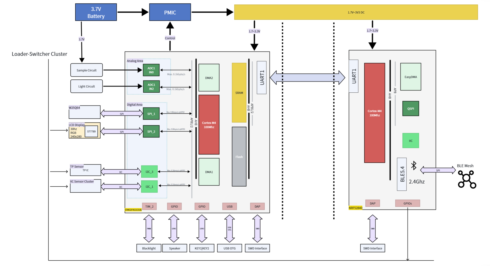
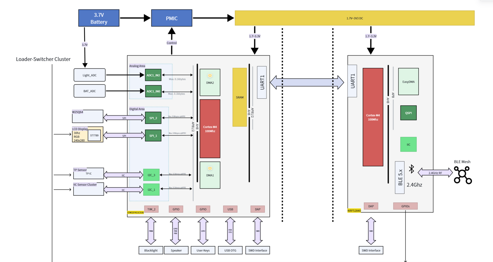
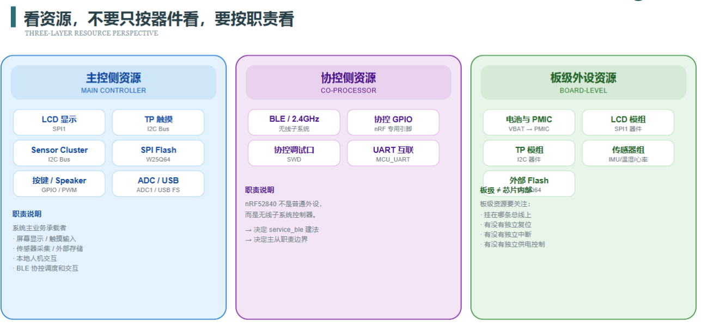
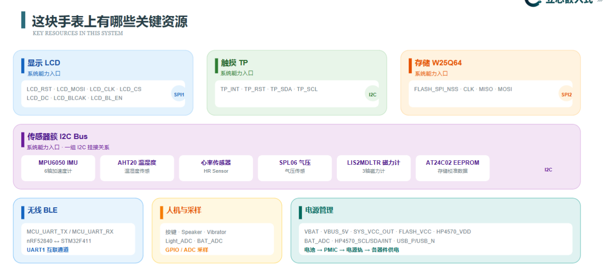
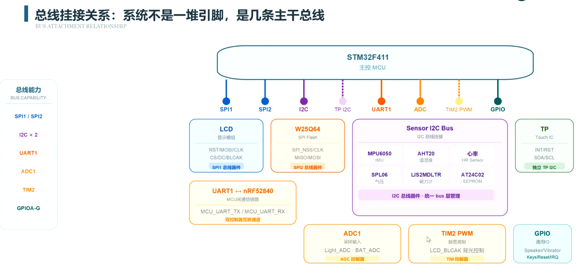
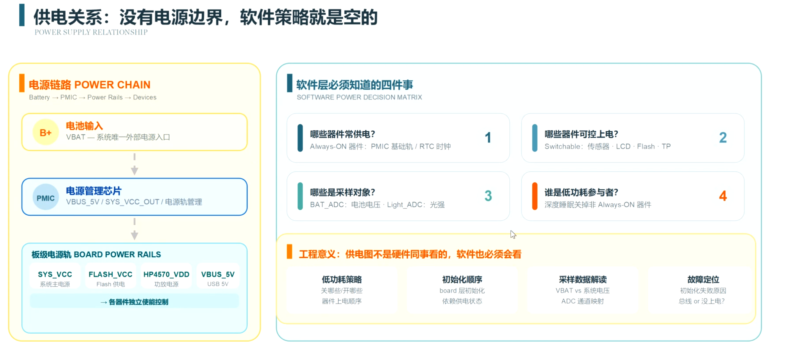
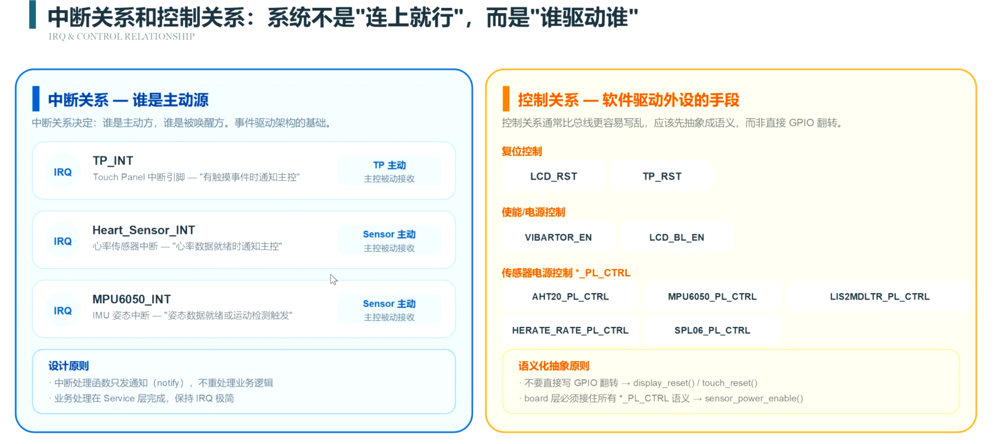
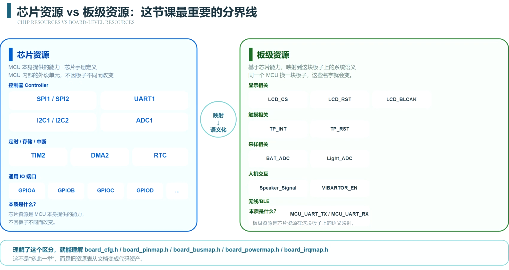
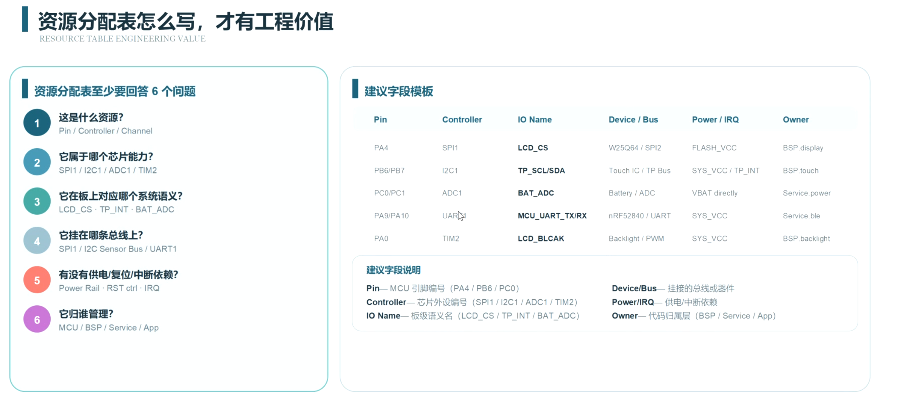
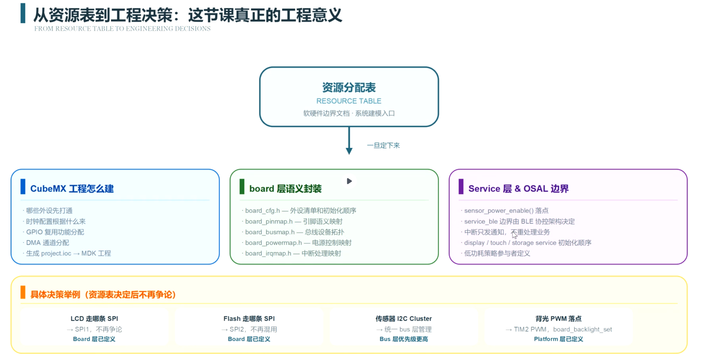

## 资源分配
学习目标:了解资源分配表和系统边界
先看资源约束，在做工程决策
> 此部分有用于学习AI_TDD 当中的资源分配，让AI更明白的了解如何去规定边界，以及分层管理

### 资源分配表
资源分配表是一个工具，用于明确系统中不同组件或模块所需的资源。这些资源可以包括计算资源、存储资源、网络资源等。通过资源分配表，开发团队可以更好地规划和管理系统的资源需求，确保系统的性能和稳定性。

- 确立资源优先原则：强调嵌入式开发必须首先审视底层硬件资源约束（如引脚、内存、外设），而非直接实现功能，避免因硬件瓶颈导致软件性能无法提升。

**正确的路径：**
1. **资源约束表**： 软硬件边界文档，系统化建模入口
2. **工程决策**：  总线关系，
3. **代码实现**： 资源分配表，系统资源地图
4. **文档->代码资源**： 资源分配表，系统资源地图

核心资源全景
资源分配关系
三大关系
芯片和板级资源分配关系
统一建模关系
系统资源地图

#### 从系统边界看边界

在一个项目当中，不需要先看MCU主控，而是先看电源`power channel`.先看电源的转换，然后看MCU和其他的控制例如4g+ble的通信模块。了解一个全面的资源分配。

#### 看资源，不要按期间看，要看指责

先要分析全部资源是让那一些主控或者辅控来控制的，然后看看项目的关键资源，这样方便设计任务优先级，资源分配优先级，系统边界的划分。

以及作为用户交互比较密切的资源，就需要单独做pin脚用于交互，例如IIC总线上的TP sensor需要单独挂载，这里也确定了关键资源的优先排布

供电关系，作为嵌入式工程师了解如何上电是非常总要的，了解电源就可以知道那一些期间是常供电，利于做低功耗设计

中断和控制关系，系统化不是“连上就行”而是“谁驱动谁”，了解中断关系可以知道系统的主控和辅控的关系，知道系统的主控和辅控的关系就可以知道系统的边界在哪里

芯片资源VS板级资源，芯片资源是芯片内部的资源，例如CPU、内存、外设等，而板级资源是指整个系统中所有的资源，包括芯片资源和其他外部资源。了解芯片资源和板级资源的关系可以帮助我们更好地进行系统设计和优化。

> 外部的板级资源是需要芯片资源来控制的，这里的board_cfg.h 能够把资源表的文档改成代码资产，

**资源表怎么写，才有工程价值**

资源分配表至少要回答6个问题
1. 这是什么资源
2. 它是属于哪个芯片能力的
3. 它在板上对应的那个系统语义
4. 它挂载系统的哪条总线上
5. 有没有供电/复位/中断等关系
6. 它归谁管理

**从资源分配表到工程决策**
