# 系统分层

学习目标：理解嵌入式软件为什么要分层、怎么分层、每一层应该放什么文件，以及拿到一个新外设或新功能时如何落到工程目录里。

分层的本质是：阻碍变化的传播。

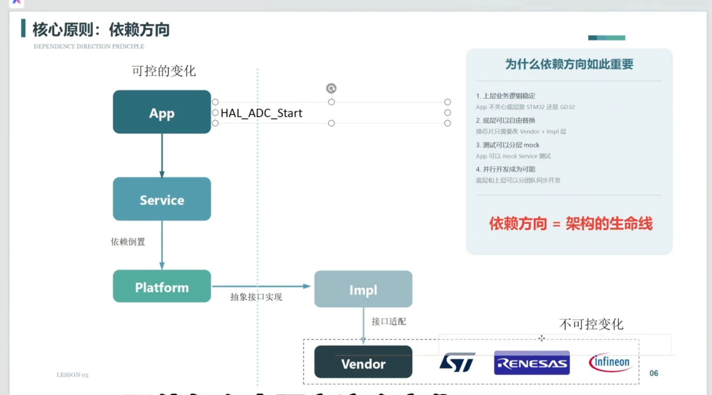

上一篇讲的是“资源分配表与系统边界”：先看电源、引脚、总线、中断、主控/辅控关系，再做工程决策。系统分层就是把这些工程决策变成代码目录和接口边界。

本文会同时使用两种视角：

- **五层导学视角**：`Vendor -> Impl -> Platform -> Service -> App`，适合理解接口抽象、函数指针容器、适配层和业务层。
- **工程落地视角**：`MCU -> BSP -> Driver -> OSAL -> Middleware -> Service -> App`，适合真正创建目录、放置 `.c/.h/.md` 文件。

这两种说法不冲突。五层架构更偏“设计思想”，七层工程结构更偏“项目目录落地”。

---

## 0. 五层架构导学

从 `Vendor` 到 `App` 创建第一版工程骨架时，可以先按五层理解：

```text
App      产品应用层，负责产品流程和业务编排
Service  业务服务层，负责电量统计、按键事件、LED 模式、通信服务等
Platform 平台抽象层，负责定义统一接口和对象模型
Impl     平台实现层，负责把 Platform 接口适配到具体芯片、板子或 OS
Vendor   厂商库层，负责 STM32 HAL、Nordic SDK、杰理 SDK、CMSIS 等
```

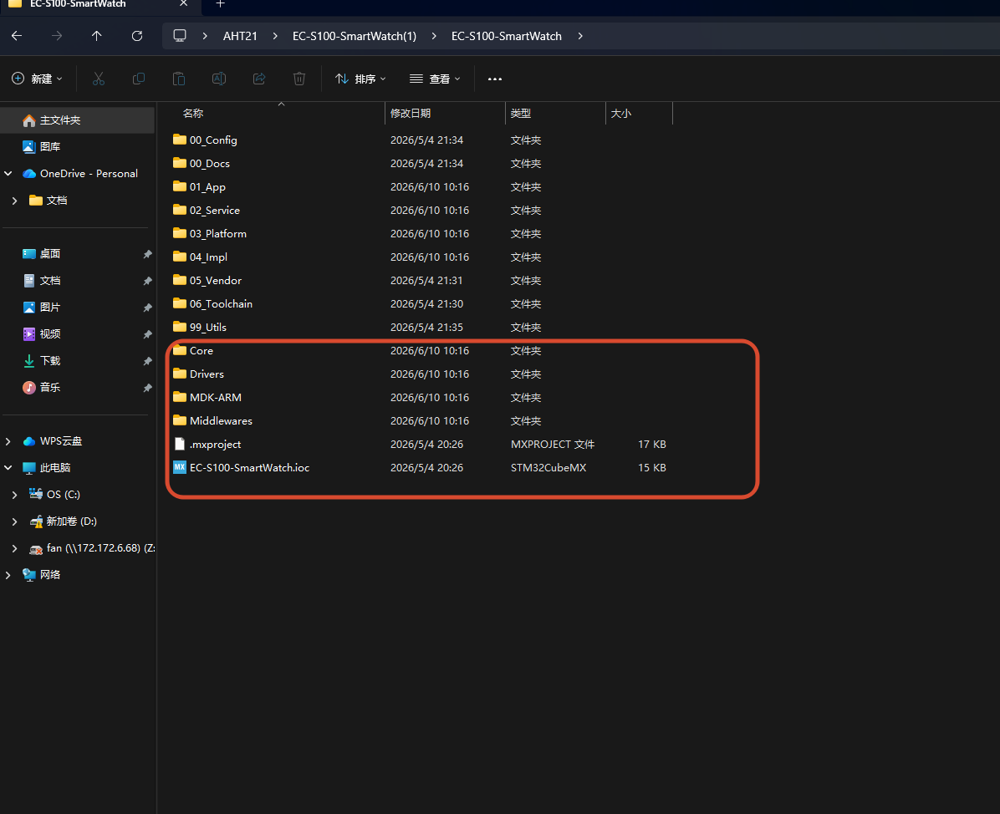

`Vendor` 通常是芯片厂商提供的底层库，一般不要频繁修改。它的作用是把芯片寄存器、启动文件、HAL/LL 库隔离起来，避免业务代码直接和芯片强耦合。

`toolchain` 是编译工具链，例如 MDK、IAR、GCC、CMake、链接器、烧录器、调试器等。它不是业务分层的一部分，但会影响工程如何编译、链接和调试。

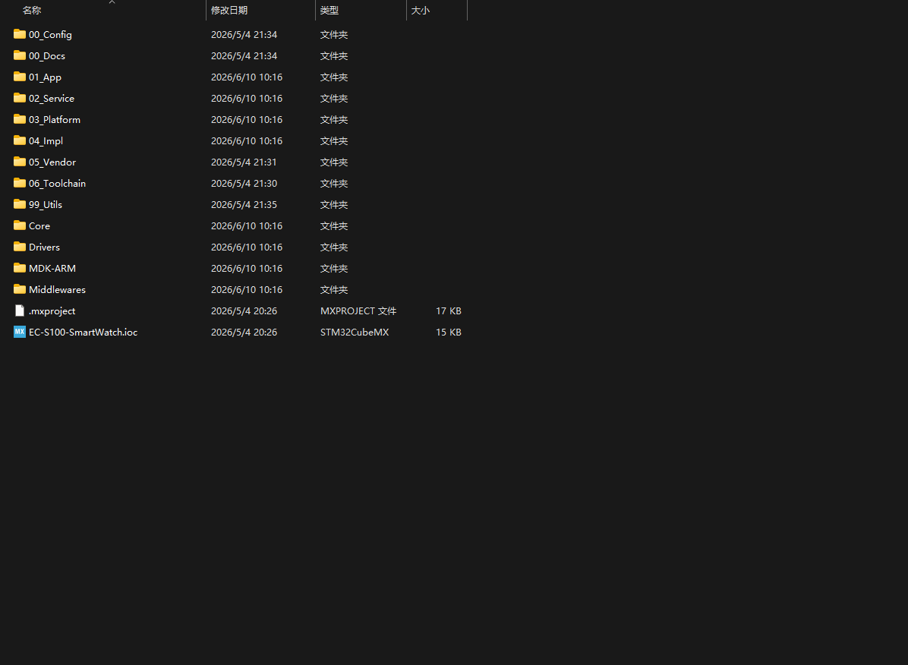

工程骨架里通常还会有这些公共目录：

- `Doc/`：放资源分配表、系统边界、系统架构设计、移植说明等文档。
- `config/`：放项目级配置、功能开关、引脚宏、波特率、缓存大小等。
- `utils/`：放 CRC、大小端转换、加密、通用数据结构、字符串处理等工具函数。

App 层的依赖应该尽量只调用 `Platform` 和 `Service` 的接口。也就是说，App 不应该直接包含芯片 HAL 头文件，也不应该直接操作具体 GPIO。

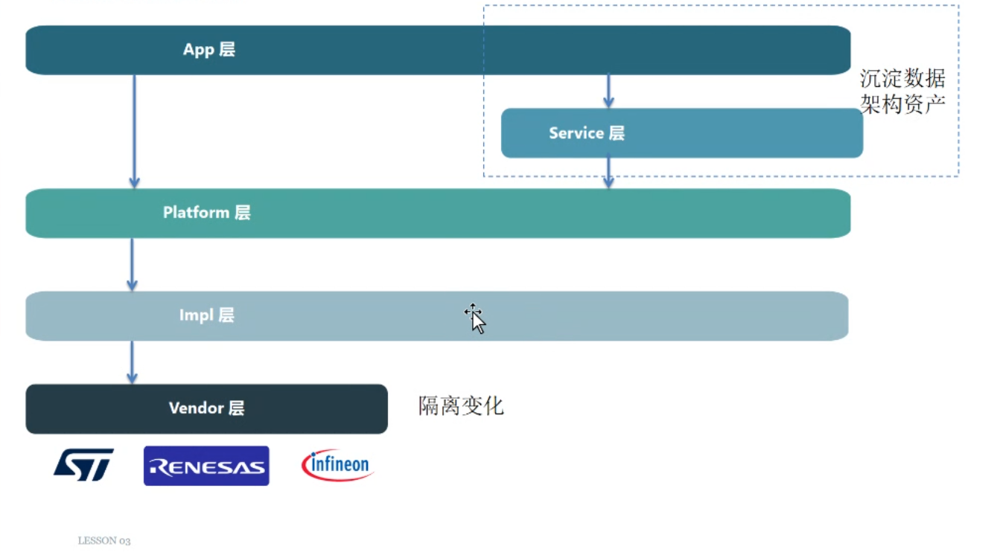

### 0.1 Platform 层：接口和对象模型

`Platform` 层不是简单放几个函数声明，它更像一个“函数指针容器 + 对象模型”。它定义上层能用什么能力，但不关心这个能力由哪个芯片、哪个 GPIO、哪个 RTOS 实现。

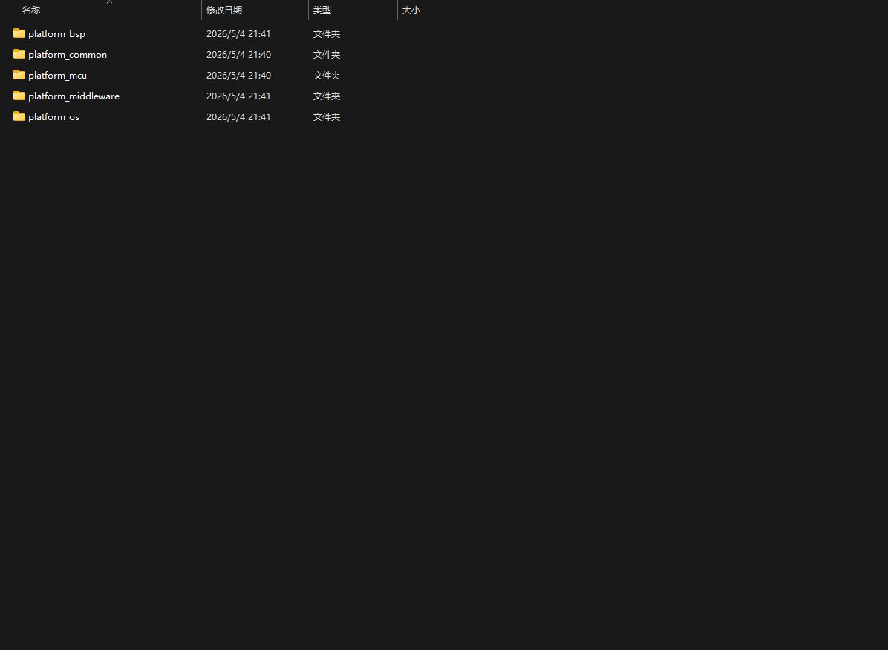

例如 I2C 初始化接口：

```c
typedef aht21_status_t (*pf_iic_init_t)(void *iic_cfg);
```

这里的 `pf_iic_init_t` 就是抽象接口。Service 或 Driver 只依赖这个接口，不直接依赖 `HAL_I2C_Init()`。

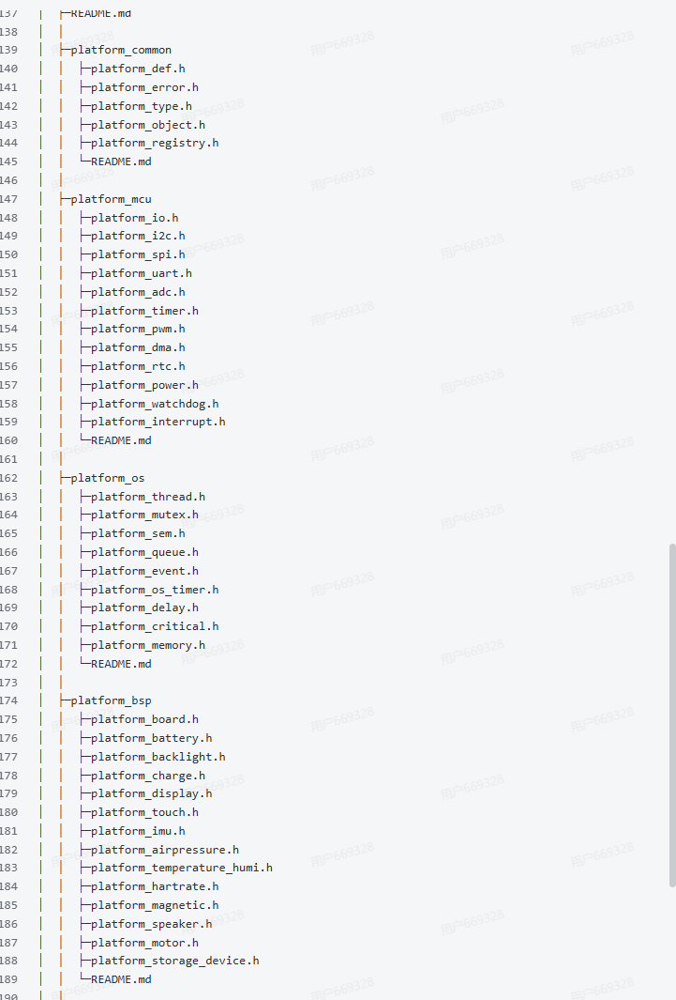

### 0.2 Impl 层：接口的具体实现

`Platform` 给出抽象接口，`Impl` 负责具体实现，也可以理解为 `adapter` 适配层。

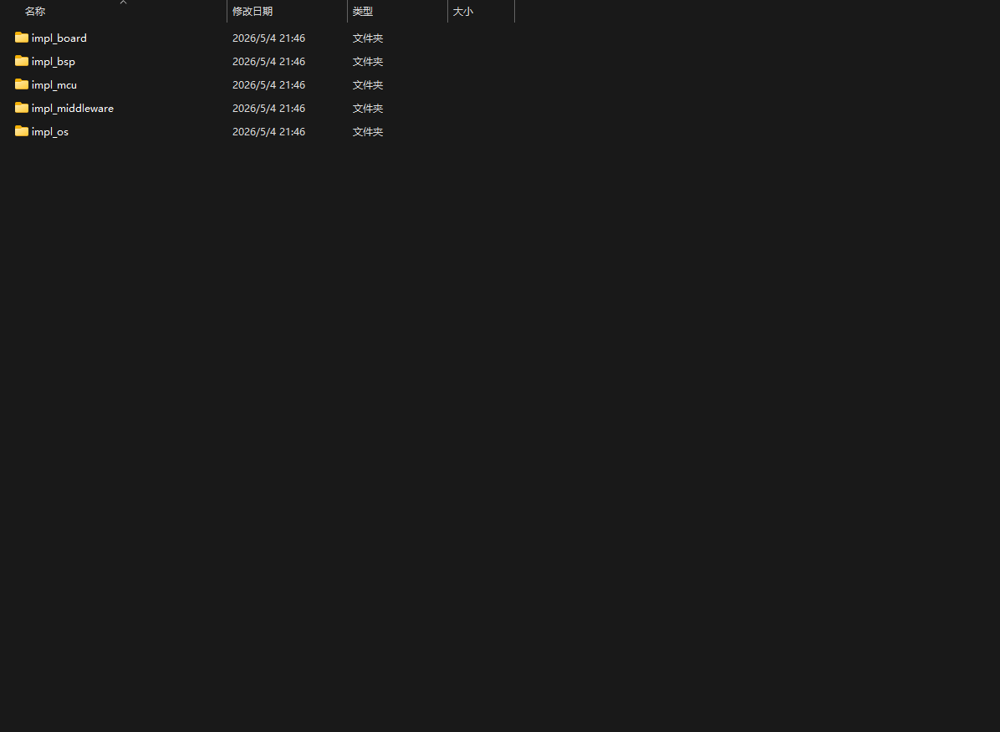

例如同样是 `iic_init`：

- STM32 平台下，Impl 调用 `HAL_I2C_Init()`。
- Nordic 平台下，Impl 调用 `nrfx_twim_init()`。
- 裸机模拟 I2C 下，Impl 初始化 GPIO 和延时函数。

这样上层不用关心底层怎么换。

### 0.3 Service 层：业务能力

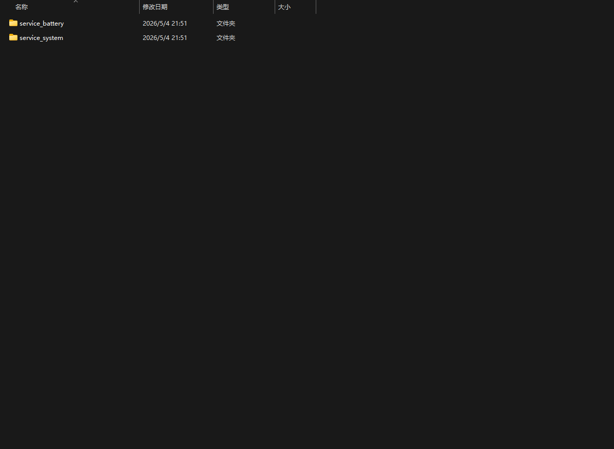
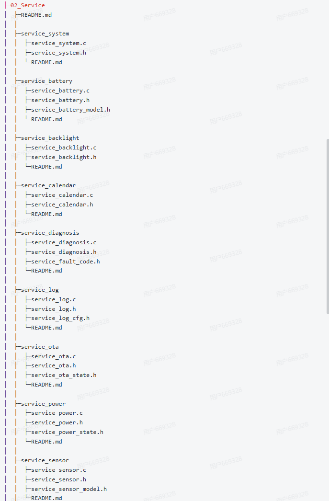

Service 层主要放业务相关但又可以复用的逻辑，例如：

- 电量统计。
- 电量预估。
- 电源管理。
- 按键短按/长按/双击。
- LED 快闪/慢闪/故障闪。
- 传感器周期采样和滤波。

这些逻辑和具体平台关系不大，所以不要放进 Vendor 或 Impl 里。

### 0.4 App 层：产品流程

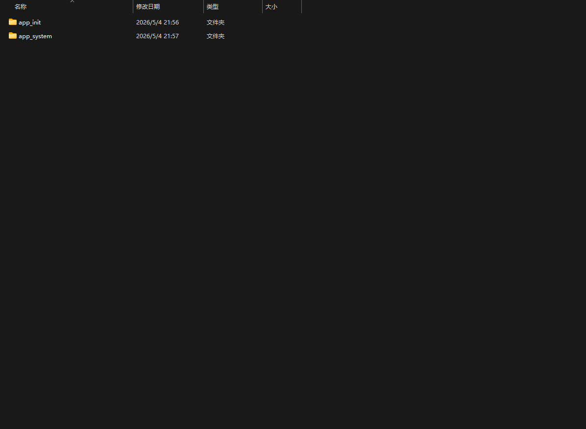
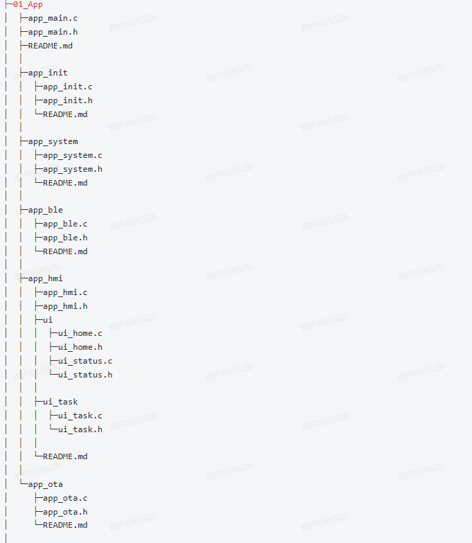

App 层负责最终产品流程，例如：

- 开机后进入什么状态。
- 按键长按是否恢复出厂。
- 低电量时是否禁止某个功能。
- 通信失败后是否重试。
- OTA 成功后是否重启。

Service 层可以不是每个小项目都必须写，但一旦业务逻辑开始复杂，建议把 Service 层单独拆出来，避免 App 直接堆成“大杂烩”。

一句话理解系统分层：

> 把“硬件怎么连、芯片怎么驱动、板子怎么初始化、业务要做什么”拆到不同层里，让每一层只关心自己该关心的事情。

如果不分层，代码通常会变成这样：

```c
// app.c 里面直接操作寄存器、HAL、GPIO、延时、业务逻辑
HAL_GPIO_WritePin(GPIOA, GPIO_PIN_5, GPIO_PIN_SET);
HAL_Delay(100);
HAL_GPIO_WritePin(GPIOA, GPIO_PIN_5, GPIO_PIN_RESET);
```

短期看很快，长期会出现几个问题：

- 换一个引脚，要改业务代码。
- 换一块板子，要改很多应用文件。
- 裸机改 RTOS，所有延时、任务、队列都要重写。
- 同一个外设被多个功能使用时，资源冲突很难查。
- 新人不知道代码应该放哪里，越写越乱。

分层之后，应用层只表达“我要 LED 闪烁”，不关心 LED 是 GPIO 控制、PWM 控制，还是经过扩展 IO 控制：

```c
led_service_blink(LED_STATUS, 100, 3);
```

底层怎么实现，由下面的层负责。

---

## 1. 分层前先确定系统边界

不要一上来就创建 `driver/ app/ bsp/` 目录。先回答几个问题：

1. 这个系统有哪些主控和辅控？
2. 每个外设挂在哪个总线上？例如 GPIO、I2C、SPI、UART、CAN、ADC。
3. 外设由谁供电？电源是否可控？是否有上电时序？
4. 外设有没有复位脚、中断脚、片选脚、使能脚？
5. 哪些资源是多个模块共享的？例如 I2C 总线、SPI 总线、DMA、定时器。
6. 哪些功能属于业务？哪些只是硬件访问？

资源边界决定分层边界。举例：

| 资源 | 资源归属 | 代码应该落在哪 |
| --- | --- | --- |
| MCU 内部 GPIO 寄存器/HAL GPIO | 芯片能力 | `mcu/`、`hal/`、`core/` |
| 板子上 LED 接到 PA5 | 板级资源 | `bsp/board_xxx/` |
| LED 亮、灭、翻转 | 外设驱动能力 | `drivers/led/` |
| 状态灯快闪、慢闪、故障闪 | 业务服务 | `services/led_service/` |
| 设备进入低功耗时关闭 LED | 应用策略 | `app/` |

新手最容易犯的错误是：把“板子接线信息”和“业务策略”混在驱动里。

例如：

```c
// 不推荐：驱动里写死业务含义
void led_error_alarm(void)
{
    HAL_GPIO_WritePin(GPIOA, GPIO_PIN_5, GPIO_PIN_SET);
}
```

更合理的拆法：

```c
// driver 层：只知道 LED 怎么亮灭
led_driver_set(&g_led_status, LED_ON);

// service/app 层：才知道这个 LED 代表故障
led_service_show_error();
```

---

## 2. 推荐的嵌入式工程分层

一个比较通用的嵌入式工程可以分成 7 层：

```text
应用层 App
    负责产品功能、业务流程、状态机、任务编排

服务层 Service / Module
    负责可复用的业务能力，例如 LED 服务、按键服务、传感器服务、通信服务

中间件层 Middleware
    负责协议栈、文件系统、算法库、日志、环形缓冲区、组件库

OS 抽象层 OSAL
    负责屏蔽 FreeRTOS / RT-Thread / 裸机之间的差异

板级支持层 BSP / Board
    负责具体板子的引脚、时钟、电源、外设挂载、初始化顺序

驱动抽象层 Driver
    负责外部器件驱动，例如 AHT11、MPU6050、W25Q64、LED、按键

芯片支持层 MCU / HAL / LL / CMSIS
    负责芯片寄存器、HAL 库、启动文件、中断向量、时钟底层
```

从依赖方向看，应该是上层依赖下层：

```text
app
  -> services
      -> middleware
      -> drivers
          -> bsp
              -> mcu_hal
  -> osal
```

更准确地说：

- 上层可以调用下层接口。
- 下层不要直接调用上层业务。
- 驱动层不要知道产品业务。
- BSP 层不要写复杂业务逻辑。
- App 层不要直接操作寄存器和硬件引脚。

五层导学视角和七层工程视角可以这样对应：

| 五层导学视角 | 七层工程落地视角 | 典型目录 | 说明 |
| --- | --- | --- | --- |
| `Vendor` | `MCU / HAL / LL / CMSIS` | `mcu/`、`vendor/` | 芯片厂商库、启动文件、寄存器、HAL/SDK |
| `Impl` | `BSP / Board` | `bsp/board_xxx/` | 具体板子的引脚、总线、电源、中断适配 |
| `Platform` | `Driver + Port/Ops` | `drivers/xxx/` | 定义对象、接口、函数指针和器件能力 |
| `Service` | `Service + Middleware + OSAL` | `services/`、`middleware/`、`osal/` | 可复用业务能力、通用组件、系统抽象 |
| `App` | `App` | `app/` | 产品流程、状态机、功能编排 |

如果你是小白，先记住一个原则：

> `Platform` 负责“我需要什么能力”，`Impl/BSP` 负责“这个能力在当前板子上怎么实现”，`Service/App` 负责“这个能力在产品里怎么使用”。

---

## 3. 推荐目录结构

下面是一套适合 STM32、杰理、Nordic、NXP 等 MCU 项目的通用目录结构。实际项目可以裁剪，但思想不变。

```text
project/
├── app/                         # 应用层：产品功能入口
│   ├── app_main.c
│   ├── app_main.h
│   ├── app_task.c
│   ├── app_task.h
│   ├── app_state.c
│   ├── app_state.h
│   └── features/
│       ├── feature_alarm.c
│       ├── feature_alarm.h
│       ├── feature_low_power.c
│       └── feature_low_power.h
│
├── services/                    # 服务层：面向业务的可复用能力
│   ├── led_service/
│   │   ├── led_service.c
│   │   ├── led_service.h
│   │   └── led_service_cfg.h
│   ├── key_service/
│   │   ├── key_service.c
│   │   ├── key_service.h
│   │   └── key_service_cfg.h
│   └── sensor_service/
│       ├── sensor_service.c
│       ├── sensor_service.h
│       └── sensor_service_cfg.h
│
├── middleware/                  # 中间件层：与具体板子弱相关的通用组件
│   ├── log/
│   │   ├── log.c
│   │   ├── log.h
│   │   └── log_cfg.h
│   ├── ringbuffer/
│   │   ├── ringbuffer.c
│   │   └── ringbuffer.h
│   ├── protocol/
│   │   ├── protocol_frame.c
│   │   ├── protocol_frame.h
│   │   ├── protocol_crc.c
│   │   └── protocol_crc.h
│   └── third_party/
│       └── fatfs/
│
├── osal/                        # OS 抽象层：统一任务、延时、锁、队列、内存
│   ├── osal.c
│   ├── osal.h
│   ├── osal_freertos.c
│   ├── osal_baremetal.c
│   └── osal_cfg.h
│
├── drivers/                     # 驱动层：外部器件或逻辑设备驱动
│   ├── led/
│   │   ├── led_driver.c
│   │   ├── led_driver.h
│   │   └── led_driver_port.h
│   ├── aht11/
│   │   ├── aht11.c
│   │   ├── aht11.h
│   │   └── aht11_port.h
│   ├── w25q64/
│   │   ├── w25q64.c
│   │   ├── w25q64.h
│   │   └── w25q64_port.h
│   └── mpu6050/
│       ├── mpu6050.c
│       ├── mpu6050.h
│       └── mpu6050_port.h
│
├── bsp/                         # 板级支持层：具体板子的资源映射和初始化
│   ├── board_common/
│   │   ├── board_init.c
│   │   ├── board_init.h
│   │   ├── board_resource.h
│   │   └── board_power.c
│   └── board_stm32f103_demo/
│       ├── board_cfg.h
│       ├── board_pinmap.h
│       ├── board_clock.c
│       ├── board_clock.h
│       ├── board_gpio.c
│       ├── board_gpio.h
│       ├── board_i2c.c
│       ├── board_i2c.h
│       ├── board_spi.c
│       ├── board_spi.h
│       ├── board_uart.c
│       └── board_uart.h
│
├── mcu/                         # 芯片支持层：芯片厂商库、启动文件、中断
│   ├── cmsis/
│   ├── hal/
│   ├── startup/
│   ├── linker/
│   ├── system_clock.c
│   ├── system_clock.h
│   ├── interrupt.c
│   └── interrupt.h
│
├── config/                      # 系统级配置
│   ├── project_config.h
│   ├── feature_config.h
│   ├── memory_config.h
│   └── version.h
│
├── docs/                        # 工程文档
│   ├── resource_table.md
│   ├── architecture.md
│   ├── porting_guide.md
│   └── module_design/
│
├── tests/                       # 单元测试、模块测试、仿真测试
│   ├── test_ringbuffer.c
│   ├── test_protocol.c
│   └── mock/
│
└── tools/                       # 脚本工具
    ├── gen_version.py
    ├── pack_firmware.py
    └── check_resource.py
```

如果项目很小，不一定要一次建全。最小可用结构可以是：

```text
project/
├── app/
├── services/
├── drivers/
├── bsp/
├── mcu/
└── config/
```

---

## 4. 每一层具体应该放什么

### 4.1 MCU / HAL / Core 层：芯片能力层

这一层代表“芯片本身提供什么能力”。

典型内容：

- 启动文件：`startup_xxx.s`
- 链接脚本：`xxx.ld`、`xxx.sct`、`xxx.icf`
- 中断向量表：`startup`、`isr_vector`
- 系统时钟初始化：`system_xxx.c`
- 芯片头文件：`stm32f1xx.h`、`core_cm3.h`
- 厂商 HAL/LL/SDK：`stm32f1xx_hal_gpio.c`、`nrf_gpio.h`
- 基础中断入口：`xxx_it.c`、`interrupt.c`

推荐文件：

```text
mcu/
├── cmsis/
├── hal/
├── startup/
├── linker/
├── system_clock.c
├── system_clock.h
├── interrupt.c
└── interrupt.h
```

这一层应该做：

- 初始化 MCU 时钟树。
- 提供厂商库原始能力。
- 提供中断入口。
- 提供寄存器、HAL、LL 级别接口。

这一层不应该做：

- 不应该知道板子上接了哪个 LED。
- 不应该知道产品业务。
- 不应该写“故障灯闪烁”“上传温度”等业务逻辑。

判断标准：

> 如果这段代码换一块同芯片的板子也能用，它大概率属于 MCU 层。

---

### 4.2 BSP / Board 层：板级支持层

BSP 是 Board Support Package，意思是“这块板子怎么把芯片能力连接到真实硬件”。

MCU 层只知道 `GPIOA PIN5` 是一个 GPIO。BSP 层知道 `GPIOA PIN5` 接的是 `LED_STATUS`。

典型内容：

- 板子引脚定义。
- 外设挂载关系。
- 电源控制脚。
- 复位脚。
- 中断脚。
- 片选脚。
- 总线初始化。
- 板级时钟初始化。
- 板级外设初始化顺序。

推荐文件：

```text
bsp/
└── board_stm32f103_demo/
    ├── board_cfg.h             # 板级开关配置
    ├── board_pinmap.h          # 引脚映射表
    ├── board_resource.h        # 板级资源声明
    ├── board_init.c            # 板级初始化入口
    ├── board_init.h
    ├── board_gpio.c            # GPIO 初始化与板级 GPIO 操作
    ├── board_gpio.h
    ├── board_i2c.c             # I2C 总线初始化和读写适配
    ├── board_i2c.h
    ├── board_spi.c             # SPI 总线初始化和读写适配
    ├── board_spi.h
    ├── board_uart.c            # UART 初始化和收发适配
    ├── board_uart.h
    ├── board_power.c           # 电源域、使能脚、低功耗控制
    └── board_power.h
```

`board_pinmap.h` 示例：

```c
#ifndef BOARD_PINMAP_H
#define BOARD_PINMAP_H

#define LED_STATUS_GPIO_PORT      GPIOA
#define LED_STATUS_GPIO_PIN       GPIO_PIN_5

#define AHT11_DATA_GPIO_PORT      GPIOB
#define AHT11_DATA_GPIO_PIN       GPIO_PIN_6

#define W25Q64_SPI_HANDLE         hspi1
#define W25Q64_CS_GPIO_PORT       GPIOA
#define W25Q64_CS_GPIO_PIN        GPIO_PIN_4

#define MPU6050_I2C_HANDLE        hi2c1
#define MPU6050_INT_GPIO_PORT     GPIOB
#define MPU6050_INT_GPIO_PIN      GPIO_PIN_1

#endif
```

`board_init.c` 示例：

```c
#include "board_init.h"
#include "board_gpio.h"
#include "board_i2c.h"
#include "board_spi.h"
#include "board_uart.h"
#include "board_power.h"

void board_init(void)
{
    board_clock_init();
    board_power_init();
    board_gpio_init();
    board_i2c_init();
    board_spi_init();
    board_uart_init();
}
```

BSP 层应该做：

- 把资源分配表落成代码。
- 把“某个外设接在哪个引脚/总线”表达清楚。
- 管理板级初始化顺序。
- 提供给驱动层使用的底层读写函数。

BSP 层不应该做：

- 不应该实现复杂业务策略。
- 不应该写“温度超过 50 度报警”。
- 不应该把协议解析放进去。
- 不应该把大量应用状态机放进去。

判断标准：

> 如果换一块板子就必须改这段代码，它大概率属于 BSP 层。

---

### 4.3 Driver 层：器件驱动层

Driver 层代表“一个外部器件或逻辑设备怎么工作”。

例如：

- LED 驱动：知道如何开关 LED。
- AHT11 驱动：知道如何按时序读取温湿度。
- W25Q64 驱动：知道如何读 ID、擦除扇区、页编程。
- MPU6050 驱动：知道如何读寄存器、配置量程、读取加速度。

驱动层的核心思想：

> 驱动层应该尽量不写死具体板子的引脚，而是通过 port 接口由 BSP 提供硬件访问能力。

推荐目录：

```text
drivers/
└── aht11/
    ├── aht11.c                 # 器件逻辑实现
    ├── aht11.h                 # 对外 API、类型、错误码
    ├── aht11_port.h            # 驱动需要的底层接口声明
    └── README.md               # 可选：器件说明、移植说明
```

`aht11.h` 应该放：

- 对外公开的类型。
- 初始化函数。
- 读取函数。
- 错误码。
- 必要配置结构体。

示例：

```c
#ifndef AHT11_H
#define AHT11_H

#include <stdint.h>

typedef enum
{
    AHT11_OK = 0,
    AHT11_ERROR,
    AHT11_TIMEOUT,
    AHT11_INVALID_PARAM,
} aht11_status_t;

typedef struct
{
    int16_t temperature_x10;
    int16_t humidity_x10;
} aht11_data_t;

typedef struct
{
    void (*set_data_output)(void);
    void (*set_data_input)(void);
    void (*write_data)(uint8_t level);
    uint8_t (*read_data)(void);
    void (*delay_us)(uint32_t us);
    void (*delay_ms)(uint32_t ms);
} aht11_port_t;

typedef struct
{
    const aht11_port_t *port;
    uint8_t is_inited;
} aht11_t;

aht11_status_t aht11_init(aht11_t *dev, const aht11_port_t *port);
aht11_status_t aht11_read(aht11_t *dev, aht11_data_t *data);

#endif
```

`aht11.c` 应该放：

- AHT11 协议时序。
- 数据校验。
- 状态管理。
- 对 `port` 函数的调用。

它不应该直接写：

```c
HAL_GPIO_WritePin(GPIOB, GPIO_PIN_6, GPIO_PIN_SET);
```

而应该写：

```c
dev->port->write_data(1);
```

这样换板子时，只改 BSP 的适配函数，不改 AHT11 驱动。

驱动层应该做：

- 实现器件手册里的时序、寄存器、协议。
- 把硬件访问抽象成 `port` 或 `ops`。
- 提供清晰的初始化、读写、控制接口。
- 管理器件自身状态。

驱动层不应该做：

- 不应该知道这个传感器数据用于什么业务。
- 不应该直接创建 RTOS 任务。
- 不应该直接打印大量业务日志。
- 不应该直接访问应用层全局变量。

判断标准：

> 如果这段代码换一块板子仍然应该复用，它大概率属于 Driver 层；如果只需要替换 GPIO/I2C/SPI 适配函数，那驱动设计就是健康的。

---

### 4.4 OSAL 层：操作系统抽象层

OSAL 是 OS Abstraction Layer，意思是“操作系统抽象层”。

裸机、FreeRTOS、RT-Thread、Zephyr 的接口不一样：

```c
HAL_Delay(10);          // 裸机或 HAL
vTaskDelay(10);         // FreeRTOS
rt_thread_mdelay(10);   // RT-Thread
```

如果业务代码里到处写 `vTaskDelay`，以后换 OS 会非常痛苦。所以可以统一成：

```c
osal_delay_ms(10);
```

推荐文件：

```text
osal/
├── osal.h
├── osal.c
├── osal_freertos.c
├── osal_baremetal.c
├── osal_rtthread.c
└── osal_cfg.h
```

`osal.h` 应该放：

- 延时接口。
- tick 获取接口。
- 互斥锁接口。
- 临界区接口。
- 队列接口。
- 任务创建接口。
- 内存申请接口。

示例：

```c
#ifndef OSAL_H
#define OSAL_H

#include <stdint.h>

typedef void * osal_mutex_t;
typedef void * osal_queue_t;
typedef void * osal_thread_t;

void osal_delay_ms(uint32_t ms);
uint32_t osal_get_tick_ms(void);

int osal_mutex_create(osal_mutex_t *mutex);
int osal_mutex_lock(osal_mutex_t mutex, uint32_t timeout_ms);
int osal_mutex_unlock(osal_mutex_t mutex);

int osal_queue_create(osal_queue_t *queue, uint32_t item_size, uint32_t item_count);
int osal_queue_send(osal_queue_t queue, const void *item, uint32_t timeout_ms);
int osal_queue_recv(osal_queue_t queue, void *item, uint32_t timeout_ms);

void osal_enter_critical(void);
void osal_exit_critical(void);

#endif
```

OSAL 层应该做：

- 屏蔽操作系统差异。
- 统一时间、任务、队列、锁、临界区。
- 让上层模块少依赖具体 RTOS。

OSAL 层不应该做：

- 不应该写业务状态机。
- 不应该知道 LED、传感器、通信协议的业务含义。
- 不应该包含板级引脚定义。

判断标准：

> 如果这段代码是为了屏蔽 FreeRTOS、裸机、RT-Thread 的差异，它属于 OSAL 层。

---

### 4.5 Middleware 层：中间件层

中间件是“和具体业务无关，但很多业务都会用”的通用能力。

典型中间件：

- 日志系统：`log`
- 环形缓冲区：`ringbuffer`
- FIFO：`fifo`
- CRC：`crc`
- 协议帧：`protocol`
- 文件系统：`fatfs`
- 参数存储：`kv_store`
- OTA 升级框架：`ota`
- 命令行 shell：`shell`
- 软件定时器：`soft_timer`
- 事件总线：`event_bus`

推荐目录：

```text
middleware/
├── log/
│   ├── log.c
│   ├── log.h
│   └── log_cfg.h
├── ringbuffer/
│   ├── ringbuffer.c
│   └── ringbuffer.h
├── protocol/
│   ├── protocol_frame.c
│   ├── protocol_frame.h
│   ├── protocol_crc.c
│   └── protocol_crc.h
├── kv_store/
│   ├── kv_store.c
│   ├── kv_store.h
│   └── kv_store_port.h
└── third_party/
    └── fatfs/
```

中间件层应该做：

- 提供稳定的通用组件。
- 尽量不依赖具体板子。
- 对底层依赖使用 port 接口。
- 可以被多个服务和应用复用。

中间件层不应该做：

- 不应该绑定某个产品业务。
- 不应该写“按键按下后打开电机”这种逻辑。
- 不应该直接写死某块板子的引脚。

判断标准：

> 如果这个模块可以复制到另一个项目继续用，它大概率属于 Middleware 层。

---

### 4.6 Service / Module 层：服务层

服务层是新手最容易忽略、但实际工程最有价值的一层。

Driver 层只解决“器件怎么用”，Service 层解决“这个器件在本产品里怎么被组织成能力”。

举例：

- LED Driver：提供 `on/off/toggle`。
- LED Service：提供 `状态灯慢闪`、`故障灯快闪`、`配网呼吸灯`。

- Key Driver：提供 `读取 GPIO 电平`。
- Key Service：提供 `短按`、`长按`、`双击`、`组合键`。

- AHT11 Driver：提供 `读取温湿度`。
- Sensor Service：提供 `周期采样`、`滤波`、`异常值处理`、`数据缓存`。

推荐目录：

```text
services/
├── led_service/
│   ├── led_service.c
│   ├── led_service.h
│   └── led_service_cfg.h
├── key_service/
│   ├── key_service.c
│   ├── key_service.h
│   └── key_service_cfg.h
├── sensor_service/
│   ├── sensor_service.c
│   ├── sensor_service.h
│   └── sensor_service_cfg.h
└── comm_service/
    ├── comm_service.c
    ├── comm_service.h
    └── comm_service_cfg.h
```

`led_service.h` 示例：

```c
#ifndef LED_SERVICE_H
#define LED_SERVICE_H

#include <stdint.h>

typedef enum
{
    LED_SCENE_POWER_ON,
    LED_SCENE_NORMAL,
    LED_SCENE_ERROR,
    LED_SCENE_PAIRING,
} led_scene_t;

void led_service_init(void);
void led_service_set_scene(led_scene_t scene);
void led_service_poll(void);

#endif
```

`key_service.h` 示例：

```c
#ifndef KEY_SERVICE_H
#define KEY_SERVICE_H

typedef enum
{
    KEY_EVENT_NONE,
    KEY_EVENT_SHORT_PRESS,
    KEY_EVENT_LONG_PRESS,
    KEY_EVENT_DOUBLE_CLICK,
} key_event_t;

void key_service_init(void);
key_event_t key_service_get_event(void);
void key_service_poll(void);

#endif
```

服务层应该做：

- 把底层驱动组合成业务能力。
- 管理模块状态机。
- 对 App 层提供简单稳定的接口。
- 处理去抖、滤波、超时、重试、缓存等通用逻辑。
- 可以创建任务，但建议通过 OSAL，不直接绑定具体 RTOS。

服务层不应该做：

- 不应该直接操作寄存器。
- 不应该写死板级引脚。
- 不应该包含太多产品总流程。

判断标准：

> 如果这段代码是“某类功能的通用业务能力”，例如按键事件、LED 模式、传感器采样，它属于 Service 层。

---

### 4.7 App 层：应用层

App 层是产品功能入口。它关心的是“产品要做什么”，不是“硬件怎么做”。

典型内容：

- 主状态机。
- 产品模式。
- 任务编排。
- 功能策略。
- 业务流程。
- 事件处理。

推荐目录：

```text
app/
├── app_main.c
├── app_main.h
├── app_task.c
├── app_task.h
├── app_state.c
├── app_state.h
└── features/
    ├── feature_alarm.c
    ├── feature_alarm.h
    ├── feature_low_power.c
    ├── feature_low_power.h
    ├── feature_factory_test.c
    └── feature_factory_test.h
```

`app_main.c` 示例：

```c
#include "board_init.h"
#include "osal.h"
#include "led_service.h"
#include "key_service.h"
#include "sensor_service.h"
#include "app_state.h"

void app_main(void)
{
    board_init();

    osal_init();
    led_service_init();
    key_service_init();
    sensor_service_init();

    app_state_init();

    while (1)
    {
        key_service_poll();
        sensor_service_poll();
        led_service_poll();
        app_state_poll();

        osal_delay_ms(10);
    }
}
```

App 层应该做：

- 决定产品流程。
- 根据事件调用服务层。
- 管理产品状态，例如初始化、正常运行、故障、低功耗、升级。
- 组合多个 service。

App 层不应该做：

- 不应该直接访问 GPIO 寄存器。
- 不应该直接调用某个传感器的时序函数。
- 不应该写大量板级初始化代码。
- 不应该直接散落 `HAL_Delay`、`vTaskDelay`。

判断标准：

> 如果这段代码描述的是产品行为，它属于 App 层。

---

## 5. 配置文件应该放哪里

配置文件不要随便放。不同配置属于不同层。

### 5.1 芯片配置

例如系统时钟、FLASH、RAM、启动方式。

```text
mcu/
├── system_clock.c
├── system_clock.h
└── linker/
```

### 5.2 板级配置

例如引脚、外设挂载、总线、片选、复位、中断。

```text
bsp/board_xxx/
├── board_cfg.h
├── board_pinmap.h
└── board_resource.h
```

### 5.3 模块配置

例如 LED 数量、按键数量、滤波时间、队列长度。

```text
services/led_service/led_service_cfg.h
services/key_service/key_service_cfg.h
drivers/w25q64/w25q64_cfg.h
```

### 5.4 产品级配置

例如功能裁剪、版本号、产品型号。

```text
config/
├── project_config.h
├── feature_config.h
└── version.h
```

示例：

```c
// config/feature_config.h
#define FEATURE_BLE_ENABLE        1
#define FEATURE_OTA_ENABLE        1
#define FEATURE_FACTORY_TEST      1
#define FEATURE_LOW_POWER_ENABLE  1
```

---

## 6. 头文件应该怎么设计

头文件是分层边界。新手经常把内部细节暴露在 `.h` 里，导致上层乱用。

### 6.1 `.h` 放什么

`.h` 文件应该放：

- 对外 API。
- 对外类型。
- 对外错误码。
- 必要的配置结构体。
- 必要的宏定义。

`.h` 文件不建议放：

- 私有全局变量。
- 私有函数声明。
- 大量只给 `.c` 自己用的宏。
- 不必要的 HAL 头文件。

### 6.2 `.c` 放什么

`.c` 文件应该放：

- 具体实现。
- 私有函数。
- 私有状态变量。
- 内部宏。

示例：

```c
// led_service.h：只暴露上层需要调用的接口
void led_service_init(void);
void led_service_set_scene(led_scene_t scene);

// led_service.c：内部状态不暴露
static led_scene_t s_current_scene;
static void led_service_apply_scene(led_scene_t scene);
```

### 6.3 include 依赖原则

推荐：

```c
#include "led_service.h"
#include "led_driver.h"
#include "osal.h"
```

不推荐在 App 层直接：

```c
#include "stm32f1xx_hal_gpio.h"
#include "board_pinmap.h"
```

因为这说明应用层已经越过 service/driver/bsp，直接依赖硬件细节。

---

## 7. 新增一个模块时怎么分层

假设要新增一个 `MPU6050` 六轴传感器。

### 7.1 第一步：先写资源表

| 项目 | 内容 |
| --- | --- |
| 器件 | MPU6050 |
| 通信总线 | I2C1 |
| 地址 | 0x68 |
| 中断脚 | PB1 |
| 供电 | 3V3 常供电 |
| 复位 | 无独立复位脚 |
| 谁管理 | 主 MCU |
| 业务用途 | 姿态检测、运动检测 |

### 7.2 第二步：BSP 落板级资源

新增或修改：

```text
bsp/board_stm32f103_demo/
├── board_pinmap.h
├── board_i2c.c
└── board_i2c.h
```

`board_pinmap.h`：

```c
#define MPU6050_I2C_ADDR          0x68
#define MPU6050_I2C_HANDLE        hi2c1
#define MPU6050_INT_GPIO_PORT     GPIOB
#define MPU6050_INT_GPIO_PIN      GPIO_PIN_1
```

`board_i2c.h`：

```c
int board_i2c1_write(uint8_t dev_addr, uint8_t reg_addr, const uint8_t *data, uint16_t len);
int board_i2c1_read(uint8_t dev_addr, uint8_t reg_addr, uint8_t *data, uint16_t len);
```

### 7.3 第三步：Driver 实现器件逻辑

新增：

```text
drivers/mpu6050/
├── mpu6050.c
├── mpu6050.h
└── mpu6050_port.h
```

`mpu6050.h` 提供：

```c
typedef struct
{
    int16_t accel_x;
    int16_t accel_y;
    int16_t accel_z;
    int16_t gyro_x;
    int16_t gyro_y;
    int16_t gyro_z;
} mpu6050_raw_data_t;

int mpu6050_init(mpu6050_t *dev, const mpu6050_port_t *port);
int mpu6050_read_raw(mpu6050_t *dev, mpu6050_raw_data_t *data);
```

### 7.4 第四步：Service 封装业务能力

新增：

```text
services/motion_service/
├── motion_service.c
├── motion_service.h
└── motion_service_cfg.h
```

`motion_service` 可以做：

- 周期读取 MPU6050。
- 数据滤波。
- 姿态判断。
- 静止/运动状态判断。
- 异常检测。

### 7.5 第五步：App 使用服务

在 App 层只写：

```c
motion_service_init();

if (motion_service_is_moving())
{
    led_service_set_scene(LED_SCENE_NORMAL);
}
else
{
    led_service_set_scene(LED_SCENE_IDLE);
}
```

App 不应该知道：

- MPU6050 地址是多少。
- I2C1 怎么读写。
- PB1 是中断脚。
- MPU6050 的寄存器地址。

---

## 8. 常见模块的文件归属示例

### 8.1 LED

```text
bsp/board_xxx/board_pinmap.h
    定义 LED_STATUS_GPIO_PORT、LED_STATUS_GPIO_PIN

bsp/board_xxx/board_gpio.c
    初始化 LED GPIO，提供 board_led_status_write()

drivers/led/led_driver.c
    提供 led_driver_on/off/toggle

services/led_service/led_service.c
    提供故障闪、运行闪、配网闪等模式

app/app_state.c
    根据产品状态选择 LED_SCENE
```

### 8.2 按键

```text
bsp/board_xxx/board_pinmap.h
    定义 KEY1_GPIO_PORT、KEY1_GPIO_PIN

bsp/board_xxx/board_gpio.c
    初始化按键 GPIO

drivers/key/key_driver.c
    读取按键电平

services/key_service/key_service.c
    实现消抖、短按、长按、双击

app/app_main.c
    根据按键事件进入配网、复位、切换模式
```

### 8.3 UART + DMA

```text
bsp/board_xxx/board_uart.c
    初始化 UART、DMA、中断

drivers/uart/uart_driver.c
    封装串口发送、接收、空闲中断处理

middleware/ringbuffer/ringbuffer.c
    缓存串口接收数据

middleware/protocol/protocol_frame.c
    解析通信协议帧

services/comm_service/comm_service.c
    管理通信状态、重发、心跳、超时

app/
    根据通信命令执行业务
```

### 8.4 SPI Flash

```text
bsp/board_xxx/board_spi.c
    初始化 SPI，控制 CS 引脚

drivers/w25q64/w25q64.c
    实现读 ID、读数据、页写、扇区擦除

middleware/kv_store/kv_store.c
    基于 flash 实现参数存储

middleware/fatfs/
    如果使用文件系统，可以挂载到 flash

services/param_service/param_service.c
    管理产品参数、默认值、版本迁移
```

---

## 9. 分层依赖规则

### 9.1 推荐依赖

```text
app -> services
app -> middleware
app -> osal

services -> drivers
services -> middleware
services -> osal

drivers -> bsp
drivers -> osal   # 可选，尽量少

bsp -> mcu/hal
osal -> rtos 或 baremetal
middleware -> osal 或 drivers port
```

### 9.2 不推荐依赖

```text
drivers -> app
bsp -> app
mcu -> services
middleware -> app
app -> mcu/hal
app -> board_pinmap.h
```

### 9.3 判断是否越层

看到下面这些情况，就要警惕：

- `app` 里面出现 `HAL_GPIO_WritePin`。
- `driver` 里面出现 `app_state`。
- `bsp` 里面出现 `业务状态`、`故障策略`、`通信协议命令`。
- `middleware` 里面写死某个产品型号。
- `service` 里面大量包含 `stm32xxx_hal.h`。

越层不一定马上导致 bug，但会让后期维护成本越来越高。

---

## 10. 接口设计：用 port/ops 解耦硬件

为了让驱动不绑定某块板子，常用 `port` 或 `ops` 结构体。

### 10.1 直接依赖 HAL 的写法

不推荐：

```c
void w25q64_cs_low(void)
{
    HAL_GPIO_WritePin(GPIOA, GPIO_PIN_4, GPIO_PIN_RESET);
}
```

问题：

- W25Q64 驱动被 STM32 HAL 绑定。
- 换芯片要改驱动。
- 换 CS 引脚要改驱动。

### 10.2 使用 port 接口

推荐：

```c
typedef struct
{
    void (*cs_low)(void);
    void (*cs_high)(void);
    int (*spi_tx_rx)(const uint8_t *tx, uint8_t *rx, uint16_t len);
    void (*delay_ms)(uint32_t ms);
} w25q64_port_t;
```

驱动中只调用：

```c
dev->port->cs_low();
dev->port->spi_tx_rx(tx_buf, rx_buf, len);
dev->port->cs_high();
```

BSP 中实现：

```c
static void board_w25q64_cs_low(void)
{
    HAL_GPIO_WritePin(W25Q64_CS_GPIO_PORT, W25Q64_CS_GPIO_PIN, GPIO_PIN_RESET);
}

static int board_w25q64_spi_tx_rx(const uint8_t *tx, uint8_t *rx, uint16_t len)
{
    return HAL_SPI_TransmitReceive(&W25Q64_SPI_HANDLE, (uint8_t *)tx, rx, len, 100);
}
```

这样：

- 驱动可复用。
- BSP 管具体板子。
- App 不关心硬件细节。

---

## 11. 初始化顺序怎么设计

嵌入式系统不是“函数能调用就行”，初始化顺序非常重要。

推荐顺序：

```text
1. MCU 基础启动
   - 栈、堆、向量表
   - SystemInit
   - 时钟初始化

2. BSP 板级初始化
   - 电源域
   - GPIO 默认状态
   - 总线 I2C/SPI/UART
   - 中断配置

3. OSAL / RTOS 初始化
   - tick
   - mutex
   - queue
   - task

4. Driver 初始化
   - 外设 ID 检测
   - 寄存器配置
   - 状态初始化

5. Middleware 初始化
   - log
   - ringbuffer
   - protocol
   - file system

6. Service 初始化
   - led_service
   - key_service
   - sensor_service
   - comm_service

7. App 启动
   - 产品状态机
   - 主任务
   - 事件循环
```

示例：

```c
int main(void)
{
    mcu_init();
    board_init();
    osal_init();

    driver_init_all();
    middleware_init_all();
    service_init_all();

    app_main();
}
```

小项目可以不写这么多 `init_all`，但脑子里要有这个顺序。

---

## 12. 中断应该放在哪一层

中断是分层中最容易乱的地方。

### 12.1 中断入口

中断入口通常在 MCU 层或 BSP 层：

```text
mcu/interrupt.c
bsp/board_xxx/board_irq.c
```

中断入口应该尽量短：

```c
void EXTI1_IRQHandler(void)
{
    HAL_GPIO_EXTI_IRQHandler(GPIO_PIN_1);
}
```

或者：

```c
void HAL_GPIO_EXTI_Callback(uint16_t GPIO_Pin)
{
    if (GPIO_Pin == MPU6050_INT_GPIO_PIN)
    {
        board_mpu6050_irq_callback();
    }
}
```

### 12.2 中断里不要做复杂业务

不推荐：

```c
void EXTI1_IRQHandler(void)
{
    read_mpu6050_data();
    calculate_motion();
    upload_data();
}
```

推荐：

```c
void board_mpu6050_irq_callback(void)
{
    motion_service_notify_irq();
}
```

然后在任务或轮询里处理：

```c
void motion_service_poll(void)
{
    if (s_irq_pending)
    {
        s_irq_pending = 0;
        mpu6050_read_raw(&s_mpu6050, &s_raw_data);
    }
}
```

原则：

- 中断入口负责“通知事件”。
- 复杂处理放到 service 或 app 任务。
- 中断里不要长时间延时。
- 中断里不要打印大量日志。
- 中断里谨慎使用锁和队列。

---

## 13. 分层后的文件命名建议

### 13.1 通用命名

| 文件类型 | 命名示例 | 说明 |
| --- | --- | --- |
| 对外接口 | `xxx.h` | 上层可以 include |
| 实现文件 | `xxx.c` | 具体实现 |
| 配置文件 | `xxx_cfg.h` | 模块配置 |
| 移植接口 | `xxx_port.h` | 底层适配接口 |
| 板级适配 | `board_xxx.c` | 板子相关实现 |
| 私有头文件 | `xxx_internal.h` | 仅模块内部使用 |
| 测试文件 | `test_xxx.c` | 单元测试 |

### 13.2 模块文件建议

一个标准模块可以这样组织：

```text
xxx/
├── xxx.c
├── xxx.h
├── xxx_cfg.h
├── xxx_port.h
├── xxx_internal.h
└── README.md
```

不是每个模块都必须有全部文件：

- 简单模块：`xxx.c` + `xxx.h`
- 需要配置：增加 `xxx_cfg.h`
- 需要跨平台：增加 `xxx_port.h`
- 内部复杂：增加 `xxx_internal.h`
- 给别人复用：增加 `README.md`

---

## 14. 小项目怎么简化

不要为了分层而分层。小项目可以简化，但不能完全没有边界。

### 14.1 裸机小项目

```text
project/
├── app/
│   ├── app_main.c
│   └── app_main.h
├── bsp/
│   ├── board_init.c
│   ├── board_init.h
│   ├── board_pinmap.h
│   └── board_gpio.c
├── drivers/
│   ├── led.c
│   └── led.h
├── mcu/
└── config/
```

### 14.2 带 RTOS 的中型项目

```text
project/
├── app/
├── services/
├── middleware/
├── osal/
├── drivers/
├── bsp/
├── mcu/
├── config/
└── tests/
```

### 14.3 多产品/多板卡项目

```text
project/
├── app/
│   ├── product_a/
│   └── product_b/
├── services/
├── middleware/
├── osal/
├── drivers/
├── bsp/
│   ├── board_a/
│   ├── board_b/
│   └── board_common/
├── mcu/
└── config/
    ├── product_a_config.h
    └── product_b_config.h
```

---

## 15. 常见错误和改法

### 错误 1：App 层直接操作硬件

错误：

```c
void app_error_handle(void)
{
    HAL_GPIO_WritePin(GPIOA, GPIO_PIN_5, GPIO_PIN_SET);
}
```

改法：

```c
void app_error_handle(void)
{
    led_service_set_scene(LED_SCENE_ERROR);
}
```

### 错误 2：Driver 层写死板级引脚

错误：

```c
void aht11_start(void)
{
    HAL_GPIO_WritePin(GPIOB, GPIO_PIN_6, GPIO_PIN_RESET);
}
```

改法：

```c
void aht11_start(aht11_t *dev)
{
    dev->port->write_data(0);
}
```

### 错误 3：BSP 层写业务逻辑

错误：

```c
void board_key_callback(void)
{
    factory_reset();
}
```

改法：

```c
void board_key_callback(void)
{
    key_service_notify_irq(KEY_1);
}
```

业务判断放到 `key_service` 或 `app`：

```c
if (key_service_get_event() == KEY_EVENT_LONG_PRESS)
{
    app_request_factory_reset();
}
```

### 错误 4：配置到处散落

错误：

```c
// app.c
#define KEY_LONG_PRESS_TIME_MS 3000

// key.c
#define KEY_LONG_PRESS_TIME_MS 2000
```

改法：

```c
// services/key_service/key_service_cfg.h
#define KEY_LONG_PRESS_TIME_MS 3000
```

### 错误 5：所有东西都放 main.c

错误表现：

- `main.c` 超过几千行。
- 初始化、业务、驱动、协议都在一个文件里。
- 修改一个功能影响很多地方。

改法：

- `main.c` 只做启动入口。
- 板级初始化放 `board_init.c`。
- 产品流程放 `app_main.c`。
- 外设访问放 `drivers/`。
- 通用业务能力放 `services/`。

---

## 16. 一个完整的 LED 分层例子

以状态灯为例，从硬件到业务可以这样分：

### 16.1 资源表

| 项目 | 内容 |
| --- | --- |
| 名称 | LED_STATUS |
| 引脚 | PA5 |
| 有效电平 | 高电平点亮 |
| 供电 | 3V3 |
| 控制方 | 主 MCU |
| 业务含义 | 系统状态显示 |

### 16.2 BSP 层

`bsp/board_xxx/board_pinmap.h`

```c
#define LED_STATUS_GPIO_PORT      GPIOA
#define LED_STATUS_GPIO_PIN       GPIO_PIN_5
#define LED_STATUS_ACTIVE_LEVEL   1
```

`bsp/board_xxx/board_led_port.c`

```c
#include "board_pinmap.h"
#include "led_driver.h"

static void board_led_status_write(uint8_t on)
{
    GPIO_PinState level;

    if (LED_STATUS_ACTIVE_LEVEL)
    {
        level = on ? GPIO_PIN_SET : GPIO_PIN_RESET;
    }
    else
    {
        level = on ? GPIO_PIN_RESET : GPIO_PIN_SET;
    }

    HAL_GPIO_WritePin(LED_STATUS_GPIO_PORT, LED_STATUS_GPIO_PIN, level);
}

const led_driver_port_t g_led_status_port =
{
    .write = board_led_status_write,
};
```

### 16.3 Driver 层

`drivers/led/led_driver.h`

```c
typedef struct
{
    void (*write)(uint8_t on);
} led_driver_port_t;

typedef struct
{
    const led_driver_port_t *port;
    uint8_t state;
} led_driver_t;

void led_driver_init(led_driver_t *led, const led_driver_port_t *port);
void led_driver_on(led_driver_t *led);
void led_driver_off(led_driver_t *led);
void led_driver_toggle(led_driver_t *led);
```

`drivers/led/led_driver.c`

```c
void led_driver_on(led_driver_t *led)
{
    led->state = 1;
    led->port->write(1);
}
```

### 16.4 Service 层

`services/led_service/led_service.h`

```c
typedef enum
{
    LED_SCENE_BOOT,
    LED_SCENE_NORMAL,
    LED_SCENE_ERROR,
} led_scene_t;

void led_service_init(void);
void led_service_set_scene(led_scene_t scene);
void led_service_poll(void);
```

`services/led_service/led_service.c`

```c
void led_service_set_scene(led_scene_t scene)
{
    s_scene = scene;
}

void led_service_poll(void)
{
    switch (s_scene)
    {
        case LED_SCENE_BOOT:
            led_blink_with_period(100);
            break;

        case LED_SCENE_NORMAL:
            led_blink_with_period(1000);
            break;

        case LED_SCENE_ERROR:
            led_blink_with_period(200);
            break;

        default:
            break;
    }
}
```

### 16.5 App 层

`app/app_state.c`

```c
void app_state_on_error(void)
{
    led_service_set_scene(LED_SCENE_ERROR);
}
```

这样每一层都很清楚：

| 层级 | 关心什么 |
| --- | --- |
| BSP | LED 接 PA5，高电平点亮 |
| Driver | LED 怎么 on/off/toggle |
| Service | 各种闪烁模式 |
| App | 什么产品状态应该显示什么灯效 |

---

## 17. 分层检查清单

写完一个模块后，可以用下面的问题检查：

1. App 层有没有直接调用 HAL 或寄存器？
2. Driver 层有没有写死具体板子的 GPIO 引脚？
3. BSP 层有没有出现产品业务逻辑？
4. Service 层接口是否足够简单？
5. 配置是否集中在 `cfg.h` 或 `config/`？
6. 中断里是否只做轻量通知？
7. 同一个资源是否有唯一管理者？
8. 模块 `.h` 是否只暴露必要接口？
9. 换板子时，是否主要改 BSP？
10. 换业务时，是否主要改 App/Service？

如果答案大多是“是”，说明分层比较健康。

---

## 18. 最终记忆口诀

可以用下面几句话记住分层：

```text
MCU 层：芯片有什么能力。
BSP 层：这块板子怎么接线。
Driver 层：这个器件怎么驱动。
OSAL 层：操作系统差异怎么屏蔽。
Middleware 层：通用组件怎么复用。
Service 层：某类功能怎么组织成能力。
App 层：产品最终要做什么。
```

再简单一点：

```text
硬件资源进 BSP，
器件手册进 Driver，
通用能力进 Middleware，
系统接口进 OSAL，
功能模型进 Service，
产品流程进 App。
```

真正做项目时，不要死记目录名，而要记住每层的边界：

> 谁变化，就把谁隔离在对应层。换芯片改 MCU，换板子改 BSP，换器件改 Driver，换系统改 OSAL，换业务改 App/Service。
