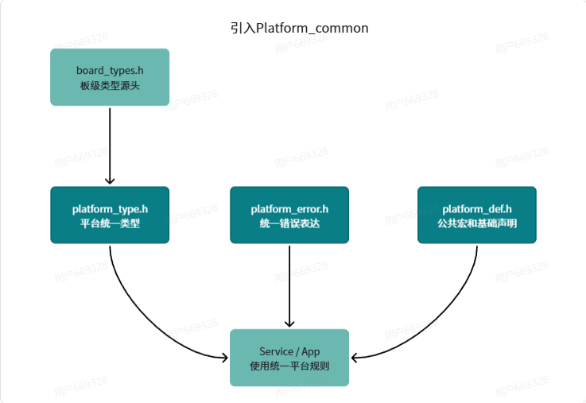
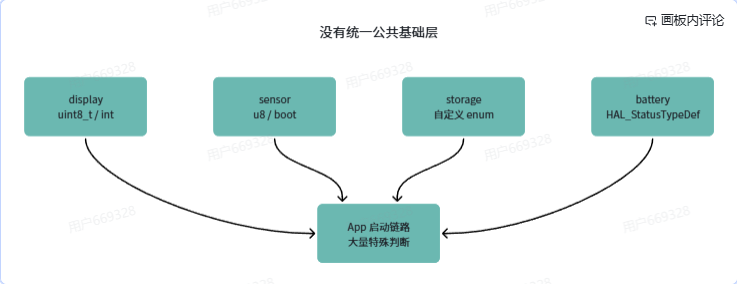
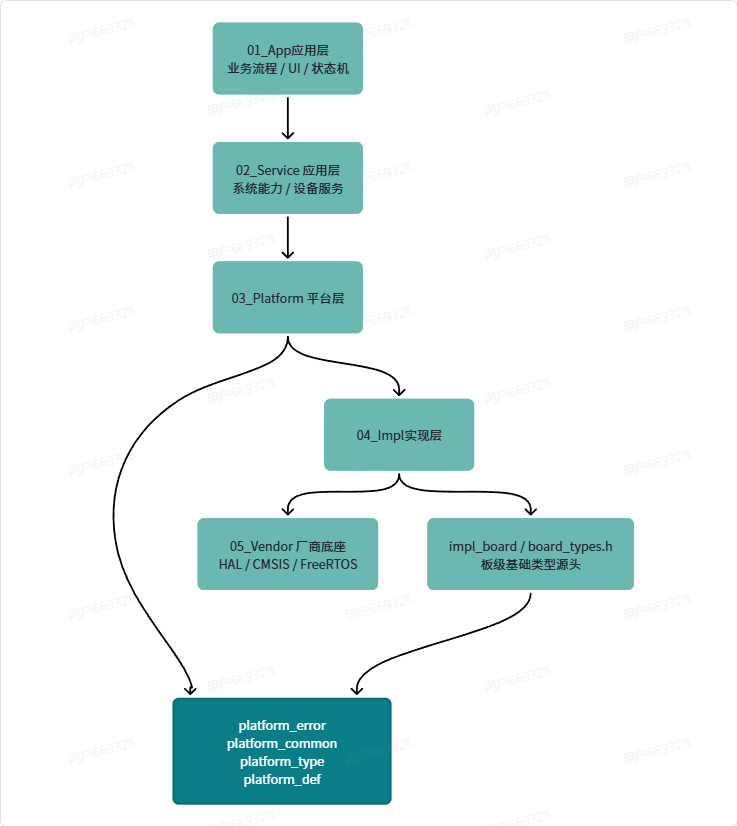

# 平台公共设计基础

学习目标：理解为什么嵌入式工程需要 `platform_common` 公共基础层，以及如何设计统一的基础类型、错误码、公共宏、编译器适配和模块接口规范。

这篇文档接在“系统分层”之后。系统分层解决的是“代码应该放在哪一层”，平台公共设计解决的是“所有层应该使用同一套工程语言”。

当项目很小的时候，每个模块各写各的也能跑。但是项目一旦变大，多个模块开始集成，就会出现很多风格不一致的问题。

```text
有的文件 include <stdint.h>
有的文件自己 typedef unsigned char uint8_t

有的模块返回 0/1
有的模块返回 HAL_OK/HAL_ERROR
有的模块返回自定义 enum

有的地方用 NULL
有的地方用 0

有的地方自己写 ARRAY_SIZE
有的地方用 sizeof(array) / sizeof(array[0])

有的地方用 bool
有的地方用 uint8_t
有的地方用 BOOL、TRUE、FALSE
```

表面上这些模块都可以单独工作，但系统集成时会很难维护：

1. 上层不知道应该使用哪一套基础类型。
2. 不同编译器、不同芯片平台的基础类型宽度可能存在差异。
3. `service` 和 `app` 很容易直接暴露 `HAL`、`SDK`、`RTOS` 类型。
4. 错误码风格不统一，启动链路无法统一处理失败。
5. 公共宏散落在各个模块，无法统一维护。
6. 不同模块的空指针、数组大小、对齐、位操作写法不一致。
7. 换芯片、换编译器、换 RTOS 时，上层业务会被底层差异牵连。

所以这一节要做一件很基础但非常关键的事情：

> 建立工程的 `platform_common` 公共基础层。

它不是为了把代码写复杂，而是为了让后续的 `platform_mcu`、`platform_bsp`、`platform_os`、`service`、`app` 都使用同一套工程语言。




---

## 1. platform_common 到底解决什么问题

`platform_common` 可以理解为工程的“公共词典”。

它统一定义这些内容：

| 内容 | 解决的问题 |
| --- | --- |
| 基础类型 | 所有模块都知道 `uint8_t`、`bool_t`、`float32_t` 是什么 |
| 错误码 | 所有初始化、读写、控制函数都能用统一返回值 |
| 公共宏 | 所有模块统一使用 `PLATFORM_NULL`、`PLATFORM_ARRAY_SIZE` 等 |
| 编译器适配 | 屏蔽 `__attribute__`、`__weak`、`packed` 等编译器差异 |
| 断言和检查 | 统一参数检查、空指针检查、错误返回 |
| 版本和开关 | 统一管理平台版本、功能裁剪开关 |

一句话：

> `platform_common` 不负责具体业务，也不负责具体硬件，它负责定义整个工程共同遵守的基础规则。

---

## 2. 推荐目录结构

建议把公共基础层放在 `03_platform/platform_common/` 下。

```text
03_platform/
├── platform_common/
│   ├── platform_common.h          # 平台公共总头文件
│   ├── platform_types.h           # 平台基础类型
│   ├── platform_error_code.h      # 平台统一错误码
│   ├── platform_macro.h           # 公共宏
│   ├── platform_compiler.h        # 编译器差异适配
│   ├── platform_assert.h          # 断言和参数检查
│   ├── platform_version.h         # 平台版本信息
│   └── platform_config.h          # 平台公共配置
│
├── platform_mcu/
├── platform_bsp/
├── platform_os/
└── platform_driver/

impl/
└── impl_board/
    ├── impl_board_types.h         # 当前板级/编译环境的类型源头
    ├── impl_board_config.h
    └── impl_board_port.c
```

为什么 `impl_board_types.h` 不直接放在 `platform_common` 里？

因为类型源头和具体编译器、芯片、板级环境有关。`platform_common` 要对上层提供稳定语言，但底层类型如何映射，可以由 `impl` 根据当前工程决定。

也就是说：

```text
impl_board_types.h 负责描述当前平台事实
platform_types.h   负责对上层输出统一类型
```

---

## 3. 统一原则

### 3.1 基础类型统一

所有平台层、服务层、应用层都应该使用统一类型：

```text
uint8_t
uint16_t
uint32_t
uint64_t
int8_t
int16_t
int32_t
int64_t
bool_t
float32_t
float64_t
char_t
```

要求：

- `service` 和 `app` 只面对平台类型出口。
- 不要在业务代码里直接 `typedef unsigned char uint8_t`。
- 不要在业务代码里暴露 `HAL_StatusTypeDef`、`BaseType_t`、`rt_err_t` 这类底层类型。

### 3.2 错误码统一

所有平台公共接口建议统一返回：

```c
Platform_ErrorCode_t
```

不要一会儿返回 `0/1`，一会儿返回 `HAL_OK/HAL_ERROR`，一会儿返回模块自定义枚举。

底层错误码可以在 `impl` 或 `adapter` 层转换成平台错误码：

```text
HAL_OK      -> PLATFORM_OK
HAL_TIMEOUT -> PLATFORM_ERR_TIMEOUT
HAL_BUSY    -> PLATFORM_ERR_BUSY
HAL_ERROR   -> PLATFORM_ERR_HW
```

### 3.3 公共宏统一

公共宏统一放在 `platform_macro.h`，例如：

```text
PLATFORM_NULL
PLATFORM_TRUE
PLATFORM_FALSE
PLATFORM_ARRAY_SIZE
PLATFORM_ALIGN_UP
PLATFORM_UNUSED
PLATFORM_BIT
PLATFORM_MIN
PLATFORM_MAX
```

不要在每个模块里重复写一套。

---

## 4. 建立公共词典

推荐先建立这些文件：

```text
impl/impl_board/impl_board_types.h
03_platform/platform_common/platform_types.h
03_platform/platform_common/platform_error_code.h
03_platform/platform_common/platform_macro.h
03_platform/platform_common/platform_compiler.h
03_platform/platform_common/platform_assert.h
03_platform/platform_common/platform_common.h
```

它们之间的依赖关系：

```text
impl_board_types.h
        ↓
platform_types.h
        ↓
platform_error_code.h
        ↓
platform_macro.h
        ↓
platform_assert.h
        ↓
platform_common.h
```

注意：实际工程中不一定要求严格单向包含，但初学阶段建议尽量清晰，避免头文件互相包含。

---

## 5. 类型源头：impl_board_types.h

设计讲解：先找类型源头。

工程的基础类型源头可以放在 `impl/impl_board/impl_board_types.h`，因为它描述的是当前板级、当前编译器、当前芯片环境下的基础事实。

它先定义：

| 类型 | 宽度 | 备注 |
| --- | --- | --- |
| `int8_t` | 8 bit | 有符号 8 位整数 |
| `uint8_t` | 8 bit | 无符号 8 位整数 |
| `int16_t` | 16 bit | 有符号 16 位整数 |
| `uint16_t` | 16 bit | 无符号 16 位整数 |
| `int32_t` | 32 bit | 有符号 32 位整数 |
| `uint32_t` | 32 bit | 无符号 32 位整数 |
| `int64_t` | 64 bit | 有符号 64 位整数 |
| `uint64_t` | 64 bit | 无符号 64 位整数 |
| `bool_t` | 8 bit | 布尔类型，通常定义为 `uint8_t` |
| `true/false` | 1/0 | 布尔值 |



### 5.1 推荐写法

位置：

```text
impl/impl_board/impl_board_types.h
```

```c
#ifndef IMPL_BOARD_TYPES_H
#define IMPL_BOARD_TYPES_H

/*
 * 当前板级/编译环境的基础类型源头。
 *
 * 如果编译器可靠支持 C99，优先使用 <stdint.h>。
 * 如果老编译器不支持 <stdint.h>，可以在这里替换为手写 typedef。
 */
#if defined(__STDC_VERSION__) && (__STDC_VERSION__ >= 199901L)
    #include <stdint.h>
#else
    typedef signed char        int8_t;
    typedef unsigned char      uint8_t;
    typedef signed short       int16_t;
    typedef unsigned short     uint16_t;
    typedef signed int         int32_t;
    typedef unsigned int       uint32_t;
    typedef signed long long   int64_t;
    typedef unsigned long long uint64_t;
#endif

typedef uint8_t bool_t;

#ifndef true
#define true  1u
#endif

#ifndef false
#define false 0u
#endif

#endif /* IMPL_BOARD_TYPES_H */
```

### 5.2 为什么可以不用 stdint.h

`<stdint.h>` 是 C99 标准引入的头文件。现代工程一般建议优先使用它，因为它更标准、可读性更好。

但是在一些老旧嵌入式编译器里，可能存在：

- 不支持 C99。
- 没有完整 `<stdint.h>`。
- 类型宽度定义不符合项目要求。
- SDK 自己已经定义了一套基础类型。

所以更稳妥的做法是：

```text
如果编译器可靠支持 stdint.h，就用 stdint.h。
如果不支持，就在 impl_board_types.h 中兜底定义。
```

这样上层不用关心具体差异。

后续谁会用它：

- `platform_types.h`
- `board_resource_config.h`
- `board_bsp_register.h`
- `impl_board.h`
- `impl_board_port.c`

---

## 6. 平台基础类型：platform_types.h

`platform_types.h` 是平台对上层公开的基础类型头文件。

位置：

```text
03_platform/platform_common/platform_types.h
```

### 6.1 推荐写法

```c
#ifndef PLATFORM_TYPES_H
#define PLATFORM_TYPES_H

#include "impl_board_types.h"

typedef int8_t    platform_int8_t;
typedef uint8_t   platform_uint8_t;
typedef int16_t   platform_int16_t;
typedef uint16_t  platform_uint16_t;
typedef int32_t   platform_int32_t;
typedef uint32_t  platform_uint32_t;
typedef int64_t   platform_int64_t;
typedef uint64_t  platform_uint64_t;

typedef float     platform_float32_t;
typedef double    platform_float64_t;

typedef char      platform_char_t;
typedef uint8_t   platform_uchar_t;
typedef bool_t    platform_bool_t;

/*
 * 为了降低学习门槛，也可以继续导出短类型。
 * 如果项目追求强命名隔离，可以只使用 platform_xxx_t。
 */
typedef int8_t    int8;
typedef uint8_t   uint8;
typedef int16_t   int16;
typedef uint16_t  uint16;
typedef int32_t   int32;
typedef uint32_t  uint32;
typedef int64_t   int64;
typedef uint64_t  uint64;

typedef float     float32_t;
typedef double    float64_t;
typedef char      char_t;

#ifndef PLATFORM_TRUE
#define PLATFORM_TRUE  1u
#endif

#ifndef PLATFORM_FALSE
#define PLATFORM_FALSE 0u
#endif

#endif /* PLATFORM_TYPES_H */
```

### 6.2 为什么这样设计

虽然 `impl_board_types.h` 已经定义了 `uint8_t` 等基础类型，但它更偏底层事实。`platform_types.h` 的作用是对平台层、服务层、应用层输出统一语言。

这样做有几个好处：

- 上层只 include `platform_types.h`，不直接关心底层编译器。
- 后续换芯片或换编译器时，优先改 `impl_board_types.h`。
- 项目可以选择使用 `platform_uint8_t` 这种更强平台语义的类型。
- 可以统一扩展 `float32_t`、`float64_t`、`char_t`、`bool_t`。

后续谁会用它：

- `platform_error_code.h`
- `platform_macro.h`
- `platform_mcu.h`
- `platform_bsp.h`
- `platform_os.h`
- `service` 层
- `app` 层

---

## 7. 平台统一错误码：platform_error_code.h

位置：

```text
03_platform/platform_common/platform_error_code.h
```

统一错误码的意义：

- 启动链路可以统一判断失败。
- App 不需要知道底层是 HAL、RTOS 还是自研模块。
- 不同模块错误风格一致。
- 日志和诊断可以统一打印错误原因。

### 7.1 推荐写法

```c
#ifndef PLATFORM_ERROR_CODE_H
#define PLATFORM_ERROR_CODE_H

#include "platform_types.h"

typedef enum
{
    PLATFORM_OK = 0,

    PLATFORM_ERR_UNKNOWN       = -1,
    PLATFORM_ERR_INVALID_PARAM = -2,
    PLATFORM_ERR_NULL_PTR      = -3,
    PLATFORM_ERR_TIMEOUT       = -4,
    PLATFORM_ERR_BUSY          = -5,
    PLATFORM_ERR_NOT_READY     = -6,
    PLATFORM_ERR_NOT_INIT      = -7,
    PLATFORM_ERR_ALREADY_INIT  = -8,
    PLATFORM_ERR_NO_MEMORY     = -9,
    PLATFORM_ERR_NO_RESOURCE   = -10,
    PLATFORM_ERR_NOT_SUPPORT   = -11,
    PLATFORM_ERR_HW            = -12,
    PLATFORM_ERR_CHECKSUM      = -13,
    PLATFORM_ERR_OVERFLOW      = -14,
    PLATFORM_ERR_UNDERFLOW     = -15,
} Platform_ErrorCode_t;

#define PLATFORM_IS_OK(err)      ((err) == PLATFORM_OK)
#define PLATFORM_IS_ERR(err)     ((err) != PLATFORM_OK)
#define PLATFORM_FAILED(err)     ((err) != PLATFORM_OK)
#define PLATFORM_SUCCEEDED(err)  ((err) == PLATFORM_OK)

#endif /* PLATFORM_ERROR_CODE_H */
```

### 7.2 错误码命名规则

建议：

- 成功固定为 `PLATFORM_OK = 0`。
- 失败使用负数，避免和成功值混淆。
- 错误名统一使用 `PLATFORM_ERR_xxx`。
- 错误码不要带具体模块名，例如不要写 `LED_ERROR` 到公共错误码里。

模块可以有自己的细分错误，但对外返回时建议转换成 `Platform_ErrorCode_t`。

例如：

```c
static Platform_ErrorCode_t platform_hal_to_error(HAL_StatusTypeDef status)
{
    switch (status)
    {
        case HAL_OK:
            return PLATFORM_OK;

        case HAL_BUSY:
            return PLATFORM_ERR_BUSY;

        case HAL_TIMEOUT:
            return PLATFORM_ERR_TIMEOUT;

        case HAL_ERROR:
        default:
            return PLATFORM_ERR_HW;
    }
}
```

后续谁会用它：

- `platform_board_init()`
- `platform_mcu_init()`
- `platform_bsp_init()`
- `platform_os_init()`
- `service` 层错误处理
- `app` 启动链路

---

## 8. 平台公共宏：platform_macro.h

位置：

```text
03_platform/platform_common/platform_macro.h
```

公共宏的目标是把高频基础写法统一起来。

### 8.1 推荐写法

```c
#ifndef PLATFORM_MACRO_H
#define PLATFORM_MACRO_H

#include "platform_types.h"

#ifndef PLATFORM_NULL
#define PLATFORM_NULL ((void *)0)
#endif

#ifndef NULL
#define NULL PLATFORM_NULL
#endif

#define PLATFORM_ARRAY_SIZE(array) \
    (sizeof(array) / sizeof((array)[0]))

#define PLATFORM_UNUSED(x) \
    ((void)(x))

#define PLATFORM_MIN(a, b) \
    (((a) < (b)) ? (a) : (b))

#define PLATFORM_MAX(a, b) \
    (((a) > (b)) ? (a) : (b))

#define PLATFORM_CLAMP(value, min_value, max_value) \
    (PLATFORM_MIN(PLATFORM_MAX((value), (min_value)), (max_value)))

#define PLATFORM_BIT(n) \
    (1UL << (n))

#define PLATFORM_SET_BIT(value, bit) \
    ((value) |= PLATFORM_BIT(bit))

#define PLATFORM_CLEAR_BIT(value, bit) \
    ((value) &= ~PLATFORM_BIT(bit))

#define PLATFORM_CHECK_BIT(value, bit) \
    (((value) & PLATFORM_BIT(bit)) != 0u)

#define PLATFORM_ALIGN_UP(value, align) \
    (((value) + ((align) - 1u)) & ~((align) - 1u))

#define PLATFORM_ALIGN_DOWN(value, align) \
    ((value) & ~((align) - 1u))

#define PLATFORM_CONTAINER_OF(ptr, type, member) \
    ((type *)((char *)(ptr) - (unsigned long)(&((type *)0)->member)))

#endif /* PLATFORM_MACRO_H */
```

### 8.2 注意事项

`PLATFORM_ARRAY_SIZE(array)` 只能用于真实数组，不能用于指针。

正确：

```c
uint8_t buffer[16];
uint32_t count = PLATFORM_ARRAY_SIZE(buffer);
```

错误：

```c
void func(uint8_t *buffer)
{
    uint32_t count = PLATFORM_ARRAY_SIZE(buffer); /* 错误：这里 buffer 是指针 */
}
```

`PLATFORM_ALIGN_UP(value, align)` 要求 `align` 通常是 2 的幂，例如 4、8、16、32。

---

## 9. 编译器适配：platform_compiler.h

不同编译器对 `weak`、`packed`、`aligned`、`inline` 的写法不完全一样。

例如：

- GCC 使用 `__attribute__((weak))`
- ARMCC 可能使用 `__weak`
- IAR 可能使用 `__weak`

如果每个模块都自己写，就会把编译器差异扩散到整个工程。

位置：

```text
03_platform/platform_common/platform_compiler.h
```

推荐写法：

```c
#ifndef PLATFORM_COMPILER_H
#define PLATFORM_COMPILER_H

#if defined(__GNUC__)
    #define PLATFORM_WEAK        __attribute__((weak))
    #define PLATFORM_PACKED      __attribute__((packed))
    #define PLATFORM_ALIGNED(n)  __attribute__((aligned(n)))
    #define PLATFORM_INLINE      static inline
#elif defined(__ICCARM__)
    #define PLATFORM_WEAK        __weak
    #define PLATFORM_PACKED      __packed
    #define PLATFORM_ALIGNED(n)  _Pragma("data_alignment=n")
    #define PLATFORM_INLINE      static inline
#elif defined(__CC_ARM) || defined(__ARMCC_VERSION)
    #define PLATFORM_WEAK        __weak
    #define PLATFORM_PACKED      __packed
    #define PLATFORM_ALIGNED(n)  __attribute__((aligned(n)))
    #define PLATFORM_INLINE      static __inline
#else
    #define PLATFORM_WEAK
    #define PLATFORM_PACKED
    #define PLATFORM_ALIGNED(n)
    #define PLATFORM_INLINE      static inline
#endif

#endif /* PLATFORM_COMPILER_H */
```

使用示例：

```c
typedef struct PLATFORM_PACKED
{
    uint8_t  cmd;
    uint16_t len;
    uint8_t  payload[8];
} protocol_frame_t;
```

---

## 10. 参数检查和断言：platform_assert.h

很多模块都会做参数检查：

```c
if (dev == NULL)
{
    return PLATFORM_ERR_NULL_PTR;
}
```

如果每个模块都自己写，风格会不统一。可以在 `platform_assert.h` 里提供统一检查宏。

位置：

```text
03_platform/platform_common/platform_assert.h
```

推荐写法：

```c
#ifndef PLATFORM_ASSERT_H
#define PLATFORM_ASSERT_H

#include "platform_error_code.h"
#include "platform_macro.h"

#define PLATFORM_RETURN_IF_NULL(ptr)                 \
    do                                               \
    {                                                \
        if ((ptr) == PLATFORM_NULL)                  \
        {                                            \
            return PLATFORM_ERR_NULL_PTR;            \
        }                                            \
    } while (0)

#define PLATFORM_RETURN_IF_FALSE(expr, err_code)     \
    do                                               \
    {                                                \
        if (!(expr))                                 \
        {                                            \
            return (err_code);                       \
        }                                            \
    } while (0)

#define PLATFORM_RETURN_IF_ERROR(expr)               \
    do                                               \
    {                                                \
        Platform_ErrorCode_t platform_ret = (expr);  \
        if (PLATFORM_IS_ERR(platform_ret))           \
        {                                            \
            return platform_ret;                     \
        }                                            \
    } while (0)

#endif /* PLATFORM_ASSERT_H */
```

使用示例：

```c
Platform_ErrorCode_t platform_i2c_read(platform_i2c_t *i2c, uint8_t *buf, uint16_t len)
{
    PLATFORM_RETURN_IF_NULL(i2c);
    PLATFORM_RETURN_IF_NULL(buf);
    PLATFORM_RETURN_IF_FALSE(len > 0u, PLATFORM_ERR_INVALID_PARAM);

    return i2c->ops->read(i2c, buf, len);
}
```

---

## 11. 平台公共总头文件：platform_common.h

上层模块不应该到处 include 很多公共头。可以提供一个总头文件：

位置：

```text
03_platform/platform_common/platform_common.h
```

推荐写法：

```c
#ifndef PLATFORM_COMMON_H
#define PLATFORM_COMMON_H

#include "platform_types.h"
#include "platform_error_code.h"
#include "platform_macro.h"
#include "platform_compiler.h"
#include "platform_assert.h"
#include "platform_version.h"
#include "platform_config.h"

#endif /* PLATFORM_COMMON_H */
```

使用建议：

- `platform` 内部模块可以 include 具体头文件。
- `service` 和 `app` 可以优先 include `platform_common.h`。
- 不要让 `service` 和 `app` 直接 include `impl_board_types.h`。

---

## 12. 平台版本和配置

### 12.1 platform_version.h

```c
#ifndef PLATFORM_VERSION_H
#define PLATFORM_VERSION_H

#define PLATFORM_VERSION_MAJOR  1u
#define PLATFORM_VERSION_MINOR  0u
#define PLATFORM_VERSION_PATCH  0u

#define PLATFORM_VERSION_CODE \
    ((PLATFORM_VERSION_MAJOR << 16) | \
     (PLATFORM_VERSION_MINOR << 8)  | \
     (PLATFORM_VERSION_PATCH))

#endif /* PLATFORM_VERSION_H */
```

### 12.2 platform_config.h

```c
#ifndef PLATFORM_CONFIG_H
#define PLATFORM_CONFIG_H

#define PLATFORM_USE_ASSERT        1u
#define PLATFORM_USE_LOG          1u
#define PLATFORM_USE_OS           1u
#define PLATFORM_USE_FLOAT        1u

#define PLATFORM_DEFAULT_TIMEOUT_MS 100u
#define PLATFORM_CACHE_LINE_SIZE    32u

#endif /* PLATFORM_CONFIG_H */
```

配置文件的原则：

- 公共配置放 `platform_config.h`。
- 板级配置放 `impl_board_config.h` 或 `board_cfg.h`。
- 业务功能开关放 `app_config.h` 或 `feature_config.h`。
- 不要把所有配置都塞进一个超大的头文件。

---

## 13. 延时接口应该放哪里

当前文档里提到：

```c
void platform_delay_ms(uint32_t ms);
void platform_delay_us(uint32_t us);
```

这个思路是对的，但要注意：延时不是“公共宏”本身，而是平台能力。更推荐拆成：

```text
platform_common/
    platform_types.h
    platform_error_code.h
    platform_macro.h

platform_os/
    platform_delay.h
    platform_delay.c

impl/
    impl_delay.c
```

`platform_delay.h`：

```c
#ifndef PLATFORM_DELAY_H
#define PLATFORM_DELAY_H

#include "platform_common.h"

void platform_delay_ms(uint32_t ms);
void platform_delay_us(uint32_t us);
uint32_t platform_get_tick_ms(void);

#endif /* PLATFORM_DELAY_H */
```

`platform_macro.h` 里可以只保留便捷宏：

```c
#define PLATFORM_DELAY_MS(ms) platform_delay_ms(ms)
#define PLATFORM_DELAY_US(us) platform_delay_us(us)
```

为什么这样拆？

- `platform_common` 负责公共语言。
- `platform_os` 或 `platform_time` 负责系统时间能力。
- `impl` 负责把延时适配到 HAL、FreeRTOS、SysTick 或定时器。

---

## 14. app/service/platform 的 include 边界

为了避免上层被底层绑定，建议遵守下面规则。

### 14.1 App 层

App 可以 include：

```c
#include "platform_common.h"
#include "led_service.h"
#include "key_service.h"
#include "sensor_service.h"
```

App 不建议 include：

```c
#include "stm32f1xx_hal.h"
#include "FreeRTOS.h"
#include "impl_board_types.h"
#include "board_pinmap.h"
```

### 14.2 Service 层

Service 可以 include：

```c
#include "platform_common.h"
#include "platform_delay.h"
#include "led_driver.h"
```

Service 不建议 include：

```c
#include "stm32f1xx_hal_gpio.h"
#include "board_gpio.h"
```

### 14.3 Platform/Impl 层

Platform 定义接口，Impl 实现接口。

Platform 可以定义：

```c
typedef struct
{
    Platform_ErrorCode_t (*init)(void *cfg);
    Platform_ErrorCode_t (*read)(uint8_t *buf, uint16_t len);
    Platform_ErrorCode_t (*write)(const uint8_t *buf, uint16_t len);
} platform_i2c_ops_t;
```

Impl 可以调用：

```c
HAL_I2C_Master_Transmit(...);
HAL_I2C_Master_Receive(...);
```

这样 HAL 被限制在 Impl 内部，不会扩散到 App 和 Service。

---

## 15. 一个 I2C 平台公共接口例子

### 15.1 platform_i2c.h

```c
#ifndef PLATFORM_I2C_H
#define PLATFORM_I2C_H

#include "platform_common.h"

typedef struct platform_i2c platform_i2c_t;

typedef struct
{
    Platform_ErrorCode_t (*init)(platform_i2c_t *self, void *cfg);
    Platform_ErrorCode_t (*write)(
        platform_i2c_t *self,
        uint8_t dev_addr,
        const uint8_t *data,
        uint16_t len,
        uint32_t timeout_ms);
    Platform_ErrorCode_t (*read)(
        platform_i2c_t *self,
        uint8_t dev_addr,
        uint8_t *data,
        uint16_t len,
        uint32_t timeout_ms);
} platform_i2c_ops_t;

struct platform_i2c
{
    const platform_i2c_ops_t *ops;
    void *user_data;
    uint8_t is_inited;
};

Platform_ErrorCode_t platform_i2c_init(platform_i2c_t *self, void *cfg);
Platform_ErrorCode_t platform_i2c_write(
    platform_i2c_t *self,
    uint8_t dev_addr,
    const uint8_t *data,
    uint16_t len,
    uint32_t timeout_ms);
Platform_ErrorCode_t platform_i2c_read(
    platform_i2c_t *self,
    uint8_t dev_addr,
    uint8_t *data,
    uint16_t len,
    uint32_t timeout_ms);

#endif /* PLATFORM_I2C_H */
```

### 15.2 platform_i2c.c

```c
#include "platform_i2c.h"

Platform_ErrorCode_t platform_i2c_init(platform_i2c_t *self, void *cfg)
{
    PLATFORM_RETURN_IF_NULL(self);
    PLATFORM_RETURN_IF_NULL(self->ops);
    PLATFORM_RETURN_IF_NULL(self->ops->init);

    PLATFORM_RETURN_IF_ERROR(self->ops->init(self, cfg));

    self->is_inited = PLATFORM_TRUE;
    return PLATFORM_OK;
}

Platform_ErrorCode_t platform_i2c_write(
    platform_i2c_t *self,
    uint8_t dev_addr,
    const uint8_t *data,
    uint16_t len,
    uint32_t timeout_ms)
{
    PLATFORM_RETURN_IF_NULL(self);
    PLATFORM_RETURN_IF_NULL(data);
    PLATFORM_RETURN_IF_FALSE(self->is_inited == PLATFORM_TRUE, PLATFORM_ERR_NOT_INIT);
    PLATFORM_RETURN_IF_NULL(self->ops);
    PLATFORM_RETURN_IF_NULL(self->ops->write);

    return self->ops->write(self, dev_addr, data, len, timeout_ms);
}
```

### 15.3 impl_i2c_stm32.c

```c
#include "platform_i2c.h"
#include "stm32f1xx_hal.h"

static Platform_ErrorCode_t impl_i2c_write(
    platform_i2c_t *self,
    uint8_t dev_addr,
    const uint8_t *data,
    uint16_t len,
    uint32_t timeout_ms)
{
    I2C_HandleTypeDef *hi2c = (I2C_HandleTypeDef *)self->user_data;
    HAL_StatusTypeDef ret;

    ret = HAL_I2C_Master_Transmit(hi2c, dev_addr, (uint8_t *)data, len, timeout_ms);

    if (ret == HAL_OK)
    {
        return PLATFORM_OK;
    }
    else if (ret == HAL_TIMEOUT)
    {
        return PLATFORM_ERR_TIMEOUT;
    }
    else if (ret == HAL_BUSY)
    {
        return PLATFORM_ERR_BUSY;
    }
    else
    {
        return PLATFORM_ERR_HW;
    }
}
```

这就是平台公共设计的价值：

```text
App/Service 只看到 platform_i2c_write()
Platform 定义统一对象和统一错误码
Impl 才知道 HAL_I2C_Master_Transmit()
```

---

## 16. 常见错误和改法

### 错误 1：每个模块自己定义基础类型

错误：

```c
typedef unsigned char u8;
typedef unsigned char uint8;
typedef unsigned char BYTE;
```

改法：

```c
#include "platform_types.h"

uint8_t data;
platform_uint8_t value;
```

### 错误 2：错误码混乱

错误：

```c
int led_init(void);              /* 0 成功，1 失败 */
HAL_StatusTypeDef flash_init(void);
key_status_t key_init(void);
```

改法：

```c
Platform_ErrorCode_t led_init(void);
Platform_ErrorCode_t flash_init(void);
Platform_ErrorCode_t key_init(void);
```

### 错误 3：Service 暴露 HAL 类型

错误：

```c
HAL_StatusTypeDef sensor_service_read(sensor_data_t *data);
```

改法：

```c
Platform_ErrorCode_t sensor_service_read(sensor_data_t *data);
```

### 错误 4：公共宏散落

错误：

```c
#define ARRAY_SIZE(a) (sizeof(a) / sizeof(a[0]))
#define arr_size(a)   (sizeof(a) / sizeof(a[0]))
#define SIZEOF_ARRAY(a) ...
```

改法：

```c
#include "platform_macro.h"

uint32_t count = PLATFORM_ARRAY_SIZE(table);
```

### 错误 5：App 直接 include 底层头文件

错误：

```c
#include "stm32f1xx_hal.h"
#include "FreeRTOS.h"
```

改法：

```c
#include "platform_common.h"
#include "platform_delay.h"
#include "led_service.h"
```

---

## 17. 最小落地版本

如果项目还很小，不需要一次把所有文件都建全。最小可以先建这 4 个：

```text
impl/impl_board/impl_board_types.h
03_platform/platform_common/platform_types.h
03_platform/platform_common/platform_error_code.h
03_platform/platform_common/platform_macro.h
```

然后提供一个总头：

```text
03_platform/platform_common/platform_common.h
```

最小使用方式：

```c
#include "platform_common.h"

Platform_ErrorCode_t led_service_init(void)
{
    uint8_t index = 0u;
    PLATFORM_UNUSED(index);

    return PLATFORM_OK;
}
```

等工程变大之后，再补充：

- `platform_compiler.h`
- `platform_assert.h`
- `platform_version.h`
- `platform_config.h`
- `platform_delay.h`
- `platform_log.h`

---

## 18. 检查清单

写完 `platform_common` 后，用下面的问题检查：

1. 工程是否只有一个基础类型源头？
2. `service` 和 `app` 是否只 include 平台公共头，而不是直接 include HAL？
3. 所有平台接口是否统一返回 `Platform_ErrorCode_t`？
4. `PLATFORM_OK` 是否固定为 0？
5. 错误码是否统一使用 `PLATFORM_ERR_xxx`？
6. `NULL`、数组大小、对齐、位操作是否统一使用公共宏？
7. 编译器相关关键字是否集中在 `platform_compiler.h`？
8. 参数检查是否统一使用公共检查宏？
9. 延时、tick、OS 能力是否从 `platform_common` 中拆出去？
10. 换芯片或换编译器时，是否主要修改 `impl`，而不是修改 `app/service`？

如果这些问题大多数答案是“是”，说明平台公共基础设计比较健康。

---

## 19. 最终记忆口诀

```text
类型统一，模块才有共同语言。
错误统一，启动链路才能统一失败处理。
宏统一，基础写法才不会散落。
编译器统一，平台差异才不会污染业务。
Platform 定规则，Impl 做适配，Service/App 只用稳定接口。
```

平台公共设计不是“多写几个头文件”，而是给整个工程建立一套可长期维护的基础秩序。
