# 对象模型设计

学习目标：理解平台化架构里为什么需要统一对象模型，以及如何用 C 语言设计 `platform_object_t`、`platform_device_t`、`platform_service_t`，最终让设备、服务、应用都能被统一管理、统一启动、统一调试、统一插桩。

这篇文档接在“平台公共设计基础”之后。

上一节解决的是：

```text
整个工程用同一套类型、错误码、公共宏和编译器适配规则。
```

这一节解决的是：

```text
整个工程里的设备、服务、应用，能不能用同一套对象规则管理。
```

当项目很小的时候，每个模块各写各的函数也能跑：

```c
led_init();
key_start();
aht21_sensor_open();
uart_service_begin();
data_service_run();
```

但是项目一旦进入平台化阶段，就会遇到很实际的问题：

1. 上层想统一启动所有模块，却发现每个模块入口名字不一样。
2. 调试时想知道某个模块是否已经启动，却没有统一状态字段。
3. 低功耗时想统一停止设备，却不知道哪些设备支持休眠。
4. 日志系统想统一记录生命周期事件，却没有统一切入点。
5. 设备和服务想放到一张表里管理，却没有共同的基础字段。
6. 后续想接入诊断、AI 插桩、状态监控，每个模块都要单独改。

所以对象模型不是为了把 C 写成 C++，也不是为了炫技。它解决的是平台化工程里非常基础的问题：

> 让平台里的设备、服务、应用先拥有同一套“身份、类型、状态、生命周期入口”，然后再在这个基础上扩展各自的能力。

最终我们要得到三类基础对象：

```text
platform_object_t   对象的公共身份底座
platform_device_t   设备对象的通用基类
platform_service_t  服务对象的通用基类
```

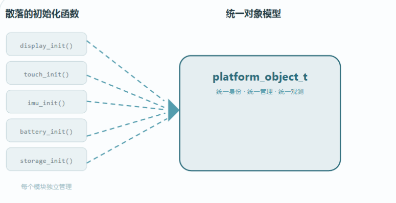

---

## 1. 对象模型到底解决什么问题

可以先把一个平台工程想象成一个小系统：

```text
设备：LED、按键、AHT21、DHT11、Flash、蜂鸣器、屏幕、蓝牙模块
服务：数据采集服务、通信服务、日志服务、升级服务、低功耗服务
应用：手表应用、采集应用、控制应用、测试应用
管理器：设备管理器、服务管理器、对象管理器
```

这些东西职责不同，但它们都有一些共同问题：

| 共同问题 | 需要的公共字段 |
| --- | --- |
| 它叫什么名字 | `name` |
| 它属于哪一类 | `type` |
| 它现在处于什么生命周期 | `state` |
| 它是否合法 | `magic` |
| 它归谁管理 | `parent` |
| 它是否具备某些通用特性 | `flags` |

如果没有统一对象模型，上层只能写很多特殊逻辑：

```c
led_init();
aht21_open();
uart_service_start();
log_service_enable();
```

如果有统一对象模型，上层可以把它们放进表里：

```c
for (i = 0; i < device_count; i++)
{
    platform_device_start(device_table[i]);
}

for (i = 0; i < service_count; i++)
{
    platform_service_start(service_table[i]);
}
```

这就是平台化的核心收益：

> 下层可以保持各自实现，上层可以使用统一规则。

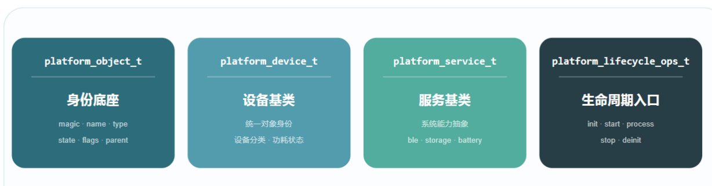

---

## 2. 前置知识：继承、组合和多态

### 2.1 什么是继承

继承可以简单理解为：

> 子对象拥有父对象的公共字段和公共能力，同时还能扩展自己的字段和能力。

例如所有设备都应该有名字、类型、状态，但 AHT21 还需要 I2C 地址，LED 还需要 GPIO 引脚，Flash 还需要扇区大小。

```text
platform_object_t
    ↓
platform_device_t
    ↓
aht21_device_t
```

`aht21_device_t` 是一个具体设备，它既有对象的公共身份，也有设备的通用属性，还可以有自己的传感器属性。

### 2.2 C 语言如何模拟继承

C 语言没有 `class`，但可以用结构体组合来模拟继承。

关键规则：

> 把“基类结构体”放在“子类结构体”的第一个字段。

例如：

```c
typedef struct
{
    platform_object_t object;
    uint32_t caps;
    platform_lifecycle_ops_t lifecycle_ops;
} platform_device_t;
```

因为 `object` 是第一个字段，所以 `platform_device_t *` 的起始地址和 `platform_object_t *` 的起始地址相同。

```text
platform_device_t 地址
    ↓
+-------------------------+
| platform_object_t object|  <-- 第一个字段
+-------------------------+
| caps                    |
+-------------------------+
| power_status            |
+-------------------------+
| lifecycle_ops           |
+-------------------------+
```

这意味着你可以把设备当作普通对象看待：

```c
platform_device_t *dev = &aht21_device;
platform_object_t *obj = &dev->object;
```

也可以在必要时通过 `container_of` 从公共对象找回具体设备：

```c
platform_device_t *dev =
    PLATFORM_CONTAINER_OF(obj, platform_device_t, object);
```

### 2.3 什么是多态

多态可以理解为：

> 上层调用同一个接口，底层执行不同对象自己的实现。

例如 `start` 对 LED 来说可能是配置 GPIO，对 AHT21 来说可能是初始化 I2C 并读取 ID，对日志服务来说可能是创建队列和任务。

上层不需要知道这些细节，只需要调用：

```c
obj->ops->start(obj);
```

在 C 语言里，多态通常通过函数指针实现。

---

## 3. 对象模型的分层关系

推荐先建立下面几层：

```text
platform_object_t
    ├── platform_device_t
    │       ├── led_device_t
    │       ├── key_device_t
    │       ├── aht21_device_t
    │       └── flash_device_t
    │
    ├── platform_service_t
    │       ├── log_service_t
    │       ├── data_service_t
    │       ├── comm_service_t
    │       └── power_service_t
    │
    └── platform_app_t
            ├── watch_app_t
            └── test_app_t
```

对象模型的核心不是把所有东西都塞进一个大结构体，而是分清楚：

| 层级 | 负责什么 | 不负责什么 |
| --- | --- | --- |
| `platform_object_t` | 公共身份、类型、生命周期状态、父子关系 | 不关心设备能力和业务逻辑 |
| `platform_device_t` | 设备通用管理、能力、功耗状态、生命周期函数 | 不直接写具体传感器算法 |
| `platform_service_t` | 服务通用管理、依赖关系、生命周期函数 | 不直接操作硬件寄存器 |
| 具体对象 | 实现自己的初始化、启动、停止、读写、业务逻辑 | 不重复造公共身份字段 |

---

## 4. platform_object_t：公共身份底座

`platform_object_t` 是所有对象的共同基础。

它应该足够稳定、足够小，不要因为某个具体设备需要一个字段，就随便加到公共对象里。

### 4.1 推荐定义

```c
typedef enum
{
    PLATFORM_OBJECT_TYPE_MANAGER = 0,
    PLATFORM_OBJECT_TYPE_DEVICE,
    PLATFORM_OBJECT_TYPE_SERVICE,
    PLATFORM_OBJECT_TYPE_APP,
} platform_object_type_t;

typedef enum
{
    PLATFORM_OBJECT_STATE_CREATED = 0,
    PLATFORM_OBJECT_STATE_INITIALIZED,
    PLATFORM_OBJECT_STATE_STARTED,
    PLATFORM_OBJECT_STATE_STOPPED,
    PLATFORM_OBJECT_STATE_DESTROYED,
    PLATFORM_OBJECT_STATE_ERROR,
} platform_object_state_t;

typedef struct platform_object
{
    uint32_t magic;
    const char *name;
    platform_object_type_t type;
    platform_object_state_t state;
    uint32_t flags;
    struct platform_object *parent;
    void *user_data;
} platform_object_t;
```

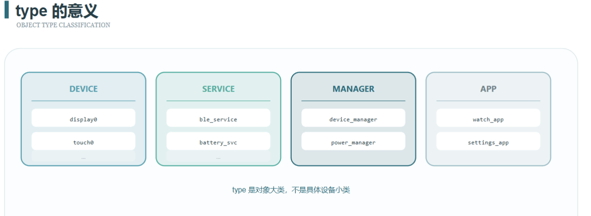

### 4.2 字段说明

| 字段 | 作用 | 初学者理解 |
| --- | --- | --- |
| `magic` | 验证对象是否合法 | 防止野指针、错误强转、内存被破坏 |
| `name` | 对象名称 | 日志和调试时知道是谁 |
| `type` | 对象类型 | 区分 manager、device、service、app |
| `state` | 生命周期状态 | 知道对象是否创建、初始化、启动、停止 |
| `flags` | 公共标志位 | 标记是否自动启动、是否可诊断等 |
| `parent` | 父对象 | 建立层级关系，如设备属于设备管理器 |
| `user_data` | 用户数据 | 给适配层或调试扩展预留入口 |

### 4.3 magic 的意义

`magic` 是一个固定值，例如：

```c
#define PLATFORM_OBJECT_MAGIC 0x504F424Au /* 'POBJ' */
```

对象初始化时写入：

```c
obj->magic = PLATFORM_OBJECT_MAGIC;
```

后续使用对象前检查：

```c
if (obj->magic != PLATFORM_OBJECT_MAGIC)
{
    return PLATFORM_ERR_INVALID_PARAM;
}
```

这在嵌入式里很有用，因为错误指针、越界写、生命周期错乱都很常见。`magic` 不能解决所有问题，但它能尽早暴露错误。

### 4.4 state 的意义

`state` 表示对象处于哪个生命周期阶段。

```text
CREATED
    ↓ init()
INITIALIZED
    ↓ start()
STARTED
    ↓ stop()
STOPPED
    ↓ deinit()
DESTROYED
```

推荐状态流转：

| 状态 | 含义 | 可以做什么 |
| --- | --- | --- |
| `CREATED` | 对象已经创建，但还没初始化 | 可以调用 `init` |
| `INITIALIZED` | 资源已准备好，但还没运行 | 可以调用 `start` |
| `STARTED` | 正在运行 | 可以读写、调度、监控 |
| `STOPPED` | 已停止运行，但资源未释放 | 可以再次 `start` 或 `deinit` |
| `DESTROYED` | 已销毁 | 不应该继续访问 |
| `ERROR` | 对象进入错误状态 | 需要诊断或恢复 |

state 的价值不是“多一个变量”，而是让系统有统一判断依据。

例如低功耗管理器可以这样判断：

```c
if (dev->object.state == PLATFORM_OBJECT_STATE_STARTED)
{
    platform_device_stop(dev);
}
```

这样可以避免 OS 或上层任务在对象还没准备好时就调用它。

### 4.5 platform_object_init

```c
Platform_ErrorCode_t platform_object_init(
    platform_object_t *obj,
    const char *name,
    platform_object_type_t type,
    platform_object_t *parent)
{
    PLATFORM_RETURN_IF_NULL(obj);
    PLATFORM_RETURN_IF_NULL(name);

    obj->magic = PLATFORM_OBJECT_MAGIC;
    obj->name = name;
    obj->type = type;
    obj->state = PLATFORM_OBJECT_STATE_CREATED;
    obj->flags = 0u;
    obj->parent = parent;
    obj->user_data = PLATFORM_NULL;

    return PLATFORM_OK;
}
```

这段代码做的事情很简单：

1. 检查参数。
2. 写入对象合法标识。
3. 写入对象名称和类型。
4. 把生命周期状态设置为 `CREATED`。
5. 清空扩展字段。

### 4.6 platform_object_is_valid

```c
bool_t platform_object_is_valid(const platform_object_t *obj)
{
    if (obj == PLATFORM_NULL)
    {
        return PLATFORM_FALSE;
    }

    if (obj->magic != PLATFORM_OBJECT_MAGIC)
    {
        return PLATFORM_FALSE;
    }

    if (obj->type > PLATFORM_OBJECT_TYPE_APP)
    {
        return PLATFORM_FALSE;
    }

    return PLATFORM_TRUE;
}
```

这个函数建议所有上层公共接口都调用。

例如：

```c
Platform_ErrorCode_t platform_object_dump(const platform_object_t *obj)
{
    if (platform_object_is_valid(obj) != PLATFORM_TRUE)
    {
        return PLATFORM_ERR_INVALID_PARAM;
    }

    platform_log_info("name=%s, type=%d, state=%d",
                      obj->name,
                      obj->type,
                      obj->state);

    return PLATFORM_OK;
}
```

---

## 5. 生命周期接口：platform_lifecycle_ops_t

对象有公共状态，但不同对象的初始化和启动逻辑不一样。

所以需要一个统一的生命周期函数表：

```c
typedef struct
{
    Platform_ErrorCode_t (*init)(void *ctx);
    Platform_ErrorCode_t (*start)(void *ctx);
    Platform_ErrorCode_t (*stop)(void *ctx);
    Platform_ErrorCode_t (*deinit)(void *ctx);
} platform_lifecycle_ops_t;
```

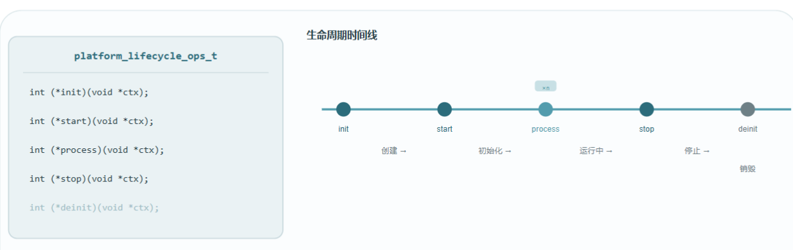

### 5.1 为什么使用 void *ctx

`ctx` 是上下文指针，可以传入具体对象：

```c
static Platform_ErrorCode_t aht21_init(void *ctx)
{
    aht21_device_t *aht21 = (aht21_device_t *)ctx;

    return platform_i2c_init(aht21->i2c, &aht21->i2c_cfg);
}
```

这样 `platform_lifecycle_ops_t` 就不需要知道具体对象类型。LED、AHT21、Flash、LogService 都可以挂自己的函数。

### 5.2 lifecycle 和 status 的区别

这两个概念很容易混。

| 概念 | 关注点 | 示例 |
| --- | --- | --- |
| `lifecycle/state` | 对象有没有创建、初始化、启动、停止 | `CREATED`、`INITIALIZED`、`STARTED` |
| `status` | 对象运行是否健康 | 在线、离线、错误、忙、低电量 |

举例：

```text
AHT21 的 lifecycle 是 STARTED，说明它已经启动。
AHT21 的 status 是 ERROR，说明它启动了，但当前读数失败或设备离线。
```

推荐原则：

> 先把生命周期管理清楚，再扩展运行状态管理。

如果生命周期都乱了，状态表只会变成一堆不可信的标志位。

---

## 6. platform_device_t：设备基类

设备对象代表平台里可被管理的硬件资源或硬件抽象，例如 LED、按键、传感器、Flash、屏幕、蓝牙模块。

设备基类要解决的问题是：

1. 设备有统一身份。
2. 设备能被统一初始化、启动、停止。
3. 设备可以描述能力，比如是否支持低功耗。
4. 设备可以描述电源状态。
5. 设备可以被设备管理器放进表里。

### 6.1 推荐定义

```c
typedef enum
{
    PLATFORM_DEVICE_POWER_OFF = 0,
    PLATFORM_DEVICE_POWER_ON,
    PLATFORM_DEVICE_POWER_SLEEP,
    PLATFORM_DEVICE_POWER_SUSPEND,
} platform_device_power_state_t;

typedef enum
{
    PLATFORM_DEVICE_STATUS_OFFLINE = 0,
    PLATFORM_DEVICE_STATUS_ONLINE,
    PLATFORM_DEVICE_STATUS_BUSY,
    PLATFORM_DEVICE_STATUS_ERROR,
} platform_device_status_t;

#define PLATFORM_DEVICE_CAP_LOW_POWER    PLATFORM_BIT(0)
#define PLATFORM_DEVICE_CAP_WAKEUP       PLATFORM_BIT(1)
#define PLATFORM_DEVICE_CAP_INTERRUPT    PLATFORM_BIT(2)
#define PLATFORM_DEVICE_CAP_DMA          PLATFORM_BIT(3)
#define PLATFORM_DEVICE_CAP_ASYNC        PLATFORM_BIT(4)

typedef struct
{
    platform_object_t object;
    const char *class_name;
    uint32_t caps;
    platform_device_power_state_t power_state;
    platform_device_status_t status;
    platform_lifecycle_ops_t lifecycle_ops;
} platform_device_t;
```

### 6.2 字段说明

| 字段 | 作用 |
| --- | --- |
| `object` | 继承公共对象身份，必须放第一个字段 |
| `class_name` | 设备类别，例如 `sensor`、`display`、`storage` |
| `caps` | 能力标志，例如低功耗、唤醒、中断、DMA |
| `power_state` | 电源状态，例如关机、开机、睡眠 |
| `status` | 运行状态，例如在线、忙、错误 |
| `lifecycle_ops` | 设备自己的生命周期函数 |

### 6.3 caps 的意义

`caps` 是能力标志，不是当前状态。

例如：

```c
dev->caps = PLATFORM_DEVICE_CAP_LOW_POWER |
            PLATFORM_DEVICE_CAP_INTERRUPT;
```

表示这个设备具备低功耗能力和中断能力。

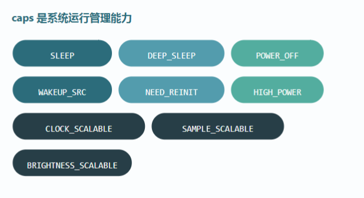

以一个智能手表为例，不同设备的能力可能不同：

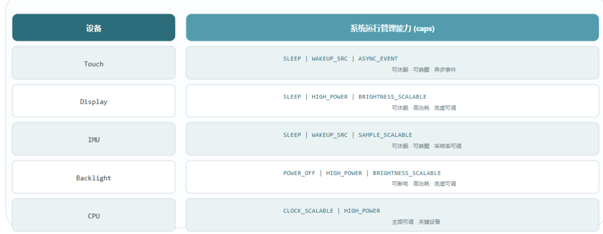

| 设备 | 可能具备的能力 |
| --- | --- |
| 按键 | 中断、唤醒 |
| 加速度传感器 | 中断、低功耗、唤醒 |
| 屏幕 | 低功耗、背光控制 |
| Flash | DMA、异步写入 |
| 蓝牙模块 | 低功耗、异步事件 |

这样低功耗管理器就可以只处理支持低功耗的设备：

```c
if ((dev->caps & PLATFORM_DEVICE_CAP_LOW_POWER) != 0u)
{
    platform_device_sleep(dev);
}
```

### 6.4 power_state 的意义

`power_state` 描述设备当前电源状态。

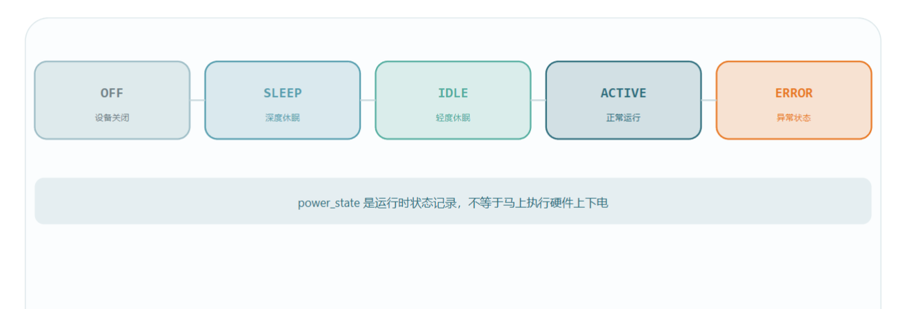

常见状态：

| 状态 | 含义 |
| --- | --- |
| `POWER_OFF` | 设备未供电或逻辑关闭 |
| `POWER_ON` | 设备已上电且可工作 |
| `POWER_SLEEP` | 设备进入轻睡眠 |
| `POWER_SUSPEND` | 设备挂起，等待恢复 |

注意：

```text
caps 表示“有没有这个能力”。
power_state 表示“现在处于什么电源状态”。
lifecycle_ops 表示“如何执行状态切换”。
```

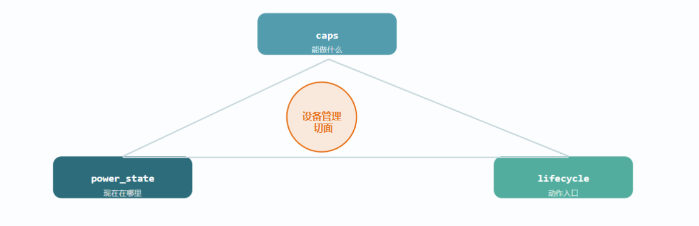

### 6.5 设备初始化接口

```c
Platform_ErrorCode_t platform_device_init(platform_device_t *dev)
{
    PLATFORM_RETURN_IF_NULL(dev);
    PLATFORM_RETURN_IF_FALSE(
        platform_object_is_valid(&dev->object) == PLATFORM_TRUE,
        PLATFORM_ERR_INVALID_PARAM);

    if (dev->object.state != PLATFORM_OBJECT_STATE_CREATED)
    {
        return PLATFORM_ERR_ALREADY_INIT;
    }

    if (dev->lifecycle_ops.init != PLATFORM_NULL)
    {
        PLATFORM_RETURN_IF_ERROR(dev->lifecycle_ops.init(dev));
    }

    dev->object.state = PLATFORM_OBJECT_STATE_INITIALIZED;
    dev->status = PLATFORM_DEVICE_STATUS_OFFLINE;

    return PLATFORM_OK;
}
```

### 6.6 设备启动接口

```c
Platform_ErrorCode_t platform_device_start(platform_device_t *dev)
{
    PLATFORM_RETURN_IF_NULL(dev);
    PLATFORM_RETURN_IF_FALSE(
        platform_object_is_valid(&dev->object) == PLATFORM_TRUE,
        PLATFORM_ERR_INVALID_PARAM);

    if (dev->object.state != PLATFORM_OBJECT_STATE_INITIALIZED &&
        dev->object.state != PLATFORM_OBJECT_STATE_STOPPED)
    {
        return PLATFORM_ERR_NOT_READY;
    }

    if (dev->lifecycle_ops.start != PLATFORM_NULL)
    {
        PLATFORM_RETURN_IF_ERROR(dev->lifecycle_ops.start(dev));
    }

    dev->object.state = PLATFORM_OBJECT_STATE_STARTED;
    dev->power_state = PLATFORM_DEVICE_POWER_ON;
    dev->status = PLATFORM_DEVICE_STATUS_ONLINE;

    return PLATFORM_OK;
}
```

### 6.7 设备休眠接口

```c
Platform_ErrorCode_t platform_device_sleep(platform_device_t *dev)
{
    PLATFORM_RETURN_IF_NULL(dev);

    if ((dev->caps & PLATFORM_DEVICE_CAP_LOW_POWER) == 0u)
    {
        return PLATFORM_ERR_NOT_SUPPORT;
    }

    if (dev->object.state != PLATFORM_OBJECT_STATE_STARTED)
    {
        return PLATFORM_ERR_NOT_READY;
    }

    if (dev->lifecycle_ops.stop != PLATFORM_NULL)
    {
        PLATFORM_RETURN_IF_ERROR(dev->lifecycle_ops.stop(dev));
    }

    dev->power_state = PLATFORM_DEVICE_POWER_SLEEP;
    dev->object.state = PLATFORM_OBJECT_STATE_STOPPED;

    return PLATFORM_OK;
}
```

这个接口的价值在于：上层不需要知道 AHT21、DHT11、屏幕、蓝牙分别怎么进入低功耗，只要统一调用 `platform_device_sleep()`。

---

## 7. 一个 AHT21 设备对象例子

假设有一个 AHT21 温湿度传感器，它通过 I2C 通信。

### 7.1 具体对象定义

```c
typedef struct
{
    platform_device_t base;
    platform_i2c_t *i2c;
    uint8_t i2c_addr;
    float32_t temperature;
    float32_t humidity;
} aht21_device_t;
```

注意 `platform_device_t base` 放在第一个字段。

这样 AHT21 同时拥有：

```text
platform_object_t 的公共身份
platform_device_t 的设备管理能力
aht21_device_t 的传感器私有数据
```

### 7.2 AHT21 生命周期函数

```c
static Platform_ErrorCode_t aht21_init(void *ctx)
{
    aht21_device_t *self = (aht21_device_t *)ctx;

    PLATFORM_RETURN_IF_NULL(self);
    PLATFORM_RETURN_IF_NULL(self->i2c);

    return platform_i2c_init(self->i2c, PLATFORM_NULL);
}

static Platform_ErrorCode_t aht21_start(void *ctx)
{
    aht21_device_t *self = (aht21_device_t *)ctx;

    PLATFORM_RETURN_IF_NULL(self);

    return aht21_soft_reset(self);
}

static Platform_ErrorCode_t aht21_stop(void *ctx)
{
    aht21_device_t *self = (aht21_device_t *)ctx;

    PLATFORM_RETURN_IF_NULL(self);

    return aht21_enter_sleep(self);
}
```

### 7.3 对象实例

```c
static aht21_device_t g_aht21 = {
    .base = {
        .object = {
            .magic = PLATFORM_OBJECT_MAGIC,
            .name = "aht21",
            .type = PLATFORM_OBJECT_TYPE_DEVICE,
            .state = PLATFORM_OBJECT_STATE_CREATED,
        },
        .class_name = "sensor",
        .caps = PLATFORM_DEVICE_CAP_LOW_POWER,
        .power_state = PLATFORM_DEVICE_POWER_OFF,
        .status = PLATFORM_DEVICE_STATUS_OFFLINE,
        .lifecycle_ops = {
            .init = aht21_init,
            .start = aht21_start,
            .stop = aht21_stop,
            .deinit = PLATFORM_NULL,
        },
    },
    .i2c = &g_i2c1,
    .i2c_addr = 0x38,
};
```

如果 DHT11 后续也接入平台，只需要实现自己的 `init/start/stop`，上层仍然只面对 `platform_device_t`。

---

## 8. platform_service_t：服务基类

服务和设备的区别：

```text
设备偏硬件资源抽象。
服务偏系统能力和业务能力。
```

例如：

| 类型 | 示例 |
| --- | --- |
| 设备 | LED、按键、AHT21、Flash、屏幕、蓝牙芯片 |
| 服务 | 日志服务、数据采集服务、通信服务、OTA 服务、告警服务 |

服务一般不直接操作硬件，而是组合设备和平台接口，对上提供更稳定的能力。

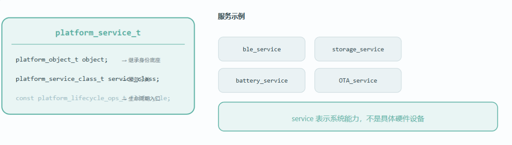

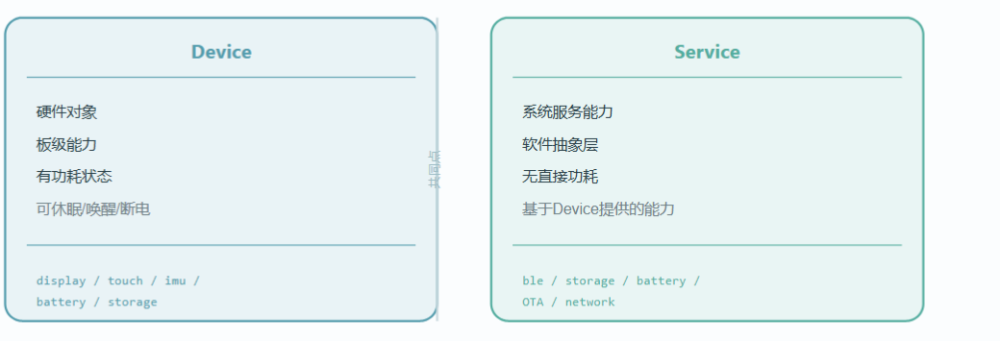

### 8.1 推荐定义

```c
typedef enum
{
    PLATFORM_SERVICE_STATUS_IDLE = 0,
    PLATFORM_SERVICE_STATUS_RUNNING,
    PLATFORM_SERVICE_STATUS_BUSY,
    PLATFORM_SERVICE_STATUS_ERROR,
} platform_service_status_t;

#define PLATFORM_SERVICE_CAP_AUTO_START  PLATFORM_BIT(0)
#define PLATFORM_SERVICE_CAP_BACKGROUND  PLATFORM_BIT(1)
#define PLATFORM_SERVICE_CAP_DIAGNOSE    PLATFORM_BIT(2)

typedef struct
{
    platform_object_t object;
    const char *service_name;
    uint32_t caps;
    platform_service_status_t status;
    platform_lifecycle_ops_t lifecycle_ops;
    void *dependency;
} platform_service_t;
```

### 8.2 字段说明

| 字段 | 作用 |
| --- | --- |
| `object` | 继承公共对象身份 |
| `service_name` | 服务类别或服务名 |
| `caps` | 服务能力，如自动启动、后台运行、可诊断 |
| `status` | 服务运行状态 |
| `lifecycle_ops` | 服务生命周期函数 |
| `dependency` | 服务依赖对象，例如设备表、队列、配置 |

### 8.3 数据采集服务例子

```c
typedef struct
{
    platform_service_t base;
    platform_device_t **sensor_list;
    uint32_t sensor_count;
    uint32_t period_ms;
} data_collect_service_t;
```

服务启动时，不直接关心具体是 AHT21 还是 DHT11：

```c
static Platform_ErrorCode_t data_collect_start(void *ctx)
{
    data_collect_service_t *self = (data_collect_service_t *)ctx;
    uint32_t i;

    PLATFORM_RETURN_IF_NULL(self);

    for (i = 0u; i < self->sensor_count; i++)
    {
        PLATFORM_RETURN_IF_ERROR(
            platform_device_start(self->sensor_list[i]));
    }

    return PLATFORM_OK;
}
```

这就是服务层的价值：

> 服务组合设备，App 使用服务，App 不直接关心硬件细节。

---

## 9. 管理器：把对象放进表里

对象模型真正发挥作用，通常从“表驱动管理”开始。

### 9.1 设备表

```c
static platform_device_t *g_device_table[] = {
    &g_led.base,
    &g_key.base,
    &g_aht21.base,
    &g_flash.base,
};
```

统一初始化：

```c
Platform_ErrorCode_t platform_device_manager_init_all(void)
{
    uint32_t i;

    for (i = 0u; i < PLATFORM_ARRAY_SIZE(g_device_table); i++)
    {
        PLATFORM_RETURN_IF_ERROR(
            platform_device_init(g_device_table[i]));
    }

    return PLATFORM_OK;
}
```

统一启动：

```c
Platform_ErrorCode_t platform_device_manager_start_all(void)
{
    uint32_t i;

    for (i = 0u; i < PLATFORM_ARRAY_SIZE(g_device_table); i++)
    {
        PLATFORM_RETURN_IF_ERROR(
            platform_device_start(g_device_table[i]));
    }

    return PLATFORM_OK;
}
```

统一打印状态：

```c
void platform_device_manager_dump(void)
{
    uint32_t i;

    for (i = 0u; i < PLATFORM_ARRAY_SIZE(g_device_table); i++)
    {
        platform_device_t *dev = g_device_table[i];

        platform_log_info("[%s] state=%d power=%d status=%d caps=0x%08x",
                          dev->object.name,
                          dev->object.state,
                          dev->power_state,
                          dev->status,
                          dev->caps);
    }
}
```

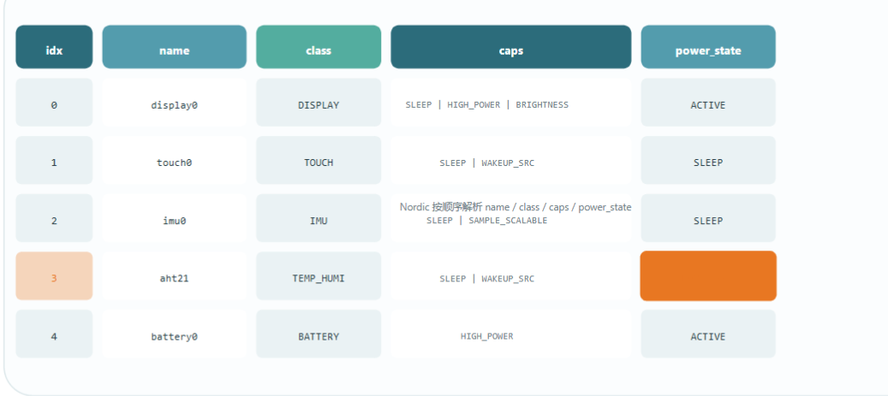

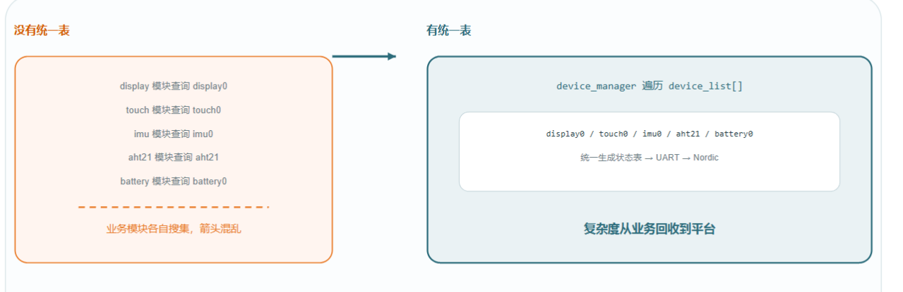

### 9.2 服务表

```c
static platform_service_t *g_service_table[] = {
    &g_log_service.base,
    &g_data_collect_service.base,
    &g_comm_service.base,
};
```

服务也可以统一初始化、统一启动、统一停止。

这样系统启动链路就可以变成：

```c
Platform_ErrorCode_t platform_system_start(void)
{
    PLATFORM_RETURN_IF_ERROR(platform_device_manager_init_all());
    PLATFORM_RETURN_IF_ERROR(platform_device_manager_start_all());

    PLATFORM_RETURN_IF_ERROR(platform_service_manager_init_all());
    PLATFORM_RETURN_IF_ERROR(platform_service_manager_start_all());

    return PLATFORM_OK;
}
```

这比在 `main()` 里堆满具体模块函数更适合长期维护。

---

## 10. 插桩：对象模型的横切能力

对象模型还有一个很重要的价值：插桩。

插桩就是在不改变具体业务逻辑的前提下，统一记录、监控、诊断对象行为。

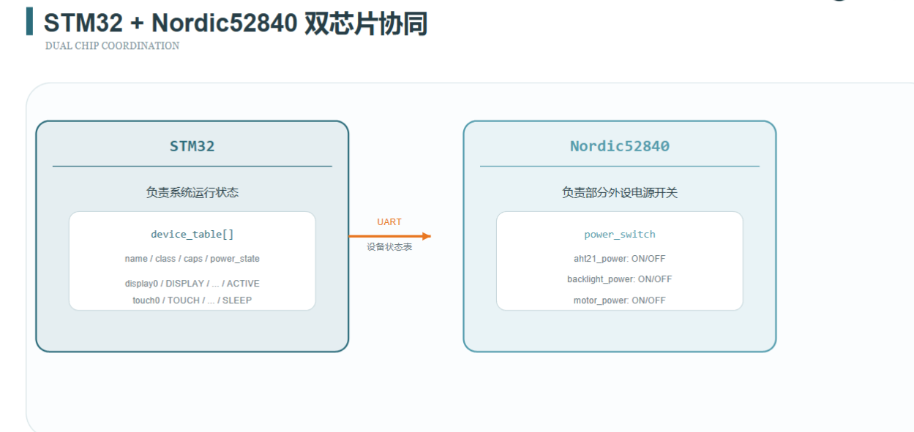

### 10.1 什么是面向切面编程

面向切面编程可以理解为：

> 把日志、性能统计、状态监控、错误诊断这类“横切关注点”，从具体业务代码里抽出来，统一放到公共入口处理。

例如每个设备的启动函数都需要记录日志。

不好的写法是每个设备都手写：

```c
platform_log_info("aht21 start");
platform_log_info("led start");
platform_log_info("flash start");
```

更好的写法是在公共设备启动接口里统一插桩：

```c
Platform_ErrorCode_t platform_device_start(platform_device_t *dev)
{
    Platform_ErrorCode_t ret;

    platform_trace_lifecycle_enter(&dev->object, "start");

    ret = dev->lifecycle_ops.start(dev);

    platform_trace_lifecycle_exit(&dev->object, "start", ret);

    return ret;
}
```

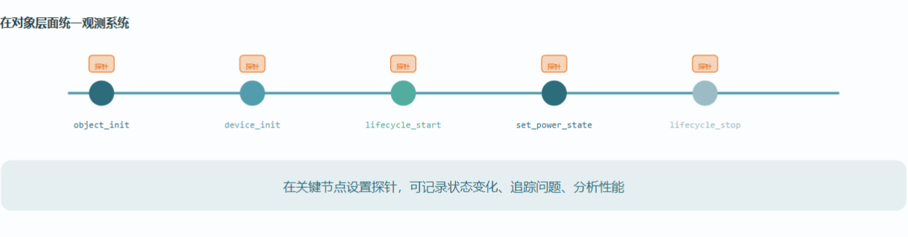

### 10.2 可以记录什么

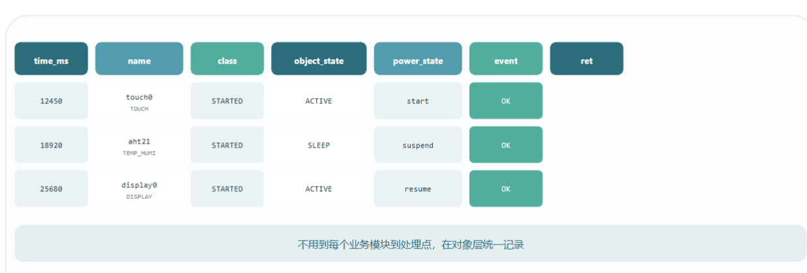

常见记录内容：

| 内容 | 作用 |
| --- | --- |
| 对象名称 | 知道是谁触发的事件 |
| 对象类型 | 区分设备、服务、应用 |
| 生命周期动作 | init、start、stop、deinit |
| 返回错误码 | 统一定位失败原因 |
| 耗时 | 发现启动慢、读写慢的模块 |
| 状态变化 | 观察 state/status/power_state |
| 线程或任务 ID | RTOS 下定位调度问题 |
| 时间戳 | 建立事件顺序 |

### 10.3 AI 插桩

当对象模型足够统一之后，后续接入 AI 诊断或自动分析会更容易。

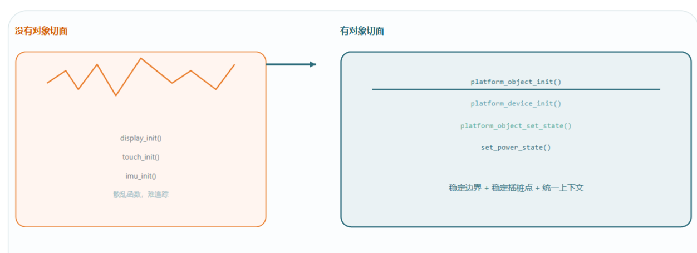

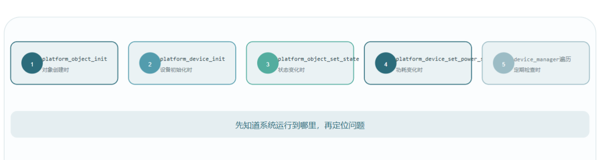

AI 或诊断系统不需要理解每个设备私有实现，只需要读取统一对象事件：

```text
time=120ms object=aht21 type=device action=init ret=OK cost=3ms
time=124ms object=aht21 type=device action=start ret=TIMEOUT cost=100ms
time=225ms object=data_service type=service action=start ret=NOT_READY
```

通过这些结构化事件，就能分析：

1. 哪个对象启动失败。
2. 失败前后发生了什么。
3. 是设备没准备好，还是服务依赖没满足。
4. 是超时、忙、参数错误，还是硬件错误。

### 10.4 AHT21 电源控制案例

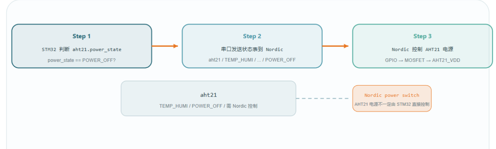

以 AHT21 为例，统一设备接口可以记录完整链路：

```text
platform_device_start(aht21)
    -> aht21_start()
        -> platform_i2c_write()
        -> platform_delay_ms()
        -> aht21_read_status()
    -> object.state = STARTED
    -> power_state = POWER_ON
```

进入低功耗时：

```text
platform_device_sleep(aht21)
    -> 检查 caps 是否支持 LOW_POWER
    -> aht21_stop()
    -> power_state = POWER_SLEEP
    -> object.state = STOPPED
```

这样调试时可以清晰看到 AHT21 为什么没有进入低功耗，或者为什么没有正常恢复。

---

## 11. 推荐目录结构

对象模型建议放在平台公共对象模块中，例如：

```text
03_platform/
├── platform_common/
│   ├── platform_common.h
│   ├── platform_types.h
│   ├── platform_error_code.h
│   └── platform_macro.h
│
├── platform_object/
│   ├── platform_object.h
│   ├── platform_object.c
│   ├── platform_lifecycle.h
│   └── platform_lifecycle.c
│
├── platform_device/
│   ├── platform_device.h
│   ├── platform_device.c
│   ├── platform_device_manager.h
│   └── platform_device_manager.c
│
└── platform_service/
    ├── platform_service.h
    ├── platform_service.c
    ├── platform_service_manager.h
    └── platform_service_manager.c
```

具体设备和服务可以放在：

```text
02_driver/
├── sensor/
│   ├── aht21_device.c
│   └── dht11_device.c
│
04_service/
├── log_service.c
├── data_collect_service.c
└── comm_service.c
```

注意边界：

```text
platform_object 只定义公共对象规则。
platform_device 只定义设备通用规则。
platform_service 只定义服务通用规则。
具体设备不要反过来污染公共对象定义。
```

---

## 12. 常见设计错误

### 错误 1：把所有字段都塞进 platform_object_t

错误示例：

```c
typedef struct
{
    const char *name;
    uint32_t gpio_pin;
    uint8_t i2c_addr;
    uint32_t flash_sector_size;
    uint8_t ble_mac[6];
} platform_object_t;
```

这种设计会让公共对象迅速臃肿。

改法：

```text
公共字段放 platform_object_t。
设备通用字段放 platform_device_t。
具体设备字段放具体设备对象。
```

### 错误 2：生命周期状态和运行状态混在一起

错误示例：

```c
typedef enum
{
    DEVICE_READY,
    DEVICE_ONLINE,
    DEVICE_STARTED,
    DEVICE_ERROR,
    DEVICE_SLEEP,
} device_state_t;
```

这里 `STARTED` 是生命周期，`ONLINE` 是运行状态，`SLEEP` 是电源状态，混在一起后会很难维护。

改法：

```text
object.state     管生命周期。
device.status    管健康状态。
device.power     管电源状态。
device.caps      管能力。
```

### 错误 3：上层直接调用具体设备函数

错误示例：

```c
aht21_start();
dht11_start();
flash_open();
```

改法：

```c
platform_device_start(&g_aht21.base);
platform_device_start(&g_dht11.base);
platform_device_start(&g_flash.base);
```

### 错误 4：函数指针没有判空

错误示例：

```c
dev->lifecycle_ops.start(dev);
```

改法：

```c
if (dev->lifecycle_ops.start != PLATFORM_NULL)
{
    return dev->lifecycle_ops.start(dev);
}
```

### 错误 5：对象没有统一初始化

错误示例：

```c
platform_device_t dev;
dev.object.name = "led";
```

改法：

```c
platform_object_init(&dev.object,
                     "led",
                     PLATFORM_OBJECT_TYPE_DEVICE,
                     PLATFORM_NULL);
```

或者用静态初始化，但要保证 `magic`、`type`、`state` 都正确。

---

## 13. 最小落地版本

初学阶段不要一开始就做得太复杂。

最小可以先实现这几个文件：

```text
platform_object.h
platform_object.c
platform_device.h
platform_device.c
platform_device_manager.c
```

最小结构体：

```c
typedef struct
{
    uint32_t magic;
    const char *name;
    platform_object_type_t type;
    platform_object_state_t state;
} platform_object_t;

typedef struct
{
    Platform_ErrorCode_t (*init)(void *ctx);
    Platform_ErrorCode_t (*start)(void *ctx);
    Platform_ErrorCode_t (*stop)(void *ctx);
} platform_lifecycle_ops_t;

typedef struct
{
    platform_object_t object;
    uint32_t caps;
    platform_lifecycle_ops_t lifecycle_ops;
} platform_device_t;
```

先做到：

1. 所有设备都有 `name/type/state`。
2. 所有设备都能放进设备表。
3. 所有设备都能统一 `init/start/stop`。
4. 所有设备都能统一打印状态。

等这套稳定后，再增加：

```text
power_state
status
parent
flags
user_data
service_manager
trace hook
AI instrumentation
```

---

## 14. 检查清单

设计对象模型时，可以用下面的问题检查：

1. `platform_object_t` 是否只放公共身份字段？
2. `platform_device_t` 的第一个字段是否是 `platform_object_t object`？
3. `platform_service_t` 的第一个字段是否是 `platform_object_t object`？
4. 设备和服务是否都有统一生命周期入口？
5. 生命周期状态和运行状态是否分开？
6. `caps` 是否表示能力，而不是当前状态？
7. 低功耗管理是否可以通过设备表统一处理？
8. 日志和诊断是否可以在公共入口统一插桩？
9. 上层是否不再直接关心具体设备的 `init/start/stop` 函数名？
10. 新增一个设备时，是否只需要实现自己的私有逻辑并注册到表里？

如果这些问题大多数答案是“是”，说明对象模型设计比较健康。

---

## 15. 最终记忆口诀

```text
object 管身份。
device 管硬件对象。
service 管系统能力。
state 管生命周期。
status 管健康状态。
caps 管能不能做。
power_state 管现在怎么供电。
ops 管具体怎么做。
manager 管统一编排。
trace 管统一观察。
```

对象模型的真正目的不是“抽象得高级”，而是让平台工程从“每个模块各写各的”变成“所有模块遵守同一套生命周期和管理规则”。

当你能把一个新设备放进设备表，并通过统一接口完成初始化、启动、停止、状态打印和低功耗处理时，说明你已经理解了平台化架构中对象模型设计的核心。
