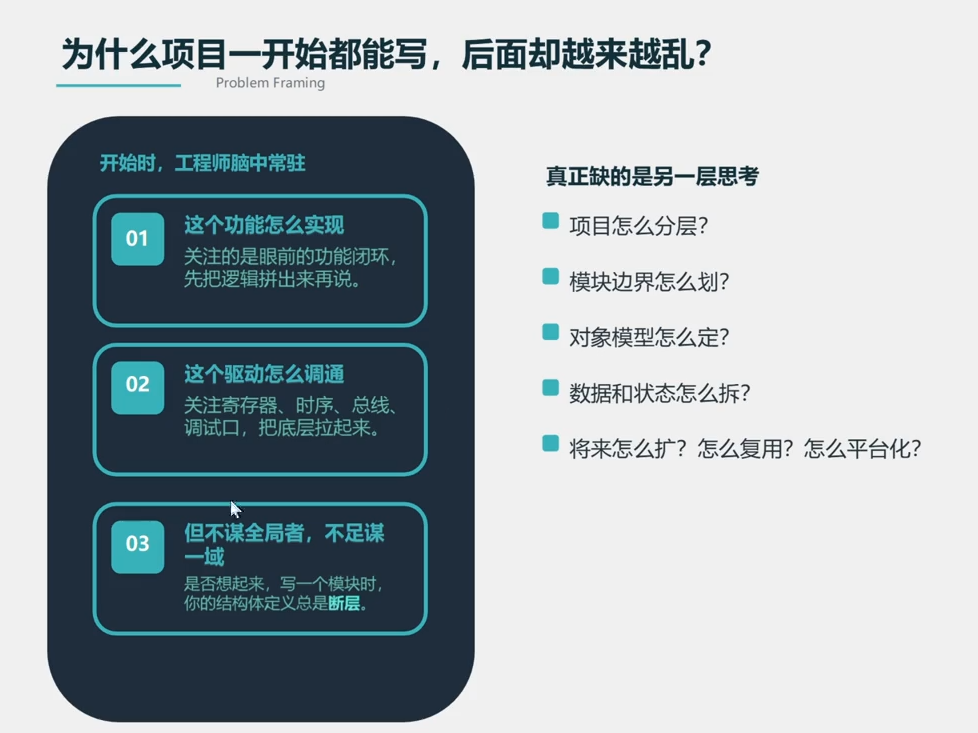
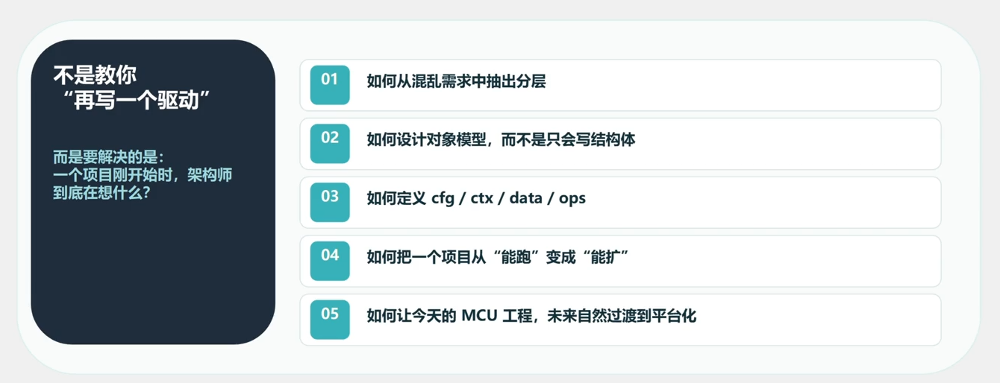
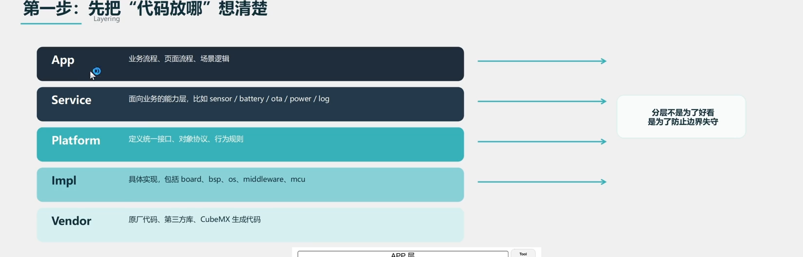
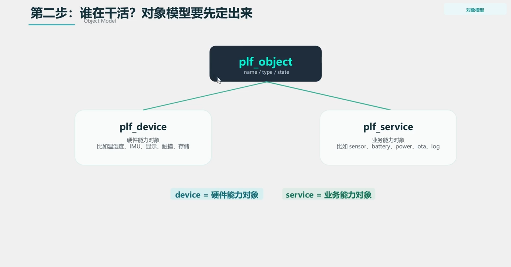
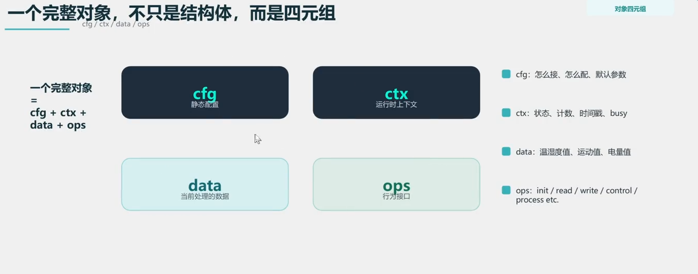

## 从架构师的视角看代码设计
### 从"先写起来“到可复用的程序

- 项目怎么分层
- 模块边界怎么划分
- 对象模型怎么定
- 数据和状态怎么拆
- 将来怎么维护和扩展？怎么复用？怎么平台化？

架构设计，不只是分层
架构设计 = 分层设计+对象模型设计+数据模型设计+管理模型设计+生命周期设计+依赖设计+配置设计+拓展设计
>分层只能做到代码结构上的清晰，对象模型设计这一些都需要进行分类的处理
>函数就是数据的分层

从架构师的角度去思考

1. 从混乱的需求中提炼出核心的功能和模块和分层
2. 如何设计对象模型
3. 如何定义cfg、ctx data ops 
4. 把一个项目从能跑到拓展

区分出基类和派生类

数据的解耦也就是发布-订阅模式，发布者和订阅者之间没有直接的依赖关系，通过事件总线进行通信，这样可以实现模块之间的解耦，提高系统的灵活性和可维护性。